# Phần 1.1: Cấu trúc Dữ liệu Chi tiết (Detailed Data Structures)

Tài liệu này là bản dịch và biên soạn chi tiết từ nguồn JavaGuide, bao gồm đầy đủ các giải thích, ví dụ code Java và hình ảnh minh họa.

---

## 1. Mảng (Array)

**Mảng (Array)** là một cấu trúc dữ liệu rất phổ biến. Nó bao gồm các phần tử (element) cùng kiểu dữ liệu và sử dụng một **khối bộ nhớ liên tục** để lưu trữ.

Chúng ta có thể sử dụng chỉ số (index) của phần tử để tính toán trực tiếp địa chỉ lưu trữ tương ứng của phần tử đó.

Đặc điểm của mảng: **Cung cấp truy cập ngẫu nhiên (random access)** và có dung lượng giới hạn.

**Độ phức tạp:**
```java
Giả sử mảng có độ dài là n.
Truy cập: O(1)  // Truy cập phần tử tại vị trí cụ thể
Chèn: O(n)     // Trường hợp xấu nhất xảy ra khi chèn vào đầu mảng và cần dịch chuyển tất cả các phần tử
Xóa: O(n)      // Trường hợp xấu nhất xảy ra khi xóa phần tử đầu tiên và cần dịch chuyển tất cả các phần tử phía sau
```


---

## 2. Danh sách Liên kết (Linked List)

### 2.1. Giới thiệu về Danh sách Liên kết

**Danh sách liên kết (LinkedList)** tuy là một cấu trúc tuyến tính, nhưng nó **không lưu trữ dữ liệu theo thứ tự tuyến tính** trong bộ nhớ, tức là nó **không sử dụng không gian bộ nhớ liên tục** để lưu trữ.

Các thao tác chèn và xóa của danh sách liên kết có độ phức tạp là O(1), chỉ cần biết phần tử trước vị trí đích. Tuy nhiên, khi tìm kiếm một nút hoặc truy cập nút ở vị trí cụ thể, độ phức tạp là O(n).

Sử dụng cấu trúc danh sách liên kết có thể khắc phục nhược điểm của mảng là cần biết trước kích thước dữ liệu. Cấu trúc danh sách liên kết có thể tận dụng tối đa không gian bộ nhớ của máy tính, thực hiện quản lý bộ nhớ động linh hoạt. Tuy nhiên, danh sách liên kết không tiết kiệm không gian, so với mảng, nó **chiếm nhiều không gian hơn vì mỗi nút trong danh sách liên kết còn lưu trữ con trỏ trỏ đến các nút khác**. Ngoài ra, danh sách liên kết không có ưu điểm truy cập ngẫu nhiên của mảng.

### 2.2. Phân loại Danh sách Liên kết

**Các loại danh sách liên kết phổ biến:**

1.  Danh sách liên kết đơn (Single Linked List)
2.  Danh sách liên kết đôi (Doubly Linked List)
3.  Danh sách liên kết vòng (Circular Linked List)
4.  Danh sách liên kết đôi vòng (Doubly Circular Linked List)

**Độ phức tạp:**
```java
Giả sử danh sách liên kết có n phần tử.
Truy cập: O(n)        // Truy cập phần tử tại vị trí cụ thể
Chèn/Xóa: O(1)       // Phải biết vị trí của phần tử cần chèn
```

#### 2.2.1. Danh sách Liên kết Đơn

**Danh sách liên kết đơn** chỉ có một hướng, mỗi nút chỉ có một con trỏ hậu kế (next) trỏ đến nút phía sau. Do đó, cấu trúc dữ liệu danh sách liên kết thường **không liên tục về mặt vật lý** trong bộ nhớ. Chúng ta thường gọi nút đầu tiên là **nút đầu (head node)**, danh sách liên kết thường có một nút head không lưu giá trị nào, thông qua nút head chúng ta có thể duyệt toàn bộ danh sách liên kết. Nút cuối thường trỏ đến null.


#### 2.2.2. Danh sách Liên kết Vòng

**Danh sách liên kết vòng** thực ra là một dạng đặc biệt của danh sách liên kết đơn, khác với danh sách liên kết đơn ở chỗ nút cuối không trỏ đến null mà trỏ về nút đầu của danh sách liên kết.


#### 2.2.3. Danh sách Liên kết Đôi

**Danh sách liên kết đôi** bao gồm hai con trỏ, một con trỏ prev trỏ đến nút trước, một con trỏ next trỏ đến nút sau.


#### 2.2.4. Danh sách Liên kết Đôi Vòng

**Danh sách liên kết đôi vòng**: next của nút cuối cùng trỏ đến head, prev của head trỏ đến nút cuối cùng, tạo thành một vòng.


### 2.3. Kịch bản Ứng dụng

*   Nếu cần hỗ trợ truy cập ngẫu nhiên, danh sách liên kết không thể làm được.
*   Nếu số lượng phần tử dữ liệu cần lưu trữ không xác định và cần thường xuyên thêm/xóa dữ liệu, sử dụng danh sách liên kết phù hợp hơn.
*   Nếu số lượng phần tử dữ liệu cần lưu trữ đã xác định và không cần thường xuyên thêm/xóa dữ liệu, sử dụng mảng phù hợp hơn.

### 2.4. Mảng so với Danh sách Liên kết

*   Mảng hỗ trợ truy cập ngẫu nhiên, trong khi danh sách liên kết không.
*   Mảng sử dụng không gian bộ nhớ liên tục, **thân thiện với cơ chế bộ nhớ cache của CPU**, danh sách liên kết thì ngược lại.
*   Kích thước mảng cố định, trong khi danh sách liên kết tự nhiên hỗ trợ mở rộng động. Nếu mảng khai báo quá nhỏ, cần phải cấp phát một vùng nhớ lớn hơn để chứa các phần tử mảng, sau đó sao chép mảng ban đầu vào, thao tác này khá tốn thời gian!

---

## 3. Ngăn xếp (Stack)

### 3.1. Giới thiệu về Ngăn xếp

**Ngăn xếp (Stack)** chỉ cho phép thêm dữ liệu (push) và xóa dữ liệu (pop) ở một đầu (gọi là đỉnh ngăn xếp - top) của tập dữ liệu tuyến tính có thứ tự. Do đó, nó hoạt động theo nguyên lý **Vào sau Ra trước (LIFO, Last In First Out)**. **Trong ngăn xếp, các thao tác push và pop đều xảy ra ở đỉnh ngăn xếp.**

Ngăn xếp thường được triển khai bằng mảng một chiều hoặc danh sách liên kết. Ngăn xếp triển khai bằng mảng gọi là **ngăn xếp tuần tự**, triển khai bằng danh sách liên kết gọi là **ngăn xếp liên kết**.

**Độ phức tạp:**
```java
Giả sử ngăn xếp có n phần tử.
Truy cập: O(n)        // Trường hợp xấu nhất
Chèn/Xóa: O(1)       // Chèn và xóa phần tử ở đỉnh
```


### 3.2. Kịch bản Ứng dụng Phổ biến của Ngăn xếp

Khi dữ liệu chúng ta cần xử lý chỉ liên quan đến việc chèn và xóa ở một đầu, đồng thời thỏa mãn đặc tính **Vào sau Ra trước (LIFO)**, chúng ta có thể sử dụng cấu trúc dữ liệu ngăn xếp.

#### 3.2.1. Triển khai chức năng Quay lại và Tiến lên của Trình duyệt

Chúng ta chỉ cần sử dụng hai ngăn xếp (Stack1 và Stack2) là có thể triển khai chức năng này. Ví dụ bạn xem lần lượt 4 trang 1, 2, 3, 4, chúng ta lần lượt đẩy 1, 2, 3, 4 vào Stack1. Khi bạn muốn quay lại xem trang 2, bạn nhấn nút quay lại, chúng ta lần lượt lấy ra 4, 3 từ Stack1, sau đó đẩy vào Stack2. Giả sử bạn lại muốn quay lại trang 3, bạn nhấn nút tiến lên, chúng ta sẽ lấy 3 ra khỏi Stack2, sau đó đẩy vào Stack1.


#### 3.2.2. Kiểm tra Ngoặc có Thành cặp không

> Cho một chuỗi chỉ chứa `'('`, `')'`, `'{'`, `'}'`, `'['`, `']'`, hãy kiểm tra xem chuỗi có hợp lệ không.
>
> Chuỗi hợp lệ cần thỏa mãn:
> 1. Ngoặc mở phải được đóng bằng ngoặc đóng cùng loại.
> 2. Ngoặc mở phải được đóng theo đúng thứ tự.
>
> Ví dụ: "()", "()[]{}", "{[]}" đều là chuỗi hợp lệ, trong khi "(]", "([)]" thì không.

Đây thực ra là một bài toán trên Leetcode, chúng ta có thể sử dụng ngăn xếp `Stack` để giải quyết vấn đề này.

1.  Đầu tiên, chúng ta lưu quy tắc đối ứng giữa các ngoặc vào `Map`, điều này không cần bàn cãi;
2.  Tạo một ngăn xếp. Duyệt qua chuỗi, nếu ký tự là ngoặc mở thì đẩy trực tiếp vào `stack`, ngược lại so sánh phần tử đỉnh của `stack` với ngoặc này, nếu không bằng nhau thì trả về false ngay. Kết thúc duyệt, nếu `stack` rỗng, trả về `true`.

**Code Java:**
```java
public boolean isValid(String s){
    // Quy tắc đối ứng giữa các ngoặc
    HashMap<Character, Character> mappings = new HashMap<Character, Character>();
    mappings.put(')', '(');
    mappings.put('}', '{');
    mappings.put(']', '[');
    Stack<Character> stack = new Stack<Character>();
    char[] chars = s.toCharArray();
    for (int i = 0; i < chars.length; i++) {
        if (mappings.containsKey(chars[i])) {
            char topElement = stack.empty() ? '#' : stack.pop();
            if (topElement != mappings.get(chars[i])) {
                return false;
            }
        } else {
            stack.push(chars[i]);
        }
    }
    return stack.isEmpty();
}
```

#### 3.2.3. Đảo ngược Chuỗi

Đẩy từng ký tự trong chuỗi vào ngăn xếp rồi lấy ra là xong.

#### 3.2.4. Quản lý Lời gọi Hàm

Hàm được gọi cuối cùng phải hoàn thành thực thi trước, phù hợp với đặc tính **Vào sau Ra trước (LIFO)** của ngăn xếp.
Ví dụ, lời gọi hàm đệ quy có thể được triển khai thông qua ngăn xếp, mỗi lần gọi đệ quy sẽ đẩy tham số và địa chỉ trả về vào ngăn xếp.

#### 3.2.5. Duyệt theo Chiều sâu (DFS)

Trong quá trình tìm kiếm theo chiều sâu, ngăn xếp được sử dụng để lưu đường dẫn tìm kiếm, để có thể quay lui về tầng trên.

### 3.3. Triển khai Ngăn xếp

Ngăn xếp có thể được triển khai bằng mảng hoặc danh sách liên kết. Dù dựa trên mảng hay danh sách liên kết, độ phức tạp thời gian của thao tác push, pop đều là O(1).

Dưới đây chúng ta sử dụng mảng để triển khai một ngăn xếp với các phương thức cơ bản: `push()`, `pop()` (trả về phần tử đỉnh và lấy ra), `peek()` (trả về phần tử đỉnh không lấy ra), `isEmpty()`, `size()`.

> Lưu ý: Trước mỗi lần push, kiểm tra xem dung lượng ngăn xếp có đủ không, nếu không đủ thì dùng `Arrays.copyOf()` để mở rộng.

**Code Java - Triển khai Ngăn xếp bằng Mảng:**
```java
public class MyStack {
    private int[] storage;      // Mảng lưu trữ các phần tử trong ngăn xếp
    private int capacity;       // Dung lượng của ngăn xếp
    private int count;          // Số lượng phần tử trong ngăn xếp
    private static final int GROW_FACTOR = 2;

    // Constructor không tham số. Dung lượng mặc định là 8
    public MyStack() {
        this.capacity = 8;
        this.storage = new int[8];
        this.count = 0;
    }

    // Constructor có tham số dung lượng ban đầu
    public MyStack(int initialCapacity) {
        if (initialCapacity < 1)
            throw new IllegalArgumentException("Capacity too small.");
        this.capacity = initialCapacity;
        this.storage = new int[initialCapacity];
        this.count = 0;
    }

    // Đẩy vào ngăn xếp (push)
    public void push(int value) {
        if (count == capacity) {
            ensureCapacity();
        }
        storage[count++] = value;
    }

    // Đảm bảo đủ dung lượng
    private void ensureCapacity() {
        int newCapacity = capacity * GROW_FACTOR;
        storage = Arrays.copyOf(storage, newCapacity);
        capacity = newCapacity;
    }

    // Trả về phần tử đỉnh và lấy ra (pop)
    public int pop() {
        if (count == 0)
            throw new IllegalArgumentException("Stack is empty.");
        count--;
        return storage[count];
    }

    // Trả về phần tử đỉnh không lấy ra (peek)
    public int peek() {
        if (count == 0){
            throw new IllegalArgumentException("Stack is empty.");
        } else {
            return storage[count-1];
        }
    }

    // Kiểm tra ngăn xếp có rỗng không
    public boolean isEmpty() {
        return count == 0;
    }

    // Trả về số lượng phần tử trong ngăn xếp
    public int size() {
        return count;
    }
}
```

**Kiểm tra:**
```java
MyStack myStack = new MyStack(3);
myStack.push(1);
myStack.push(2);
myStack.push(3);
myStack.push(4);
myStack.push(5);
myStack.push(6);
myStack.push(7);
myStack.push(8);
System.out.println(myStack.peek());  // 8
System.out.println(myStack.size());  // 8
for (int i = 0; i < 8; i++) {
    System.out.println(myStack.pop());
}
System.out.println(myStack.isEmpty());  // true
myStack.pop();  // Lỗi: java.lang.IllegalArgumentException: Stack is empty.
```

---

## 4. Hàng đợi (Queue)

### 4.1. Giới thiệu về Hàng đợi

**Hàng đợi (Queue)** là cấu trúc tuyến tính hoạt động theo nguyên lý **Vào trước Ra trước (FIFO, First In, First Out)**. Trong ứng dụng thực tế, thường triển khai bằng danh sách liên kết hoặc mảng, triển khai bằng mảng gọi là **hàng đợi tuần tự**, bằng danh sách liên kết gọi là **hàng đợi liên kết**. **Hàng đợi chỉ cho phép chèn (enqueue) ở phía sau (rear) và xóa (dequeue) ở phía trước (front).**

Cách thức hoạt động của hàng đợi tương tự như ngăn xếp, điểm khác biệt duy nhất là hàng đợi chỉ cho phép thêm dữ liệu mới ở phía sau.

**Độ phức tạp:**
```java
Giả sử hàng đợi có n phần tử.
Truy cập: O(n)        // Trường hợp xấu nhất
Chèn/Xóa: O(1)       // Chèn ở phía sau, xóa ở phía trước
```


### 4.2. Phân loại Hàng đợi

#### 4.2.1. Hàng đợi Đơn

Hàng đợi đơn là hàng đợi phổ biến, mỗi lần thêm phần tử đều thêm vào cuối hàng đợi. Hàng đợi đơn chia thành **hàng đợi tuần tự (triển khai bằng mảng)** và **hàng đợi liên kết (triển khai bằng danh sách liên kết)**.

**Hàng đợi tuần tự tồn tại vấn đề "tràn giả"**, tức là rõ ràng còn chỗ nhưng không thể thêm.

Giả sử hình dưới là một hàng đợi tuần tự, chúng ta lấy hai phần tử 1, 2 ra khỏi hàng đợi, và thêm hai phần tử 7, 8 vào. Khi thực hiện các thao tác enqueue, dequeue, cả front và rear đều sẽ tiếp tục di chuyển về phía sau, khi rear di chuyển đến cuối, chúng ta không thể thêm dữ liệu vào hàng đợi nữa, mặc dù mảng vẫn còn không gian trống, hiện tượng này gọi là **"tràn giả"**. Ngoài vấn đề tràn giả, như hình dưới cho thấy, khi thêm phần tử 8, con trỏ rear di chuyển ra ngoài mảng (tràn).

> Để tránh tình huống khi chỉ có một phần tử mà đầu hàng đợi và cuối hàng đợi trùng nhau gây khó xử lý, nên đưa vào hai con trỏ, con trỏ front trỏ đến phần tử đầu hàng đợi, con trỏ rear trỏ đến vị trí tiếp theo của phần tử cuối cùng trong hàng đợi, như vậy khi front bằng rear, hàng đợi này không phải còn một phần tử mà là hàng đợi rỗng. — Trích "Đại thoại Cấu trúc Dữ liệu"


#### 4.2.2. Hàng đợi Vòng (Circular Queue)

Hàng đợi vòng có thể giải quyết vấn đề tràn giả và tràn của hàng đợi tuần tự. Cách giải quyết là: bắt đầu lại từ đầu, như vậy sẽ hình thành vòng nối đầu đuôi, đây cũng là nguồn gốc tên gọi hàng đợi vòng.

Vẫn dùng hình trên, chúng ta để con trỏ rear trỏ đến vị trí có chỉ số 0 của mảng thì sẽ không có vấn đề tràn nữa. Khi chúng ta thêm phần tử vào hàng đợi, rear di chuyển về phía sau.


Trong hàng đợi tuần tự, chúng ta nói khi `front==rear` thì hàng đợi rỗng, trong hàng đợi vòng thì khác, cũng có thể là đầy, như hình trên cho thấy. Có hai cách giải quyết:

1.  Có thể đặt một biến cờ `flag`, khi `front==rear` và `flag=0` thì hàng đợi rỗng, khi `front==rear` và `flag=1` thì hàng đợi đầy.
2.  Khi hàng đợi rỗng thì `front==rear`, khi hàng đợi đầy, chúng ta đảm bảo mảng vẫn còn một vị trí trống, rear trỏ đến vị trí trống này, như hình dưới, lúc này điều kiện kiểm tra hàng đợi đầy là: `(rear+1) % QueueSize == front`.

#### 4.2.3. Hàng đợi Hai đầu (Deque - Double-ended Queue)

**Hàng đợi hai đầu (Deque)** là một hàng đợi có thể thực hiện thao tác chèn và xóa ở cả hai đầu, linh hoạt hơn so với hàng đợi đơn.

Thông thường, chúng ta có thể thực hiện các thao tác `addFirst`, `addLast`, `removeFirst` và `removeLast` trên hàng đợi hai đầu.

#### 4.2.4. Hàng đợi Ưu tiên (Priority Queue)

**Hàng đợi ưu tiên (Priority Queue)** về mặt cấu trúc bên dưới không phải là cấu trúc dữ liệu tuyến tính, nó thường được triển khai bằng **Heap (Đống)**.

1.  Khi mỗi phần tử được thêm vào hàng đợi, hàng đợi ưu tiên sẽ chèn phần tử mới vào heap và điều chỉnh heap.
2.  Khi lấy phần tử đầu hàng đợi ra, hàng đợi ưu tiên sẽ trả về phần tử đỉnh heap và điều chỉnh heap.

Về triển khai cụ thể của heap, xem phần Heap bên dưới.

Tóm lại, dù chúng ta thực hiện thao tác gì, hàng đợi ưu tiên đều có thể thực hiện một loạt thao tác liên quan đến heap theo **một phương thức sắp xếp nào đó**, từ đó đảm bảo **tính có thứ tự** của toàn bộ tập hợp.

Mặc dù cấu trúc bên dưới của hàng đợi ưu tiên không phải là cấu trúc tuyến tính nghiêm ngặt, nhưng trong quá trình sử dụng, chúng ta không cảm nhận được **heap**, từ góc nhìn của người dùng, hàng đợi ưu tiên có thể được coi là một cấu trúc dữ liệu tuyến tính: một loại hàng đợi tuyến tính sẽ tự động sắp xếp.

### 4.3. Kịch bản Ứng dụng Phổ biến của Hàng đợi

Khi chúng ta cần xử lý dữ liệu theo một thứ tự nhất định, có thể cân nhắc sử dụng cấu trúc dữ liệu hàng đợi.

*   **Hàng đợi Chặn (Blocking Queue):** Hàng đợi chặn có thể coi là hàng đợi với thao tác chặn được thêm vào. Khi hàng đợi rỗng, thao tác dequeue bị chặn, khi hàng đợi đầy, thao tác enqueue bị chặn. Sử dụng hàng đợi chặn, chúng ta có thể dễ dàng triển khai mô hình "Producer - Consumer".
*   **Hàng đợi Yêu cầu/Tác vụ trong Thread Pool:** Khi Thread Pool không có thread rỗi, các yêu cầu tác vụ mới sẽ được xử lý như thế nào? Câu trả lời là các tác vụ này sẽ được đặt vào hàng đợi tác vụ, chờ thread trong Thread Pool rảnh rồi lấy tác vụ ra khỏi hàng đợi để thực thi. Hàng đợi tác vụ chia thành hàng đợi không giới hạn (triển khai bằng danh sách liên kết) và hàng đợi có giới hạn (triển khai bằng mảng). Đặc điểm của hàng đợi không giới hạn là dung lượng hàng đợi về lý thuyết không có giới hạn, tác vụ có thể liên tục được thêm vào cho đến khi cạn kiệt tài nguyên hệ thống. Ví dụ: `FixedThreadPool` sử dụng hàng đợi chặn `LinkedBlockingQueue`, dung lượng mặc định là `Integer.MAX_VALUE`, do đó có thể coi là "hàng đợi không giới hạn". Trong khi hàng đợi có giới hạn thì khác, khi hàng đợi đầy, nếu có tác vụ mới được gửi, vì hàng đợi không thể tiếp tục chứa tác vụ, Thread Pool sẽ từ chối các tác vụ này và ném ra ngoại lệ `java.util.concurrent.RejectedExecutionException`.
*   **Ngăn xếp:** Hàng đợi hai đầu tự nhiên có thể triển khai toàn bộ chức năng của ngăn xếp (`push`, `pop` và `peek`), và trong interface Deque đã triển khai các phương thức liên quan. Lớp Stack đã bị lỗi thời cùng với Vector, hiện nay trong Java thường sử dụng hàng đợi hai đầu (Deque) để triển khai ngăn xếp.
*   **Tìm kiếm theo Chiều rộng (BFS):** Trong quá trình tìm kiếm theo chiều rộng của đồ thị, hàng đợi được sử dụng để lưu trữ các nút cần truy cập, đảm bảo duyệt các nút của đồ thị theo thứ tự tầng.
*   Hàng đợi tiến trình của nhân Linux (sắp xếp theo độ ưu tiên)
*   Danh sách phát trong trình phát nhạc
*   Hàng đợi tin nhắn (Message Queue)
*   V.v...

---

## 5. Cây (Tree)

Cây là một cấu trúc dữ liệu tương tự như cây trong thực tế (cây lộn ngược). Bất kỳ cây không rỗng nào cũng chỉ có một nút gốc.

Một cây có các đặc điểm sau:

1.  Giữa hai nút bất kỳ trong cây có duy nhất một đường đi nối chúng.
2.  Nếu một cây có n nút, thì nó chắc chắn có đúng n-1 cạnh.
3.  Cây không chứa chu trình (cycle).


Qua hình trên, chúng ta giải thích các khái niệm thường dùng trong cây:

*   **Nút (Node)**: Mỗi phần tử trong cây đều có thể gọi chung là nút.
*   **Nút gốc (Root node)**: Nút trên cùng hoặc nút không có nút cha. Trong hình trên, nút A là nút gốc.
*   **Nút cha (Parent node)**: Nếu một nút chứa nút con, thì nút đó được gọi là nút cha của các nút con đó. Trong hình trên, nút B là nút cha của nút D và E.
*   **Nút con (Child node)**: Nút gốc của cây con mà một nút chứa được gọi là nút con của nút đó. Trong hình trên, D và E là các nút con của B.
*   **Nút anh em (Sibling nodes)**: Các nút có cùng nút cha được gọi là nút anh em. Trong hình trên, D và E có cùng nút cha là B, nên D và E là anh em.
*   **Nút lá (Leaf node)**: Nút không có nút con. Trong hình trên, D, F, H, I đều là nút lá.
*   **Chiều cao của nút (Height)**: Đường đi dài nhất từ nút đó đến nút lá (số cạnh).
*   **Độ sâu của nút (Depth)**: Đường đi từ nút gốc đến nút đó (số cạnh).
*   **Số tầng của nút (Level)**: Độ sâu + 1.
*   **Chiều cao của cây (Tree Height)**: Chiều cao của nút gốc.

### 5.1. Phân loại Cây Nhị phân

**Cây nhị phân (Binary tree)** là cấu trúc cây mà mỗi nút có tối đa hai nhánh (tức là không tồn tại nút có bậc lớn hơn 2).

Nhánh của **cây nhị phân** thường được gọi là "**cây con trái**" hoặc "**cây con phải**". Và các nhánh của **cây nhị phân** có thứ tự trái phải, không thể đảo ngẫu nhiên.

**Cây nhị phân** ở tầng thứ i có tối đa `2^(i-1)` nút, cây nhị phân có độ sâu k có tổng cộng tối đa `2^(k+1)-1` nút (trường hợp cây nhị phân đầy đủ), tối thiểu có `2^k` nút.

#### 5.1.1. Cây Nhị phân Đầy đủ (Full Binary Tree)

Một cây nhị phân, nếu số nút ở mỗi tầng đều đạt giá trị tối đa, thì cây nhị phân này là **cây nhị phân đầy đủ**. Nghĩa là, nếu một cây nhị phân có K tầng và tổng số nút là (2^K) - 1, thì nó là **cây nhị phân đầy đủ**.


#### 5.1.2. Cây Nhị phân Hoàn chỉnh (Complete Binary Tree)

Ngoại trừ tầng cuối cùng, nếu các tầng còn lại đều đầy, và tầng cuối cùng cũng đầy hoặc thiếu một số nút liên tiếp ở phía bên phải, thì cây nhị phân này là **cây nhị phân hoàn chỉnh**.

Bạn có thể tưởng tượng một cây bắt đầu mở rộng từ nút gốc, mở rộng xong nút con trái mới có thể bắt đầu mở rộng nút con phải, mở rộng xong một tầng mới có thể tiếp tục mở rộng tầng tiếp theo.


Cây nhị phân hoàn chỉnh có một tính chất rất tốt: **Nút cha và nút con có mối quan hệ tương ứng về số thứ tự.**

Bạn tinh ý có thể phát hiện ra, khi giá trị nút gốc là 1, nếu số thứ tự của nút cha là i, thì số thứ tự nút con trái là 2i, số thứ tự nút con phải là 2i+1. Tính chất này giúp cây nhị phân hoàn chỉnh khi lưu trữ bằng mảng có thể **tiết kiệm không gian đáng kể**, cũng như có thể sử dụng số thứ tự để tìm nút cha và nút con của một nút nào đó.

#### 5.1.3. Cây Nhị phân Cân bằng (Balanced Binary Tree)

**Cây nhị phân cân bằng** là một cây tìm kiếm nhị phân, đồng thời có các tính chất sau:

1.  Có thể là cây rỗng.
2.  Nếu không phải cây rỗng, chênh lệch chiều cao giữa cây con trái và cây con phải của nó không vượt quá 1, và cả cây con trái và cây con phải đều là cây nhị phân cân bằng.

Các phương pháp triển khai phổ biến của cây nhị phân cân bằng bao gồm **Cây Đỏ-Đen (Red-Black Tree)**, **Cây AVL**, **Cây Tội Đồ (Scapegoat Tree)**, **Cây Cân bằng Trọng số (Weight Balanced Tree)**, **Cây Splay** v.v.

Trước khi giới thiệu cây nhị phân cân bằng, hãy xem một cây:


**Bạn gọi thứ này là cây sao???**

Đúng vậy, thứ này thực sự là cây, chỉ là cây này đã thoái hóa thành một danh sách liên kết, chúng ta gọi nó là **cây xiên (Skewed Tree)**.

**Nếu vậy, tại sao tôi không dùng trực tiếp danh sách liên kết?**

Ai bảo không đúng cơ chứ?

So với danh sách liên kết, cây nhị phân, do nút cha con và nút anh em thường có một số mối quan hệ đặc biệt, mối quan hệ này giúp chúng ta khi **tìm kiếm** và **sửa đổi** dữ liệu trong cây, nhanh chóng và thuận tiện hơn so với danh sách liên kết.

Tuy nhiên, nếu cây nhị phân thoái hóa thành một danh sách liên kết rồi, thì các tính chất ưu việt của cây khó mà thể hiện được, hiệu suất cũng sẽ giảm đáng kể. Để tránh tình huống này, chúng ta hy vọng mỗi nút "cha mẹ" đều **công bằng**, phân cho con trái và con phải càng bằng nhau càng tốt, chênh lệch tối đa không quá một tầng:


### 5.2. Lưu trữ Cây Nhị phân

Lưu trữ cây nhị phân chủ yếu chia thành **lưu trữ liên kết** và **lưu trữ tuần tự**:

#### 5.2.1. Lưu trữ Liên kết

Tương tự như danh sách liên kết, lưu trữ liên kết của cây nhị phân dựa vào con trỏ để nối các nút với nhau, không cần không gian lưu trữ liên tục.

Mỗi nút bao gồm ba thuộc tính:
*   Dữ liệu `data`. data không nhất thiết là dữ liệu đơn lẻ, tùy theo tình huống khác nhau, có thể là nhiều dữ liệu với các kiểu dữ liệu khác nhau.
*   Con trỏ nút trái `left`
*   Con trỏ nút phải `right`

Nhưng JAVA không có con trỏ! → Thì tham chiếu trực tiếp đối tượng vậy.


#### 5.2.2. Lưu trữ Tuần tự

Lưu trữ tuần tự là sử dụng mảng để lưu trữ, mỗi vị trí trong mảng chỉ lưu trữ data của nút, không lưu trữ con trỏ nút con trái phải, chỉ số của nút con được hoàn thành thông qua chỉ số mảng. Số thứ tự của nút gốc là 1, với mỗi nút Node, giả sử nó được lưu trữ ở vị trí có chỉ số i trong mảng, thì nút con trái của nó được lưu trữ ở vị trí 2i, nút con phải của nó được lưu trữ ở vị trí 2i+1.

Lưu trữ tuần tự bằng mảng của một cây nhị phân hoàn chỉnh:


Có thể thấy, nếu cây nhị phân chúng ta cần lưu trữ không phải là cây nhị phân hoàn chỉnh, trong mảng sẽ xuất hiện khoảng trống, dẫn đến **lãng phí bộ nhớ**.

### 5.3. Duyệt Cây Nhị phân

#### 5.3.1. Duyệt Tiền thứ tự (Pre-order Traversal)


Duyệt tiền thứ tự cây nhị phân là **xuất gốc trước, sau đó duyệt cây con trái, cuối cùng duyệt cây con phải**. Khi duyệt cây con trái và cây con phải, cũng tuân theo quy tắc duyệt tiền thứ tự, nghĩa là chúng ta có thể triển khai duyệt tiền thứ tự bằng đệ quy.

**Code Java:**
```java
public void preOrder(TreeNode root){
    if(root == null){
        return;
    }
    System.out.println(root.data);
    preOrder(root.left);
    preOrder(root.right);
}
```

#### 5.3.2. Duyệt Trung thứ tự (In-order Traversal)


Duyệt trung thứ tự cây nhị phân là **duyệt đệ quy trung thứ tự cây con trái trước, sau đó xuất giá trị nút gốc, cuối cùng duyệt đệ quy trung thứ tự cây con phải**. Bạn có thể tưởng tượng như dùng tay đập dẹt cây xuống, nút cha bị ép xuống giữa nút con trái và nút con phải:


**Code Java:**
```java
public void inOrder(TreeNode root){
    if(root == null){
        return;
    }
    inOrder(root.left);
    System.out.println(root.data);
    inOrder(root.right);
}
```

#### 5.3.3. Duyệt Hậu thứ tự (Post-order Traversal)


Duyệt hậu thứ tự cây nhị phân là **duyệt đệ quy hậu thứ tự cây con trái trước, rồi duyệt đệ quy hậu thứ tự cây con phải, cuối cùng xuất giá trị nút gốc**.

**Code Java:**
```java
public void postOrder(TreeNode root){
    if(root == null){
        return;
    }
    postOrder(root.left);
    postOrder(root.right);
    System.out.println(root.data);
}
```

---

## 6. Đống (Heap)

### 6.1. Heap là gì?

**Heap** là một cây thỏa mãn điều kiện sau:

Mỗi nút trong heap có giá trị **lớn hơn hoặc bằng** (hoặc **nhỏ hơn hoặc bằng**) giá trị của tất cả các nút trong cây con của nó. Nói cách khác, giá trị của bất kỳ nút nào cũng lớn hơn hoặc bằng (hoặc nhỏ hơn hoặc bằng) giá trị của tất cả các nút con.

> Bạn có thể hiểu Heap (Max Heap) như một công ty, công ty này rất công bằng, ai có năng lực mạnh thì làm sếp, không có ai yếu mà làm sếp, người dưới quyền chắc chắn không mạnh hơn sếp.

**Lưu ý đặc biệt:**
*   Nhiều blog nói heap là cây nhị phân hoàn chỉnh, thực ra không phải vậy. **Heap không nhất thiết là cây nhị phân hoàn chỉnh**, chỉ là để tiện lưu trữ và truy cập, chúng ta thường dùng dạng cây nhị phân hoàn chỉnh để biểu diễn heap. Thực tế, Fibonacci Heap và Binomial Heap nổi tiếng không phải là cây nhị phân hoàn chỉnh, chúng thậm chí không phải là cây nhị phân.
*   **(Binary) Heap là một mảng, có thể coi như một cây nhị phân gần hoàn chỉnh.** — *"Giải thuật Dẫn luận" ấn bản 3*

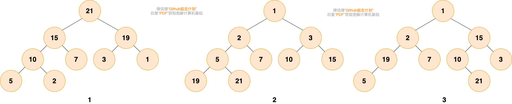

Hình 1 và 2 là heap. Hình 1 là Max Heap, mỗi nút đều lớn hơn tất cả các nút trong cây con. Hình 2 là Min Heap, mỗi nút đều nhỏ hơn tất cả các nút trong cây con.

Hình 3 không phải heap, vì nút gốc 1 nhỏ hơn 2 và 15, nhưng 15 lại lớn hơn 3, 19 lớn hơn 5, không thỏa mãn tính chất heap.

### 6.2. Mục đích của Heap

Khi chúng ta chỉ quan tâm đến giá trị lớn nhất hoặc nhỏ nhất trong tất cả dữ liệu, tồn tại nhiều lần lấy giá trị lớn nhất hoặc nhỏ nhất, nhiều lần chèn hoặc xóa dữ liệu, có thể sử dụng heap.

Có bạn có thể nghĩ đến mảng có thứ tự, khởi tạo mảng có thứ tự có độ phức tạp thời gian là `O(nlog(n))`, tìm giá trị lớn nhất hoặc nhỏ nhất có độ phức tạp là `O(1)`, nhưng khi liên quan đến cập nhật (chèn hoặc xóa) dữ liệu, độ phức tạp thời gian là `O(n)`, dù sử dụng tìm kiếm nhị phân với độ phức tạp `O(log(n))` để tìm dữ liệu cần chèn hoặc xóa, khi di chuyển dữ liệu vẫn cần độ phức tạp thời gian `O(n)`.

**So với mảng có thứ tự, ưu điểm chính của heap là hiệu suất chèn và xóa dữ liệu cao hơn.** Vì heap được triển khai dựa trên cây nhị phân hoàn chỉnh, khi chèn và xóa dữ liệu, chỉ cần di chuyển nút lên xuống trong cây nhị phân, độ phức tạp thời gian là `O(log(n))`, so với `O(n)` của mảng có thứ tự, hiệu suất cao hơn.

Tuy nhiên, cần lưu ý: Độ phức tạp thời gian khởi tạo Heap là `O(n)`, không phải `O(nlogn)`.

### 6.3. Phân loại Heap

Heap chia thành **Max Heap** và **Min Heap**. Điểm khác biệt giữa hai loại là cách sắp xếp nút.

*   **Max Heap**: Mỗi nút trong heap có giá trị lớn hơn hoặc bằng giá trị của tất cả các nút trong cây con.
*   **Min Heap**: Mỗi nút trong heap có giá trị nhỏ hơn hoặc bằng giá trị của tất cả các nút trong cây con.

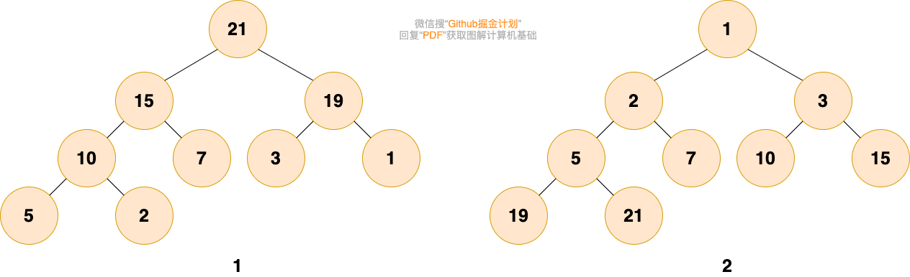

### 6.4. Lưu trữ Heap

Như đã giới thiệu ở phần cây, do tính chất ưu việt của cây nhị phân hoàn chỉnh, sử dụng mảng để lưu trữ cây nhị phân vừa tiết kiệm không gian vừa tiện truy cập (nếu số thứ tự của nút gốc là 1, thì với bất kỳ nút i nào trong cây, số thứ tự nút con trái là `2*i`, số thứ tự nút con phải là `2*i+1`).

Để tiện lưu trữ và truy cập, (binary) heap có thể được lưu trữ dưới dạng cây nhị phân hoàn chỉnh:

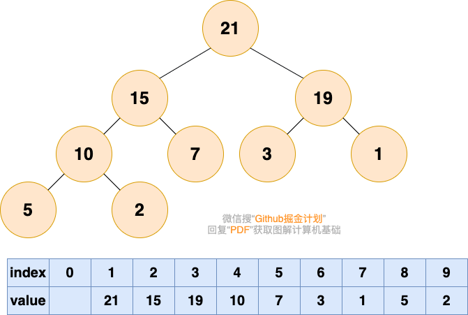

### 6.5. Các thao tác trên Heap

Các thao tác cập nhật heap chủ yếu bao gồm hai loại: **Chèn phần tử** và **Xóa phần tử đỉnh heap**. Quá trình thao tác cần nắm vững và hiểu rõ.

> Trước khi vào chủ đề chính, nhắc lại một lần nữa, heap là một công ty công bằng, người có năng lực tự nhiên sẽ đi đến vị trí phù hợp với năng lực của họ.

#### 6.5.1. Chèn phần tử

> Chèn phần tử, như một nhân viên mới vào làm, mới đến, nhân viên này cần bắt đầu từ cấp cơ sở.

**1. Đặt phần tử cần chèn vào cuối**


> Người có năng lực sẽ dần được thăng chức tăng lương, vàng ắt sẽ tỏa sáng!!!

**2. Từ dưới lên trên, nếu nút cha nhỏ hơn phần tử này, thì hoán đổi nút đó với nút cha, cho đến khi không thể hoán đổi**

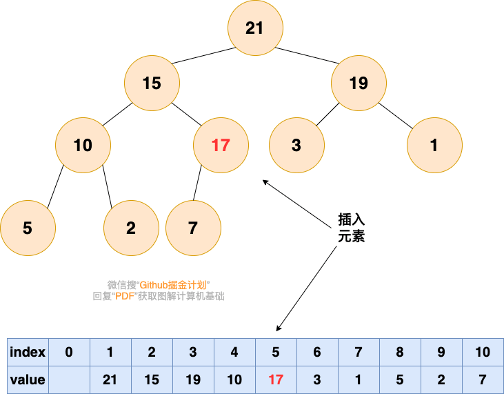

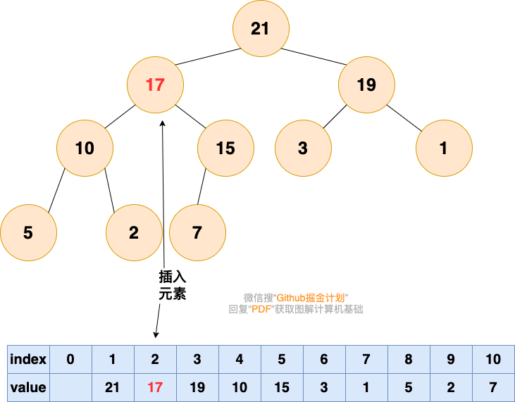

#### 6.5.2. Xóa phần tử đỉnh Heap

Theo tính chất của heap, phần tử đỉnh của Max Heap là lớn nhất trong tất cả các phần tử, phần tử đỉnh của Min Heap là nhỏ nhất. Khi chúng ta cần nhiều lần tìm phần tử lớn nhất hoặc nhỏ nhất, có thể sử dụng heap để triển khai.

Sau khi xóa phần tử đỉnh heap, để duy trì tính chất heap, cần điều chỉnh cấu trúc heap, chúng ta gọi quá trình này là "**heapify (heap hóa)**". Phương pháp heap hóa chia thành hai loại:

*   Một là heap hóa từ dưới lên, như chèn phần tử ở trên sử dụng là heap hóa từ dưới lên, phần tử di chuyển từ dưới cùng lên trên.
*   Loại khác là heap hóa từ trên xuống, phần tử di chuyển từ trên cùng xuống dưới.

##### Heap hóa từ dưới lên

> Trong công ty heap này, sẽ có hiện tượng sếp nghỉ việc, sếp nghỉ việc rồi thì vị trí của sếp sẽ trống.

Đầu tiên xóa phần tử đỉnh heap, khiến vị trí có chỉ số 1 trong mảng trống.

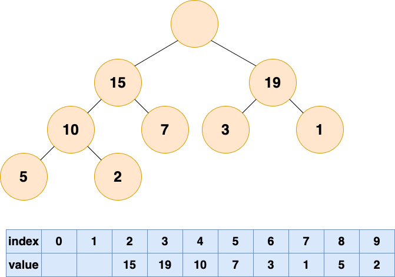

> Vậy ai sẽ tiếp quản vị trí của sếp? Tất nhiên là cấp dưới trực tiếp của sếp rồi, ai có năng lực mạnh thì lên thôi.

So sánh nút con trái và nút con phải của nút gốc, tức là phần tử mảng có chỉ số 2, 3, đưa phần tử lớn hơn vào vị trí nút gốc (chỉ số 1).

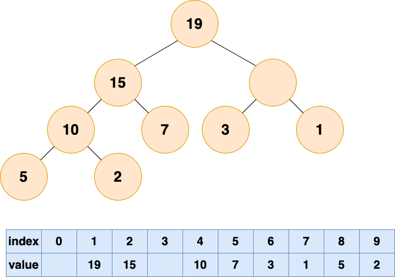

> Lúc này lại trống một vị trí, quy tắc cũ, ai có năng lực thì lên.

Tiếp tục lặp so sánh nút con trái phải của vị trí trống, đưa phần tử lớn hơn vào vị trí trống, cho đến khi đến đáy heap.

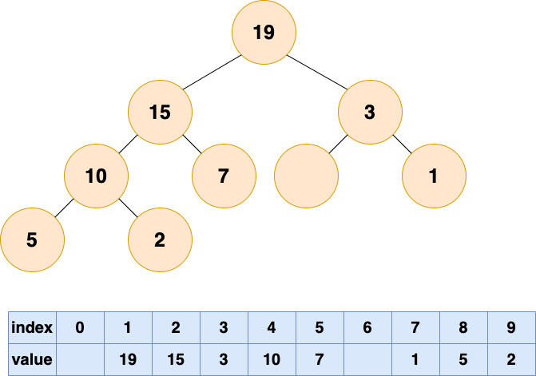

Lúc này đã hoàn thành heap hóa từ dưới lên, không còn phần tử nào có thể lấp vào chỗ trống nữa. Tuy nhiên, chúng ta có thể thấy trong mảng xuất hiện "bong bóng", điều này sẽ gây lãng phí không gian lưu trữ. Tiếp theo chúng ta thử heap hóa từ trên xuống.

##### Heap hóa từ trên xuống

Heap hóa từ trên xuống dùng một từ để mô tả là "đá chìm xuống biển". Vậy việc đầu tiên là nhấc hòn đá lên, ném từ mặt biển xuống. Hòn đá này chính là phần tử cuối cùng của heap, chúng ta di chuyển phần tử cuối lên đỉnh heap.

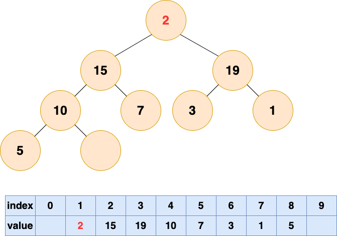

Sau đó bắt đầu cho hòn đá này chìm xuống đáy biển, liên tục so sánh giá trị với nút con trái phải, hoán đổi vị trí với nút con lớn hơn, cho đến khi không thể hoán đổi vị trí.

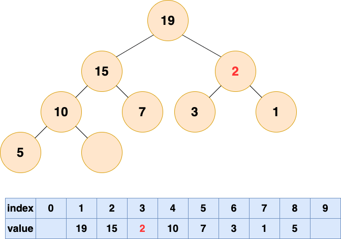

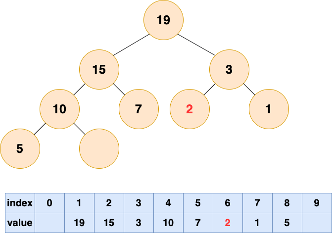

### 6.6. Tổng kết Thao tác Heap

*   **Chèn phần tử**: Đặt phần tử vào cuối mảng trước, sau đó heap hóa từ dưới lên, đưa phần tử cuối **nổi lên (heapify-up)**.
*   **Xóa phần tử đỉnh heap**: Xóa phần tử đỉnh heap, đặt phần tử cuối lên đỉnh heap, sau đó heap hóa từ trên xuống, đưa phần tử đỉnh heap **chìm xuống (heapify-down)**. Cũng có thể heap hóa từ dưới lên, chỉ là sẽ sinh ra "bong bóng", lãng phí không gian lưu trữ. Tốt nhất nên dùng cách heap hóa từ trên xuống.

### 6.7. Sắp xếp Heap (Heap Sort)

Quá trình sắp xếp heap chia thành hai bước:

*   Bước thứ nhất là xây dựng heap (build heap), biến một mảng không có thứ tự thành một heap.
*   Bước thứ hai là sắp xếp, lấy phần tử đỉnh heap ra, sau đó heap hóa các phần tử còn lại, lặp lại cho đến khi tất cả các phần tử được lấy ra.

#### 6.7.1. Xây dựng Heap (Build Heap)

Nếu bạn đã hiểu đủ về quá trình heap hóa, thì quá trình xây dựng heap sẽ khá dễ nắm bắt. Quá trình xây dựng heap là quá trình **heap hóa từ trên xuống cho tất cả các nút không phải lá**.

Đầu tiên cần hiểu những nút nào không phải lá, nút cha của nút cuối cùng và các phần tử trước nó đều là nút không phải lá. Nghĩa là, nếu số nút là n, thì chúng ta cần heap hóa từ trên xuống (chìm xuống) cho các nút từ n/2 đến 1.

Quá trình cụ thể:

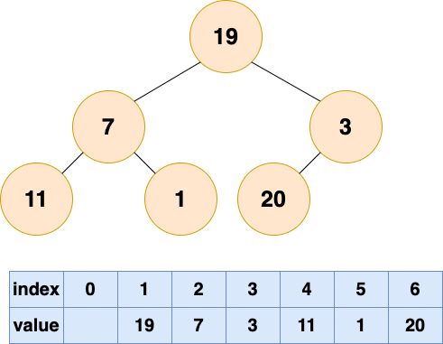

Biến mảng không có thứ tự ban đầu thành một cây. Số nút trong hình là 6, nên các nút 4, 5, 6 là nút lá, các nút 1, 2, 3 là nút không phải lá, vì vậy cần heap hóa từ trên xuống (chìm xuống) cho các nút 1-3. Lưu ý, thứ tự là heap hóa từ sau ra trước, bắt đầu từ nút số 3, đến nút số 1.

Kết quả heap hóa nút số 3:

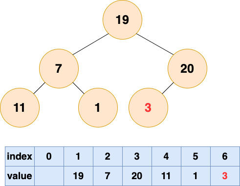

Kết quả heap hóa nút số 2:

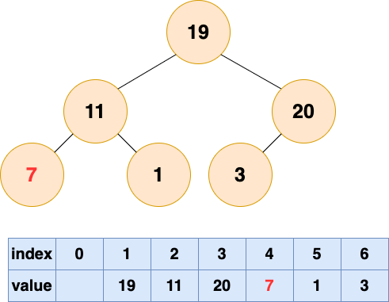

Kết quả heap hóa nút số 1:

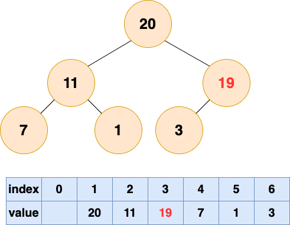

Đến đây, cây tương ứng với mảng đã trở thành một Max Heap, xây dựng heap hoàn thành!

#### 6.7.2. Sắp xếp

Vì phần tử đỉnh heap là lớn nhất trong tất cả các phần tử, nên chúng ta lặp lại lấy phần tử đỉnh heap ra, đặt phần tử đỉnh heap lớn nhất này vào cuối mảng, và heap hóa các phần tử còn lại.

Bây giờ suy nghĩ hai câu hỏi:
*   Sau khi xóa phần tử đỉnh heap, cần thực hiện heap hóa từ trên xuống (chìm xuống) hay heap hóa từ dưới lên (nổi lên)?
*   Phần tử đỉnh heap lấy ra lưu ở đâu, tạo mảng mới để lưu?

Trả lời câu hỏi thứ nhất, chúng ta cần thực hiện heap hóa từ trên xuống (chìm xuống), heap hóa này ban đầu cần di chuyển phần tử cuối lên đỉnh heap, lúc này vị trí cuối sẽ trống. Vì số phần tử trong heap đã giảm, vị trí này sẽ không được sử dụng nữa, nên chúng ta có thể đặt phần tử lấy ra vào cuối.

Bạn thông minh đã phát hiện ra, thực ra đây là một thao tác hoán đổi, hoán đổi vị trí phần tử đỉnh heap và phần tử cuối, từ đó hợp nhất việc lấy phần tử đỉnh heap ra và bước đầu tiên của heap hóa (đặt phần tử cuối vào vị trí nút gốc).

Quá trình chi tiết:

Lấy phần tử thứ nhất ra và heap hóa:

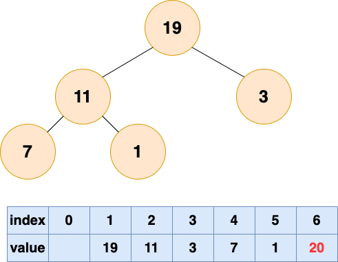

Lấy phần tử thứ hai ra và heap hóa:

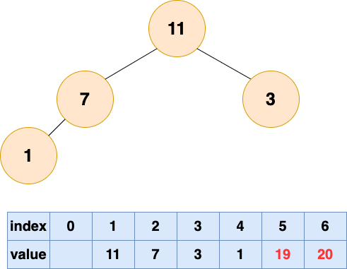

Lấy phần tử thứ ba ra và heap hóa:

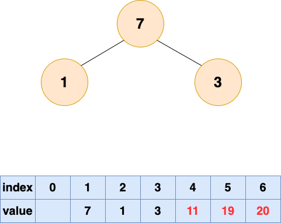

Lấy phần tử thứ tư ra và heap hóa:

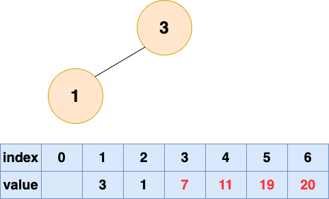

Lấy phần tử thứ năm ra và heap hóa:

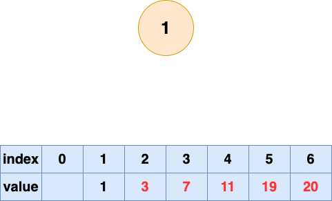

Lấy phần tử thứ sáu ra và heap hóa:

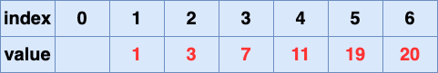

Sắp xếp heap hoàn thành!
---

## 7. Cây Đỏ-Đen (Red-Black Tree)

### 7.1. Giới thiệu Cây Đỏ-Đen

Cây Đỏ-Đen (Red Black Tree) là một **cây tìm kiếm nhị phân tự cân bằng**. Nó được Rudolf Bayer phát minh vào năm 1972, khi đó được gọi là "cây B nhị phân đối xứng" (symmetric binary B-trees). Sau đó, vào năm 1978, Leo J. Guibas và Robert Sedgewick đã sửa đổi thành "Cây Đỏ-Đen" như ngày nay.

Do tính chất tự cân bằng của nó, đảm bảo các thao tác **tìm kiếm, chèn, xóa** được hoàn thành trong độ phức tạp thời gian **O(log n)** ngay cả trong trường hợp xấu nhất, hiệu suất ổn định.

Trong JDK, `TreeMap`, `TreeSet` và `HashMap` từ JDK 1.8 trở đi đều sử dụng Cây Đỏ-Đen ở tầng dưới.

### 7.2. Tại sao cần Cây Đỏ-Đen?

Cây Đỏ-Đen ra đời là để **giải quyết nhược điểm của cây tìm kiếm nhị phân (BST)**.

Cây tìm kiếm nhị phân là cấu trúc dữ liệu dựa trên so sánh, mỗi nút có một giá trị khóa, nút con trái có giá trị khóa nhỏ hơn nút cha, nút con phải có giá trị khóa lớn hơn nút cha. Cấu trúc này tiện cho việc tìm kiếm, chèn và xóa, vì chỉ cần so sánh giá trị khóa của nút là có thể xác định vị trí của nút đích. Tuy nhiên, cây tìm kiếm nhị phân có một vấn đề lớn, đó là **hình dạng của nó phụ thuộc vào thứ tự chèn các nút**. Nếu các nút được chèn theo thứ tự tăng dần hoặc giảm dần, cây tìm kiếm nhị phân sẽ **thoái hóa thành cấu trúc tuyến tính, tức là một danh sách liên kết**. Trong trường hợp này, hiệu suất của cây tìm kiếm nhị phân sẽ giảm đáng kể, độ phức tạp thời gian sẽ từ O(log n) trở thành **O(n)**.

### 7.3. Đặc điểm Cây Đỏ-Đen

1.  **Mỗi nút hoặc Đỏ hoặc Đen.** Màu Đen quyết định sự cân bằng, màu Đỏ không quyết định sự cân bằng. Điều này tương ứng với việc trong cây 2-3, một nút có thể chứa 1~2 nút.
2.  **Nút gốc luôn là Đen.**
3.  **Mỗi nút lá đều là nút Đen rỗng (NIL node).** Ở đây nói đến là cây đỏ-đen đều sẽ có một nút lá rỗng, đây là quy tắc riêng của cây đỏ-đen.
4.  **Nếu một nút là Đỏ, thì các nút con của nó phải là Đen (ngược lại không nhất thiết).** Thông thường quy tắc này còn gọi là "không có hai nút Đỏ liên tiếp". Một nút tạm thời có thể có tối đa 3 nút con, ở giữa là nút Đen, trái phải là nút Đỏ.
5.  **Từ bất kỳ nút nào đến nút lá hoặc nút con rỗng của nó, mọi đường đi đều phải chứa cùng số lượng nút Đen (tức là cùng chiều cao đen).** Mỗi tầng chỉ có một nút đóng góp vào chiều cao cây quyết định sự cân bằng, đó là nút Đen trong cây đỏ-đen.

Chính những đặc điểm này đảm bảo sự cân bằng của cây đỏ-đen, khiến chiều cao của cây đỏ-đen **không vượt quá 2log(n+1)**.

### 7.4. Cấu trúc dữ liệu triển khai Cây Đỏ-Đen

Được xây dựng trên nền tảng của BST (Cây tìm kiếm nhị phân), AVL, cây 2-3, cây đỏ-đen đều là cây nhị phân tự cân bằng (gọi chung là B-tree). Nhưng so với cây AVL, độ phức tạp thời gian mà việc cân bằng chiều cao mang lại, cây đỏ-đen kiểm soát sự cân bằng lỏng lẻo hơn một chút, cây đỏ-đen chỉ cần đảm bảo cân bằng các nút Đen là được.

**Code Java - Cấu trúc Node:**
```java
public class Node {
    public Class<?> clazz;
    public Integer value;
    public Node parent;
    public Node left;
    public Node right;

    // Thuộc tính cần thiết cho cây AVL
    public int height;
    // Thuộc tính cần thiết cho cây Đỏ-Đen
    public Color color = Color.RED;
}
```

### 7.5. Các thao tác trên Cây Đỏ-Đen

#### 7.5.1. Nhuộm màu nghiêng trái

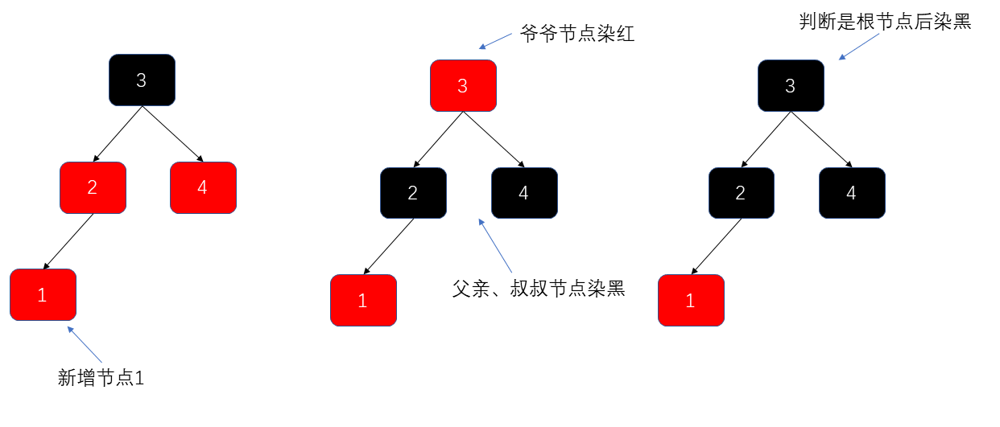

*   Khi nhuộm màu, dựa vào nút ông (grandparent) của nút hiện tại, tìm nút chú (uncle) của nút hiện tại.
*   Sau đó nhuộm đen nút cha, nhuộm đen nút chú, nhuộm đỏ nút ông. Nhưng việc nhuộm đỏ nút ông là tạm thời, sau khi thao tác cân bằng cây hoàn thành sẽ nhuộm đen nút gốc.

#### 7.5.2. Nhuộm màu nghiêng phải

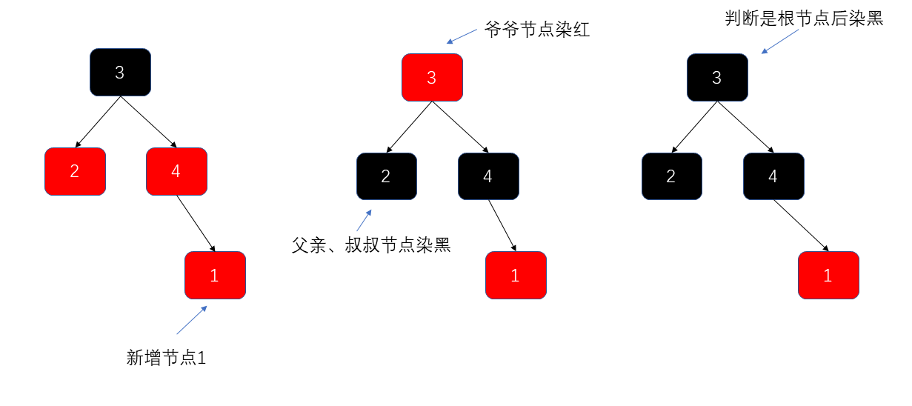

#### 7.5.3. Xoay trái điều chỉnh cân bằng

##### Một lần xoay trái

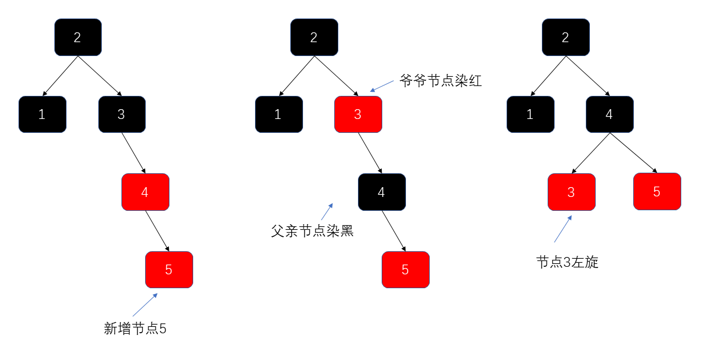

##### Xoay phải + Xoay trái

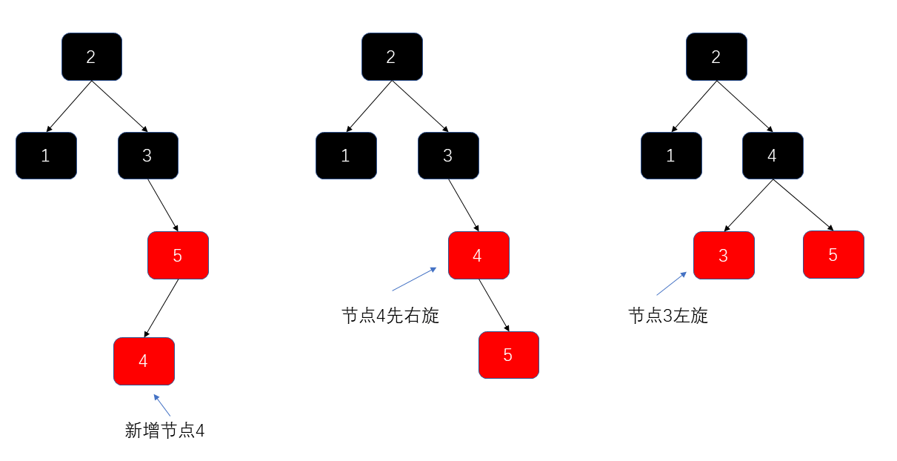

#### 7.5.4. Xoay phải điều chỉnh cân bằng

##### Một lần xoay phải

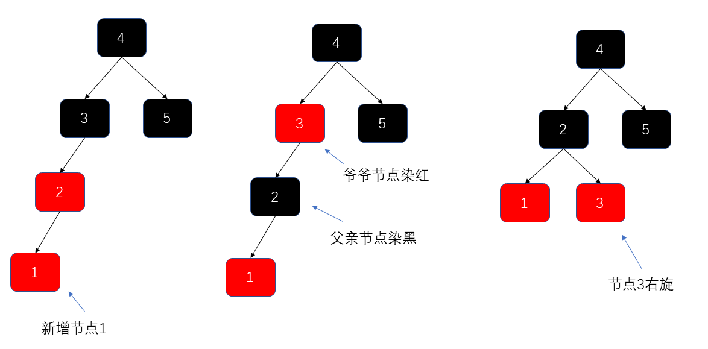

##### Xoay trái + Xoay phải

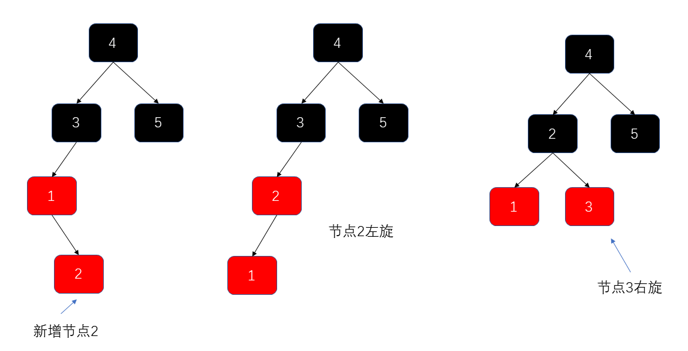

**Bài viết đề xuất:**
*   [《红黑树深入剖析及 Java 实现》 - 美团点评技术团队](https://zhuanlan.zhihu.com/p/24367771)
*   [漫画：什么是红黑树？ - 程序员小灰](https://juejin.im/post/5a27c6946fb9a04509096248#comment)

---

## 8. Đồ thị (Graph)

Đồ thị là một cấu trúc phi tuyến tính khá phức tạp.

**Tại sao nói nó phức tạp?**

Căn cứ vào nội dung trước, chúng ta biết:
*   Phần tử của cấu trúc dữ liệu tuyến tính thỏa mãn quan hệ tuyến tính duy nhất, mỗi phần tử (ngoại trừ phần tử đầu và cuối) chỉ có một phần tử tiền nhiệm trực tiếp và một phần tử kế nhiệm trực tiếp.
*   Phần tử của cấu trúc dữ liệu dạng cây có quan hệ phân cấp rõ ràng.

Nhưng **quan hệ giữa các phần tử trong cấu trúc đồ thị là tùy ý**.

**Đồ thị là gì?** Nói đơn giản, đồ thị bao gồm **tập hợp hữu hạn không rỗng của các đỉnh** và **tập hợp các cạnh giữa các đỉnh**. Thường biểu diễn là: **G(V, E)**, trong đó G biểu thị một đồ thị, V biểu thị tập hợp các đỉnh, E biểu thị tập hợp các cạnh.


Đồ thị có nhiều ví dụ trong cuộc sống hàng ngày! Ví dụ, mối quan hệ bạn bè trên mạng xã hội có thể biểu diễn bằng đồ thị.

### 8.1. Các khái niệm cơ bản của Đồ thị

#### Đỉnh (Vertex)

Phần tử dữ liệu trong đồ thị, chúng ta gọi là đỉnh. Đồ thị có ít nhất một đỉnh (tập hợp hữu hạn không rỗng).

Tương ứng với đồ thị quan hệ bạn bè, mỗi người dùng đại diện cho một đỉnh.

#### Cạnh (Edge)

Quan hệ giữa các đỉnh được biểu diễn bằng cạnh.

Tương ứng với đồ thị quan hệ bạn bè, nếu hai người dùng là bạn bè thì giữa hai người tồn tại một cạnh.

#### Bậc (Degree)

Bậc biểu thị số cạnh mà một đỉnh chứa. Trong đồ thị có hướng, còn chia thành bậc ra (out-degree) và bậc vào (in-degree). Bậc ra biểu thị số cạnh đi ra từ đỉnh đó, bậc vào biểu thị số cạnh đi vào đỉnh đó.

Tương ứng với đồ thị quan hệ bạn bè, bậc đại diện cho số lượng bạn bè của một người.

#### Đồ thị Vô hướng và Có hướng

Cạnh biểu thị quan hệ giữa các đỉnh. Một số quan hệ là hai chiều, ví dụ quan hệ bạn cùng lớp, A là bạn cùng lớp của B, thì B cũng chắc chắn là bạn cùng lớp của A. Khi biểu diễn quan hệ giữa A và B, không cần quan tâm đến hướng, dùng cạnh không có mũi tên để biểu diễn, đồ thị như vậy là **đồ thị vô hướng**.

Một số quan hệ có hướng, ví dụ quan hệ cha con, quan hệ thầy trò, quan hệ theo dõi trên Weibo. A là bố của B, nhưng B chắc chắn không phải bố của A; A theo dõi B, B không nhất thiết theo dõi A. Trong trường hợp này, chúng ta dùng **cạnh có mũi tên** để biểu diễn quan hệ giữa hai bên, đồ thị như vậy là **đồ thị có hướng**.

#### Đồ thị Không trọng số và Có trọng số

Đối với một quan hệ, nếu chúng ta chỉ quan tâm có hay không có quan hệ mà không quan tâm quan hệ mạnh yếu thế nào, thì có thể dùng đồ thị không trọng số để biểu diễn quan hệ giữa hai bên.

Đối với một quan hệ, nếu chúng ta vừa quan tâm có hay không có quan hệ, vừa quan tâm cường độ của quan hệ, ví dụ mô tả quan hệ giữa hai thành phố trên bản đồ cần dùng đến khoảng cách, thì dùng **đồ thị có trọng số** để biểu diễn. Trong đồ thị có trọng số, mỗi cạnh có một giá trị số biểu thị trọng số, đại diện cho cường độ của quan hệ.


### 8.2. Lưu trữ Đồ thị

#### 8.2.1. Lưu trữ bằng Ma trận Kề (Adjacency Matrix)

Ma trận kề sử dụng ma trận hai chiều để lưu trữ đồ thị, là cách biểu diễn khá trực quan.

Nếu đỉnh thứ i và đỉnh thứ j có quan hệ, và trọng số quan hệ là n, thì `A[i][j] = n`.

Trong đồ thị vô hướng, chúng ta chỉ quan tâm có hay không có quan hệ, nên khi đỉnh i và đỉnh j có quan hệ, `A[i][j] = 1`, khi đỉnh i và đỉnh j không có quan hệ, `A[i][j] = 0`.


Điều đáng chú ý là: **Ma trận kề của đồ thị vô hướng là ma trận đối xứng, vì trong đồ thị vô hướng, đỉnh i và đỉnh j có quan hệ thì đỉnh j và đỉnh i cũng chắc chắn có quan hệ.**


Cách lưu trữ bằng ma trận kề có ưu điểm là đơn giản trực tiếp (chỉ cần sử dụng một mảng hai chiều), và khi lấy quan hệ giữa hai đỉnh cũng rất hiệu quả (chỉ cần lấy giá trị phần tử mảng tại vị trí chỉ định). Tuy nhiên, nhược điểm của cách lưu trữ này cũng khá rõ ràng, đó là **khá lãng phí không gian**.

#### 8.2.2. Lưu trữ bằng Danh sách Kề (Adjacency List)

Để giải quyết vấn đề ma trận kề lãng phí không gian bộ nhớ, sinh ra cách lưu trữ đồ thị khác — **Danh sách kề**.

Danh sách kề sử dụng một danh sách liên kết để lưu trữ tất cả các đỉnh kề sau của một đỉnh nào đó. Với mỗi đỉnh Vi trong đồ thị, nối tất cả các đỉnh Vj kề với Vi thành một danh sách liên kết đơn, danh sách liên kết đơn này được gọi là **danh sách kề** của đỉnh Vi.


Bạn có thể đếm số phần tử được lưu trữ trong danh sách kề và số cạnh trong đồ thị, bạn sẽ phát hiện:
*   Trong đồ thị vô hướng, số phần tử danh sách kề bằng hai lần số cạnh. Như hình bên trái đồ thị vô hướng, số cạnh là 7, số phần tử danh sách kề lưu trữ là 14.
*   Trong đồ thị có hướng, số phần tử danh sách kề bằng số cạnh. Như hình bên phải đồ thị có hướng, số cạnh là 8, số phần tử danh sách kề lưu trữ là 8.

### 8.3. Tìm kiếm Đồ thị

#### 8.3.1. Tìm kiếm theo Chiều rộng (BFS - Breadth-First Search)

Tìm kiếm theo chiều rộng giống như sóng nước lan ra từng lớp từng lớp:


**Cách triển khai cụ thể của tìm kiếm theo chiều rộng sử dụng cấu trúc dữ liệu tuyến tính đã học trước đó — Hàng đợi (Queue).**

Quá trình cụ thể từng bước:

**Bước 1:**


**Bước 2:**


**Bước 3:**


**Bước 4:**


**Bước 5:**


**Bước 6:**


#### 8.3.2. Tìm kiếm theo Chiều sâu (DFS - Depth-First Search)

Tìm kiếm theo chiều sâu là "đi một con đường đến cùng". Từ đỉnh nguồn bắt đầu, đi đến khi không còn nút kế nhiệm, mới quay lui (backtrack) về đỉnh trước, rồi tiếp tục "đi một con đường đến cùng":


**Tương tự như tìm kiếm theo chiều rộng, cách triển khai cụ thể của tìm kiếm theo chiều sâu sử dụng cấu trúc dữ liệu tuyến tính khác — Ngăn xếp (Stack).**

Quá trình cụ thể từng bước:

**Bước 1:**


**Bước 2:**


**Bước 3:**


**Bước 4:**


**Bước 5:**


**Bước 6:**


---

## 9. Bộ lọc Bloom (Bloom Filter)

Bộ lọc Bloom chắc hẳn bạn đã nghe nói đến rồi.

Bộ lọc Bloom chủ yếu là để **giải quyết vấn đề tồn tại của dữ liệu quy mô lớn**. Đối với tình huống kiểm tra xem một dữ liệu có tồn tại trong dữ liệu quy mô lớn hay không và chấp nhận được sai số nhỏ (ví dụ như ngăn chặn cache penetration, loại bỏ trùng lặp dữ liệu quy mô lớn), rất phù hợp.

### 9.1. Bộ lọc Bloom là gì?

Bộ lọc Bloom (Bloom Filter, BF) là một anh chàng tên Bloom đề xuất vào năm 1970. Chúng ta có thể coi nó là một cấu trúc dữ liệu bao gồm **vector nhị phân (hoặc gọi là mảng bit)** và **một loạt các hàm ánh xạ ngẫu nhiên (hàm hash)**. So với các cấu trúc dữ liệu thường dùng như List, Map, Set, nó **chiếm ít không gian hơn và hiệu suất cao hơn**, nhưng nhược điểm là **kết quả trả về là xác suất, không hoàn toàn chính xác**. Về lý thuyết, càng thêm nhiều phần tử vào tập hợp, khả năng báo sai (false positive) càng lớn. Và dữ liệu được đưa vào bộ lọc Bloom **không dễ xóa**.

Bloom Filter sẽ sử dụng một mảng bit khá lớn để lưu trữ tất cả dữ liệu, mỗi phần tử trong mảng chỉ chiếm 1 bit, và mỗi phần tử chỉ có thể là 0 hoặc 1 (đại diện cho false hoặc true), đây là điểm cốt lõi giúp Bloom Filter tiết kiệm bộ nhớ. Tính ra, xin cấp phát một mảng bit 100 vạn phần tử chỉ chiếm 1000000 Bit / 8 = 125000 Byte = 125000/1024 KB ≈ **122KB** không gian.


**Tóm lại: Một người tên Bloom đề xuất một cấu trúc dữ liệu để kiểm tra xem phần tử có tồn tại trong tập hợp lớn cho trước hay không, cấu trúc dữ liệu này hiệu quả và hiệu suất rất tốt, nhưng nhược điểm là có tỷ lệ nhận dạng sai nhất định và khó xóa. Và về lý thuyết, càng thêm nhiều phần tử vào tập hợp, khả năng báo sai càng lớn.**

### 9.2. Nguyên lý của Bộ lọc Bloom

**Khi một phần tử được thêm vào bộ lọc Bloom, sẽ thực hiện các thao tác sau:**

1.  Sử dụng các hàm hash trong bộ lọc Bloom để tính toán giá trị phần tử, thu được giá trị hash (có bao nhiêu hàm hash thì thu được bấy nhiêu giá trị hash).
2.  Dựa vào các giá trị hash thu được, trong mảng bit, đặt giá trị tại các chỉ số tương ứng thành 1.

**Khi chúng ta cần kiểm tra xem một phần tử có tồn tại trong bộ lọc Bloom hay không, sẽ thực hiện các thao tác sau:**

1.  Tính hash lại cho phần tử đã cho với cùng các hàm hash;
2.  Sau khi thu được giá trị, kiểm tra xem mỗi phần tử trong mảng bit có đều là 1 không. Nếu tất cả giá trị đều là 1, thì nói rằng giá trị này **có thể có** trong bộ lọc Bloom. Nếu tồn tại một giá trị không phải 1, thì nói rằng phần tử đó **chắc chắn không có** trong bộ lọc Bloom.

Sơ đồ nguyên lý đơn giản của Bloom Filter:


Như hình minh họa, khi chuỗi lưu trữ được thêm vào bộ lọc Bloom, chuỗi đó trước tiên được nhiều hàm hash sinh ra các giá trị hash khác nhau, sau đó đặt chỉ số tương ứng trong mảng bit thành 1 (khi mảng bit được khởi tạo, tất cả các vị trí đều là 0). Khi lưu trữ cùng một chuỗi lần thứ hai, vì các vị trí tương ứng trước đó đã được đặt thành 1, nên rất dễ biết giá trị này đã tồn tại (rất tiện cho việc loại bỏ trùng lặp).

Nếu chúng ta cần kiểm tra xem một chuỗi nào đó có trong bộ lọc Bloom hay không, chỉ cần tính hash lại cho chuỗi đã cho với cùng các hàm hash, thu được giá trị rồi kiểm tra xem mỗi phần tử trong mảng bit có đều là 1 không. Nếu tất cả giá trị đều là 1, thì nói rằng giá trị này có trong bộ lọc Bloom. Nếu tồn tại một giá trị không phải 1, thì nói rằng phần tử đó không có trong bộ lọc Bloom.

**Các chuỗi khác nhau có thể hash ra cùng vị trí, trường hợp này chúng ta có thể tăng kích thước mảng bit hoặc điều chỉnh hàm hash.**

Tóm lại, chúng ta có thể kết luận: **Bộ lọc Bloom nói một phần tử tồn tại, có xác suất nhỏ sẽ báo sai (false positive). Bộ lọc Bloom nói một phần tử không có, thì phần tử đó chắc chắn không có.**

### 9.3. Kịch bản Sử dụng Bộ lọc Bloom

1.  **Kiểm tra xem dữ liệu đã cho có tồn tại hay không:** Ví dụ kiểm tra một số có tồn tại trong tập hợp số lượng lớn (tập số rất lớn, cả tỷ) hay không; ngăn chặn cache penetration (kiểm tra xem dữ liệu yêu cầu có hợp lệ hay không để tránh bỏ qua cache trực tiếp truy vấn database) v.v; lọc email rác (kiểm tra xem một địa chỉ email có trong danh sách email rác hay không); chức năng danh sách đen (kiểm tra xem một địa chỉ IP hoặc số điện thoại có trong danh sách đen hay không) v.v.
2.  **Loại bỏ trùng lặp:** Ví dụ loại bỏ trùng lặp URL đã crawl khi crawl một địa chỉ web nhất định; loại bỏ trùng lặp số lượng lớn số QQ/số đơn hàng.

Tình huống loại bỏ trùng lặp cũng cần dùng đến việc kiểm tra xem dữ liệu đã cho có tồn tại hay không, do đó bộ lọc Bloom chủ yếu là để giải quyết **vấn đề tồn tại của dữ liệu quy mô lớn**.

### 9.4. Code Thực chiến

#### Tự triển khai Bộ lọc Bloom bằng Java

Chúng ta đã nói về nguyên lý của bộ lọc Bloom ở trên, biết được nguyên lý rồi thì có thể tự triển khai một cái.

Nếu bạn muốn tự triển khai, bạn cần:

1.  Một mảng bit có kích thước phù hợp để lưu trữ dữ liệu
2.  Một vài hàm hash khác nhau
3.  Phương thức thêm phần tử vào mảng bit (bộ lọc Bloom)
4.  Phương thức kiểm tra phần tử đã cho có tồn tại trong mảng bit (bộ lọc Bloom) hay không

**Code Java - Tự triển khai:**
```java
import java.util.BitSet;

public class MyBloomFilter {

    /**
     * Kích thước mảng bit
     */
    private static final int DEFAULT_SIZE = 2 << 24;
    /**
     * Thông qua mảng này có thể tạo 6 hàm hash khác nhau
     */
    private static final int[] SEEDS = new int[]{3, 13, 46, 71, 91, 134};

    /**
     * Mảng bit. Các phần tử trong mảng chỉ có thể là 0 hoặc 1
     */
    private BitSet bits = new BitSet(DEFAULT_SIZE);

    /**
     * Mảng lưu trữ các lớp chứa hàm hash
     */
    private SimpleHash[] func = new SimpleHash[SEEDS.length];

    /**
     * Khởi tạo mảng các lớp chứa hàm hash, mỗi lớp có một hàm hash khác nhau
     */
    public MyBloomFilter() {
        // Khởi tạo nhiều hàm Hash khác nhau
        for (int i = 0; i < SEEDS.length; i++) {
            func[i] = new SimpleHash(DEFAULT_SIZE, SEEDS[i]);
        }
    }

    /**
     * Thêm phần tử vào mảng bit
     */
    public void add(Object value) {
        for (SimpleHash f : func) {
            bits.set(f.hash(value), true);
        }
    }

    /**
     * Kiểm tra phần tử chỉ định có tồn tại trong mảng bit hay không
     */
    public boolean contains(Object value) {
        boolean ret = true;
        for (SimpleHash f : func) {
            ret = ret && bits.get(f.hash(value));
        }
        return ret;
    }

    /**
     * Lớp nội tĩnh. Dùng cho thao tác hash!
     */
    public static class SimpleHash {

        private int cap;
        private int seed;

        public SimpleHash(int cap, int seed) {
            this.cap = cap;
            this.seed = seed;
        }

        /**
         * Tính giá trị hash
         */
        public int hash(Object value) {
            int h;
            return (value == null) ? 0 : Math.abs((cap - 1) & seed * ((h = value.hashCode()) ^ (h >>> 16)));
        }
    }
}
```

**Kiểm tra:**
```java
String value1 = "https://javaguide.cn/";
String value2 = "https://github.com/Snailclimb";
MyBloomFilter filter = new MyBloomFilter();
System.out.println(filter.contains(value1));  // false
System.out.println(filter.contains(value2));  // false
filter.add(value1);
filter.add(value2);
System.out.println(filter.contains(value1));  // true
System.out.println(filter.contains(value2));  // true
```

#### Sử dụng Bộ lọc Bloom có sẵn trong Guava của Google

Mục đích tự triển khai chủ yếu là để bạn hiểu rõ nguyên lý của bộ lọc Bloom. Triển khai bộ lọc Bloom trong Guava được coi là khá uy tín, nên trong dự án thực tế chúng ta không cần tự triển khai.

Đầu tiên, chúng ta cần thêm dependency Guava vào dự án:

```xml
<dependency>
    <groupId>com.google.guava</groupId>
    <artifactId>guava</artifactId>
    <version>28.0-jre</version>
</dependency>
```

Sử dụng thực tế như sau:

Chúng ta tạo một bộ lọc Bloom lưu trữ tối đa 1500 số nguyên, và chấp nhận tỷ lệ báo sai là 0.01 (1%):

```java
// Tạo đối tượng bộ lọc Bloom
BloomFilter<Integer> filter = BloomFilter.create(
    Funnels.integerFunnel(),
    1500,
    0.01);
// Kiểm tra phần tử chỉ định có tồn tại không
System.out.println(filter.mightContain(1));  // false
System.out.println(filter.mightContain(2));  // false
// Thêm phần tử vào bộ lọc Bloom
filter.put(1);
filter.put(2);
System.out.println(filter.mightContain(1));  // true
System.out.println(filter.mightContain(2));  // true
```

Trong ví dụ của chúng ta, khi phương thức `mightContain()` trả về *true*, chúng ta có thể chắc chắn 99% rằng phần tử đó có trong bộ lọc. Khi bộ lọc trả về *false*, chúng ta có thể **chắc chắn 100%** rằng phần tử đó không tồn tại trong bộ lọc.

**Bộ lọc Bloom mà Guava cung cấp triển khai khá tốt (muốn tìm hiểu chi tiết có thể xem source code của nó), nhưng nó có một nhược điểm lớn là chỉ có thể sử dụng trên một máy đơn lẻ (ngoài ra, việc mở rộng dung lượng cũng không dễ), mà hiện nay internet thường là các tình huống phân tán. Để giải quyết vấn đề này, chúng ta cần sử dụng bộ lọc Bloom trong Redis.**

### 9.5. Bộ lọc Bloom trong Redis

#### Giới thiệu

Redis từ phiên bản v4.0 trở đi có chức năng Module (module/plugin), Redis Modules cho phép Redis sử dụng các module bên ngoài để mở rộng chức năng. Bộ lọc Bloom là một trong những Module đó.

Trang chính thức giới thiệu một RedisBloom làm Module bộ lọc Bloom của Redis, địa chỉ: https://github.com/RedisBloom/RedisBloom

RedisBloom cung cấp hỗ trợ client cho nhiều ngôn ngữ, bao gồm: Python, Java, JavaScript và PHP.

#### Cài đặt bằng Docker

```bash
➜  ~ docker run -p 6379:6379 --name redis-redisbloom redislabs/rebloom:latest
➜  ~ docker exec -it redis-redisbloom bash
root@21396d02c252:/data# redis-cli
127.0.0.1:6379>
```

**Lưu ý:** Image rebloom hiện tại đã bị deprecated, trang chính thức khuyến nghị sử dụng [redis-stack](https://hub.docker.com/r/redis/redis-stack).

#### Các lệnh thường dùng

> Lưu ý: key: tên bộ lọc Bloom, item: phần tử được thêm vào.

1.  `BF.ADD`: Thêm phần tử vào bộ lọc Bloom, nếu bộ lọc chưa tồn tại thì tạo mới. Định dạng: `BF.ADD {key} {item}`.
2.  `BF.MADD`: Thêm một hoặc nhiều phần tử vào bộ lọc Bloom, đồng thời tạo bộ lọc nếu chưa tồn tại. Về cách thao tác, lệnh này hoạt động giống `BF.ADD`, chỉ khác là cho phép nhiều đầu vào và trả về nhiều giá trị. Định dạng: `BF.MADD {key} {item} [item ...]`.
3.  `BF.EXISTS`: Xác định xem phần tử có tồn tại trong bộ lọc Bloom hay không. Định dạng: `BF.EXISTS {key} {item}`.
4.  `BF.MEXISTS`: Xác định xem một hoặc nhiều phần tử có tồn tại trong bộ lọc Bloom hay không. Định dạng: `BF.MEXISTS {key} {item} [item ...]`.

Ngoài ra, lệnh `BF.RESERVE` cần giới thiệu riêng:

Định dạng lệnh này như sau:

`BF.RESERVE {key} {error_rate} {capacity} [EXPANSION expansion]`

Dưới đây giới thiệu đơn giản ý nghĩa cụ thể của mỗi tham số:

1.  key: Tên bộ lọc Bloom
2.  error_rate: Tỷ lệ báo sai mong đợi. Giá trị này phải nằm trong khoảng từ 0 đến 1. Ví dụ, với tỷ lệ báo sai mong đợi 0.1% (1 trong 1000), error_rate nên đặt là 0.001. Số này càng gần 0, mức tiêu thụ bộ nhớ cho mỗi item càng lớn, và mức sử dụng CPU cho mỗi thao tác càng cao.
3.  capacity: Dung lượng của bộ lọc. Khi số lượng phần tử thực tế được lưu trữ vượt quá giá trị này, hiệu suất sẽ bắt đầu giảm. Mức giảm thực tế sẽ phụ thuộc vào mức độ vượt quá giới hạn. Khi số lượng phần tử bộ lọc tăng theo cấp số nhân, hiệu suất sẽ giảm tuyến tính.

Tham số tùy chọn:
*   expansion: Nếu một bộ lọc con mới được tạo, kích thước của nó sẽ là kích thước bộ lọc hiện tại nhân với `expansion`. Giá trị expansion mặc định là 2. Điều này có nghĩa là mỗi bộ lọc con tiếp theo sẽ gấp đôi bộ lọc con trước đó.

#### Sử dụng thực tế

```shell
127.0.0.1:6379> BF.ADD myFilter java
(integer) 1
127.0.0.1:6379> BF.ADD myFilter javaguide
(integer) 1
127.0.0.1:6379> BF.EXISTS myFilter java
(integer) 1
127.0.0.1:6379> BF.EXISTS myFilter javaguide
(integer) 1
127.0.0.1:6379> BF.EXISTS myFilter github
(integer) 0
```

## 9. Bổ sung: Giải pháp & Cách xử lý nâng cao

### 9.1. Dynamic Array (ArrayList) - Resize theo cấp số nhân

**Vấn đề:** Mảng cố định kích thước, cần mở rộng khi vượt capacity.

**Giải pháp:** Nhân đôi capacity để giảm số lần copy (amortized O(1)).

**Cách xử lý:**
1. Khi `size == capacity` → cấp phát mảng mới `capacity * 2`.
2. Copy dữ liệu cũ sang mảng mới.
3. Thêm phần tử mới.

**Code Java:**
```java
public class DynamicIntArray {
    private int[] data;
    private int size;

    public DynamicIntArray(int initialCapacity) {
        this.data = new int[initialCapacity];
        this.size = 0;
    }

    public void add(int value) {
        if (size == data.length) {
            // Resize theo cấp số nhân để giảm số lần copy
            int[] newData = new int[data.length * 2];
            System.arraycopy(data, 0, newData, 0, data.length);
            data = newData;
        }
        data[size++] = value;
    }

    public int get(int index) {
        if (index < 0 || index >= size) {
            throw new IndexOutOfBoundsException("Index out of range");
        }
        return data[index];
    }
}
```

**Trade-offs:**
- ✅ Truy cập O(1), append amortized O(1)
- ❌ Resize đột ngột tốn O(n)

### 9.2. Circular Buffer (Ring Buffer) cho Producer/Consumer

**Use case:** Message queue, log buffer, streaming data.

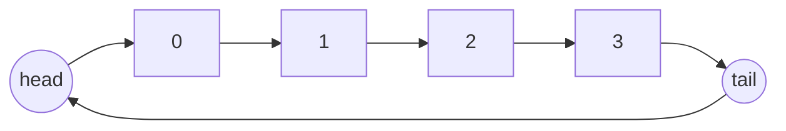

**Code Java:**
```java
public class RingBuffer {
    private final int[] buffer;
    private int head = 0;
    private int tail = 0;
    private int size = 0;

    public RingBuffer(int capacity) {
        this.buffer = new int[capacity];
    }

    public boolean offer(int value) {
        if (size == buffer.length) {
            return false; // Buffer đầy
        }
        buffer[tail] = value;
        tail = (tail + 1) % buffer.length;
        size++;
        return true;
    }

    public Integer poll() {
        if (size == 0) {
            return null; // Buffer rỗng
        }
        int value = buffer[head];
        head = (head + 1) % buffer.length;
        size--;
        return value;
    }
}
```

**Best practices:**
- Dùng ring buffer cho dữ liệu streaming để tránh cấp phát liên tục.
- Dùng phiên bản lock-free (Disruptor) khi throughput cực cao.

### 9.3. Skip List - Khi cần thứ tự + hiệu năng cân bằng

**Ý tưởng:** Nhiều tầng liên kết giúp tìm kiếm gần như O(log n) mà không cần cân bằng phức tạp.

**Ưu điểm / Nhược điểm:**
- ✅ Đơn giản hơn cây cân bằng, hỗ trợ range query
- ✅ Được dùng trong Redis Sorted Set
- ❌ Tốn thêm bộ nhớ cho pointers

**Khi nào dùng:**
- Cần cấu trúc có thứ tự và thao tác insert/delete thường xuyên.

### 9.4. Trie cho Autocomplete và Prefix Search

**Use case:** Gợi ý tìm kiếm, dictionary, spell check.

**Code Java (Insert + Search prefix):**
```java
class TrieNode {
    TrieNode[] children = new TrieNode[26];
    boolean isWord;
}

class Trie {
    private final TrieNode root = new TrieNode();

    public void insert(String word) {
        TrieNode node = root;
        for (char c : word.toCharArray()) {
            int idx = c - 'a';
            if (node.children[idx] == null) {
                node.children[idx] = new TrieNode();
            }
            node = node.children[idx];
        }
        node.isWord = true;
    }

    public boolean startsWith(String prefix) {
        TrieNode node = root;
        for (char c : prefix.toCharArray()) {
            int idx = c - 'a';
            if (node.children[idx] == null) {
                return false;
            }
            node = node.children[idx];
        }
        return true;
    }
}
```

**Pitfalls:**
- Bộ nhớ tăng nhanh nếu dùng full Unicode → cân nhắc nén (radix tree).

### 9.5. B-Tree vs B+ Tree (Database Index)

| Tiêu chí | B-Tree | B+ Tree |
| --- | --- | --- |
| Lưu dữ liệu | Node nội + lá | Chỉ lá |
| Lưu trữ data payload | Có thể ở node nội | Chỉ ở lá |
| Range query | Khó tối ưu | Rất tốt |
| Disk I/O | Nhiều hơn | Ít hơn |
| Use case | File system | DB index |

**Kết luận:** Hầu hết DB dùng B+ Tree vì tối ưu range scan và caching.

### 9.6. Array vs LinkedList: Memory Layout và Cache Efficiency

**Vấn đề:** Tại sao Array nhanh hơn LinkedList trong hầu hết trường hợp?

**Giải thích:**

1. **Memory Layout:**
   - **Array**: Bộ nhớ liên tục (contiguous memory)
   - **LinkedList**: Bộ nhớ rời rạc (scattered memory), mỗi node ở địa chỉ khác nhau

2. **Cache Efficiency:**
   - CPU cache hoạt động theo **cache lines** (thường 64 bytes)
   - Khi đọc 1 phần tử array → CPU load cả cache line (64 bytes) → các phần tử kế tiếp có sẵn trong cache
   - Với LinkedList → mỗi node ở địa chỉ khác → **cache miss** thường xuyên → phải đọc từ RAM (chậm hơn 100x)

**Benchmark:**
```java
// Array: ~10ms cho 100M truy cập
int[] arr = new int[100_000_000];
for (int i = 0; i < arr.length; i++) {
    arr[i] = i;
}

// LinkedList: ~5000ms cho 100M truy cập (chậm hơn 500x!)
LinkedList<Integer> list = new LinkedList<>();
for (int i = 0; i < 100_000_000; i++) {
    list.add(i);
}
```

**Trade-offs:**
- ✅ **Array**: Cache-friendly, random access O(1), nhưng resize tốn kém
- ✅ **LinkedList**: Insert/delete O(1), nhưng truy cập tuần tự chậm do cache miss

**Khi nào dùng:**
- Array: Khi cần truy cập ngẫu nhiên, size cố định hoặc thay đổi ít
- LinkedList: Khi cần insert/delete ở giữa thường xuyên, size không xác định

### 9.7. DLL vs SLL: Khi nào dùng cái nào?

| Tiêu chí | Single Linked List (SLL) | Doubly Linked List (DLL) |
| --- | --- | --- |
| Memory overhead | 1 pointer/node (8 bytes) | 2 pointers/node (16 bytes) |
| Delete node | Cần biết node trước (O(n)) | O(1) nếu có reference |
| Reverse traversal | Không thể | Có thể (O(n)) |
| Insert trước node | O(n) | O(1) |
| Use case | Stack, Queue, khi chỉ cần forward | LRU Cache, Browser history, Deque |

**Code Java - DLL cho LRU Cache:**
```java
class LRUNode {
    int key, value;
    LRUNode prev, next;
    LRUNode(int k, int v) { key = k; value = v; }
}

class LRUCache {
    private Map<Integer, LRUNode> cache = new HashMap<>();
    private LRUNode head, tail;
    private int capacity;

    // DLL cho phép delete O(1) khi có reference
    private void removeNode(LRUNode node) {
        node.prev.next = node.next;
        node.next.prev = node.prev;
    }

    private void addToHead(LRUNode node) {
        node.prev = head;
        node.next = head.next;
        head.next.prev = node;
        head.next = node;
    }
}
```

**Kết luận:** DLL khi cần delete nhanh hoặc reverse traversal, SLL khi tiết kiệm bộ nhớ.

### 9.8. Lock-free Linked List (ConcurrentLinkedQueue)

**Vấn đề:** `java.util.LinkedList` không thread-safe, `Collections.synchronizedList()` chậm do lock contention.

**Giải pháp:** Lock-free bằng **CAS (Compare-And-Swap)** operations.

**Code Java - Lock-free Node:**
```java
import java.util.concurrent.atomic.AtomicReference;

class LockFreeNode<T> {
    T value;
    AtomicReference<LockFreeNode<T>> next = new AtomicReference<>();
    
    LockFreeNode(T value) {
        this.value = value;
    }
}

class LockFreeQueue<T> {
    private AtomicReference<LockFreeNode<T>> head = 
        new AtomicReference<>(new LockFreeNode<>(null));
    private AtomicReference<LockFreeNode<T>> tail = 
        new AtomicReference<>(head.get());

    public void enqueue(T item) {
        LockFreeNode<T> node = new LockFreeNode<>(item);
        while (true) {
            LockFreeNode<T> last = tail.get();
            LockFreeNode<T> next = last.next.get();
            if (last == tail.get()) { // Check không bị modify
                if (next == null) {
                    // CAS: Nếu last.next vẫn null → set thành node
                    if (last.next.compareAndSet(null, node)) {
                        tail.compareAndSet(last, node); // Update tail
                        return;
                    }
                } else {
                    tail.compareAndSet(last, next); // Help advance tail
                }
            }
        }
    }
}
```

**Java built-in:** `java.util.concurrent.ConcurrentLinkedQueue` - lock-free, thread-safe, high-performance.

**Performance:** 10-100x nhanh hơn `synchronized` list trong high concurrency scenarios.

### 9.9. Min Stack - O(1) getMin()

**Bài toán:** Implement stack với thêm operation `getMin()` trong O(1).

**Giải pháp 1: 2 Stacks (Auxiliary Stack)**
```java
class MinStack {
    private Stack<Integer> stack = new Stack<>();
    private Stack<Integer> minStack = new Stack<>(); // Lưu min tại mỗi level

    public void push(int x) {
        stack.push(x);
        if (minStack.isEmpty() || x <= minStack.peek()) {
            minStack.push(x);
        }
    }

    public void pop() {
        if (stack.pop().equals(minStack.peek())) {
            minStack.pop(); // Nếu pop ra là min → pop minStack
        }
    }

    public int getMin() {
        return minStack.peek(); // O(1)
    }
}
```

**Giải pháp 2: 1 Stack với giá trị encoded**
```java
class MinStack2 {
    private Stack<Long> stack = new Stack<>();
    private long min;

    public void push(int x) {
        if (stack.isEmpty()) {
            stack.push(0L);
            min = x;
        } else {
            stack.push(x - min); // Lưu diff thay vì giá trị thật
            if (x < min) min = x;
        }
    }

    public int pop() {
        long diff = stack.pop();
        int val;
        if (diff < 0) {
            val = (int) min;
            min = min - diff; // Restore previous min
        } else {
            val = (int) (min + diff);
        }
        return val;
    }

    public int getMin() {
        return (int) min; // O(1)
    }
}
```

**Trade-offs:**
- Giải pháp 1: Dễ hiểu, nhưng tốn O(n) space worst case
- Giải pháp 2: Tiết kiệm space, nhưng phức tạp hơn (integer overflow risk)

### 9.10. Expression Evaluation Engine

**Use case:** Calculator, formula parser, expression compiler.

**Code Java - Evaluate biểu thức với Stack:**
```java
import java.util.*;

class ExpressionEvaluator {
    public int evaluate(String expression) {
        Stack<Integer> operands = new Stack<>();
        Stack<Character> operators = new Stack<>();
        
        for (int i = 0; i < expression.length(); i++) {
            char c = expression.charAt(i);
            if (Character.isDigit(c)) {
                int num = 0;
                while (i < expression.length() && Character.isDigit(expression.charAt(i))) {
                    num = num * 10 + (expression.charAt(i) - '0');
                    i++;
                }
                i--; // Backtrack 1 vì loop sẽ ++
                operands.push(num);
            } else if (c == '(') {
                operators.push(c);
            } else if (c == ')') {
                while (operators.peek() != '(') {
                    operands.push(applyOp(operators.pop(), operands.pop(), operands.pop()));
                }
                operators.pop(); // Pop '('
            } else if (c == '+' || c == '-' || c == '*' || c == '/') {
                while (!operators.isEmpty() && hasPrecedence(c, operators.peek())) {
                    operands.push(applyOp(operators.pop(), operands.pop(), operands.pop()));
                }
                operators.push(c);
            }
        }
        
        while (!operators.isEmpty()) {
            operands.push(applyOp(operators.pop(), operands.pop(), operands.pop()));
        }
        
        return operands.pop();
    }

    private boolean hasPrecedence(char op1, char op2) {
        if (op2 == '(' || op2 == ')') return false;
        return (op1 == '*' || op1 == '/') && (op2 == '+' || op2 == '-');
    }

    private int applyOp(char op, int b, int a) {
        switch (op) {
            case '+': return a + b;
            case '-': return a - b;
            case '*': return a * b;
            case '/': return a / b;
        }
        return 0;
    }
}
```

**Test:**
```java
ExpressionEvaluator eval = new ExpressionEvaluator();
System.out.println(eval.evaluate("10 + 2 * 6"));        // 22
System.out.println(eval.evaluate("100 * 2 + 12"));      // 212
System.out.println(eval.evaluate("100 * ( 2 + 12 )"));  // 1400
```

### 9.11. Thread-safe Stack Implementation

**Vấn đề:** `java.util.Stack` extends `Vector` (synchronized mọi method) → chậm, lock contention cao.

**Giải pháp 1: Synchronized wrapper**
```java
class ThreadSafeStack<T> {
    private final Stack<T> stack = new Stack<>();
    private final Object lock = new Object();

    public void push(T item) {
        synchronized (lock) {
            stack.push(item);
        }
    }

    public T pop() {
        synchronized (lock) {
            return stack.isEmpty() ? null : stack.pop();
        }
    }
}
```

**Giải pháp 2: Lock-free với AtomicReference (Treiber Stack)**
```java
import java.util.concurrent.atomic.AtomicReference;

class LockFreeStack<T> {
    static class Node<T> {
        T value;
        Node<T> next;
        Node(T value) { this.value = value; }
    }

    private AtomicReference<Node<T>> top = new AtomicReference<>();

    public void push(T item) {
        Node<T> newHead = new Node<>(item);
        Node<T> oldHead;
        do {
            oldHead = top.get();
            newHead.next = oldHead;
        } while (!top.compareAndSet(oldHead, newHead)); // CAS until success
    }

    public T pop() {
        Node<T> oldHead;
        Node<T> newHead;
        do {
            oldHead = top.get();
            if (oldHead == null) return null;
            newHead = oldHead.next;
        } while (!top.compareAndSet(oldHead, newHead));
        return oldHead.value;
    }
}
```

**Performance comparison:**
- Synchronized: Safe nhưng chậm (lock contention)
- Lock-free: Nhanh hơn 2-5x trong high concurrency, nhưng phức tạp hơn

### 9.12. Priority Queue Use Cases

#### 9.12.1. Dijkstra Shortest Path Algorithm

**Code Java:**
```java
import java.util.*;

class Dijkstra {
    public int[] shortestPath(int[][] graph, int start) {
        int n = graph.length;
        int[] dist = new int[n];
        Arrays.fill(dist, Integer.MAX_VALUE);
        dist[start] = 0;

        // Priority Queue: Lấy node có dist nhỏ nhất
        PriorityQueue<int[]> pq = new PriorityQueue<>((a, b) -> a[1] - b[1]);
        pq.offer(new int[]{start, 0});

        while (!pq.isEmpty()) {
            int[] curr = pq.poll();
            int u = curr[0], d = curr[1];
            
            if (d > dist[u]) continue; // Đã xử lý với dist nhỏ hơn

            for (int v = 0; v < n; v++) {
                if (graph[u][v] > 0) {
                    int newDist = dist[u] + graph[u][v];
                    if (newDist < dist[v]) {
                        dist[v] = newDist;
                        pq.offer(new int[]{v, newDist});
                    }
                }
            }
        }
        return dist;
    }
}
```

**Time Complexity:** O((V + E) log V) với binary heap, O(V log V + E) với Fibonacci heap.

#### 9.12.2. Task Scheduling (OS)

**Use case:** CPU scheduler, task queue với priority.

```java
class Task implements Comparable<Task> {
    String name;
    int priority; // 1 = highest, 10 = lowest
    long arrivalTime;

    Task(String name, int priority) {
        this.name = name;
        this.priority = priority;
        this.arrivalTime = System.currentTimeMillis();
    }

    @Override
    public int compareTo(Task other) {
        if (this.priority != other.priority) {
            return this.priority - other.priority; // Lower priority number = higher priority
        }
        return Long.compare(this.arrivalTime, other.arrivalTime); // FIFO nếu cùng priority
    }
}

// Usage
PriorityQueue<Task> taskQueue = new PriorityQueue<>();
taskQueue.offer(new Task("Critical", 1));
taskQueue.offer(new Task("Normal", 5));
taskQueue.offer(new Task("Background", 10));

while (!taskQueue.isEmpty()) {
    Task task = taskQueue.poll();
    System.out.println("Executing: " + task.name);
}
```

### 9.13. Blocking Queue Implementations

**Vấn đề:** Producer-Consumer pattern cần đợi khi queue empty/full.

**Java cung cấp:**

| Implementation | Internal Structure | Bounded | Use Case |
| --- | --- | --- | --- |
| `ArrayBlockingQueue` | Array + 1 lock | ✅ Yes | Fixed-size buffer |
| `LinkedBlockingQueue` | LinkedList + 2 locks | ✅ Optional | Dynamic size |
| `PriorityBlockingQueue` | Binary heap | ❌ Unbounded | Priority scheduling |
| `DelayQueue` | PriorityQueue | ❌ Unbounded | Scheduled tasks |

**Code Java - ArrayBlockingQueue:**
```java
import java.util.concurrent.*;

class ProducerConsumer {
    private final BlockingQueue<Integer> queue = new ArrayBlockingQueue<>(10);

    // Producer
    class Producer implements Runnable {
        public void run() {
            try {
                for (int i = 0; i < 100; i++) {
                    queue.put(i); // Block nếu queue đầy
                    System.out.println("Produced: " + i);
                    Thread.sleep(100);
                }
            } catch (InterruptedException e) {
                Thread.currentThread().interrupt();
            }
        }
    }

    // Consumer
    class Consumer implements Runnable {
        public void run() {
            try {
                while (true) {
                    Integer item = queue.take(); // Block nếu queue rỗng
                    System.out.println("Consumed: " + item);
                    Thread.sleep(200);
                }
            } catch (InterruptedException e) {
                Thread.currentThread().interrupt();
            }
        }
    }
}
```

**Trade-offs:**
- `ArrayBlockingQueue`: Fixed-size, 1 lock → throughput cao, nhưng không linh hoạt
- `LinkedBlockingQueue`: Dynamic size, 2 locks (head & tail) → throughput cao hơn, nhưng tốn memory hơn

### 9.14. Disruptor Pattern (LMAX)

**Vấn đề:** Traditional queue (ArrayBlockingQueue) có lock contention → bottleneck trong ultra-high throughput scenarios.

**Giải pháp:** **Disruptor** - Lock-free ring buffer, designed cho low-latency trading systems.

**Key Concepts:**
1. **Ring Buffer**: Fixed-size circular array (power of 2 size)
2. **Sequence numbers**: Atomic counters để track position
3. **Wait strategies**: BusySpin, Yielding, Sleeping
4. **No locks**: CAS operations only

**Performance:**
- **ArrayBlockingQueue**: ~50M ops/sec
- **Disruptor**: ~100M+ ops/sec (2x+ faster)

**Code Java - Disruptor Usage:**
```java
import com.lmax.disruptor.*;

class LongEvent {
    private long value;
    public void set(long value) { this.value = value; }
    public long get() { return value; }
}

class LongEventFactory implements EventFactory<LongEvent> {
    public LongEvent newInstance() { return new LongEvent(); }
}

class LongEventHandler implements EventHandler<LongEvent> {
    public void onEvent(LongEvent event, long sequence, boolean endOfBatch) {
        System.out.println("Event: " + event.get());
    }
}

// Setup
RingBuffer<LongEvent> ringBuffer = RingBuffer.createSingleProducer(
    new LongEventFactory(), 1024); // 1024 = 2^10

SequenceBarrier sequenceBarrier = ringBuffer.newBarrier();
BatchEventProcessor<LongEvent> processor = new BatchEventProcessor<>(
    ringBuffer, sequenceBarrier, new LongEventHandler());

// Publish
long sequence = ringBuffer.next();
LongEvent event = ringBuffer.get(sequence);
event.set(100);
ringBuffer.publish(sequence);
```

**When to use:**
- Ultra-high throughput (>50M events/sec)
- Low latency requirements (<1ms p99)
- Financial trading systems, real-time analytics

### 9.15. Segment Tree (Range Query)

**Vấn đề:** Query sum/min/max trong range [L, R] với nhiều updates.

**Naive approach:** O(n) cho mỗi query → quá chậm khi có 1M queries.

**Giải pháp:** Segment Tree - O(log n) query và update.

**Code Java - Segment Tree cho Range Sum:**
```java
class SegmentTree {
    private int[] tree;
    private int n;

    public SegmentTree(int[] nums) {
        n = nums.length;
        tree = new int[4 * n]; // Safe size
        buildTree(nums, 0, 0, n - 1);
    }

    private void buildTree(int[] nums, int node, int start, int end) {
        if (start == end) {
            tree[node] = nums[start];
        } else {
            int mid = (start + end) / 2;
            buildTree(nums, 2 * node + 1, start, mid);
            buildTree(nums, 2 * node + 2, mid + 1, end);
            tree[node] = tree[2 * node + 1] + tree[2 * node + 2];
        }
    }

    public void update(int index, int val) {
        update(0, 0, n - 1, index, val);
    }

    private void update(int node, int start, int end, int idx, int val) {
        if (start == end) {
            tree[node] = val;
        } else {
            int mid = (start + end) / 2;
            if (idx <= mid) {
                update(2 * node + 1, start, mid, idx, val);
            } else {
                update(2 * node + 2, mid + 1, end, idx, val);
            }
            tree[node] = tree[2 * node + 1] + tree[2 * node + 2];
        }
    }

    public int queryRange(int left, int right) {
        return queryRange(0, 0, n - 1, left, right);
    }

    private int queryRange(int node, int start, int end, int l, int r) {
        if (r < start || end < l) return 0; // Out of range
        if (l <= start && end <= r) return tree[node]; // Fully in range
        
        int mid = (start + end) / 2;
        return queryRange(2 * node + 1, start, mid, l, r) +
               queryRange(2 * node + 2, mid + 1, end, l, r);
    }
}

// Usage
int[] nums = {1, 3, 5, 7, 9, 11};
SegmentTree st = new SegmentTree(nums);
System.out.println(st.queryRange(1, 3)); // 3 + 5 + 7 = 15
st.update(2, 10);
System.out.println(st.queryRange(1, 3)); // 3 + 10 + 7 = 20
```

**Use cases:**
- Range sum/min/max queries với updates
- Competitive programming (LeetCode Segment Tree problems)
- Database range queries optimization

### 9.16. Fenwick Tree (Binary Indexed Tree)

**Vấn đề:** Segment Tree tốn O(4n) memory và code phức tạp → cần giải pháp đơn giản hơn cho range sum.

**Giải pháp:** **Fenwick Tree** - O(n) memory, code ngắn gọn, O(log n) query/update.

**Code Java:**
```java
class FenwickTree {
    private int[] tree;
    private int n;

    public FenwickTree(int size) {
        n = size;
        tree = new int[n + 1]; // 1-indexed
    }

    // Update: Thêm delta vào nums[i], cập nhật tất cả ancestors
    public void update(int i, int delta) {
        i++; // Convert to 1-indexed
        while (i <= n) {
            tree[i] += delta;
            i += i & -i; // Move to parent (lowest set bit trick)
        }
    }

    // Query: Tổng từ nums[0] đến nums[i]
    public int query(int i) {
        i++; // Convert to 1-indexed
        int sum = 0;
        while (i > 0) {
            sum += tree[i];
            i -= i & -i; // Move to previous range
        }
        return sum;
    }

    // Range query: Sum từ [l, r]
    public int rangeQuery(int l, int r) {
        return query(r) - query(l - 1);
    }
}

// Usage
FenwickTree ft = new FenwickTree(6);
ft.update(0, 1);
ft.update(1, 3);
ft.update(2, 5);
ft.update(3, 7);
ft.update(4, 9);
ft.update(5, 11);

System.out.println(ft.rangeQuery(1, 3)); // 3 + 5 + 7 = 15
ft.update(2, 5); // Add 5 to index 2: 5 → 10
System.out.println(ft.rangeQuery(1, 3)); // 3 + 10 + 7 = 20
```

**So sánh với Segment Tree:**

| Tiêu chí | Fenwick Tree | Segment Tree |
| --- | --- | --- |
| Memory | O(n) | O(4n) |
| Code complexity | Đơn giản (~20 lines) | Phức tạp (~50+ lines) |
| Range query | Chỉ range sum | Sum/min/max/any function |
| Update | Chỉ point update | Point + range update |
| Use case | Range sum only | General range queries |

**Best practice:** Dùng Fenwick Tree khi chỉ cần range sum, dùng Segment Tree khi cần range min/max hoặc custom aggregation.

### 9.17. Fibonacci Heap vs Binary Heap

**Vấn đề:** Binary Heap có O(log n) decrease-key → Dijkstra với nhiều edges chậm.

**Giải pháp:** **Fibonacci Heap** - O(1) amortized decrease-key.

| Operation | Binary Heap | Fibonacci Heap |
| --- | --- | --- |
| Insert | O(log n) | O(1) amortized |
| Extract-min | O(log n) | O(log n) amortized |
| Decrease-key | O(log n) | **O(1) amortized** |
| Delete | O(log n) | O(log n) amortized |

**Dijkstra Complexity:**
- Binary Heap: O((V + E) log V)
- Fibonacci Heap: **O(E + V log V)** - tốt hơn khi E >> V (dense graph)

**Code Java - Fibonacci Heap (simplified):**
```java
// Note: Java không có built-in Fibonacci Heap, phải implement hoặc dùng thư viện
// Dưới đây là conceptual structure

class FibonacciNode<T> {
    T key;
    FibonacciNode<T> parent;
    FibonacciNode<T> child;
    FibonacciNode<T> left, right; // Circular doubly linked list
    boolean marked;
    int degree; // Number of children
}

class FibonacciHeap<T extends Comparable<T>> {
    private FibonacciNode<T> min; // Pointer to minimum node
    private int size;

    // O(1) amortized
    public void insert(T key) {
        FibonacciNode<T> node = new FibonacciNode<>(key);
        // Add to root list
        // Update min if needed
    }

    // O(1) amortized
    public void decreaseKey(FibonacciNode<T> node, T newKey) {
        // Cut node from parent if newKey < parent.key
        // Cascading cut if parent was marked
        // Update min if needed
    }

    // O(log n) amortized
    public T extractMin() {
        // Remove min, add children to root list
        // Consolidate trees (merge same degree)
        // Update min
        return min.key;
    }
}
```

**When to use:**
- Dijkstra/ Prim với dense graphs (E >> V)
- Algorithms cần nhiều decrease-key operations
- **Rarely used in practice** vì constant factors lớn → Binary Heap thường đủ nhanh

### 9.18. Top-K Problems Solutions

**Bài toán:** Tìm K phần tử lớn nhất/nhỏ nhất trong array/stream.

**Solution 1: Min Heap (cho Top-K largest)**
```java
class TopK {
    public int[] findTopKLargest(int[] nums, int k) {
        // Min heap size K: Giữ K phần tử lớn nhất
        PriorityQueue<Integer> pq = new PriorityQueue<>();
        
        for (int num : nums) {
            pq.offer(num);
            if (pq.size() > k) {
                pq.poll(); // Loại bỏ phần tử nhỏ nhất
            }
        }
        
        return pq.stream().mapToInt(i -> i).toArray();
    }
}
```

**Time Complexity:** O(n log k) - tốt hơn sorting O(n log n) khi k << n.

**Solution 2: QuickSelect (khi cần 1 lần query)**
```java
class TopKQuickSelect {
    public int findKthLargest(int[] nums, int k) {
        return quickSelect(nums, 0, nums.length - 1, nums.length - k);
    }

    private int quickSelect(int[] nums, int left, int right, int k) {
        if (left == right) return nums[left];
        
        int pivotIndex = partition(nums, left, right);
        
        if (k == pivotIndex) {
            return nums[k];
        } else if (k < pivotIndex) {
            return quickSelect(nums, left, pivotIndex - 1, k);
        } else {
            return quickSelect(nums, pivotIndex + 1, right, k);
        }
    }

    private int partition(int[] nums, int left, int right) {
        int pivot = nums[right];
        int i = left;
        for (int j = left; j < right; j++) {
            if (nums[j] <= pivot) {
                swap(nums, i++, j);
            }
        }
        swap(nums, i, right);
        return i;
    }
}
```

**Time Complexity:** O(n) average, O(n²) worst case.

**Comparison:**

| Solution | Time | Space | Use Case |
| --- | --- | --- | --- |
| Sorting | O(n log n) | O(1) | Khi cần tất cả |
| Min/Max Heap | O(n log k) | O(k) | **Streaming data**, K << n |
| QuickSelect | O(n) avg | O(1) | One-time query |
| Bucket Sort | O(n) | O(n) | Range nhỏ, integers |

### 9.19. Median Maintenance Problem

**Bài toán:** Maintain median của stream số động (thêm số mới → update median).

**Giải pháp:** **2 Heaps** - Max heap cho nửa dưới, Min heap cho nửa trên.

```java
class MedianFinder {
    private PriorityQueue<Integer> maxHeap; // Nửa dưới (smaller half)
    private PriorityQueue<Integer> minHeap; // Nửa trên (larger half)

    public MedianFinder() {
        maxHeap = new PriorityQueue<>(Collections.reverseOrder()); // Max heap
        minHeap = new PriorityQueue<>(); // Min heap
    }

    public void addNum(int num) {
        // Luôn add vào maxHeap trước
        maxHeap.offer(num);
        // Balance: maxHeap.max <= minHeap.min
        minHeap.offer(maxHeap.poll());
        
        // Giữ maxHeap.size >= minHeap.size (hoặc +1)
        if (maxHeap.size() < minHeap.size()) {
            maxHeap.offer(minHeap.poll());
        }
    }

    public double findMedian() {
        if (maxHeap.size() > minHeap.size()) {
            return maxHeap.peek(); // Odd count
        } else {
            return (maxHeap.peek() + minHeap.peek()) / 2.0; // Even count
        }
    }
}

// Usage
MedianFinder mf = new MedianFinder();
mf.addNum(1);    // Median: 1
mf.addNum(2);    // Median: 1.5
mf.addNum(3);    // Median: 2
mf.addNum(4);    // Median: 2.5
```

**Time Complexity:** O(log n) mỗi add, O(1) query median.

**Use cases:**
- Real-time median tracking (trading, statistics)
- Sliding window median (LeetCode 480)
- Online algorithms

### 9.20. TreeMap Internal Implementation

**TreeMap** trong Java dùng **Red-Black Tree** → O(log n) cho insert/delete/search.

**Code Java - TreeMap Structure:**
```java
// TreeMap internal (simplified)
class TreeMapEntry<K, V> {
    K key;
    V value;
    TreeMapEntry<K, V> left;
    TreeMapEntry<K, V> right;
    TreeMapEntry<K, V> parent;
    boolean color = BLACK; // Red-Black Tree color

    // Red-Black Tree operations:
    // - Left rotate / Right rotate
    // - Fix-up after insert/delete
}
```

**Key Methods:**
```java
import java.util.*;

TreeMap<Integer, String> map = new TreeMap<>();
map.put(3, "Three");
map.put(1, "One");
map.put(2, "Two");

// O(log n) operations
map.get(2);                    // "Two"
map.floorEntry(2);             // Entry(2, "Two") - largest <= 2
map.ceilingEntry(2);           // Entry(2, "Two") - smallest >= 2
map.subMap(1, 3);              // Range [1, 3)
map.descendingMap();           // Reversed view

// Range queries - O(log n + k) where k = result size
map.headMap(3);                // Entries < 3
map.tailMap(2);                // Entries >= 2
```

### 9.21. TreeMap vs HashMap: Khi nào dùng cái nào?

| Tiêu chí | HashMap | TreeMap |
| --- | --- | --- |
| **Ordering** | ❌ Không có thứ tự | ✅ Sorted (natural/comparator) |
| **Time Complexity** | O(1) average | O(log n) |
| **Null keys** | ✅ 1 null key | ❌ Không cho phép |
| **Range queries** | ❌ Không hỗ trợ | ✅ headMap, tailMap, subMap |
| **Memory** | Ít hơn | Nhiều hơn (tree overhead) |
| **Use Case** | General purpose | **Sorted data**, range queries |

**Code Java - Decision Matrix:**
```java
// Dùng HashMap khi:
// - Cần O(1) lookup
// - Không cần ordering
Map<String, Integer> wordCount = new HashMap<>();
wordCount.put("hello", 5);

// Dùng TreeMap khi:
// - Cần sorted keys
// - Cần range queries
// - Cần floor/ceiling operations
TreeMap<Integer, String> leaderboard = new TreeMap<>();
leaderboard.put(100, "Alice");
leaderboard.put(95, "Bob");
leaderboard.put(90, "Charlie");
leaderboard.floorEntry(97); // Entry(95, "Bob") - closest <= 97

// Dùng LinkedHashMap khi cần insertion order
Map<String, Integer> lruCache = new LinkedHashMap<>(16, 0.75f, true);
```

**Real-world Examples:**
- **HashMap**: Cache, lookup table, general key-value storage
- **TreeMap**: Leaderboard, time-series data, scheduler với priority
- **LinkedHashMap**: LRU Cache (với access order = true)

### 9.22. Concurrent Tree Implementations

**Vấn đề:** `TreeMap` không thread-safe, `Collections.synchronizedMap()` chậm.

**Giải pháp:**

| Solution | Thread-safe? | Performance | Notes |
| --- | --- | --- | --- |
| `Collections.synchronizedMap(new TreeMap<>())` | ✅ | Chậm (lock toàn bộ) | Đơn giản nhưng bottleneck |
| `ConcurrentSkipListMap` | ✅ | Tốt (lock-free ranges) | **Recommended** - Skip list based |
| Custom lock-striping | ✅ | Tốt hơn synchronized | Phức tạp, phải implement |

**Code Java - ConcurrentSkipListMap:**
```java
import java.util.concurrent.*;

class ConcurrentTreeExample {
    private ConcurrentSkipListMap<Integer, String> map = 
        new ConcurrentSkipListMap<>();

    // Thread-safe, lock-free cho read-heavy workloads
    public void add(int key, String value) {
        map.put(key, value); // Thread-safe
    }

    // Range queries cũng thread-safe
    public Map<Integer, String> getRange(int from, int to) {
        return map.subMap(from, to); // Thread-safe view
    }
}
```

**Performance:**
- `ConcurrentSkipListMap`: 5-10x nhanh hơn `synchronized TreeMap` trong concurrent scenarios
- Lock-free ranges → multiple threads có thể query ranges khác nhau đồng thời

---

*Kết thúc Phần 1.1: Cấu trúc Dữ liệu*
