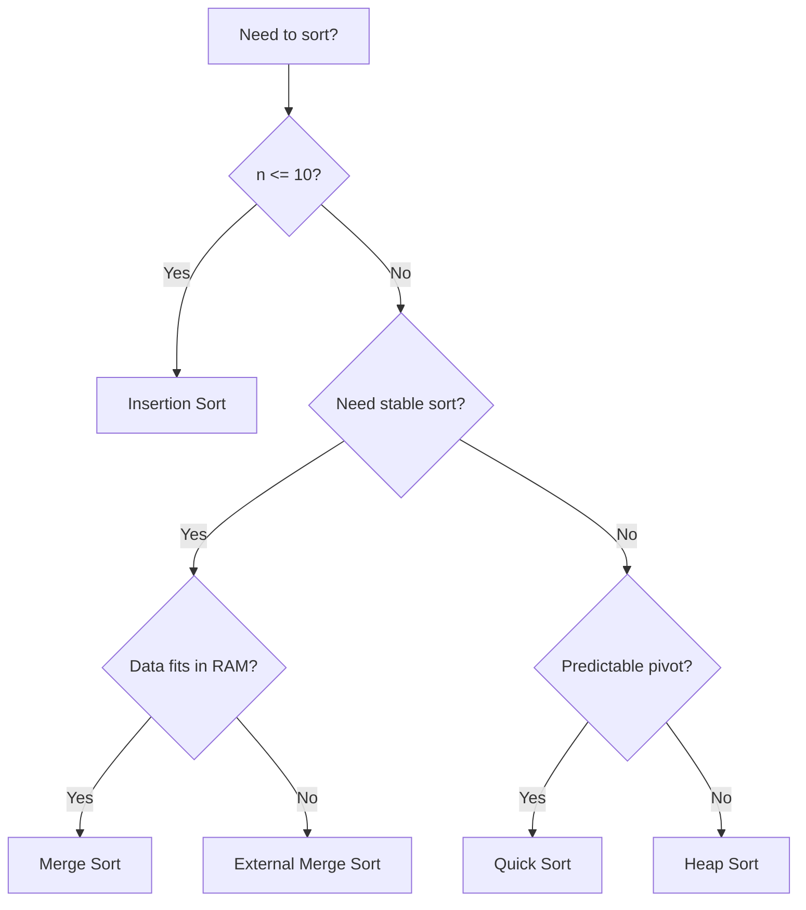

# Phần 1.2: Giải thuật Chi tiết (Detailed Algorithms)

Tài liệu này là bản dịch và biên soạn chi tiết từ nguồn JavaGuide, bao gồm đầy đủ các giải thích, ví dụ code Java và hình ảnh minh họa.

---

## 1. Giới thiệu về Thuật toán Sắp xếp

### 1.1. Tổng quan các Thuật toán Sắp xếp

Sắp xếp là việc làm cho một chuỗi bản ghi xếp theo thứ tự tăng dần hoặc giảm dần dựa trên một hoặc nhiều khóa (key) của chúng. Thuật toán sắp xếp được ứng dụng rộng rãi trong nhiều lĩnh vực, đặc biệt là xử lý dữ liệu lớn. Một thuật toán tốt có thể tiết kiệm đáng kể tài nguyên.

| Thuật toán | Độ phức tạp (TB) | Độ phức tạp (Tệ nhất) | Độ phức tạp (Tốt nhất) | Không gian | Phương pháp | Ổn định |
| :--------- | :--------------- | :-------------------- | :--------------------- | :--------- | :---------- | :------ |
| Bubble Sort | O(n²) | O(n²) | O(n) | O(1) | In-place | ✅ Có |
| Selection Sort | O(n²) | O(n²) | O(n²) | O(1) | In-place | ❌ Không |
| Insertion Sort | O(n²) | O(n²) | O(n) | O(1) | In-place | ✅ Có |
| Shell Sort | O(n log n) | O(n²) | O(n log n) | O(1) | In-place | ❌ Không |
| Merge Sort | O(n log n) | O(n log n) | O(n log n) | O(n) | Out-of-place | ✅ Có |
| Quick Sort | O(n log n) | O(n²) | O(n log n) | O(log n) | In-place | ❌ Không |
| Heap Sort | O(n log n) | O(n log n) | O(n log n) | O(1) | In-place | ❌ Không |
| Counting Sort | O(n+k) | O(n+k) | O(n+k) | O(k) | Out-of-place | ✅ Có |
| Bucket Sort | O(n+k) | O(n²) | O(n+k) | O(n+k) | Out-of-place | ✅ Có |
| Radix Sort | O(n×k) | O(n×k) | O(n×k) | O(n+k) | Out-of-place | ✅ Có |

**Giải thích thuật ngữ:**

*   **n**: Kích thước dữ liệu (số lượng phần tử cần sắp xếp).
*   **k**: Số lượng "bucket" hoặc phạm vi dữ liệu (trong một số thuật toán như Radix Sort, Bucket Sort).
*   **In-place (Tại chỗ)**: Tất cả thao tác sắp xếp diễn ra trong bộ nhớ, không cần thêm bộ nhớ phụ ngoài disk.
*   **Out-of-place (Ngoài chỗ)**: Khi dữ liệu quá lớn, không thể load hết vào bộ nhớ, cần lưu trữ tạm vào thiết bị ngoài.
*   **Ổn định (Stable)**: Nếu A nằm trước B và A = B, sau khi sắp xếp A vẫn nằm trước B.
*   **Không ổn định (Unstable)**: Nếu A nằm trước B và A = B, sau khi sắp xếp A có thể nằm sau B.

### 1.2. Phân loại Thuật toán Sắp xếp

Thuật toán sắp xếp được chia thành hai loại chính: **So sánh** và **Không so sánh**.


**Thuật toán so sánh (Comparison-based):**
*   Quick Sort, Merge Sort, Heap Sort, Bubble Sort v.v.
*   Xác định thứ tự tương đối của các phần tử thông qua so sánh.
*   Độ phức tạp thời gian không thể vượt qua `O(n log n)`.

**Thuật toán không so sánh (Non-comparison):**
*   Counting Sort, Radix Sort, Bucket Sort.
*   Không so sánh để xác định thứ tự mà xác định vị trí của mỗi phần tử bằng cách đếm số phần tử trước nó.
*   Có thể đạt độ phức tạp thời gian tuyến tính `O(n)`.

---

## 2. Sắp xếp Nổi bọt (Bubble Sort)

Sắp xếp nổi bọt là thuật toán đơn giản. Nó lặp đi lặp lại việc duyệt qua chuỗi cần sắp xếp, so sánh hai phần tử kề nhau, nếu thứ tự sai thì hoán đổi chúng. Việc duyệt được lặp lại cho đến khi không cần hoán đổi nữa. Tên gọi này xuất phát từ việc phần tử nhỏ hơn sẽ dần "nổi" lên đầu dãy.

### 2.1. Các bước thuật toán

1.  So sánh hai phần tử kề nhau. Nếu phần tử đầu lớn hơn phần tử sau, hoán đổi chúng.
2.  Thực hiện tương tự cho mọi cặp phần tử kề nhau từ đầu đến cuối. Sau bước này, phần tử cuối cùng sẽ là lớn nhất.
3.  Lặp lại các bước trên cho tất cả phần tử, trừ phần tử cuối cùng.
4.  Tiếp tục lặp cho đến khi sắp xếp hoàn tất.

### 2.2. Hình ảnh minh họa


### 2.3. Code Java

```java
/**
 * Sắp xếp nổi bọt (Bubble Sort)
 * @param arr Mảng cần sắp xếp
 * @return arr Mảng đã sắp xếp
 */
public static int[] bubbleSort(int[] arr) {
    for (int i = 1; i < arr.length; i++) {
        // Đặt cờ, nếu true nghĩa là vòng lặp không có hoán đổi,
        // tức là dãy đã được sắp xếp, kết thúc sắp xếp.
        boolean flag = true;
        for (int j = 0; j < arr.length - i; j++) {
            if (arr[j] > arr[j + 1]) {
                int tmp = arr[j];
                arr[j] = arr[j + 1];
                arr[j + 1] = tmp;
                // Đổi cờ
                flag = false;
            }
        }
        if (flag) {
            break;
        }
    }
    return arr;
}
```

**Tối ưu:** Code trên đã thêm cờ `flag` để tối ưu độ phức tạp thời gian tốt nhất thành `O(n)`, tức là khi dãy đầu vào đã được sắp xếp sẵn.

### 2.4. Phân tích thuật toán

*   **Tính ổn định**: Ổn định ✅
*   **Độ phức tạp thời gian**: Tốt nhất O(n), Tệ nhất O(n²), Trung bình O(n²)
*   **Độ phức tạp không gian**: O(1)
*   **Phương pháp**: In-place

---

## 3. Sắp xếp Chọn (Selection Sort)

Sắp xếp chọn là thuật toán đơn giản và trực quan, luôn có độ phức tạp O(n²) bất kể dữ liệu đầu vào. Ưu điểm duy nhất là không chiếm thêm bộ nhớ. **Nguyên lý:** Tìm phần tử nhỏ nhất (hoặc lớn nhất) trong dãy chưa sắp xếp, đặt vào đầu dãy đã sắp xếp. Tiếp tục tìm phần tử nhỏ nhất (lớn nhất) từ các phần tử chưa sắp xếp còn lại, đặt vào cuối dãy đã sắp xếp. Lặp lại cho đến khi hoàn tất.

### 3.1. Các bước thuật toán

1.  Tìm phần tử nhỏ nhất (lớn nhất) trong dãy chưa sắp xếp, đặt vào đầu dãy đã sắp xếp.
2.  Tiếp tục tìm phần tử nhỏ nhất (lớn nhất) từ các phần tử chưa sắp xếp còn lại, đặt vào cuối dãy đã sắp xếp.
3.  Lặp lại bước 2 cho đến khi tất cả phần tử đều được sắp xếp.

### 3.2. Hình ảnh minh họa


### 3.3. Code Java

```java
/**
 * Sắp xếp chọn (Selection Sort)
 * @param arr Mảng cần sắp xếp
 * @return arr Mảng đã sắp xếp
 */
public static int[] selectionSort(int[] arr) {
    for (int i = 0; i < arr.length - 1; i++) {
        int minIndex = i;
        for (int j = i + 1; j < arr.length; j++) {
            if (arr[j] < arr[minIndex]) {
                minIndex = j;
            }
        }
        if (minIndex != i) {
            int tmp = arr[i];
            arr[i] = arr[minIndex];
            arr[minIndex] = tmp;
        }
    }
    return arr;
}
```

### 3.4. Phân tích thuật toán

*   **Tính ổn định**: Không ổn định ❌
*   **Độ phức tạp thời gian**: Tốt nhất O(n²), Tệ nhất O(n²), Trung bình O(n²)
*   **Độ phức tạp không gian**: O(1)
*   **Phương pháp**: In-place

---

## 4. Sắp xếp Chèn (Insertion Sort)

Sắp xếp chèn là thuật toán đơn giản và trực quan. **Nguyên lý:** Xây dựng dãy đã sắp xếp, với mỗi phần tử chưa sắp xếp, quét từ sau ra trước trong dãy đã sắp xếp để tìm vị trí phù hợp và chèn vào. Giống như khi chơi bài, chúng ta xếp bài trên tay theo thứ tự bằng cách chèn từng lá bài mới vào đúng vị trí.

### 4.1. Các bước thuật toán

1.  Bắt đầu từ phần tử đầu tiên, coi phần tử đó đã được sắp xếp.
2.  Lấy phần tử tiếp theo, quét từ sau ra trước trong dãy đã sắp xếp.
3.  Nếu phần tử đã sắp xếp lớn hơn phần tử mới, di chuyển phần tử đó sang vị trí tiếp theo.
4.  Lặp lại bước 3 cho đến khi tìm được vị trí phần tử đã sắp xếp nhỏ hơn hoặc bằng phần tử mới.
5.  Chèn phần tử mới vào vị trí đó.
6.  Lặp lại bước 2~5.

### 4.2. Hình ảnh minh họa


### 4.3. Code Java

```java
/**
 * Sắp xếp chèn (Insertion Sort)
 * @param arr Mảng cần sắp xếp
 * @return arr Mảng đã sắp xếp
 */
public static int[] insertionSort(int[] arr) {
    for (int i = 1; i < arr.length; i++) {
        int preIndex = i - 1;
        int current = arr[i];
        while (preIndex >= 0 && current < arr[preIndex]) {
            arr[preIndex + 1] = arr[preIndex];
            preIndex -= 1;
        }
        arr[preIndex + 1] = current;
    }
    return arr;
}
```

### 4.4. Phân tích thuật toán

*   **Tính ổn định**: Ổn định ✅
*   **Độ phức tạp thời gian**: Tốt nhất O(n), Tệ nhất O(n²), Trung bình O(n²)
*   **Độ phức tạp không gian**: O(1)
*   **Phương pháp**: In-place

---

## 5. Sắp xếp Shell (Shell Sort)

Shell Sort được Donald Shell đề xuất năm 1959. Đây là phiên bản cải tiến của Insertion Sort, còn gọi là thuật toán sắp xếp tăng dần giảm (Diminishing Increment Sort), là một trong những thuật toán đầu tiên phá vỡ ngưỡng O(n²).

**Ý tưởng cơ bản:** Chia dãy cần sắp xếp thành nhiều dãy con để thực hiện Insertion Sort riêng lẻ. Khi toàn bộ dãy "gần như đã sắp xếp", thực hiện Insertion Sort lần cuối trên toàn bộ dãy.

### 5.1. Các bước thuật toán

Chọn chuỗi tăng (increment sequence) `{n/2, (n/2)/2, ..., 1}` (gọi là "Shell increment"):

*   Chọn một chuỗi tăng `{t₁, t₂, ..., tₖ}`, trong đó `tᵢ > tⱼ` nếu `i < j`, `tₖ = 1`.
*   Theo số lượng phần tử k trong chuỗi tăng, thực hiện k lượt sắp xếp.
*   Mỗi lượt sắp xếp, dựa vào giá trị tăng t tương ứng, chia dãy thành các dãy con có độ dài m, thực hiện Insertion Sort trên từng dãy con. Chỉ khi giá trị tăng bằng 1, toàn bộ dãy được coi như một bảng duy nhất.

### 5.2. Hình ảnh minh họa


### 5.3. Code Java

```java
/**
 * Sắp xếp Shell (Shell Sort)
 * @param arr Mảng cần sắp xếp
 * @return arr Mảng đã sắp xếp
 */
public static int[] shellSort(int[] arr) {
    int n = arr.length;
    int gap = n / 2;
    while (gap > 0) {
        for (int i = gap; i < n; i++) {
            int current = arr[i];
            int preIndex = i - gap;
            // Insertion sort với gap
            while (preIndex >= 0 && arr[preIndex] > current) {
                arr[preIndex + gap] = arr[preIndex];
                preIndex -= gap;
            }
            arr[preIndex + gap] = current;
        }
        gap /= 2;
    }
    return arr;
}
```

### 5.4. Phân tích thuật toán

*   **Tính ổn định**: Không ổn định ❌
*   **Độ phức tạp thời gian**: Tốt nhất O(n log n), Tệ nhất O(n²), Trung bình O(n log n)
*   **Độ phức tạp không gian**: O(1)

---

## 6. Sắp xếp Trộn (Merge Sort)

Merge Sort được xây dựng trên thao tác trộn (merge), là ứng dụng điển hình của **Chia để Trị (Divide and Conquer)**. Đây là thuật toán sắp xếp ổn định. Trộn các dãy con đã sắp xếp để có dãy hoàn toàn có thứ tự: trước tiên làm cho từng dãy con có thứ tự, sau đó làm cho các đoạn dãy con có thứ tự với nhau. Trộn hai bảng có thứ tự thành một bảng có thứ tự gọi là "2-way merge".

### 6.1. Các bước thuật toán

Merge Sort là quá trình đệ quy, điều kiện biên là khi dãy đầu vào chỉ có một phần tử, trả về ngay:

1.  Nếu đầu vào chỉ có một phần tử, trả về ngay. Ngược lại, chia dãy độ dài n thành hai dãy con độ dài n/2.
2.  Đệ quy Merge Sort trên hai dãy con để làm chúng có thứ tự.
3.  Đặt hai con trỏ, trỏ đến vị trí đầu của hai dãy con đã sắp xếp.
4.  So sánh hai phần tử tại hai con trỏ, chọn phần tử nhỏ hơn đưa vào không gian kết quả, di chuyển con trỏ tương ứng.
5.  Lặp lại bước 3~4 cho đến khi một con trỏ đến cuối dãy.
6.  Sao chép tất cả phần tử còn lại của dãy kia vào cuối kết quả.

### 6.2. Hình ảnh minh họa


### 6.3. Code Java

```java
/**
 * Sắp xếp trộn (Merge Sort)
 * @param arr Mảng cần sắp xếp
 * @return arr Mảng đã sắp xếp
 */
public static int[] mergeSort(int[] arr) {
    if (arr.length <= 1) {
        return arr;
    }
    int middle = arr.length / 2;
    int[] arr_1 = Arrays.copyOfRange(arr, 0, middle);
    int[] arr_2 = Arrays.copyOfRange(arr, middle, arr.length);
    return merge(mergeSort(arr_1), mergeSort(arr_2));
}

/**
 * Trộn hai mảng đã sắp xếp
 */
public static int[] merge(int[] arr_1, int[] arr_2) {
    int[] sorted_arr = new int[arr_1.length + arr_2.length];
    int idx = 0, idx_1 = 0, idx_2 = 0;
    while (idx_1 < arr_1.length && idx_2 < arr_2.length) {
        if (arr_1[idx_1] < arr_2[idx_2]) {
            sorted_arr[idx] = arr_1[idx_1];
            idx_1 += 1;
        } else {
            sorted_arr[idx] = arr_2[idx_2];
            idx_2 += 1;
        }
        idx += 1;
    }
    // Sao chép phần còn lại
    while (idx_1 < arr_1.length) {
        sorted_arr[idx++] = arr_1[idx_1++];
    }
    while (idx_2 < arr_2.length) {
        sorted_arr[idx++] = arr_2[idx_2++];
    }
    return sorted_arr;
}
```

### 6.4. Phân tích thuật toán

*   **Tính ổn định**: Ổn định ✅
*   **Độ phức tạp thời gian**: Tốt nhất O(n log n), Tệ nhất O(n log n), Trung bình O(n log n)
*   **Độ phức tạp không gian**: O(n)

---

## 7. Sắp xếp Nhanh (Quick Sort)

Quick Sort sử dụng tư tưởng **Chia để Trị**, tương tự Merge Sort. Điểm khác biệt là Quick Sort khi chia bài toán con sẽ xử lý thêm một bước: chia thành hai nhóm lớn và nhỏ, do đó khi ghép lại không cần so sánh như Merge Sort. Tuy nhiên, do tính không xác định trong việc chia, độ phức tạp thời gian của Quick Sort không ổn định.

**Ý tưởng cơ bản:** Qua một lượt sắp xếp, chia dãy thành hai phần độc lập, một phần chứa các phần tử nhỏ hơn phần còn lại. Sau đó đệ quy sắp xếp hai phần đó, đạt được dãy hoàn toàn có thứ tự.

### 7.1. Các bước thuật toán

1.  **Chọn Pivot**: Chọn một phần tử làm điểm chốt. Để tránh trường hợp tệ nhất, thường chọn ngẫu nhiên.
2.  **Phân hoạch (Partition)**: Sắp xếp lại dãy: các phần tử nhỏ hơn pivot đặt trước, các phần tử lớn hơn pivot đặt sau (các phần tử bằng có thể đặt bất kỳ bên nào). Sau thao tác này, pivot nằm ở vị trí giữa dãy.
3.  **Đệ quy (Recurse)**: Đệ quy Quick Sort trên dãy con nhỏ hơn pivot và dãy con lớn hơn pivot.

**Về hiệu suất:**
*   **Trường hợp trung bình và tốt nhất**: O(n log n). Xảy ra khi mỗi lần phân hoạch đều chia dãy thành hai nửa gần bằng nhau.
*   **Trường hợp tệ nhất**: O(n²). Xảy ra khi mỗi lần chọn pivot đều là phần tử nhỏ nhất hoặc lớn nhất (ví dụ dãy đã sắp xếp sẵn và luôn chọn phần tử đầu làm pivot). Đây là lý do **chọn pivot ngẫu nhiên** rất quan trọng.

### 7.2. Hình ảnh minh họa


### 7.3. Code Java

```java
import java.util.concurrent.ThreadLocalRandom;

class Solution {
    public int[] sortArray(int[] a) {
        quick(a, 0, a.length - 1);
        return a;
    }

    // Hàm đệ quy chính của Quick Sort
    void quick(int[] a, int left, int right) {
        if (left >= right) { // Điều kiện kết thúc đệ quy
            return;
        }
        int p = partition(a, left, right); // Phân hoạch, trả về vị trí pivot
        quick(a, left, p - 1);  // Đệ quy sắp xếp dãy con trái
        quick(a, p + 1, right); // Đệ quy sắp xếp dãy con phải
    }

    // Hàm phân hoạch: chia mảng thành 2 phần, nhỏ hơn pivot bên trái, lớn hơn bên phải
    int partition(int[] a, int left, int right) {
        // Chọn ngẫu nhiên một điểm pivot để tránh trường hợp tệ nhất
        int idx = ThreadLocalRandom.current().nextInt(right - left + 1) + left;
        swap(a, left, idx); // Đưa pivot về đầu mảng
        int pv = a[left];   // Giá trị pivot
        int i = left + 1;   // Con trỏ trái
        int j = right;      // Con trỏ phải

        while (i <= j) {
            // Con trỏ trái di chuyển sang phải cho đến khi gặp phần tử >= pivot
            while (i <= j && a[i] < pv) {
                i++;
            }
            // Con trỏ phải di chuyển sang trái cho đến khi gặp phần tử <= pivot
            while (i <= j && a[j] > pv) {
                j--;
            }
            // Nếu con trỏ trái chưa vượt con trỏ phải, hoán đổi hai phần tử
            if (i <= j) {
                swap(a, i, j);
                i++;
                j--;
            }
        }
        // Đưa pivot về vị trí phân hoạch
        swap(a, j, left);
        return j;
    }

    // Hoán đổi hai phần tử trong mảng
    void swap(int[] a, int i, int j) {
        int t = a[i];
        a[i] = a[j];
        a[j] = t;
    }
}
```

### 7.4. Phân tích thuật toán

*   **Tính ổn định**: Không ổn định ❌
*   **Độ phức tạp thời gian**: Tốt nhất O(n log n), Tệ nhất O(n²), Trung bình O(n log n)
*   **Độ phức tạp không gian**: O(log n)

---

## 8. Sắp xếp Heap (Heap Sort)

Heap Sort sử dụng cấu trúc dữ liệu Heap để sắp xếp. Heap là cấu trúc cây nhị phân gần hoàn chỉnh, đồng thời thỏa mãn **tính chất Heap**: giá trị nút con luôn nhỏ hơn (hoặc lớn hơn) giá trị nút cha.

### 8.1. Các bước thuật toán

1.  Xây dựng dãy ban đầu thành Max Heap, đây là vùng chưa sắp xếp.
2.  Hoán đổi phần tử đỉnh heap (R₁) với phần tử cuối (Rₙ). Thu được vùng chưa sắp xếp mới (R₁...Rₙ₋₁) và vùng đã sắp xếp (Rₙ), thỏa mãn Rᵢ ≤ Rₙ.
3.  Do sau hoán đổi, đỉnh heap mới có thể vi phạm tính chất heap, cần điều chỉnh (heapify) vùng chưa sắp xếp thành heap mới. Lặp lại hoán đổi R₁ với phần tử cuối vùng chưa sắp xếp cho đến khi vùng đã sắp xếp có n-1 phần tử.

### 8.2. Hình ảnh minh họa


### 8.3. Code Java

```java
static int heapLen;

private static void swap(int[] arr, int i, int j) {
    int tmp = arr[i];
    arr[i] = arr[j];
    arr[j] = tmp;
}

// Xây dựng Max Heap
private static void buildMaxHeap(int[] arr) {
    for (int i = arr.length / 2 - 1; i >= 0; i--) {
        heapify(arr, i);
    }
}

// Điều chỉnh thành Max Heap
private static void heapify(int[] arr, int i) {
    int left = 2 * i + 1;
    int right = 2 * i + 2;
    int largest = i;
    if (right < heapLen && arr[right] > arr[largest]) {
        largest = right;
    }
    if (left < heapLen && arr[left] > arr[largest]) {
        largest = left;
    }
    if (largest != i) {
        swap(arr, largest, i);
        heapify(arr, largest);
    }
}

// Heap Sort
public static int[] heapSort(int[] arr) {
    heapLen = arr.length;
    buildMaxHeap(arr);
    for (int i = arr.length - 1; i > 0; i--) {
        // Di chuyển đỉnh heap xuống cuối
        swap(arr, 0, i);
        heapLen -= 1;
        heapify(arr, 0);
    }
    return arr;
}
```

### 8.4. Phân tích thuật toán

*   **Tính ổn định**: Không ổn định ❌
*   **Độ phức tạp thời gian**: Tốt nhất O(n log n), Tệ nhất O(n log n), Trung bình O(n log n)
*   **Độ phức tạp không gian**: O(1)

---

## 9. Sắp xếp Đếm (Counting Sort)

Counting Sort là thuật toán sắp xếp tuyến tính. **Yêu cầu dữ liệu đầu vào phải là số nguyên trong phạm vi xác định.**

Counting Sort sử dụng một mảng phụ C, trong đó phần tử thứ i là số lượng phần tử có giá trị bằng i trong mảng A. Sau đó dựa vào mảng C để đặt các phần tử của A vào đúng vị trí.

### 9.1. Các bước thuật toán

1.  Tìm giá trị lớn nhất `max`, nhỏ nhất `min` trong mảng.
2.  Tạo mảng mới C có độ dài `max - min + 1`, tất cả phần tử mặc định là 0.
3.  Duyệt mảng gốc A, với mỗi phần tử `A[i]`, dùng `A[i] - min` làm chỉ số trong C, tăng giá trị `C[A[i] - min]` lên 1.
4.  Biến đổi C: phần tử mới = phần tử hiện tại + phần tử trước đó, tức `C[i] = C[i] + C[i-1]` (khi i > 0).
5.  Tạo mảng kết quả R cùng độ dài mảng gốc.
6.  Duyệt ngược mảng gốc A, với mỗi `A[i]`, dùng `A[i] - min` làm chỉ số trong C, `C[A[i] - min] - 1` là vị trí của `A[i]` trong R. Sau đó giảm `C[A[i] - min]` đi 1.

### 9.2. Hình ảnh minh họa


### 9.3. Phân tích thuật toán

*   **Tính ổn định**: Ổn định ✅
*   **Độ phức tạp thời gian**: O(n+k)
*   **Độ phức tạp không gian**: O(k)

---

## 10. Sắp xếp Bucket (Bucket Sort)

Bucket Sort là phiên bản nâng cấp của Counting Sort. Nó sử dụng hàm ánh xạ để phân phối dữ liệu vào các bucket, sau đó sắp xếp từng bucket riêng lẻ.

### 10.1. Các bước thuật toán

1.  Thiết lập BucketSize (số lượng giá trị khác nhau mỗi bucket có thể chứa).
2.  Duyệt dữ liệu đầu vào, phân phối vào các bucket tương ứng.
3.  Sắp xếp từng bucket không rỗng (có thể dùng thuật toán khác hoặc đệ quy Bucket Sort).
4.  Ghép các bucket đã sắp xếp lại với nhau.

### 10.2. Hình ảnh minh họa


### 10.3. Phân tích thuật toán

*   **Tính ổn định**: Ổn định ✅
*   **Độ phức tạp thời gian**: Tốt nhất O(n+k), Tệ nhất O(n²), Trung bình O(n+k)
*   **Độ phức tạp không gian**: O(n+k)

---

## 11. Sắp xếp Cơ số (Radix Sort)

Radix Sort cũng là thuật toán không so sánh, sắp xếp theo từng chữ số của phần tử, bắt đầu từ chữ số thấp nhất. Độ phức tạp O(n×k), với n là độ dài mảng, k là số chữ số lớn nhất của phần tử.

**Ý tưởng:** Sắp xếp theo chữ số thấp trước, thu thập lại; sắp xếp theo chữ số cao hơn, thu thập lại; tiếp tục cho đến chữ số cao nhất.

### 11.1. Các bước thuật toán

1.  Lấy phần tử lớn nhất trong mảng, xác định số chữ số (số lần lặp N).
2.  A là mảng gốc, lấy từng chữ số từ thấp đến cao tạo thành mảng radix.
3.  Thực hiện Counting Sort trên mảng radix (tận dụng đặc tính Counting Sort phù hợp với phạm vi nhỏ).
4.  Gán lại giá trị từ radix vào mảng gốc.
5.  Lặp lại bước 2~4 N lần.

### 11.2. Hình ảnh minh họa


### 11.3. Phân tích thuật toán

*   **Tính ổn định**: Ổn định ✅
*   **Độ phức tạp thời gian**: O(n×k)
*   **Độ phức tạp không gian**: O(n+k)

**So sánh Radix Sort, Counting Sort, Bucket Sort:**

*   **Radix Sort**: Phân phối bucket theo từng chữ số của key.
*   **Counting Sort**: Mỗi bucket chỉ lưu một giá trị key duy nhất.
*   **Bucket Sort**: Mỗi bucket lưu một phạm vi giá trị.

---

## 12. Thuật toán KMP (Knuth-Morris-Pratt)

KMP là thuật toán tìm kiếm chuỗi con trong chuỗi cha. Nó có thể tìm vị trí xuất hiện của chuỗi con W trong chuỗi S. KMP có độ phức tạp thời gian **O(m+n)** và không gian **O(m)** (m là độ dài chuỗi con).

**Vấn đề của "Brute Force Search":** Khi so khớp thất bại, phương pháp vét cạn sẽ quay lui con trỏ chuỗi chính về, gây ra hiệu suất thấp.

**Ý tưởng KMP:** Tận dụng thông tin về phần đã khớp thành công, giữ nguyên con trỏ chuỗi chính (không quay lui), chỉ điều chỉnh con trỏ chuỗi mẫu để chuỗi mẫu di chuyển đến vị trí hiệu quả nhất có thể.

**Tài liệu tham khảo:**
*   [Từ đầu đến cuối hiểu rõ KMP](https://blog.csdn.net/v_july_v/article/details/7041827)
*   [Làm sao để hiểu và nắm vững thuật toán KMP?](https://www.zhihu.com/question/21923021)
*   [KMP Algorithm - Bilibili](https://www.bilibili.com/video/av3246487/)

**Thuật toán BM (Boyer-Moore):** Cũng là thuật toán khớp chuỗi chính xác, so sánh từ phải sang trái, áp dụng hai quy tắc: "Bad Character Rule" và "Good Suffix Rule".

---

## 13. Các Bài toán Chuỗi Phổ biến

### 13.1. Thay thế Khoảng trắng

> **Bài toán (Kiếm chỉ Offer):** Triển khai hàm thay thế mỗi khoảng trắng trong chuỗi thành "%20". Ví dụ: "We Are Happy" → "We%20Are%20Happy".

**Giải pháp 1: Cách thông thường**
```java
public static String replaceSpace(StringBuffer str) {
    int length = str.length();
    StringBuffer result = new StringBuffer();
    for (int i = 0; i < length; i++) {
        char b = str.charAt(i);
        if (String.valueOf(b).equals(" ")) {
            result.append("%20");
        } else {
            result.append(b);
        }
    }
    return result.toString();
}
```

**Giải pháp 2: Sử dụng API**
```java
public static String replaceSpace2(StringBuffer str) {
    return str.toString().replace(" ", "%20");
}
```

### 13.2. Tiền tố Chung Dài nhất

> **Bài toán (Leetcode):** Tìm tiền tố chung dài nhất của mảng chuỗi. Nếu không tồn tại, trả về chuỗi rỗng "".

**Ví dụ:**
*   Input: `["flower","flow","flight"]` → Output: `"fl"`
*   Input: `["dog","racecar","car"]` → Output: `""`

**Ý tưởng:** Sắp xếp mảng, sau đó so sánh phần tử đầu và cuối của mảng đã sắp xếp!

```java
public static String longestCommonPrefix(String[] strs) {
    if (strs == null || strs.length == 0) return "";
    Arrays.sort(strs);
    int len = strs.length;
    StringBuilder res = new StringBuilder();
    int m = strs[0].length();
    int n = strs[len - 1].length();
    int num = Math.min(m, n);
    for (int i = 0; i < num; i++) {
        if (strs[0].charAt(i) == strs[len - 1].charAt(i)) {
            res.append(strs[0].charAt(i));
        } else {
            break;
        }
    }
    return res.toString();
}
```

### 13.3. Chuỗi Đối xứng (Palindrome)

#### Chuỗi Đối xứng Dài nhất có thể Xây dựng

> **Bài toán (Leetcode):** Cho chuỗi chứa chữ hoa và chữ thường, tìm độ dài chuỗi đối xứng dài nhất có thể xây dựng từ các ký tự này.

*   Input: `"abccccdd"` → Output: `7` (giải thích: "dccaccd" có độ dài 7)

**Ý tưởng:** Đếm số lần xuất hiện của mỗi ký tự. Ký tự xuất hiện số chẵn lần có thể dùng hết. Nếu có ký tự xuất hiện số lẻ lần, có thể thêm 1 vào độ dài.

```java
public int longestPalindrome(String s) {
    if (s.length() == 0) return 0;
    HashSet<Character> hashset = new HashSet<>();
    char[] chars = s.toCharArray();
    int count = 0;
    for (int i = 0; i < chars.length; i++) {
        if (!hashset.contains(chars[i])) {
            hashset.add(chars[i]);
        } else {
            hashset.remove(chars[i]);
            count++;
        }
    }
    return hashset.isEmpty() ? count * 2 : count * 2 + 1;
}
```

#### Chuỗi Con Đối xứng Dài nhất

> **Bài toán (Leetcode):** Cho chuỗi s, tìm chuỗi con đối xứng dài nhất trong s.

*   Input: `"babad"` → Output: `"bab"` (hoặc "aba")

**Ý tưởng:** Với mỗi phần tử làm tâm, mở rộng ra hai bên để tìm chuỗi đối xứng dài nhất (cần kiểm tra cả trường hợp độ dài chẵn và lẻ).

```java
class Solution {
    private int index, len;

    public String longestPalindrome(String s) {
        if (s.length() < 2) return s;
        for (int i = 0; i < s.length() - 1; i++) {
            PalindromeHelper(s, i, i);       // Độ dài lẻ
            PalindromeHelper(s, i, i + 1);   // Độ dài chẵn
        }
        return s.substring(index, index + len);
    }

    public void PalindromeHelper(String s, int l, int r) {
        while (l >= 0 && r < s.length() && s.charAt(l) == s.charAt(r)) {
            l--;
            r++;
        }
        if (len < r - l - 1) {
            index = l + 1;
            len = r - l - 1;
        }
    }
}
```

---

## 14. Các Bài toán Danh sách Liên kết Phổ biến

### 14.1. Cộng hai Số (Add Two Numbers)

> **Bài toán (Leetcode):** Cho hai danh sách liên kết không rỗng biểu diễn hai số không âm. Các chữ số được lưu theo thứ tự ngược (chữ số thấp ở đầu). Cộng hai số và trả về kết quả dưới dạng danh sách liên kết.

Input: `(2 -> 4 -> 3) + (5 -> 6 -> 4)` → Output: `7 -> 0 -> 8` (vì 342 + 465 = 807)


**Ý tưởng:** Duyệt từ đầu hai danh sách liên kết (từ chữ số thấp nhất), cộng từng vị trí và theo dõi số nhớ (carry).

```java
public ListNode addTwoNumbers(ListNode l1, ListNode l2) {
    ListNode dummyHead = new ListNode(0);
    ListNode p = l1, q = l2, curr = dummyHead;
    int carry = 0;  // Số nhớ
    while (p != null || q != null) {
        int x = (p != null) ? p.val : 0;
        int y = (q != null) ? q.val : 0;
        int sum = carry + x + y;
        carry = sum / 10;
        curr.next = new ListNode(sum % 10);
        curr = curr.next;
        if (p != null) p = p.next;
        if (q != null) q = q.next;
    }
    if (carry > 0) {
        curr.next = new ListNode(carry);
    }
    return dummyHead.next;
}
```

### 14.2. Đảo ngược Danh sách Liên kết (Reverse Linked List)

> **Bài toán (Kiếm chỉ Offer):** Cho một danh sách liên kết, đảo ngược danh sách và xuất ra các phần tử.


**Ý tưởng:** Làm cho nút sau trỏ đến nút trước. Sử dụng biến `next` để lưu nút tiếp theo, tránh "đứt" danh sách.

```java
public ListNode ReverseList(ListNode head) {
    ListNode next = null;
    ListNode pre = null;

    while (head != null) {
        next = head.next;    // Lưu nút tiếp theo
        head.next = pre;     // Nút hiện tại trỏ về nút đã đảo ngược trước đó
        pre = head;          // Cập nhật nút đã đảo ngược
        head = next;         // Tiến đến nút tiếp theo
    }
    return pre;
}
```

### 14.3. Nút thứ K từ Cuối

> **Bài toán (Kiếm chỉ Offer):** Cho một danh sách liên kết, xuất nút thứ k từ cuối.

**Ý tưởng:** Nút thứ k từ cuối cũng là nút thứ (L - K + 1) từ đầu. Dùng hai con trỏ: con trỏ 1 đi trước k-1 bước, sau đó cả hai cùng đi. Khi con trỏ 1 đến cuối, con trỏ 2 chính là nút cần tìm.

```java
public ListNode FindKthToTail(ListNode head, int k) {
    if (head == null || k <= 0) return null;
    ListNode node1 = head, node2 = head;
    int count = 0;
    int index = k;
    while (node1 != null) {
        node1 = node1.next;
        count++;
        if (k < 1) {
            node2 = node2.next;
        }
        k--;
    }
    if (count < index) return null;
    return node2;
}
```

### 14.4. Trộn hai Danh sách Liên kết Đã sắp xếp

> **Bài toán (Kiếm chỉ Offer):** Cho hai danh sách liên kết đã sắp xếp tăng dần, trộn chúng thành một danh sách liên kết mới sao cho vẫn giữ thứ tự tăng dần.

**Ý tưởng (Đệ quy):** So sánh nút đầu của hai danh sách, nút nào nhỏ hơn sẽ là nút tiếp theo, và đệ quy cho phần còn lại.

```java
public ListNode Merge(ListNode list1, ListNode list2) {
    if (list1 == null) return list2;
    if (list2 == null) return list1;
    if (list1.val <= list2.val) {
        list1.next = Merge(list1.next, list2);
        return list1;
    } else {
        list2.next = Merge(list1, list2.next);
        return list2;
    }
}
```

## 15. Bổ sung: Pattern Recognition & Templates

### 15.1. Binary Search Variants (lower_bound / upper_bound)

**Use case:** Tìm vị trí đầu tiên/lần cuối thỏa điều kiện trong mảng đã sắp xếp.

```java
// lower_bound: vị trí đầu tiên >= target
public int lowerBound(int[] nums, int target) {
    int l = 0, r = nums.length; // [l, r)
    while (l < r) {
        int mid = l + (r - l) / 2;
        if (nums[mid] < target) {
            l = mid + 1;
        } else {
            r = mid;
        }
    }
    return l;
}

// upper_bound: vị trí đầu tiên > target
public int upperBound(int[] nums, int target) {
    int l = 0, r = nums.length; // [l, r)
    while (l < r) {
        int mid = l + (r - l) / 2;
        if (nums[mid] <= target) {
            l = mid + 1;
        } else {
            r = mid;
        }
    }
    return l;
}
```

**Pitfall:** Sai điều kiện vòng lặp dẫn đến infinite loop → luôn dùng [l, r) cho dễ reasoning.

### 15.2. Sliding Window Template

**Use case:** Subarray/substring thỏa điều kiện (sum, distinct chars, etc.).

```java
public int longestSubarrayWithAtMostKDistinct(int[] nums, int k) {
    Map<Integer, Integer> freq = new HashMap<>();
    int left = 0, best = 0;
    for (int right = 0; right < nums.length; right++) {
        freq.put(nums[right], freq.getOrDefault(nums[right], 0) + 1);

        while (freq.size() > k) {
            int val = nums[left++];
            freq.put(val, freq.get(val) - 1);
            if (freq.get(val) == 0) {
                freq.remove(val);
            }
        }
        // Window [left, right] hợp lệ
        best = Math.max(best, right - left + 1);
    }
    return best;
}
```

**Best practices:**
- Rà điều kiện thu hẹp window bằng vòng `while`.
- Ghi rõ invariant: window luôn hợp lệ sau khi vòng while kết thúc.

### 15.3. DP Pattern Recognition (1D / 2D)

**Bài toán mẫu:** Climbing Stairs.

**Cách xử lý:**
1. Xác định state `dp[i]` = số cách lên bậc i.
2. Transition: `dp[i] = dp[i-1] + dp[i-2]`.
3. Optimize space với rolling array.

```java
public int climbStairs(int n) {
    if (n <= 2) return n;
    int prev2 = 1, prev1 = 2;
    for (int i = 3; i <= n; i++) {
        int cur = prev1 + prev2;
        prev2 = prev1;
        prev1 = cur;
    }
    return prev1;
}
```

### 15.4. Graph Shortest Path: BFS vs Dijkstra

| Tình huống | Thuật toán |
| --- | --- |
| Tất cả cạnh trọng số = 1 | BFS |
| Trọng số không âm | Dijkstra |
| Có cạnh âm | Bellman-Ford |

**Dijkstra (PriorityQueue):**
```java
class Edge {
    int to, w;
    Edge(int to, int w) { this.to = to; this.w = w; }
}

public int[] dijkstra(List<List<Edge>> g, int start) {
    int n = g.size();
    int[] dist = new int[n];
    Arrays.fill(dist, Integer.MAX_VALUE);
    dist[start] = 0;
    PriorityQueue<int[]> pq = new PriorityQueue<>(Comparator.comparingInt(a -> a[1]));
    pq.offer(new int[]{start, 0});

    while (!pq.isEmpty()) {
        int[] cur = pq.poll();
        int u = cur[0];
        int d = cur[1];
        if (d != dist[u]) continue; // Bỏ entry lỗi thời
        for (Edge e : g.get(u)) {
            int nd = d + e.w;
            if (nd < dist[e.to]) {
                dist[e.to] = nd;
                pq.offer(new int[]{e.to, nd});
            }
        }
    }
    return dist;
}
```

### 15.5. Sorting Selection Matrix

| Trường hợp | Gợi ý thuật toán |
| --- | --- |
| Dữ liệu gần như đã sắp xếp | Insertion Sort / TimSort |
| Dữ liệu lớn không vừa RAM | External Sort (merge on disk) |
| Key phạm vi nhỏ | Counting / Radix |

---

## 16. Advanced Algorithms & Production Solutions

### 16.1. Sorting Advanced - When to Use Which Sort?

#### Decision Tree



#### TimSort (Java's Hybrid Sort)

**TimSort** là thuật toán hybrid (kết hợp Merge Sort và Insertion Sort) được dùng trong Java `Arrays.sort()` và Python.

**Key Features:**
- ✅ Stable sort
- ✅ O(n log n) worst case
- ✅ O(n) best case (when nearly sorted)
- ✅ Optimized for real-world data (có runs - sequences of sorted elements)

**How it works:**
1. Identify "runs" (ascending/descending sequences)
2. Use Insertion Sort for small runs (≤64 elements)
3. Merge runs using Merge Sort strategy

**Code Example (Simplified):**
```java
// Java uses TimSort internally
// Arrays.sort() uses TimSort for Object[] (stable)
// Arrays.sort() uses Dual-Pivot QuickSort for primitives (unstable but faster)

Integer[] arr = {5, 2, 8, 1, 9, 3};
Arrays.sort(arr); // Uses TimSort - stable O(n log n)

int[] primitives = {5, 2, 8, 1, 9, 3};
Arrays.sort(primitives); // Uses Dual-Pivot QuickSort - faster for primitives
```

**When to use:**
- ✅ General-purpose sorting (default choice in Java)
- ✅ When stability matters
- ✅ When data may be partially sorted

#### External Sorting (Data > Memory)

**Problem:** Sort 100GB file with 8GB RAM.

**Solution: External Merge Sort**

**Steps:**
1. **Divide:** Chia file thành chunks nhỏ hơn RAM
2. **Sort:** Sort từng chunk trong memory
3. **Merge:** Merge sorted chunks từ disk

**Code Example (Conceptual):**
```java
class ExternalSort {
    public void sortLargeFile(String inputFile, String outputFile, int chunkSize) throws IOException {
        // Step 1: Split into sorted chunks
        List<String> chunkFiles = splitAndSort(inputFile, chunkSize);
        
        // Step 2: Merge sorted chunks
        mergeChunks(chunkFiles, outputFile);
        
        // Step 3: Cleanup
        chunkFiles.forEach(file -> new File(file).delete());
    }
    
    private List<String> splitAndSort(String inputFile, int chunkSize) throws IOException {
        List<String> chunkFiles = new ArrayList<>();
        try (BufferedReader reader = new BufferedReader(new FileReader(inputFile))) {
            List<Integer> chunk = new ArrayList<>();
            int chunkNum = 0;
            String line;
            
            while ((line = reader.readLine()) != null) {
                chunk.add(Integer.parseInt(line));
                
                if (chunk.size() >= chunkSize) {
                    // Sort chunk in memory
                    chunk.sort(Integer::compareTo);
                    
                    // Write to temporary file
                    String chunkFile = "chunk_" + chunkNum + ".tmp";
                    writeChunk(chunk, chunkFile);
                    chunkFiles.add(chunkFile);
                    chunk.clear();
                    chunkNum++;
                }
            }
            
            // Handle remaining
            if (!chunk.isEmpty()) {
                chunk.sort(Integer::compareTo);
                String chunkFile = "chunk_" + chunkNum + ".tmp";
                writeChunk(chunk, chunkFile);
                chunkFiles.add(chunkFile);
            }
        }
        return chunkFiles;
    }
    
    private void mergeChunks(List<String> chunkFiles, String outputFile) throws IOException {
        // Use priority queue for k-way merge
        PriorityQueue<ChunkReader> pq = new PriorityQueue<>();
        
        // Initialize readers
        for (String chunkFile : chunkFiles) {
            ChunkReader reader = new ChunkReader(chunkFile);
            if (reader.hasNext()) {
                pq.offer(reader);
            }
        }
        
        // Merge
        try (BufferedWriter writer = new BufferedWriter(new FileWriter(outputFile))) {
            while (!pq.isEmpty()) {
                ChunkReader reader = pq.poll();
                writer.write(reader.next().toString());
                writer.newLine();
                
                if (reader.hasNext()) {
                    pq.offer(reader);
                } else {
                    reader.close();
                }
            }
        }
    }
}
```

**Real-world use cases:**
- Database external sorting (ORDER BY on large tables)
- MapReduce shuffle phase
- Log file sorting

### 16.2. Search Patterns

#### Binary Search Variations

**1. Standard Binary Search**
```java
public int binarySearch(int[] arr, int target) {
    int left = 0, right = arr.length - 1;
    while (left <= right) {
        int mid = left + (right - left) / 2;
        if (arr[mid] == target) return mid;
        if (arr[mid] < target) left = mid + 1;
        else right = mid - 1;
    }
    return -1; // Not found
}
```

**2. Lower Bound (First >= target)**
```java
public int lowerBound(int[] arr, int target) {
    int left = 0, right = arr.length;
    while (left < right) {
        int mid = left + (right - left) / 2;
        if (arr[mid] < target) {
            left = mid + 1;
        } else {
            right = mid; // Don't exclude mid
        }
    }
    return left; // First position >= target
}
```

**3. Upper Bound (First > target)**
```java
public int upperBound(int[] arr, int target) {
    int left = 0, right = arr.length;
    while (left < right) {
        int mid = left + (right - left) / 2;
        if (arr[mid] <= target) {
            left = mid + 1; // Exclude mid
        } else {
            right = mid;
        }
    }
    return left; // First position > target
}
```

**Use cases:**
- **lowerBound**: Tìm first position có thể insert target (sorted array)
- **upperBound**: Tìm count of elements <= target (upperBound - lowerBound)

#### Two Pointers Technique

**Classic Problem: Two Sum (Sorted Array)**
```java
public int[] twoSum(int[] arr, int target) {
    int left = 0, right = arr.length - 1;
    while (left < right) {
        int sum = arr[left] + arr[right];
        if (sum == target) {
            return new int[]{left, right};
        } else if (sum < target) {
            left++; // Need larger sum
        } else {
            right--; // Need smaller sum
        }
    }
    return new int[]{-1, -1};
}
```

**Three Sum Problem:**
```java
public List<List<Integer>> threeSum(int[] nums) {
    Arrays.sort(nums);
    List<List<Integer>> result = new ArrayList<>();
    
    for (int i = 0; i < nums.length - 2; i++) {
        if (i > 0 && nums[i] == nums[i - 1]) continue; // Skip duplicates
        
        int left = i + 1, right = nums.length - 1;
        while (left < right) {
            int sum = nums[i] + nums[left] + nums[right];
            if (sum == 0) {
                result.add(Arrays.asList(nums[i], nums[left], nums[right]));
                // Skip duplicates
                while (left < right && nums[left] == nums[left + 1]) left++;
                while (left < right && nums[right] == nums[right - 1]) right--;
                left++;
                right--;
            } else if (sum < 0) {
                left++;
            } else {
                right--;
            }
        }
    }
    return result;
}
```

**Pattern:**
- ✅ Works on sorted arrays
- ✅ O(n) time, O(1) space
- ✅ Common in array/string problems

#### Sliding Window Pattern

**Template:**
```java
public int slidingWindow(int[] arr, int k) {
    int left = 0, right = 0;
    int windowSum = 0;
    int maxSum = Integer.MIN_VALUE;
    
    while (right < arr.length) {
        // Expand window
        windowSum += arr[right];
        
        // Shrink if needed
        while (right - left + 1 > k) {
            windowSum -= arr[left];
            left++;
        }
        
        // Process window (right - left + 1 == k)
        if (right - left + 1 == k) {
            maxSum = Math.max(maxSum, windowSum);
        }
        
        right++;
    }
    return maxSum;
}
```

**Example: Maximum Sum of K Consecutive Elements**
```java
public int maxSumKConsecutive(int[] arr, int k) {
    int windowSum = 0;
    // Initialize first window
    for (int i = 0; i < k; i++) {
        windowSum += arr[i];
    }
    
    int maxSum = windowSum;
    // Slide window
    for (int i = k; i < arr.length; i++) {
        windowSum = windowSum - arr[i - k] + arr[i]; // Remove left, add right
        maxSum = Math.max(maxSum, windowSum);
    }
    return maxSum;
}
```

**Example: Longest Substring Without Repeating Characters**
```java
public int lengthOfLongestSubstring(String s) {
    Map<Character, Integer> map = new HashMap<>();
    int left = 0, maxLen = 0;
    
    for (int right = 0; right < s.length(); right++) {
        char c = s.charAt(right);
        
        // Shrink window if duplicate found
        if (map.containsKey(c) && map.get(c) >= left) {
            left = map.get(c) + 1;
        }
        
        map.put(c, right);
        maxLen = Math.max(maxLen, right - left + 1);
    }
    return maxLen;
}
```

#### Fast & Slow Pointers (Cycle Detection)

**Problem: Detect Cycle in Linked List**
```java
class ListNode {
    int val;
    ListNode next;
    ListNode(int x) { val = x; }
}

public boolean hasCycle(ListNode head) {
    if (head == null) return false;
    
    ListNode slow = head;
    ListNode fast = head.next;
    
    while (fast != null && fast.next != null) {
        if (slow == fast) return true; // Cycle detected
        slow = slow.next;        // Move 1 step
        fast = fast.next.next;   // Move 2 steps
    }
    return false;
}
```

**Problem: Find Middle of Linked List**
```java
public ListNode findMiddle(ListNode head) {
    ListNode slow = head;
    ListNode fast = head;
    
    while (fast != null && fast.next != null) {
        slow = slow.next;        // Move 1 step
        fast = fast.next.next;   // Move 2 steps
    }
    return slow; // Middle node
}
```

**Pattern:**
- ✅ O(n) time, O(1) space
- ✅ Detect cycles, find middle, nth from end

### 16.3. Dynamic Programming Advanced

#### DP Pattern Recognition

**1. 1D DP Pattern**
```java
// Example: Fibonacci
public int fib(int n) {
    if (n <= 1) return n;
    int[] dp = new int[n + 1];
    dp[0] = 0;
    dp[1] = 1;
    for (int i = 2; i <= n; i++) {
        dp[i] = dp[i - 1] + dp[i - 2];
    }
    return dp[n];
}
```

**2. 2D DP Pattern**
```java
// Example: Unique Paths (m x n grid)
public int uniquePaths(int m, int n) {
    int[][] dp = new int[m][n];
    
    // Base case: first row and column = 1
    for (int i = 0; i < m; i++) dp[i][0] = 1;
    for (int j = 0; j < n; j++) dp[0][j] = 1;
    
    // DP transition
    for (int i = 1; i < m; i++) {
        for (int j = 1; j < n; j++) {
            dp[i][j] = dp[i - 1][j] + dp[i][j - 1];
        }
    }
    return dp[m - 1][n - 1];
}
```

**3. State Machine DP Pattern**
```java
// Example: Best Time to Buy and Sell Stock with Cooldown
public int maxProfit(int[] prices) {
    int n = prices.length;
    // dp[i][0] = hold stock, dp[i][1] = not hold (can buy), dp[i][2] = not hold (cooldown)
    int[][] dp = new int[n][3];
    
    dp[0][0] = -prices[0]; // Buy first day
    dp[0][1] = 0;          // Don't buy
    dp[0][2] = 0;          // Cooldown
    
    for (int i = 1; i < n; i++) {
        // Hold: keep holding or buy today (from state 1)
        dp[i][0] = Math.max(dp[i - 1][0], dp[i - 1][1] - prices[i]);
        // Not hold (can buy): keep not holding or from cooldown
        dp[i][1] = Math.max(dp[i - 1][1], dp[i - 1][2]);
        // Cooldown: sell yesterday (from state 0)
        dp[i][2] = dp[i - 1][0] + prices[i];
    }
    
    return Math.max(dp[n - 1][1], dp[n - 1][2]);
}
```

#### Space Optimization (Rolling Array)

**1D DP → O(1) Space:**
```java
// Fibonacci space-optimized
public int fibOptimized(int n) {
    if (n <= 1) return n;
    int prev2 = 0, prev1 = 1;
    for (int i = 2; i <= n; i++) {
        int curr = prev1 + prev2;
        prev2 = prev1;
        prev1 = curr;
    }
    return prev1;
}
```

**2D DP → 1D Space:**
```java
// Unique Paths space-optimized
public int uniquePathsOptimized(int m, int n) {
    int[] dp = new int[n];
    Arrays.fill(dp, 1); // First row all 1s
    
    for (int i = 1; i < m; i++) {
        for (int j = 1; j < n; j++) {
            dp[j] = dp[j] + dp[j - 1]; // dp[j] = top, dp[j-1] = left
        }
    }
    return dp[n - 1];
}
```

#### Top 10 DP Problems

1. **Fibonacci Sequence** - 1D DP
2. **Climbing Stairs** - 1D DP (similar to Fibonacci)
3. **House Robber** - 1D DP with choice
4. **Coin Change** - Unbounded Knapsack variant
5. **Longest Common Subsequence** - 2D DP
6. **Longest Increasing Subsequence** - 1D DP with binary search
7. **Edit Distance** - 2D DP
8. **Unique Paths** - 2D DP
9. **0/1 Knapsack** - 2D DP (classic)
10. **Palindrome Partitioning** - 2D DP + Backtracking

#### Memoization vs Tabulation

**Memoization (Top-down):**
```java
// Recursive with memo
Map<Integer, Integer> memo = new HashMap<>();

public int fibMemo(int n) {
    if (n <= 1) return n;
    if (memo.containsKey(n)) return memo.get(n);
    
    int result = fibMemo(n - 1) + fibMemo(n - 2);
    memo.put(n, result);
    return result;
}
```

**Tabulation (Bottom-up):**
```java
// Iterative, fill table from base cases
public int fibTab(int n) {
    if (n <= 1) return n;
    int[] dp = new int[n + 1];
    dp[0] = 0;
    dp[1] = 1;
    for (int i = 2; i <= n; i++) {
        dp[i] = dp[i - 1] + dp[i - 2];
    }
    return dp[n];
}
```

**Comparison:**

| Aspect | Memoization | Tabulation |
| --- | --- | --- |
| **Approach** | Top-down (recursive) | Bottom-up (iterative) |
| **Space** | O(n) + recursion stack | O(n) or O(1) optimized |
| **Performance** | Slightly slower (recursion overhead) | Faster (no recursion) |
| **Code** | More intuitive | More explicit |
| **Use when** | Not all subproblems needed | All subproblems needed |

### 16.4. Graph Algorithms Advanced

#### BFS vs DFS Use Cases

| Use Case | Algorithm | Reason |
| --- | --- | --- |
| **Shortest path (unweighted)** | BFS | BFS visits nodes level by level → shortest |
| **Shortest path (weighted)** | Dijkstra | BFS doesn't work with weights |
| **Topological sort** | DFS | Need to process children before parent |
| **Cycle detection** | DFS | Easy to detect back edges |
| **Connected components** | DFS/BFS | Both work, DFS simpler |
| **Path existence check** | DFS | More memory efficient |

**BFS Template:**
```java
public void bfs(Node start) {
    Queue<Node> queue = new LinkedList<>();
    Set<Node> visited = new HashSet<>();
    queue.offer(start);
    visited.add(start);
    
    while (!queue.isEmpty()) {
        Node node = queue.poll();
        process(node);
        
        for (Node neighbor : node.neighbors) {
            if (!visited.contains(neighbor)) {
                visited.add(neighbor);
                queue.offer(neighbor);
            }
        }
    }
}
```

**DFS Template (Recursive):**
```java
Set<Node> visited = new HashSet<>();

public void dfs(Node node) {
    visited.add(node);
    process(node);
    
    for (Node neighbor : node.neighbors) {
        if (!visited.contains(neighbor)) {
            dfs(neighbor);
        }
    }
}
```

**DFS Template (Iterative):**
```java
public void dfsIterative(Node start) {
    Stack<Node> stack = new Stack<>();
    Set<Node> visited = new HashSet<>();
    stack.push(start);
    
    while (!stack.isEmpty()) {
        Node node = stack.pop();
        if (visited.contains(node)) continue;
        visited.add(node);
        process(node);
        
        for (Node neighbor : node.neighbors) {
            if (!visited.contains(neighbor)) {
                stack.push(neighbor);
            }
        }
    }
}
```

#### Shortest Path Algorithms

**Bellman-Ford (Handles Negative Weights):**
```java
public int[] bellmanFord(int[][] edges, int n, int start) {
    int[] dist = new int[n];
    Arrays.fill(dist, Integer.MAX_VALUE);
    dist[start] = 0;
    
    // Relax edges n-1 times
    for (int i = 0; i < n - 1; i++) {
        for (int[] edge : edges) {
            int u = edge[0], v = edge[1], w = edge[2];
            if (dist[u] != Integer.MAX_VALUE && dist[u] + w < dist[v]) {
                dist[v] = dist[u] + w;
            }
        }
    }
    
    // Check for negative cycles
    for (int[] edge : edges) {
        int u = edge[0], v = edge[1], w = edge[2];
        if (dist[u] != Integer.MAX_VALUE && dist[u] + w < dist[v]) {
            System.err.println("Negative cycle detected!");
            return null;
        }
    }
    
    return dist;
}
```

**Floyd-Warshall (All-Pairs Shortest Path):**
```java
public int[][] floydWarshall(int[][] graph) {
    int n = graph.length;
    int[][] dist = new int[n][n];
    
    // Initialize
    for (int i = 0; i < n; i++) {
        for (int j = 0; j < n; j++) {
            if (i == j) dist[i][j] = 0;
            else if (graph[i][j] != 0) dist[i][j] = graph[i][j];
            else dist[i][j] = Integer.MAX_VALUE;
        }
    }
    
    // Relax through intermediate node k
    for (int k = 0; k < n; k++) {
        for (int i = 0; i < n; i++) {
            for (int j = 0; j < n; j++) {
                if (dist[i][k] != Integer.MAX_VALUE && 
                    dist[k][j] != Integer.MAX_VALUE) {
                    dist[i][j] = Math.min(dist[i][j], dist[i][k] + dist[k][j]);
                }
            }
        }
    }
    
    return dist;
}
```

**Comparison:**

| Algorithm | Time | Space | Use Case |
| --- | --- | --- | --- |
| **BFS** | O(V + E) | O(V) | Unweighted graphs |
| **Dijkstra** | O((V + E) log V) | O(V) | Non-negative weights |
| **Bellman-Ford** | O(VE) | O(V) | **Negative weights**, detect negative cycles |
| **Floyd-Warshall** | O(V³) | O(V²) | **All-pairs** shortest path |

#### Minimum Spanning Tree (MST)

**Kruskal's Algorithm:**
```java
class UnionFind {
    private int[] parent, rank;
    
    UnionFind(int n) {
        parent = new int[n];
        rank = new int[n];
        for (int i = 0; i < n; i++) parent[i] = i;
    }
    
    int find(int x) {
        if (parent[x] != x) parent[x] = find(parent[x]); // Path compression
        return parent[x];
    }
    
    boolean union(int x, int y) {
        int px = find(x), py = find(y);
        if (px == py) return false;
        if (rank[px] < rank[py]) parent[px] = py;
        else if (rank[px] > rank[py]) parent[py] = px;
        else { parent[py] = px; rank[px]++; }
        return true;
    }
}

public int kruskalMST(int[][] edges, int n) {
    // Sort edges by weight
    Arrays.sort(edges, (a, b) -> a[2] - b[2]);
    
    UnionFind uf = new UnionFind(n);
    int mstWeight = 0;
    int edgesAdded = 0;
    
    for (int[] edge : edges) {
        int u = edge[0], v = edge[1], w = edge[2];
        if (uf.union(u, v)) { // Add edge if doesn't create cycle
            mstWeight += w;
            edgesAdded++;
            if (edgesAdded == n - 1) break; // MST has n-1 edges
        }
    }
    
    return mstWeight;
}
```

**Prim's Algorithm:**
```java
public int primMST(List<List<int[]>> graph, int n) {
    boolean[] inMST = new boolean[n];
    PriorityQueue<int[]> pq = new PriorityQueue<>((a, b) -> a[1] - b[1]);
    pq.offer(new int[]{0, 0}); // Start from node 0
    
    int mstWeight = 0;
    
    while (!pq.isEmpty()) {
        int[] curr = pq.poll();
        int u = curr[0], w = curr[1];
        
        if (inMST[u]) continue;
        inMST[u] = true;
        mstWeight += w;
        
        for (int[] edge : graph.get(u)) {
            int v = edge[0], weight = edge[1];
            if (!inMST[v]) {
                pq.offer(new int[]{v, weight});
            }
        }
    }
    
    return mstWeight;
}
```

**Comparison:**

| Algorithm | Time | Space | Use Case |
| --- | --- | --- | --- |
| **Kruskal** | O(E log E) | O(V) | Sparse graphs (E ≈ V) |
| **Prim** | O(E log V) | O(V) | Dense graphs (E ≈ V²) |

#### Topological Sort

**Problem:** Build order, dependency resolution.

**Kahn's Algorithm (BFS-based):**
```java
public List<Integer> topologicalSortKahn(int[][] edges, int n) {
    // Build graph and calculate in-degree
    List<List<Integer>> graph = new ArrayList<>();
    int[] inDegree = new int[n];
    
    for (int i = 0; i < n; i++) graph.add(new ArrayList<>());
    for (int[] edge : edges) {
        graph.get(edge[0]).add(edge[1]); // edge[0] -> edge[1]
        inDegree[edge[1]]++;
    }
    
    // Start with nodes having in-degree 0
    Queue<Integer> queue = new LinkedList<>();
    for (int i = 0; i < n; i++) {
        if (inDegree[i] == 0) queue.offer(i);
    }
    
    List<Integer> result = new ArrayList<>();
    while (!queue.isEmpty()) {
        int u = queue.poll();
        result.add(u);
        
        for (int v : graph.get(u)) {
            inDegree[v]--;
            if (inDegree[v] == 0) queue.offer(v);
        }
    }
    
    // Check for cycle
    if (result.size() != n) {
        System.err.println("Cycle detected!");
        return new ArrayList<>();
    }
    
    return result;
}
```

**DFS-based:**
```java
List<Integer> result = new ArrayList<>();
boolean[] visited = new boolean[n];
boolean[] recStack = new boolean[n];

public List<Integer> topologicalSortDFS(int[][] edges, int n) {
    List<List<Integer>> graph = new ArrayList<>();
    for (int i = 0; i < n; i++) graph.add(new ArrayList<>());
    for (int[] edge : edges) {
        graph.get(edge[0]).add(edge[1]);
    }
    
    for (int i = 0; i < n; i++) {
        if (!visited[i]) {
            if (!dfs(graph, i)) return new ArrayList<>(); // Cycle detected
        }
    }
    
    Collections.reverse(result); // Reverse to get topological order
    return result;
}

private boolean dfs(List<List<Integer>> graph, int u) {
    if (recStack[u]) return false; // Cycle detected
    if (visited[u]) return true;
    
    visited[u] = true;
    recStack[u] = true;
    
    for (int v : graph.get(u)) {
        if (!dfs(graph, v)) return false;
    }
    
    recStack[u] = false;
    result.add(u); // Add to result after processing all children
    return true;
}
```

### 16.5. String Algorithms Advanced

#### KMP Algorithm (Detailed)

**Problem:** Pattern matching - find all occurrences of pattern in text.

**Key Insight:** Use failure function (LPS - Longest Proper Prefix which is also Suffix) to avoid backtracking.

**Code Implementation:**
```java
public List<Integer> kmpSearch(String text, String pattern) {
    List<Integer> result = new ArrayList<>();
    int[] lps = computeLPS(pattern);
    
    int i = 0; // Text pointer
    int j = 0; // Pattern pointer
    
    while (i < text.length()) {
        if (text.charAt(i) == pattern.charAt(j)) {
            i++;
            j++;
            if (j == pattern.length()) {
                result.add(i - j); // Found match
                j = lps[j - 1]; // Continue searching
            }
        } else {
            if (j != 0) {
                j = lps[j - 1]; // Don't restart from beginning
            } else {
                i++;
            }
        }
    }
    
    return result;
}

private int[] computeLPS(String pattern) {
    int[] lps = new int[pattern.length()];
    int len = 0; // Length of previous longest prefix suffix
    int i = 1;
    
    while (i < pattern.length()) {
        if (pattern.charAt(i) == pattern.charAt(len)) {
            len++;
            lps[i] = len;
            i++;
        } else {
            if (len != 0) {
                len = lps[len - 1]; // Don't increment i
            } else {
                lps[i] = 0;
                i++;
            }
        }
    }
    
    return lps;
}
```

**Time Complexity:** O(m + n) where m = pattern length, n = text length.

#### Rabin-Karp (Rolling Hash)

**Problem:** Multiple pattern matching, substring search with hash.

**Key Idea:** Use rolling hash to compute substring hash in O(1).

```java
public List<Integer> rabinKarp(String text, String pattern) {
    List<Integer> result = new ArrayList<>();
    int n = text.length();
    int m = pattern.length();
    
    if (m > n) return result;
    
    int base = 256; // Base for hash
    int mod = 101;  // Prime modulus
    
    // Compute hash of pattern and first window
    int patternHash = 0, textHash = 0;
    int h = 1; // h = base^(m-1) mod mod
    
    for (int i = 0; i < m - 1; i++) {
        h = (h * base) % mod;
    }
    
    // Calculate initial hashes
    for (int i = 0; i < m; i++) {
        patternHash = (base * patternHash + pattern.charAt(i)) % mod;
        textHash = (base * textHash + text.charAt(i)) % mod;
    }
    
    // Slide window
    for (int i = 0; i <= n - m; i++) {
        // Check if hashes match
        if (patternHash == textHash) {
            // Double-check (hash collision possible)
            if (text.substring(i, i + m).equals(pattern)) {
                result.add(i);
            }
        }
        
        // Calculate hash for next window (rolling)
        if (i < n - m) {
            textHash = (base * (textHash - text.charAt(i) * h) + text.charAt(i + m)) % mod;
            if (textHash < 0) textHash += mod; // Make positive
        }
    }
    
    return result;
}
```

**Advantages:**
- ✅ Good average case O(n + m)
- ✅ Can match multiple patterns simultaneously
- ✅ Useful for plagiarism detection, DNA sequencing

**Disadvantages:**
- ❌ Hash collisions (need double-check)
- ❌ Slower worst case than KMP

#### Longest Common Subsequence (LCS)

**Problem:** Find length of longest common subsequence between two strings.

**DP Solution:**
```java
public int longestCommonSubsequence(String text1, String text2) {
    int m = text1.length(), n = text2.length();
    int[][] dp = new int[m + 1][n + 1];
    
    for (int i = 1; i <= m; i++) {
        for (int j = 1; j <= n; j++) {
            if (text1.charAt(i - 1) == text2.charAt(j - 1)) {
                dp[i][j] = dp[i - 1][j - 1] + 1;
            } else {
                dp[i][j] = Math.max(dp[i - 1][j], dp[i][j - 1]);
            }
        }
    }
    
    return dp[m][n];
}
```

**Space-optimized version:**
```java
public int lcsOptimized(String text1, String text2) {
    int m = text1.length(), n = text2.length();
    int[] prev = new int[n + 1];
    
    for (int i = 1; i <= m; i++) {
        int[] curr = new int[n + 1];
        for (int j = 1; j <= n; j++) {
            if (text1.charAt(i - 1) == text2.charAt(j - 1)) {
                curr[j] = prev[j - 1] + 1;
            } else {
                curr[j] = Math.max(prev[j], curr[j - 1]);
            }
        }
        prev = curr;
    }
    
    return prev[n];
}
```

#### Longest Common Substring

**Problem:** Find longest common contiguous substring.

**DP Solution:**
```java
public int longestCommonSubstring(String text1, String text2) {
    int m = text1.length(), n = text2.length();
    int[][] dp = new int[m + 1][n + 1];
    int maxLen = 0;
    
    for (int i = 1; i <= m; i++) {
        for (int j = 1; j <= n; j++) {
            if (text1.charAt(i - 1) == text2.charAt(j - 1)) {
                dp[i][j] = dp[i - 1][j - 1] + 1;
                maxLen = Math.max(maxLen, dp[i][j]);
            } else {
                dp[i][j] = 0; // Reset on mismatch (substring is contiguous)
            }
        }
    }
    
    return maxLen;
}
```

**Key Difference from LCS:**
- **LCS**: Subsequence (can skip characters) → `dp[i][j] = max(dp[i-1][j], dp[i][j-1])` on mismatch
- **Substring**: Contiguous → `dp[i][j] = 0` on mismatch

---

*Kết thúc Phần 1.2: Giải thuật*
