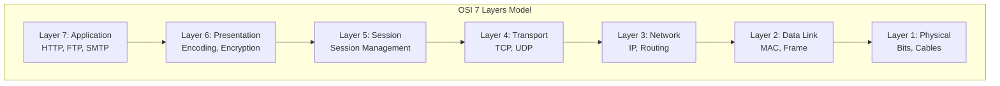
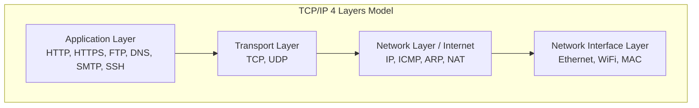
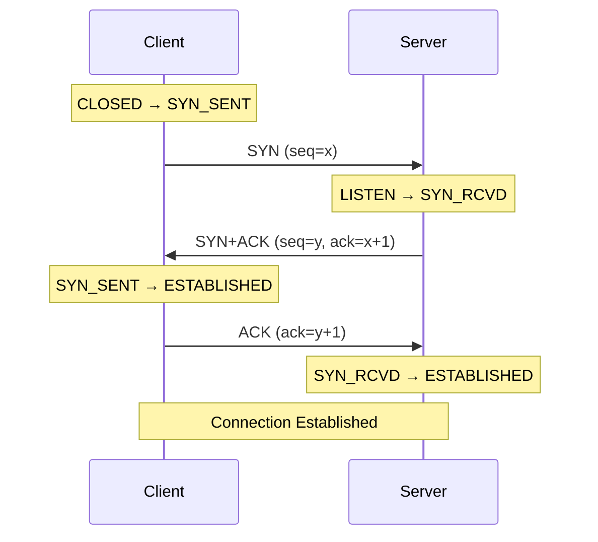
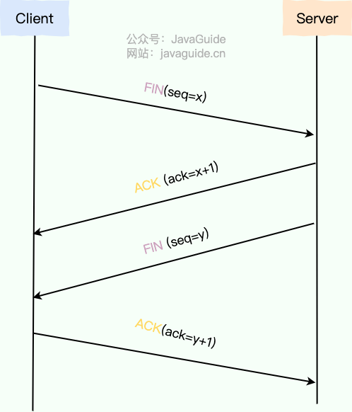
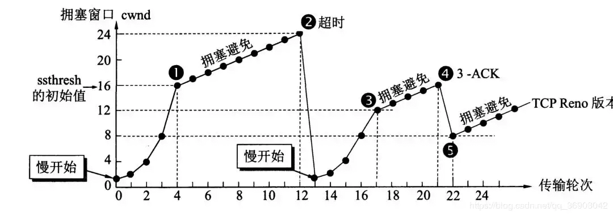

# Phần 1.4: Mạng Máy tính Chi tiết (Detailed Computer Networks)

Tài liệu này là bản dịch và biên soạn chi tiết từ nguồn JavaGuide, bao gồm đầy đủ các giải thích về mô hình phân tầng mạng, giao thức TCP/UDP, HTTP/HTTPS và quy trình truy cập trang web.

---

## 1. Mô hình Phân tầng Mạng

### 1.1. Mô hình OSI 7 tầng

Mô hình OSI (Open Systems Interconnection) là mô hình 7 tầng do ISO (International Organization for Standardization) đề xuất. Mỗi tầng tập trung làm một việc và sử dụng chức năng của tầng dưới.



| Tầng | Tên | Chức năng |
|------|-----|-----------|
| 7 | Application | Cung cấp giao diện cho ứng dụng (HTTP, FTP, SMTP) |
| 6 | Presentation | Mã hóa, giải mã, nén dữ liệu |
| 5 | Session | Quản lý phiên kết nối |
| 4 | Transport | Truyền dữ liệu end-to-end (TCP, UDP) |
| 3 | Network | Định tuyến và định địa chỉ (IP) |
| 2 | Data Link | Truyền frame giữa các node liền kề (MAC) |
| 1 | Physical | Truyền bit qua phương tiện vật lý |

**Tại sao OSI không thắng TCP/IP?**
1.  Chuyên gia OSI thiếu kinh nghiệm thực tế, thiếu động lực thương mại.
2.  Giao thức OSI phức tạp, hiệu suất thấp.
3.  Chu kỳ xây dựng tiêu chuẩn quá dài, trong khi Internet TCP/IP đã phổ biến toàn cầu.
4.  Phân tầng không hợp lý, một số chức năng lặp lại ở nhiều tầng.

### 1.2. Mô hình TCP/IP 4 tầng

Mô hình TCP/IP là phiên bản đơn giản hóa của OSI, được sử dụng rộng rãi trong thực tế.



| Tầng TCP/IP | Tương ứng OSI | Giao thức phổ biến |
|-------------|---------------|-------------------|
| Application | Application, Presentation, Session | HTTP, HTTPS, FTP, DNS, SMTP, SSH |
| Transport | Transport | TCP, UDP |
| Network (Internet) | Network | IP, ICMP, ARP, NAT, OSPF, BGP |
| Network Interface | Data Link, Physical | Ethernet, WiFi, MAC |

### 1.3. Tầng Ứng dụng (Application Layer)

Tầng ứng dụng cung cấp dịch vụ trao đổi thông tin giữa các ứng dụng trên thiết bị đầu cuối. Đơn vị dữ liệu gọi là **message (báo văn)**.

**Các giao thức ứng dụng phổ biến:**

*   **HTTP (Hypertext Transfer Protocol)**: Dựa trên TCP, truyền siêu văn bản và đa phương tiện cho Web.
*   **SMTP (Simple Mail Transfer Protocol)**: Dựa trên TCP, gửi email (không nhận).
*   **POP3/IMAP**: Dựa trên TCP, nhận email. IMAP mạnh hơn, hỗ trợ đồng bộ nhiều thiết bị.
*   **FTP (File Transfer Protocol)**: Dựa trên TCP, truyền file. Không an toàn, nên dùng SFTP.
*   **DNS (Domain Name System)**: Dựa trên UDP, ánh xạ tên miền ↔ IP.
*   **SSH (Secure Shell)**: Dựa trên TCP, truy cập từ xa an toàn (thay thế Telnet).

### 1.4. Tầng Vận chuyển (Transport Layer)

Tầng vận chuyển cung cấp dịch vụ truyền dữ liệu giữa các tiến trình trên hai thiết bị đầu cuối.

**TCP (Transmission Control Protocol):**
*   Hướng kết nối (connection-oriented)
*   **Đáng tin cậy** (reliable): đảm bảo dữ liệu đến đúng thứ tự, không mất mát
*   Kiểm soát luồng (flow control) và kiểm soát tắc nghẽn (congestion control)

**UDP (User Datagram Protocol):**
*   Không kết nối (connectionless)
*   **Nỗ lực tối đa** (best-effort): không đảm bảo độ tin cậy
*   Đơn giản, hiệu quả, phù hợp cho streaming, gaming

### 1.5. Tầng Mạng (Network Layer)

Tầng mạng chịu trách nhiệm **định tuyến (routing)** và **chuyển tiếp (forwarding)** các gói tin (packet/datagram) giữa các host trên các mạng khác nhau.

**Các giao thức mạng phổ biến:**

*   **IP (Internet Protocol)**: Định nghĩa định dạng gói tin, định tuyến và định địa chỉ. IPv4 (32-bit) và IPv6 (128-bit).
*   **ARP (Address Resolution Protocol)**: Chuyển đổi IP → MAC.
*   **ICMP (Internet Control Message Protocol)**: Truyền thông báo trạng thái và lỗi mạng (dùng trong `ping`).
*   **NAT (Network Address Translation)**: Chuyển đổi địa chỉ giữa mạng nội bộ và Internet.
*   **OSPF, RIP, BGP**: Các giao thức định tuyến.

### 1.6. Tầng Giao diện Mạng (Network Interface Layer)

Kết hợp tầng Data Link và Physical của OSI:

*   **Data Link**: Đóng gói IP datagram thành frame, truyền giữa các node liền kề. Xử lý kiểm tra lỗi (CRC), điều khiển truy cập (MAC, CSMA/CD).
*   **Physical**: Truyền bit qua phương tiện vật lý (cáp, sóng vô tuyến).

### 1.7. Tại sao cần Phân tầng Mạng?

1.  **Các tầng độc lập**: Mỗi tầng chỉ cần biết cách gọi tầng dưới, không cần quan tâm triển khai.
2.  **Linh hoạt**: Mỗi tầng có thể dùng công nghệ phù hợp nhất, miễn là giữ nguyên interface.
3.  **Chia nhỏ vấn đề**: Biến vấn đề phức tạp thành nhiều vấn đề nhỏ, dễ giải quyết.

> *"Bất kỳ vấn đề nào trong khoa học máy tính đều có thể giải quyết bằng cách thêm một tầng trung gian."*

---

## 2. TCP - Bắt tay 3 bước và Vẫy tay 4 bước

### 2.1. Bắt tay 3 bước (Three-way Handshake) - Thiết lập Kết nối

TCP là giao thức **hướng kết nối**, **đáng tin cậy**. Trước khi truyền dữ liệu, hai bên phải hoàn thành quy trình "bắt tay 3 bước".



**Các bước:**

1.  **Bước 1 (SYN)**: Client gửi gói SYN chứa số thứ tự khởi tạo (ISN) ngẫu nhiên `seq=x`. Client chuyển sang trạng thái **SYN_SENT**.

2.  **Bước 2 (SYN+ACK)**: Server nhận SYN, nếu đồng ý kết nối, gửi gói SYN+ACK:
    *   SYN: chứa ISN của server `seq=y`
    *   ACK: xác nhận SYN của client `ack=x+1`
    *   Server chuyển sang trạng thái **SYN_RCVD**.

3.  **Bước 3 (ACK)**: Client nhận SYN+ACK, gửi ACK với `ack=y+1`. Client chuyển sang **ESTABLISHED**. Server nhận ACK, chuyển sang **ESTABLISHED**.

**Tại sao cần 3 bước?**

1.  **Xác nhận khả năng thu/phát của hai bên và đồng bộ ISN**: Sau 3 bước, cả hai bên đều biết đối phương có thể gửi và nhận, và đã thống nhất điểm bắt đầu số thứ tự.

2.  **Ngăn chặn kết nối lỗi thời**: Nếu chỉ có 2 bước, một gói SYN cũ bị delay có thể khiến server tạo kết nối "ma" (ghost connection), lãng phí tài nguyên. Với 3 bước, client sẽ gửi RST (reset) khi nhận được SYN+ACK không mong đợi.

### 2.2. Hàng đợi Bán kết nối và Toàn kết nối

Trong quá trình bắt tay 3 bước, server kernel sử dụng 2 hàng đợi:

| Hàng đợi | Trạng thái | Mục đích | Điều kiện thoát |
|----------|------------|----------|-----------------|
| **SYN Queue** (Bán kết nối) | SYN_RCVD | Lưu kết nối chưa hoàn thành | Nhận ACK / Timeout |
| **Accept Queue** (Toàn kết nối) | ESTABLISHED | Lưu kết nối đã hoàn thành | Được `accept()` lấy ra |

**SYN Flood Attack**: Hacker gửi ồ ạt SYN mà không gửi ACK cuối, làm đầy SYN Queue. **SYN Cookies** là cơ chế phòng chống: server không lưu entry trong SYN Queue, mà tính toán một cookie gửi về, chỉ khi nhận ACK hợp lệ mới tạo kết nối.

### 2.3. Vẫy tay 4 bước (Four-way Handshake) - Đóng Kết nối

TCP là **full-duplex**, hai hướng truyền độc lập, nên cần 4 bước để đóng (mỗi bên thông báo "tôi hết gửi" và được xác nhận).



**Các bước:**

1.  **Bước 1 (FIN)**: Client gửi FIN `seq=u`, chuyển sang **FIN-WAIT-1**.

2.  **Bước 2 (ACK)**: Server nhận FIN, gửi ACK `ack=u+1`, chuyển sang **CLOSE-WAIT**. Client nhận ACK, chuyển sang **FIN-WAIT-2**. Lúc này kết nối **half-close**: client hết gửi, nhưng server vẫn có thể gửi.

3.  **Bước 3 (FIN)**: Khi server gửi hết dữ liệu còn lại, gửi FIN `seq=y`, chuyển sang **LAST-ACK**.

4.  **Bước 4 (ACK)**: Client nhận FIN, gửi ACK `ack=y+1`, chuyển sang **TIME-WAIT**. Server nhận ACK, chuyển sang **CLOSED**. Client đợi **2×MSL** rồi chuyển sang **CLOSED**.

**Tại sao cần 4 bước (không thể gộp ACK và FIN của server)?**

Kernel tự động gửi ACK ngay khi nhận FIN của client (xác nhận đã nhận yêu cầu đóng). Nhưng FIN của server chỉ được gửi khi ứng dụng server hoàn thành xử lý và gọi `close()`. Hai sự kiện này không đồng bộ, nên thường không gộp được.

**Tại sao cần TIME-WAIT (2×MSL)?**

*   ACK cuối cùng của client có thể bị mất. Nếu server không nhận được, server sẽ gửi lại FIN. TIME-WAIT cho client thời gian để nhận lại FIN và gửi lại ACK.
*   MSL (Maximum Segment Lifetime): thời gian sống tối đa của một segment. 2×MSL đủ cho một vòng gửi-nhận.

---

## 3. TCP - Đảm bảo Độ tin cậy Truyền tải

### 3.1. Các Cơ chế Đảm bảo Độ tin cậy

1.  **Truyền theo khối dữ liệu**: Dữ liệu ứng dụng được chia thành các **segment** có kích thước phù hợp.

2.  **Số thứ tự (Sequence Number)**: Mỗi segment có số thứ tự, giúp bên nhận **sắp xếp lại thứ tự** và **loại bỏ trùng lặp**.

3.  **Checksum**: TCP duy trì checksum của header và data. Nếu bên nhận phát hiện lỗi, bỏ qua segment và không gửi ACK.

4.  **Cơ chế Truyền lại (Retransmission)**:
    *   **Timeout Retransmission**: Nếu không nhận ACK trong thời gian RTO (Retransmission Timeout), gửi lại.
    *   **Fast Retransmit**: Nếu nhận 3 ACK trùng lặp, gửi lại ngay segment bị mất.
    *   **SACK (Selective ACK)**: Báo cho sender biết chính xác segment nào đã nhận, tránh gửi lại không cần thiết.
    *   **D-SACK (Duplicate SACK)**: Thông báo segment nào nhận trùng lặp.

5.  **Kiểm soát Luồng (Flow Control)**: Dùng **Sliding Window** để sender không gửi nhanh hơn receiver xử lý được.

6.  **Kiểm soát Tắc nghẽn (Congestion Control)**: Điều chỉnh tốc độ gửi dựa trên tình trạng mạng, tránh quá tải router/link.

### 3.2. Kiểm soát Luồng (Flow Control)

TCP dùng **cửa sổ trượt (sliding window)** để kiểm soát luồng. Receiver thông báo kích thước cửa sổ (rwnd - receive window) trong mỗi ACK. Sender không được gửi nhiều hơn rwnd cho phép.

**Cửa sổ Gửi (Send Window) gồm 4 vùng:**
1.  Đã gửi và đã được xác nhận (đã hoàn thành)
2.  Đã gửi nhưng chưa được xác nhận (đang chờ)
3.  Chưa gửi nhưng receiver sẵn sàng nhận (có thể gửi)
4.  Chưa gửi và receiver chưa sẵn sàng (không thể gửi)

**Cửa sổ Nhận (Receive Window) gồm 3 vùng:**
1.  Đã nhận và đã xác nhận
2.  Sẵn sàng nhận (cho phép sender gửi)
3.  Không thể nhận (ngoài phạm vi)

Kích thước cửa sổ nhận động, thay đổi dựa trên tốc độ xử lý của ứng dụng receiver.

### 3.3. Kiểm soát Tắc nghẽn (Congestion Control)

Khác với flow control (end-to-end), congestion control là vấn đề **toàn mạng**. TCP duy trì **cửa sổ tắc nghẽn (cwnd - congestion window)**.



**4 thuật toán chính:**

1.  **Slow Start (Khởi động Chậm)**: Ban đầu cwnd = 1 MSS. Mỗi RTT, cwnd nhân đôi (tăng theo cấp số nhân) cho đến khi đạt ngưỡng ssthresh.

2.  **Congestion Avoidance (Tránh Tắc nghẽn)**: Sau khi vượt ssthresh, cwnd tăng tuyến tính (mỗi RTT cộng thêm 1 MSS).

3.  **Fast Retransmit (Truyền lại Nhanh)**: Khi nhận 3 ACK trùng lặp, gửi lại segment bị mất ngay lập tức (không đợi timeout).

4.  **Fast Recovery (Phục hồi Nhanh)**: Sau Fast Retransmit, đặt ssthresh = cwnd/2, cwnd = ssthresh + 3, rồi tiếp tục Congestion Avoidance (không quay về Slow Start).

**Công thức cwnd thực tế:**
```
Kích thước gửi = min(cwnd, rwnd)
```
Sender gửi theo giá trị nhỏ hơn giữa cwnd (do mạng quyết định) và rwnd (do receiver quyết định).

### 3.4. ARQ (Automatic Repeat-reQuest)

ARQ là giao thức sửa lỗi ở tầng Data Link và Transport. Dùng **xác nhận (ACK)** và **timeout** để đạt truyền tin cậy trên kênh không tin cậy.

**Stop-and-Wait ARQ:**
*   Gửi 1 segment, đợi ACK, mới gửi tiếp.
*   Đơn giản nhưng hiệu suất thấp.

**Continuous ARQ (Go-Back-N):**
*   Gửi nhiều segment liên tiếp trong cửa sổ.
*   Receiver gửi **cumulative ACK** (ACK tích lũy) cho segment cuối cùng nhận đúng thứ tự.
*   Nhược điểm: Nếu segment giữa mất, phải gửi lại tất cả segment từ đó về sau.

---

## 4. HTTP và HTTPS

### 4.1. HTTP (Hypertext Transfer Protocol)

HTTP là giao thức tầng ứng dụng để truyền siêu văn bản (web page, hình ảnh, v.v.). Đặc điểm:

*   **Dựa trên TCP**, port mặc định **80**.
*   **Stateless (Phi trạng thái)**: Server không lưu thông tin về các request trước đó của client.
*   **Request-Response**: Client gửi request, server trả về response.

**Quy trình giao tiếp HTTP:**
1.  Server lắng nghe trên port 80.
2.  Browser (client) thiết lập kết nối TCP (tạo socket).
3.  Server chấp nhận kết nối TCP.
4.  Client và server trao đổi HTTP message.
5.  Đóng kết nối TCP.

### 4.2. HTTPS (HTTP Secure)

HTTPS = HTTP + **SSL/TLS**. Cung cấp **mã hóa** và **xác thực**. Port mặc định **443**.

**So sánh HTTP vs HTTPS:**

| Tiêu chí | HTTP | HTTPS |
|----------|------|-------|
| Port | 80 | 443 |
| URL prefix | `http://` | `https://` |
| Mã hóa | Không (plaintext) | Có (SSL/TLS) |
| Xác thực | Không | Chứng chỉ CA |
| Tài nguyên | Ít hơn | Nhiều hơn (do mã hóa/giải mã) |

### 4.3. SSL/TLS - Cốt lõi của HTTPS

**SSL (Secure Sockets Layer)** và **TLS (Transport Layer Security)** là cùng một họ giao thức. TLS 1.0 thực chất là SSL 3.1. Người ta thường gọi chung là SSL/TLS.

#### Mã hóa Bất đối xứng (Asymmetric Encryption)

Cốt lõi của SSL/TLS là **mã hóa bất đối xứng** với cặp **khóa công khai (public key)** và **khóa riêng tư (private key)**.

*   **Public key**: Công khai, ai cũng có thể biết. Dùng để **mã hóa**.
*   **Private key**: Bí mật, chỉ chủ sở hữu biết. Dùng để **giải mã**.

Ví dụ: Ai muốn gửi tin nhắn bí mật cho Bob thì dùng public key của Bob để mã hóa. Chỉ Bob (người có private key) mới giải mã được.

#### Mã hóa Đối xứng (Symmetric Encryption)

Mã hóa bất đối xứng phức tạp, chậm. Trong thực tế, SSL/TLS dùng **mã hóa đối xứng** (cùng một khóa để mã hóa và giải mã) cho dữ liệu thực tế.

**Quy trình:**
1.  Client và server dùng mã hóa bất đối xứng để **trao đổi khóa đối xứng** an toàn.
2.  Sau đó, dùng khóa đối xứng để mã hóa/giải mã dữ liệu truyền thực tế (nhanh hơn).

#### Chứng chỉ Số và Chữ ký Số

**Vấn đề**: Làm sao client biết public key nhận được thực sự là của server, không phải của kẻ tấn công (Man-in-the-Middle)?

**Giải pháp**: **Certificate Authority (CA)** - Tổ chức uy tín thứ ba.

1.  CA cấp **chứng chỉ số (digital certificate)** cho server, chứa public key của server.
2.  CA ký chứng chỉ bằng **chữ ký số (digital signature)**: băm nội dung chứng chỉ, mã hóa bằng private key của CA.
3.  Client nhận chứng chỉ, dùng public key của CA (được tin cậy sẵn trong browser) để **xác minh chữ ký**.
4.  Nếu hợp lệ, client tin tưởng public key trong chứng chỉ là của server thật.

**Quy trình chữ ký số:**
1.  CA băm nội dung chứng chỉ → **digest**.
2.  CA mã hóa digest bằng **private key của CA** → chữ ký số.
3.  Client nhận chứng chỉ, băm nội dung → digest'.
4.  Client giải mã chữ ký bằng **public key của CA** → digest.
5.  So sánh digest' và digest. Nếu khớp, chứng chỉ hợp lệ.

---

## 5. Quá trình Truy cập Trang Web

Đây là câu hỏi phỏng vấn kinh điển tổng hợp nhiều kiến thức mạng. Từ khi bạn nhập URL đến khi trang web hiển thị:

### Bước 1: Nhập URL

URL (Uniform Resource Locator) có cấu trúc:
```
protocol://domain:port/path?parameters#anchor
```

Ví dụ: `https://www.example.com:443/page.html?id=123#section1`

*   **Protocol**: HTTP hoặc HTTPS
*   **Domain**: Tên miền (sẽ được phân giải thành IP)
*   **Port**: 80 (HTTP) hoặc 443 (HTTPS) nếu không chỉ định
*   **Path**: Đường dẫn tài nguyên trên server
*   **Parameters**: Tham số query string
*   **Anchor**: Neo trong trang (không gửi lên server)

### Bước 2: Phân giải DNS

Browser cần chuyển domain thành IP address để biết **gửi request đến đâu**.

**Quy trình DNS lookup:**
1.  Kiểm tra cache trình duyệt
2.  Kiểm tra cache hệ điều hành
3.  Kiểm tra file hosts
4.  Hỏi DNS Resolver (ISP)
5.  Đệ quy/lặp qua Root DNS → TLD DNS → Authoritative DNS

### Bước 3: Thiết lập Kết nối TCP (Bắt tay 3 bước)

Browser dùng IP và port để gửi yêu cầu kết nối TCP đến server.

1.  Client → Server: SYN
2.  Server → Client: SYN+ACK
3.  Client → Server: ACK

### Bước 4: TLS Handshake (nếu HTTPS)

Nếu URL là `https://`, sau khi TCP kết nối, client và server thực hiện **TLS handshake** để:
*   Thương lượng phiên bản TLS và cipher suite
*   Server gửi chứng chỉ, client xác minh
*   Trao đổi khóa đối xứng (session key)

### Bước 5: Gửi HTTP Request

Browser gửi HTTP request (GET, POST, v.v.) đến server. Request bao gồm:
*   Request line: `GET /page.html HTTP/1.1`
*   Headers: Host, User-Agent, Accept, Cookie, v.v.
*   Body: (nếu có, với POST)

### Bước 6: Server Xử lý và Trả về Response

Server nhận request, xử lý (truy vấn database, thực thi logic), trả về HTTP response:
*   Status line: `HTTP/1.1 200 OK`
*   Headers: Content-Type, Content-Length, Set-Cookie, v.v.
*   Body: Nội dung HTML, JSON, v.v.

### Bước 7: Browser Render Trang

1.  Parse HTML → xây dựng **DOM Tree**.
2.  Parse CSS → xây dựng **CSSOM Tree**.
3.  Kết hợp DOM + CSSOM → **Render Tree**.
4.  **Layout**: Tính toán vị trí, kích thước các element.
5.  **Paint**: Vẽ các pixel lên màn hình.

### Bước 8: Tải Tài nguyên Bổ sung

Khi parse HTML, browser phát hiện các tài nguyên khác (CSS, JS, hình ảnh), gửi thêm HTTP request để tải. Quá trình này có thể song song hoặc tuần tự tùy thuộc vào `async`, `defer`.

### Bước 9: Đóng Kết nối (Vẫy tay 4 bước)

Khi không còn cần giao tiếp, một bên khởi xướng đóng kết nối TCP:

1.  Client → Server: FIN
2.  Server → Client: ACK
3.  Server → Client: FIN
4.  Client → Server: ACK

Nếu HTTP/1.1 với `Connection: keep-alive`, kết nối có thể được giữ lại để tái sử dụng cho các request tiếp theo.

---

## 6. Tổng kết Các Giao thức Theo Tầng

| Tầng | Giao thức | Chức năng |
|------|-----------|-----------|
| **Application** | HTTP, HTTPS, FTP, SMTP, DNS, SSH | Cung cấp dịch vụ cho ứng dụng |
| **Transport** | TCP, UDP | Truyền dữ liệu end-to-end, kiểm soát luồng/tắc nghẽn |
| **Network** | IP, ICMP, ARP, NAT, OSPF, BGP | Định tuyến, chuyển tiếp, định địa chỉ |
| **Network Interface** | Ethernet, WiFi, MAC | Truyền frame giữa các node liền kề |

---

## 7. Advanced Network Solutions

### 7.1. Network Protocols Chi tiết

#### TCP Connection Management

**TCP Three-Way Handshake:**
```
Client                          Server
  |                                |
  |-------- SYN (seq=x) ---------->|
  |<------ SYN-ACK (seq=y, ack=x+1)|
  |------ ACK (ack=y+1) ---------->|
  |                                |
  |    Connection Established      |
```

**Code Example (Conceptual):**
```c
// Client side
int connect_tcp(char *host, int port) {
    // Step 1: Send SYN
    send_syn(seq = random());
    
    // Step 2: Wait for SYN-ACK
    syn_ack = recv_syn_ack();
    if (syn_ack.ack != seq + 1) {
        return ERROR;
    }
    
    // Step 3: Send ACK
    send_ack(ack = syn_ack.seq + 1);
    
    // Connection established
    return SUCCESS;
}
```

**TCP Four-Way Handshake (Connection Close):**
```
Client                          Server
  |                                |
  |-------- FIN (seq=x) ---------->|
  |<------ ACK (ack=x+1) ----------|
  |                                |
  |<------ FIN (seq=y) ------------|
  |------ ACK (ack=y+1) ---------->|
  |                                |
  |    Connection Closed           |
```

**TCP States:**
```
CLOSED → LISTEN → SYN_RCVD → ESTABLISHED → FIN_WAIT_1 → FIN_WAIT_2 → TIME_WAIT → CLOSED
```

**TIME_WAIT State:**
- Duration: 2 × MSL (Maximum Segment Lifetime), typically 30-120 seconds
- Purpose: Ensure all packets are flushed from network
- Problem: Port cannot be reused immediately
- Solution: `SO_REUSEADDR` socket option

#### TCP Flow Control

**Concept:** Receiver controls sender's transmission rate to prevent buffer overflow.

**Sliding Window:**
```
Sender                          Receiver
  |                                |
  | [1][2][3][4][5][6][7][8]       |
  |  ^window (size=4)               |
  |  send 1-4                       |
  |------------------------------->|
  |                                | [1][2][3][4]
  |                                | ack=5, window=4
  |<-------------------------------|
  |                                |
  |  slide window, send 5-8        |
  |------------------------------->|
```

**Window Size Calculation:**
```
Advertised Window = Receive Buffer Size - Received Data
```

**Zero Window:**
- If receiver buffer full → advertise window = 0
- Sender stops sending until window > 0
- Sender probes periodically (keepalive)

#### TCP Congestion Control

**Algorithms:**

**1. Slow Start**
```
cwnd = 1 segment
cwnd = cwnd × 2 (double every RTT)
until cwnd >= ssthresh
```

**2. Congestion Avoidance**
```
cwnd = cwnd + 1 (increase by 1 segment per RTT)
```

**3. Fast Retransmit**
```
If receive 3 duplicate ACKs → retransmit immediately (don't wait for timeout)
```

**4. Fast Recovery**
```
After fast retransmit:
ssthresh = cwnd / 2
cwnd = ssthresh + 3
```

**TCP Congestion Control States:**
```
Slow Start → Congestion Avoidance → Fast Retransmit → Fast Recovery
    ↑                                                  ↓
    └──────────────────────────────────────────────────┘
```

#### HTTP/2 and HTTP/3

**HTTP/2 Features:**
- **Multiplexing**: Multiple requests over single connection
- **Header Compression**: HPACK compression
- **Server Push**: Server can push resources proactively
- **Binary Protocol**: More efficient than HTTP/1.1 text-based

**HTTP/3 Features:**
- **QUIC Protocol**: Based on UDP, not TCP
- **Built-in Encryption**: TLS 1.3 required
- **Connection Migration**: Handover between networks
- **Reduced Latency**: Faster handshake than TCP

#### DNS Resolution Chi tiết

**DNS Hierarchy:**
```
. (root)
├── com, org, net, ...
│   ├── example.com
│   │   ├── www.example.com
│   │   ├── mail.example.com
│   │   └── api.example.com
```

**DNS Query Process:**
```
Client → Local DNS Server → Root DNS Server → TLD DNS Server → Authoritative DNS Server
```

**DNS Record Types:**
- **A**: IPv4 address
- **AAAA**: IPv6 address
- **CNAME**: Canonical name (alias)
- **MX**: Mail exchange
- **NS**: Name server
- **TXT**: Text record (verification, SPF, DKIM)

**DNS Caching:**
```
TTL (Time To Live) determines cache duration
- Lower TTL → More queries (but faster updates)
- Higher TTL → Fewer queries (but slower updates)
- Recommended: 300-3600 seconds
```

**DNS Troubleshooting:**
```bash
# Query DNS records
dig example.com
dig example.com MX
nslookup example.com

# Check DNS propagation
dig @8.8.8.8 example.com  # Google DNS
dig @1.1.1.1 example.com  # Cloudflare DNS

# Trace DNS resolution
dig +trace example.com
```

### 7.2. Troubleshooting Common Issues

#### Issue 1: Connection Timeout

**Symptom:** Client cannot connect to server.

**Troubleshooting Steps:**
```bash
# 1. Check if server is running
ps aux | grep server_process

# 2. Check if port is listening
netstat -tulpn | grep :8080
ss -tulpn | grep :8080

# 3. Test connectivity
telnet server_ip 8080
nc -zv server_ip 8080

# 4. Check firewall rules
iptables -L -n
firewall-cmd --list-all

# 5. Check DNS resolution
nslookup server_hostname
dig server_hostname

# 6. Trace network path
traceroute server_ip
mtr server_ip  # (my traceroute)
```

**Common Causes:**
- ❌ Server not running
- ❌ Port not listening
- ❌ Firewall blocking
- ❌ Network unreachable
- ❌ DNS resolution failed

**Solutions:**
```bash
# Start server
systemctl start service_name

# Open firewall port
firewall-cmd --add-port=8080/tcp --permanent
firewall-cmd --reload

# Check routing
ip route show
route -n
```

#### Issue 2: Slow Network Performance

**Symptom:** High latency, low throughput.

**Troubleshooting Steps:**
```bash
# 1. Check bandwidth
speedtest-cli
iperf3 -c server_ip  # (requires iperf3 on both ends)

# 2. Check latency
ping server_ip
ping -c 10 server_ip  # 10 packets
ping -i 0.1 server_ip  # 100ms interval

# 3. Check packet loss
ping -c 100 server_ip | grep packet

# 4. Monitor network traffic
iftop  # Real-time bandwidth monitor
nload  # Real-time traffic monitor
vnstat  # Network statistics

# 5. Check network errors
ifconfig | grep -i error
ethtool -S eth0 | grep -i error

# 6. Check TCP connections
ss -s  # Socket statistics
netstat -s | grep -i "segments retransmitted"
```

**Common Causes:**
- ❌ Network congestion
- ❌ High latency (distance)
- ❌ Packet loss
- ❌ Network errors (dropped packets)
- ❌ Bandwidth limitation
- ❌ TCP retransmission

**Solutions:**
```bash
# Increase TCP buffer size
sysctl -w net.core.rmem_max=16777216
sysctl -w net.core.wmem_max=16777216

# Enable TCP window scaling
sysctl -w net.ipv4.tcp_window_scaling=1

# Optimize TCP congestion control
sysctl -w net.ipv4.tcp_congestion_control=bbr  # BBR algorithm
```

#### Issue 3: DNS Resolution Failed

**Symptom:** Cannot resolve domain names.

**Troubleshooting Steps:**
```bash
# 1. Test DNS resolution
nslookup example.com
dig example.com
host example.com

# 2. Check DNS server configuration
cat /etc/resolv.conf
systemd-resolve --status

# 3. Test specific DNS server
dig @8.8.8.8 example.com
dig @1.1.1.1 example.com

# 4. Check DNS cache
systemd-resolve --flush-caches

# 5. Check DNS server status
systemctl status systemd-resolved
```

**Common Causes:**
- ❌ DNS server unreachable
- ❌ Incorrect DNS configuration
- ❌ DNS cache poisoning
- ❌ Firewall blocking DNS (port 53)

**Solutions:**
```bash
# Update DNS servers
echo "nameserver 8.8.8.8" > /etc/resolv.conf
echo "nameserver 1.1.1.1" >> /etc/resolv.conf

# Flush DNS cache
systemd-resolve --flush-caches
# Or
resolvectl flush-caches
```

#### Issue 4: Connection Reset

**Symptom:** Connection reset by peer.

**Troubleshooting Steps:**
```bash
# 1. Check server logs
tail -f /var/log/server.log

# 2. Check connection state
ss -tan | grep :8080 | grep ESTAB

# 3. Check firewall rules
iptables -L -n -v

# 4. Check TCP keepalive
ss -o state established '( dport = :8080 )'

# 5. Capture network packets
tcpdump -i eth0 -n 'tcp port 8080'
```

**Common Causes:**
- ❌ Server crash/restart
- ❌ Firewall resetting connection
- ❌ Application closing connection
- ❌ TCP keepalive timeout

**Solutions:**
```bash
# Increase TCP keepalive time
sysctl -w net.ipv4.tcp_keepalive_time=600
sysctl -w net.ipv4.tcp_keepalive_intvl=60
sysctl -w net.ipv4.tcp_keepalive_probes=3

# Check application connection handling
# Ensure proper connection closure
```

### 7.3. Performance Optimization

#### TCP Tuning

**Kernel Parameters:**
```bash
# TCP buffer sizes
net.core.rmem_max = 16777216      # Receive buffer max (16MB)
net.core.wmem_max = 16777216      # Send buffer max (16MB)
net.ipv4.tcp_rmem = 4096 87380 16777216  # Min, default, max receive
net.ipv4.tcp_wmem = 4096 65536 16777216  # Min, default, max send

# TCP window scaling
net.ipv4.tcp_window_scaling = 1   # Enable window scaling

# TCP congestion control
net.ipv4.tcp_congestion_control = bbr  # Use BBR algorithm

# TCP keepalive
net.ipv4.tcp_keepalive_time = 600  # Keepalive time (10 minutes)
net.ipv4.tcp_keepalive_intvl = 60  # Keepalive interval (1 minute)
net.ipv4.tcp_keepalive_probes = 3  # Keepalive probes

# TCP connection backlog
net.core.somaxconn = 4096          # Accept queue size

# TCP fast open
net.ipv4.tcp_fastopen = 3          # Enable TCP fast open
```

**Apply Settings:**
```bash
# Temporary (until reboot)
sysctl -w net.core.rmem_max=16777216

# Permanent (add to /etc/sysctl.conf)
echo "net.core.rmem_max = 16777216" >> /etc/sysctl.conf
sysctl -p  # Apply changes
```

#### HTTP/1.1 Optimization

**1. Connection Keep-Alive**
```http
Connection: keep-alive
Keep-Alive: timeout=60, max=100
```
- Reuse TCP connection for multiple requests
- Reduces connection establishment overhead

**2. HTTP Pipelining**
```
Client: Request 1 → Request 2 → Request 3
Server: Response 1 ← Response 2 ← Response 3
```
- Send multiple requests without waiting for responses
- Problem: Head-of-line blocking

**3. Compression**
```http
Accept-Encoding: gzip, deflate, br
Content-Encoding: gzip
```
- Compress response body
- Reduces bandwidth usage

**4. Caching**
```http
Cache-Control: max-age=3600
ETag: "abc123"
If-None-Match: "abc123"
```
- Cache responses on client
- Reduces server load

#### HTTP/2 Optimization

**1. Server Push**
```http
Link: </style.css>; rel=preload; as=style
```
- Server proactively pushes resources
- Reduces latency

**2. Header Compression**
- HPACK compression
- Reduces header overhead

**3. Multiplexing**
- Multiple requests over single connection
- Eliminates head-of-line blocking

#### Load Balancing Strategies

**1. Round Robin**
```
Request 1 → Server 1
Request 2 → Server 2
Request 3 → Server 3
Request 4 → Server 1 (cycle)
```

**2. Least Connections**
```
Route to server with fewest active connections
```

**3. IP Hash (Session Affinity)**
```
hash(client_ip) % server_count → Server index
```

**4. Weighted Round Robin**
```
Server 1 (weight=3) → 3 requests
Server 2 (weight=1) → 1 request
Server 3 (weight=2) → 2 requests
```

**Nginx Load Balancing Example:**
```nginx
upstream backend {
    least_conn;  # Least connections strategy
    server backend1:8080 weight=3;
    server backend2:8080 weight=1;
    server backend3:8080 weight=2;
    
    # Health check
    health_check interval=10s fails=3 passes=2;
}

server {
    listen 80;
    location / {
        proxy_pass http://backend;
    }
}
```

#### CDN (Content Delivery Network)

**Concept:** Distribute content to edge servers close to users.

**Benefits:**
- ✅ Reduced latency (closer to users)
- ✅ Reduced bandwidth (cached content)
- ✅ Improved availability (multiple servers)
- ✅ DDoS protection

**CDN Flow:**
```
User → Edge Server (cache hit) → User
User → Edge Server (cache miss) → Origin Server → Edge Server (cache) → User
```

**CDN Providers:**
- CloudFlare
- Amazon CloudFront
- Fastly
- Akamai

#### Network Monitoring Tools

**1. Packet Capture (tcpdump, Wireshark)**
```bash
# Capture packets
tcpdump -i eth0 -n 'tcp port 80'

# Save to file
tcpdump -i eth0 -w capture.pcap

# Analyze with Wireshark
wireshark capture.pcap
```

**2. Network Statistics (ss, netstat)**
```bash
# Socket statistics
ss -s

# Established connections
ss -tan state established

# Listen ports
ss -tulpn
```

**3. Bandwidth Monitoring (iftop, nload)**
```bash
# Real-time bandwidth
iftop -i eth0

# Network load
nload eth0
```

**4. Latency Testing (ping, traceroute)**
```bash
# ICMP ping
ping -c 10 server_ip

# TCP ping (if ICMP blocked)
nc -zv -w 5 server_ip 80

# Trace route
traceroute server_ip
mtr server_ip
```

**5. DNS Testing (dig, nslookup)**
```bash
# DNS query
dig example.com

# Trace DNS resolution
dig +trace example.com

# Query specific DNS server
dig @8.8.8.8 example.com
```

---

*Kết thúc Phần 1.4: Mạng Máy tính*
