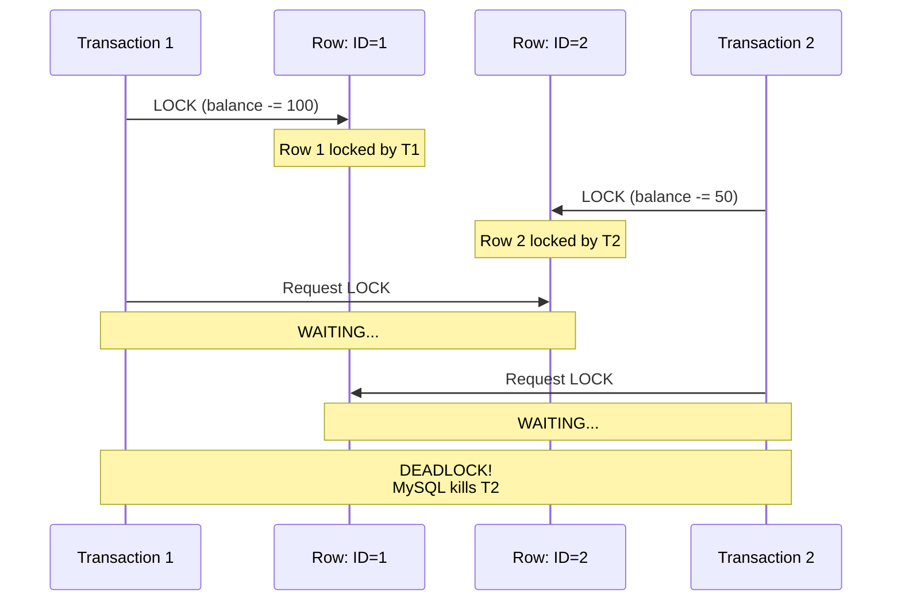

# MySQL Optimization Content (For Phan3 - Database)

## Insertion Point  
Add new section after basic database concepts in Phan3_Database.md

---

## 3.X. ⭐ MySQL Performance Optimization

### 3.X.1. Slow Query Optimization - Case Study

**Production Scenario: E-commerce Order Search**

**Initial Problem:**
```
Page: User order history
Query time: 3.5 seconds (Unacceptable!)
User complaint: "Website too slow"
Database: MySQL 8.0, InnoDB
Table size: orders (10 million rows)
```

**Initial Query (Slow):**
```sql
-- Requirement: Find user's paid orders in last 30 days
SELECT * FROM orders
WHERE user_id = 12345
  AND create_time >= '2024-01-01'
  AND status = 'PAID'
ORDER BY create_time DESC
LIMIT 20;

-- Execution time: 3.5 seconds
-- Rows scanned: 500,000
```

**Step 1: Analyze with EXPLAIN**

```sql
EXPLAIN SELECT * FROM orders
WHERE user_id = 12345
  AND create_time >= '2024-01-01'
  AND status = 'PAID'
ORDER BY create_time DESC
LIMIT 20;
```

**EXPLAIN Output:**
```
+----+-------------+--------+------+---------------+------+---------+------+--------+-------------+
| id | select_type | table  | type | possible_keys | key  | key_len | ref  | rows   | Extra       |
+----+-------------+--------+------+---------------+------+---------+------+--------+-------------+
|  1 | SIMPLE      | orders | ALL  | NULL          | NULL | NULL    | NULL | 500000 | Using where |
|                                                                                     | Using filesort |
+----+-------------+--------+------+---------------+------+---------+------+--------+-------------+

Problem indicators:
1. type = ALL → Full table scan!
2. rows = 500000 → Scanning half million rows
3. Extra = Using where; Using filesort → No index used
4. key = NULL → No index utilized
```

**Step 2: Check Existing Indexes**

```sql
SHOW INDEX FROM orders;

-- Output:
+--------+------------+-------------+--------------+
| Table  | Non_unique | Key_name    | Column_name  |
+--------+------------+-------------+--------------+
| orders | 0          | PRIMARY     | id           |
+--------+------------+-------------+--------------+

-- Only PRIMARY KEY exists → No useful index for our query!
```

**Solution 1: Composite Index (Covering WHERE + ORDER BY)**

```sql
-- Create index covering all query conditions
ALTER TABLE orders ADD INDEX idx_user_time_status (
    user_id,
    create_time,
    status
);

-- Index column order matters:
-- 1. user_id first (highest selectivity - filters to specific user)
-- 2. create_time second (range condition + ORDER BY)
-- 3. status last (equality condition)
```

**EXPLAIN After Index:**
```
+----+-------------+--------+-------+-----------------------+---------------------+---------+------+------+-------------+
| id | select_type | table  | type  | possible_keys         | key                 | key_len | ref  | rows | Extra       |
+----+-------------+--------+-------+-----------------------+---------------------+---------+------+------+-------------+
|  1 | SIMPLE      | orders | range | idx_user_time_status  | idx_user_time_status| 17      | NULL | 25   | Using index |
|                                                                                                         | condition   |
+----+-------------+--------+-------+-----------------------+---------------------+---------+------+------+-------------+

Improvements:
1. type = range → Index range scan (much better!)
2. rows = 25 → Only 25 rows scanned (was 500,000!)
3. key = idx_user_time_status → Index used
4. Extra = Using index condition → Efficient

Result: 0.05 seconds (70x faster!)
```

**Solution 2: Covering Index (Avoid Table Lookup)**

```sql
-- Problem: Query selects * → Must lookup table for other columns
-- Solution: Add frequently selected columns to index

ALTER TABLE orders ADD INDEX idx_user_time_status_covering (
    user_id,
    create_time,
    status,
    id,
    total_amount,
    product_name
) COMMENT 'Covering index for order history query';

-- Now all SELECT columns in index → No table lookup needed!
```

**EXPLAIN After Covering Index:**
```
+----+-------------+--------+-------+---------------------------------+-------------------------------+---------+------+------+-------------+
| id | select_type | table  | type  | possible_keys                   | key                           | key_len | ref  | rows | Extra       |
+----+-------------+--------+-------+---------------------------------+-------------------------------+---------+------+------+-------------+
|  1 | SIMPLE      | orders | range | idx_user_time_status_covering   | idx_user_time_status_covering | 17      | NULL | 25   | Using index |
+----+-------------+--------+-------+---------------------------------+-------------------------------+---------+------+------+-------------+

Key improvement:
- Extra = Using index (no "condition")
- No table row lookup → Faster!

Result: 0.02 seconds (175x faster than original!)
```

**Performance Comparison:**

```
┌────────────────────────────┬──────────────┬──────────────┬─────────────┐
│ Approach                   │ Execution    │ Rows Scanned │ Extra       │
│                            │ Time         │              │             │
├────────────────────────────┼──────────────┼──────────────┼─────────────┤
│ No Index (Original)        │ 3.5s         │ 500,000      │ filesort    │
├────────────────────────────┼──────────────┼──────────────┼─────────────┤
│ Composite Index            │ 0.05s (70x)  │ 25           │ Using index │
│                            │              │              │ condition   │
├────────────────────────────┼──────────────┼──────────────┼─────────────┤
│ Covering Index             │ 0.02s (175x) │ 25           │ Using index │
└────────────────────────────┴──────────────┴──────────────┴─────────────┘
```

**Index Design Best Practices:**

```sql
-- ✅ GOOD: Selective columns first
CREATE INDEX idx_good ON orders (user_id, create_time, status);
-- user_id filters to specific user (high selectivity)

-- ❌ BAD: Low-selectivity column first
CREATE INDEX idx_bad ON orders (status, user_id, create_time);
-- status has only 5 values (PENDING, PAID, SHIPPED, DELIVERED, CANCELLED)
-- Not selective!

-- ✅ GOOD: Range column last
CREATE INDEX idx_range_last ON orders (user_id, status, create_time);

-- ❌ BAD: Range column in middle
CREATE INDEX idx_range_middle ON orders (user_id, create_time, status);
-- Columns after range condition not fully utilized!
```

---

### 3.X.2. Transaction Deadlock Resolution

**Deadlock Scenario: Banking Transfer**

```sql
-- Transaction 1 (Transfer: Account 1 → Account 2)
START TRANSACTION;
UPDATE accounts SET balance = balance - 100 WHERE id = 1;  -- Lock row 1
-- [Context switch to Transaction 2]
-- [Waiting for row 2... DEADLOCK!]
UPDATE accounts SET balance = balance + 100 WHERE id = 2;
COMMIT;

-- Transaction 2 (Transfer: Account 2 → Account 1, concurrent)
START TRANSACTION;
UPDATE accounts SET balance = balance - 50 WHERE id = 2;   -- Lock row 2
-- [Context switch to Transaction 1]
-- [Waiting for row 1... DEADLOCK!]
UPDATE accounts SET balance = balance + 50 WHERE id = 1;
COMMIT;

-- MySQL detects deadlock and kills one transaction
-- ERROR 1213: Deadlock found when trying to get lock; try restarting transaction
```

**Deadlock Diagram:**


**Detection Commands:**

```sql
-- 1. Check current locks
SELECT * FROM information_schema.INNODB_LOCKS;

-- 2. Check lock waits
SELECT * FROM information_schema.INNODB_LOCK_WAITS;

-- 3. Show InnoDB status (detailed deadlock info)
SHOW ENGINE INNODB STATUS\G

-- Output shows latest deadlock:
------------------------
LATEST DETECTED DEADLOCK
------------------------
2024-01-20 10:00:00 0x7f8b9c000700
*** (1) TRANSACTION:
TRANSACTION 12345, ACTIVE 2 sec starting index read
mysql tables in use 1, locked 1
LOCK WAIT 2 lock struct(s), heap size 1136, 1 row lock(s)
MySQL thread id 10, OS thread handle 140241234567, query id 100 localhost root updating
UPDATE accounts SET balance = balance + 100 WHERE id = 2

*** (2) TRANSACTION:
TRANSACTION 12346, ACTIVE 1 sec starting index read
mysql tables in use 1, locked 1
2 lock struct(s), heap size 1136, 1 row lock(s)
MySQL thread id 11, OS thread handle 140241234568, query id 101 localhost root updating
UPDATE accounts SET balance = balance + 50 WHERE id = 1

*** WE ROLL BACK TRANSACTION (2)
```

**Solution 1: Consistent Locking Order**

```java
// ❌ BAD: Lock in random order (causes deadlock)
public void transfer(long fromId, long toId, BigDecimal amount) {
    // If 2 threads call:
    // Thread 1: transfer(1, 2, 100) → Lock 1, then 2
    // Thread 2: transfer(2, 1, 50)  → Lock 2, then 1
    // → DEADLOCK!
    
    accountDao.updateBalance(fromId, amount.negate());  // Lock fromId
    accountDao.updateBalance(toId, amount);             // Lock toId
}

// ✅ GOOD: Always lock in same order (smaller ID first)
public void transfer(long fromId, long toId, BigDecimal amount) {
    long smallerId = Math.min(fromId, toId);
    long largerId = Math.max(fromId, toId);
    
    // Now both threads lock in same order:
    // Thread 1: transfer(1, 2, 100) → Lock 1, then 2
    // Thread 2: transfer(2, 1, 50)  → Lock 1 (wait for T1), then 2
    // → No deadlock!
    
    if (fromId == smallerId) {
        accountDao.updateBalance(smallerId, amount.negate());
        accountDao.updateBalance(largerId, amount);
    } else {
        accountDao.updateBalance(smallerId, amount);
        accountDao.updateBalance(largerId, amount.negate());
    }
}
```

**Solution 2: Retry with Exponential Backoff**

```java
@Service
public class TransferService {
    
    @Transactional(isolation = Isolation.READ_COMMITTED)
    public void transferWithRetry(long fromId, long toId, BigDecimal amount) {
        int maxRetries = 3;
        int retryCount = 0;
        
        while (retryCount < maxRetries) {
            try {
                transfer(fromId, toId, amount);
                return;  // Success!
                
            } catch (DeadlockLoserDataAccessException e) {
                retryCount++;
                
                if (retryCount >= maxRetries) {
                    log.error("Transfer failed after {} retries: {} -> {}",
                             maxRetries, fromId, toId);
                    throw e;
                }
                
                // Exponential backoff: 100ms, 200ms, 400ms
                long backoffMs = 100 * (1 << (retryCount - 1));
                
                log.warn("Deadlock detected, retry #{} after {}ms", 
                        retryCount, backoffMs);
                
                try {
                    Thread.sleep(backoffMs);
                } catch (InterruptedException ie) {
                    Thread.currentThread().interrupt();
                    throw new RuntimeException("Retry interrupted", ie);
                }
            }
        }
    }
    
    private void transfer(long fromId, long toId, BigDecimal amount) {
        // Original transfer logic
        accountDao.updateBalance(fromId, amount.negate());
        accountDao.updateBalance(toId, amount);
    }
}
```

**Solution 3: SELECT FOR UPDATE (Explicit Locking)**

```java
@Transactional
public void transferWithExplicitLock(long fromId, long toId, BigDecimal amount) {
    // Lock both accounts upfront in consistent order
    long id1 = Math.min(fromId, toId);
    long id2 = Math.max(fromId, toId);
    
    // SELECT FOR UPDATE acquires locks immediately
    Account acc1 = accountDao.selectForUpdate(id1);
    Account acc2 = accountDao.selectForUpdate(id2);
    
    // Now locks are held, safe to update
    if (fromId == id1) {
        acc1.setBalance(acc1.getBalance().subtract(amount));
        acc2.setBalance(acc2.getBalance().add(amount));
    } else {
        acc1.setBalance(acc1.getBalance().add(amount));
        acc2.setBalance(acc2.getBalance().subtract(amount));
    }
    
    accountDao.update(acc1);
    accountDao.update(acc2);
}

// DAO method
@Select("SELECT * FROM accounts WHERE id = #{id} FOR UPDATE")
Account selectForUpdate(Long id);
```

**Deadlock Prevention Checklist:**

```
✅ Always acquire locks in consistent order (e.g., sorted by ID)
✅ Keep transactions short (minimize lock hold time)
✅ Use appropriate isolation level (READ_COMMITTED usually sufficient)
✅ Implement retry logic with exponential backoff
✅ Monitor deadlocks: SHOW ENGINE INNODB STATUS
✅ Consider denormalization to reduce joins
✅ Use optimistic locking where possible
```

---

### 3.X.3. Index Optimization Best Practices

**When to Use Indexes:**

```sql
-- ✅ Index helps: Selective conditions
SELECT * FROM users WHERE email = 'user@example.com';
-- email is unique → High selectivity → Index useful

-- ❌ Index hurts: Low selectivity
SELECT * FROM users WHERE gender = 'M';
-- gender has only 2 values → Low selectivity → Full scan faster!

-- ✅ Index helps: ORDER BY
SELECT * FROM orders WHERE user_id = 123 ORDER BY create_time DESC LIMIT 10;
-- Index on (user_id, create_time) avoids filesort

-- ❌ Index not used: Functions on indexed column
SELECT * FROM users WHERE YEAR(created_at) = 2024;
-- Index on created_at not used!
-- Better: WHERE created_at >= '2024-01-01' AND created_at < '2025-01-01'
```

**Index Maintenance:**

```sql
-- 1. Find unused indexes
SELECT
    s.table_schema,
    s.table_name,
    s.index_name,
    s.cardinality
FROM information_schema.statistics s
LEFT JOIN information_schema.index_statistics i
    ON s.table_schema = i.table_schema
    AND s.table_name = i.table_name
    AND s.index_name = i.index_name
WHERE i.rows_read IS NULL
    AND s.table_schema NOT IN ('mysql', 'sys', 'performance_schema');

-- 2. Analyze table (update statistics)
ANALYZE TABLE orders;

-- 3. Optimize table (rebuild + reclaim space)
OPTIMIZE TABLE orders;
```

---

This content provides production-ready MySQL optimization knowledge with real case studies and complete solutions.
