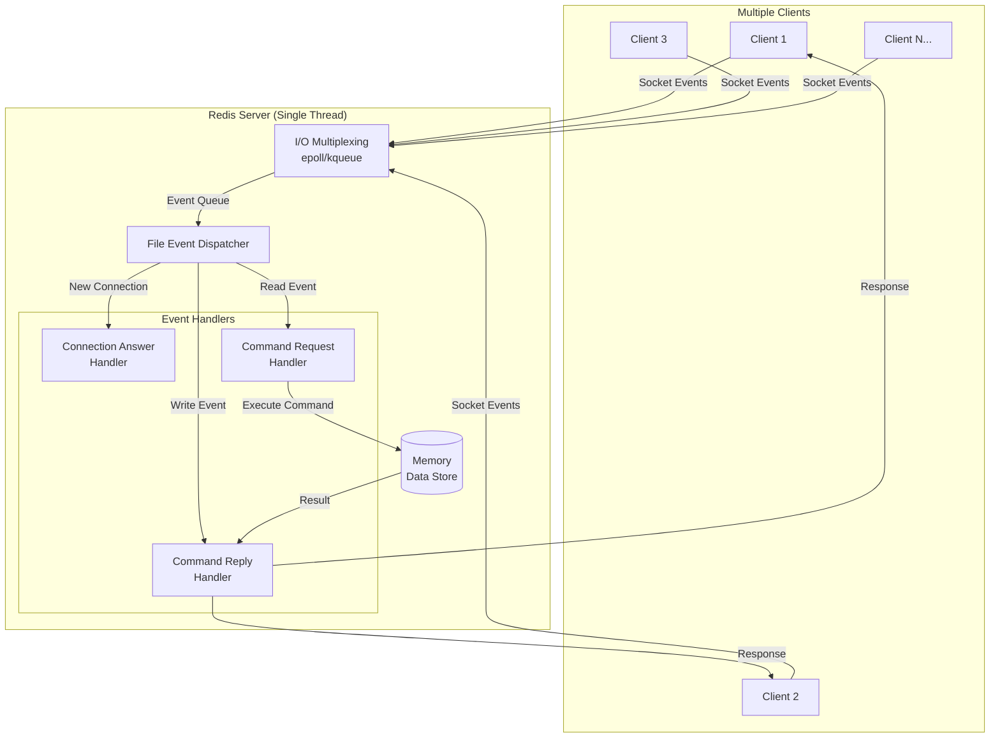
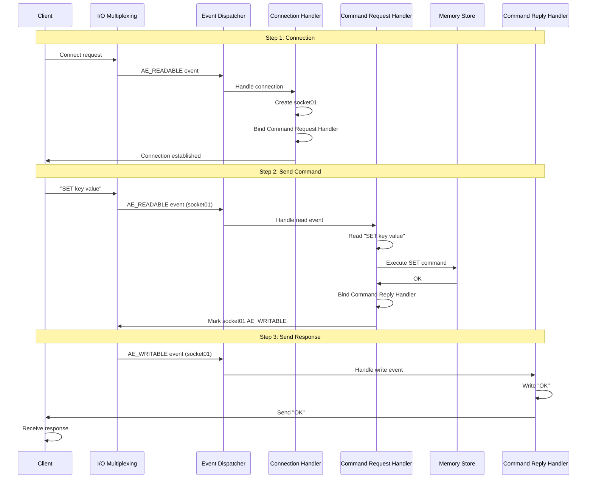
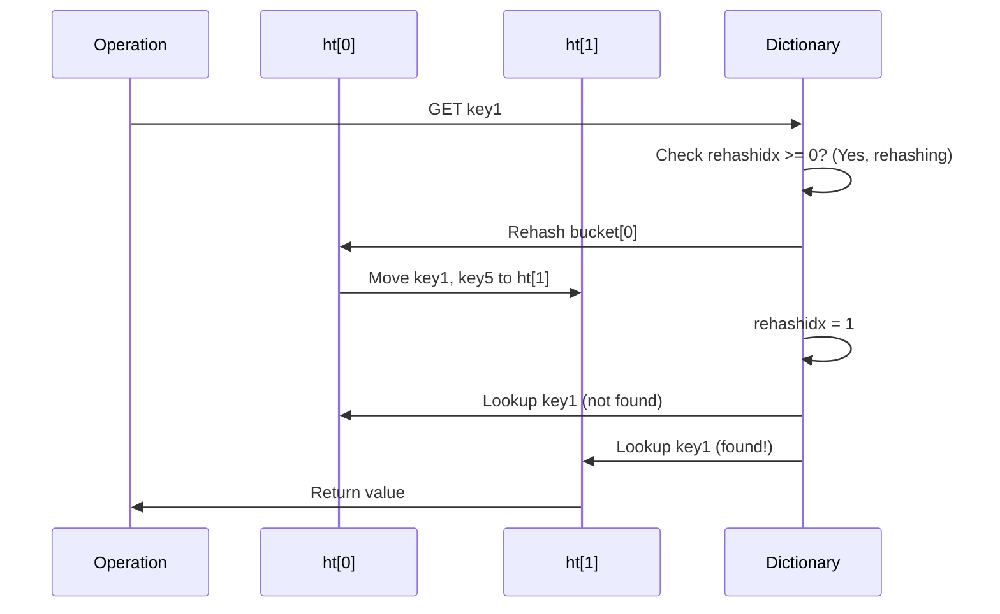

# Part 3: Database & Storage (Cơ sở dữ liệu & Lưu trữ)

## 3.1. Database Basics (Cơ sở dữ liệu cơ bản)

### 3.1.1. Khái niệm Cơ bản

#### Database, DBMS, Database System, DBA là g

ì?

**Sự khác biệt giữa 4 khái niệm này:**

| Khái niệm | Định nghĩa | Ví dụ so sánh |
|-----------|-----------|---------------|
| **Database (DB)** | Tập hợp dữ liệu có cấu trúc, được tổ chức theo mô hình dữ liệu | Sách trên giá thư viện |
| **DBMS** | Phần mềm quản lý database (MySQL, Oracle, PostgreSQL) | Hệ thống quản lý thư viện |
| **Database System (DBS)** | Toàn bộ hệ thống: DB + DBMS + Hardware + People | Cả thư viện đang hoạt động |
| **DBA** | Người quản trị database | Thủ thư, giám đốc thư viện |

**Lưu ý**: Khi nói "dùng MySQL database", thực chất là dùng **MySQL (DBMS)** để quản lý một hoặc nhiều **database (DB)**.

#### DBMS có những chức năng chính nào?

**4 chức năng lớn của DBMS:**

**1. Data Definition (Định nghĩa dữ liệu) - DDL**
*   Tạo/sửa/xóa database objects
*   Định nghĩa table, view, index, trigger, stored procedure
*   Ngôn ngữ: DDL (Data Definition Language)

**2. Data Manipulation (Thao tác dữ liệu) - DML**
*   **CRUD operations**: Create, Read, Update, Delete
*   Ngôn ngữ: DML (Data Manipulation Language)
*   Lệnh: INSERT, SELECT, UPDATE, DELETE

**3. Data Control (Kiểm soát dữ liệu) - DCL**
*   Concurrency control (kiểm soát đồng thời)
*   Transaction management (quản lý giao dịch)
*   Integrity constraints (ràng buộc toàn vẹn)
*   Access control (kiểm soát truy cập)
*   Security (bảo mật)

**4. Database Maintenance (Duy trì database)**
*   Backup & Recovery (sao lưu & phục hồi)
*   Performance monitoring (giám sát hiệu suất)
*   Import/Export data
*   Log management

---

### 3.1.2. Phân loại Database

#### Relational Database (RDBMS)

**Đại diện**: MySQL, PostgreSQL, Oracle, SQL Server

**Đặc điểm:**
*   Lưu trữ dữ liệu theo **tables** (bảng) với rows và columns
*   Sử dụng **SQL** (Structured Query Language)
*   Hỗ trợ **ACID transactions**
*   Schema cố định (fixed schema)

**Khi nào dùng:**
*   Dữ liệu có cấu trúc rõ ràng
*   Cần transactions (ngân hàng, e-commerce)
*   Quan hệ phức tạp giữa entities

#### NoSQL Database

**NoSQL = Not Only SQL** - Database phi quan hệ, hỗ trợ horizontal scaling và high performance.

**4 loại NoSQL:**

**1. Key-Value Database**
*   **Đại diện**: Redis, DynamoDB
*   **Cấu trúc**: Map giant (key → value)
*   **Đặc điểm**: Cực nhanh (in-memory), đơn giản
*   **Dùng cho**: Cache, session storage, counters

**2. Document Database**
*   **Đại diện**: MongoDB, CouchDB
*   **Cấu trúc**: Lưu JSON/BSON documents
*   **Đặc điểm**: Schema linh hoạt, không cần định nghĩa trước
*   **Dùng cho**: Content management, user profiles, catalogs

**3. Column-Family Database**
*   **Đại diện**: Cassandra, HBase
*   **Cấu trúc**: Lưu theo **column families**, không phải rows
*   **Đặc điểm**: Tối ưu cho đọc ít columns trên nhiều rows
*   **Dùng cho**: Big data analytics, time-series data, IoT

**4. Graph Database**
*   **Đại diện**: Neo4j, Amazon Neptune
*   **Cấu trúc**: Nodes (đỉnh) và Edges (cạnh)
*   **Đặc điểm**: Tối ưu cho truy vấn relationships
*   **Dùng cho**: Social networks, recommendation engines, fraud detection

#### NewSQL Database

**NewSQL = Distributed Storage + SQL + ACID Transactions**

**Đặc điểm:**
*   Kết hợp ưu điểm của SQL (ACID) và NoSQL (horizontal scaling)
*   Distributed relational database
*   Hỗ trợ HTAP (Hybrid Transactional/Analytical Processing)

**Đại diện**: Google Spanner, TiDB (PingCAP), OceanBase (Alibaba)

**Mục tiêu:**
*   Horizontal scaling (scale out)
*   Strong consistency
*   High availability
*   Standard SQL support
*   ACID transactions

---

### 3.1.3. ⭐ SQL vs NoSQL

| Tiêu chí | SQL (Relational) | NoSQL |
|----------|------------------|-------|
| **Data Model** | Structured tables (rows & columns) | Flexible: Key-Value, Document, Graph, Column |
| **Schema** | Fixed schema (phải định nghĩa trước) | Dynamic schema (linh hoạt) |
| **ACID** | Hỗ trợ đầy đủ ACID | Thường không (trade-off cho performance), một số hỗ trợ (MongoDB) |
| **Scalability** | Vertical scaling, sharding phức tạp | Horizontal scaling (built-in sharding) |
| **Query Language** | SQL standard | Mỗi DB khác nhau (MongoDB: MQL, Redis: commands) |
| **Performance** | Tốt cho complex queries, transactions | Cực nhanh cho simple queries, high throughput |
| **Use Cases** | Banking, ERP, CRM, E-commerce | Real-time analytics, caching, big data, social networks |

**Khi nào dùng SQL:**
*   Dữ liệu có cấu trúc rõ ràng, ít thay đổi schema
*   Cần ACID transactions (tính toàn vẹn cao)
*   Complex queries với JOINs

**Khi nào dùng NoSQL:**
*   Dữ liệu phi cấu trúc hoặc semi-structured
*   Cần scale nhanh (millions of requests/sec)
*   Schema thay đổi thường xuyên

---

### 3.1.4. Relational Database Concepts

#### Tuple, Key, Candidate Key, Primary Key, Foreign Key

**Tuple (Bộ)**: Một **row** (hàng) trong table, đại diện cho một entity instance.

**Key (Khóa)**: Tập một hoặc nhiều attributes có thể **unique identify** một tuple.

**Candidate Key (Khóa ứng viên)**: **Minimal set** of attributes có thể unique identify tuple. Một table có thể có nhiều candidate keys.

*Ví dụ*: Table Student có {StudentID} và {IDCard} đều là candidate keys.

**Primary Key (Khóa chính)**: Candidate key được **chọn** làm khóa chính của table. Mỗi table chỉ có **1 primary key**.

**Foreign Key (Khóa ngoại)**: Attribute trong table A **tham chiếu** đến primary key của table B. Dùng để thiết lập relationships giữa tables.

*Ví dụ*: `Enrollment.StudentID` là foreign key tham chiếu `Student.StudentID`.

**Prime Attribute (Thuộc tính khóa)**: Attribute nằm trong **bất kỳ** candidate key nào.

**Non-Prime Attribute (Thuộc tính phi khóa)**: Attribute **không** nằm trong candidate key nào.

#### ER Diagram (Entity-Relationship Diagram)

**ER Diagram** dùng để mô hình hóa database design.

**3 thành phần:**
1.  **Entity** (Thực thể): Business objects (Student, Course, Order) - vẽ bằng hình chữ nhật
2.  **Attribute** (Thuộc tính): Mô tả entity (name, age, price) - vẽ bằng hình elip
3.  **Relationship** (Quan hệ): Liên hệ giữa entities - vẽ bằng hình thoi

**Cardinality (Lực lượng):**
*   **1:1** (One-to-One): Mỗi A liên kết với **tối đa 1** B
*   **1:N** (One-to-Many): Mỗi A liên kết với **nhiều** B
*   **M:N** (Many-to-Many): Nhiều A liên kết với nhiều B

**Ví dụ**: Student - Enrollment - Course (M:N relationship)

---

### 3.1.5. ⭐ Database Normalization (Chuẩn hóa)

**Normalization**: Quá trình tổ chức database để giảm redundancy và tăng data integrity.

#### 1NF (First Normal Form)

**Quy tắc**: Attribute **không thể chia nhỏ hơn** (atomic values).

**Ví dụ vi phạm**:
```
Student(ID, Name, Phones)
1, John, "123-456, 789-012"  // ❌ Phones không atomic
```

**Fix**:
```
Student(ID, Name, Phone)
1, John, 123-456
1, John, 789-012
```

#### 2NF (Second Normal Form)

**Quy tắc**: 1NF + **Loại bỏ partial dependency** (phụ thuộc bộ phận).

*   Non-prime attribute phải **phụ thuộc hoàn toàn** vào primary key, không phụ thuộc một phần.

**Ví dụ vi phạm**:
```
Enrollment(StudentID, CourseID, StudentName, Grade)
Primary Key: (StudentID, CourseID)
StudentName chỉ phụ thuộc StudentID → Partial dependency ❌
```

**Fix**: Tách thành 2 tables
```
Student(StudentID, StudentName)
Enrollment(StudentID, CourseID, Grade)
```

#### 3NF (Third Normal Form)

**Quy tắc**: 2NF + **Loại bỏ transitive dependency** (phụ thuộc bắc cầu).

*   Non-prime attribute không phụ thuộc vào non-prime attribute khác.

**Ví dụ vi phạm**:
```
Student(StudentID, DepartmentName, DepartmentHead)
StudentID → DepartmentName → DepartmentHead  // Transitive dependency ❌
```

**Fix**:
```
Student(StudentID, DepartmentName)
Department(DepartmentName, DepartmentHead)
```

---

### 3.1.6. Primary Key vs Foreign Key

| Tiêu chí | Primary Key | Foreign Key |
|----------|-------------|-------------|
| **Mục đích** | Unique identify row | Thiết lập relationship giữa tables |
| **Uniqueness** | Phải unique | Có thể duplicate |
| **NULL** | Không được NULL | Có thể NULL |
| **Số lượng** | 1 per table | Nhiều per table |
| **Integrity** | Entity integrity | Referential integrity |

**Tại sao không nên dùng Foreign Key constraint?**

Theo **Alibaba Java Development Manual**:

> ❌ **Không dùng foreign key và cascade**. Mọi ràng buộc phải xử lý ở **application layer**.

**Lý do:**
1.  **Tăng phức tạp**: Mỗi DELETE/UPDATE phải check constraint
2.  **Tốn resource**: DB phải maintain constraint, tăng overhead
3.  **Không scale**: Không hoạt động với **sharding/partitioning**
4.  **Lock contention**: Foreign key check có thể gây deadlock

**Nhưng Foreign Key cũng có ưu điểm:**
*   Đảm bảo data integrity ở DB level
*   Cascade operations tiện lợi

→ **Kết luận**: Nếu hệ thống đơn giản, low concurrency → có thể dùng foreign key. Nếu distributed, high concurrency → xử lý ở application layer.

---

### 3.1.7. ⭐ Transaction & ACID

####Transaction là gì?

**Transaction**: Một unit of work gồm **nhiều SQL statements**, được thực thi như **một khối duy nhất**. Hoặc **tất cả thành công**, hoặc **tất cả rollback**.

**Ví dụ**: Chuyển tiền từ A → B
```sql
BEGIN TRANSACTION;
UPDATE accounts SET balance = balance - 100 WHERE user = 'A';
UPDATE accounts SET balance = balance + 100 WHERE user = 'B';
COMMIT;  -- Hoặc ROLLBACK nếu có lỗi
```

#### ⭐ ACID Properties

| Property | Ý nghĩa | Ví dụ |
|----------|---------|-------|
| **Atomicity** (Tính nguyên tử) | All or nothing - toàn bộ hoặc không | Transfer money: cả 2 UPDATE phải thành công |
| **Consistency** (Tính nhất quán) | DB luôn ở trạng thái hợp lệ | Tổng tiền trước = sau transaction |
| **Isolation** (Tính cô lập) | Transactions không ảnh hưởng lẫn nhau | Transaction A không thấy uncommitted changes của B |
| **Durability** (Tính bền vững) | Sau COMMIT, data được lưu vĩnh viễn | Sau commit, dù crash cũng không mất data |

**Isolation Levels** (Mức cô lập):
1.  **Read Uncommitted**: Có thể đọc uncommitted data → **Dirty Read**
2.  **Read Committed**: Chỉ đọc committed data → Tránh Dirty Read
3.  **Repeatable Read**: Đọc lại cùng data cho cùng kết quả → Tránh Non-repeatable Read
4.  **Serializable**: Transactions chạy tuần tự → Tránh mọi anomaly, nhưng chậm nhất

---

### 3.1.8. DDL, DML, DCL, TCL

**DDL (Data Definition Language)**: Định nghĩa structure
*   `CREATE`, `ALTER`, `DROP`, `TRUNCATE`

**DML (Data Manipulation Language)**: Thao tác data
*   `INSERT`, `UPDATE`, `DELETE`, `SELECT`

**DCL (Data Control Language)**: Quản lý permissions
*   `GRANT`, `REVOKE`

**TCL (Transaction Control Language)**: Quản lý transactions
*   `BEGIN`, `COMMIT`, `ROLLBACK`, `SAVEPOINT`

---

### 3.1.9. DROP vs TRUNCATE vs DELETE

| Command | Tác dụng | Transaction | Speed | Auto-increment reset |
|---------|----------|-------------|-------|----------------------|
| **DROP** | Xóa table + structure | KHÔNG rollback | Nhanh nhất | N/A |
| **TRUNCATE** | Xóa tất cả rows, giữ structure | KHÔNG rollback | Nhanh | **CÓ** reset |
| **DELETE** | Xóa rows (có WHERE) | CÓ rollback | Chậm nhất | **KHÔNG** reset |

**Khi nào dùng:**
*   **DROP**: Table không cần nữa
*   **TRUNCATE**: Xóa toàn bộ data nhanh, giữ structure
*   **DELETE**: Xóa có điều kiện, cần rollback

---

### 3.1.10. Stored Procedure

**Stored Procedure**: Tập SQL statements được **precompiled** và lưu trong DB, có thể gọi lại nhiều lần.

**Ưu điểm:**
*   Thực thi nhanh (đã compiled)
*   Giảm network traffic (gọi 1 lần thay vì nhiều queries)
*   Tái sử dụng code

**Nhược điểm:**
*   **Debug khó**
*   **Không portable** (khác nhau giữa MySQL, PostgreSQL, Oracle)
*   **Tăng tải DB server**
*   **Khó version control**

**Alibaba规范**: ❌ **Cấm dùng stored procedure**. Logic nên ở application layer.

→ **Kết luận**: Internet companies hiếm dùng stored procedure. Traditional enterprises vẫn dùng.

---

*Kết thúc Phần 3.1 - Database Basics. Tiếp tục Phần 3.2 - MySQL...*

## 3.2. MySQL

### 3.2.1. MySQL Basics

#### MySQL là gì?

**MySQL** là **relational database management system (RDBMS)** mã nguồn mở, miễn phí, được sử dụng rộng rãi nhất trên thế giới.

**Đặc điểm:**
*   **Open-source & Free** (GPL license)
*   **Mature & Stable**: đã phát triển hàng chục năm
*   **Default port**: 3306
*   **Cross-platform**: Windows, Linux, macOS

#### ⭐ Tại sao MySQL phổ biến?

**1. Sinh thái & Chi phí:**
*   **Miễn phí**: Giảm drastically chi phí ban đầu
*   **Cộng đồng khổng lồ**: Hỗ trợ tốt, tài liệu phong phú, dễ tìm giải pháp
*   **Hỗ trợ toàn diện**: Tất cả ngôn ngữ, frameworks, ORMs đều support MySQL

**2. Tính năng mạnh:**
*   **ACID transactions** đầy đủ (InnoDB)
*   **MVCC**: Repeatable Read isolation tránh được phần lớn phant read
*   **Performance xuất sắc**: Đã qua kiểm nghiệm billions of records
*   **Scalability**: Master-slave replication, read-write splitting, sharding

**3. Dễ dùng & Duy trì:**
*   **Setup đơn giản**: Cài đặt và cấu hình nhanh
*   **Learning curve thấp**: Dễ học cho beginners và developers
*   **Maintenance cost thấp**: Nhiều nhân lực, nhiều resources

---

### 3.2.2. MySQL Storage Engines

#### MySQL hỗ trợ những Storage Engine nào?

Dùng `SHOW ENGINES;` để xem:

| Engine | Support | Transactions | Comment |
|--------|---------|--------------|---------|
| **InnoDB** | DEFAULT | YES | Supports transactions, row-level locking, foreign keys |
| MyISAM | YES | NO | Fast, table-level locking only |
| MEMORY | YES | NO | Stored in RAM, very fast but volatile |
| CSV | YES | NO | Stores tables as CSV files |
| ARCHIVE | YES | NO | Optimized for archiving, high compression |

**Default**: InnoDB (từ MySQL 5.5.5+)

#### ⭐ InnoDB vs MyISAM

| Tiêu chí | InnoDB | MyISAM |
|----------|--------|--------|
| **Transactions** | ✅ Hỗ trợ ACID | ❌ Không hỗ trợ |
| **Locking** | Row-level (default) | Table-level only |
| **Foreign Keys** | ✅ Hỗ trợ | ❌ Không hỗ trợ |
| **Crash Recovery** | ✅ Có (redo log) | ❌ Không có |
| **MVCC** | ✅ Hỗ trợ | ❌ Không hỗ trợ |
| **Performance** | Tốt cho read-write mix | Tốt cho read-only (nhưng thực tế InnoDB vẫn nhanh hơn) |
| **Index Structure** | Clustered index (data in index) | Non-clustered (index points to data) |
| **Use Cases** | **Mọi trường hợp hiện đại** | Legacy systems (không khuyến nghị) |

**Kết luận**: **Luôn luôn dùng InnoDB**. MyISAM đã lỗi thời, không có lý do gì để dùng nó.

---

### 3.2.3. ⭐ MySQL Indexes (Chỉ mục)

#### Index là gì?

**Index** là cấu trúc dữ liệu giúp **tăng tốc truy vấn** bằng cách tạo "mục lục" cho data. Giống như mục lục trong sách.

**Cấu trúc nền**: MySQL (InnoDB, MyISAM) đều dùng **B+ Tree**.

**Ví dụ**: Tìm user có `id = 12345`
*   **Không có index**: Full table scan → O(n)
*   **Có index**: B+ tree search → O(log n) → nếu table có 10 triệu rows, chỉ cần ~4 lần disk I/O!

#### Ưu & Nhược điểm của Index

**Ưu điểm:**
*   ⚡ **Query nhanh hơn nhiều**: Giảm số lượng rows cần scan
*   🔒 **Đảm bảo uniqueness**: Unique index, primary key
*   📊 **Tăng tốc ORDER BY, GROUP BY**: Index đã sorted

**Nhược điểm:**
*   ⏱️ **INSERT/UPDATE/DELETE chậm hơn**: Phải maintain index
*   💾 **Tốn disk space**: Index là cấu trúc riêng
*   🤔 **Có thể bị optimizer bỏ qua**: Nếu table nhỏ hoặc query không tốt

#### Tại sao MySQL dùng B+ Tree, không dùng Hash hoặc Red-Black Tree?

**Tại sao không dùng Hash?**
*   ❌ **Không hỗ trợ range query**: `WHERE age > 30` không thể dùng hash
*   ❌ **Không hỗ trợ ORDER BY**
*   ❌ **Không hỗ trợ partial index key**: Composite index `(a, b)` không thể dùng chỉ `a`

→ Hash chỉ tốt cho **exact match** (`WHERE id = 123`)

**Tại sao không dùng Red-Black Tree?**
*   Red-Black Tree là **binary tree** → height = O(log₂ n)
*   B+ Tree là **multi-way tree** → height = O(log_m n) với m = hàng trăm
*   **Disk I/O expensive**: Mỗi lần đọc node = 1 disk I/O
*   Table 10 triệu rows:
    *   Red-Black Tree: ~24 levels → 24 disk I/O
    *   B+ Tree (m=200): ~4 levels → **4 disk I/O** ✅

**Tại sao B+ Tree tốt hơn B Tree?**
1.  **B+ Tree chỉ lưu data ở leaf nodes** → internal nodes nhỏ hơn → **fan-out lớn hơn** → tree thấp hơn → ít I/O hơn
2.  **Leaf nodes liên kết với nhau (linked list)** → **range query cực nhanh**: `WHERE id BETWEEN 100 AND 200` chỉ cần traverse linked list
3.  **Query performance ổn định**: Luôn phải đến leaf node → mọi query đều O(log n)

#### ⭐ Clustered Index vs Non-Clustered Index

**Clustered Index (Chỉ mục gom cụm)**

*   **Data được lưu trực tiếp trong index tree (leaf nodes)**
*   InnoDB: **Primary key = clustered index**
*   Mỗi table chỉ có **1 clustered index** (vì data chỉ lưu theo 1 cách)
*   Nếu không có primary key → InnoDB tự tạo hidden row ID

**Non-Clustered Index / Secondary Index (Chỉ mục thứ cấp)**

*   Leaf nodes lưu **primary key value** thay vì data
*   Cần **回表 (hui biao / back to table)**: Tìm secondary index → lấy PK → tìm clustered index → lấy data
*   Có thể có **nhiều** secondary indexes

**So sánh:**

| Tiêu chí | Clustered Index | Non-Clustered Index |
|----------|-----------------|---------------------|
| **Data location** | Trong index tree | Riêng biệt, index chỉ trỏ đến PK |
| **Số lượng** | 1 per table | Nhiều per table |
| **Query speed** | Nhanh nhất (1 lookup) | Cần 2 lookups (index + clustered) |
| **Insert speed** | Chậm (data phải insert đúng vị trí) | Nhanh hơn |
| **Disk usage** | Data + index cùng chỗ | Index riêng → nhiều space |

**Ví dụ:**
```sql
CREATE TABLE users (
    id INT PRIMARY KEY,       -- Clustered index
    email VARCHAR(100),
    name VARCHAR(50),
    INDEX idx_email (email)   -- Secondary index
);

-- Query 1: Dùng clustered index
SELECT * FROM users WHERE id = 100;  -- 1 lookup → rất nhanh

-- Query 2: Dùng secondary index
SELECT * FROM users WHERE email = 'test@example.com';
-- Step 1: Tìm idx_email → tìm thấy PK = 100
-- Step 2: Dùng PK = 100 tìm clustered index → lấy toàn bộ row
-- → 2 lookups → chậm hơn
```

#### ⭐ Covering Index (Chỉ mục bao phủ)

**Covering Index**: Index chứa **tất cả** columns cần query → **không cần hui biao (回表)**, rất nhanh!

**Ví dụ:**
```sql
CREATE TABLE orders (
    id INT PRIMARY KEY,
    user_id INT,
    amount DECIMAL(10,2),
    status VARCHAR(20),
    INDEX idx_user_status (user_id, status)  -- Composite index
);

-- Query này ĐƯợc covering index bao phủ
SELECT user_id, status FROM orders WHERE user_id = 123;
-- Index idx_user_status đã chứa cả user_id và status
-- → Không cần quay lại clustered index → Rất nhanh!

-- Query này KHÔNG được bao phủ
SELECT user_id, status, amount FROM orders WHERE user_id = 123;
-- Index không có amount → phải hui biao → chậm hơn
```

**Kiến thức quan trọng**: Khi `EXPLAIN` query, cột `Extra` hiển thị `Using index` → đang dùng covering index!

#### ⭐ Composite Index & Leftmost Prefix Rule (Nguyên tắc tiền tố trái nhất)

**Composite Index (联合索引)**: Index trên **nhiều columns**.

```sql
CREATE INDEX idx_abc ON table (a, b, c);
```

→ Tương đương tạo 3 indexes: `(a)`, `(a, b)`, `(a, b, c)`

**Leftmost Prefix Matching Rule:**

Composite index `(a, b, c)` chỉ hoạt động khi query bắt đầu từ **leftmost column**.

**Các trường hợp:**

| Query | Sử dụng Index? | Giải thích |
|-------|---------------|------------|
| `WHERE a = 1` | ✅ Có | Dùng prefix `(a)` |
| `WHERE a = 1 AND b = 2` | ✅ Có | Dùng prefix `(a, b)` |
| `WHERE a = 1 AND b = 2 AND c = 3` | ✅ Có | Dùng toàn bộ `(a, b, c)` |
| `WHERE b = 2` | ❌ Không | Thiếu `a` |
| `WHERE c = 3` | ❌ Không | Thiếu `a` |
| `WHERE b = 2 AND c = 3` | ❌ Không | Thiếu `a` |
| `WHERE a = 1 AND c = 3` | ⚠️ Một phần | Chỉ dùng `(a)`, `c` không dùng được |
| `WHERE b = 2 AND a = 1` | ✅ Có | **Optimizer tự sắp xếp lại** thành `a AND b` |

**Lưu ý quan trọng:**
*   Range query (`>`, `<`, `BETWEEN`) **dừng matching** (với MySQL cũ). VD: `WHERE a = 1 AND b > 10 AND c = 3` → chỉ dùng `(a, b)`, `c` bị bỏ qua.
*   Nhưng `>=`, `<=`, `BETWEEN`, `LIKE 'prefix%'` **không dừng** (MySQL mới).

**Best practice:**
*   Đặt **high cardinality column** (nhiều giá trị unique) ở **leftmost**
*   Đặt **equality conditions** trước **range conditions**

#### Index Invalidation (Index bị vô hiệu hóa)

**Các trường hợp index KHÔNG được sử dụng:**

1.  ❌ **Vi phạm leftmost prefix**: `WHERE b = 2` với index `(a, b, c)`
2.  ❌ **Function/calculation trên indexed column**:
    ```sql
    WHERE YEAR(created_at) = 2024  -- ❌
    WHERE created_at >= '2024-01-01' AND created_at < '2025-01-01'  -- ✅
    ```
3.  ❌ **Leading `%` trong LIKE**:
    ```sql
    WHERE name LIKE '%John%'  -- ❌ Full table scan
    WHERE name LIKE 'John%'   -- ✅ Index được dùng
    ```
4.  ❌ **OR với non-indexed column**:
    ```sql
    WHERE indexed_col = 1 OR non_indexed_col = 2  -- ❌ Toàn bộ index vô hiệu
    ```
5.  ❌ **Type mismatch (implicit conversion)**:
    ```sql
    -- Column phone là VARCHAR
    WHERE phone = 123456  -- ❌ Implicit conversion → index vô hiệu
    WHERE phone = '123456'  -- ✅
    ```
6.  ❌ **IN với quá nhiều values**: `WHERE id IN (1, 2, ..., 10000)` → Full table scan nhanh hơn

---

*Kết thúc phần Index cơ bản. Tiếp tục với Transactions và MVCC...*


### 3.2.4. ⭐ MySQL Transactions & Isolation Levels

#### Concurrency Issues (Vấn đề đồng thời)

**4 vấn đề khi nhiều transactions chạy đồng thời:**

**1. Dirty Read (Đọc bẩn)**
*   Transaction A đọc dữ liệu **uncommitted** của Transaction B
*   Nếu B rollback → A đã đọc dữ liệu "ma"

**2. Non-Repeatable Read (Đọc không lặp lại)**
*   Transaction A đọc cùng 1 row 2 lần, nhưng kết quả khác nhau
*   Vì Transaction B đã UPDATE row đó giữa 2 lần đọc

**3. Phantom Read (Đọc ảo)**
*   Transaction A query range 2 lần, lần 2 thấy thêm rows mới
*   Vì Transaction B đã INSERT rows vào range đó

**4. Lost Update (Mất cập nhật)**
*   Transaction A và B cùng đọc `balance = 100`
*   A: `balance = 100 - 10 = 90` → COMMIT
*   B: `balance = 100 - 20 = 80` → COMMIT
*   Kết quả: 80 (lost A's update!)

#### ⭐ 4 Isolation Levels

| Level | Dirty Read | Non-Repeatable Read | Phantom Read | Performance |
|-------|-----------|---------------------|--------------|-------------|
| **READ UNCOMMITTED** | ✅ Có thể xảy ra | ✅ Có thể xảy ra | ✅ Có thể xảy ra | Cao nhất |
| **READ COMMITTED** | ❌ Tránh được | ✅ Có thể xảy ra | ✅ Có thể xảy ra | Cao |
| **REPEATABLE READ** | ❌ Tránh được | ❌ Tránh được | ⚠️ InnoDB tránh được! | Trung bình |
| **SERIALIZABLE** | ❌ Tránh được | ❌ Tránh được | ❌ Tránh được | Thấp nhất |

**MySQL InnoDB default**: **REPEATABLE READ**

**Đặc biệt**: InnoDB's Repeatable Read + MVCC + Next-Key Locks → **tránh được Phantom Read** (khác với SQL standard!)

**Kiểm tra isolation level:**
```sql
-- MySQL 8.0+
SELECT @@transaction_isolation;

-- MySQL 5.7
SELECT @@tx_isolation;
```

**Set isolation level:**
```sql
SET SESSION TRANSACTION ISOLATION LEVEL READ COMMITTED;
```

---

### 3.2.5. ⭐ MVCC (Multi-Version Concurrency Control)

#### MVCC là gì?

**MVCC** = Cơ chế cho phép **đọc-ghi không block lẫn nhau** bằng cách lưu **nhiều phiên bản** của cùng 1 row.

**Ý tưởng:**
*   Reader đọc **snapshot cũ** (phiên bản committed trước đó)
*   Writer tạo **phiên bản mới**
*   → Đọc và ghi không conflict!

**MVCC hoạt động ở:**
*   READ COMMITTED
*   REPEATABLE READ

**MVCC KHÔNG hoạt động ở:**
*   READ UNCOMMITTED (đọc bất cứ thứ gì)
*   SERIALIZABLE (lock-based, không cần MVCC)

#### MVCC Implementation (InnoDB)

InnoDB implement MVCC dựa trên 3 thành phần:

**1. Hidden Columns (Cột ẩn)**

Mỗi row có 3 cột ẩn:
*   **DB_TRX_ID** (6 bytes): Transaction ID tạo/update row này
*   **DB_ROLL_PTR** (7 bytes): Con trỏ đến undo log (phiên bản cũ)
*   **DB_ROW_ID** (6 bytes): Row ID (nếu không có PK)

**2. Undo Log (Nhật ký hoàn tác)**

*   Lưu **phiên bản cũ** của row
*   Tạo thành **version chain**: Row hiện tại → v1 → v2 → v3 → ...
*   Dùng cho **rollback** và **MVCC snapshot read**

**3. Read View (Khung nhìn đọc)**

Read View quyết định transaction **nhìn thấy phiên bản nào** của row.

**Read View chứa:**
*   `m_ids`: List các active transaction IDs (chưa commit)
*   `min_trx_id`: Transaction ID nhỏ nhất trong `m_ids`
*   `max_trx_id`: Transaction ID lớn nhất + 1 (ID tiếp theo sẽ được cấp)
*   `creator_trx_id`: Transaction ID của transaction tạo Read View này

**Visibility Rules (Quy tắc hiển thị):**

Với mỗi row version có `DB_TRX_ID = trx_id`, kiểm tra:

1.  `trx_id == creator_trx_id` → **Visible** (row do chính mình tạo)
2.  `trx_id < min_trx_id` → **Visible** (đã commit trước khi transaction bắt đầu)
3.  `trx_id >= max_trx_id` → **Invisible** (transaction bắt đầu sau)
4.  `min_trx_id <= trx_id < max_trx_id`:
    *   Nếu `trx_id` trong `m_ids` → **Invisible** (đang active, chưa commit)
    *   Ngược lại → **Visible** (đã commit)

**READ COMMITTED vs REPEATABLE READ:**

| Isolation Level | Khi nào tạo Read View? |
|----------------|------------------------|
| **READ COMMITTED** | Mỗi lần `SELECT` → Tạo Read View mới → Thấy data mới nhất đã commit |
| **REPEATABLE READ** | Lần `SELECT` đầu tiên → Tạo 1 Read View duy nhất → Luôn thấy snapshot cũ |

**Ví dụ REPEATABLE READ:**
```
Time | Transaction A                  | Transaction B
-----|--------------------------------|------------------
1    | BEGIN;                         |
2    | SELECT balance FROM account    |
     | WHERE id = 1; -- Kết quả: 100  |
     | (Tạo Read View tại đây)        |
3    |                                | UPDATE account SET balance = 200 WHERE id = 1;
4    |                                | COMMIT;
5    | SELECT balance FROM account    |
     | WHERE id = 1; -- Vẫn 100!      |
     | (Dùng Read View cũ)            |
6    | COMMIT;                        |
```

→ Transaction A luôn thấy `balance = 100` (snapshot consistency) nhờ MVCC!

---

### 3.2.6. ⭐ MySQL Logs

InnoDB có 3 loại log quan trọng:

#### 1. ⭐ Redo Log (Nhật ký làm lại)

**Mục đích**: **Crash recovery** - Đảm bảo durability (D trong ACID)

**Cơ chế:**
*   Khi UPDATE/INSERT, InnoDB **ghi redo log trước** (write-ahead logging)
*   Sau đó mới update **Buffer Pool** (in-memory cache)
*   Định kỳ flush Buffer Pool xuống disk (lazy write)
*   Nếu crash giữa chừng → Dùng redo log để **replay** changes

**Đặc điểm:**
*   **Fixed size, circular**: Ví dụ 4 files x 1GB = 4GB total
*   Ghi vòng tròn: File 0 → 1 → 2 → 3 → 0 → ...
*   **Physical log**: Ghi "thay đổi vật lý" (page X, offset Y, data Z)

**Write Ahead Logging (WAL):**
```
1. Transaction thực hiện UPDATE
2. Ghi redo log (sequential write - nhanh!)
3. Update Buffer Pool (in memory)
4. COMMIT
5. (Sau đó) Flush dirty pages xuống disk (random write - chậm, làm sau)
```

→ Tại sao nhanh? Vì **sequential write (redo log) nhanh hơn random write (data pages)** hàng chục lần!

#### 2. ⭐ Undo Log (Nhật ký hoàn tác)

**Mục đích:**
1.  **Rollback**: Transaction thất bại → dùng undo log để hoàn tác
2.  **MVCC**: Lưu old versions để Readers đọc snapshot

**Cơ chế:**
*   Trước khi UPDATE row, lưu **old value** vào undo log
*   Tạo thành **version chain**: current → v1 → v2 → ...
*   Sau khi không còn transaction nào cần → purge (xóa) undo log

**Ví dụ:**
```sql
BEGIN;
UPDATE account SET balance = 200 WHERE id = 1;  -- Old value: 100
-- Undo log: id=1, balance=100 (old value)
ROLLBACK;
-- Dùng undo log để restore balance = 100
```

#### 3. ⭐ Binlog (Binary Log)

**Mục đích:**
1.  **Replication**: Master gửi binlog cho Slave
2.  **Point-in-time recovery**: Restore database đến thời điểm bất kỳ
3.  **Audit**: Theo dõi data changes

**Đặc điểm:**
*   **Server-level log** (không phải storage engine log như redo/undo)
*   **Logical log**: Ghi SQL statements hoặc row changes
*   **Append-only**: Không ghi đè, chỉ append
*   **Không giới hạn size**: Tạo file mới khi đầy

**3 Binlog Formats:**
*   **STATEMENT**: Ghi SQL statement (`UPDATE account SET balance = balance + 10`)
    *   Nhỏ gọn nhưng **không deterministic** (ví dụ: `NOW()`, `RAND()`)
*   **ROW**: Ghi thay đổi từng row (`id=1, balance: 100 → 110`)
    *   **Deterministic** nhưng to hơn
*   **MIXED**: Tự động chọn STATEMENT hoặc ROW

**Redo Log vs Binlog:**

| Tiêu chí | Redo Log | Binlog |
|----------|----------|--------|
| **Layer** | InnoDB (storage engine) | MySQL Server |
| **Mục đích** | Crash recovery | Replication, backup |
| **Format** | Physical (page/offset) | Logical (SQL/rows) |
| **Size** | Fixed, circular | Unlimited, append-only |
| **Timing** | Ghi trước COMMIT | Ghi khi COMMIT |

**Two-Phase Commit (2PC):**

Để đảm bảo redo log và binlog **nhất quán**, InnoDB dùng 2PC:

```
1. Prepare: Ghi redo log, trạng thái "prepare"
2. Commit: Ghi binlog
3. Commit: Đánh dấu redo log "commit"
```

→ Nếu crash giữa chừng, InnoDB dùng binlog để kiểm tra xem transaction đã commit chưa.

---

*Kết thúc phần MySQL Transactions, MVCC, và Logs. Sẽ tiếp tục với Locks và Query Optimization trong phần tiếp theo.*


### 3.2.7. MySQL Locks

#### Table-Level Lock vs Row-Level Lock

| Tiêu chí | Table-Level Lock | Row-Level Lock |
|----------|------------------|----------------|
| **Granularity** | Lock toàn bộ table | Lock từng row |
| **Concurrency** | Thấp | Cao |
| **Overhead** | Thấp | Cao hơn |
| **Deadlock** | Không | Có thể |
| **Storage Engine** | MyISAM, InnoDB | InnoDB only |

**InnoDB default**: Row-level lock (trên **indexed columns**)

⚠️ **Lưu ý**: Nếu WHERE không dùng index → InnoDB sẽ **table lock**!

```sql
-- name không có index → TABLE LOCK!
UPDATE users SET status = 1 WHERE name = 'John';

-- id có index (primary key) → ROW LOCK
UPDATE users SET status = 1 WHERE id = 123;
```

#### Shared Lock vs Exclusive Lock

**Shared Lock (S Lock - Read Lock)**
*   Cho phép **nhiều transactions đọc** cùng lúc
*   **Block write operations**
*   Syntax: `SELECT ... LOCK IN SHARE MODE` (MySQL 5.7), `SELECT ... FOR SHARE` (MySQL 8.0+)

**Exclusive Lock (X Lock - Write Lock)**
*   **Chỉ 1 transaction** được hold
*   **Block cả read và write**
*   Syntax: `SELECT ... FOR UPDATE`

**Lock Compatibility:**

| Current Lock | Request S Lock | Request X Lock |
|--------------|----------------|----------------|
| No Lock | ✅ Grant | ✅ Grant |
| S Lock | ✅ Grant | ❌ Wait |
| X Lock | ❌ Wait | ❌ Wait |

---

### 3.2.8. Query Optimization

#### ⭐ EXPLAIN - Phân tích Execution Plan

```sql
EXPLAIN SELECT * FROM users WHERE age > 30;
```

**Các cột quan trọng:**

| Column | Ý nghĩa | Good Values |
|--------|---------|-------------|
| **type** | Access type | `const` > `eq_ref` > `ref` > `range` > `index` > `ALL` |
| **possible_keys** | Indexes có thể dùng | Có index liên quan |
| **key** | Index thực tế được dùng | Không NULL |
| **rows** | Số rows ước tính phải scan | Càng ít càng tốt |
| **Extra** | Thông tin thêm | `Using index` (covering index) tốt, `Using filesort` xấu |

**Access Types (type) từ tốt → xấu:**
1.  **const**: Primary key hoặc unique index với constant → 1 row
2.  **eq_ref**: Join dùng primary key/unique index → 1 row mỗi table
3.  **ref**: Non-unique index → multiple rows
4.  **range**: Index range scan (>, <, BETWEEN)
5.  **index**: Full index scan
6.  **ALL**: Full table scan ❌ (tệ nhất!)

#### Slow Query Optimization

**Common causes:**
1.  ❌ No index / Index not used
2.  ❌ SELECT * (unnecessary columns)
3.  ❌ Large OFFSET in pagination (`LIMIT 1000000, 10`)
4.  ❌ Implicit type conversion
5.  ❌ Function on indexed column

**Solutions:**
*   Create appropriate indexes
*   Use covering index
*   Optimize pagination: `WHERE id > last_id LIMIT 10`
*   Avoid SELECT *
*   Use proper data types

---

## 3.3. Redis

### 3.3.1. Redis Basics

#### Redis là gì?

**Redis** = **RE**mote **DI**ctionary **S**erver

*   **In-memory** key-value database
*   **Blazing fast**: 100,000+ operations/second
*   **Supports rich data types**: String, List, Set, Hash, Sorted Set, Bitmap, HyperLogLog, Geo, Stream
*   **Persistence**: RDB + AOF
*   **High availability**: Sentinel, Cluster

**Use cases:**
*   **Caching** (phổ biến nhất!)
*   **Session storage**
*   **Leaderboard / Ranking**
*   **Rate limiting**
*   **Real-time analytics**
*   **Message queue**

#### Tại sao Redis nhanh?

1.  **In-memory**: Data trong RAM, không có disk I/O delay
2.  **Single-threaded** (I/O thread): Không có context switching, no race conditions
3.  **I/O multiplexing**: epoll/kqueue - handle nhiều connections với 1 thread
4.  **Efficient data structures**: Custom implementations tối ưu
5.  **Simple protocol**: RESP (Redis Serialization Protocol) - minimal overhead

#### ⭐ Redis vs Memcached

| Tiêu chí | Redis | Memcached |
|----------|-------|-----------|
| **Data Structures** | Rich (String, List, Set, Hash, ZSet, Bitmap...) | Simple (Key-Value only) |
| **Persistence** | ✅ RDB + AOF | ❌ No persistence |
| **Cluster** | ✅ Native cluster mode (Redis 3.0+) | ❌ Client-side sharding only |
| **Performance** | Tốt với data nhỏ (<100KB) | Tốt với data lớn (>100KB) |
| **Memory Usage** | Có thể optimize (compression) | Đơn giản hơn |
| **Use Case** | Cache + Complex operations | Simple cache only |

**Kết luận**: Redis phổ biến hơn vì **tính năng phong phú** và **native cluster support**.

#### ⭐ Redis Single-Thread Model (Chi tiết)

**Câu hỏi thường gặp**: Redis **single-threaded** nhưng tại sao vẫn **high performance**?

**Redis Thread Model:**

Redis sử dụng **File Event Handler** (single-threaded) với **I/O Multiplexing** để xử lý nhiều connections.

**Diagram (Redis Single-Thread Architecture):**


**Cấu trúc File Event Handler:**

1. **Multiple Sockets**: Nhiều client connections
2. **I/O Multiplexing Program**: epoll (Linux) / kqueue (macOS) - Monitor nhiều sockets
3. **File Event Dispatcher**: Phân phối events từ queue
4. **Event Handlers**:
   - **Connection Answer Handler**: Xử lý connection mới
   - **Command Request Handler**: Xử lý command từ client
   - **Command Reply Handler**: Gửi response về client

**Flow một lần communication:**

**Sequence Diagram:**


**Giải thích chi tiết từng bước:**

**Step 1: Connection Establishment (Thiết lập kết nối)**
- Client gửi connection request đến Redis server
- I/O Multiplexing (epoll/kqueue) detect event → Đưa vào event queue
- Event Dispatcher lấy event → Gọi Connection Answer Handler
- Handler tạo socket mới cho client, bind với Command Request Handler
- Client nhận confirmation → Connection established

**Step 2: Command Processing (Xử lý lệnh)**
- Client gửi command "SET key value"
- I/O Multiplexing detect read event → Đưa vào queue
- Event Dispatcher → Command Request Handler
- Handler đọc command từ socket, parse command
- Execute command trong memory (set key-value pair)
- Bind socket với Command Reply Handler (để gửi response)

**Step 3: Response Sending (Gửi phản hồi)**
- Client sẵn sàng nhận response
- I/O Multiplexing detect write event → Đưa vào queue
- Event Dispatcher → Command Reply Handler
- Handler gửi "OK" về client
- Client nhận response → Hoàn thành

**Tại sao Single-Thread vẫn nhanh?**

1. **Pure Memory Operations**: Không có disk I/O blocking
2. **I/O Multiplexing**: 1 thread handle nhiều connections (không phải 1 thread = 1 connection)
3. **No Context Switching**: Không có overhead của multi-threading
4. **No Race Conditions**: Không cần locks → Đơn giản, nhanh
5. **C Language**: Gần với OS, performance cao

**Redis 6.0+ Multi-Threading:**

**Lưu ý**: Redis 6.0+ **có multi-threading**, nhưng chỉ cho **network I/O**:

- **Multi-thread**: Đọc/ghi network data, parse protocol
- **Single-thread**: **Execute commands** (vẫn single-thread để tránh race conditions)

**Tại sao chỉ multi-thread network I/O?**
- Network I/O chiếm **phần lớn CPU time**
- Execute commands vẫn single-thread để đơn giản (không cần locks cho keys, Lua scripts, transactions)

**Configuration:**
```conf
# redis.conf
io-threads 4  # Số threads cho network I/O
io-threads-do-reads yes  # Enable multi-thread reads
```

#### ⭐ Redis Rehash Process (Chi tiết)

**Vấn đề**: Redis Hash table cần **resize** khi load factor cao → Làm sao resize mà không block?

**Solution**: **Progressive Rehashing** (Rehash dần dần)

**Diagram (Rehash Process):**
```mermaid
graph TB
    subgraph "Initial State"
        HT0[ht[0]<br/>Size: 4<br/>Keys: 5]
        HT1[ht[1]<br/>null]
        IDX[rehashidx = -1<br/>No rehash]
    end
    
    subgraph "Rehash Start"
        HT0_2[ht[0]<br/>Size: 4<br/>Keys: 5]
        HT1_2[ht[1]<br/>Size: 8<br/>Allocated]
        IDX2[rehashidx = 0<br/>Start rehash]
    end
    
    subgraph "During Rehash"
        HT0_3[ht[0]<br/>Bucket 0: Rehashed]
        HT1_3[ht[1]<br/>Bucket 0: Keys moved]
        IDX3[rehashidx = 1<br/>Next bucket]
    end
    
    subgraph "Rehash Complete"
        HT0_4[ht[0]<br/>null]
        HT1_4[ht[1]<br/>Size: 8<br/>All keys]
        IDX4[rehashidx = -1<br/>Done]
        SWAP[Swap ht[0] = ht[1]]
    end
    
    HT0 -->|Trigger| HT0_2
    HT1 -->|Allocate| HT1_2
    IDX -->|Set| IDX2
    
    HT0_2 -->|Rehash bucket 0| HT0_3
    HT1_2 -->|Move keys| HT1_3
    IDX2 -->|Increment| IDX3
    
    HT0_3 -->|Continue...| HT0_4
    HT1_3 -->|All buckets| HT1_4
    IDX3 -->|Complete| IDX4
    HT1_4 --> SWAP
    
    style HT0 fill:#ffd43b
    style HT1_2 fill:#51cf66
    style HT1_4 fill:#51cf66
```

**Cấu trúc Dictionary:**

```c
typedef struct dict {
    dictType *type;
    void *privdata;
    dictht ht[2];        // 2 hash tables: ht[0] (old), ht[1] (new)
    long rehashidx;      // -1 = no rehash, >= 0 = đang rehash tại index này
    int iterators;
} dict;
```

**Rehash Process:**

**Step 1: Allocate New Hash Table**

- **Expand**: New size = first 2^n >= (used * 2)
  - Ví dụ: used = 5 → 5*2 = 10 → 2^4 = 16
- **Shrink**: New size = first 2^n >= used

**Step 2: Progressive Rehash**

**Cơ chế**: Không rehash tất cả một lúc, mà **rehash từng bucket** mỗi khi có operation.

**Algorithm:**
1. Set `rehashidx = 0` (bắt đầu từ bucket 0)
2. Mỗi lần có operation (GET, SET, DELETE...):
   - **Rehash 1 bucket** từ `ht[0]` sang `ht[1]` (bucket tại index `rehashidx`)
   - `rehashidx++`
   - Nếu `rehashidx >= ht[0].size` → Rehash xong → Swap `ht[0]` và `ht[1]`, set `rehashidx = -1`
3. **Lookup**: Check cả `ht[0]` và `ht[1]` (nếu đang rehash)
4. **Insert**: Chỉ insert vào `ht[1]` (nếu đang rehash)

**Ví dụ chi tiết:**

**Initial State:**
```
ht[0]: Size = 4, Keys = 5
  Bucket[0]: key1, key5
  Bucket[1]: key2
  Bucket[2]: key3
  Bucket[3]: key4
ht[1]: null
rehashidx = -1 (no rehash)
```

**Rehash Start:**
```
ht[0]: Size = 4, Keys = 5 (unchanged)
ht[1]: Size = 8 (double), empty
rehashidx = 0 (start from bucket 0)
```

**Operation 1: GET key1**


- Rehash bucket[0] từ ht[0] → ht[1] (key1, key5)
- rehashidx = 1
- Lookup key1: Check cả ht[0] và ht[1] → Found in ht[1]

**Operation 2: SET key6**
- Rehash bucket[1] từ ht[0] → ht[1] (key2)
- rehashidx = 2
- Insert key6 vào **ht[1]** (không vào ht[0] - vì đang rehash)

**Operation 3-4: Continue rehash**
- Rehash bucket[2] → ht[1] (key3)
- Rehash bucket[3] → ht[1] (key4)
- rehashidx = 4

**Rehash Complete:**
```
rehashidx = 4 >= ht[0].size (4) → Done!
Swap: ht[0] = ht[1], ht[1] = null
rehashidx = -1
```

**Final State:**
```
ht[0]: Size = 8, Keys = 6 (key1, key2, key3, key4, key5, key6)
ht[1]: null
rehashidx = -1
```

**Ưu điểm Progressive Rehash:**

1. **Non-blocking**: Không block Redis trong thời gian dài
2. **Amortized Cost**: Chi phí rehash được **phân bổ** vào các operations
3. **Smooth**: User không cảm nhận được performance degradation

**Lưu ý**: 
- Rehash **chậm hơn** một chút (phải check 2 hash tables)
- Nhưng **acceptable** vì chỉ diễn ra trong thời gian ngắn

---

### 3.3.2. ⭐ Redis Data Structures

#### 1. String

**Use cases**: Cache, counters, distributed locks

```bash
# Set/Get
SET user:1000:name "John"
GET user:1000:name

# Atomic increment
INCR page:views        # views++
INCRBY stock:apple -5  # stock -= 5

# Expire (TTL)
SETEX session:abc123 3600 "user_data"  # Expire after 1 hour
```

#### 2. List (Linked List)

**Use cases**: Message queue, timeline, recent items

```bash
# Push
LPUSH queue:tasks "task1"  # Push left
RPUSH queue:tasks "task2"  # Push right

# Pop
LPOP queue:tasks   # Pop left (FIFO với RPUSH + LPOP)
RPOP queue:tasks   # Pop right

# Blocking pop (for queue)
BLPOP queue:tasks 0  # Block until available
```

#### 3. Set (Hash Table)

**Use cases**: Tags, unique visitors, lottery

```bash
# Add members
SADD tags:article:1 "java" "redis" "database"

# Check membership
SISMEMBER tags:article:1 "java"  # 1 (true)

# Set operations
SINTER tags:article:1 tags:article:2  # Intersection
SUNION tags:article:1 tags:article:2  # Union
```

#### 4. Hash (HashMap)

**Use cases**: Object storage

```bash
# Set fields
HSET user:1000 name "John" age 30 email "john@example.com"

# Get field
HGET user:1000 name  # "John"

# Get all
HGETALL user:1000

# Increment field
HINCRBY user:1000 age 1  # age++
```

#### 5. ⭐ Sorted Set (ZSet - Skip List + Hash)

**Use cases**: Leaderboard, priority queue, time-series data

```bash
# Add with score
ZADD leaderboard 100 "Alice"
ZADD leaderboard 95 "Bob"
ZADD leaderboard 110 "Charlie"

# Get top 10
ZREVRANGE leaderboard 0 9 WITHSCORES  # Descending order

# Get rank
ZREVRANK leaderboard "Alice"  # Rank (0-indexed)

# Increment score
ZINCRBY leaderboard 5 "Bob"  # Bob's score += 5
```

---

### 3.3.3. ⭐ Redis Persistence

Redis có 2 cơ chế persistence:

#### 1. RDB (Redis Database - Snapshot)

**Cơ chế:**
*   Tạo **snapshot** toàn bộ dataset tại thời điểm T
*   Lưu vào file `.rdb`
*   Có thể trigger:
    *   Manual: `SAVE` (blocking), `BGSAVE` (background)
    *   Auto: Config `save 900 1` (nếu có ≥1 key thay đổi trong 900s)

**Ưu điểm:**
*   File compact, dễ backup/restore
*   Faster restart (load RDB nhanh hơn replay AOF)
*   Minimal impact on performance (BGSAVE dùng fork())

**Nhược điểm:**
*   ❌ **Data loss risk**: Mất data giữa 2 snapshots
*   ❌ Fork() expensive với large dataset

#### 2. AOF (Append-Only File)

**Cơ chế:**
*   Ghi **mọi write operation** vào file log
*   Append-only (không overwrite)
*   Replay AOF để restore data

**3 fsync policies:**
1.  **always**: fsync sau mỗi write → **slowest, safest**
2.  **everysec**: fsync mỗi giây → **balanced** (default, recommended)
3.  **no**: OS quyết định → **fastest, least safe**

**Ưu điểm:**
*   ✅ **Durability tốt hơn**: Tối đa mất 1 giây data
*   ✅ Human-readable log

**Nhược điểm:**
*   ❌ File lớn hơn RDB
*   ❌ Slower restart (phải replay tất cả commands)
*   ❌ AOF rewrite có overhead

**RDB vs AOF:**

| Tiêu chí | RDB | AOF |
|----------|-----|-----|
| **Durability** | Thấp | Cao |
| **File size** | Nhỏ | Lớn |
| **Recovery speed** | Nhanh | Chậm |
| **Data loss** | Mất nhiều (vài phút) | Mất ít (≤1s) |
| **Performance** | Cao hơn | Thấp hơn |

**Best practice**: **Dùng cả 2** (RDB + AOF) → Durability cao + recovery nhanh

---

### 3.3.4. ⭐ Redis Cache Problems & Solutions

#### 1. Cache Penetration (缓存穿透 - Truy vấn thủng cache)

**Problem**: Query cho **key không tồn tại** trong cả cache lẫn DB

**Scenario:**
```
Request: GET user:999999 (key không tồn tại)
1. Check cache → Miss
2. Query DB → Not found
3. Return null
4. Không cache null → Mỗi request đều hit DB!
```

**Attack**: Hacker query hàng nghìn keys không tồn tại → DB overload!

**Solutions:**

**1. Cache null values (với TTL ngắn)**
```java
String user = redis.get("user:999999");
if (user == null) {
    user = db.query("user:999999");
    if (user == null) {
        redis.setex("user:999999", 60, "NULL");  // Cache null for 60s
    } else {
        redis.setex("user:999999", 3600, user);
    }
}
```

**2. Bloom Filter**
*   Đặt Bloom Filter trước cache
*   Nếu Bloom Filter nói "không tồn tại" → reject ngay, không query DB
*   Trade-off: False positive (~1%), nhưng chặn được hầu hết invalid requests

```java
if (!bloomFilter.mightContain(key)) {
    return null;  // Definitely not exist
}
// Continue to check cache/DB
```

#### 2. Cache Breakdown (缓存击穿 - Cache vỡ)

**Problem**: **1 hot key** expire → hàng nghìn requests đồng thời hit DB

**Scenario:**
```
Hot key: product:iphone15 (100,000 requests/s)
At 12:00:00 → Key expires
12:00:01 → 100,000 requests hit DB simultaneously → DB chết!
```

**Solutions:**

**1. Set hot keys never expire**
```java
redis.set("product:iphone15", data);  // No TTL
// Update manually when data changes
```

**2. Distributed Lock (Mutex)**
```java
String data = redis.get(key);
if (data == null) {
    String lockKey = "lock:" + key;
    if (redis.setnx(lockKey, "1", 10)) {  // Acquire lock for 10s
        try {
            data = db.query(key);
            redis.setex(key, 3600, data);
        } finally {
            redis.del(lockKey);  // Release lock
        }
    } else {
        Thread.sleep(50);
        return get(key);  // Retry
    }
}
```

**3. 提前刷新 (Refresh before expire)**
*   Background thread refresh hot keys trước khi expire

#### 3. Cache Avalanche (缓存雪崩 - Cache sụp đổ)

**Problem**: **Nhiều keys cùng expire** → DB bị overwhelm

**Scenario:**
```
At deployment: Cache warm-up, set 100,000 keys with same TTL = 3600s
1 hour later → All 100,000 keys expire simultaneously
→ 100,000 queries hit DB → DB down!
```

**Solutions:**

**1. Random TTL (Expiration time jitter)**
```java
int ttl = 3600 + random.nextInt(300);  // 3600 ~ 3900 seconds
redis.setex(key, ttl, value);
```

**2. Multi-level cache**
*   L1: Local cache (Caffeine, Guava)
*   L2: Redis
*   L3: Database

**3. Circuit Breaker**
*   Dùng Hystrix/Resilience4j
*   Nếu DB overload → fallback to degraded service (trả về cached stale data hoặc default values)

**4. Redis Cluster + Sentinel**
*   High availability → Avoid Redis downtime

---

### 3.3.5. Redis High Availability

#### Redis Sentinel

**Mục đích**: **Auto failover** khi Master down

**Components:**
*   **Master**: Handle writes
*   **Slaves**: Replicate từ Master, handle reads
*   **Sentinels** (≥3): Monitor Master, vote for failover

**Failover process:**
1.  Sentinel detect Master down
2.  Majority Sentinels vote (Raft consensus)
3.  Promote 1 Slave → new Master
4.  Reconfigure other Slaves to replicate from new Master
5.  Notify clients

**Pros**: Auto failover, high availability  
**Cons**: Still single Master (write bottleneck)

#### Redis Cluster

**Mục đích**: **Horizontal scaling** + high availability

**Features:**
*   **16,384 hash slots** (0-16383)
*   Sharding: Key → Hash slot → Node
*   Multi-master: Mỗi shard có 1 Master + N Slaves
*   Auto failover bằng slave promotion

**Example:**
```
Cluster with 3 Masters:
Master 1: Slots 0-5460
Master 2: Slots 5461-10922
Master 3: Slots 10923-16383

Key "user:1000" → CRC16("user:1000") % 16384 = 12345 → Master 3
```

**Pros**: Horizontal scaling, high throughput  
**Cons**: Complex setup, không support multi-key operations across slots

---

*Kết thúc phần Redis. Tiếp tục với MongoDB và Elasticsearch...*


## 3.4. MongoDB (Document Database)

### 3.4.1. MongoDB Basics

**MongoDB** là **document-oriented NoSQL database**.

**Đặc điểm:**
*   Lưu data dạng **BSON** (Binary JSON)
*   **Schema-less**: Flexible structure
*   **Horizontal scaling**: Sharding built-in
*   **Rich query language**: Support complex queries

**Concepts:**

| RDBMS | MongoDB |
|-------|---------|
| Database | Database |
| Table | Collection |
| Row | Document |
| Column | Field |
| Primary Key | _id (auto-generated) |

**Document example:**
```json
{
  "_id": ObjectId("507f1f77bcf86cd799439011"),
  "name": "John",
  "age": 30,
  "tags": ["developer", "mongodb"],
  "address": {
    "city": "Hanoi",
    "country": "Vietnam"
  }
}
```

### 3.4.2. MongoDB vs MySQL

| Tiêu chí | MongoDB | MySQL |
|----------|---------|-------|
| **Data Model** | Document (JSON-like) | Relational (tables) |
| **Schema** | Flexible | Fixed |
| **Transactions** | Có (4.0+) | Có |
| **Query** | JSON-based query language | SQL |
| **Scalability** | Horizontal (sharding easy) | Vertical (sharding hard) |
| **Use Cases** | Flexible schema, big data, real-time analytics | Structured data, ACID critical |

### 3.4.3. Key Features

**1. Aggregation Pipeline:**
```javascript
db.orders.aggregate([
  { $match: { status: "completed" } },
  { $group: { _id: "$user_id", total: { $sum: "$amount" } } },
  { $sort: { total: -1 } },
  { $limit: 10 }
])
```

**2. Indexing:**
*   Single field index
*   Compound index
*   Text index (full-text search)
*   Geospatial index

**3. Replication (Replica Set):**
*   1 Primary + N Secondaries
*   Auto failover
*   Read from secondaries (eventually consistent)

**4. Sharding:**
*   Horizontal partitioning
*   Shard key determines data distribution
*   Config servers + Query routers (mongos)

---

## 3.5. Elasticsearch (Search Engine)

### 3.5.1. Elasticsearch Basics

**Elasticsearch** là **distributed search and analytics engine** dựa trên **Apache Lucene**.

**Use cases:**
*   **Full-text search**: Tìm kiếm tài liệu, sản phẩm
*   **Log analytics**: ELK Stack (Elasticsearch + Logstash + Kibana)
*   **Real-time analytics**: Dashboard, metrics

### 3.5.2. Core Concepts

**Inverted Index (Chỉ mục đảo ngược):**

Khác với DB index (row → data), inverted index là: **term → documents**

```
Document 1: "MySQL is a database"
Document 2: "Redis is a cache"
Document 3: "MySQL and Redis are fast"

Inverted Index:
mysql    → [1, 3]
database → [1]
redis    → [2, 3]
cache    → [2]
fast     → [3]
```

→ Tìm "mysql" → ngay lập tức biết documents 1, 3 chứa term này!

**Elasticsearch concepts:**

| Elasticsearch 7- | Elasticsearch 8+ | RDBMS |
|------------------|------------------|-------|
| Index | Index | Table |
| Type (removed 8.0) | - | - |
| Document | Document | Row |
| Field | Field | Column |

### 3.5.3. Key Features

**1. Full-text search:**
```json
GET /products/_search
{
  "query": {
    "match": {
      "description": "wireless headphones"
    }
  }
}
```

**2. Relevance scoring:**
*   **TF-IDF**: Term Frequency - Inverse Document Frequency
*   **BM25**: Default scoring algorithm (Elasticsearch 5.0+)

**3. Aggregations:**
```json
GET /logs/_search
{
  "aggs": {
    "status_codes": {
      "terms": { "field": "status" }
    }
  }
}
```

### 3.5.4. Elasticsearch vs Traditional DB

| Feature | Elasticsearch | MySQL |
|---------|--------------|-------|
| **Search** | Full-text, relevance scoring | Basic TEXT search |
| **Speed** | Optimized for search | Optimized for CRUD |
| **Schema** | Dynamic mapping | Fixed schema |
| **ACID** | No | Yes |
| **Analytics** | Real-time aggregations | Slower with large data |

---

## 3.6. Advanced Database & Production Solutions

### 3.6.1. Query Optimization Chi tiết

#### Explain Plan Analysis (MySQL)

**EXPLAIN Output Columns:**

| Column | Meaning | Optimization Target |
| --- | --- | --- |
| **type** | Join type (ALL, index, range, ref, eq_ref, const) | Avoid ALL (full table scan) |
| **key** | Index used | Ensure index is used |
| **rows** | Rows examined | Minimize rows scanned |
| **Extra** | Additional info | `Using index` (good), `Using filesort` (bad) |

**Common Explain Output Examples:**

```sql
-- Good: Using index (covering index)
EXPLAIN SELECT user_id, status FROM orders WHERE user_id = 123;
-- type: ref, key: idx_user_status, Extra: Using index

-- Bad: Full table scan
EXPLAIN SELECT * FROM orders WHERE status = 'PENDING';
-- type: ALL, key: NULL, rows: 1000000 (bad!)

-- Fix: Add index
CREATE INDEX idx_status ON orders(status);
-- Now: type: ref, key: idx_status
```

**EXPLAIN ANALYZE (MySQL 8.0+):**
```sql
EXPLAIN ANALYZE SELECT * FROM orders WHERE user_id = 123;
-- Shows actual execution time and rows scanned
```

#### Index Selection Strategies

**1. Covering Index Pattern**

**Concept:** Index chứa tất cả columns cần query → Không cần đọc table (index-only scan).

**Example:**
```sql
-- Table structure
CREATE TABLE orders (
    id BIGINT PRIMARY KEY,
    user_id BIGINT,
    status VARCHAR(20),
    amount DECIMAL(10,2),
    created_at TIMESTAMP,
    INDEX idx_user_status (user_id, status)  -- Covering index
);

-- Query: Only needs user_id and status
SELECT user_id, status FROM orders WHERE user_id = 123;
-- ✅ Uses idx_user_status → No table lookup needed → Very fast!

-- Query: Needs amount (not in index)
SELECT user_id, status, amount FROM orders WHERE user_id = 123;
-- ❌ Uses idx_user_status → But needs table lookup for amount → Slower
```

**Optimization:**
```sql
-- Add amount to covering index
CREATE INDEX idx_user_status_amount ON orders(user_id, status, amount);
-- Now query can use covering index → No table lookup
```

**2. Composite Index Ordering Rules**

**Rule 1: Leftmost Prefix Rule**
```sql
-- Composite index: (user_id, status, created_at)
CREATE INDEX idx_composite ON orders(user_id, status, created_at);

-- ✅ Can use index:
SELECT * FROM orders WHERE user_id = 123;
SELECT * FROM orders WHERE user_id = 123 AND status = 'PENDING';
SELECT * FROM orders WHERE user_id = 123 AND status = 'PENDING' AND created_at > '2024-01-01';

-- ❌ Cannot use index:
SELECT * FROM orders WHERE status = 'PENDING';  -- Missing user_id (leftmost)
SELECT * FROM orders WHERE created_at > '2024-01-01';  -- Missing leftmost columns
```

**Rule 2: Equality First, Range Last**
```sql
-- ✅ Good order: Equality columns first, range columns last
CREATE INDEX idx_good ON orders(user_id, status, created_at);
-- WHERE user_id = 123 AND status = 'PENDING' AND created_at > '2024-01-01'

-- ❌ Bad order: Range column in middle
CREATE INDEX idx_bad ON orders(user_id, created_at, status);
-- WHERE user_id = 123 AND created_at > '2024-01-01' AND status = 'PENDING'
-- → Cannot use index for status (range stops index usage)
```

**Rule 3: High Selectivity First**
```sql
-- Selectivity: user_id (high, unique) > status (medium) > created_at (low)
-- ✅ Good: High selectivity first
CREATE INDEX idx_selectivity ON orders(user_id, status, created_at);

-- Why? High selectivity columns filter more rows → Smaller result set early
```

**3. Index Selectivity Calculation**

**Formula:**
```
Selectivity = COUNT(DISTINCT column) / COUNT(*)
Higher selectivity = More selective = Better for index
```

**Example:**
```sql
-- Table: 1,000,000 rows

-- Column: user_id (unique)
SELECT COUNT(DISTINCT user_id) / COUNT(*) FROM orders;
-- = 1,000,000 / 1,000,000 = 1.0 (100% selective) ✅ Excellent

-- Column: status
SELECT COUNT(DISTINCT status) / COUNT(*) FROM orders;
-- = 5 / 1,000,000 = 0.000005 (0.0005% selective) ❌ Low selectivity

-- Conclusion: user_id index is much better than status index
```

**Best Practice:**
- ✅ Index columns with selectivity > 0.1 (10%)
- ❌ Avoid indexes on low selectivity columns (gender, status) unless combined with high selectivity column

#### Join Optimization

**1. Join Types Comparison**

| Join Type | Algorithm | Time Complexity | Best Use Case |
| --- | --- | --- | --- |
| **Nested Loop Join** | For each row in outer, scan inner | O(n × m) | Small tables, indexed join columns |
| **Hash Join** | Build hash table on inner, probe outer | O(n + m) | No indexes, large tables |
| **Merge Join** | Sort both tables, merge | O(n log n + m log m) | Sorted tables, large tables |

**MySQL Join Algorithm:**

```sql
-- MySQL uses Nested Loop Join by default
-- Optimization: Ensure join columns are indexed

-- ✅ Good: Indexed join
CREATE INDEX idx_user_id ON orders(user_id);
CREATE INDEX idx_id ON users(id);

SELECT o.*, u.name 
FROM orders o 
JOIN users u ON o.user_id = u.id;
-- → Fast nested loop join (indexed lookup)

-- ❌ Bad: No index
SELECT o.*, u.name 
FROM orders o 
JOIN users u ON o.user_id = u.id;
-- → Slow nested loop join (full table scan for each order)
```

**2. Join Order Optimization**

**Problem:** Join order affects performance (small table first → fewer iterations).

**Example:**
```sql
-- Table sizes: users (1000 rows), orders (1,000,000 rows)

-- ❌ Bad order: Large table first
SELECT * FROM orders o 
JOIN users u ON o.user_id = u.id 
WHERE u.status = 'ACTIVE';
-- → 1,000,000 iterations (scan orders, lookup users)

-- ✅ Good order: Filter small table first
SELECT * FROM users u 
JOIN orders o ON u.id = o.user_id 
WHERE u.status = 'ACTIVE';
-- → ~100 iterations (filter users first: 100 ACTIVE users, then join)
```

**MySQL Query Optimizer:** Usually chooses best join order automatically, but can be forced:

```sql
-- Force join order with STRAIGHT_JOIN
SELECT * FROM users u 
STRAIGHT_JOIN orders o ON u.id = o.user_id 
WHERE u.status = 'ACTIVE';
```

**3. Subquery vs Join Performance**

**Example 1: EXISTS vs JOIN**
```sql
-- EXISTS (usually faster for large tables)
SELECT * FROM orders o 
WHERE EXISTS (
    SELECT 1 FROM users u 
    WHERE u.id = o.user_id AND u.status = 'ACTIVE'
);

-- JOIN (usually faster for small tables)
SELECT DISTINCT o.* 
FROM orders o 
JOIN users u ON u.id = o.user_id 
WHERE u.status = 'ACTIVE';

-- Rule: EXISTS stops on first match → Better for correlated subqueries
-- JOIN processes all matches → Better for small result sets
```

**Example 2: IN vs JOIN**
```sql
-- IN subquery (executed once, then hash lookup)
SELECT * FROM orders 
WHERE user_id IN (SELECT id FROM users WHERE status = 'ACTIVE');

-- JOIN (processes all matches)
SELECT DISTINCT o.* 
FROM orders o 
JOIN users u ON o.user_id = u.id 
WHERE u.status = 'ACTIVE';

-- For large lists: JOIN usually faster (optimizer can optimize better)
-- For small lists: IN might be faster (simple hash lookup)
```

#### Slow Query Troubleshooting Flowchart

```
Slow Query Detected
        ↓
1. Run EXPLAIN
        ↓
   Type = ALL? → Full table scan → Add index
        ↓
   Type = index? → Check Extra column
        ↓
   Extra = Using filesort? → Add ORDER BY index
        ↓
   Extra = Using temporary? → Optimize GROUP BY / DISTINCT
        ↓
2. Check Index Usage
        ↓
   No index used? → Add appropriate index
        ↓
   Wrong index? → Drop unused indexes, add correct one
        ↓
3. Check Rows Examined
        ↓
   Too many rows? → Add WHERE filter, improve index selectivity
        ↓
4. Check Join Operations
        ↓
   Missing join index? → Add index on join columns
        ↓
   Join order suboptimal? → Use STRAIGHT_JOIN or query hints
        ↓
5. Check Query Structure
        ↓
   Unnecessary columns? → SELECT only needed columns
        ↓
   N+1 queries? → Use JOIN or batch queries
        ↓
   Subquery inefficient? → Rewrite as JOIN
```

**Code Example:**
```sql
-- Slow query
SELECT * FROM orders o 
WHERE o.created_at > DATE_SUB(NOW(), INTERVAL 30 DAY)
ORDER BY o.amount DESC 
LIMIT 10;

-- EXPLAIN shows: type=ALL, rows=1000000, Extra=Using filesort

-- Optimization 1: Add index on created_at
CREATE INDEX idx_created_at ON orders(created_at);
-- Still slow (ORDER BY filesort)

-- Optimization 2: Add composite index
CREATE INDEX idx_created_amount ON orders(created_at, amount DESC);
-- Now: type=range, key=idx_created_amount, Extra=Using index condition
-- ✅ Much faster!
```

### 3.6.2. Index Design Solutions

#### B+ Tree Deep Dive

**Why B+ Tree for Databases?**

**1. Disk I/O Optimization**
- B+ Tree nodes store multiple keys → Fewer disk reads
- Typical node size = 16KB (matches disk page size)
- Height = 3-4 for millions of rows → Only 3-4 disk I/O per lookup

**2. Range Queries**
- B+ Tree leaves are linked → Sequential scan efficient
- Example: `SELECT * FROM orders WHERE created_at BETWEEN '2024-01-01' AND '2024-01-31'`
- → Find start key → Traverse linked leaves → Very fast

**3. Compared to Binary Search Tree:**
| Aspect | BST | B+ Tree |
| --- | --- | --- |
| **Height** | O(log n) | O(log_B n) where B = branching factor (~200) |
| **Disk I/O** | O(log n) | O(log_B n) ≈ 3-4 I/O for 1M rows |
| **Range query** | Slow (tree traversal) | Fast (linked leaves) |

**Index Page Structure:**

```
B+ Tree Node (Page = 16KB)
├─ Page Header (96 bytes)
├─ Index Records (key + pointer)
│  └─ Record: (key_value, page_pointer/row_pointer)
├─ Free Space
└─ Page Footer (8 bytes)
```

**Clustered vs Non-Clustered Index:**

**Clustered Index (Primary Key in InnoDB):**
- ✅ Data rows stored in B+ Tree order
- ✅ Only 1 per table
- ✅ Fast for range queries (data already sorted)

**Non-Clustered Index (Secondary Index):**
- ✅ Separate B+ Tree, points to data rows
- ✅ Multiple per table
- ✅ Extra lookup needed (secondary index → primary key → data row)

**Example:**
```sql
CREATE TABLE orders (
    id BIGINT PRIMARY KEY,              -- Clustered index
    user_id BIGINT,
    status VARCHAR(20),
    INDEX idx_user_id (user_id)         -- Non-clustered index
);

-- Query using clustered index (PRIMARY)
SELECT * FROM orders WHERE id = 123;
-- → Direct access to data (no extra lookup)

-- Query using non-clustered index
SELECT * FROM orders WHERE user_id = 456;
-- → 1. Find user_id = 456 in idx_user_id → Get id = 789
-- → 2. Find id = 789 in PRIMARY index → Get data row
-- → 2 disk I/O (secondary index + primary index)
```

#### Index Anti-Patterns

**1. Too Many Indexes (Write Penalty)**

**Problem:** Each index slows down INSERT/UPDATE/DELETE.

**Example:**
```sql
CREATE TABLE orders (
    id BIGINT PRIMARY KEY,
    user_id BIGINT,
    product_id BIGINT,
    status VARCHAR(20),
    amount DECIMAL(10,2),
    created_at TIMESTAMP,
    
    -- Too many indexes!
    INDEX idx_user_id (user_id),
    INDEX idx_product_id (product_id),
    INDEX idx_status (status),
    INDEX idx_amount (amount),
    INDEX idx_created_at (created_at),
    INDEX idx_user_status (user_id, status),
    INDEX idx_user_created (user_id, created_at),
    INDEX idx_product_status (product_id, status)
    -- ... 10+ indexes
);

-- Each INSERT → Update all 10+ indexes → Very slow!
```

**Solution:**
- ✅ Only create indexes for frequently queried columns
- ✅ Use composite indexes instead of multiple single-column indexes
- ✅ Monitor index usage: `SHOW INDEX FROM orders;`

**2. Low Selectivity Indexes**

**Problem:** Index on low selectivity column doesn't help much.

**Example:**
```sql
-- Table: 1,000,000 orders
-- Column: status (only 5 values: PENDING, PROCESSING, SHIPPED, DELIVERED, CANCELLED)

CREATE INDEX idx_status ON orders(status);
-- Selectivity = 5 / 1,000,000 = 0.000005 (0.0005%)

-- Query still scans ~200,000 rows (1M / 5) → Index doesn't help much
SELECT * FROM orders WHERE status = 'PENDING';
```

**Solution:**
- ✅ Combine with high selectivity column
- ✅ Example: `CREATE INDEX idx_user_status ON orders(user_id, status);`

**3. Function-Based Index Issues**

**Problem:** Functions on indexed columns prevent index usage.

**Example:**
```sql
CREATE INDEX idx_created_at ON orders(created_at);

-- ❌ Index cannot be used (function on column)
SELECT * FROM orders WHERE DATE(created_at) = '2024-01-01';
-- EXPLAIN shows: type=ALL (full table scan)

-- ✅ Fix: Query without function
SELECT * FROM orders 
WHERE created_at >= '2024-01-01' AND created_at < '2024-01-02';
-- EXPLAIN shows: type=range, key=idx_created_at
```

**Alternative: Generated Columns (MySQL 5.7+):**
```sql
-- Create generated column
ALTER TABLE orders 
ADD COLUMN created_date DATE AS (DATE(created_at)) STORED;

-- Index generated column
CREATE INDEX idx_created_date ON orders(created_date);

-- Now can use index
SELECT * FROM orders WHERE created_date = '2024-01-01';
```

### 3.6.3. Transaction Isolation Problems Chi tiết

#### Dirty Read Scenario + Solution

**Scenario:**
```sql
-- Transaction 1 (T1)
BEGIN;
UPDATE accounts SET balance = balance - 100 WHERE id = 1;
-- balance: 1000 → 900 (not committed yet)

-- Transaction 2 (T2) - READ UNCOMMITTED
SELECT balance FROM accounts WHERE id = 1;
-- Reads 900 (dirty data!)

-- T1: ROLLBACK;
-- balance back to 1000

-- T2: Used wrong data (900) for calculations
```

**Solution: READ COMMITTED**
```sql
-- T2: Use READ COMMITTED isolation level
SET TRANSACTION ISOLATION LEVEL READ COMMITTED;
BEGIN;
SELECT balance FROM accounts WHERE id = 1;
-- Waits until T1 commits → Reads 1000 (correct)
```

#### Non-Repeatable Read Scenario + Solution

**Scenario:**
```sql
-- T1: Read initial value
BEGIN;
SELECT balance FROM accounts WHERE id = 1;  -- Returns 1000

-- T2: Update and commit
BEGIN;
UPDATE accounts SET balance = balance + 100 WHERE id = 1;
COMMIT;  -- balance: 1000 → 1100

-- T1: Read again
SELECT balance FROM accounts WHERE id = 1;  -- Returns 1100 (different!)
-- Non-repeatable read: Same query, different result
```

**Solution: REPEATABLE READ**
```sql
-- T1: Use REPEATABLE READ
SET TRANSACTION ISOLATION LEVEL REPEATABLE READ;
BEGIN;
SELECT balance FROM accounts WHERE id = 1;  -- Returns 1000

-- T2: Update (blocked or creates new version)

-- T1: Read again
SELECT balance FROM accounts WHERE id = 1;  -- Still returns 1000 (consistent)
-- MVCC creates snapshot → Consistent reads
```

#### Phantom Read Scenario + Solution

**Scenario:**
```sql
-- T1: Count orders
BEGIN;
SELECT COUNT(*) FROM orders WHERE status = 'PENDING';  -- Returns 10

-- T2: Insert new order
BEGIN;
INSERT INTO orders (status) VALUES ('PENDING');
COMMIT;  -- Now 11 PENDING orders

-- T1: Count again
SELECT COUNT(*) FROM orders WHERE status = 'PENDING';  -- Returns 11 (phantom row!)
-- Phantom read: New row appears
```

**Solution: SERIALIZABLE**
```sql
-- T1: Use SERIALIZABLE
SET TRANSACTION ISOLATION LEVEL SERIALIZABLE;
BEGIN;
SELECT COUNT(*) FROM orders WHERE status = 'PENDING';  -- Locks range
-- T2: INSERT blocked until T1 commits
```

**Alternative: Gap Locks (InnoDB REPEATABLE READ prevents phantom reads)**
```sql
-- InnoDB uses gap locks in REPEATABLE READ
-- Gap lock: Locks gap between index records → Prevents INSERT
-- → REPEATABLE READ also prevents phantom reads in InnoDB!
```

#### Lost Update Problem Variants

**Problem:** Two transactions update same row → Last write wins (loses first update).

**Scenario:**
```sql
-- Initial: balance = 1000

-- T1: Deposit 100
BEGIN;
SELECT balance FROM accounts WHERE id = 1;  -- 1000
UPDATE accounts SET balance = 1000 + 100 WHERE id = 1;
-- Not committed yet

-- T2: Withdraw 50
BEGIN;
SELECT balance FROM accounts WHERE id = 1;  -- Still 1000 (READ UNCOMMITTED or dirty read)
UPDATE accounts SET balance = 1000 - 50 WHERE id = 1;
COMMIT;  -- balance = 950

-- T1: Commit
COMMIT;  -- balance = 1100 (overwrites T2's update!)
-- Lost: T2's withdrawal lost
```

**Solution 1: Optimistic Locking (Version Column)**
```sql
-- Add version column
ALTER TABLE accounts ADD COLUMN version INT DEFAULT 0;

-- T1: Deposit
BEGIN;
SELECT balance, version FROM accounts WHERE id = 1;
-- balance = 1000, version = 0
UPDATE accounts 
SET balance = 1100, version = version + 1 
WHERE id = 1 AND version = 0;
COMMIT;  -- Success: version = 1

-- T2: Withdraw (starts with version = 0, but T1 updated to 1)
BEGIN;
SELECT balance, version FROM accounts WHERE id = 1;
-- balance = 1100, version = 1
UPDATE accounts 
SET balance = 1100 - 50, version = version + 1 
WHERE id = 1 AND version = 0;  -- Fails: version = 1, not 0
-- UPDATE affects 0 rows → Retry or report conflict
```

**Java Code:**
```java
@Transactional
public void deposit(Long accountId, BigDecimal amount) {
    Account account = accountRepository.findById(accountId).orElseThrow();
    int oldVersion = account.getVersion();
    
    account.setBalance(account.getBalance().add(amount));
    account.setVersion(oldVersion + 1);
    
    int updated = accountRepository.updateWithVersion(
        accountId, oldVersion, account.getBalance(), account.getVersion());
    
    if (updated == 0) {
        throw new OptimisticLockException("Account was modified by another transaction");
        // Retry logic here
    }
}
```

**Solution 2: Pessimistic Locking (SELECT FOR UPDATE)**
```sql
-- T1: Deposit
BEGIN;
SELECT balance FROM accounts WHERE id = 1 FOR UPDATE;  -- Locks row
-- T2: SELECT ... FOR UPDATE → Blocked until T1 commits

UPDATE accounts SET balance = balance + 100 WHERE id = 1;
COMMIT;  -- Releases lock

-- T2: Now can proceed
SELECT balance FROM accounts WHERE id = 1 FOR UPDATE;  -- Gets lock
-- balance = 1100 (sees T1's update)
UPDATE accounts SET balance = balance - 50 WHERE id = 1;
COMMIT;
-- Final: balance = 1050 ✅
```

**Java Code:**
```java
@Transactional
public void deposit(Long accountId, BigDecimal amount) {
    // Pessimistic lock
    Account account = accountRepository.findByIdLocked(accountId);  // SELECT ... FOR UPDATE
    
    account.setBalance(account.getBalance().add(amount));
    accountRepository.save(account);
    // Lock released on commit
}
```

**Solution 3: Atomic Operations (UPDATE ... SET balance = balance + ?)**
```sql
-- T1: Deposit (atomic)
UPDATE accounts SET balance = balance + 100 WHERE id = 1;
-- Atomic: Reads current value, adds 100, writes → No lost update

-- T2: Withdraw (atomic, can run concurrently)
UPDATE accounts SET balance = balance - 50 WHERE id = 1;
-- Atomic: Reads current value, subtracts 50, writes → No lost update

-- Final: balance = 1000 + 100 - 50 = 1050 ✅
```

**Java Code:**
```java
@Transactional
public void deposit(Long accountId, BigDecimal amount) {
    // Atomic update
    accountRepository.updateBalance(accountId, amount);  // UPDATE ... SET balance = balance + ?
    // No need to lock → Database handles atomicity
}
```

**Comparison:**

| Solution | Concurrency | Performance | Use Case |
| --- | --- | --- | --- |
| **Optimistic Locking** | ✅ High (no blocking) | ✅ High (no locks) | Low contention, read-heavy |
| **Pessimistic Locking** | ⚠️ Low (blocking) | ⚠️ Low (locks) | High contention, critical updates |
| **Atomic Operations** | ✅ High | ✅ Highest | Simple increments/decrements |

### 3.6.4. Sharding Strategies Chi tiết

#### Vertical Sharding (Split by Table)

**Concept:** Split tables across databases by function.

**Example:**
```
Single Database (Monolith)
├─ users table
├─ products table
├─ orders table
└─ payments table

↓ Vertical Sharding

Database 1 (User Service)
├─ users table
└─ profiles table

Database 2 (Product Service)
└─ products table

Database 3 (Order Service)
└─ orders table

Database 4 (Payment Service)
└─ payments table
```

**Pros:**
- ✅ Simple (one table per database)
- ✅ Independent scaling
- ✅ Clear service boundaries

**Cons:**
- ❌ Cannot JOIN across databases
- ❌ Distributed transactions needed

#### Horizontal Sharding (Split by Row)

**1. Range-Based Sharding**

**Concept:** Split by ID ranges.

**Example:**
```sql
-- Shard 1: user_id 1 - 1,000,000
Database 1: SELECT * FROM users WHERE user_id BETWEEN 1 AND 1000000;

-- Shard 2: user_id 1,000,001 - 2,000,000
Database 2: SELECT * FROM users WHERE user_id BETWEEN 1000001 AND 2000000;

-- Shard 3: user_id 2,000,001 - 3,000,000
Database 3: SELECT * FROM users WHERE user_id BETWEEN 2000001 AND 3000000;
```

**Pros:**
- ✅ Simple routing logic
- ✅ Easy to add new shards (extend range)

**Cons:**
- ❌ Hot spots (new users → last shard overloaded)
- ❌ Rebalancing difficult (need to migrate data)

**2. Hash-Based Sharding**

**Concept:** `hash(user_id) % N` → Shard N.

**Example:**
```java
public class ShardRouter {
    private static final int NUM_SHARDS = 4;
    
    public int getShard(Long userId) {
        return (int) (userId % NUM_SHARDS);
    }
    
    public String getShardConnection(Long userId) {
        int shard = getShard(userId);
        return "jdbc:mysql://db" + shard + ":3306/order_db";
    }
}

// userId = 123 → shard = 123 % 4 = 3 → db3
// userId = 456 → shard = 456 % 4 = 0 → db0
```

**Pros:**
- ✅ Even distribution (no hot spots)
- ✅ Simple routing

**Cons:**
- ❌ Rebalancing requires rehashing all data (expensive)

**3. Consistent Hashing**

**Concept:** Hash ring → Maps keys to shards → Minimal rehashing on shard addition/removal.

**Code Example:**
```java
import java.util.SortedMap;
import java.util.TreeMap;
import java.security.MessageDigest;

public class ConsistentHashRouter {
    private final SortedMap<Long, String> ring = new TreeMap<>();
    private final int virtualNodes = 150; // Virtual nodes for better distribution
    
    public ConsistentHashRouter(List<String> shards) {
        for (String shard : shards) {
            for (int i = 0; i < virtualNodes; i++) {
                String virtualNode = shard + "#" + i;
                long hash = hash(virtualNode);
                ring.put(hash, shard);
            }
        }
    }
    
    public String getShard(String key) {
        if (ring.isEmpty()) return null;
        
        long hash = hash(key);
        SortedMap<Long, String> tailMap = ring.tailMap(hash);
        long nodeHash = tailMap.isEmpty() ? ring.firstKey() : tailMap.firstKey();
        return ring.get(nodeHash);
    }
    
    private long hash(String key) {
        try {
            MessageDigest md = MessageDigest.getInstance("MD5");
            byte[] digest = md.digest(key.getBytes());
            return ((long) (digest[3] & 0xFF) << 24) |
                   ((long) (digest[2] & 0xFF) << 16) |
                   ((long) (digest[1] & 0xFF) << 8) |
                   ((long) (digest[0] & 0xFF));
        } catch (Exception e) {
            throw new RuntimeException(e);
        }
    }
}
```

**Benefits:**
- ✅ Only rehash K/N keys when adding/removing shard (K = keys, N = shards)
- ✅ Better load distribution

**4. Geographic Sharding**

**Concept:** Split by user location.

**Example:**
```java
public class GeographicShardRouter {
    public String getShard(String country) {
        switch (country) {
            case "US": case "CA": case "MX":
                return "db-us";  // North America shard
            case "CN": case "JP": case "KR":
                return "db-asia";  // Asia shard
            case "GB": case "DE": case "FR":
                return "db-eu";  // Europe shard
            default:
                return "db-default";
        }
    }
}
```

**Pros:**
- ✅ Low latency (data closer to users)
- ✅ Compliance (data residency requirements)

**Cons:**
- ❌ Uneven distribution (some regions larger)
- ❌ Cross-region queries expensive

#### Sharding Key Selection Criteria

**Good Sharding Key:**
- ✅ High cardinality (many unique values)
- ✅ Even distribution (no hot spots)
- ✅ Query pattern aligned (most queries filter by sharding key)

**Bad Sharding Key:**
- ❌ Low cardinality (gender: only 2 values)
- ❌ Skewed distribution (90% data in one shard)
- ❌ Not used in queries (cannot route queries efficiently)

**Example:**
```sql
-- ✅ Good: user_id (high cardinality, even distribution, used in queries)
SELECT * FROM orders WHERE user_id = 123;
-- → Route to shard: hash(123) % N

-- ❌ Bad: status (low cardinality: only 5 values)
SELECT * FROM orders WHERE status = 'PENDING';
-- → Need to query all shards (cross-shard query)
```

#### Cross-Shard Query Solutions

**Problem:** Query doesn't contain sharding key → Need to query all shards.

**Solution 1: Application-Level Merge**
```java
@Service
public class OrderService {
    @Autowired
    private List<OrderRepository> shardRepositories;
    
    public List<Order> findByStatus(String status) {
        List<Order> results = new ArrayList<>();
        
        // Query all shards
        for (OrderRepository repo : shardRepositories) {
            List<Order> shardResults = repo.findByStatus(status);
            results.addAll(shardResults);
        }
        
        // Merge and sort
        results.sort((a, b) -> b.getCreatedAt().compareTo(a.getCreatedAt()));
        return results;
    }
}
```

**Solution 2: Database Middleware (Sharding-JDBC, MyCat)**

**Sharding-JDBC** (as shown in previous section) handles routing automatically.

**MyCat** (Proxy-based):
```xml
<!-- mycat-schema.xml -->
<schema name="order_db">
    <table name="orders" dataNode="dn1,dn2,dn3" rule="mod-long"/>
</schema>

<dataNode name="dn1" dataHost="db1" database="order_db"/>
<dataNode name="dn2" dataHost="db2" database="order_db"/>
<dataNode name="dn3" dataHost="db3" database="order_db"/>
```

**Query goes through MyCat proxy → Routes to correct shard(s).**

### 3.6.5. MySQL Production Tuning

#### innodb_buffer_pool_size Calculation

**Concept:** InnoDB buffer pool caches data and index pages in memory.

**Formula:**
```
innodb_buffer_pool_size = Total RAM - OS - MySQL overhead - Other services
                        ≈ 70-80% of total RAM for dedicated database server
```

**Example:**
```
Server: 32GB RAM
OS + Other: 4GB
MySQL overhead: 2GB
Available: 32GB - 4GB - 2GB = 26GB

innodb_buffer_pool_size = 24GB (≈75% of total RAM)
```

**Configuration:**
```sql
-- Check current setting
SHOW VARIABLES LIKE 'innodb_buffer_pool_size';
-- Output: 2147483648 (2GB)

-- Set in my.cnf
[mysqld]
innodb_buffer_pool_size = 24G

-- Dynamic resize (MySQL 5.7+)
SET GLOBAL innodb_buffer_pool_size = 25769803776;  -- 24GB
```

**Best Practice:**
- ✅ Set equal to 70-80% of RAM (dedicated DB server)
- ✅ Use `innodb_buffer_pool_instances = CPU cores` (reduce lock contention)
- ✅ Monitor `Innodb_buffer_pool_read_requests` vs `Innodb_buffer_pool_reads` (hit ratio should be >99%)

#### Connection Pool Sizing (HikariCP)

**Formula:**
```
connections = ((core_count * 2) + effective_spindle_count)
```

**Example:**
```
CPU cores: 8
Effective spindle count (SSD): 1
Connections = (8 * 2) + 1 = 17 ≈ 20
```

**HikariCP Configuration:**
```yaml
spring:
  datasource:
    hikari:
      maximum-pool-size: 20
      minimum-idle: 5
      connection-timeout: 30000
      idle-timeout: 600000
      max-lifetime: 1800000
      leak-detection-threshold: 60000
```

**Best Practice:**
- ✅ Start with 10-20 connections, monitor and adjust
- ✅ Too many connections → Context switching overhead
- ✅ Too few connections → Request queuing

#### Slow Query Log Analysis

**Enable Slow Query Log:**
```sql
-- Enable
SET GLOBAL slow_query_log = 'ON';
SET GLOBAL long_query_time = 2;  -- Log queries > 2 seconds
SET GLOBAL slow_query_log_file = '/var/log/mysql/slow.log';

-- Or in my.cnf
[mysqld]
slow_query_log = 1
long_query_time = 2
slow_query_log_file = /var/log/mysql/slow.log
```

**Analyze with mysqldumpslow:**
```bash
# Top 10 slowest queries
mysqldumpslow -s t -t 10 /var/log/mysql/slow.log

# Top 10 most frequent slow queries
mysqldumpslow -s c -t 10 /var/log/mysql/slow.log

# Queries with specific pattern
mysqldumpslow -g "SELECT.*FROM orders" /var/log/mysql/slow.log
```

**Use pt-query-digest (Percona Toolkit):**
```bash
pt-query-digest /var/log/mysql/slow.log > slow_report.txt

# Output shows:
# - Top slowest queries
# - Query execution statistics
# - Index recommendations
```

#### GTID-Based Replication Setup

**GTID (Global Transaction Identifier)** ensures transaction consistency across replicas.

**Configuration (Master):**
```cnf
[mysqld]
server-id = 1
log-bin = mysql-bin
gtid-mode = ON
enforce-gtid-consistency = ON
```

**Configuration (Slave):**
```cnf
[mysqld]
server-id = 2
relay-log = relay-bin
gtid-mode = ON
enforce-gtid-consistency = ON
read-only = ON  # Slave is read-only
```

**Setup Replication:**
```sql
-- On Slave
CHANGE MASTER TO
    MASTER_HOST = 'master-ip',
    MASTER_PORT = 3306,
    MASTER_USER = 'replication_user',
    MASTER_PASSWORD = 'password',
    MASTER_AUTO_POSITION = 1;  -- Use GTID-based positioning

START SLAVE;

-- Check status
SHOW SLAVE STATUS\G
-- Should show: Slave_IO_Running: Yes, Slave_SQL_Running: Yes
```

**Benefits:**
- ✅ Automatic failover (know exact transaction position)
- ✅ No binlog file/position management
- ✅ Consistent replication (transaction-based, not statement-based)

---

## Tổng kết Part 3: Database & Storage

Đã hoàn thành **Part 3: Database & Storage** với nội dung toàn diện:

✅ **3.1. Database Basics** (~355 lines):
- Khái niệm DB, DBMS, DBS, DBA
- Phân loại database: RDBMS, NoSQL (4 types), NewSQL
- SQL vs NoSQL
- Relational concepts: Keys, ER diagrams, Normalization (1NF, 2NF, 3NF)
- ACID transactions, SQL categories (DDL, DML, DCL, TCL)
- DROP/TRUNCATE/DELETE, Stored Procedures

✅ **3.2. MySQL** (~630 lines):
- **Basics**: MySQL overview, tại sao phổ biến
- **Storage Engines**: InnoDB vs MyISAM chi tiết
- **Indexes**: B+ Tree, Clustered/Non-clustered, Covering Index, Composite Index, Leftmost Prefix Rule, Index Invalidation
- **Transactions**: 4 Isolation Levels, Concurrency Issues
- **MVCC**: Hidden Columns, Undo Log, Read View, Visibility Rules
- **Logs**: Redo Log (crash recovery), Undo Log (rollback + MVCC), Binlog (replication), Two-Phase Commit
- **Locks**: Table vs Row locks, Shared vs Exclusive locks
- **Query Optimization**: EXPLAIN, Slow Query tuning

✅ **3.3. Redis** (~600+ lines):
- **Basics**: Redis overview, tại sao nhanh, vs Memcached
- **Single-Thread Model**: File Event Handler, I/O Multiplexing, Redis 6.0+ multi-threading
- **Rehash Process**: Progressive rehashing, non-blocking resize
- **Data Structures**: String, List, Set, Hash, Sorted Set với examples
- **Persistence**: RDB vs AOF, advantages/disadvantages
- **Cache Problems & Solutions**:
  - Cache Penetration (穿透) → Bloom Filter, Cache null
  - Cache Breakdown (击穿) → Distributed Lock, Never expire hot keys
  - Cache Avalanche (雪崩) → Random TTL, Multi-level cache
- **High Availability**: Sentinel (auto failover), Cluster (sharding)

✅ **3.4. MongoDB** (~80 lines):
- Document database basics
- MongoDB vs MySQL
- Key features: Aggregation, Indexing, Replication, Sharding

✅ **3.5. Elasticsearch** (~65 lines):
- Search engine basics
- Inverted Index concept
- Full-text search, Relevance scoring
- Elasticsearch vs Traditional DB

**Tổng cộng: ~1,530 lines** tài liệu Database & Storage toàn diện, bao gồm tất cả kiến thức cần thiết cho interview và thực hành!

---

*Kết thúc Part 3 - Database & Storage*

