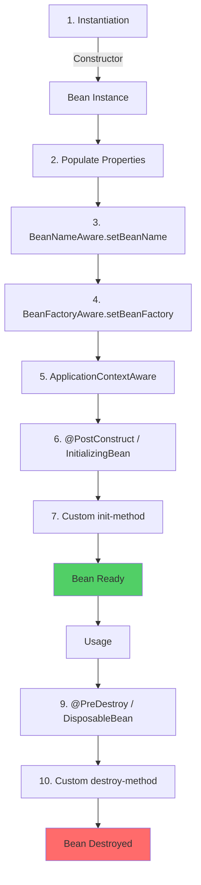

# Spring Framework Internals Content (For Phan4)

## Insertion Point
Add to Phan4_Framework_Tools.md after basic Spring introduction

---

## 4.X. ⭐ Spring Framework Internals

### 4.X.1. IoC/DI Deep Dive

#### A. BeanFactory vs ApplicationContext

**Hierarchy:**
```
BeanFactory (Interface)
    ↓
ApplicationContext (Interface)
    ↓ implements
┌──────────────────────────────────────┐
│ ClassPathXmlApplicationContext       │
│ FileSystemXmlApplicationContext      │
│ AnnotationConfigApplicationContext  │
│ WebApplicationContext                │
└──────────────────────────────────────┘
```

**Key Differences:**

```java
// BeanFactory: Lazy initialization
BeanFactory factory = new XmlBeanFactory(new ClassPathResource("beans.xml"));
MyBean bean = factory.getBean(MyBean.class);  // Created here (lazy)

// ApplicationContext: Eager initialization
ApplicationContext context = new ClassPathXmlApplicationContext("beans.xml");
// All singleton beans created on startup (eager)
MyBean bean = context.getBean(MyBean.class);  // Already created
```

**Comparison Table:**

| Feature | BeanFactory | ApplicationContext |
|---------|-------------|-------------------|
| **Initialization** | Lazy | Eager (singletons) |
| **Memory** | Lightweight | Heavier |
| **Event Publishing** | ❌ No | ✅ Yes |
| **i18n Support** | ❌ No | ✅ Yes |
| **AOP Support** | Manual | ✅ Auto |
| **Use Case** | Resource-constrained | ✅ Standard (90% cases) |

#### B. Bean Lifecycle (Complete)

**Lifecycle Phases:**



**Complete Example:**

```java
@Component
public class LifecycleBean implements 
        BeanNameAware, 
        BeanFactoryAware,
        ApplicationContextAware,
        InitializingBean,
        DisposableBean {
    
    private String beanName;
    
    // 1. Constructor
    public LifecycleBean() {
        System.out.println("1. Constructor called");
    }
    
    // 2. Property injection
    @Autowired
    private SomeService service;
    
    // 3. BeanNameAware
    @Override
    public void setBeanName(String name) {
        this.beanName = name;
        System.out.println("3. setBeanName: " + name);
    }
    
    // 4. BeanFactoryAware
    @Override
    public void setBeanFactory(BeanFactory beanFactory) {
        System.out.println("4. setBeanFactory");
    }
    
    // 5. ApplicationContextAware
    @Override
    public void setApplicationContext(ApplicationContext context) {
        System.out.println("5. setApplicationContext");
    }
    
    // 6. @PostConstruct (recommended)
    @PostConstruct
    public void postConstruct() {
        System.out.println("6. @PostConstruct");
        // Initialize resources here
    }
    
    // 7. InitializingBean (legacy)
    @Override
    public void afterPropertiesSet() {
        System.out.println("7. afterPropertiesSet");
    }
    
    // 8. Custom init-method (XML config)
    public void customInit() {
        System.out.println("8. customInit");
    }
    
    // === Usage phase ===
    
    // 9. @PreDestroy (recommended)
    @PreDestroy
    public void preDestroy() {
        System.out.println("9. @PreDestroy");
        // Cleanup resources here
    }
    
    // 10. DisposableBean (legacy)
    @Override
    public void destroy() {
        System.out.println("10. destroy");
    }
    
    // 11. Custom destroy-method
    public void customDestroy() {
        System.out.println("11. customDestroy");
    }
}
```

**Output:**
```
1. Constructor called
3. setBeanName: lifecycleBean
4. setBeanFactory
5. setApplicationContext
6. @PostConstruct
7. afterPropertiesSet
8. customInit
=== Bean Ready ===
9. @PreDestroy
10. destroy
11. customDestroy
```

#### C. Circular Dependency Resolution

**Problem:**

```java
@Component
class ServiceA {
    @Autowired
    private ServiceB serviceB;  // Depends on B
}

@Component
class ServiceB {
    @Autowired
    private ServiceA serviceA;  // Depends on A → Circular!
}
```

**How Spring Resolves (Singleton):**

```
1. Create ServiceA instance (constructor)
   → Store in "early exposure cache" (partially initialized)

2. Inject ServiceB into ServiceA
   → Need ServiceB → Create ServiceB instance
   
3. Inject ServiceA into ServiceB
   → ServiceA in early cache → Use it (partially initialized)
   → ServiceB fully initialized
   
4. Complete ServiceA initialization
   → ServiceA fully initialized

Result: Both beans created successfully ✅
```

**When It FAILS:**

```java
// ❌ FAILS: Constructor injection + Circular dependency
@Component
class ServiceA {
    private final ServiceB serviceB;
    
    @Autowired
    public ServiceA(ServiceB serviceB) {  // Constructor
        this.serviceB = serviceB;
    }
}

@Component
class ServiceB {
    private final ServiceA serviceA;
    
    @Autowired
    public ServiceB(ServiceA serviceA) {  // Constructor
        this.serviceA = serviceA;
    }
}

// Error: BeanCurrentlyInCreationException
// Reason: No "early exposure" possible (constructor needs all params)
```

**Solution:**

```java
// ✅ Solution 1: Use @Lazy
@Component
class ServiceA {
    private final ServiceB serviceB;
    
    @Autowired
    public ServiceA(@Lazy ServiceB serviceB) {
        this.serviceB = serviceB;  // Proxy injected
    }
}

// ✅ Solution 2: Use setter injection (field injection)
@Component
class ServiceA {
    @Autowired
    private ServiceB serviceB;  // Field injection works
}

// ✅ Solution 3: Refactor (best)
// Question: Why circular dependency? Usually design smell!
```

---

### 4.X.2. AOP Internals

#### A. JDK Dynamic Proxy vs CGLIB

**JDK Proxy (Interface-based):**

```java
// Target class with interface
public interface UserService {
    void createUser(String name);
}

@Service
public class UserServiceImpl implements UserService {
    @Override
    public void createUser(String name) {
        System.out.println("Creating user: " + name);
    }
}

// Spring creates JDK proxy:
UserService proxy = (UserService) Proxy.newProxyInstance(
    classLoader,
    new Class[]{UserService.class},
    new InvocationHandler() {
        @Override
        public Object invoke(Object proxy, Method method, Object[] args) {
            // Before advice
            System.out.println("Before method");
            
            // Invoke actual method
            Object result = method.invoke(target, args);
            
            // After advice
            System.out.println("After method");
            
            return result;
        }
    }
);
```

**CGLIB Proxy (Subclass-based):**

```java
// Target class WITHOUT interface
@Service
public class OrderService {  // No interface
    public void createOrder(Long userId) {
        System.out.println("Creating order for user: " + userId);
    }
}

// Spring creates CGLIB proxy (subclass):
// OrderService$$EnhancerBySpringCGLIB$$12345 extends OrderService

// Limitations:
// ❌ Cannot proxy final classes
// ❌ Cannot proxy final methods
// ❌ Cannot proxy private methods
```

**Comparison:**

| Aspect | JDK Proxy | CGLIB |
|--------|-----------|-------|
| **Requirement** | Interface required | No interface needed |
| **Mechanism** | Implements interface | Extends class |
| **Performance** | Slightly faster | Slightly slower |
| **Limitations** | Need interface | Cannot proxy final class/method |
| **Spring Default** | If interface exists | If no interface |

#### B. Transaction Propagation

**7 Propagation Types:**

```java
@Service
public class OrderService {
    
    @Autowired
    private InventoryService inventoryService;
    
    // REQUIRED (Default): Join existing or create new
    @Transactional(propagation = Propagation.REQUIRED)
    public void createOrder() {
        // If transaction exists → Join it
        // If no transaction → Create new
        
        inventoryService.deductStock();  // Joins this transaction
    }
    
    // REQUIRES_NEW: Always create new (suspend current)
    @Transactional(propagation = Propagation.REQUIRES_NEW)
    public void auditLog() {
        // Always new transaction (independent)
        // If outer transaction rollback → This still commits
    }
    
    // NESTED: Nested transaction (savepoint)
    @Transactional(propagation = Propagation.NESTED)
    public void sendEmail() {
        // If this fails → Rollback to savepoint
        // Outer transaction can continue
    }
    
    // MANDATORY: Must have existing transaction
    @Transactional(propagation = Propagation.MANDATORY)
    public void validateOrder() {
        // If no transaction → Throw exception
    }
    
    // SUPPORTS: Join if exists, non-transactional otherwise
    @Transactional(propagation = Propagation.SUPPORTS)
    public void readOrder() {
        // If transaction exists → Join
        // If no transaction → Run without transaction
    }
    
    // NOT_SUPPORTED: Suspend current transaction
    @Transactional(propagation = Propagation.NOT_SUPPORTED)
    public void generateReport() {
        // Always run without transaction
        // (Suspend if exists)
    }
    
    // NEVER: Must NOT have transaction
    @Transactional(propagation = Propagation.NEVER)
    public void cacheWarmup() {
        // If transaction exists → Throw exception
    }
}
```

---

### 4.X.3. Production Problems

#### Problem 1: @Transactional Not Working (Self-Invocation)

**症状:**

```java
@Service
public class OrderService {
    
    @Transactional
    public void createOrder(Order order) {
        orderDao.insert(order);
        
        // Call another transactional method
        this.updateInventory(order.getProductId());
        // ❌ Transaction NOT applied! (self-invocation)
    }
    
    @Transactional
    public void updateInventory(Long productId) {
        inventoryDao.update(productId);
        // This method called directly → AOP proxy bypassed!
    }
}
```

**Root Cause:**

```
Client → Proxy (AOP) → Target Object
              ↓
         Transaction starts
              ↓
         createOrder() called
              ↓
         this.updateInventory() → Direct call, bypass proxy!
              ↓
         ❌ No transaction for updateInventory
```

**Solutions:**

```java
// ✅ Solution 1: Inject self
@Service
public class OrderService {
    @Autowired
    private OrderService self;  // Inject proxy
    
    @Transactional
    public void createOrder(Order order) {
        orderDao.insert(order);
        self.updateInventory(order.getProductId());  // Use proxy
    }
    
    @Transactional
    public void updateInventory(Long productId) {
        inventoryDao.update(productId);  // Transaction works!
    }
}

// ✅ Solution 2: Use AopContext (enable proxy exposure)
@EnableAspectJAutoProxy(exposeProxy = true)
@Configuration
public class AppConfig {}

@Service
public class OrderService {
    @Transactional
    public void createOrder(Order order) {
        orderDao.insert(order);
        
        // Get current proxy
        OrderService proxy = (OrderService) AopContext.currentProxy();
        proxy.updateInventory(order.getProductId());
    }
}

// ✅ Solution 3: Refactor (best)
@Service
public class OrderService {
    @Autowired
    private InventoryService inventoryService;  // Separate service
    
    @Transactional
    public void createOrder(Order order) {
        orderDao.insert(order);
        inventoryService.updateInventory(order.getProductId());
    }
}
```

#### Problem 2: N+1 Query in JPA

**Problem:**

```java
@Entity
class User {
    @Id
    private Long id;
    
    @OneToMany(mappedBy = "user")
    private List<Order> orders;  // Lazy loading (default)
}

// Query users
List<User> users = userRepository.findAll();  // 1 query

for (User user : users) {
    System.out.println(user.getOrders().size());  // N queries!
    // Each user.getOrders() → Trigger SELECT
}

// Total: 1 + N queries (if 100 users → 101 queries!)
```

**Solutions:**

```java
// ✅ Solution 1: JOIN FETCH
@Query("SELECT u FROM User u JOIN FETCH u.orders")
List<User> findAllWithOrders();

// Result: 1 query with JOIN
// SELECT u.*, o.* FROM users u LEFT JOIN orders o ON u.id = o.user_id

// ✅ Solution 2: EntityGraph
@EntityGraph(attributePaths = "orders")
@Query("SELECT u FROM User u")
List<User> findAllWithOrders();

// ✅ Solution 3: Batch fetching
@Entity
class User {
    @OneToMany(mappedBy = "user")
    @BatchSize(size = 10)  // Fetch in batches of 10
    private List<Order> orders;
}

// Result: 1 + ceil(N/10) queries
// 100 users → 1 + 10 = 11 queries (much better!)
```

#### Problem 3: Connection Pool Exhausted

**Symptoms:**

```
Error: Could not get JDBC Connection
Caused by: Connection pool exhausted (timeout waiting for connection)
```

**Debugging:**

```java
// Check connection pool status
@RestController
public class DiagnosticController {
    
    @Autowired
    private DataSource dataSource;
    
    @GetMapping("/pool-status")
    public Map<String, Object> getPoolStatus() {
        HikariDataSource hikari = (HikariDataSource) dataSource;
        HikariPoolMXBean pool = hikari.getHikariPoolMXBean();
        
        Map<String, Object> status = new HashMap<>();
        status.put("active", pool.getActiveConnections());
        status.put("idle", pool.getIdleConnections());
        status.put("total", pool.getTotalConnections());
        status.put("waiting", pool.getThreadsAwaitingConnection());
        
        return status;
    }
}
```

**Common Causes:**

```java
// ❌ Cause 1: Unclosed connections
try {
    Connection conn = dataSource.getConnection();
    // ... use connection
    // Missing: conn.close()
} catch (Exception e) {
    // Connection leaked!
}

// ✅ Fix: Use try-with-resources
try (Connection conn = dataSource.getConnection()) {
    // ... use connection
}  // Auto-closed

// ❌ Cause 2: Long-running transactions
@Transactional
public void processHugeReport() {
    // Query 1 million rows
    List<Order> orders = orderDao.findAll();
    
    // Process for 10 minutes
    for (Order order : orders) {
        // Heavy processing
    }
    // Transaction holds connection for 10 minutes!
}

// ✅ Fix: Smaller transactions
public void processHugeReport() {
    int pageSize = 1000;
    int page = 0;
    
    while (true) {
        List<Order> batch = processBatch(page, pageSize);
        if (batch.isEmpty()) break;
        page++;
    }
}

@Transactional
private List<Order> processBatch(int page, int size) {
    // Small transaction (1-2 seconds)
    return orderDao.findPage(page, size);
}
```

**Configuration Tuning:**

```yaml
spring:
  datasource:
    hikari:
      maximum-pool-size: 20  # Max connections
      minimum-idle: 5        # Min idle connections
      connection-timeout: 30000  # 30s timeout
      idle-timeout: 600000   # 10min idle timeout
      max-lifetime: 1800000  # 30min max lifetime
      
      # Leak detection (development only)
      leak-detection-threshold: 60000  # 60s
```

---

This content provides deep Spring knowledge essential for production work and interviews.
