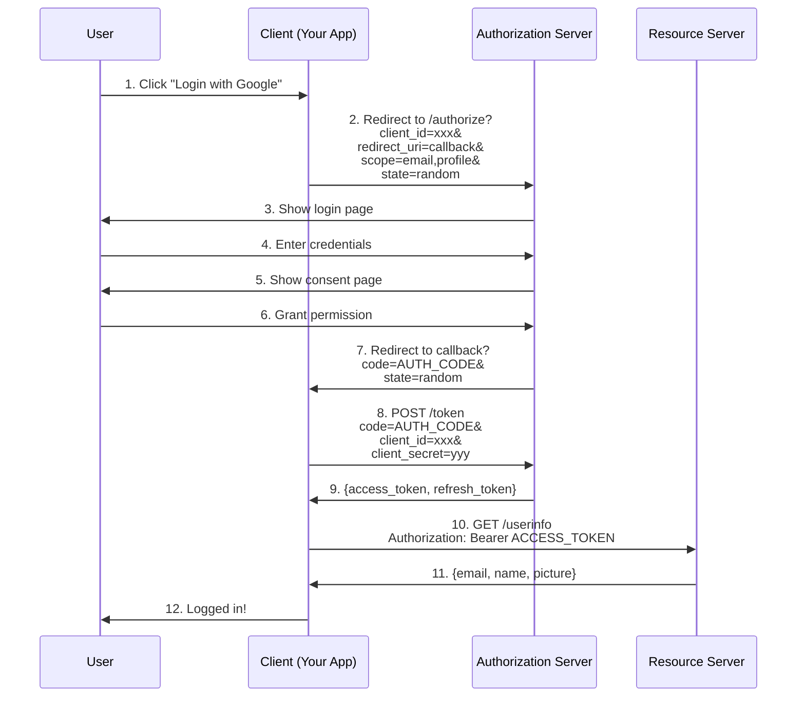

# Security Best Practices Content (For Phan5)

## Insertion Point
Add to Phan5_System_Design.md after basic security concepts

---

## 5.X. ⭐ Security Best Practices Deep-Dive

### 5.X.1. Authentication & Authorization

#### A. JWT Best Practices

**Problem với Simple JWT:**

```java
// ❌ BAD: Single long-lived token
String token = Jwts.builder()
    .setSubject(userId)
    .setExpiration(new Date(System.currentTimeMillis() + 30 * 24 * 3600 * 1000))  // 30 days!
    .signWith(SignatureAlgorithm.HS256, secretKey)
    .compact();

// Problems:
// 1. If stolen → Valid for 30 days
// 2. Cannot revoke (stateless)
// 3. User logout → Token still valid
```

**✅ Solution: Access Token + Refresh Token Pattern**

```java
@Service
public class TokenService {
    
    private final String SECRET_KEY = "your-secret-key-min-256-bits";
    private final String REFRESH_SECRET = "refresh-secret-key-different";
    
    // Access token: Short-lived (15 minutes)
    public String generateAccessToken(String userId) {
        return Jwts.builder()
            .setSubject(userId)
            .claim("type", "access")
            .setIssuedAt(new Date())
            .setExpiration(new Date(System.currentTimeMillis() + 15 * 60 * 1000))  // 15 min
            .signWith(SignatureAlgorithm.HS256, SECRET_KEY)
            .compact();
    }
    
    // Refresh token: Long-lived (7 days), stored in DB
    public String generateRefreshToken(String userId) {
        String token = Jwts.builder()
            .setSubject(userId)
            .claim("type", "refresh")
            .setIssuedAt(new Date())
            .setExpiration(new Date(System.currentTimeMillis() + 7 * 24 * 3600 * 1000))  // 7 days
            .signWith(SignatureAlgorithm.HS256, REFRESH_SECRET)
            .compact();
        
        // Store in database (for revocation)
        RefreshToken refreshToken = new RefreshToken();
        refreshToken.setUserId(userId);
        refreshToken.setToken(token);
        refreshToken.setExpiresAt(LocalDateTime.now().plusDays(7));
        refreshTokenDao.insert(refreshToken);
        
        return token;
    }
    
    // Refresh endpoint
    public TokenPair refreshTokens(String refreshToken) {
        // 1. Validate refresh token
        Claims claims = Jwts.parser()
            .setSigningKey(REFRESH_SECRET)
            .parseClaimsJws(refreshToken)
            .getBody();
        
        String userId = claims.getSubject();
        
        // 2. Check if token in database (not revoked)
        RefreshToken stored = refreshTokenDao.findByToken(refreshToken);
        if (stored == null || stored.isRevoked()) {
            throw new InvalidTokenException("Token revoked");
        }
        
        // 3. Generate new access token
        String newAccessToken = generateAccessToken(userId);
        
        // 4. Optional: Rotate refresh token (better security)
        String newRefreshToken = generateRefreshToken(userId);
        refreshTokenDao.revokeToken(refreshToken);  // Revoke old
        
        return new TokenPair(newAccessToken, newRefreshToken);
    }
    
    // Logout: Revoke refresh token
    public void logout(String refreshToken) {
        refreshTokenDao.revokeToken(refreshToken);
    }
}
```

**Token Storage on Client:**

```javascript
// ✅ GOOD: httpOnly cookie for refresh token
// Access token: localStorage (short-lived, acceptable)
// Refresh token: httpOnly cookie (cannot access from JS)

// Server sets cookie:
@PostMapping("/login")
public ResponseEntity<?> login(@RequestBody LoginRequest request, HttpServletResponse response) {
    // Authenticate user...
    
    String accessToken = tokenService.generateAccessToken(userId);
    String refreshToken = tokenService.generateRefreshToken(userId);
    
    // Set refresh token in httpOnly cookie
    Cookie cookie = new Cookie("refreshToken", refreshToken);
    cookie.setHttpOnly(true);  // Cannot access from JavaScript
    cookie.setSecure(true);    // HTTPS only
    cookie.setPath("/api/refresh");
    cookie.setMaxAge(7 * 24 * 3600);  // 7 days
    response.addCookie(cookie);
    
    // Return access token in response body
    return ResponseEntity.ok(new LoginResponse(accessToken));
}
```

#### B. OAuth 2.0 Authorization Code Flow

**Complete Flow:**



**Implementation:**

```java
@RestController
@RequestMapping("/oauth")
public class OAuthController {
    
    @GetMapping("/google/login")
    public ResponseEntity<?> initiateGoogleLogin() {
        // Generate state (CSRF protection)
        String state = UUID.randomUUID().toString();
        sessionService.saveState(state);
        
        // Build authorization URL
        String authUrl = "https://accounts.google.com/o/oauth2/v2/auth"
            + "?client_id=" + googleClientId
            + "&redirect_uri=" + URLEncoder.encode(callbackUrl, "UTF-8")
            + "&response_type=code"
            + "&scope=email%20profile"
            + "&state=" + state;
        
        return ResponseEntity.ok(Map.of("authUrl", authUrl));
    }
    
    @GetMapping("/google/callback")
    public ResponseEntity<?> handleGoogleCallback(
            @RequestParam String code,
            @RequestParam String state) {
        
        // 1. Verify state (CSRF protection)
        if (!sessionService.verifyState(state)) {
            throw new SecurityException("Invalid state");
        }
        
        // 2. Exchange code for tokens
        RestTemplate restTemplate = new RestTemplate();
        
        MultiValueMap<String, String> body = new LinkedMultiValueMap<>();
        body.add("code", code);
        body.add("client_id", googleClientId);
        body.add("client_secret", googleClientSecret);
        body.add("redirect_uri", callbackUrl);
        body.add("grant_type", "authorization_code");
        
        TokenResponse tokenResponse = restTemplate.postForObject(
            "https://oauth2.googleapis.com/token",
            body,
            TokenResponse.class
        );
        
        // 3. Get user info
        HttpHeaders headers = new HttpHeaders();
        headers.setBearerAuth(tokenResponse.getAccessToken());
        
        HttpEntity<?> entity = new HttpEntity<>(headers);
        
        UserInfo userInfo = restTemplate.exchange(
            "https://www.googleapis.com/oauth2/v2/userinfo",
            HttpMethod.GET,
            entity,
            UserInfo.class
        ).getBody();
        
        // 4. Create/update user in database
        User user = userService.findOrCreateByEmail(userInfo.getEmail());
        
        // 5. Generate our own JWT
        String jwt = tokenService.generateAccessToken(user.getId());
        
        return ResponseEntity.ok(new LoginResponse(jwt));
    }
}
```

#### C. Password Hashing

**❌ NEVER do this:**

```java
// ❌ Plain text
String password = "user_password";
userDao.save(user, password);  // Stored as-is!

// ❌ MD5/SHA1 (too fast, vulnerable to rainbow tables)
String hash = DigestUtils.md5Hex(password);

// ❌ SHA256 without salt
String hash = DigestUtils.sha256Hex(password);
```

**✅ Use bcrypt (recommended):**

```java
@Service
public class PasswordService {
    
    private final BCryptPasswordEncoder encoder = new BCryptPasswordEncoder(12);  // Cost factor 12
    
    // Hash password
    public String hashPassword(String plainPassword) {
        return encoder.encode(plainPassword);
        // Result: $2a$12$KIXxCj7qXk.../yjfJ3ZvK2NpO5fQ3fJqYGEO
        // $2a$ = bcrypt algorithm
        // $12$ = cost factor (2^12 iterations)
        // Next 22 chars = salt (random)
        // Rest = hash
    }
    
    // Verify password
    public boolean verifyPassword(String plainPassword, String hashedPassword) {
        return encoder.matches(plainPassword, hashedPassword);
    }
}
```

**Why bcrypt?**
```
1. Adaptive: Can increase cost factor over time
2. Salted: Each hash has unique salt (prevent rainbow tables)
3. Slow: 2^12 iterations = ~0.3 seconds (brute-force hard)
4. Industry standard: Used by GitHub, Facebook, etc.

Alternative: Argon2 (newer, more secure)
```

---

### 5.X.2. OWASP Top 10 Detailed

#### #1: SQL Injection

**Vulnerable Code:**

```java
// ❌ String concatenation
String sql = "SELECT * FROM users WHERE username = '" + username + "' AND password = '" + password + "'";
Statement stmt = conn.createStatement();
ResultSet rs = stmt.executeQuery(sql);

// Attack:
// username = "admin' --"
// Result: SELECT * FROM users WHERE username = 'admin' --' AND password = ''
// → Login as admin without password!
```

**✅ Fix: Prepared Statements**

```java
String sql = "SELECT * FROM users WHERE username = ? AND password = ?";
PreparedStatement pstmt = conn.prepareStatement(sql);
pstmt.setString(1, username);
pstmt.setString(2, password);
ResultSet rs = pstmt.executeQuery();

// Attack fails: username treated as literal string, not SQL
```

#### #2: Cross-Site Scripting (XSS)

**Vulnerable Code:**

```java
@GetMapping("/search")
public String search(@RequestParam String query, Model model) {
    model.addAttribute("query", query);  // Unsanitized
    return "search";
}

// Template (Thymeleaf)
<p>You searched for: ${query}</p>  <!-- ❌ Unescaped -->

// Attack:
// query = "<script>alert(document.cookie)</script>"
// Result: Script executed, cookies stolen!
```

**✅ Fix: Auto-escaping + CSP**

```html
<!-- ✅ Thymeleaf auto-escapes by default -->
<p>You searched for: <span th:text="${query}"></span></p>
<!-- Result: &lt;script&gt;alert...&lt;/script&gt; (escaped) -->

<!-- Add Content Security Policy -->
<meta http-equiv="Content-Security-Policy" 
      content="default-src 'self'; script-src 'self' 'nonce-{random}'">
```

#### #3: Insecure Deserialization

**Vulnerable Code:**

```java
// ❌ Accept serialized objects from client
@PostMapping("/deserialize")
public Object deserialize(@RequestBody byte[] data) {
    ObjectInputStream ois = new ObjectInputStream(new ByteArrayInputStream(data));
    return ois.readObject();  // Dangerous!
    
    // Attack: Malicious serialized object → RCE (Remote Code Execution)
}
```

**✅ Fix: Use JSON instead**

```java
// ✅ Use JSON (safe)
@PostMapping("/data")
public MyObject processData(@RequestBody MyObject data) {
    // Jackson handles deserialization safely
    return data;
}

// If must use serialization, whitelist classes
ObjectInputStream ois = new ObjectInputStream(inputStream) {
    @Override
    protected Class<?> resolveClass(ObjectStreamClass desc) {
        // Whitelist allowed classes
        if (!allowedClasses.contains(desc.getName())) {
            throw new InvalidClassException("Unauthorized class");
        }
        return super.resolveClass(desc);
    }
};
```

---

### 5.X.3. Data Protection

#### A. Encryption at Rest vs In Transit

**At Rest (Database):**

```java
// Use Spring encryption for sensitive fields
@Entity
public class User {
    @Id
    private Long id;
    
    private String username;
    
    // ❌ Plain text
    private String ssn;  // Social Security Number
    
    // ✅ Encrypted
    @Convert(converter = SSNConverter.class)
    private String ssn;
}

@Converter
public class SSNConverter implements AttributeConverter<String, String> {
    
    private static final String ALGORITHM = "AES/GCM/NoPadding";
    private static final byte[] KEY = loadKeyFromSecureStorage();  // 256-bit key
    
    @Override
    public String convertToDatabaseColumn(String plainText) {
        return encrypt(plainText);
    }
    
    @Override
    public String convertToEntityAttribute(String encrypted) {
        return decrypt(encrypted);
    }
    
    private String encrypt(String plainText) {
        Cipher cipher = Cipher.getInstance(ALGORITHM);
        cipher.init(Cipher.ENCRYPT_MODE, new SecretKeySpec(KEY, "AES"));
        byte[] encrypted = cipher.doFinal(plainText.getBytes());
        return Base64.getEncoder().encodeToString(encrypted);
    }
}
```

**In Transit (HTTPS):**

```yaml
# application.yml
server:
  port: 8443
  ssl:
    enabled: true
    key-store: classpath:keystore.p12
    key-store-password: ${KEYSTORE_PASSWORD}
    key-store-type: PKCS12
    key-alias: tomcat
```

#### B. PII Handling

**Best Practices:**

```java
@Service
public class UserService {
    
    // ❌ BAD: Log sensitive data
    public void createUser(User user) {
        log.info("Creating user: {}", user);  // Contains SSN, email, etc.
        userDao.save(user);
    }
    
    // ✅ GOOD: Mask sensitive data
    public void createUser(User user) {
        log.info("Creating user: id={}, username={}", user.getId(), user.getUsername());
        userDao.save(user);
    }
    
    // ✅ Custom toString() to exclude sensitive fields
    @Override
    public String toString() {
        return "User{id=" + id + ", username=" + username + "}";
        // Exclude: ssn, email, password
    }
}
```

---

### 5.X.4. Production Security

#### A. Secret Management

**❌ BAD:**

```java
// Hardcoded secrets (committed to Git)
private static final String API_KEY = "sk_live_asdf1234...";
private static final String DB_PASSWORD = "MyPassword123";
```

**✅ GOOD: Use Vault or Cloud Secrets:**

```java
@Configuration
public class SecretsConfig {
    
    @Value("${vault.api.key}")
    private String apiKey;
    
    @Value("${vault.db.password}")
    private String dbPassword;
}

// application.yml
spring:
  cloud:
    vault:
      uri: https://vault.example.com
      authentication: TOKEN
      token: ${VAULT_TOKEN}  // From environment variable
```

#### B. Security Headers

```java
@Configuration
@EnableWebSecurity
public class SecurityConfig extends WebSecurityConfigurerAdapter {
    
    @Override
    protected void configure(HttpSecurity http) throws Exception {
        http
            .headers()
                .contentSecurityPolicy("default-src 'self'")
                .and()
                .xssProtection()
                .and()
                .frameOptions().deny()  // Prevent clickjacking
                .and()
                .httpStrictTransportSecurity()
                    .maxAgeInSeconds(31536000)  // 1 year
                    .includeSubDomains(true)
            .and()
            // ... other config
    }
}
```

#### C. Rate Limiting

```java
@Component
public class RateLimitInterceptor implements HandlerInterceptor {
    
    private final LoadingCache<String, AtomicInteger> requestCounts = 
        CacheBuilder.newBuilder()
            .expireAfterWrite(1, TimeUnit.MINUTES)
            .build(new CacheLoader<>() {
                public AtomicInteger load(String key) {
                    return new AtomicInteger(0);
                }
            });
    
    @Override
    public boolean preHandle(HttpServletRequest request, 
                            HttpServletResponse response,
                            Object handler) throws Exception {
        
        String ip = request.getRemoteAddr();
        AtomicInteger count = requestCounts.get(ip);
        
        if (count.incrementAndGet() > 100) {  // 100 req/minute
            response.setStatus(429);  // Too Many Requests
            response.getWriter().write("Rate limit exceeded");
            return false;
        }
        
        return true;
    }
}
```

---

This content covers essential security practices for production applications and interviews.
