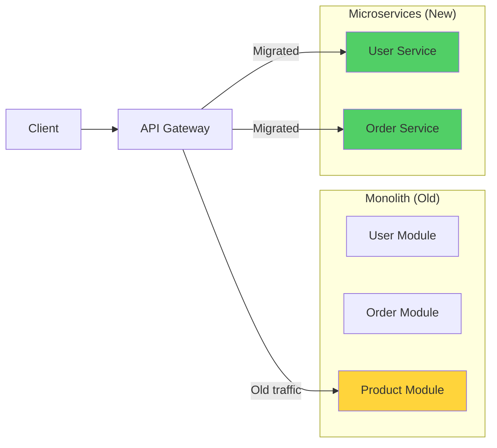
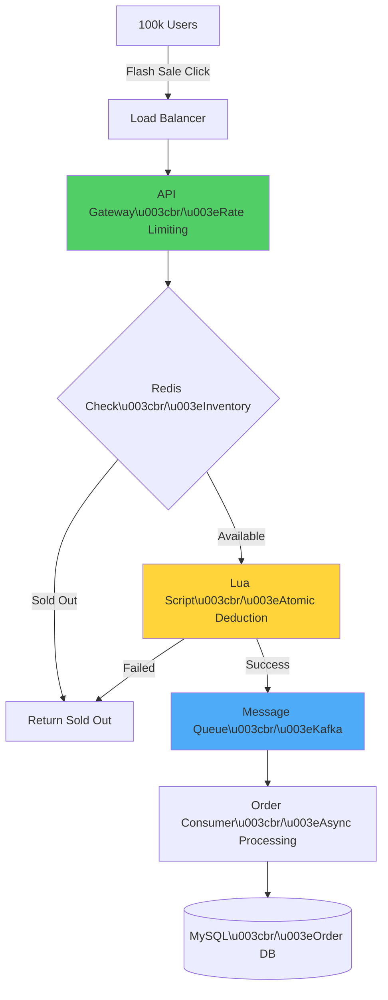
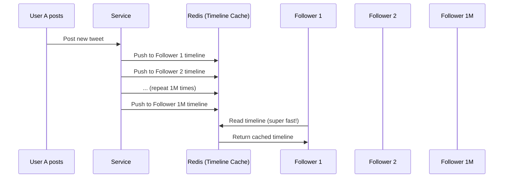
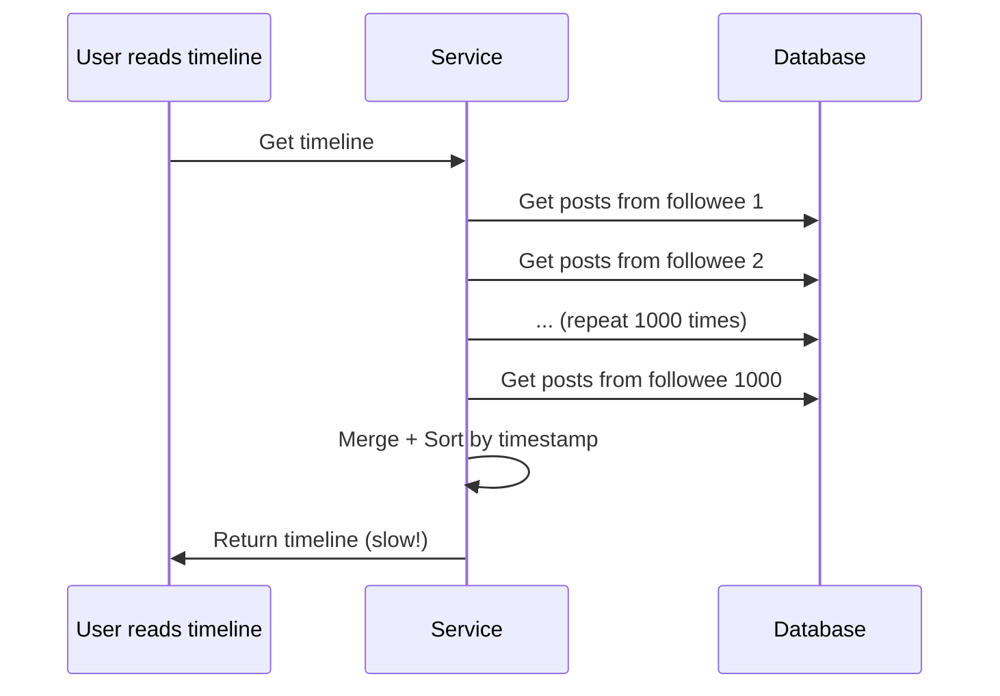
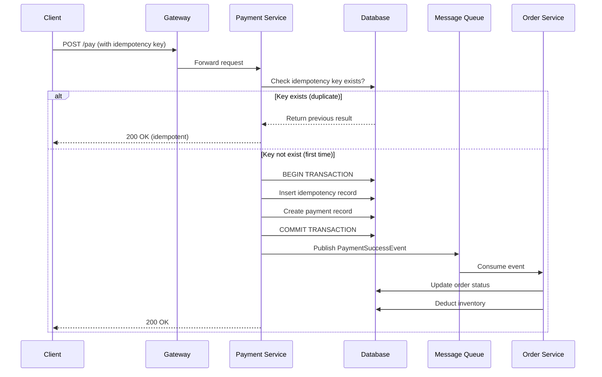

# Part 5: System Design (Thiết kế hệ thống)

## 5.1. Design Patterns (Mẫu thiết kế)

**Design Pattern** là các giải pháp tiêu chuẩn cho các vấn đề thường gặp trong thiết kế phần mềm.

Có 3 nhóm chính:
1.  **Creational (Khởi tạo)**: Singleton, Factory, Builder...
2.  **Structural (Cấu trúc)**: Adapter, Decorator, Proxy...
3.  **Behavioral (Hành vi)**: Strategy, Observer, Template Method...

### 5.1.1. ⭐ Singleton Pattern

**Mục đích**: Đảm bảo class chỉ có **1 instance duy nhất** và cung cấp điểm truy cập toàn cục.

**Use cases**: ConfigManager, ConnectionPool, ApplicationContext.

#### 1. Lazy Loading (Không an toàn thread)
```java
public class Singleton {
    private static Singleton instance;
    private Singleton() {}

    public static Singleton getInstance() {
        if (instance == null) {
            instance = new Singleton();
        }
        return instance;
    }
}
```

#### 2. ⭐ Double-Checked Locking (An toàn, Hiệu suất cao)
Cách chuẩn nhất để implement Singleton lười biếng (lazy).

```java
public class Singleton {
    // volatile ngăn chặn instruction reordering
    private static volatile Singleton instance;

    private Singleton() {}

    public static Singleton getInstance() {
        if (instance == null) {
            synchronized (Singleton.class) {
                if (instance == null) {
                    instance = new Singleton();
                }
            }
        }
        return instance;
    }
}
```

#### 3. Static Inner Class (Recommended ✅)
Tận dụng cơ chế class loading của JVM để đảm bảo thread-safety và lazy loading.

```java
public class Singleton {
    private Singleton() {}

    private static class SingletonHolder {
        private static final Singleton INSTANCE = new Singleton();
    }

    public static Singleton getInstance() {
        return SingletonHolder.INSTANCE;
    }
}
```

#### 4. Enum (Recommended for prevention of reflection attack)
Cách an toàn nhất, ngăn chặn tấn công qua Reflection và Serialization.

```java
public enum Singleton {
    INSTANCE;
    public void doSomething() { ... }
}
```

---

### 5.1.2. Factory Pattern

**Mục đích**: Tạo objects mà không để lộ logic khởi tạo cho client.

#### Simple Factory
```public class ShapeFactory {
    public Shape getShape(String shapeType) {
        if (shapeType.equalsIgnoreCase("CIRCLE")) return new Circle();
        if (shapeType.equalsIgnoreCase("SQUARE")) return new Square();
        return null;
    }
}
```

#### Spring Bean Factory
Spring sử dụng Factory pattern cho **BeanFactory** và **ApplicationContext** để tạo và quản lý beans.

---

### 5.1.3. ⭐ Proxy Pattern

**Mục đích**: Cung cấp **đại diện** (placeholder) cho object khác để kiểm soát truy cập hoặc thêm chức năng (logging, transaction) mà không sửa code gốc.

#### Static Proxy
Tạo class Proxy implement cùng interface với Target.
*   *Nhược điểm*: Phải viết class proxy cho mỗi class target → Code duplication.

#### Dynamic Proxy (JDK)
Tạo proxy tại **runtime** dùng Reflection. Chỉ proxy được Interface.

```java
InvocationHandler handler = new MyInvocationHandler(target);
MyInterface proxy = (MyInterface) Proxy.newProxyInstance(
    target.getClass().getClassLoader(),
    target.getClass().getInterfaces(),
    handler
);
```

#### CGLIB Proxy
Tạo subclass của Target class tại runtime. Proxy được cả Class (trừ final). Spring Boot dùng cách này mặc định.

**Ứng dụng**: Spring **AOP** (Transaction, Security, Logging).

---

### 5.1.4. Behavioral Patterns

#### ⭐ Strategy Pattern (Chiến lược)
Định nghĩa một họ thuật toán, đóng gói từng thuật toán lại, và làm chúng thay thế lẫn nhau.

**Ví dụ**: PaymentService (CreditCard, PayPal, COD).
```java
// Interface
public interface PaymentStrategy { void pay(int amount); }

// Strategy A
public class CreditCardStrategy implements PaymentStrategy { ... }

// Strategy B
public class PaypalStrategy implements PaymentStrategy { ... }

// Context dùng strategy
public class ShoppingCart {
    public void pay(PaymentStrategy strategy) {
        strategy.pay(calculateTotal());
    }
}
```
**Ứng dụng**: Thay thế `if-else` phức tạp.

#### Observer Pattern (Quan sát)
Defines one-to-many dependency. Khi object trạng thái thay đổi, tất cả dependents được thông báo.

**Ứng dụng**: Event Listener, Message Queue (Pub/Sub).

#### Template Method Pattern
Định nghĩa khung của thuật toán, để subclass implement các bước cụ thể.

**Ứng dụng**: `JdbcTemplate`, `RedisTemplate` trong Spring.

---

## 5.2. System Design Basics

### 5.2.1. ⭐ RESTful API Design

**REST** (Representational State Transfer) là phong cách kiến trúc cho web services.

**1. Resource Naming (Danh từ, số nhiều)**
*   ✅ `GET /users` (Lấy list user)
*   ✅ `GET /users/1` (Lấy user ID 1)
*   ✅ `POST /users` (Tạo user)
*   ✅ `DELETE /users/1` (Xóa user ID 1)
*   ❌ `/getUsers`, `/createUser` (Không dùng động từ trong URL!)

**2. HTTP Methods (Verbs)**
*   **GET**: Retrieve resource (Safe, Idempotent).
*   **POST**: Create resource (Not idempotent).
*   **PUT**: Update/Replace resource (Idempotent).
*   **PATCH**: Partial update (Not idempotent theoretically, but usually is).
*   **DELETE**: Delete resource (Idempotent).

**3. HTTP Status Codes**
*   **200 OK**: Thành công.
*   **201 Created**: Tạo thành công (POST).
*   **204 No Content**: Xóa thành công (DELETE).
*   **400 Bad Request**: Lỗi input client.
*   **401 Unauthorized**: Chưa đăng nhập.
*   **403 Forbidden**: Đã đăng nhập nhưng không có quyền.
*   **404 Not Found**: Không tìm thấy resource.
*   **500 Internal Server Error**: Lỗi server.

**4. Idempotency (Tính lũy đẳng)**
Thực hiện 1 lần hay N lần đều cho cùng kết quả server state (Resource side).
*   `GET`, `PUT`, `DELETE`: Idempotent.
*   `POST`: **Non-idempotent** (gọi 2 lần tạo 2 resources).

### 5.2.2. Naming Conventions (Quy ước đặt tên)

| Style | Example | Use Case (Java/System) |
|-------|---------|------------------------|
| **UpperCamelCase** | `OrderService`, `User` | Class name, Interface |
| **lowerCamelCase** | `userService`, `userId` | Method, Variable |
| **snake_case** | `order_service`, `user_id` | Database column, JSON field (đôi khi) |
| **kebab-case** | `order-service`, `api/v1/users` | URL, Message Queue topic |
| **UPPER_SNAKE** | `MAX_RETRY`, `STATUS_OK` | Constant, Enum |

### 5.2.3. Monolith vs Microservices

| Feature | Monolith (Đơn khối) | Microservices (Vi dịch vụ) |
|---------|---------------------|----------------------------|
| **Deployment** | 1 file (WAR/JAR) duy nhất | Nhiều services deploy riêng lẻ |
| **Scalability** | Scale toàn bộ app (nặng nề) | Scale từng service (linh hoạt) |
| **Complexity** | Đơn giản ban đầu | Phức tạp (network, distributed tx) |
| **Tech Stack** | Fix cứng 1 ngôn ngữ/framework | Đa dạng (Polyglot) |
| **Fault Tolerance** | Lỗi 1 phần có thể sập cả app | Lỗi service nào cách ly service đó |
| **Phù hợp** | Startups, team nhỏ, app đơn giản | Enterprise, team lớn, app phức tạp |

---

*Kết thúc Design Pattern & System Basics. Tiếp tục Security & Scheduling...*

## 5.3. Authentication & Security (Xác thực & Bảo mật)

### 5.3.1. ⭐ Cookie vs Session vs Token

#### 1. Cookie & Session (Stateful)
*   **Cookie**: File nhỏ lưu ở **Browser**, gửi kèm mỗi request. Dùng để lưu Session ID.
*   **Session**: Dữ liệu lưu ở **Server** (Memory/Redis), ánh xạ qua Session ID.

**Flow:**
1.  Client login → Server tạo Session, lưu UserInfo → Trả về `JESSIONID` trong Cookie.
2.  Client request + Cookie(`JSESSIONID`) → Server check Session → OK.

**Nhược điểm:**
*   ❌ **Scalability**: Khó scale ngang (Session sticky hoặc phải dùng Distributed Session với Redis).
*   ❌ **Mobile App**: Cookie kém tương thích với native mobile apps.
*   ❌ **CSRF**: Dễ bị tấn công CSRF.

#### 2. Token-Based Authentication (Stateless - JWT)
**JWT (JSON Web Token)** chứa thông tin user (payload) được ký (signed) bởi server.

**Flow:**
1.  Client login → Server verify → Tạo JWT (Header.Payload.Signature) → Trả về Client.
2.  Client lưu JWT (LocalStorage/Cookie).
3.  Client request + Header `Authorization: Bearer <token>` → Server verify signature → OK.

**Ưu điểm:**
*   ✅ **Stateless**: Server không lưu trạng thái → Dễ scale.
*   ✅ **Cross-domain**: Dễ dàng dùng cho SSO, Mobile App.
*   ✅ **Performance**: Giảm tải Server (không cần tra cứu session DB/Redis liên tục).

**Nhược điểm:**
*   ❌ **Invalidation**: Khó thu hồi (ban) token trước khi hết hạn (trừ khi dùng blacklist).
*   ❌ **Size**: Token lớn hơn Cookie ID → Tăng bandwidth.

### 5.3.2. ⭐ JWT Structure

JWT gồm 3 phần tách nhau bởi dấu chấm (`.`): `aaaaaa.bbbbbb.cccccc`

**1. Header** (Algorithm & Type)
```json
{ "alg": "HS256", "typ": "JWT" }
```

**2. Payload** (Data - Claims)
Chứa thông tin user (không để mật khẩu!).
```json
{ "sub": "1234567890", "name": "John Doe", "role": "admin", "iat": 1516239022 }
```

**3. Signature** (Chữ ký an toàn)
```javascript
HMACSHA256(
  base64UrlEncode(header) + "." + base64UrlEncode(payload),
  "secret_key"
)
```

⚠️ **Lưu ý quan trọng**: Payload chỉ được **Base64 encoded**, không phải encrypted. **Ai cũng đọc được payload!** → Không để data nhạy cảm (password) trong payload.

### 5.3.3. ⭐ SSO (Single Sign-On) & OAuth 2.0

**SSO**: Đăng nhập 1 lần, truy cập được nhiều hệ thống (Google, Facebook logins).

**OAuth 2.0**: Giao thức ủy quyền (Authorization).

**Các Role trong OAuth 2.0:**
1.  **Resource Owner**: User.
2.  **Client**: App muốn truy cập data (Website/Mobile App).
3.  **Authorization Server**: Server cấp token (Google Auth).
4.  **Resource Server**: Server chứa data (Google Photos).

**Authorization Code Flow (Chuẩn nhất):**
1.  User click "Login with Google".
2.  Redirect đến Google Auth Page.
3.  User login & approve.
4.  Google redirect về Client với **Authorization Code**.
5.  Client gửi Code + ClientSecret lên Google để đổi lấy **Access Token**.
6.  Client dùng Token gọi API.

### 5.3.4. Common Security Attacks

#### 1. SQL Injection
Attacker chèn mã SQL vào input để thao tác DB.
*   *Attack*: `username = "admin' --"`
*   *Tác hại*: Bypass login, xóa data.
*   *Fix*: Dùng **Prepared Statement** (`#{}` trong MyBatis).

#### 2. XSS (Cross-Site Scripting)
Attacker chèn script độc hại (JavaScript) vào web để chạy trên browser nạn nhân.
*   *Attack*: Comment chứa `<script>stealCookie()</script>`.
*   *Tác hại*: Ăn cắp Cookie, Session, Redirect user.
*   *Fix*: **HTML Escape** output (chuyển `<` thành `&lt;`).

#### 3. CSRF (Cross-Site Request Forgery)
Attacker lừa user (đang login) click link thực hiện hành động ngoài ý muốn.
*   *Attack*: User truy cập web lạ → Web lạ gửi request `POST banking.com/transfer` (kèm cookie thật của user).
*   *Fix*: Sử dụng **CSRF Token** (hidden field trong form) hoặc dùng `SameSite` Cookie attribute.

---

## 5.4. Scheduled Tasks (Tác vụ định kỳ)

### 5.4.1. Single-node Scheduling

**1. Java Timer / ScheduledExecutorService**
*   Cơ bản của JDK.

**2. Spring @Scheduled** (Phổ biến nhất)
```java
@Component
public class ScheduledTasks {

    // Chạy mỗi 5s (fixedRate: tính từ lúc bắt đầu)
    @Scheduled(fixedRate = 5000)
    public void reportCurrentTime() { ... }

    // Cron expression (Giây Phút Giờ Ngày Tháng Thứ)
    // Chạy lúc 10:15 AM mỗi ngày
    @Scheduled(cron = "0 15 10 * * ?")
    public void cronJob() { ... }
}
```

*   **Nhược điểm**: Chỉ chạy trên **1 server**. Nếu deploy 2 instances → job chạy 2 lần (trùng lặp)!

### 5.4.2. Distributed Scheduling

Khi có nhiều server (Cluster), cần đảm bảo job **chỉ chạy trên 1 node** hoặc scanr data không trùng lặp.

**Giải pháp:**

**1. Redis / DB Lock (Tự chế)**
*   Dùng `@Scheduled` + Redis `SETNX` (Distributed Lock).
*   Ai lấy được lock thì chạy.
*   *Đơn giản nhưng thiếu tính năng monitoring/retry.*

**2. Quartz Cluster**
*   Framework lâu đời, mạnh mẽ.
*   Dùng **Database** để đồng bộ trạng thái giữa các nodes.
*   *Hơi nặng nề (Heavyweight).*

**3. XXL-JOB / Elastic-Job (Phổ biến tại TQ/VN)**
*   **XXL-JOB**: Có Admin Dashboard quản lý job, log, retry, sharding. Rất nhẹ và dễ dùng.
*   **Cơ chế**: Admin center trigger job → gửi request đến Executor (Service của bạn).

---

## 5.5. ⭐ High Concurrency System Design (Thiết kế hệ thống high concurrency)

### 5.5.1. Tại sao cần High Concurrency Design?

**Vấn đề:**
- Database chỉ chịu được **2,000-3,000 QPS**
- Traffic thực tế: **5,000-10,000+ QPS** (peak: 100,000+)
- → Database bị quá tải → System crash

**Solution: High Concurrency Architecture** với 6 thành phần chính:

### 5.5.2. ⭐ 6 Thành phần chính

**1. System Split (Chia nhỏ hệ thống)**

**Mục đích**: Tách monolith thành microservices, mỗi service có database riêng.

**Ví dụ:**
```
Monolith (1 DB) → User Service (DB1) + Order Service (DB2) + Product Service (DB3)
```

**Lợi ích:**
- Mỗi service scale độc lập
- Database load được phân tán
- Fault isolation (lỗi service này không ảnh hưởng service kia)

**Tools**: Dubbo, Spring Cloud

#### 1.1. ⭐ Service Decomposition Strategies (Chiến lược tách services)

**Strategy 1: By Business Capability (Theo khả năng nghiệp vụ)**

Tách services dựa trên business functions độc lập.

**Ví dụ E-commerce:**
```
Monolith
  ↓
├─ User Service (quản lý user, authentication)
├─ Product Service (catalog, inventory)
├─ Order Service (đặt hàng, thanh toán)
├─ Payment Service (xử lý payment)
├─ Shipping Service (quản lý vận chuyển)
└─ Notification Service (email, SMS)
```

**Ưu điểm:**
- ✅ Mỗi team độc lập (Conway's Law)
- ✅ Clear boundaries
- ✅ Dễ scale từng function

**Strategy 2: By Subdomain (DDD - Domain-Driven Design)**

Áp dụng DDD để xác định bounded contexts.

**Ví dụ:**
```java
// Bounded Context: Order Domain
@Service
public class OrderService {
    // Order aggregate root
    public Order createOrder(OrderRequest request) {
        // Domain logic
        Order order = new Order(request.getUserId(), request.getItems());
        order.calculateTotal();
        order.validate();
        
        // Publish domain event
        eventPublisher.publish(new OrderCreatedEvent(order));
        
        return orderRepository.save(order);
    }
}

// Bounded Context: Payment Domain (riêng biệt)
@Service
public class PaymentService {
    @EventListener
    public void handleOrderCreated(OrderCreatedEvent event) {
        // Create payment record
        Payment payment = new Payment(event.getOrderId(), event.getAmount());
        paymentRepository.save(payment);
    }
}
```

**Strategy 3: Strangler Fig Pattern (Migration từ Monolith)**

Dần dần migrate features từ monolith sang microservices.

**Steps:**
1. **Identify** service boundary (vd: User Management)
2. **Create** microservice mới
3. **Route** traffic mới đến microservice (API Gateway)
4. **Migrate** data dần dần
5. **Deprecate** code cũ trong monolith

**Diagram (Strangler Pattern):**


#### 1.2. ⭐ API Gateway Patterns

**API Gateway** là single entry point cho tất cả client requests, routing đến các microservices.

**Responsibilities:**
- ✅ Routing và load balancing
- ✅ Authentication & Authorization
- ✅ Rate limiting
- ✅ Request/Response transformation
- ✅ Logging & Monitoring

**Implementation 1: Spring Cloud Gateway**

```yaml
# application.yml
spring:
  cloud:
    gateway:
      routes:
        # User Service route
        - id: user-service
          uri: lb://user-service  # Load balance to user-service instances
          predicates:
            - Path=/api/users/**
          filters:
            - RewritePath=/api/users/(?<segment>.*), /${segment}
            - name: RequestRateLimiter
              args:
                redis-rate-limiter.replenishRate: 10
                redis-rate-limiter.burstCapacity: 20
        
        # Order Service route
        - id: order-service
          uri: lb://order-service
          predicates:
            - Path=/api/orders/**
          filters:
            - RewritePath=/api/orders/(?<segment>.*), /${segment}
            - name: CircuitBreaker
              args:
                name: orderCircuitBreaker
                fallbackUri: forward:/fallback/orders
```

**Custom Filter (Authentication):**
```java
@Component
public class AuthenticationFilter implements GlobalFilter, Ordered {
    
    @Override
    public Mono<Void> filter(ServerWebExchange exchange, GatewayFilterChain chain) {
        ServerHttpRequest request = exchange.getRequest();
        
        // Extract JWT token
        String token = request.getHeaders().getFirst("Authorization");
        
        if (token == null || !token.startsWith("Bearer ")) {
            exchange.getResponse().setStatusCode(HttpStatus.UNAUTHORIZED);
            return exchange.getResponse().setComplete();
        }
        
        try {
            // Validate token
            Claims claims = jwtUtil.validateToken(token.substring(7));
            
            // Add user info to request header
            ServerHttpRequest modifiedRequest = request.mutate()
                .header("X-User-Id", claims.getSubject())
                .header("X-User-Role", claims.get("role", String.class))
                .build();
            
            return chain.filter(exchange.mutate().request(modifiedRequest).build());
            
        } catch (JwtException e) {
            exchange.getResponse().setStatusCode(HttpStatus.UNAUTHORIZED);
            return exchange.getResponse().setComplete();
        }
    }
    
    @Override
    public int getOrder() {
        return -100;  // High priority (execute first)
    }
}
```

**Implementation 2: Kong Gateway**

```yaml
# kong.yml (Declarative configuration)
services:
  - name: user-service
    url: http://user-service:8080
    routes:
      - name: user-route
        paths:
          - /api/users
    plugins:
      - name: rate-limiting
        config:
          minute: 100
          policy: local
      - name: key-auth
        config:
          key_names:
            - apikey

  - name: order-service
    url: http://order-service:8081
    routes:
      - name: order-route
        paths:
          - /api/orders
    plugins:
      - name: jwt
        config:
          secret_is_base64: false
```

#### 1.3. ⭐ Service Mesh (Istio)

**Service Mesh** quản lý service-to-service communication (không cần code trong service).

**Capabilities:**
- ✅ Traffic management (load balancing, routing)
- ✅ Security (mTLS encryption)
- ✅ Observability (tracing, metrics)
- ✅ Resilience (circuit breaker, retry)

**Istio VirtualService Example (Traffic Splitting):**
```yaml
apiVersion: networking.istio.io/v1beta1
kind: VirtualService
metadata:
  name: order-service
spec:
  hosts:
    - order-service
  http:
    - match:
        - headers:
            canary:
              exact: "true"
      route:
        - destination:
            host: order-service
            subset: v2  # Canary version
          weight: 100
    - route:
        - destination:
            host: order-service
            subset: v1  # Stable version
          weight: 90
        - destination:
            host: order-service
            subset: v2  # Canary version
          weight: 10  # 10% traffic to canary
```

**Circuit Breaker Configuration:**
```yaml
apiVersion: networking.istio.io/v1beta1
kind: DestinationRule
metadata:
  name: order-service
spec:
  host: order-service
  trafficPolicy:
    connectionPool:
      tcp:
        maxConnections: 100
      http:
        http1MaxPendingRequests: 50
        maxRequestsPerConnection: 2
    outlierDetection:
      consecutiveErrors: 5
      interval: 30s
      baseEjectionTime: 30s
      maxEjectionPercent: 50
```

**So sánh API Gateway vs Service Mesh:**

| Feature | API Gateway | Service Mesh |
|---------|-------------|--------------|
| **Scope** | External (client → services) | Internal (service ↔ service) |
| **Layer** | Application layer (L7) | Application + Network (L4/L7) |
| **Features** | Auth, Rate limiting, Routing | mTLS, Observability, Resilience |
| **Examples** | Spring Cloud Gateway, Kong | Istio, Linkerd, Consul Connect |
| **When to use** | Public API exposure | Inter-service communication |

---

**2. Caching (Đa tầng cache)**

**Mục đích**: Giảm tải database bằng cách cache data nóng.

**Cache Strategy:**
- **L1 Cache**: Local cache (Caffeine, Guava) - Nhanh nhất, memory
- **L2 Cache**: Distributed cache (Redis) - Shared giữa các servers
- **L3 Cache**: Database - Source of truth

**Use case**: **Read-heavy** scenarios (80% read, 20% write)

**Cache Patterns:**
- **Cache-Aside**: App check cache → miss → query DB → update cache
- **Write-Through**: Write DB + cache cùng lúc
- **Write-Back**: Write cache → async flush to DB

#### 2.1. ⭐ Local Cache Implementation (Caffeine)

**Caffeine** là high-performance local cache cho Java 8+.

**Configuration:**
```java
@Configuration
public class CacheConfig {
    
    @Bean
    public Cache<String, User> userCache() {
        return Caffeine.newBuilder()
            .maximumSize(10_000)              // Max 10K entries
            .expireAfterWrite(5, TimeUnit.MINUTES)  // TTL = 5 phút
            .expireAfterAccess(3, TimeUnit.MINUTES) // Expire nếu không dùng trong 3 phút
            .recordStats()                     // Enable metrics
            .build();
    }
}
```

**Usage Example:**
```java
@Service
public class UserService {
    
    @Autowired
    private Cache<String, User> userCache;
    
    @Autowired
    private UserRepository userRepository;
    
    public User getUserById(String userId) {
        // Try get from cache first
        User user = userCache.getIfPresent(userId);
        
        if (user != null) {
            // Cache hit
            return user;
        }
        
        // Cache miss → Query from database
        user = userRepository.findById(userId)
            .orElseThrow(() -> new UserNotFoundException(userId));
        
        // Put to cache for next time
        userCache.put(userId, user);
        
        return user;
    }
    
    // Cache invalidation when update
    public void updateUser(User user) {
        userRepository.save(user);
        userCache.invalidate(user.getId());  // Remove from cache
    }
}
```

**Auto-refresh Strategy:**
```java
@Bean
public LoadingCache<String, Product> productCache() {
    return Caffeine.newBuilder()
        .maximumSize(10_000)
        .refreshAfterWrite(2, TimeUnit.MINUTES)  // Auto-refresh sau 2 phút
        .build(key -> {
            // Loader function: Gọi khi cache miss
            return productRepository.findById(key)
                .orElseThrow(() -> new ProductNotFoundException(key));
        });
}

// Usage (auto-loading)
public Product getProduct(String id) {
    return productCache.get(id);  // Tự động load nếu không có
}
```

#### 2.2. ⭐ Distributed Cache (Redis) Implementation

**Redis** là distributed cache phổ biến nhất.

**Spring Data Redis Configuration:**
```java
@Configuration
public class RedisConfig {
    
    @Bean
    public RedisTemplate<String, Object> redisTemplate(
            RedisConnectionFactory connectionFactory) {
        RedisTemplate<String, Object> template = new RedisTemplate<>();
        template.setConnectionFactory(connectionFactory);
        
        // JSON serialization
        Jackson2JsonRedisSerializer<Object> serializer = 
            new Jackson2JsonRedisSerializer<>(Object.class);
        
        ObjectMapper mapper = new ObjectMapper();
        mapper.setVisibility(PropertyAccessor.ALL, JsonAutoDetect.Visibility.ANY);
        mapper.activateDefaultTyping(
            LaissezFaireSubTypeValidator.instance,
            ObjectMapper.DefaultTyping.NON_FINAL,
            JsonTypeInfo.As.PROPERTY
        );
        serializer.setObjectMapper(mapper);
        
        template.setKeySerializer(new StringRedisSerializer());
        template.setValueSerializer(serializer);
        template.setHashKeySerializer(new StringRedisSerializer());
        template.setHashValueSerializer(serializer);
        
        template.afterPropertiesSet();
        return template;
    }
}
```

**Cache-Aside Pattern Implementation:**
```java
@Service
public class ProductService {
    
    @Autowired
    private RedisTemplate<String, Product> redisTemplate;
    
    @Autowired
    private ProductRepository productRepository;
    
    private static final String CACHE_PREFIX = "product:";
    private static final long CACHE_TTL = 3600; // 1 hour
    
    public Product getProduct(Long id) {
        String cacheKey = CACHE_PREFIX + id;
        
        // 1. Check cache first
        Product product = redisTemplate.opsForValue().get(cacheKey);
        if (product != null) {
            return product;  // Cache hit
        }
        
        // 2. Cache miss → Query database
        product = productRepository.findById(id)
            .orElseThrow(() -> new ProductNotFoundException(id));
        
        // 3. Update cache (with TTL)
        redisTemplate.opsForValue().set(cacheKey, product, CACHE_TTL, TimeUnit.SECONDS);
        
        return product;
    }
    
    // Update: Write-through pattern
    public void updateProduct(Product product) {
        // 1. Update database
        productRepository.save(product);
        
        // 2. Update cache
        String cacheKey = CACHE_PREFIX + product.getId();
        redisTemplate.opsForValue().set(cacheKey, product, CACHE_TTL, TimeUnit.SECONDS);
    }
    
    // Delete: Invalidate cache
    public void deleteProduct(Long id) {
        productRepository.deleteById(id);
        redisTemplate.delete(CACHE_PREFIX + id);
    }
}
```

#### 2.3. ⭐ Multi-Level Cache Pattern

**Combined Local + Distributed Cache** cho performance tối ưu.

```java
@Service
public class UserService {
    
    @Autowired
    private Cache<String, User> localCache;  // L1: Caffeine
    
    @Autowired
    private RedisTemplate<String, User> redisTemplate;  // L2: Redis
    
    @Autowired
    private UserRepository userRepository;  // L3: Database
    
    private static final String CACHE_PREFIX = "user:";
    
    public User getUserById(String userId) {
        // L1: Check local cache first (fastest)
        User user = localCache.getIfPresent(userId);
        if (user != null) {
            return user;
        }
        
        // L2: Check Redis (fast)
        String redisKey = CACHE_PREFIX + userId;
        user = redisTemplate.opsForValue().get(redisKey);
        if (user != null) {
            // Populate local cache
            localCache.put(userId, user);
            return user;
        }
        
        // L3: Query database (slow)
        user = userRepository.findById(userId)
            .orElseThrow(() -> new UserNotFoundException(userId));
        
        // Populate both caches
        localCache.put(userId, user);
        redisTemplate.opsForValue().set(redisKey, user, 3600, TimeUnit.SECONDS);
        
        return user;
    }
}
```

#### 2.4. ⭐ Cache Problems và Solutions

**Problem 1: Cache Stampede (Dog-Pile Effect)**

**Vấn đề**: Nhiều requests cùng lúc cache miss → tất cả query DB → DB quá tải.

**Scenario:**
```
Time 0: Cache expires (TTL hết hạn)
Time 0.001: 1000 requests đến cùng lúc
→ 1000 cache misses
→ 1000 queries hit database cùng lúc
→ Database overload!
```

**Solution 1: Mutex Lock (Singleflight Pattern)**
```java
@Service
public class ProductService {
    
    private final ConcurrentHashMap<String, CompletableFuture<Product>> loadingCache = 
        new ConcurrentHashMap<>();
    
    public Product getProduct(Long id) {
        String cacheKey = "product:" + id;
        
        // Check Redis
        Product product = redisTemplate.opsForValue().get(cacheKey);
        if (product != null) {
            return product;
        }
        
        // Cache miss → Use singleflight pattern
        CompletableFuture<Product> future = loadingCache.computeIfAbsent(cacheKey, key -> {
            return CompletableFuture.supplyAsync(() -> {
                try {
                    // Only ONE thread loads from DB
                    Product p = productRepository.findById(id)
                        .orElseThrow(() -> new ProductNotFoundException(id));
                    
                    // Update cache
                    redisTemplate.opsForValue().set(cacheKey, p, 3600, TimeUnit.SECONDS);
                    
                    return p;
                } finally {
                    // Remove from loading map
                    loadingCache.remove(key);
                }
            });
        });
        
        try {
            return future.get();  // Other threads wait here
        } catch (Exception e) {
            throw new RuntimeException(e);
        }
    }
}
```

**Solution 2: Early Expiration (Proactive Refresh)**
```java
public Product getProduct(Long id) {
    String cacheKey = "product:" + id;
    
    // Get value + TTL
    Product product = redisTemplate.opsForValue().get(cacheKey);
    Long ttl = redisTemplate.getExpire(cacheKey, TimeUnit.SECONDS);
    
    if (product != null) {
        // If TTL < 10% of original → Refresh asynchronously
        if (ttl != null && ttl < 360) {  // 360s = 10% of 3600s
            CompletableFuture.runAsync(() -> {
                Product fresh = productRepository.findById(id).orElse(null);
                if (fresh != null) {
                    redisTemplate.opsForValue().set(cacheKey, fresh, 3600, TimeUnit.SECONDS);
                }
            });
        }
        return product;
    }
    
    // Cache miss → Load from DB
    // ... (with mutex lock above)
}
```

**Problem 2: Cache Penetration (Thâm nhập)**

**Vấn đề**: Request với key không tồn tại → cache miss → query DB → không có data → không cache → mỗi request đều hit DB.

**Scenario:**
```
Attacker request: product_id = 999999 (không tồn tại)
→ Redis miss
→ DB query → Not found
→ Không cache NULL
→ Next request lại hit DB
→ DB overload!
```

**Solution 1: Cache NULL Values**
```java
public Product getProduct(Long id) {
    String cacheKey = "product:" + id;
    
    // Check cache
    Product product = redisTemplate.opsForValue().get(cacheKey);
    if (product != null) {
        // Check if it's a NULL marker
        if (product.getId() == null) {
            throw new ProductNotFoundException(id);
        }
        return product;
    }
    
    // Query DB
    Optional<Product> optional = productRepository.findById(id);
    
    if (optional.isPresent()) {
        product = optional.get();
        redisTemplate.opsForValue().set(cacheKey, product, 3600, TimeUnit.SECONDS);
        return product;
    } else {
        // Cache NULL with short TTL (e.g., 60 seconds)
        Product nullMarker = new Product();  // Empty object
        redisTemplate.opsForValue().set(cacheKey, nullMarker, 60, TimeUnit.SECONDS);
        throw new ProductNotFoundException(id);
    }
}
```

**Solution 2: Bloom Filter**
```java
@Configuration
public class BloomFilterConfig {
    
    @Bean
    public BloomFilter<Long> productBloomFilter() {
        BloomFilter<Long> bloomFilter = BloomFilter.create(
            Funnels.longFunnel(),
            100_000,      // Expected insertions
            0.01          // False positive probability (1%)
        );
        
        // Initialize with all valid product IDs
        productRepository.findAll().forEach(product -> {
            bloomFilter.put(product.getId());
        });
        
        return bloomFilter;
    }
}

@Service
public class ProductService {
    
    @Autowired
    private BloomFilter<Long> productBloomFilter;
    
    public Product getProduct(Long id) {
        // Check Bloom filter first (very fast, in-memory)
        if (!productBloomFilter.mightContain(id)) {
            // Definitely not exist
            throw new ProductNotFoundException(id);
        }
        
        // Might exist → Continue with cache/DB check
        // ... (normal cache logic)
    }
}
```

**Problem 3: Cache Avalanche (Sụp đổ)**

**Vấn đề**: Nhiều cache keys expire cùng lúc → Đột ngột nhiều requests hit DB.

**Scenario:**
```
Time 0: Set 10,000 products vào cache, TTL = 3600s
Time 3600: Tất cả 10,000 keys expire cùng lúc
→ 10,000 requests đến → 10,000 DB queries
→ Database overload!
```

**Solution 1: Random TTL**
```java
public void cacheProduct(Product product) {
    String cacheKey = "product:" + product.getId();
    
    // Random TTL: 3600 ± 600 seconds (between 3000 and 4200)
    int baseTTL = 3600;
    int jitter = ThreadLocalRandom.current().nextInt(-600, 600);
    int ttl = baseTTL + jitter;
    
    redisTemplate.opsForValue().set(cacheKey, product, ttl, TimeUnit.SECONDS);
}
```

**Solution 2: Cache Never Expires + Background Refresh**
```java
// Cache structure: {value, timestamp}
public class CacheValue<T> {
    private T value;
    private long timestamp;
    
    // Getters, setters, constructors
}

public Product getProduct(Long id) {
    String cacheKey = "product:" + id;
    
    CacheValue<Product> cached = redisTemplate.opsForValue().get(cacheKey);
    
    if (cached != null) {
        long age = System.currentTimeMillis() - cached.getTimestamp();
        
        // If data older than 1 hour → Refresh asynchronously
        if (age > 3600_000) {
            CompletableFuture.runAsync(() -> {
                Product fresh = productRepository.findById(id).orElse(null);
                if (fresh != null) {
                    CacheValue<Product> newValue = new CacheValue<>(fresh, System.currentTimeMillis());
                    redisTemplate.opsForValue().set(cacheKey, newValue);  // No TTL
                }
            });
        }
        
        return cached.getValue();
    }
    
    // Cache miss → Load and cache
    Product product = productRepository.findById(id)
        .orElseThrow(() -> new ProductNotFoundException(id));
    
    CacheValue<Product> value = new CacheValue<>(product, System.currentTimeMillis());
    redisTemplate.opsForValue().set(cacheKey, value);  // Never expires
    
    return product;
}
```

**Cache Invalidation Strategy:**

| Strategy | When to use | Pros | Cons |
|----------|-------------|------|------|
| **TTL-based** | Read-heavy, data thay đổi ít | Simple | Stale data trong TTL window |
| **Write-through** | Data thay đổi thường xuyên | Always fresh | Write latency tăng |
| **Event-driven** | Microservices, distributed systems | Accurate invalidation | Complex, need message queue |

---


**3. Message Queue (Async processing)**

**Mục đích**: Decouple producers và consumers, buffer writes.

**Use case:**
- **High write traffic**: Order creation, Payment processing
- **Async tasks**: Email sending, Logging, Analytics

**Flow:**
```
User Request → MQ → Consumer (async) → Database
```

**Benefits:**
- **Peak shaving**: Smooth traffic spikes
- **Reliability**: Retry mechanism
- **Scalability**: Multiple consumers

**4. Database Sharding (Phân mảnh database)**

**Mục đích**: Chia database/table thành nhiều shards.

**Sharding Strategies:**
- **Horizontal Sharding**: Split by range (user_id 1-1M → DB1, 1M-2M → DB2)
- **Hash Sharding**: `hash(user_id) % N` → Shard N
- **Directory-based**: Lookup table (user_id → shard_id)

**Challenges:**
- **Cross-shard queries**: Khó join giữa shards
- **Rebalancing**: Migrate data khi scale
- **Transaction**: Distributed transaction phức tạp

**5. Read-Write Separation (Tách đọc-ghi)**

**Mục đích**: Master-Slave architecture, Master write, Slaves read.

**Architecture:**
```
Write → Master DB
Read  → Slave DBs (multiple replicas)
```

**Benefits:**
- **Read scaling**: Thêm slaves để tăng read capacity
- **Load distribution**: Read traffic không ảnh hưởng write

**Challenges:**
- **Replication lag**: Slave data có thể cũ hơn Master (eventual consistency)
- **Route logic**: App phải biết route read/write

**6. Elasticsearch (Search & Analytics)**

**Mục đích**: Offload search queries từ database.

**Use cases:**
- **Full-text search**: Product search, User search
- **Analytics**: Aggregations, Statistics
- **Log analysis**: ELK stack

**Benefits:**
- **Distributed**: Auto-scale
- **Fast**: Inverted index, optimized for search
- **Flexible**: Schema-less, easy to add fields

### 5.5.3. ⭐ How to Design a Message Queue?

**Interview Question**: "Nếu bạn thiết kế một Message Queue, bạn sẽ làm như thế nào?"

**Key Design Points:**

**1. Scalability (Partition-based)**
```
Topic → Partitions → Machines
```
- Mỗi partition trên 1 machine
- Scale: Thêm partitions → Thêm machines
- Data migration: Rebalance partitions

**2. Persistence (Disk Storage)**
- **Sequential Write**: Fast (10x faster than random write)
- **Append-only log**: Simple, reliable
- **Segment files**: Rotate khi đầy

**3. High Availability (Replication)**
- **Leader-Follower**: 1 leader, N followers
- **Leader election**: Follower → Leader khi leader down
- **Replication factor**: 3 (1 leader + 2 followers)

**4. Zero Data Loss**
- **Producer**: `acks=all` (wait for all replicas)
- **Broker**: Sync flush to disk
- **Consumer**: Manual commit offset (after processing)

**5. Performance Optimization**
- **Batch**: Send multiple messages in one request
- **Compression**: Gzip, Snappy
- **Zero-copy**: Direct memory transfer

### 5.5.4. ⭐ Rate Limiting (Giới hạn lưu lượng)

**Mục đích**: Bảo vệ system khỏi traffic spikes, prevent DDoS.

**4 Algorithms:**

**1. Fixed Window Counter**
```java
// Limit: 100 requests/minute
if (requests_in_current_minute < 100) {
    allow();
} else {
    reject();
}
```

**Vấn đề**: **Boundary burst**
- 00:59: 100 requests
- 01:00: 100 requests
- → 200 requests trong 2 giây!

**2. Sliding Window**
```java
// Chia 1 phút thành 6 windows (mỗi window 10s)
// Count requests trong 6 windows gần nhất
if (sum(requests_in_last_6_windows) < 100) {
    allow();
}
```

**Ưu điểm**: Smooth hơn, giảm boundary burst

**3. Leaky Bucket**
```java
// Bucket có capacity cố định
// Water (requests) chảy ra với rate cố định
if (bucket.hasSpace()) {
    bucket.add(request);
    allow();
} else {
    reject();
}
```

**Đặc điểm**: **Smooth output rate** (nhưng có thể drop requests)

**4. Token Bucket (Khuyến nghị)**
```java
// Bucket chứa tokens
// Tokens được thêm vào với rate cố định
// Mỗi request lấy 1 token
if (bucket.hasToken()) {
    bucket.takeToken();
    allow();
} else {
    reject();
}
```

**Ưu điểm**: 
- **Burst support**: Cho phép burst trong giới hạn
- **Smooth**: Rate limiting linh hoạt

**Implementation (Redis):**
```java
// Spring Cloud Gateway
spring:
  cloud:
    gateway:
      routes:
        - filters:
          - name: RequestRateLimiter
            args:
              redis-rate-limiter.replenishRate: 10  # Tokens/second
              redis-rate-limiter.burstCapacity: 20  # Max tokens
```

### 5.5.5. System Design Interview Framework

**4-Step Approach:**

**Step 1: Requirements Clarification**
- **Functional**: What features?
- **Non-functional**: Scale (QPS, users), Latency, Availability

**Step 2: High-Level Design**
- **Architecture**: Components, Data flow
- **APIs**: Endpoints, Request/Response
- **Database Schema**: Tables, Relationships

**Step 3: Detailed Design**
- **Scaling**: Horizontal vs Vertical
- **Caching**: Strategy, Invalidation
- **Load Balancing**: Algorithm
- **Database**: Sharding, Replication

**Step 4: Optimization**
- **Bottlenecks**: Identify và fix
- **Trade-offs**: Consistency vs Availability
- **Monitoring**: Metrics, Alerts

**Example: Design URL Shortener (TinyURL)**

**Requirements:**
- Shorten long URL → Short URL
- Redirect short URL → Original URL
- Scale: 100M URLs, 1000:1 read:write ratio

**Design:**
1. **Encoding**: Base62 (0-9, a-z, A-Z) → 7 chars = 62^7 = 3.5 trillion
2. **Storage**: Key-Value (short_url → long_url)
3. **Database**: Shard by hash(short_url)
4. **Cache**: Redis (hot URLs)
5. **Load Balancer**: Round-robin

---

### 5.5.6. ⭐ Real Production Case Studies

Các case studies thực tế áp dụng **6 thành phần system design** đã học.

#### Case Study 1: ⭐ E-commerce Flash Sale System (Hệ thống bán hàng giảm giá)

**Bối cảnh**: Sự kiện flash sale 12/12, bán 1000 iPhone với giá giảm 50%. Dự kiến 100k users đồng thời trong 10 giây đầu.

**Challenges:**
1. **High QPS**: 100k requests trong 10s = **10k QPS**
2. **Overselling**: Tránh bán quá 1000 sản phẩm (race condition)
3. **Database overload**: MySQL chỉ handle ~2k QPS

**Solution Architecture:**



**Step-by-step Flow:**

**Pre-Flash Sale (Initialization):**
```java
// Warm up Redis với inventory
@PostConstruct
public void initInventory() {
    String productKey = "flash_sale:iphone_14:stock";
    redisTemplate.opsForValue().set(productKey, 1000);  // 1000 units
}
```

**Flash Sale Request Handling:**

**Step 1: API Gateway Rate Limiting**
```yaml
# Spring Cloud Gateway config
spring:
  cloud:
    gateway:
      routes:
        - id: flash-sale
          uri: lb://flash-sale-service
          predicates:
            - Path=/api/flash-sale/**
          filters:
            - name: RequestRateLimiter
              args:
                redis-rate-limiter.replenishRate: 1000  # 1000 req/s per user
                redis-rate-limiter.burstCapacity: 2000
                key-resolver: "#{@userKeyResolver}"
```

**Step 2: Redis Inventory Check + Atomic Deduction (Lua Script)**

**Vấn đề nếu không dùng Lua:**
```java
// ❌ WRONG: Race condition!
Long stock = redisTemplate.opsForValue().get("stock");
if (stock > 0) {
    // Giữa đây có thể nhiều threads cùng vào
    redisTemplate.opsForValue().decrement("stock");  // Race condition!
    // Có thể overselling (bán quá số lượng)
}
```

**✅ CORRECT: Lua Script (Atomic)**
```java
@Service
public class FlashSaleService {
    
    @Autowired
    private RedisTemplate<String, String> redisTemplate;
    
    @Autowired
    private KafkaTemplate<String, OrderMessage> kafkaTemplate;
    
    // Lua script cho atomic inventory deduction
    private static final String LUA_SCRIPT = 
        "local stock = redis.call('get', KEYS[1]) " +
        "if not stock then " +
        "  return -1 " +  // Stock key not exist
        "end " +
        "if tonumber(stock) <= 0 then " +
        "  return 0 " +    // Sold out
        "end " +
        "redis.call('decr', KEYS[1]) " +
        "return 1";        // Success
    
    public Result<String> flashSale(Long userId, Long productId) {
        String stockKey = "flash_sale:" + productId + ":stock";
        
        // Execute Lua script (atomic)
        RedisScript<Long> script = RedisScript.of(LUA_SCRIPT, Long.class);
        Long result = redisTemplate.execute(script, Collections.singletonList(stockKey));
        
        if (result == null || result == -1) {
            return Result.error("Product not found");
        }
        
        if (result == 0) {
            return Result.error("Sold out");
        }
        
        // Success → Generate order ID
        String orderId = generateOrderId();
        
        // Send to Kafka (async order creation)
        OrderMessage message = new OrderMessage(orderId, userId, productId);
        kafkaTemplate.send("flash-sale-orders", message);
        
        return Result.success(orderId);
    }
    
    private String generateOrderId() {
        // Snowflake ID generator
        return String.valueOf(System.currentTimeMillis());
    }
}
```

**Step 3: Async Order Processing (Kafka Consumer)**
```java
@Service
public class OrderConsumer {
    
    @Autowired
    private OrderRepository orderRepository;
    
    @Autowired
    private InventoryService inventoryService;
    
    @KafkaListener(topics = "flash-sale-orders", groupId = "order-group")
    public void handleOrder(OrderMessage message) {
        try {
            // Create order in database
            Order order = new Order();
            order.setOrderId(message.getOrderId());
            order.setUserId(message.getUserId());
            order.setProductId(message.getProductId());
            order.setStatus("PENDING");
            order.setCreatedAt(LocalDateTime.now());
            
            orderRepository.save(order);
            
            // Deduct database inventory (double-check)
            inventoryService.deduct(message.getProductId(), 1);
            
            // Update order status
            order.setStatus("SUCCESS");
            orderRepository.save(order);
            
            // Send notification email/SMS
            // ...
            
        } catch (Exception e) {
            // Rollback: Increment Redis inventory
            String stockKey = "flash_sale:" + message.getProductId() + ":stock";
            redisTemplate.opsForValue().increment(stockKey);
            
            // Mark order as FAILED
            // ...
        }
    }
}
```

**Why This Works:**

| Component | Role | Performance |
|-----------|------|-------------|
| **API Gateway** | Rate limit per user (prevent DDoS) | Filter ~50% malicious traffic |
| **Redis Lua** | Atomic inventory check + deduction | Handle 100k QPS (in-memory) |
| **Kafka** | Buffer orders async | Smooth traffic to 2k QPS for DB |
| **MySQL** | Persistent storage | Safe 2k QPS (no overload) |

**Result**: System xử lý 100k requests trong 10s, chỉ tạo 1000 orders, **zero overselling**!

---

#### Case Study 2: ⭐ Social Feed System (Hệ thống timeline mạng xã hội)

**Bối cảnh**: Social network như Facebook/Twitter, user có thể post bài và xem timeline (feed) của followers.

**Challenges:**
1. **Scalability**: 1 celebrity có 10M followers → 1 post phải deliver đến 10M timelines
2. **Real-time**: Followers thấy post ngay lập tức
3. **Read vs Write**: 90% read (xem feed), 10% write (post bài)

**3 Models so sánh:**

**Model 1: Push Model (Fan-out on Write)**

**Cơ chế**: Khi user post → Push post vào timeline của TẤT CẢ followers ngay lập tức.

**Architecture:**


**Implementation:**
```java
@Service
public class FeedService {
    
    @Autowired
    private RedisTemplate<String, Post> redisTemplate;
    
    @Autowired
    private FollowerRepository followerRepository;
    
    // User posts → Fan-out to all followers
    public void createPost(Long userId, String content) {
        // Create post
        Post post = new Post(userId, content, LocalDateTime.now());
        postRepository.save(post);
        
        // Get all followers
        List<Long> followers = followerRepository.findFollowersByUserId(userId);
        
        // Push to each follower's timeline (Redis List)
        for (Long followerId : followers) {
            String timelineKey = "timeline:" + followerId;
            redisTemplate.opsForList().leftPush(timelineKey, post);
            
            // Trim to keep only latest 1000 posts
            redisTemplate.opsForList().trim(timelineKey, 0, 999);
        }
    }
    
    // User reads timeline → Super fast (already cached)
    public List<Post> getTimeline(Long userId) {
        String timelineKey = "timeline:" + userId;
        return redisTemplate.opsForList().range(timelineKey, 0, 49);  // Top 50 posts
    }
}
```

**Pros:**
- ✅ **Read cực nhanh**: Timeline đã sẵn trong Redis, chỉ cần đọc
- ✅ **Simple query**: Không cần join, aggregate

**Cons:**
- ❌ **Write chậm**: 10M followers = 10M writes to Redis
- ❌ **Storage**: 10M timelines, mỗi timeline 1000 posts = massive memory

**When to use**: Users có ít followers (< 1000), read-heavy

---

**Model 2: Pull Model (Fan-out on Read)**

**Cơ chế**: Khi user đọc timeline → Query posts từ tất cả người mình follow, rồi merge + sort.

**Architecture:**


**Implementation:**
```java
public List<Post> getTimeline(Long userId) {
    // Get all followees (người mình follow)
    List<Long> followees = followerRepository.findFolloweesByUserId(userId);
    
    // Query posts from each followee
    List<Post> allPosts = new ArrayList<>();
    for (Long followeeId : followees) {
        List<Post> posts = postRepository
            .findByUserIdOrderByCreatedAtDesc(followeeId, PageRequest.of(0, 20));
        allPosts.addAll(posts);
    }
    
    // Merge + sort by timestamp
    allPosts.sort(Comparator.comparing(Post::getCreatedAt).reversed());
    
    return allPosts.subList(0, Math.min(50, allPosts.size()));
}
```

**Pros:**
- ✅ **Write nhanh**: Chỉ insert 1 row vào DB
- ✅ **Storage nhỏ**: Chỉ lưu posts, không lưu timelines

**Cons:**
- ❌ **Read chậm**: Phải query + merge + sort mỗi lần đọc
- ❌ **Database load**: 1000 queries mỗi lần đọc timeline

**When to use**: Users follow nhiều người (> 5000), write-heavy

---

**Model 3: ⭐ Hybrid Model (Best Practice - Twitter/Facebook)**

**Cơ chế**: Kết hợp Push + Pull:
- **Push**: Cho users bình thường (< 1M followers)
- **Pull**: Cho celebrities (> 1M followers)

**Implementation:**
```java
@Service
public class HybridFeedService {
    
    private static final int CELEBRITY_THRESHOLD = 1_000_000;
    
    public void createPost(Long userId, String content) {
        Post post = new Post(userId, content);
        postRepository.save(post);
        
        // Check if user is celebrity
        long followerCount = followerRepository.countFollowers(userId);
        
        if (followerCount >= CELEBRITY_THRESHOLD) {
            // Celebrity → Do nothing (Pull model)
            // Followers will query posts when reading timeline
            return;
        }
        
        // Normal user → Push to followers (Fan-out)
        List<Long> followers = followerRepository.findFollowersByUserId(userId);
        for (Long followerId : followers) {
            String timelineKey = "timeline:" + followerId;
            redisTemplate.opsForList().leftPush(timelineKey, post);
        }
    }
    
    public List<Post> getTimeline(Long userId) {
        // Get pushed posts (from normal followees)
        String timelineKey = "timeline:" + userId;
        List<Post> pushedPosts = redisTemplate.opsForList().range(timelineKey, 0, 49);
        
        // Get celebrity followees
        List<Long> celebrities = followerRepository.findCelebrityFollowees(userId);
        
        // Pull posts from celebrities
        List<Post> pulledPosts = new ArrayList<>();
        for (Long celebId : celebrities) {
            List<Post> posts = postRepository
                .findByUserIdOrderByCreatedAtDesc(celebId, PageRequest.of(0, 10));
            pulledPosts.addAll(posts);
        }
        
        // Merge pushed + pulled
        List<Post> allPosts = Stream.concat(pushedPosts.stream(), pulledPosts.stream())
            .sorted(Comparator.comparing(Post::getCreatedAt).reversed())
            .limit(50)
            .collect(Collectors.toList());
        
        return allPosts;
    }
}
```

**Pros:**
- ✅ **Best of both**: Fast read cho normal users, manageable write cho celebrities
- ✅ **Scalable**: Handle cả 2 extremes

**Cons:**
- ❌ **Complex**: Cần maintain 2 models

---

#### Case Study 3: ⭐ Payment System (Exactly-Once Processing)

**Bối cảnh**: Hệ thống thanh toán (payment gateway), xử lý 10k transactions/giây.

**Challenges:**
1. **Exactly-once**: Mỗi payment chỉ được xử lý **đúng 1 lần** (không được duplicate, không được miss)
2. **Idempotency**: Nếu user retry (double-click, network timeout) → không charge 2 lần
3. **Atomicity**: Payment thành công → Order status update → Inventory deducted (all or nothing)

**Solution Architecture:**



**Implementation:**

**Step 1: Generate Idempotency Key (Client-side)**
```javascript
// Frontend generates unique key
function handlePayment() {
    const idempotencyKey = generateUUID();  // e.g., "a3f9c8d7-..."
    
    axios.post('/api/payment', {
        orderId: '123456',
        amount: 99.99,
        paymentMethod: 'credit_card'
    }, {
        headers: {
            'Idempotency-Key': idempotencyKey
        }
    });
}
```

**Step 2: Idempotent Payment Processing (Server-side)**
```java
@Service
public class PaymentService {
    
    @Autowired
    private IdempotencyRepository idempotencyRepo;
    
    @Autowired
    private PaymentRepository paymentRepo;
    
    @Autowired
    private KafkaTemplate<String, PaymentEvent> kafkaTemplate;
    
    @Transactional
    public PaymentResult processPayment(PaymentRequest request, String idempotencyKey) {
        
        // 1. Check idempotency key (duplicate detection)
        Optional<IdempotencyRecord> existing = idempotencyRepo.findByKey(idempotencyKey);
        if (existing.isPresent()) {
            // Duplicate request → Return cached result
            return existing.get().getResult();
        }
        
        // 2. Create idempotency record (lock this key)
        IdempotencyRecord record = new IdempotencyRecord();
        record.setKey(idempotencyKey);
        record.setStatus("PROCESSING");
        record.setCreatedAt(LocalDateTime.now());
        
        try {
            idempotencyRepo.save(record);  // Unique constraint on key
        } catch (DataIntegrityViolationException e) {
            // Race condition: Another thread already processing
            // Wait and return result
            return waitForResult(idempotencyKey);
        }
        
        try {
            // 3. Process payment (call payment gateway)
            PaymentGatewayResponse response = paymentGateway.charge(
                request.getPaymentMethod(),
                request.getAmount()
            );
            
            if (!response.isSuccess()) {
                throw new PaymentFailedException(response.getError());
            }
            
            // 4. Save payment record
            Payment payment = new Payment();
            payment.setOrderId(request.getOrderId());
            payment.setAmount(request.getAmount());
            payment.setTransactionId(response.getTransactionId());
            payment.setStatus("SUCCESS");
            paymentRepo.save(payment);
            
            // 5. Update idempotency record with result
            PaymentResult result = new PaymentResult(payment.getId(), "SUCCESS");
            record.setStatus("COMPLETED");
            record.setResult(result);
            idempotencyRepo.save(record);
            
            // 6. Publish event (async order update)
            PaymentEvent event = new PaymentEvent(
                request.getOrderId(),
                payment.getId(),
                request.getAmount()
            );
            kafkaTemplate.send("payment-success", event);
            
            return result;
            
        } catch (Exception e) {
            // Payment failed → Update idempotency record
            record.setStatus("FAILED");
            record.setError(e.getMessage());
            idempotencyRepo.save(record);
            
            throw e;
        }
    }
    
    private PaymentResult waitForResult(String idempotencyKey) {
        // Poll until result is available (with timeout)
        for (int i = 0; i < 10; i++) {
            Optional<IdempotencyRecord> record = idempotencyRepo.findByKey(idempotencyKey);
            if (record.isPresent() && "COMPLETED".equals(record.get().getStatus())) {
                return record.get().getResult();
            }
            Thread.sleep(100);  // Wait 100ms
        }
        throw new TimeoutException("Idempotency result not available");
    }
}
```

**Idempotency Table Schema:**
```sql
CREATE TABLE idempotency_records (
    id BIGINT PRIMARY KEY AUTO_INCREMENT,
    idempotency_key VARCHAR(64) UNIQUE NOT NULL,  -- Client-provided key
    status VARCHAR(20) NOT NULL,                  -- PROCESSING, COMPLETED, FAILED
    result TEXT,                                   -- Cached response (JSON)
    error TEXT,                                    -- Error message if failed
    created_at TIMESTAMP DEFAULT CURRENT_TIMESTAMP,
    updated_at TIMESTAMP DEFAULT CURRENT_TIMESTAMP ON UPDATE CURRENT_TIMESTAMP,
    
    INDEX idx_key (idempotency_key),
    INDEX idx_created_at (created_at)
);
```

**Why This Works:**

| Scenario | Handling |
|----------|----------|
| **First request** | Create idempotency record → Process payment → Cache result |
| **Duplicate request (network retry)** | Check idempotency key → Return cached result → No double-charge |
| **Concurrent requests (same key)** | Unique constraint → Only 1 succeeds → Others wait for result |
| **Payment gateway timeout** | Record status = PROCESSING → Client retry → Resume from last state |

**Key Takeaways:**
- ✅ **Idempotency Key**: Client generates unique key per operation
- ✅ **Database Transaction**: Atomic (idempotency record + payment record)
- ✅ **Event-Driven**: Decouple payment from order update (async via Kafka)
- ✅ **Exactly-Once**: No double-charging, no missing payments

---

## 5.6. Advanced System Design & Production Solutions

### 5.6.1. Service Decomposition Strategies Chi tiết

#### Strategy 1: By Business Capability (Theo Khả năng Nghiệp vụ)

**Ý tưởng:** Tách services theo business functions (Payment, Shipping, Inventory).

**Example:**
```
E-commerce Monolith
├─ User Management
├─ Product Catalog
├─ Order Processing
├─ Payment Processing
└─ Shipping Management

↓ Decompose

User Service
Product Service
Order Service
Payment Service
Shipping Service
```

**Pros:**
- ✅ Dễ hiểu (tương ứng với business)
- ✅ Độc lập domain
- ✅ Team structure align với services

**Cons:**
- ⚠️ Có thể tạo ra data coupling (Order cần User data)

#### Strategy 2: By Subdomain (DDD - Domain-Driven Design)

**Ý tưởng:** Tách theo **bounded contexts** (User Context, Order Context, Product Context).

**DDD Concepts:**
- **Bounded Context**: Boundary của domain model
- **Aggregate**: Cluster của related entities (User Aggregate, Order Aggregate)
- **Domain Events**: Events xảy ra trong bounded context

**Example:**
```
Bounded Contexts:
├─ User Context (Identity & Access)
│  └─ Aggregates: User, Role, Permission
├─ Order Context (Order Management)
│  └─ Aggregates: Order, OrderLine
└─ Product Context (Catalog)
   └─ Aggregates: Product, Category
```

**Implementation:**
```java
// User Context
class UserAggregate {
    private UserId id;
    private Email email;
    private UserProfile profile;
    
    // Domain Event
    public UserCreatedEvent createUser(Email email) {
        User user = new User(email);
        // Business logic
        return new UserCreatedEvent(user.getId());
    }
}

// Order Context (sử dụng UserId, không có User entity)
class OrderAggregate {
    private OrderId id;
    private UserId userId; // Reference to User Context
    private List<OrderLine> lines;
}
```

**Pros:**
- ✅ Strong boundaries (clear context boundaries)
- ✅ Independent deployment
- ✅ Team ownership rõ ràng

**Cons:**
- ⚠️ Phức tạp hơn (cần hiểu DDD)
- ⚠️ Cross-context communication (events, API)

#### Strategy 3: Strangler Fig Pattern (Migrate từ Monolith)

**Ý tưởng:** Gradually replace monolith bằng microservices (như cây Strangler Fig).

**Phases:**

**Phase 1: Identify Feature** → Extract candidate feature
```
Monolith
└─ Payment Module (candidate)
```

**Phase 2: Build Service** → Create microservice cho feature
```
Payment Service (new)
```

**Phase 3: Route Traffic** → Gradually route traffic từ monolith → service
```
Client
├─ 10% → Payment Service (new)
└─ 90% → Monolith (old)
```

**Phase 4: Complete Migration** → Route 100% traffic to service, remove monolith code
```
Client → Payment Service (100%)
Monolith (remove Payment code)
```

**Code Example:**
```java
// Strangler Fig Router
@Component
public class PaymentRouter {
    private final PaymentServiceClient newService;
    private final MonolithPaymentService oldService;
    
    @Value("${payment.migration.percentage}")
    private int migrationPercentage;
    
    public PaymentResult processPayment(PaymentRequest request) {
        // Route based on percentage
        if (shouldUseNewService(request)) {
            return newService.processPayment(request);
        } else {
            return oldService.processPayment(request);
        }
    }
    
    private boolean shouldUseNewService(PaymentRequest request) {
        // Canary: Route specific users first
        if (request.getUserId() % 100 < migrationPercentage) {
            return true;
        }
        return false;
    }
}
```

**Benefits:**
- ✅ Low risk (gradual migration)
- ✅ Rollback easy (can switch back)
- ✅ Test in production (small percentage first)

### 5.6.2. API Gateway Patterns Chi tiết

#### Spring Cloud Gateway

**Configuration Example:**
```yaml
spring:
  cloud:
    gateway:
      routes:
        - id: user-service
          uri: lb://user-service  # Load-balanced
          predicates:
            - Path=/api/users/**
          filters:
            - StripPrefix=2  # Remove /api/users
            - name: RequestRateLimiter
              args:
                redis-rate-limiter.replenishRate: 10
                redis-rate-limiter.burstCapacity: 20
            - name: CircuitBreaker
              args:
                name: user-service
                fallbackUri: forward:/fallback/user
```

**Custom Filter Example:**
```java
@Component
public class AuthGatewayFilter implements GatewayFilter {
    @Override
    public Mono<Void> filter(ServerWebExchange exchange, GatewayFilterChain chain) {
        String token = exchange.getRequest().getHeaders().getFirst("Authorization");
        
        if (token == null || !isValidToken(token)) {
            exchange.getResponse().setStatusCode(HttpStatus.UNAUTHORIZED);
            return exchange.getResponse().setComplete();
        }
        
        // Add user info to headers
        String userId = extractUserId(token);
        ServerHttpRequest request = exchange.getRequest().mutate()
            .header("X-User-Id", userId)
            .build();
        
        return chain.filter(exchange.mutate().request(request).build());
    }
}
```

**Rate Limiting với Redis:**
```java
@Configuration
public class GatewayConfig {
    @Bean
    public KeyResolver userKeyResolver() {
        // Rate limit per user
        return exchange -> {
            String userId = exchange.getRequest().getHeaders().getFirst("X-User-Id");
            return Mono.just(userId != null ? userId : "anonymous");
        };
    }
    
    @Bean
    public RedisRateLimiter redisRateLimiter() {
        return new RedisRateLimiter(10, 20); // 10 req/s, burst 20
    }
}
```

#### Kong Gateway

**Kong là API Gateway built on Nginx**, cung cấp plugin ecosystem.

**Configuration (Kong Admin API):**
```bash
# Create service
curl -X POST http://localhost:8001/services \
  --data "name=user-service" \
  --data "url=http://user-service:8080"

# Create route
curl -X POST http://localhost:8001/services/user-service/routes \
  --data "paths[]=/api/users"

# Enable rate limiting plugin
curl -X POST http://localhost:8001/routes/user-route/plugins \
  --data "name=rate-limiting" \
  --data "config.minute=10" \
  --data "config.hour=1000"

# Enable authentication plugin (JWT)
curl -X POST http://localhost:8001/routes/user-route/plugins \
  --data "name=jwt"
```

**Kong Features:**
- ✅ **Plugin ecosystem**: Rate limiting, authentication, logging, transformations
- ✅ **High performance**: Built on Nginx (C-based)
- ✅ **Database-backed**: PostgreSQL or Cassandra
- ✅ **Kong Manager**: GUI dashboard

#### Nginx as API Gateway

**Nginx configuration:**
```nginx
upstream user_service {
    server user-service-1:8080;
    server user-service-2:8080;
}

upstream order_service {
    server order-service-1:8080;
    server order-service-2:8080;
}

server {
    listen 80;
    server_name api.example.com;
    
    # User Service
    location /api/users {
        proxy_pass http://user_service;
        proxy_set_header Host $host;
        proxy_set_header X-Real-IP $remote_addr;
        
        # Rate limiting
        limit_req zone=api_limit burst=20 nodelay;
    }
    
    # Order Service
    location /api/orders {
        proxy_pass http://order_service;
        
        # Rate limiting
        limit_req zone=api_limit burst=10 nodelay;
    }
    
    # Rate limiting zone
    limit_req_zone $binary_remote_addr zone=api_limit:10m rate=10r/s;
}
```

**Nginx vs Spring Cloud Gateway:**

| Aspect | Nginx | Spring Cloud Gateway |
| --- | --- | --- |
| **Language** | C (native) | Java (JVM) |
| **Performance** | ✅ Very High | ⚠️ High (but slower than Nginx) |
| **Configuration** | Config file (static) | Java config or YAML (dynamic) |
| **Plugins** | Lua modules | Java filters |
| **Use case** | High throughput, static routing | Dynamic routing, Spring ecosystem |

### 5.6.3. Service Mesh Chi tiết

#### Istio

**Istio** là service mesh platform, cung cấp:
- **Traffic Management**: Load balancing, routing, circuit breaking
- **Security**: mTLS, authentication, authorization
- **Observability**: Metrics, logs, traces

**Istio Components:**
```
Data Plane: Envoy Proxy (sidecar)
Control Plane: Istiod (Pilot, Citadel, Galley)
```

**Traffic Management Example (VirtualService):**
```yaml
apiVersion: networking.istio.io/v1beta1
kind: VirtualService
metadata:
  name: user-service
spec:
  hosts:
    - user-service
  http:
    - match:
        - headers:
            canary:
              exact: "true"
      route:
        - destination:
            host: user-service
            subset: v2
          weight: 100
    - route:
        - destination:
            host: user-service
            subset: v1
          weight: 90
        - destination:
            host: user-service
            subset: v2
          weight: 10
```

**Circuit Breaking (DestinationRule):**
```yaml
apiVersion: networking.istio.io/v1beta1
kind: DestinationRule
metadata:
  name: user-service
spec:
  host: user-service
  trafficPolicy:
    connectionPool:
      tcp:
        maxConnections: 100
      http:
        http1MaxPendingRequests: 10
        http2MaxRequests: 100
        maxRequestsPerConnection: 2
    outlierDetection:
      consecutiveErrors: 3
      interval: 30s
      baseEjectionTime: 30s
      maxEjectionPercent: 50
      minHealthPercent: 50
```

**mTLS (Mutual TLS):**
```yaml
apiVersion: security.istio.io/v1beta1
kind: PeerAuthentication
metadata:
  name: default
spec:
  mtls:
    mode: STRICT  # Enforce mTLS between services
```

#### Linkerd

**Linkerd** là lightweight service mesh (built in Rust).

**Comparison:**

| Aspect | Istio | Linkerd |
| --- | --- | --- |
| **Language** | Go, C++ | Rust |
| **Size** | Heavier (Envoy proxy) | Lighter (Linkerd-proxy) |
| **Complexity** | More features, complex | Simpler, easier to use |
| **Performance** | High | Very High (Rust) |
| **Use case** | Enterprise, complex requirements | Simpler setup, performance-critical |

### 5.6.4. Caching Layers Implementation Chi tiết

#### Local Cache (Caffeine)

**Caffeine** là high-performance local cache (replacement cho Guava Cache).

**Configuration Example:**
```java
import com.github.benmanes.caffeine.cache.Caffeine;
import com.github.benmanes.caffeine.cache.Cache;
import java.util.concurrent.TimeUnit;

// Basic configuration
Cache<String, User> cache = Caffeine.newBuilder()
    .maximumSize(10_000)                    // Max 10k entries
    .expireAfterWrite(30, TimeUnit.MINUTES) // TTL = 30 min
    .expireAfterAccess(10, TimeUnit.MINUTES) // Idle TTL = 10 min
    .recordStats()                          // Enable statistics
    .build();

// Refresh strategy (non-blocking)
LoadingCache<String, User> loadingCache = Caffeine.newBuilder()
    .maximumSize(10_000)
    .refreshAfterWrite(5, TimeUnit.MINUTES) // Refresh 5 min before expire
    .build(key -> loadUserFromDB(key));      // Loader function
```

**Refresh Strategies:**

**1. Expire After Write (TTL-based)**
```java
.expireAfterWrite(30, TimeUnit.MINUTES)
// Entry expires after 30 min, next access triggers blocking reload
```

**2. Refresh After Write (Non-blocking)**
```java
.refreshAfterWrite(5, TimeUnit.MINUTES)
// Entry refreshes after 5 min, returns stale value while refreshing (non-blocking)
```

**Use case:**
- ✅ **expireAfterWrite**: When stale data is unacceptable
- ✅ **refreshAfterWrite**: When stale data is acceptable (better performance)

**Multi-level Cache Pattern:**
```java
@Component
public class MultiLevelCache {
    // L1: Local cache (Caffeine) - fastest
    private final Cache<String, User> l1Cache = Caffeine.newBuilder()
        .maximumSize(1_000)
        .expireAfterWrite(5, TimeUnit.MINUTES)
        .build();
    
    // L2: Distributed cache (Redis) - shared
    @Autowired
    private RedisTemplate<String, User> redisTemplate;
    
    public User getUser(String userId) {
        // Try L1 first
        User user = l1Cache.getIfPresent(userId);
        if (user != null) {
            return user; // Cache hit (fastest)
        }
        
        // Try L2
        user = redisTemplate.opsForValue().get(userId);
        if (user != null) {
            l1Cache.put(userId, user); // Populate L1
            return user; // Cache hit
        }
        
        // Cache miss → Load from DB
        user = loadUserFromDB(userId);
        
        // Write through to both levels
        l1Cache.put(userId, user);
        redisTemplate.opsForValue().set(userId, user, 30, TimeUnit.MINUTES);
        
        return user;
    }
}
```

**Performance:**
- **L1 Hit**: ~1μs (in-memory)
- **L2 Hit**: ~1ms (Redis network)
- **DB Query**: ~10-50ms (database)

#### Distributed Cache (Redis) - Advanced Patterns

**1. Cache-Aside Pattern (Read-Through)**

```java
@Service
public class ProductService {
    @Autowired
    private RedisTemplate<String, Product> redis;
    @Autowired
    private ProductRepository repository;
    
    public Product getProduct(Long id) {
        String key = "product:" + id;
        
        // 1. Try cache
        Product product = redis.opsForValue().get(key);
        if (product != null) {
            return product; // Cache hit
        }
        
        // 2. Cache miss → Load from DB
        product = repository.findById(id).orElse(null);
        if (product == null) {
            return null;
        }
        
        // 3. Write to cache
        redis.opsForValue().set(key, product, 30, TimeUnit.MINUTES);
        
        return product;
    }
    
    public void updateProduct(Long id, Product product) {
        // 1. Update DB
        repository.save(product);
        
        // 2. Invalidate cache (or update)
        String key = "product:" + id;
        redis.delete(key); // Cache invalidation
        // Or: redis.opsForValue().set(key, product, 30, TimeUnit.MINUTES); // Cache update
    }
}
```

**2. Cache Stampede Prevention (Mutex Pattern)**

**Problem:** Cache expires → Multiple requests query DB simultaneously.

**Solution: Lock để chỉ 1 request query DB, others wait.**

```java
@Service
public class ProductServiceWithMutex {
    @Autowired
    private RedisTemplate<String, Object> redis;
    
    public Product getProduct(Long id) {
        String key = "product:" + id;
        String lockKey = "lock:product:" + id;
        
        // 1. Try cache
        Product product = (Product) redis.opsForValue().get(key);
        if (product != null) {
            return product;
        }
        
        // 2. Try acquire lock
        Boolean lockAcquired = redis.opsForValue().setIfAbsent(
            lockKey, "locked", 10, TimeUnit.SECONDS);
        
        if (Boolean.TRUE.equals(lockAcquired)) {
            try {
                // Double-check (another thread might have loaded)
                product = (Product) redis.opsForValue().get(key);
                if (product != null) {
                    return product;
                }
                
                // Load from DB
                product = loadProductFromDB(id);
                if (product != null) {
                    redis.opsForValue().set(key, product, 30, TimeUnit.MINUTES);
                }
                
                return product;
            } finally {
                redis.delete(lockKey); // Release lock
            }
        } else {
            // Another thread is loading → Wait and retry
            try {
                Thread.sleep(100); // Wait 100ms
                return getProduct(id); // Retry
            } catch (InterruptedException e) {
                Thread.currentThread().interrupt();
                return loadProductFromDB(id); // Fallback
            }
        }
    }
}
```

**3. Cache Penetration Prevention (Bloom Filter)**

**Problem:** Query non-existent data → Cache miss → DB query → No result → Still cache miss every time.

**Solution:** Bloom filter để check existence before query.

```java
@Service
public class ProductServiceWithBloomFilter {
    @Autowired
    private RedisTemplate<String, Object> redis;
    @Autowired
    private BloomFilter<String> bloomFilter; // Guava BloomFilter
    
    public Product getProduct(Long id) {
        String key = "product:" + id;
        
        // 1. Check Bloom Filter first
        if (!bloomFilter.mightContain(key)) {
            return null; // Definitely not exist
        }
        
        // 2. Try cache
        Product product = (Product) redis.opsForValue().get(key);
        if (product != null) {
            return product;
        }
        
        // 3. Load from DB
        product = loadProductFromDB(id);
        if (product != null) {
            redis.opsForValue().set(key, product, 30, TimeUnit.MINUTES);
        } else {
            // Cache empty value to prevent penetration
            redis.opsForValue().set(key, new EmptyProduct(), 5, TimeUnit.MINUTES);
        }
        
        return product;
    }
    
    @PostConstruct
    public void initBloomFilter() {
        // Load all existing product IDs into Bloom Filter
        List<Long> productIds = repository.findAllIds();
        for (Long id : productIds) {
            bloomFilter.put("product:" + id);
        }
    }
}
```

**4. Cache Avalanche Prevention (Random TTL)**

**Problem:** Cache expires cùng lúc → Multiple requests → DB spike.

**Solution:** Random TTL để spread expiration time.

```java
public void setProduct(Long id, Product product) {
    String key = "product:" + id;
    
    // Random TTL: 30 min ± 5 min (25-35 min)
    int baseTTL = 30 * 60; // 30 minutes
    int randomOffset = new Random().nextInt(10 * 60); // 0-10 min
    int ttl = baseTTL + randomOffset;
    
    redis.opsForValue().set(key, product, ttl, TimeUnit.SECONDS);
}
```

**5. Redis Cluster vs Sentinel**

| Aspect | Redis Sentinel | Redis Cluster |
| --- | --- | --- |
| **Use case** | **High Availability** (1 master, N replicas) | **Sharding** (data distributed across nodes) |
| **Data distribution** | Single dataset (replicated) | Sharded (each node has subset) |
| **Scalability** | Vertical (bigger master) | Horizontal (add nodes) |
| **Failover** | Sentinel promotes replica | Cluster re-elects master |
| **Complexity** | Simpler | More complex |
| **When to use** | Need HA, single dataset | Need to scale beyond single machine |

**Sentinel Configuration:**
```conf
# sentinel.conf
sentinel monitor mymaster 127.0.0.1 6379 2
sentinel down-after-milliseconds mymaster 5000
sentinel failover-timeout mymaster 60000
```

**Cluster Configuration:**
```conf
# redis-cluster.conf
cluster-enabled yes
cluster-config-file nodes.conf
cluster-node-timeout 5000
```

### 5.6.5. Message Queue Deep Dive

#### Message Loss Prevention (3-Step Solution)

**Problem:** Messages có thể bị mất ở 3 điểm: Producer → Broker → Consumer.

**Solution: 3-Step Guarantee**

**1. Producer: Acks Confirmation**
```java
// Kafka Producer
Properties props = new Properties();
props.put("acks", "all"); // Wait for all replicas to acknowledge
props.put("retries", Integer.MAX_VALUE);
props.put("max.in.flight.requests.per.connection", 1); // Prevent reordering

Producer<String, String> producer = new KafkaProducer<>(props);

// Send with callback
producer.send(new ProducerRecord<>("topic", key, value), (metadata, exception) -> {
    if (exception != null) {
        // Handle failure (retry, log, alert)
        log.error("Failed to send message", exception);
        retrySend(key, value);
    } else {
        log.info("Message sent successfully: {}", metadata.offset());
    }
});
```

**2. Broker: Persistence**
```properties
# Kafka broker config
log.flush.interval.messages=10000
log.flush.interval.ms=1000
# Sync flush to disk (fsync) every 1 second or 10k messages
```

**3. Consumer: Manual Commit**
```java
// Kafka Consumer - Manual commit
Properties props = new Properties();
props.put("enable.auto.commit", "false"); // Disable auto-commit

Consumer<String, String> consumer = new KafkaConsumer<>(props);
consumer.subscribe(Collections.singletonList("topic"));

while (true) {
    ConsumerRecords<String, String> records = consumer.poll(Duration.ofMillis(100));
    for (ConsumerRecord<String, String> record : records) {
        try {
            // Process message
            processMessage(record.value());
            
            // Commit offset ONLY after successful processing
            consumer.commitSync();
        } catch (Exception e) {
            // Handle error (retry, DLQ, log)
            log.error("Failed to process message", e);
            // Don't commit → message will be redelivered
        }
    }
}
```

**Guarantee:**
- ✅ **Producer → Broker**: `acks=all` → message persisted to all replicas
- ✅ **Broker**: Sync flush → message on disk before ack
- ✅ **Consumer**: Manual commit → message processed before commit

#### Message Duplicate Handling (Idempotency)

**Problem:** Network retry → duplicate messages.

**Solution:** Idempotency key (unique message ID).

**Kafka Implementation:**
```java
// Producer: Add idempotency key
ProducerRecord<String, String> record = new ProducerRecord<>(
    "topic", 
    messageId, // Use messageId as key (Kafka guarantees same key → same partition)
    messageBody
);
producer.send(record);

// Consumer: Check idempotency
@Service
public class MessageConsumer {
    @Autowired
    private RedisTemplate<String, Boolean> redis;
    
    @KafkaListener(topics = "topic")
    public void consume(String messageId, String messageBody) {
        String idempotencyKey = "processed:" + messageId;
        
        // Check if already processed
        Boolean processed = redis.opsForValue().get(idempotencyKey);
        if (Boolean.TRUE.equals(processed)) {
            log.info("Message already processed: {}", messageId);
            return; // Skip duplicate
        }
        
        // Process message
        try {
            processMessage(messageBody);
            
            // Mark as processed (with TTL)
            redis.opsForValue().set(idempotencyKey, true, 24, TimeUnit.HOURS);
        } catch (Exception e) {
            // Don't mark as processed → will retry
            throw e;
        }
    }
}
```

**Alternative: Database Unique Constraint**
```java
@Entity
@Table(name = "message_log", uniqueConstraints = @UniqueConstraint(columnNames = "message_id"))
public class MessageLog {
    @Id
    @GeneratedValue
    private Long id;
    
    @Column(unique = true)
    private String messageId;
    
    private String status; // PROCESSING, COMPLETED, FAILED
}
```

#### Message Ordering Guarantee

**Problem:** Multiple partitions → messages trong partition có order, giữa partitions không có.

**Solution:** Use partition key để ensure same key → same partition → order preserved.

**Kafka:**
```java
// Order messages: user_id as key → same user's messages → same partition → order guaranteed
ProducerRecord<String, String> record = new ProducerRecord<>(
    "orders",
    userId, // Key: same userId → same partition
    orderMessage
);
producer.send(record);
```

**RabbitMQ:**
```java
// Use single queue with consumer prefetch = 1
Channel channel = connection.createChannel();
channel.basicQos(1); // Only 1 unacked message per consumer → process in order

channel.basicConsume("orders", false, (tag, delivery) -> {
    // Process message
    processOrder(delivery.getBody());
    
    // Manual ack
    channel.basicAck(delivery.getEnvelope().getDeliveryTag(), false);
});
```

#### Performance Tuning

**1. Batch Send/Consume**
```java
// Kafka Producer: Batch configuration
props.put("batch.size", 32768); // 32KB
props.put("linger.ms", 10); // Wait 10ms to fill batch

// Kafka Consumer: Batch poll
ConsumerRecords<String, String> records = consumer.poll(Duration.ofMillis(100));
// Process batch
```

**2. Compression**
```java
props.put("compression.type", "snappy"); // Or "gzip", "lz4"
// Compress messages → reduce network bandwidth
```

**3. Zero-Copy Optimization**
```java
// Kafka uses sendfile() / mmap() for zero-copy
// No need configuration → automatic
```

### 5.6.6. Database Sharding Production

#### Sharding-JDBC Integration

**Sharding-JDBC** là database sharding framework (sidecar, không cần proxy).

**Configuration (application.yml):**
```yaml
spring:
  shardingsphere:
    datasource:
      names: ds0,ds1,ds2
      ds0:
        type: com.zaxxer.hikari.HikariDataSource
        driver-class-name: com.mysql.cj.jdbc.Driver
        jdbc-url: jdbc:mysql://db0:3306/order_db
        username: root
        password: password
      ds1:
        jdbc-url: jdbc:mysql://db1:3306/order_db
      ds2:
        jdbc-url: jdbc:mysql://db2:3306/order_db
    
    sharding:
      tables:
        orders:
          actual-data-nodes: ds$->{0..2}.orders_$->{0..1} # 3 databases × 2 tables = 6 shards
          table-strategy:
            inline:
              sharding-column: order_id
              algorithm-expression: orders_$->{order_id % 2}
          database-strategy:
            inline:
              sharding-column: user_id
              algorithm-expression: ds$->{user_id % 3}
      
      binding-tables:
        - orders,order_items # Join optimization
      
      default-database-strategy:
        inline:
          sharding-column: user_id
          algorithm-expression: ds$->{user_id % 3}
```

**Routing Example:**
```java
// user_id = 123, order_id = 456
// → Database: ds0 (123 % 3 = 0)
// → Table: orders_0 (456 % 2 = 0)
Order order = orderRepository.findByOrderId(456L); // Automatically routes to ds0.orders_0
```

**Read-Write Splitting:**
```yaml
spring:
  shardingsphere:
    master-slave:
      name: ms_ds
      master-data-source-name: ds0
      slave-data-source-names: ds0_slave,ds1_slave
      load-balance-algorithm-type: ROUND_ROBIN
```

#### Distributed Transaction Solutions

**Problem:** Cross-shard transactions → ACID không guaranteed.

**Solution 1: Seata AT Mode (Automatic Transaction)**

```java
@GlobalTransactional // Seata annotation
public void createOrder(Long userId, Order order) {
    // Operation 1: Update user balance (Shard 0)
    userService.deductBalance(userId, order.getAmount());
    
    // Operation 2: Create order (Shard 1)
    orderService.createOrder(order);
    
    // If any operation fails → Rollback all
}
```

**Seata Architecture:**
```
Application → Seata Client → Seata Server (TC - Transaction Coordinator)
├─ Shard 0: Branch Transaction 1
└─ Shard 1: Branch Transaction 2
```

**Solution 2: TCC Pattern (Try-Confirm-Cancel)**

```java
public interface OrderTccService {
    @TCC
    OrderTryResult tryCreateOrder(Order order);
    
    boolean confirmCreateOrder(Long orderId);
    boolean cancelCreateOrder(Long orderId);
}

@Service
public class OrderTccServiceImpl implements OrderTccService {
    @Override
    public OrderTryResult tryCreateOrder(Order order) {
        // Try: Reserve resources
        // - Lock inventory
        // - Reserve balance
        // - Create order (status = TRYING)
        return new OrderTryResult(orderId);
    }
    
    @Override
    public boolean confirmCreateOrder(Long orderId) {
        // Confirm: Execute business logic
        // - Deduct inventory
        // - Deduct balance
        // - Update order (status = CONFIRMED)
        return true;
    }
    
    @Override
    public boolean cancelCreateOrder(Long orderId) {
        // Cancel: Rollback
        // - Release inventory
        // - Release balance
        // - Update order (status = CANCELLED)
        return true;
    }
}
```

**Solution 3: Local Message Table Pattern**

```java
@Service
public class OrderService {
    @Transactional
    public void createOrder(Order order) {
        // 1. Create order in local DB
        orderRepository.save(order);
        
        // 2. Insert message to local message table (same transaction)
        Message message = new Message();
        message.setMessageId(UUID.randomUUID().toString());
        message.setTopic("order-created");
        message.setPayload(JSON.toJSONString(order));
        message.setStatus("PENDING");
        messageRepository.save(message);
        
        // Transaction commit → Both order and message saved
        // Async job polls messages and publishes to MQ
    }
}

@Component
public class MessagePublisher {
    @Scheduled(fixedRate = 1000)
    public void publishPendingMessages() {
        List<Message> messages = messageRepository.findByStatus("PENDING");
        for (Message message : messages) {
            try {
                // Publish to MQ
                mqProducer.send(message.getTopic(), message.getPayload());
                
                // Update status
                message.setStatus("SENT");
                messageRepository.save(message);
            } catch (Exception e) {
                log.error("Failed to publish message", e);
                // Retry later
            }
        }
    }
}
```

### 5.6.7. Elasticsearch Integration

#### MySQL → ES Sync Strategies

**Strategy 1: Application Dual-Write**
```java
@Service
public class ProductService {
    @Autowired
    private ProductRepository productRepository;
    @Autowired
    private ElasticsearchRestTemplate esTemplate;
    
    @Transactional
    public void createProduct(Product product) {
        // 1. Write to MySQL
        productRepository.save(product);
        
        // 2. Write to ES (async)
        CompletableFuture.runAsync(() -> {
            esTemplate.save(product);
        });
    }
}
```

**Problem:** Data inconsistency (MySQL success, ES fail).

**Solution: Local Message Table Pattern**
```java
@Transactional
public void createProduct(Product product) {
    // 1. Write to MySQL
    productRepository.save(product);
    
    // 2. Insert sync message
    SyncMessage message = new SyncMessage("product", product.getId(), "CREATE");
    syncMessageRepository.save(message);
    
    // Async job publishes to MQ → ES sync service consumes
}
```

**Strategy 2: Binlog Sync (Canal)**

**Canal** reads MySQL binlog → publishes to MQ → ES sync service consumes.

**Architecture:**
```
MySQL Binlog → Canal → Kafka → ES Sync Service → Elasticsearch
```

**Strategy 3: Logstash Pipeline**

```ruby
# logstash.conf
input {
  jdbc {
    jdbc_connection_string => "jdbc:mysql://mysql:3306/products"
    jdbc_user => "root"
    jdbc_password => "password"
    statement => "SELECT * FROM products WHERE updated_at > :sql_last_value"
    schedule => "* * * * *" # Every minute
  }
}

output {
  elasticsearch {
    hosts => ["elasticsearch:9200"]
    index => "products"
    document_id => "%{id}"
  }
}
```

#### ES Query Optimization

**1. Bool Query Nesting**
```json
{
  "query": {
    "bool": {
      "must": [
        { "match": { "title": "laptop" } }
      ],
      "filter": [
        { "range": { "price": { "gte": 1000, "lte": 5000 } } },
        { "term": { "status": "active" } }
      ],
      "must_not": [
        { "term": { "category": "outdated" } }
      ]
    }
  }
}
```

**Best Practice:**
- ✅ Use `filter` for exact matches (cached, faster)
- ✅ Use `must` for relevance scoring
- ✅ Use `must_not` for exclusions

**2. Filter vs Query Context**

| Context | Scoring | Cached | Use Case |
| --- | --- | --- | --- |
| **Query** | Yes | No | Relevance search |
| **Filter** | No | Yes | Exact match, range |

**Example:**
```json
{
  "query": {
    "bool": {
      "must": [
        { "match": { "title": "laptop" } } // Query context (scored)
      ],
      "filter": [
        { "term": { "status": "active" } } // Filter context (cached, faster)
      ]
    }
  }
}
```

**3. Aggregation Performance**
```json
{
  "aggs": {
    "price_stats": {
      "stats": {
        "field": "price"
      }
    },
    "categories": {
      "terms": {
        "field": "category",
        "size": 10
      }
    }
  }
}
```

#### Index Design

**1. Mapping Design**
```json
PUT /products
{
  "mappings": {
    "properties": {
      "id": { "type": "keyword" },
      "title": { 
        "type": "text",
        "analyzer": "ik_max_word",  // Chinese analyzer
        "fields": {
          "keyword": { "type": "keyword" } // For exact match
        }
      },
      "price": { "type": "double" },
      "created_at": { "type": "date" }
    }
  }
}
```

**2. Shard Sizing**
- **Recommendation**: 20-50GB per shard
- **Too small**: Overhead (each shard has metadata)
- **Too large**: Rebalancing slow

**Example:**
```
Total data: 500GB
Target shard size: 25GB
→ Number of shards: 500GB / 25GB = 20 shards
```

**3. Replica Configuration**
```json
PUT /products/_settings
{
  "index": {
    "number_of_replicas": 1  // 1 replica = 2 total copies (1 primary + 1 replica)
  }
}
```

**Replica Trade-offs:**
- ✅ **High Availability**: Replica can serve reads if primary fails
- ✅ **Read Scaling**: More replicas = more read capacity
- ⚠️ **Write Cost**: Every write → replicate to all replicas
- ⚠️ **Storage Cost**: Replica count × storage

### 5.6.8. Real Case Studies

#### Case Study 1: E-commerce Flash Sale System

**Problem:** 100k QPS spike during flash sale (normal: 1k QPS).

**Solution Architecture:**

```
Client → CDN → Load Balancer → API Gateway → Services
                                          ├─ Flash Sale Service
                                          ├─ Inventory Service
                                          └─ Order Service
                                          ↓
                    Redis (Cache) ← → MySQL (Database)
                                          ↓
                                   Kafka (Message Queue)
                                          ↓
                                   Order Processing Service
```

**1. Traffic Peak Handling (100k QPS)**

**Solution 1: Pre-sale Reservation (Token-based)**
```java
@Service
public class FlashSaleService {
    @Autowired
    private RedisTemplate<String, String> redis;
    
    // Step 1: Pre-sale (24h before): Distribute tokens (limited quantity)
    public String reserveToken(Long userId, Long productId) {
        String tokenKey = "token:" + productId + ":" + userId;
        String token = UUID.randomUUID().toString();
        
        // Use Redis SETNX to ensure one token per user
        Boolean success = redis.opsForValue().setIfAbsent(tokenKey, token, 24, TimeUnit.HOURS);
        if (Boolean.TRUE.equals(success)) {
            return token; // User gets token
        } else {
            return null; // Already reserved or out of stock
        }
    }
    
    // Step 2: Sale time: Only users with token can purchase
    public Order purchase(Long userId, Long productId, String token) {
        String tokenKey = "token:" + productId + ":" + userId;
        String validToken = redis.opsForValue().get(tokenKey);
        
        if (!token.equals(validToken)) {
            throw new BusinessException("Invalid token");
        }
        
        // Proceed with purchase (rate limited by token count)
        return processPurchase(userId, productId);
    }
}
```

**Solution 2: Redis + MQ + Database Flow**

**Architecture:**
```
Request → Redis (Inventory check) → Kafka (Order message) → Order Service → MySQL
```

**Code Example:**
```java
@Service
public class FlashSaleServiceV2 {
    @Autowired
    private RedisTemplate<String, String> redis;
    @Autowired
    private KafkaTemplate<String, String> kafka;
    
    public void purchase(Long userId, Long productId) {
        String inventoryKey = "inventory:" + productId;
        
        // 1. Check inventory in Redis (fast)
        Long remaining = redis.opsForValue().increment(inventoryKey, -1);
        if (remaining < 0) {
            // Sold out
            redis.opsForValue().increment(inventoryKey, 1); // Rollback
            throw new BusinessException("Sold out");
        }
        
        // 2. Publish order message to Kafka (async, fast)
        OrderMessage message = new OrderMessage(userId, productId);
        kafka.send("order-created", message);
        
        // 3. Return immediately (don't wait for DB)
        return new FlashSaleResult("success", "Order processing...");
    }
}

// Kafka Consumer: Process order asynchronously
@Component
public class OrderConsumer {
    @KafkaListener(topics = "order-created")
    public void processOrder(OrderMessage message) {
        // Process order in database
        orderService.createOrder(message);
    }
}
```

**2. Inventory Deduction Solution (Lua Script)**

**Problem:** Race condition khi nhiều requests cùng deduct inventory.

**Solution: Atomic Lua Script**
```lua
-- Lua script: atomically deduct inventory
local inventoryKey = KEYS[1]
local quantity = tonumber(ARGV[1])
local current = redis.call('GET', inventoryKey)

if not current then
    return {0, "NOT_EXISTS"}
end

current = tonumber(current)
if current < quantity then
    return {0, "INSUFFICIENT"}
end

local remaining = redis.call('INCRBY', inventoryKey, -quantity)
return {1, remaining}
```

**Java Code:**
```java
@Service
public class InventoryService {
    @Autowired
    private RedisTemplate<String, String> redis;
    
    private static final String DEDUCT_SCRIPT = 
        "local current = redis.call('GET', KEYS[1]) " +
        "if not current then return {0, 'NOT_EXISTS'} end " +
        "current = tonumber(current) " +
        "if current < tonumber(ARGV[1]) then return {0, 'INSUFFICIENT'} end " +
        "local remaining = redis.call('INCRBY', KEYS[1], -tonumber(ARGV[1])) " +
        "return {1, remaining}";
    
    public DeductResult deductInventory(Long productId, int quantity) {
        String key = "inventory:" + productId;
        DefaultRedisScript<List> script = new DefaultRedisScript<>();
        script.setScriptText(DEDUCT_SCRIPT);
        script.setResultType(List.class);
        
        List<Long> result = redis.execute(script, 
            Collections.singletonList(key), 
            String.valueOf(quantity));
        
        long success = result.get(0);
        long remaining = result.get(1);
        
        if (success == 1) {
            return new DeductResult(true, remaining);
        } else {
            return new DeductResult(false, -1);
        }
    }
}
```

**Benefits:**
- ✅ Atomic operation (no race condition)
- ✅ Fast (single Redis call)
- ✅ Reliable (Lua script executed atomically)

#### Case Study 2: Social Feed System

**Problem:** Generate timeline for millions of users (posts from friends).

**Solution: 3 Models**

**Model 1: Push (Fan-out on Write)**

**Architecture:**
```
User posts → Write to own timeline → Fan-out to all followers' timelines
```

**Code Example:**
```java
@Service
public class FeedPushService {
    @Autowired
    private RedisTemplate<String, String> redis;
    @Autowired
    private FollowService followService;
    
    public void publishPost(Long userId, Post post) {
        // 1. Write to own timeline
        String timelineKey = "timeline:" + userId;
        redis.opsForList().leftPush(timelineKey, JSON.toJSONString(post));
        redis.opsForList().trim(timelineKey, 0, 999); // Keep last 1000 posts
        
        // 2. Fan-out to followers' timelines
        List<Long> followers = followService.getFollowers(userId);
        for (Long followerId : followers) {
            String followerTimelineKey = "timeline:" + followerId;
            redis.opsForList().leftPush(followerTimelineKey, JSON.toJSONString(post));
            redis.opsForList().trim(followerTimelineKey, 0, 999);
        }
    }
    
    public List<Post> getTimeline(Long userId, int count) {
        String timelineKey = "timeline:" + userId;
        List<String> posts = redis.opsForList().range(timelineKey, 0, count - 1);
        return posts.stream()
            .map(json -> JSON.parseObject(json, Post.class))
            .collect(Collectors.toList());
    }
}
```

**Pros:**
- ✅ Fast read (O(1) - pre-computed)
- ✅ Low latency (data already in cache)

**Cons:**
- ❌ Expensive write (fan-out to all followers)
- ❌ Storage cost (N copies for N followers)
- ❌ Problem: Celebrities with millions of followers

**Model 2: Pull (Fan-in on Read)**

**Architecture:**
```
User reads → Query all friends' posts → Merge and sort
```

**Code Example:**
```java
@Service
public class FeedPullService {
    @Autowired
    private PostRepository postRepository;
    @Autowired
    private FollowService followService;
    
    public List<Post> getTimeline(Long userId, int count) {
        // 1. Get all friends
        List<Long> friends = followService.getFriends(userId);
        
        // 2. Query posts from all friends
        List<Post> posts = postRepository.findByUserIds(friends, count);
        
        // 3. Sort by timestamp (descending)
        posts.sort((a, b) -> b.getCreatedAt().compareTo(a.getCreatedAt()));
        
        return posts.stream().limit(count).collect(Collectors.toList());
    }
}
```

**Pros:**
- ✅ Low storage cost (no duplication)
- ✅ Simple write (just write to own timeline)

**Cons:**
- ❌ Slow read (query all friends' posts)
- ❌ High latency (complex query)
- ❌ Problem: Users with thousands of friends

**Model 3: Hybrid (Push + Pull)**

**Architecture:**
```
Active users (<1000 friends): Push model
Inactive users / Celebrities (>1000 friends): Pull model
```

**Code Example:**
```java
@Service
public class FeedHybridService {
    @Autowired
    private FeedPushService pushService;
    @Autowired
    private FeedPullService pullService;
    @Autowired
    private FollowService followService;
    
    private static final int PUSH_THRESHOLD = 1000;
    
    public List<Post> getTimeline(Long userId, int count) {
        int friendCount = followService.getFriendCount(userId);
        
        if (friendCount < PUSH_THRESHOLD) {
            // Use push model (active users)
            return pushService.getTimeline(userId, count);
        } else {
            // Use pull model (inactive users / celebrities)
            return pullService.getTimeline(userId, count);
        }
    }
    
    public void publishPost(Long userId, Post post) {
        int followerCount = followService.getFollowerCount(userId);
        
        if (followerCount < PUSH_THRESHOLD) {
            // Fan-out to all followers
            pushService.publishPost(userId, post);
        } else {
            // Only write to own timeline (followers will pull)
            pushService.writeToOwnTimeline(userId, post);
        }
    }
}
```

**Optimization: Hot Cache Strategy**

**Cache timeline for active users:**
```java
@Service
public class FeedHotCacheService {
    @Autowired
    private RedisTemplate<String, String> redis;
    
    // Cache timeline for active users (accessed in last 24h)
    public List<Post> getTimelineWithHotCache(Long userId, int count) {
        String cacheKey = "hot_timeline:" + userId;
        
        // 1. Check hot cache
        List<String> cachedPosts = redis.opsForList().range(cacheKey, 0, count - 1);
        if (cachedPosts != null && !cachedPosts.isEmpty()) {
            return cachedPosts.stream()
                .map(json -> JSON.parseObject(json, Post.class))
                .collect(Collectors.toList());
        }
        
        // 2. Cache miss → Generate timeline
        List<Post> posts = generateTimeline(userId, count);
        
        // 3. Cache timeline (with TTL)
        for (Post post : posts) {
            redis.opsForList().leftPush(cacheKey, JSON.toJSONString(post));
        }
        redis.expire(cacheKey, 1, TimeUnit.HOURS);
        
        return posts;
    }
}
```

#### Case Study 3: Payment System Design

**Problem:** Exactly-once processing, idempotency guarantee, no double-charging.

**Solution Architecture:**

```
Client → Payment API → Payment Service → Payment Gateway
                    ↓                    ↓
            Idempotency DB          Order Service
                    ↓                    ↓
            Reconciliation         Event Bus (Kafka)
                    ↓
            Settlement Service
```

**1. Exactly-Once Processing**

**Solution: Idempotency Key + State Machine**

```java
@Entity
@Table(name = "payment_orders", uniqueConstraints = @UniqueConstraint(columnNames = "idempotency_key"))
public class PaymentOrder {
    @Id
    @GeneratedValue
    private Long id;
    
    @Column(unique = true)
    private String idempotencyKey; // Client-provided unique key
    
    private String orderId;
    private BigDecimal amount;
    private String status; // PENDING, PROCESSING, SUCCESS, FAILED
    
    @CreatedDate
    private LocalDateTime createdAt;
    
    @LastModifiedDate
    private LocalDateTime updatedAt;
}

@Service
public class PaymentService {
    @Autowired
    private PaymentOrderRepository repository;
    @Autowired
    private PaymentGatewayClient gateway;
    
    @Transactional
    public PaymentResult processPayment(PaymentRequest request) {
        String idempotencyKey = request.getIdempotencyKey();
        
        // 1. Check if already processed
        Optional<PaymentOrder> existing = repository.findByIdempotencyKey(idempotencyKey);
        if (existing.isPresent()) {
            PaymentOrder order = existing.get();
            if ("SUCCESS".equals(order.getStatus())) {
                // Already processed → return cached result
                return new PaymentResult(order.getTransactionId(), "SUCCESS");
            } else if ("PROCESSING".equals(order.getStatus())) {
                // Still processing → wait or return processing status
                throw new PaymentProcessingException("Payment is still being processed");
            }
            // FAILED → retry allowed
        }
        
        // 2. Create payment order (idempotency key unique constraint)
        PaymentOrder order = new PaymentOrder();
        order.setIdempotencyKey(idempotencyKey);
        order.setOrderId(request.getOrderId());
        order.setAmount(request.getAmount());
        order.setStatus("PROCESSING");
        
        try {
            order = repository.save(order); // May throw exception if duplicate key
        } catch (DataIntegrityViolationException e) {
            // Concurrent request with same key → retry
            return processPayment(request); // Retry
        }
        
        // 3. Call payment gateway
        try {
            GatewayResponse response = gateway.charge(request);
            
            // 4. Update status
            order.setStatus("SUCCESS");
            order.setTransactionId(response.getTransactionId());
            repository.save(order);
            
            // 5. Publish event (async)
            eventPublisher.publish(new PaymentSuccessEvent(order));
            
            return new PaymentResult(response.getTransactionId(), "SUCCESS");
            
        } catch (GatewayException e) {
            // 6. Handle failure
            order.setStatus("FAILED");
            order.setFailureReason(e.getMessage());
            repository.save(order);
            
            throw new PaymentFailedException(e.getMessage());
        }
    }
}
```

**2. Idempotency Guarantee**

**Key Points:**
- ✅ **Idempotency Key**: Client generates unique key per operation
- ✅ **Database Unique Constraint**: Prevents duplicate processing
- ✅ **State Machine**: Clear states (PENDING → PROCESSING → SUCCESS/FAILED)
- ✅ **Cached Result**: Return cached result for duplicate requests

**3. Reconciliation System**

**Problem:** Discrepancy between payment gateway and our system.

**Solution: Daily reconciliation job**
```java
@Component
public class ReconciliationService {
    @Autowired
    private PaymentOrderRepository repository;
    @Autowired
    private PaymentGatewayClient gateway;
    
    @Scheduled(cron = "0 0 2 * * ?") // Run at 2 AM daily
    public void reconcilePayments() {
        // 1. Get all successful payments from yesterday
        LocalDate yesterday = LocalDate.now().minusDays(1);
        List<PaymentOrder> orders = repository.findByStatusAndCreatedAtBetween(
            "SUCCESS", 
            yesterday.atStartOfDay(), 
            yesterday.atTime(23, 59, 59)
        );
        
        // 2. Verify with payment gateway
        for (PaymentOrder order : orders) {
            GatewayTransaction gatewayTx = gateway.getTransaction(order.getTransactionId());
            
            if (gatewayTx == null || !gatewayTx.getStatus().equals("SUCCESS")) {
                // Discrepancy found → Alert
                alertService.sendAlert("Payment reconciliation failed: " + order.getId());
                
                // Update status
                order.setStatus("RECONCILIATION_FAILED");
                repository.save(order);
            }
        }
    }
}
```

**Key Takeaways:**
- ✅ **Exactly-Once**: Idempotency key + state machine + unique constraint
- ✅ **Idempotency**: Database unique constraint prevents duplicate processing
- ✅ **Reconciliation**: Daily job verifies all transactions
- ✅ **Event-Driven**: Async processing via event bus (Kafka)

---

Đã hoàn thành **Part 5: System Design** với các kiến thức nền tảng:

✅ **5.1. Design Patterns** (~400 lines in memory):
- **Singleton**: Lazy, Double-Check Locking, Static Inner Class, Enum.
- **Factory, Proxy** (Static vs Dynamic).
- **Behavioral**: Strategy, Observer, Template Method.

✅ **5.2. System Basics**:
- **RESTful API**: Verbs, Status codes, Idempotency.
- **Naming**: CamelCase, Snake_case.
- **Architecture**: Monolith vs Microservices.

✅ **5.3. Authentication & Security**:
- **Cookie vs Session vs Token (JWT)**.
- **JWT Structure**: Header, Payload, Signature.
- **OAuth 2.0**: Authorization Code flow.
- **Attacks**: SQL Injection, XSS, CSRF & Prevention.

✅ **5.4. Scheduled Tasks**:
- Spring `@Scheduled` & Cron expressions.
- Distributed Scheduling problems & XXL-JOB solution.

✅ **5.5. High Concurrency System Design**:
- **6 Components**: System Split, Caching, MQ, Sharding, Read-Write Separation, Elasticsearch.
- **Message Queue Design**: Scalability, Persistence, HA, Zero Data Loss.
- **Rate Limiting**: 4 Algorithms (Fixed Window, Sliding Window, Leaky Bucket, Token Bucket).
- **Interview Framework**: 4-step approach với example (URL Shortener).

**Tổng cộng: ~1,200+ lines** tài liệu System Design chi tiết với High Concurrency patterns, code examples và interview strategies!

---

*Kết thúc Part 5 - System Design*

