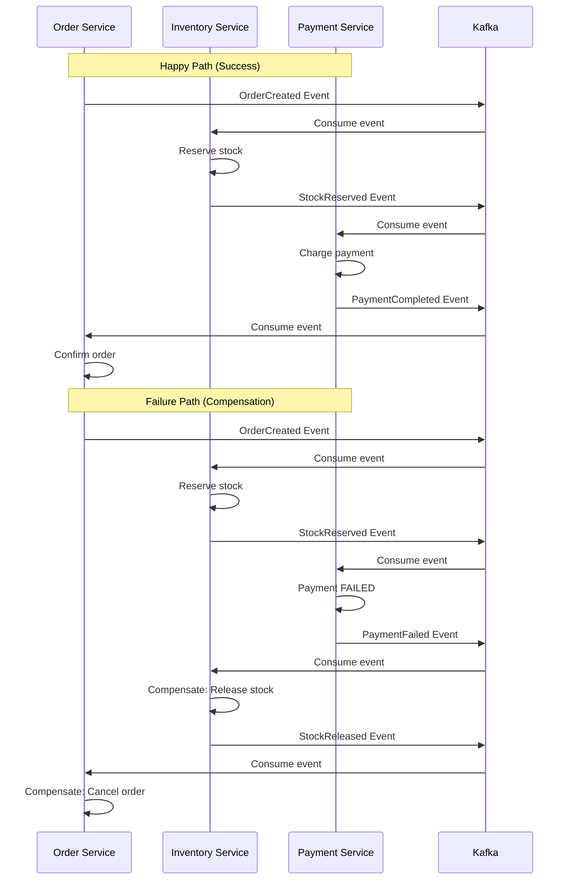
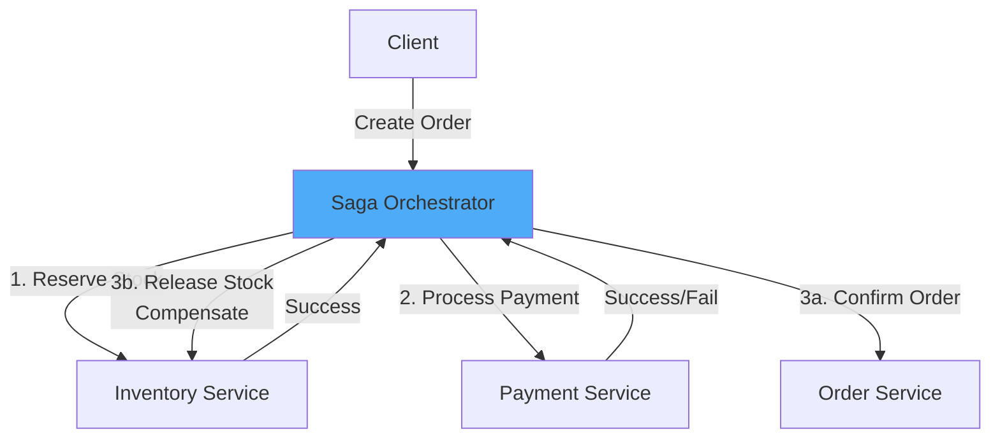

# Saga Pattern - Distributed Transaction

## For Phan6_Distributed_System.md (Section 6.3.3)

---

## 6.3.3. ⭐ Saga Pattern - Production Implementation

### What is Saga?

Saga là pattern để handle distributed transactions bằng cách chia transaction lớn thành **nhiều local transactions**, mỗi transaction có **compensating action** để rollback nếu cần.

**Khác với TCC:**
- **TCC**: Reserve → Confirm/Cancel (2 phases)
- **Saga**: Execute → Compensate if needed (event-driven)

### Two Approaches

#### 1. Choreography-based Saga (Event-driven)

**Concept:** Mỗi service publish events, các service khác lắng nghe và react



**Implementation:**

**Order Service:**
```java
@Service
public class OrderService {
    
    @Autowired
    private OrderDao orderDao;
    
    @Autowired
    private KafkaTemplate<String, OrderEvent> kafkaTemplate;
    
    /**
     * Step 1: Create order and publish event
     */
    @Transactional
    public Long createOrder(OrderRequest request) {
        // Create order with PENDING status
        Order order = new Order();
        order.setUserId(request.getUserId());
        order.setProductId(request.getProductId());
        order.setQuantity(request.getQuantity());
        order.setAmount(request.getAmount());
        order.setStatus("PENDING");
        order.setSagaId(UUID.randomUUID().toString());
        orderDao.insert(order);
        
        // Publish event
        OrderCreatedEvent event = new OrderCreatedEvent();
        event.setSagaId(order.getSagaId());
        event.setOrderId(order.getId());
        event.setProductId(order.getProductId());
        event.setQuantity(order.getQuantity());
        event.setAmount(order.getAmount());
        
        kafkaTemplate.send("order-created", event);
        
        return order.getId();
    }
    
    /**
     * Listen to PaymentCompleted event → Confirm order
     */
    @KafkaListener(topics = "payment-completed")
    @Transactional
    public void onPaymentCompleted(PaymentCompletedEvent event) {
        Order order = orderDao.findBySagaId(event.getSagaId());
        if (order == null) {
            log.warn("Order not found for saga: {}", event.getSagaId());
            return;
        }
        
        // Already confirmed?
        if ("CONFIRMED".equals(order.getStatus())) {
            return;  // Idempotency
        }
        
        // Confirm order
        order.setStatus("CONFIRMED");
        order.setConfirmTime(new Date());
        orderDao.update(order);
        
        log.info("Order confirmed: {}", order.getId());
    }
    
    /**
     * Listen to StockReserveFailed or PaymentFailed → Compensate
     */
    @KafkaListener(topics = {"stock-reserve-failed", "payment-failed"})
    @Transactional
    public void onSagaFailed(SagaFailedEvent event) {
        Order order = orderDao.findBySagaId(event.getSagaId());
        if (order == null) {
            return;
        }
        
        // Already cancelled?
        if ("CANCELLED".equals(order.getStatus())) {
            return;  // Idempotency
        }
        
        // Compensate: Cancel order
        order.setStatus("CANCELLED");
        order.setReason(event.getReason());
        order.setCancelTime(new Date());
        orderDao.update(order);
        
        log.info("Order cancelled (compensation): {}", order.getId());
    }
}
```

**Inventory Service:**
```java
@Service
public class InventoryService {
    
    @Autowired
    private InventoryDao inventoryDao;
    
    @Autowired
    private SagaStateDao sagaStateDao;
    
    @Autowired
    private KafkaTemplate<String, InventoryEvent> kafkaTemplate;
    
    /**
     * Listen to OrderCreated → Reserve stock
     */
    @KafkaListener(topics = "order-created")
    @Transactional
    public void onOrderCreated(OrderCreatedEvent event) {
        String sagaId = event.getSagaId();
        
        // Check idempotency
        if (sagaStateDao.exists(sagaId, "STOCK_RESERVED")) {
            return;  // Already processed
        }
        
        try {
            // Reserve stock
            Inventory inventory = inventoryDao.selectForUpdate(event.getProductId());
            
            if (inventory.getAvailable() < event.getQuantity()) {
                // Insufficient stock → Publish failure event
                StockReserveFailedEvent failEvent = new StockReserveFailedEvent();
                failEvent.setSagaId(sagaId);
                failEvent.setReason("Insufficient stock");
                kafkaTemplate.send("stock-reserve-failed", failEvent);
                return;
            }
            
            // Reserve
            inventory.setAvailable(inventory.getAvailable() - event.getQuantity());
            inventory.setReserved(inventory.getReserved() + event.getQuantity());
            inventoryDao.update(inventory);
            
            // Save saga state
            sagaStateDao.insert(new SagaState(sagaId, "STOCK_RESERVED", event));
            
            // Publish success event
            StockReservedEvent successEvent = new StockReservedEvent();
            successEvent.setSagaId(sagaId);
            successEvent.setProductId(event.getProductId());
            successEvent.setQuantity(event.getQuantity());
            kafkaTemplate.send("stock-reserved", successEvent);
            
        } catch (Exception e) {
            log.error("Reserve stock failed", e);
            
            StockReserveFailedEvent failEvent = new StockReserveFailedEvent();
            failEvent.setSagaId(sagaId);
            failEvent.setReason(e.getMessage());
            kafkaTemplate.send("stock-reserve-failed", failEvent);
        }
    }
    
    /**
     * Listen to PaymentFailed → Compensate (release stock)
     */
    @KafkaListener(topics = "payment-failed")
    @Transactional
    public void onPaymentFailed(PaymentFailedEvent event) {
        String sagaId = event.getSagaId();
        
        // Check if stock was reserved
        SagaState state = sagaStateDao.find(sagaId, "STOCK_RESERVED");
        if (state == null) {
            return;  // Not reserved, nothing to compensate
        }
        
        // Check idempotency
        if (sagaStateDao.exists(sagaId, "STOCK_RELEASED")) {
            return;  // Already compensated
        }
        
        // Compensate: Release stock
        OrderCreatedEvent originalEvent = (OrderCreatedEvent) state.getData();
        
        Inventory inventory = inventoryDao.selectForUpdate(originalEvent.getProductId());
        inventory.setAvailable(inventory.getAvailable() + originalEvent.getQuantity());
        inventory.setReserved(inventory.getReserved() - originalEvent.getQuantity());
        inventoryDao.update(inventory);
        
        // Save compensation state
        sagaStateDao.insert(new SagaState(sagaId, "STOCK_RELEASED", event));
        
        // Publish event
        StockReleasedEvent releaseEvent = new StockReleasedEvent();
        releaseEvent.setSagaId(sagaId);
        kafkaTemplate.send("stock-released", releaseEvent);
        
        log.info("Stock released (compensation) for saga: {}", sagaId);
    }
}
```

**Payment Service:**
```java
@Service
public class PaymentService {
    
    @Autowired
    private PaymentGateway paymentGateway;
    
    @Autowired
    private SagaStateDao sagaStateDao;
    
    @Autowired
    private KafkaTemplate<String, PaymentEvent> kafkaTemplate;
    
    /**
     * Listen to StockReserved → Process payment
     */
    @KafkaListener(topics = "stock-reserved")
    @Transactional
    public void onStockReserved(StockReservedEvent event) {
        String sagaId = event.getSagaId();
        
        // Check idempotency
        if (sagaStateDao.exists(sagaId, "PAYMENT_COMPLETED")) {
            return;
        }
        
        try {
            // Get original order info
            SagaState orderState = sagaStateDao.find(sagaId, "ORDER_CREATED");
            OrderCreatedEvent orderEvent = (OrderCreatedEvent) orderState.getData();
            
            // Call payment gateway
            PaymentResult result = paymentGateway.charge(
                orderEvent.getUserId(),
                orderEvent.getAmount()
            );
            
            if (result.isSuccess()) {
                // Payment success
                sagaStateDao.insert(new SagaState(sagaId, "PAYMENT_COMPLETED", event));
                
                PaymentCompletedEvent successEvent = new PaymentCompletedEvent();
                successEvent.setSagaId(sagaId);
                successEvent.setTransactionId(result.getTransactionId());
                kafkaTemplate.send("payment-completed", successEvent);
                
            } else {
                // Payment failed
                PaymentFailedEvent failEvent = new PaymentFailedEvent();
                failEvent.setSagaId(sagaId);
                failEvent.setReason(result.getErrorMessage());
                kafkaTemplate.send("payment-failed", failEvent);
            }
            
        } catch (Exception e) {
            log.error("Payment processing failed", e);
            
            PaymentFailedEvent failEvent = new PaymentFailedEvent();
            failEvent.setSagaId(sagaId);
            failEvent.setReason(e.getMessage());
            kafkaTemplate.send("payment-failed", failEvent);
        }
    }
}
```

---

#### 2. Orchestration-based Saga (Centralized Coordinator)

**Concept:** Có một Saga Orchestrator điều phối toàn bộ flow



**Implementation:**

**Saga Orchestrator:**
```java
@Service
public class OrderSagaOrchestrator {
    
    @Autowired
    private InventoryService inventoryService;
    
    @Autowired
    private PaymentService paymentService;
    
    @Autowired
    private OrderService orderService;
    
    @Autowired
    private SagaStateDao sagaStateDao;
    
    /**
     * Main saga execution
     */
    public SagaResult executeOrderSaga(OrderRequest request) {
        String sagaId = UUID.randomUUID().toString();
        SagaContext context = new SagaContext(sagaId);
        
        try {
            // Step 1: Create order (PENDING)
            Long orderId = orderService.createPendingOrder(request, sagaId);
            context.setOrderId(orderId);
            sagaStateDao.updateState(sagaId, "ORDER_CREATED");
            
            // Step 2: Reserve inventory
            boolean stockReserved = inventoryService.reserveStock(
                request.getProductId(),
                request.getQuantity(),
                sagaId
            );
            
            if (!stockReserved) {
                // Step 2 failed → Compensate Step 1
                return compensate(context, "INVENTORY_RESERVE_FAILED");
            }
            
            context.setStockReserved(true);
            sagaStateDao.updateState(sagaId, "STOCK_RESERVED");
            
            // Step 3: Process payment
            PaymentResult paymentResult = paymentService.processPayment(
                request.getUserId(),
                request.getAmount(),
                sagaId
            );
            
            if (!paymentResult.isSuccess()) {
                // Step 3 failed → Compensate Step 2, 1
                return compensate(context, "PAYMENT_FAILED");
            }
            
            context.setPaymentCompleted(true);
            sagaStateDao.updateState(sagaId, "PAYMENT_COMPLETED");
            
            // Step 4: Confirm order
            orderService.confirmOrder(orderId, sagaId);
            sagaStateDao.updateState(sagaId, "ORDER_CONFIRMED");
            
            return SagaResult.success(orderId);
            
        } catch (Exception e) {
            log.error("Saga execution failed", e);
            return compensate(context, e.getMessage());
        }
    }
    
    /**
     * Compensation logic (reverse order)
     */
    private SagaResult compensate(SagaContext context, String reason) {
        log.warn("Compensating saga: {}, reason: {}", context.getSagaId(), reason);
        
        try {
            // Compensate in reverse order
            
            // If payment completed → Refund
            if (context.isPaymentCompleted()) {
                paymentService.refund(context.getSagaId());
                sagaStateDao.updateState(context.getSagaId(), "PAYMENT_REFUNDED");
            }
            
            // If stock reserved → Release
            if (context.isStockReserved()) {
                inventoryService.releaseStock(context.getSagaId());
                sagaStateDao.updateState(context.getSagaId(), "STOCK_RELEASED");
            }
            
            // Cancel order
            if (context.getOrderId() != null) {
                orderService.cancelOrder(context.getOrderId(), reason);
                sagaStateDao.updateState(context.getSagaId(), "ORDER_CANCELLED");
            }
            
            return SagaResult.failed(reason);
            
        } catch (Exception e) {
            log.error("Compensation failed", e);
            // Alert admin for manual intervention
            alertService.sendAlert("Saga compensation failed: " + context.getSagaId());
            return SagaResult.failed("Compensation failed: " + e.getMessage());
        }
    }
}
```

**Inventory Service (Orchestration):**
```java
@Service
public class InventoryService {
    
    public boolean reserveStock(Long productId, Integer quantity, String sagaId) {
        // Same logic as choreography version
        Inventory inventory = inventoryDao.selectForUpdate(productId);
        
        if (inventory.getAvailable() < quantity) {
            return false;
        }
        
        inventory.setAvailable(inventory.getAvailable() - quantity);
        inventory.setReserved(inventory.getReserved() + quantity);
        inventoryDao.update(inventory);
        
        // Save for compensation
        sagaStateDao.insert(new SagaState(sagaId, "STOCK_RESERVED", 
            Map.of("productId", productId, "quantity", quantity)));
        
        return true;
    }
    
    public void releaseStock(String sagaId) {
        SagaState state = sagaStateDao.find(sagaId, "STOCK_RESERVED");
        if (state == null) return;
        
        Map<String, Object> data = (Map<String, Object>) state.getData();
        Long productId = (Long) data.get("productId");
        Integer quantity = (Integer) data.get("quantity");
        
        Inventory inventory = inventoryDao.selectForUpdate(productId);
        inventory.setAvailable(inventory.getAvailable() + quantity);
        inventory.setReserved(inventory.getReserved() - quantity);
        inventoryDao.update(inventory);
    }
}
```

---

### Comparison: Choreography vs Orchestration

| Aspect | Choreography | Orchestration |
|--------|-------------|---------------|
| **Coordination** | Decentralized (events) | Centralized (coordinator) |
| **Complexity** | High (many events) | Low (single place) |
| **Coupling** | Loose coupling | Tight coupling |
| **Debugging** | Hard (distributed logs) | Easy (single log) |
| **Scalability** | High | Medium (coordinator bottleneck) |
| **Use case** | Simple flow, few steps | Complex flow, many steps |
| **Team size** | Large, independent teams | Small team |

---

### Saga vs TCC Comparison

| Aspect | Saga | TCC |
|--------|------|-----|
| **Approach** | Event-driven, eventual consistency | 2-phase commit (Reserve → Confirm/Cancel) |
| **Rollback** | Compensating transactions | Cancel phase |
| **Complexity** | Simple (forward only + compensate) | Complex (3 methods per service) |
| **Performance** | Better (async) | Slower (synchronous confirm) |
| **Consistency** | Eventual consistency | Strong consistency |
| **Best for** | Long-running workflows (hours/days) | Short transactions (seconds) |

**When to use Saga:**
- E-commerce order flow (order → payment → shipping)
- Travel booking (flight + hotel + car)
- Long-running business processes

**When to use TCC:**
- Financial transactions (transfer money)
- Inventory reservation (flash sale)
- Critical operations needing strong consistency

---

This content provides complete Saga pattern implementation for distributed transactions.
