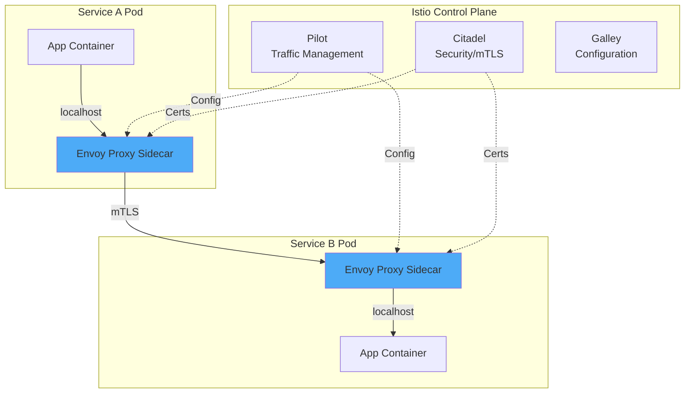
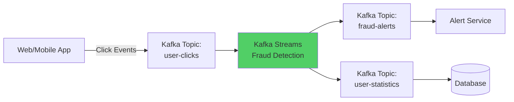
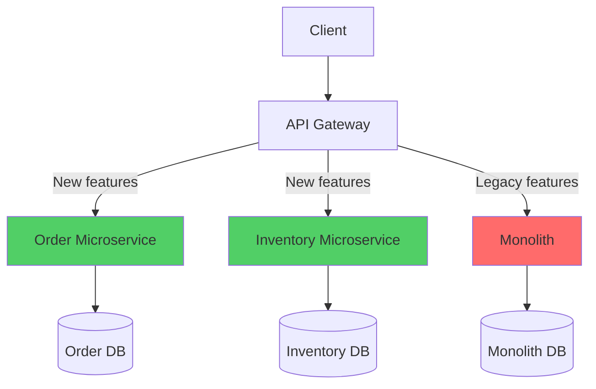

# Additional Missing Content

## For Phan6_Distributed_System.md and Phan9_Microservices.md

---

## Part 1: Service Mesh & API Gateway

### 6.5.3. Service Mesh (Istio)

**What is Service Mesh?**

Service Mesh là infrastructure layer để handle service-to-service communication trong microservices:
- Traffic management (routing, load balancing)
- Security (mTLS, authentication)
- Observability (metrics, logs, traces)

**Architecture:**



**Key Features:**

#### A. Traffic Management

**Canary Deployment:**
```yaml
apiVersion: networking.istio.io/v1alpha3
kind: VirtualService
metadata:
  name: order-service
spec:
  hosts:
  - order-service
  http:
  - match:
    - headers:
        X-Beta-User:
          exact: "true"
    route:
    - destination:
        host: order-service
        subset: v2
      weight: 100
  - route:
    - destination:
        host: order-service
        subset: v1
      weight: 90
    - destination:
        host: order-service
        subset: v2
      weight: 10  # 10% traffic to new version

---
apiVersion: networking.istio.io/v1alpha3
kind: DestinationRule
metadata:
  name: order-service
spec:
  host: order-service
  subsets:
  - name: v1
    labels:
      version: v1
  - name: v2
    labels:
      version: v2
```

**Traffic Shifting (Blue-Green):**
```yaml
apiVersion: networking.istio.io/v1alpha3
kind: VirtualService
metadata:
  name: payment-service
spec:
  hosts:
  - payment-service
  http:
  - route:
    - destination:
        host: payment-service
        subset: blue
      weight: 0     # Old version: 0%
    - destination:
        host: payment-service
        subset: green
      weight: 100   # New version: 100%
```

#### B. Security (mTLS)

**Enable mutual TLS:**
```yaml
apiVersion: security.istio.io/v1beta1
kind: PeerAuthentication
metadata:
  name: default
  namespace: production
spec:
  mtls:
    mode: STRICT  # All traffic must use mTLS
```

**Authorization Policy:**
```yaml
apiVersion: security.istio.io/v1beta1
kind: AuthorizationPolicy
metadata:
  name: order-service-policy
spec:
  selector:
    matchLabels:
      app: order-service
  rules:
  - from:
    - source:
        principals: ["cluster.local/ns/default/sa/api-gateway"]
    to:
    - operation:
        methods: ["POST", "GET"]
        paths: ["/orders/*"]
```

#### C. Observability

**Automatic Metrics:**
```
Istio automatically collects:
- Request rate
- Error rate
- Latency (p50, p90, p99)
- Traffic flow between services

Query with Prometheus:
istio_requests_total
istio_request_duration_milliseconds
```

**Distributed Tracing:**
```java
// Istio automatically propagates trace headers
// App only needs to forward headers:

@GetMapping("/orders/{id}")
public Order getOrder(@PathVariable Long id, @RequestHeader HttpHeaders headers) {
    // Forward trace headers to downstream service
    HttpHeaders forwardHeaders = new HttpHeaders();
    forwardHeaders.set("X-Request-Id", headers.getFirst("X-Request-Id"));
    forwardHeaders.set("X-B3-TraceId", headers.getFirst("X-B3-TraceId"));
    forwardHeaders.set("X-B3-SpanId", headers.getFirst("X-B3-SpanId"));
    
    // Call inventory service
    inventoryService.checkStock(id, forwardHeaders);
    
    return orderDao.getById(id);
}
```

---

### 6.5.4. API Gateway (Kong)

**Purpose:**
- Entry point for all clients
- Authentication & Authorization
- Rate limiting
- Request/Response transformation
- Load balancing

**Kong Architecture:**

```yaml
# Kong configuration
services:
  - name: order-service
    url: http://order-service:8080
    
routes:
  - name: order-route
    service: order-service
    paths:
      - /api/orders
    methods:
      - GET
      - POST
    
plugins:
  # 1. Rate limiting
  - name: rate-limiting
    config:
      minute: 100
      hour: 1000
      policy: redis
      
  # 2. JWT authentication
  - name: jwt
    config:
      secret_is_base64: false
      
  # 3. Request transformation
  - name: request-transformer
    config:
      add:
        headers:
          - X-Gateway-Version:1.0
      remove:
        headers:
          - X-Internal-Secret
          
  # 4. Response transformation
  - name: response-transformer
    config:
      add:
        headers:
          - X-Response-Time:${latency}
```

**Java Client Example:**

```java
@Service
public class OrderClient {
    
    @Value("${kong.gateway.url}")
    private String gatewayUrl;
    
    public Order createOrder(OrderRequest request, String jwtToken) {
        RestTemplate restTemplate = new RestTemplate();
        
        HttpHeaders headers = new HttpHeaders();
        headers.setBearerAuth(jwtToken);
        headers.setContentType(MediaType.APPLICATION_JSON);
        
        HttpEntity<OrderRequest> entity = new HttpEntity<>(request, headers);
        
        // Call through API Gateway (not directly to service)
        ResponseEntity<Order> response = restTemplate.postForEntity(
            gatewayUrl + "/api/orders",
            entity,
            Order.class
        );
        
        return response.getBody();
    }
}
```

---

## Part 2: Real-time Data Processing

### 7.X. Real-time Data Processing with Kafka Streams

**Use Case:** Process user clickstream in real-time to detect fraud

**Architecture:**



**Implementation:**

```java
@Configuration
public class KafkaStreamsConfig {
    
    @Bean
    public StreamsBuilder streamsBuilder() {
        return new StreamsBuilder();
    }
    
    @Bean
    public KafkaStreams kafkaStreams(StreamsBuilder builder) {
        Properties props = new Properties();
        props.put(StreamsConfig.APPLICATION_ID_CONFIG, "fraud-detection-app");
        props.put(StreamsConfig.BOOTSTRAP_SERVERS_CONFIG, "kafka:9092");
        props.put(StreamsConfig.DEFAULT_KEY_SERDE_CLASS_CONFIG, Serdes.String().getClass());
        props.put(StreamsConfig.DEFAULT_VALUE_SERDE_CLASS_CONFIG, Serdes.String().getClass());
        
        // Enable exactly-once semantics
        props.put(StreamsConfig.PROCESSING_GUARANTEE_CONFIG, StreamsConfig.EXACTLY_ONCE_V2);
        
        Topology topology = buildTopology(builder);
        
        KafkaStreams streams = new KafkaStreams(topology, props);
        streams.start();
        
        return streams;
    }
    
    private Topology buildTopology(StreamsBuilder builder) {
        // 1. Read click events
        KStream<String, ClickEvent> clicks = builder
            .stream("user-clicks", Consumed.with(Serdes.String(), clickEventSerde()))
            .selectKey((key, click) -> click.getUserId());  // Re-key by userId
        
        // 2. Count clicks per user in 5-minute window
        KTable<Windowed<String>, Long> clickCounts = clicks
            .groupByKey()
            .windowedBy(TimeWindows.ofSizeWithNoGrace(Duration.ofMinutes(5)))
            .count();
        
        // 3. Detect fraud (> 1000 clicks in 5 min)
        clickCounts
            .toStream()
            .filter((window, count) -> count > 1000)
            .mapValues((window, count) -> new FraudAlert(
                window.key(),
                count,
                window.window().start(),
                window.window().end()
            ))
            .to("fraud-alerts", Produced.with(WindowedSerdes.timeWindowedSerdeFrom(String.class), fraudAlertSerde()));
        
        // 4. Aggregate statistics per user
        KTable<String, UserStats> userStats = clicks
            .groupByKey()
            .aggregate(
                UserStats::new,  // Initializer
                (userId, click, stats) -> {  // Aggregator
                    stats.incrementClickCount();
                    stats.updateLastClickTime(click.getTimestamp());
                    stats.addUrl(click.getUrl());
                    return stats;
                },
                Materialized.with(Serdes.String(), userStatsSerde())
            );
        
        userStats.toStream().to("user-statistics");
        
        return builder.build();
    }
}
```

**Exactly-Once Semantics:**

```java
// Kafka Streams guarantees exactly-once processing:
// 1. Read from input topic
// 2. Process
// 3. Write to output topic
// 4. Commit offset
// → All 4 steps atomic (transactional)

// Example: Deduplication
KStream<String, Order> orders = builder.stream("orders");

KTable<String, Order> deduplicated = orders
    .groupByKey()
    .reduce(
        (oldOrder, newOrder) -> newOrder,  // Keep latest
        Materialized.as("dedup-store")
    );

// Even if same order arrives 10 times → Processed exactly once
```

**Stateful Processing:**

```java
// Maintain state across events
KTable<String, Account> accounts = builder.table("accounts");

KStream<String, Transaction> transactions = builder.stream("transactions");

// Join stream with table
KStream<String, EnrichedTransaction> enriched = transactions.join(
    accounts,
    (transaction, account) -> {
        EnrichedTransaction enriched = new EnrichedTransaction();
        enriched.setTransaction(transaction);
        enriched.setAccountBalance(account.getBalance());
        enriched.setAccountType(account.getType());
        return enriched;
    },
    Joined.with(Serdes.String(), transactionSerde(), accountSerde())
);
```

---

## Part 3: System Migration Strategies

### Case Study: Migrate from Monolith to Microservices

**Scenario:**
- Current: Monolith application (single codebase, single database)
- Target: Microservices (Order Service, Inventory Service, User Service)
- Constraint: Zero downtime, gradual migration

#### Strategy 1: Strangler Fig Pattern (Recommended)

**Concept:** Gradually replace parts of monolith with microservices



**Implementation Phases:**

**Phase 1: Extract Order Service**

```java
// 1. Create new Order Microservice
@RestController
@RequestMapping("/api/v2/orders")
public class OrderController {
    
    @PostMapping
    public Order createOrder(@RequestBody OrderRequest request) {
        // New implementation
        return orderService.create(request);
    }
}

// 2. API Gateway routes new traffic to microservice
// Kong configuration:
routes:
  - name: order-service-v2
    service: order-microservice
    paths:
      - /api/v2/orders
      
  - name: order-service-v1
    service: monolith
    paths:
      - /api/v1/orders
```

**Phase 2: Dual Writes (Data Synchronization)**

```java
@Service
public class OrderService {
    
    @Autowired
    private OrderDao newOrderDao;  // Microservice DB
    
    @Autowired
    private LegacyOrderDao legacyOrderDao;  // Monolith DB
    
    @Transactional
    public Order createOrder(OrderRequest request) {
        // Write to new DB
        Order order = newOrderDao.insert(request);
        
        try {
            // Also write to legacy DB (for backward compatibility)
            legacyOrderDao.insert(order);
        } catch (Exception e) {
            // Log error but don't fail (async retry later)
            log.error("Failed to sync to legacy DB", e);
            syncQueue.add(order);
        }
        
        return order;
    }
}
```

**Phase 3: Gradual Traffic Shifting**

```java
// Use feature flags to gradually shift traffic
@Configuration
public class FeatureFlagConfig {
    
    @Bean
    public FeatureFlag orderServiceFlag() {
        return FeatureFlag.builder()
            .name("use-order-microservice")
            .percentage(10)  // Start with 10% traffic
            .build();
    }
}

@RestController
public class OrderController {
    
    @Autowired
    private FeatureFlag orderServiceFlag;
    
    @PostMapping("/api/orders")
    public Order createOrder(@RequestBody OrderRequest request) {
        if (orderServiceFlag.isEnabled(request.getUserId())) {
            // New microservice
            return orderMicroservice.create(request);
        } else {
            // Legacy monolith
            return legacyOrderService.create(request);
        }
    }
}
```

**Phase 4: Data Migration**

```java
// Batch migrate historical data
@Service
public class DataMigrationService {
    
    @Scheduled(cron = "0 0 2 * * ?")  // Run at 2 AM daily
    public void migrateOrders() {
        int batchSize = 1000;
        int offset = 0;
        
        while (true) {
            // Read from legacy DB
            List<LegacyOrder> legacyOrders = legacyOrderDao.findBatch(offset, batchSize);
            
            if (legacyOrders.isEmpty()) {
                break;
            }
            
            // Transform and write to new DB
            List<Order> newOrders = legacyOrders.stream()
                .map(this::transform)
                .collect(Collectors.toList());
            
            orderDao.batchInsert(newOrders);
            
            offset += batchSize;
            
            log.info("Migrated {} orders", offset);
        }
    }
    
    private Order transform(LegacyOrder legacy) {
        Order order = new Order();
        order.setId(legacy.getId());
        order.setUserId(legacy.getUserId());
        order.setAmount(legacy.getTotalAmount());
        // ... field mapping
        return order;
    }
}
```

**Phase 5: Decommission Monolith**

```bash
# After 100% traffic shifted and validated:
# 1. Stop dual writes
# 2. Remove legacy code
# 3. Delete legacy database (after backup)
# 4. Remove API Gateway routes to monolith
```

#### Strategy 2: Database Migration (Change Data Capture)

**Use Debezium for real-time sync:**

```yaml
# Debezium connector configuration
name: legacy-db-connector
connector.class: io.debezium.connector.mysql.MySqlConnector
database.hostname: legacy-db
database.port: 3306
database.user: debezium
database.password: ${DB_PASSWORD}

# Capture changes from legacy DB
database.include.list: legacy_database
table.include.list: legacy_database.orders

# Stream to Kafka
topic.prefix: legacy

# Consumer reads from Kafka and writes to new DB
```

**Consumer:**

```java
@KafkaListener(topics = "legacy.legacy_database.orders")
public void handleOrderChange(ChangeEvent event) {
    if ("c".equals(event.getOp())) {  // Create
        Order order = parseOrder(event.getAfter());
        orderDao.insert(order);
    } else if ("u".equals(event.getOp())) {  // Update
        Order order = parseOrder(event.getAfter());
        orderDao.update(order);
    } else if ("d".equals(event.getOp())) {  // Delete
        orderDao.delete(event.getBefore().getId());
    }
}
```

### Best Practices for Migration

```
1. Feature Flags: Control rollout percentage
2. Dual Writes: Maintain backward compatibility
3. Shadow Traffic: Test new service with production load
4. Metrics: Compare old vs new performance
5. Rollback Plan: Quick revert if issues
6. Communication: Inform team of migration status

Timeline Example:
Week 1-2: Extract microservice, deploy to staging
Week 3-4: Dual writes, 10% traffic
Week 5-6: 50% traffic, monitor
Week 7-8: 100% traffic
Week 9-10: Data migration
Week 11-12: Decommission monolith
```

---

This content completes the missing sections for Service Mesh, Real-time Processing, and System Migration.
