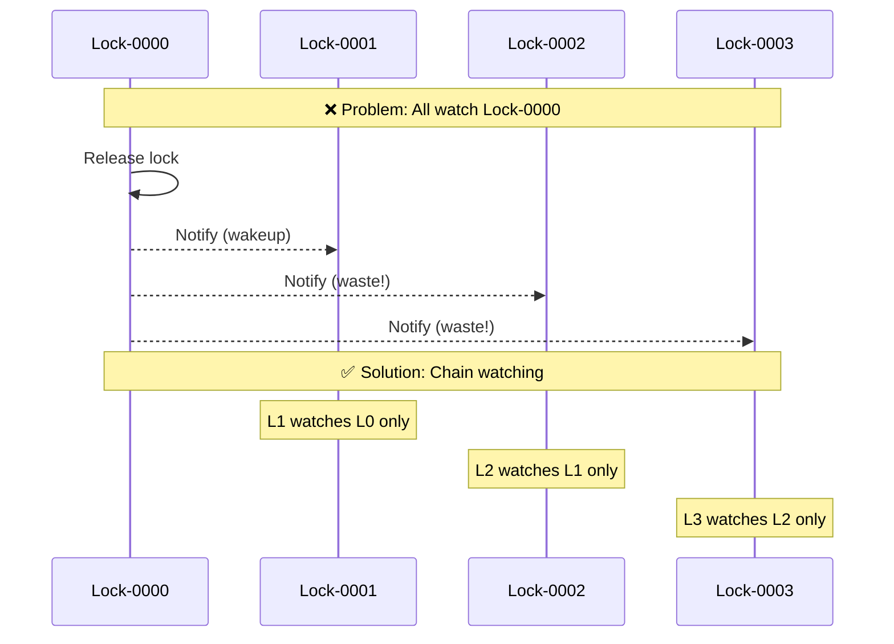
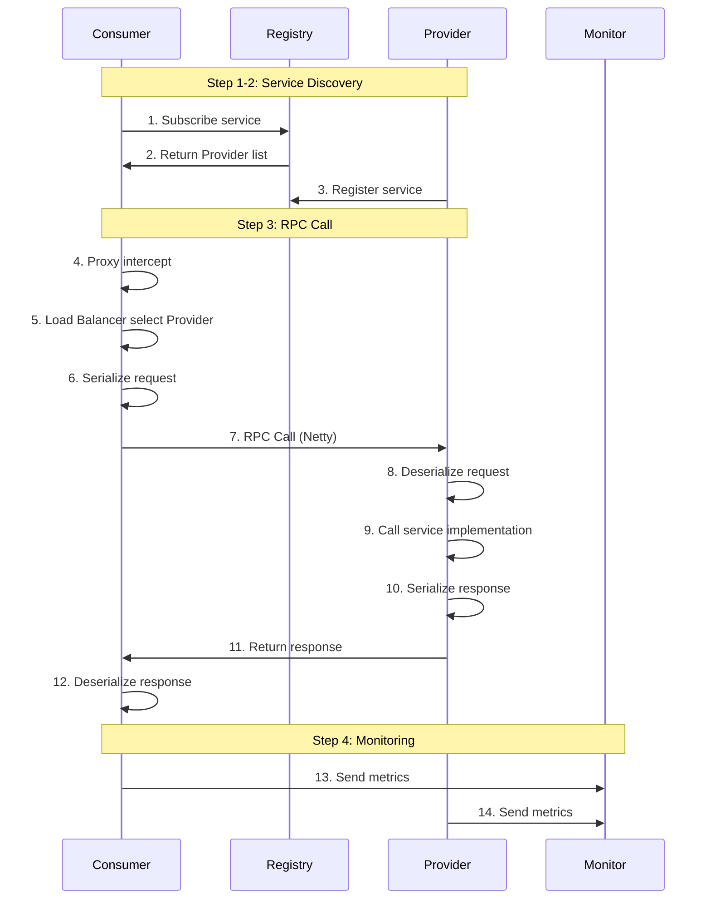
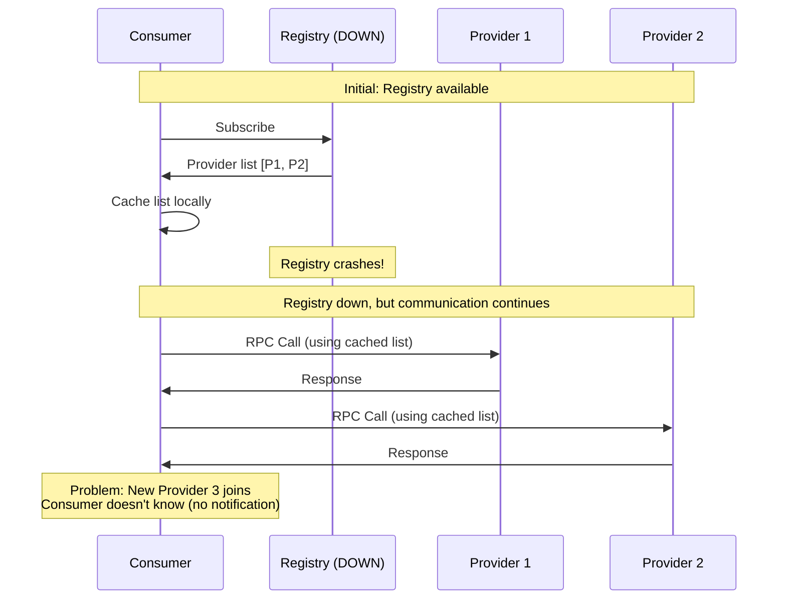
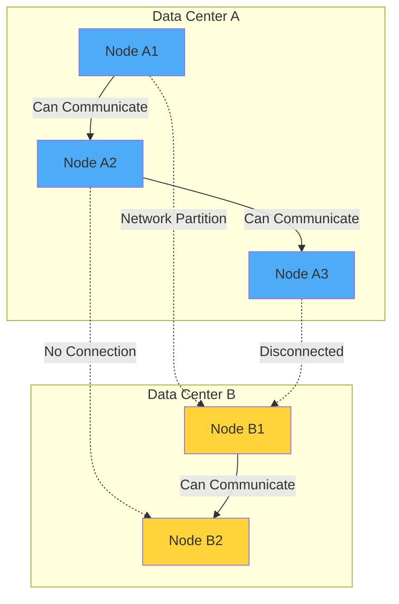

# Part 6: Distributed Systems (Hệ thống phân tán)

## 6.1. Theoretical Basis (Cơ sở lý thuyết)

### 6.1.1. ⭐ CAP Theorem

**CAP Theorem** (Brewer's theorem) khẳng định một hệ thống phân tán **không thể** đồng thời thỏa mãn cả 3 yếu tố:

1.  **Consistency (Tính nhất quán)**: Mọi node đều nhìn thấy cùng một dữ liệu tại cùng một thời điểm. (Đọc ngay sau khi Ghi phải trả về dữ liệu mới nhất).
2.  **Availability (Tính sẵn sàng)**: Mọi request đều nhận được phản hồi (không error), nhưng không đảm bảo dữ liệu mới nhất.
3.  **Partition Tolerance (Khả năng chịu lỗi phân vùng)**: Hệ thống vẫn hoạt động dù mạng giữa các nodes bị đứt (partition).

**Thực tế hệ thống phân tán**: Partition (P) là điều **bắt buộc** phải có (vì mạng không bao giờ tin cậy 100%). Do đó ta chỉ được chọn **CP** hoặc **AP**:

*   **CP (Consistency + Partition Tolerance)**: Chấp nhận hy sinh Availability. Khi có Network Partition, hệ thống sẽ **từ chối request** để đảm bảo dữ liệu không bị sai lệch.
    *   *Ví dụ*: **ZooKeeper**, Etcd, HBase, Redis (Single/Sentinel/Cluster trong một số cấu hình strict).
    *   *Sử dụng*: Hệ thống tài chính, Distributed Lock.
    *   *Trade-off*: Latency tăng (phải chờ quorum), Service unavailable khi mất quorum.
*   **AP (Availability + Partition Tolerance)**: Chấp nhận hy sinh Consistency. Khi có Network Partition, hệ thống vẫn **trả về data cũ** (stale data) để giữ service up.
    *   *Ví dụ*: **Eureka**, Cassandra, DynamoDB, DNS.
    *   *Sử dụng*: Social network feed, E-commerce catalog.
    *   *Trade-off*: Data có thể cũ, conflict resolution cần eventual consistency.

**⭐ Production Scenarios:**

**Scenario 1: ZooKeeper (CP) - Banking System**
```
Setup: 5-node ZooKeeper cluster cho distributed lock
Event: Network partition → 2 nodes vs 3 nodes

Behavior:
- Partition A (2 nodes): Thiểu số → REJECT tất cả writes
  → Client nhận error: "No quorum available"
  → Service degraded: Read-only mode hoặc fail-fast
  
- Partition B (3 nodes): Đa số → CONTINUE accepting writes
  → Đảm bảo consistency (không có split-brain)
  → Latency tăng nhẹ (vì mất 2 nodes)

Result: Availability giảm cho partition A, nhưng data LUÔN consistent
Use case: Banking transfers, Inventory deduction
```

**Scenario 2: Cassandra (AP) - Social Network**
```
Setup: Cassandra cluster cho user timeline
Event: Network partition → Data center US vs EU disconnected

Behavior:
- DC US: Continue serving reads/writes
  → Users vẫn post/read timeline (có thể thấy data cũ)
  
- DC EU: Continue serving reads/writes
  → Users cũng post/read timeline (có thể thấy data cũ)
  
- Conflict: User A post từ US, User B post từ EU về cùng topic
  → Last-write-wins (dựa vào timestamp)
  → Sau khi network recover, auto-merge conflicts

Result: Service luôn available, nhưng có eventual consistency window
Use case: Social feeds, Product catalog, Comment systems
```

**⭐ How to Choose?**

| Yêu cầu | Chọn CP | Chọn AP |
|---------|---------|---------|
| **Data correctness critical** | ✅ Banking, Inventory | ❌ |
| **Availability > Consistency** | ❌ | ✅ Social, Catalog |
| **Can tolerate stale data?** | ❌ No | ✅ Yes (seconds-minutes) |
| **Conflict resolution complex?** | Không cần (strong consistency) | ✅ Cần strategy |

**⭐ Production Problem: Quorum Calculation Error**

**Real Case:**
```java
// ❌ BAD: Tính quorum sai
int totalNodes = 5;
int quorum = totalNodes / 2;  // = 2 (SAI!)

// Nếu có 2 partitions: 2 nodes vs 3 nodes
// Partition A (2 nodes): 2 >= quorum (2) → Think có quorum → Accept writes
// Partition B (3 nodes): 3 >= quorum (2) → Think có quorum → Accept writes
// → Split-brain! 2 partitions cùng accept writes!

// ✅ CORRECT: Phải dùng majority
int quorum = totalNodes / 2 + 1;  // = 3 (ĐÚNG!)

// Bây giờ:
// Partition A (2 nodes): 2 < 3 → No quorum → Reject
// Partition B (3 nodes): 3 >= 3 → Has quorum → Accept
```

**Lesson:** Luôn dùng **strict majority** (`n/2 + 1`), không phải `n/2`!

### 6.1.2. ⭐ BASE Theorem

**BASE** là sự đánh đổi của CAP, ưu tiên **Availability** (AP) và chấp nhận **Eventual Consistency**.

1.  **Basically Available (Cơ bản sẵn sàng)**: Hệ thống vẫn hoạt động khi có lỗi, nhưng có thể giảm performance hoặc tính năng (vd: trang web load chậm hơn, hoặc hiển thị ảnh default).
2.  **Soft state (Trạng thái mềm)**: Trạng thái hệ thống có thể thay đổi ngay cả khi không có input (do quá trình đồng bộ data).
3.  **Eventual Consistency (Tính nhất quán cuối cùng)**: Sau một khoảng thời gian, tất cả các nodes sẽ đồng bộ dữ liệu giống nhau. (Weak consistency).

### 6.1.3. Consensus Algorithms (Thuật toán đồng thuận)

Làm sao để các nodes đồng ý với nhau về một giá trị (vd: Leader election)?

**1. Paxos**
*   Thuật toán đồng thuận đầu tiên và nổi tiếng nhất.
*   Rất phức tạp để hiểu và implement.
*   *Dùng trong*: Google Chubby.

**2. Raft**
*   Được thiết kế để **dễ hiểu** hơn Paxos.
*   Chia vấn đề thành 3 phần: **Leader Election**, **Log Replication**, **Safety**.
*   *Dùng trong*: **Etcd**, **Consul**, **TiKV**.

**3. Gossip Protocol**
*   Giao thức lan truyền tin đồn (như bệnh dịch).
*   Eventual consistency, decentralized.
*   *Dùng trong*: **Cassandra** ring, **Redis Cluster** node discovery.

---

## 6.2. Distributed Lock (Khóa phân tán)

Trong môi trường phân tán (nhiều JVM), `synchronized` hay `ReentrantLock` chỉ có tác dụng trong 1 JVM. Cần cơ chế lock ngoài (External Lock).

### 6.2.1. Yêu cầu của Distributed Lock
1.  **Mutual Exclusion**: Chỉ 1 client giữ khóa tại 1 thời điểm.
2.  **Deadlock Free**: Có cơ chế timeout/lease để tránh lock vĩnh viễn khi client crash.
3.  **Fault Tolerance**: Lock server phải high availability.
4.  **Reentrancy** (Optional): Support khóa lặp lại.

### 6.2.2. MySQL Lock
Dùng `SELECT ... FOR UPDATE` (Pessimistic Locking) hoặc Unique Key.
*   **Ưu điểm**: Dễ hiểu, không cần thêm component.
*   **Nhược điểm**: Performance thấp, Deadlock DB, Single point of failure (nếu DB master chết).

### 6.2.3. ⭐ Redis Lock (AP - Performance)

**Cơ chế cơ bản:**
```bash
# Atomic command: Set if Not Exists + Expire
SET lock_key unique_id NX PX 10000 
```
*   `NX`: Not Exists.
*   `PX 10000`: Expire 10s (Tránh deadlock).
*   `unique_id`: Dùng để check khi release lock (tránh xóa nhầm lock của người khác).

**Vấn đề Expiration**:
*   Nếu task chạy quá 10s, lock tự nhả → Client khác lấy lock → **2 Clients cùng chạy** (Mất Mutual Exclusion)!

**⭐ Production Problem 1: Clock Drift Race Condition**

```java
// ❌ Problem: Server clock drift
// Timeline:
// T=0: Client A acquires lock, expire = 10_000ms
// T=5000: Server clock +3s drift → Lock expires tại T=7000 (thay vì T=10000)
// T=7000: Lock tự expire (từ góc nhìn server)
// T=7001: Client B acquires lock (Success!)
// T=7500: Client A vẫn đang chạy task (nghĩ lock còn valid)
// → 2 clients cùng chạy → Race condition!

// ✅ Solution: Fencing Token Pattern
public class FencedRedisLock {
    private AtomicLong tokenGenerator = new AtomicLong(0);
    
    public Long acquireLock(String resource) {
        String lockKey = "lock:" + resource;
        long token = tokenGenerator.incrementAndGet();
        
        boolean success = redis.set(lockKey, String.valueOf(token), 
            SetArgs.Builder.nx().px(10000));
        
        return success ? token : null;
    }
    
    // Database/Service phải check token
    public void updateInventory(Long productId, int quantity, Long token) {
        // Check token trước khi update
        Long currentToken = getCurrentToken(productId);
        if (currentToken > token) {
            throw new StaleTokenException("Lock token outdated");
        }
        
        // Safe to update
        inventoryDao.update(productId, quantity);
        saveToken(productId, token);
    }
}
```

**⭐ Production Problem 2: Redlock Algorithm Controversy**

**Martin Kleppmann's Criticism:**
```
Scenario: Redlock cluster với 5 Redis masters (A, B, C, D, E)

Problem:
1. Client 1 acquires lock trên 3 masters (A, B, C) → Success
2. Master C bị GC pause → Lock expires
3. Client 2 acquires lock trên 3 masters (C, D, E) → Success
4. Bây giờ cả Client 1 và Client 2 đều nghĩ có lock!

Martin's conclusion: Redlock không an toàn cho critical paths
→ Nếu cần correctness → Dùng ZooKeeper (CP system)
→ Nếu cần performance → Dùng single Redis + monitoring
```

**Recommendation:**
- **CP required (Financial, Inventory)**: ZooKeeper/Etcd
- **High performance (E-commerce features)**: Redisson + Single Redis
- **Avoid Redlock**: Complexity cao, benefit thấp

**Giải pháp: Redisson Framework (Watchdog)**
*   Redisson tạo 1 luồng daemon (**Watchdog**) chạy ngầm.
*   Mặc định lock 30s. Cứ mỗi 10s (1/3 time), Watchdog kiểm tra xem client còn sống & giữ lock không.
*   Nếu còn, tự động gia hạn (renew) thêm 30s.
*   Nếu client crash → Watchdog chết → Lock hết hạn sau 30s → Deadlock free.

**Redlock Algorithm** (Cho Redis Cluster):
*   Lấy lock trên N/2 + 1 master nodes.
*   *Tranh cãi*: Martin Kleppmann cho rằng Redlock không an toàn tuyệt đối.

### 6.2.4. ⭐ ZooKeeper Lock (CP - Reliability)

**Cơ chế:**
*   Dùng **Temporary Sequential Node**.
*   Client tạo node con tuần tự `lock-0001`.
*   Kiểm tra nếu mình là số nhỏ nhất (`0001`) → Có Lock.
*   Nếu không (vd min là `0000`), lắng nghe (Watch) node liền trước mình.
*   Khi `0000` xóa (release hoặc crash) → `0001` nhận notif → Có Lock.

**Ưu điểm:**
*   **Reliability cao**: CP system.
*   **No Timeout Issue**: Client crash → Temporary node tự xóa → Lock release ngay. (Tốt hơn Redis phải chờ expire).

**Nhược điểm:**
*   Performance thấp hơn Redis (nhiều Write operations).
*   Phức tạp để maintain ZK Cluster.

**⭐ Production Optimization: Thundering Herd Prevention**



```java
// ✅ Curator Framework implementation (chain watching)
public class ZKDistributedLock {
    public void acquireLock(String lockPath) throws Exception {
        // Create sequential node
        String myNode = zk.create(
            lockPath + "/lock-",
            new byte[0],
            ZooDefs.Ids.OPEN_ACL_UNSAFE,
            CreateMode.EPHEMERAL_SEQUENTIAL
        );
        
        while (true) {
            List<String> children = zk.getChildren(lockPath, false);
            Collections.sort(children);
            
            // Check if I'm the smallest
            if (myNode.endsWith(children.get(0))) {
                // Got lock!
                return;
            }
            
            // ✅ Watch ONLY the node before me (not the smallest)
            String mySeq = myNode.substring(myNode.lastIndexOf('/') + 1);
            int myIndex = children.indexOf(mySeq);
            String watchNode = lockPath + "/" + children.get(myIndex - 1);
            
            CountDownLatch latch = new CountDownLatch(1);
            Stat stat = zk.exists(watchNode, event -> {
                if (event.getType() == Watcher.Event.EventType.NodeDeleted) {
                    latch.countDown();
                }
            });
            
            if (stat != null) {
                latch.await();  // Wait for previous node deletion
            }
            // Loop to re-check
        }
    }
}
```

**Performance Impact:**
- **Before**: All 1000 clients wakeup → Thundering herd
- **After**: Only 1 client wakeups (next in line) → Efficient

### 6.2.5. So sánh Redis vs ZooKeeper Lock

| Tiêu chí | Redis (Redisson) | ZooKeeper (Curator) |
|----------|------------------|---------------------|
| **CAP** | AP (Eventual Consistency) | CP (Strong Consistency) |
| **Performance** | Rất cao (Memory) | Trung bình |
| **Reliability** | Thấp hơn (Có thể mất lock khi Master switch) | Cao hơn (Đảm bảo strict lock) |
| **Deadlock** | Dùng Expiration (TTL) | Dùng Temporary Node (Session) |
| **Use Case** | Hầu hết các cases cần hiệu năng (E-commerce) | Các case cần tuyệt đối chính xác (Finance) |

---

*Kết thúc phần Distributed Lock. Tiếp tục với Distributed Transaction...*

## 6.3. Distributed Transaction (Giao dịch phân tán)

**Vấn đề**: Database chia nhỏ (Sharding/Microservices) → ACID local transaction không còn tác dụng.

### 6.3.1. 2PC (Two-Phase Commit) - Strong Consistency

Giao thức **XA** chuẩn (được MySQL, Oracle hỗ trợ). Có 1 **Coordinator** (người điều phối) và nhiều **Participants** (database nodes).

**Phase 1: Prepare**
*   Coordinator hỏi Participants: "Chuẩn bị commit chưa?"
*   Participants thực hiện transaction, ghi undo/redo log, **giữ lock resource**, nhưng **chưa commit**. Trả lời YES/NO.

**Phase 2: Commit/Rollback**
*   Nếu **Tất cả YES** → Coordinator gửi lệnh **COMMIT**.
*   Nếu **Có 1 NO** (hoặc timeout) → Coordinator gửi lệnh **ROLLBACK**.

**Nhược điểm (Tại sao ít dùng trong Microservices?):**
1.  **Synchronous Blocking**: Hiệu năng rất thấp. Resource bị lock trong suốt 2 phase.
2.  **Single Point of Failure**: Coordinator chết → Participants bị treo lock mãi mãi.
3.  **Data Inconsistency**: Nếu Coordinator gửi Commit, nhưng mạng rớt, chỉ 1 vài node nhận được → Data lệch.

### 6.3.2. ⭐ TCC (Try-Confirm-Cancel) - Application Level

Là biến thể của 2PC nhưng ở tầng **Application Code** (không lock DB resource lâu).

**3 bước:**
1.  **Try**: Kiểm tra và **giữ chỗ/reserve** resource. (VD: Đóng băng tiền, trừ tồn kho tạm).
2.  **Confirm**: Thực sự thực hiện nghiệp vụ. (VD: Trừ tiền thật, xuất kho). *Bước này không nên fail*.
3.  **Cancel**: Hủy bỏ resource đã reserve ở bước Try (nếu Confirm fail). (VD: Hoàn tiền, trả tồn kho).

**Ưu điểm**: Performance tốt hơn 2PC (không lock DB).
**Nhược điểm**: Code phức tạp (phải viết 3 methods cho mỗi action). **Idempotency** là bắt buộc ở Cancel.

### 6.3.3. ⭐ Local Message Table (Reliable Messaging) - Eventual Consistency

Dùng cho mô hình **Asynchronous** (A làm xong, báo B làm, không cần B xong ngay).

**Flow (Ví dụ: Order Service → Inventory Service):**
1.  Order Service:
    *   Trong 1 Transaction DB: Insert Order + Insert Message vào bảng `msg_table` (Local table).
    *   **Atomic**: Đảm bảo Order và Msg cùng thành công hoặc cùng fail.
2.  Background Thread (Order Service) quét `msg_table` → Gửi message sang MQ.
3.  Inventory Service nhận message:
    *   Thực hiện trừ kho.
    *   Gửi Ack lại cho Order Service (để xóa/update status trong `msg_table`).

**Đặc điểm**: Đảm bảo **At-least-once delivery**. Consumer phải xử lý **Idempotency**.

### 6.3.4. ⭐ Saga Pattern (Long Running Transaction)

Dùng cho chuỗi nghiệp vụ dài (Long-lived transaction).
Ví dụ: Book Trip = Book Car → Book Hotel → Book Flight.

**Cơ chế**: Chia transaction lớn thành chuỗi các transaction nhỏ (T1, T2, T3). Mỗi T có một **Compensating Transaction** (C1, C2, C3) để hoàn tác.
*   Chạy: T1 → T2 → T3 (Success).
*   Nếu T2 lỗi: Chạy C2 → C1 (Rollback logic).

**Framework**: **Seata** (Alibaba) rất phổ biến, hỗ trợ AT Mode (Automatic 2PC-like) và Saga Mode.

---

## 6.4. ⭐ Distributed ID Generation

Trong Distributed System (Sharding DB), Primary Key không thể dùng `AUTO_INCREMENT` (vì trùng nhau giữa các DB). Cần Global Unique ID.

### 6.4.1. UUID
*   Java: `UUID.randomUUID().toString()`
*   **Ưu điểm**: Đơn giản, local generation (performance cao).
*   **Nhược điểm**:
    *   Quá dài (36 chars, 128 bit).
    *   **Không sắp xếp** (Not Monotonic increasing) → **Thảm họa cho B+ Tree Index** (gây page split liên tục, insert chậm).

### 6.4.2. Database Sequence (Segment)
*   Dùng 1 DB riêng (hoặc Redis) chỉ để sinh ID (`REPLACE INTO tickets...`).
*   Tối ưu: Lấy theo lô (Segment). Vd Service A lấy 1000 ID (1001-2000) về cache memory dùng dần.
*   **Ưu điểm**: Monotonic increasing (tốt cho Index).
*   **Nhược điểm**: Phụ thuộc DB trung tâm.

### 6.4.3. ⭐ Snowflake Algorithm (Twitter)

Tạo ID số nguyên **64-bit** (Long).

**Cấu trúc (Bit layout):**

```
| 0 (1 bit) | TimeStamp (41 bits) | MachineID (10 bits) | Sequence (12 bits) |
```

1.  **Sign bit (1 bit)**: Luôn là 0 (số dương).
2.  **TimeStamp (41 bits)**: Miliseconds từ epoch custom. Dùng được ~69 năm.
    *   Giúp ID **sắp xếp theo thời gian** (Roughly sorted).
3.  **Machine ID (10 bits)**: 5 bit Datacenter ID + 5 bit Worker ID. Hỗ trợ 1024 nodes.
4.  **Sequence (12 bits)**: Số thứ tự trong 1 milisecond. Hỗ trợ 4096 IDs/ms/node.

**Ưu điểm:**
*   **High Performance**: Gen local, không cần mạng (~triệu ID/s).
*   **Trend Increasing**: Tốt cho B+ Tree Index (MySQL).
*   **Information**: ID chứa thời gian tạo.

**Vấn đề (Clock Rollback)**: Nếu đồng hồ server bị chỉnh lùi → ID có thể trùng.
*   *Fix*: Chờ đồng hồ đuổi kịp hoặc throw exception.

---

## 6.5. Distributed Components (Các thành phần phân tán)

### 6.5.1. ⭐ RPC Framework - Dubbo Chi tiết

**RPC** (Remote Procedure Call): Gọi hàm service khác như gọi hàm local.

#### Dubbo vs gRPC vs REST

| Feature | Dubbo (Alibaba) | gRPC (Google) | Spring Cloud (REST) |
|---------|-----------------|---------------|---------------------|
| **Protocol** | TCP (Long connection) | HTTP/2 (Stream) | HTTP/1.1 (Text) |
| **Serialization** | Hessian2 (Binary) | Protobuf (Binary) | JSON (Text) |
| **Performance** | Cao | Rất cao | Thấp hơn |
| **Language** | Java oriented | Polyglot | Mọi ngôn ngữ |
| **Use case** | Java Microservices | Cross-language | Public API, Web |

#### ⭐ Dubbo Architecture (10 Layers)

Dubbo được thiết kế theo kiến trúc **10 tầng**, mỗi tầng có trách nhiệm riêng:

**1. Service Layer (Tầng Service)**
- Interface layer cho Provider và Consumer
- Định nghĩa service interface

**2. Config Layer (Tầng Config)**
- Quản lý cấu hình Dubbo (XML, Annotation, Properties)
- Service config, Reference config, Registry config

**3. Proxy Layer (Tầng Proxy)**
- **Dynamic Proxy**: Tạo proxy cho Consumer và Provider
- Consumer: Proxy gọi remote service như local method
- Provider: Proxy nhận request → Gọi local service implementation

**4. Registry Layer (Tầng Registry)**
- Service registration và discovery
- Hỗ trợ: ZooKeeper, Nacos, Redis, Multicast

**5. Cluster Layer (Tầng Cluster)**
- **Load Balancing**: Chọn provider instance
- **Fault Tolerance**: Xử lý lỗi (Failover, Failfast, Failsafe...)
- **Router**: Route request đến provider phù hợp

**6. Monitor Layer (Tầng Monitor)**
- Monitor RPC calls: Count, Latency, Success rate
- Thống kê performance

**7. Protocol Layer (Tầng Protocol)**
- Encapsulate RPC calls
- Hỗ trợ: Dubbo protocol, HTTP, REST, gRPC

**8. Exchange Layer (Tầng Exchange)**
- Request-Response pattern
- Sync → Async conversion
- Information exchange

**9. Transport Layer (Tầng Transport)**
- Network transport abstraction
- Hỗ trợ: Netty, Mina, Grizzly
- Long connection management

**10. Serialize Layer (Tầng Serialize)**
- Data serialization/deserialization
- Hỗ trợ: Hessian2, Java, JSON, Kryo, Protobuf

#### ⭐ Dubbo Working Flow

**Step 1: Provider Registration**
```
Provider khởi động → Đăng ký service với Registry (ZooKeeper/Nacos)
Registry lưu: service name, IP:Port, metadata
```

**Step 2: Consumer Subscription**
```
Consumer khởi động → Subscribe service từ Registry
Registry trả về danh sách Provider instances
Consumer cache danh sách locally
```

**Step 3: RPC Call**
```
Consumer gọi method → Proxy intercept
→ Load Balancer chọn Provider instance
→ Serialize request → Network transport (Netty)
→ Provider nhận request → Deserialize
→ Proxy gọi local service implementation
→ Serialize response → Trả về Consumer
```

**Step 4: Monitor Notification**
```
Consumer và Provider đều gửi metrics đến Monitor
(Count, Latency, Success/Failure)
```

**Diagram (Sequence Diagram):**


**Giải thích chi tiết:**

**Step 1-2: Service Discovery (Khám phá dịch vụ)**
- **Consumer khởi động**: Gửi request subscribe đến Registry để đăng ký nhận thông tin về service cần dùng
- **Registry trả về**: Danh sách tất cả Provider instances đang available (IP:Port, metadata)
- **Consumer cache**: Lưu danh sách này vào local cache để dùng sau này
- **Provider đăng ký**: Provider khởi động và đăng ký thông tin của mình với Registry

**Step 3: RPC Call (Gọi hàm từ xa)**
- **Proxy intercept**: Khi Consumer gọi method trên interface, Dynamic Proxy sẽ intercept call này
- **Load Balancer**: Chọn một Provider instance từ danh sách (dựa trên strategy: Random, RoundRobin, LeastActive, ConsistentHash)
- **Serialization**: Chuyển đổi Java object thành byte array (Hessian2, Protobuf, JSON)
- **Network transport**: Gửi request qua network (Netty - NIO, long connection)
- **Provider nhận**: Provider nhận request, deserialize để lấy lại Java object
- **Service execution**: Gọi method thực tế trên service implementation
- **Response**: Serialize kết quả và gửi về Consumer

**Step 4: Monitoring (Giám sát)**
- **Metrics collection**: Cả Consumer và Provider đều gửi metrics đến Monitor
- **Metrics bao gồm**: Số lượng calls, Latency (thời gian xử lý), Success/Failure rate
- **Purpose**: Monitor performance, detect issues, generate alerts

#### ⭐ Registry Down - Can Still Communicate?

**Câu trả lời: CÓ!**

**Lý do:**
- Consumer **cache danh sách Provider** locally khi khởi động
- Registry chỉ cần cho **initial discovery**
- Sau đó Consumer gọi trực tiếp Provider (không qua Registry)
- **Lưu ý**: Nếu Provider mới join hoặc Provider down → Consumer không biết (vì Registry down, không có notification)

**Diagram (Registry Down Scenario):**


**Best Practice:**
- Consumer định kỳ **refresh** danh sách từ Registry (nếu Registry available)
- Hoặc dùng **heartbeat** mechanism để detect Provider down
- **Circuit breaker**: Nếu Registry down quá lâu → Alert để admin biết

#### ⭐ How to Design a RPC Framework?

**Thiết kế RPC framework từ đầu (giống Dubbo):**

**1. Service Registry (ZooKeeper/Nacos)**
```java
// Provider đăng ký
registry.register("com.example.UserService", "192.168.1.100:20880");

// Consumer subscribe
List<String> providers = registry.subscribe("com.example.UserService");
```

**2. Dynamic Proxy (Consumer side)**
```java
// Consumer: Tạo proxy cho interface
UserService userService = Proxy.newProxyInstance(
    UserService.class.getClassLoader(),
    new Class[]{UserService.class},
    new InvocationHandler() {
        @Override
        public Object invoke(Object proxy, Method method, Object[] args) {
            // 1. Load balance: Chọn provider
            String provider = loadBalancer.select(providers);
            
            // 2. Serialize request
            byte[] request = serializer.serialize(method, args);
            
            // 3. Network call (Netty)
            byte[] response = nettyClient.send(provider, request);
            
            // 4. Deserialize response
            return serializer.deserialize(response, method.getReturnType());
        }
    }
);
```

**3. Server Handler (Provider side)**
```java
// Provider: Netty server handler
public class RpcServerHandler extends ChannelInboundHandlerAdapter {
    @Override
    public void channelRead(ChannelHandlerContext ctx, Object msg) {
        // 1. Deserialize request
        RpcRequest request = serializer.deserialize(msg);
        
        // 2. Reflect: Gọi service implementation
        Object service = serviceMap.get(request.getServiceName());
        Method method = service.getClass().getMethod(
            request.getMethodName(), 
            request.getParameterTypes()
        );
        Object result = method.invoke(service, request.getArgs());
        
        // 3. Serialize response
        byte[] response = serializer.serialize(result);
        
        // 4. Send back
        ctx.writeAndFlush(response);
    }
}
```

**4. Load Balancing**
```java
public interface LoadBalancer {
    String select(List<String> providers);
}

// Random with weight
public class RandomLoadBalancer implements LoadBalancer {
    @Override
    public String select(List<String> providers) {
        // Weighted random selection
        return providers.get(random.nextInt(providers.size()));
    }
}
```

**5. Serialization**
```java
public interface Serializer {
    byte[] serialize(Object obj);
    <T> T deserialize(byte[] data, Class<T> clazz);
}

// Hessian2 implementation
public class HessianSerializer implements Serializer {
    // Use Hessian2 library
}
```

**Tóm tắt thiết kế:**
1. **Registry**: Service discovery
2. **Proxy**: Dynamic proxy cho Consumer
3. **Network**: Netty cho transport
4. **Serialization**: Hessian2/Protobuf
5. **Load Balancing**: Random/RoundRobin/ConsistentHash
6. **Fault Tolerance**: Retry, Failover

#### ⭐ Dubbo Load Balancing Strategies (4 Strategies)

**1. RandomLoadBalance (Mặc định - Khuyến nghị)**

**Cơ chế**: Random selection với **weighted random**.

**Algorithm:**
- Servers: `[A, B, C]` với weights: `[5, 3, 2]` (tổng = 10)
- Tạo coordinate: `[0, 5)` → A, `[5, 8)` → B, `[8, 10)` → C
- Random số `[0, 10)` → Rơi vào interval nào → Chọn server đó

**Ví dụ:**
- Random = 3 → Rơi vào `[0, 5)` → Chọn A
- Random = 7 → Rơi vào `[5, 8)` → Chọn B
- Random = 9 → Rơi vào `[8, 10)` → Chọn C

**Ưu điểm**: 
- Server có weight cao → Nhận nhiều traffic hơn
- Phân tải tốt, đơn giản

**Configuration:**
```xml
<dubbo:service interface="..." loadbalance="random" />
<!-- Hoặc set weight cho từng provider -->
<dubbo:provider weight="200" />
```

**2. RoundRobinLoadBalance**

**Cơ chế**: Luân phiên tuần tự, có thể weighted.

**Vấn đề**: Nếu servers có performance khác nhau → Server yếu bị quá tải.

**Solution**: Set weight cho server yếu thấp hơn.

**Ví dụ thực tế:**
- 2 servers: 8-core 16GB (weight=4), 1 server: 4-core 8GB (weight=2)
- Traffic phân bổ: 4:4:2 (thay vì 1:1:1)

**Configuration:**
```xml
<dubbo:service loadbalance="roundrobin" />
```

**3. LeastActiveLoadBalance**

**Cơ chế**: Chọn server có **active calls ít nhất** (đang xử lý ít requests nhất).

**Algorithm:**
- Mỗi server có counter `active` (số requests đang xử lý)
- Request đến → `active++`
- Request xong → `active--`
- Chọn server có `active` nhỏ nhất

**Ưu điểm**: 
- Server nhanh (xử lý nhanh) → `active` giảm nhanh → Nhận nhiều requests hơn
- Tự động điều chỉnh theo performance

**Use case**: Khi servers có performance khác nhau.

**4. ConsistentHashLoadBalance**

**Cơ chế**: **Consistent Hashing** - Cùng parameters → Cùng server.

**Algorithm:**
- Hash request parameters (ví dụ: `userId`) → Chọn server trên hash ring
- **Virtual nodes**: Mỗi server có nhiều virtual nodes trên ring

**Ưu điểm**:
- **Sticky session**: User luôn vào cùng server (cache local)
- Server down → Chỉ ảnh hưởng một phần traffic (không phải tất cả)

**Use case**: 
- Cần **session stickiness**
- Cache data trên server (user data cached locally)

**Configuration:**
```xml
<dubbo:service loadbalance="consistenthash" />
```

#### ⭐ Dubbo Cluster Fault Tolerance Strategies (6 Strategies)

**1. Failover Cluster (Mặc định)**

**Cơ chế**: **Fail → Retry trên server khác**.

**Use case**: **Read operations** (idempotent).

**Configuration:**
```xml
<!-- Retry 2 lần (tổng cộng 3 lần) -->
<dubbo:service retries="2" />

<!-- Hoặc cho từng method -->
<dubbo:method name="getUser" retries="2" />
```

**Flow:**
```
Request → Server A (fail) → Retry Server B (fail) → Retry Server C (success)
```

**2. Failfast Cluster**

**Cơ chế**: **Fail ngay lập tức, không retry**.

**Use case**: **Non-idempotent write operations** (ví dụ: Insert order).

**Lý do**: Retry có thể gây duplicate (insert 2 lần).

**Configuration:**
```xml
<dubbo:service cluster="failfast" />
```

**3. Failsafe Cluster**

**Cơ chế**: **Fail → Ignore, return null/default**.

**Use case**: **Non-critical operations** (ví dụ: Logging, Statistics).

**Configuration:**
```xml
<dubbo:service cluster="failsafe" />
```

**4. Failback Cluster**

**Cơ chế**: **Fail → Record request → Retry sau (background)**.

**Use case**: **Write to message queue** (có thể retry sau).

**Flow:**
```
Request → Server A (fail) → Save to retry queue → Background retry later
```

**Configuration:**
```xml
<dubbo:service cluster="failback" />
```

**5. Forking Cluster**

**Cơ chế**: **Parallel call nhiều servers → Return kết quả đầu tiên**.

**Use case**: **Real-time read operations** (latency critical).

**Trade-off**: **Waste resources** (gọi nhiều servers nhưng chỉ dùng 1 kết quả).

**Configuration:**
```xml
<dubbo:service cluster="forking" forks="2" />
<!-- forks="2": Gọi song song 2 servers -->
```

**6. Broadcast Cluster**

**Cơ chế**: **Call tất cả servers → Nếu 1 server fail → Fail**.

**Use case**: **Notify all providers** (ví dụ: Clear cache, Update config).

**Configuration:**
```xml
<dubbo:service cluster="broadcast" />
```

#### ⭐ Dubbo Dynamic Proxy

**Cơ chế**: Dubbo dùng **Javassist** để generate bytecode động, tạo proxy class.

**Tại sao không dùng JDK Proxy?**
- JDK Proxy chỉ support **interface**
- Javassist support cả **class** (CGLIB-like)

**Configuration:**
```xml
<!-- Mặc định: javassist -->
<dubbo:service proxy="javassist" />

<!-- Hoặc dùng jdk (chỉ interface) -->
<dubbo:service proxy="jdk" />
```

**SPI Extension**: Có thể implement custom proxy strategy.

### 6.5.2. API Gateway (Zuul / Spring Cloud Gateway)

**Vai trò:** "Người gác cổng" duy nhất cho hệ thống.

1.  **Routing**: Route request đến đúng service (`/user/**` → User Service).
2.  **Filtering**: Authentication, Logging, CORS.
3.  **Rate Limiting**: Giới hạn request/s (Token Bucket).
4.  **Protocol Conversion**: HTTP → RPC.

### 6.5.3. Config Center (Apollo / Nacos)

Quản lý cấu hình tập trung, thay vì sửa file `application.properties` và restart từng server.

**Tính năng**:
*   **Hot Refresh**: Đẩy config mới xuống server ngay lập tức (không restart).
*   **Environment**: Dev, Test, Prod.
*   **Versioning / Rollback**.

### 6.5.4. Service Discovery (Eureka / Nacos / Zookeeper)

Registry để các services tìm thấy nhau (IP:Port).

*   **Eureka (AP)**: Peer-to-peer. Client cache list services. Server chết không sao.
*   **ZooKeeper (CP)**: Leader-Follower. Server chết phải elect leader mới (downtime ngắn).
*   **Nacos (AP/CP)**: Support cả 2 mode. Rất phổ biến hiện nay.

---

## 6.6. ⭐ Common Problems in Distributed Systems & Solutions (Các vấn đề thường gặp & Giải pháp)

### 6.6.1. ⭐ Network Partitions (Phân vùng mạng)

**Vấn đề:**
- Network bị chia cắt → Một số nodes không thể giao tiếp với nhau
- **Ví dụ**: Data center A và B mất kết nối

**Diagram (Network Partition):**


**Hậu quả:**
- **Split-brain**: 2 nhóm nodes đều nghĩ mình là leader
- **Data inconsistency**: Mỗi partition có data khác nhau
- **Service unavailable**: Một số services không thể gọi nhau

**Giải thích chi tiết:**

**Network Partition xảy ra khi:**
- **Network failure**: Router/switch bị lỗi
- **Data center isolation**: Data center A và B mất kết nối
- **Firewall rules**: Firewall block traffic giữa một số nodes
- **Network congestion**: Network quá tải → Timeout → Nodes nghĩ nhau down

**Impact:**
- **Partition A** (3 nodes): Có thể giao tiếp với nhau, nhưng không thể giao tiếp với Partition B
- **Partition B** (2 nodes): Có thể giao tiếp với nhau, nhưng không thể giao tiếp với Partition A
- **Result**: 2 partitions hoạt động độc lập → Data inconsistency

**Giải pháp:**

**1. Quorum-based Decision (CP System)**
```
Total nodes: 5
Quorum: 3 (majority)
→ Chỉ partition có ≥3 nodes mới được serve requests
→ Partition <3 nodes → Reject requests (sacrifice Availability)
```

**2. Last-Write-Wins (AP System)**
```
- Mỗi partition tiếp tục serve requests
- Khi network recover → Merge conflicts
- Dùng timestamp → Last write wins
```

**3. Conflict-free Replicated Data Types (CRDTs)**
```
- Data structures tự động merge conflicts
- Ví dụ: Counter, Set, Map
- Không cần conflict resolution
```

**Best Practice:**
- **CP systems** (ZooKeeper, etcd): Quorum-based, reject minority partition
- **AP systems** (Cassandra, DynamoDB): Last-write-wins, eventual consistency

### 6.6.2. ⭐ Split-Brain Problem (Vấn đề chia tách não)

**Vấn đề:**
- Network partition → 2 nhóm nodes đều elect leader riêng
- **2 leaders cùng tồn tại** → Data inconsistency, conflicts

**Ví dụ:**
```
Cluster: [Node1, Node2, Node3, Node4, Node5]
Network partition:
  Partition A: [Node1, Node2] → Elect Node1 as Leader
  Partition B: [Node3, Node4, Node5] → Elect Node3 as Leader
→ 2 Leaders! → Split-brain!
```

**Hậu quả:**
- **Data corruption**: 2 leaders cùng write → Conflicts
- **Service confusion**: Clients gọi 2 leaders khác nhau → Inconsistent results

**Giải pháp:**

**1. Quorum (Majority Vote)**
```
Total: 5 nodes
Quorum: 3 (majority)

Partition A (2 nodes): < Quorum → Cannot elect leader → Reject writes
Partition B (3 nodes): ≥ Quorum → Can elect leader → Accept writes
```

**2. Fencing (Cô lập)**
```
- Chỉ partition có quorum mới được access shared resources
- Partition thiểu số bị "fence out" (cô lập)
- Ví dụ: Shared storage, Database
```

**3. STONITH (Shoot The Other Node In The Head)**
```
- Khi detect split-brain → Force shutdown partition thiểu số
- Đảm bảo chỉ 1 partition active
- Dùng trong High Availability clusters
```

**Implementation (ZooKeeper):**
```java
// ZooKeeper tự động handle split-brain
// Chỉ partition có quorum mới serve requests
// Partition thiểu số → Reject requests
```

### 6.6.3. ⭐ Clock Synchronization (Đồng bộ đồng hồ)

**Vấn đề:**
- Mỗi server có đồng hồ riêng → **Clock drift** (lệch thời gian)
- **Ví dụ**: Server A: 10:00:00, Server B: 10:00:05 (lệch 5 giây)

**Hậu quả:**
- **Event ordering**: Không biết event nào xảy ra trước
- **Timestamp conflicts**: 2 events có timestamp giống nhau
- **Distributed transactions**: Khó xác định thứ tự

**Giải pháp:**

**1. NTP (Network Time Protocol)**
```
- Sync clocks với NTP servers
- Accuracy: ±10ms (local network), ±100ms (internet)
- Best practice: Sync với multiple NTP servers
```

**2. Logical Clocks (Lamport Timestamps)**
```
- Không dùng physical time
- Dùng logical counter
- Mỗi event tăng counter
- Preserve causality (quan hệ nhân quả)
```

**3. Vector Clocks**
```
- Mỗi node có vector [node1, node2, node3]
- Track causality giữa tất cả nodes
- Phát hiện concurrent events
```

**4. Hybrid Logical Clocks (HLC)**
```
- Kết hợp physical time + logical counter
- Best of both worlds
- Dùng trong MongoDB, CockroachDB
```

**Example (Lamport Timestamps):**
```java
public class LamportClock {
    private long counter = 0;
    
    public long tick() {
        return ++counter;
    }
    
    public long update(long receivedTimestamp) {
        counter = Math.max(counter, receivedTimestamp) + 1;
        return counter;
    }
}
```

### 6.6.4. ⭐ Cascading Failures (Lỗi dây chuyền)

**Vấn đề:**
- Service A down → Service B retry nhiều → Service B overload → Service B down
- **Domino effect**: Lỗi lan truyền qua toàn bộ system

**Ví dụ:**
```
Database slow → API Service retry → API Service overload → 
→ API Service down → Frontend retry → Frontend overload → 
→ Frontend down → User experience bad
```

**Giải pháp:**

**1. Circuit Breaker (Ngắt mạch)**
```java
// Hystrix / Resilience4j
CircuitBreaker circuitBreaker = CircuitBreaker.of("serviceA", 
    CircuitBreakerConfig.custom()
        .failureRateThreshold(50)  // 50% failures → Open
        .waitDurationInOpenState(Duration.ofSeconds(30))  // Wait 30s
        .build());

// Call service
Supplier<String> supplier = () -> callServiceA();
String result = circuitBreaker.executeSupplier(supplier);
```

**2. Bulkhead Pattern (Ngăn cách)**
```
- Chia resources thành pools riêng
- Failure ở pool này không ảnh hưởng pool kia
- Ví dụ: Thread pools riêng cho từng service
```

**3. Rate Limiting**
```
- Giới hạn số requests/second
- Prevent overload
- Token Bucket, Sliding Window
```

**4. Timeout & Retry với Exponential Backoff**
```java
// Exponential backoff: 1s → 2s → 4s → 8s
long delay = Math.min(1000 * (1 << retryCount), 10000);
Thread.sleep(delay);
```

**5. Graceful Degradation**
```
- Khi service down → Return cached data hoặc default values
- Service vẫn hoạt động (với tính năng giảm)
```

### 6.6.5. ⭐ Data Consistency Issues (Vấn đề nhất quán dữ liệu)

**Vấn đề:**
- **Read-after-write inconsistency**: Write vào Node A, Read từ Node B → Không thấy data mới
- **Stale reads**: Đọc data cũ (chưa được replicate)

**Ví dụ:**
```
User writes post → Master DB
User reads post → Slave DB (chưa replicate) → Không thấy post!
```

**Giải pháp:**

**1. Read-Your-Writes Consistency**
```java
// Route reads từ same node đã write
String userId = getCurrentUserId();
String shard = getShardForUser(userId);
// Read từ cùng shard đã write
```

**2. Monotonic Reads**
```
- User đọc version N → Lần sau không được đọc version < N
- Đảm bảo không "lùi thời gian"
```

**3. Strong Consistency (CP)**
```
- Đọc từ Master (hoặc quorum)
- Chậm hơn nhưng đảm bảo data mới nhất
```

**4. Eventual Consistency với Versioning**
```
- Mỗi write có version number
- Client track version → Detect stale data
- Retry nếu version cũ
```

### 6.6.6. ⭐ Service Discovery Failures (Lỗi Service Discovery)

**Vấn đề:**
- Service Registry down → Services không tìm thấy nhau
- Stale service list → Gọi service đã down

**Giải pháp:**

**1. Client-side Caching**
```java
// Eureka client cache service list locally
List<ServiceInstance> instances = discoveryClient.getInstances("user-service");
// Cache trong memory
// Registry down → Vẫn dùng cached list
```

**2. Health Checks**
```
- Registry định kỳ check service health
- Remove unhealthy services từ list
- Prevent routing đến dead services
```

**3. Multiple Registry Instances**
```
- Deploy nhiều registry instances (cluster)
- High availability
- Ví dụ: Eureka cluster, Nacos cluster
```

**4. Fallback to Static Configuration**
```
- Nếu registry down → Fallback to static config
- Pre-configured service endpoints
- Degraded mode
```

### 6.6.7. ⭐ Message Ordering Issues (Vấn đề thứ tự tin nhắn)

**Vấn đề:**
- Messages đến không đúng thứ tự
- **Ví dụ**: Message 2 đến trước Message 1

**Nguyên nhân:**
- **Multiple consumers**: Mỗi consumer xử lý messages song song
- **Network delays**: Messages đi qua routes khác nhau
- **Retries**: Retry message có thể đến sau message mới

**Giải pháp:**

**1. Single Consumer per Partition/Queue**
```
Kafka: 1 partition = 1 consumer (trong cùng group)
RabbitMQ: 1 queue = 1 consumer
→ Đảm bảo thứ tự
```

**2. Key-based Partitioning**
```java
// Kafka: Messages với cùng key → Cùng partition → Cùng consumer
producer.send(new ProducerRecord<>("orders", order.getUserId(), order));
// User 123's orders → Partition 5 → Consumer 5 (ordered)
```

**3. Sequence Numbers**
```java
// Mỗi message có sequence number
class Message {
    long sequenceNumber;
    String data;
}

// Consumer: Chỉ process nếu sequence = expected
if (message.sequenceNumber == expectedSequence) {
    process(message);
    expectedSequence++;
} else {
    // Buffer message, wait for missing sequence
    buffer.put(message.sequenceNumber, message);
}
```

**4. In-memory Queue per Key**
```java
// Kafka consumer với memory queues
Map<String, Queue<Message>> queues = new ConcurrentHashMap<>();

void consume(Message msg) {
    String key = msg.getKey();
    queues.computeIfAbsent(key, k -> new LinkedBlockingQueue<>()).offer(msg);
    
    // Process từng queue (ordered)
    processQueue(queues.get(key));
}
```

### 6.6.8. ⭐ Duplicate Messages (Tin nhắn trùng lặp)

**Vấn đề:**
- Message được gửi nhiều lần (retry, network issues)
- **Ví dụ**: Payment message xử lý 2 lần → Charge 2 lần!

**Giải pháp:**

**1. Idempotent Operations (Khuyến nghị)**
```java
// Design operations to be idempotent
// Same input → Same output (multiple times OK)

// Example: Update balance
UPDATE account SET balance = 100 WHERE id = 1;
// Gọi nhiều lần → Kết quả giống nhau

// Example: Insert with unique key
INSERT INTO orders (id, user_id, amount) VALUES (123, 456, 100)
ON DUPLICATE KEY UPDATE amount = amount;  // Ignore duplicate
```

**2. Idempotency Key**
```java
// Mỗi request có unique idempotency key
String idempotencyKey = UUID.randomUUID().toString();

// Check trong database
if (exists(idempotencyKey)) {
    return getCachedResult(idempotencyKey);  // Return cached result
}

// Process request
Result result = processRequest(request);
save(idempotencyKey, result);
return result;
```

**3. Database Unique Constraints**
```sql
CREATE TABLE processed_messages (
    message_id VARCHAR(255) PRIMARY KEY,
    processed_at TIMESTAMP,
    result TEXT
);

-- Insert message_id
-- Duplicate → Constraint violation → Ignore
```

**4. Redis SET with Expiration**
```java
// Redis: SET message_id "processed" EX 3600
String key = "msg:" + messageId;
if (redis.setIfAbsent(key, "processed", 3600)) {
    // First time → Process
    processMessage(message);
} else {
    // Duplicate → Skip
    log.info("Duplicate message: " + messageId);
}
```

### 6.6.9. ⭐ Lost Messages (Mất tin nhắn)

**Vấn đề:**
- Message bị mất trong quá trình gửi/nhận
- **Ví dụ**: Payment message mất → User không được charge → Revenue loss!

**Nguyên nhân:**
- **Producer failure**: Crash trước khi gửi
- **Broker failure**: Message chưa được persist
- **Consumer failure**: Crash trước khi commit offset

**Giải pháp:**

**1. Producer: Acknowledgment Mode**
```java
// Kafka: acks=all (wait for all replicas)
Properties props = new Properties();
props.put("acks", "all");  // Wait for all ISR replicas
props.put("retries", Integer.MAX_VALUE);

// RabbitMQ: Publisher Confirms
channel.confirmSelect();
channel.addConfirmListener((sequenceNumber, multiple) -> {
    // Message confirmed
});
```

**2. Broker: Persistence**
```java
// Kafka: Replication
replication.factor = 3  // 3 replicas
min.insync.replicas = 2  // At least 2 replicas must ack

// RabbitMQ: Durable queues
channel.queueDeclare("orders", true, false, false, null);  // Durable
```

**3. Consumer: Manual Commit**
```java
// Kafka: Manual commit offset (after processing)
while (true) {
    ConsumerRecords<String, String> records = consumer.poll(100);
    for (ConsumerRecord<String, String> record : records) {
        processMessage(record.value());
        // Commit sau khi process xong
        consumer.commitSync();
    }
}
```

**4. Transaction Messages (RocketMQ)**
```java
// RocketMQ: Transaction message
TransactionMQProducer producer = new TransactionMQProducer();
producer.sendMessageInTransaction(msg, new LocalTransactionExecutor() {
    @Override
    public LocalTransactionState executeLocalTransaction(Message msg, Object arg) {
        // Execute local transaction
        if (processOrder(msg)) {
            return LocalTransactionState.COMMIT_MESSAGE;
        } else {
            return LocalTransactionState.ROLLBACK_MESSAGE;
        }
    }
});
```

### 6.6.10. ⭐ Byzantine Failures (Lỗi Byzantine)

**Vấn đề:**
- Node bị lỗi nhưng **vẫn gửi responses sai** (malicious hoặc corrupted)
- **Ví dụ**: Node trả về data sai, nhưng không crash

**Hậu quả:**
- **Data corruption**: Data sai lan truyền
- **Consensus failure**: Không thể đạt consensus

**Giải pháp:**

**1. Byzantine Fault Tolerance (BFT)**
```
Total nodes: N
Faulty nodes: F
Required: N ≥ 3F + 1

Ví dụ: N=4, F=1 → 4 ≥ 3×1 + 1 = 4 ✅
```

**2. Digital Signatures**
```
- Mỗi message có digital signature
- Verify signature trước khi accept
- Prevent tampering
```

**3. Quorum với Verification**
```
- Require quorum responses
- Verify responses match
- Ignore inconsistent responses
```

**Use case**: Blockchain, Critical financial systems

### 6.6.11. ⭐ Distributed System Fallacies (8 Fallacies)

**8 Fallacies của Distributed Computing** (Peter Deutsch):

**1. The network is reliable** ❌
- **Reality**: Network fails frequently
- **Solution**: Retry, Timeout, Circuit breaker

**2. Latency is zero** ❌
- **Reality**: Network calls có latency (ms → seconds)
- **Solution**: Async processing, Caching, Batch operations

**3. Bandwidth is infinite** ❌
- **Reality**: Network bandwidth có giới hạn
- **Solution**: Compression, Pagination, Data filtering

**4. The network is secure** ❌
- **Reality**: Network không an toàn
- **Solution**: TLS/SSL, Authentication, Authorization

**5. Topology doesn't change** ❌
- **Reality**: Nodes join/leave frequently
- **Solution**: Service discovery, Dynamic routing

**6. There is one administrator** ❌
- **Reality**: Multiple teams, multiple admins
- **Solution**: Automation, Infrastructure as Code

**7. Transport cost is zero** ❌
- **Reality**: Network calls có cost (time, money)
- **Solution**: Minimize network calls, Batch requests

**8. The network is homogeneous** ❌
- **Reality**: Different networks, protocols, devices
- **Solution**: Standard protocols (HTTP, gRPC), Abstraction layers

### 6.6.12. ⭐ Best Practices Summary

**1. Design for Failure**
- Assume everything will fail
- Implement retry, timeout, circuit breaker
- Graceful degradation

**2. Idempotency**
- Make operations idempotent
- Use idempotency keys
- Database unique constraints

**3. Eventual Consistency**
- Accept eventual consistency when possible
- Use versioning, conflict resolution
- Monitor replication lag

**4. Monitoring & Observability**
- Distributed tracing (Zipkin, Jaeger)
- Metrics (Prometheus)
- Logging (ELK stack)

**5. Testing**
- Chaos engineering (Chaos Monkey)
- Network partition testing
- Load testing

---

## Tổng kết Part 6: Distributed Systems

Đã hoàn thành **Part 6: Distributed Systems** - phần "khó nhằn" nhất architecture:

✅ **6.1. Theoretical Basis**:
- **CAP Theorem**: CP vs AP trade-off.
- **BASE**: Eventual consistency.
- **Consensus**: Paxos, Raft, Gossip overview.

✅ **6.2. Distributed Lock**:
- **Redis (AP)**: Redisson, Watchdog, Performance cao.
- **ZooKeeper (CP)**: Lock tuyệt đối an toàn, Temp Sequential Node.

✅ **6.3. Distributed Transaction**:
- **2PC (XA)**: Strong consistency nhưng chậm.
- **TCC**: Application level, high performance, code phức tạp.
- **Local Message Table**: Eventual consistency, reliable.
- **Saga**: Long transactions (Seata).

✅ **6.4. Distributed ID**:
- UUID (xấu cho Index), DB Sequence.
- **Snowflake**: Cấu trúc 64-bit, Time-ordered, High performance.

✅ **6.5. Components**:
- **RPC**: Dubbo vs gRPC vs REST.
- **Gateway**: Routing, Auth, Rate limit.
- **Config Center & Service Discovery**: Nacos vs Eureka rules.

✅ **6.6. Common Problems & Solutions**:
- **Network Partitions**: Quorum-based, Last-write-wins, CRDTs
- **Split-Brain**: Quorum, Fencing, STONITH
- **Clock Synchronization**: NTP, Logical Clocks, Vector Clocks, HLC
- **Cascading Failures**: Circuit Breaker, Bulkhead, Rate Limiting, Graceful Degradation
- **Data Consistency**: Read-your-writes, Monotonic reads, Strong consistency
- **Service Discovery Failures**: Client caching, Health checks, Multiple instances
- **Message Ordering**: Single consumer, Key-based partitioning, Sequence numbers
- **Duplicate Messages**: Idempotency, Idempotency keys, Unique constraints
- **Lost Messages**: Producer acks, Broker persistence, Manual commit, Transaction messages
- **Byzantine Failures**: BFT, Digital signatures, Quorum verification
- **8 Fallacies**: Common misconceptions và solutions

**Tổng cộng: ~2,000+ lines** kiến thức Distributed Systems toàn diện với các vấn đề thực tế, giải pháp chi tiết, code examples và best practices!

---

## 6.7. Advanced Distributed Systems & Production Solutions

### 6.7.1. CAP Theorem Production Scenarios Chi tiết

#### Scenario 1: Banking Transaction (CP Required)

**Architecture:**
```
Client → API Gateway → Payment Service
                      ↓
              ZooKeeper Cluster (5 nodes)
                      ↓
              Distributed Lock
                      ↓
              Database (Master-Slave)
```

**Flow với ZooKeeper Distributed Lock:**
```java
@Service
public class PaymentService {
    @Autowired
    private ZooKeeper zk;
    
    public void transfer(Long fromAccount, Long toAccount, BigDecimal amount) {
        // 1. Acquire distributed lock (CP guarantee)
        String lockPath = "/locks/transfer/" + fromAccount + "-" + toAccount;
        String lockNode = zk.create(lockPath + "/", null, 
            ZooDefs.Ids.OPEN_ACL_UNSAFE, 
            CreateMode.EPHEMERAL_SEQUENTIAL);
        
        try {
            // 2. Wait for lock acquisition
            waitForLock(lockPath, lockNode);
            
            // 3. Execute transfer (critical section)
            accountService.deduct(fromAccount, amount);
            accountService.add(toAccount, amount);
            
        } finally {
            // 4. Release lock
            zk.delete(lockNode, -1);
        }
    }
}
```

**Failure Handling (Reject Writes When No Quorum):**
```java
public void transfer(Long fromAccount, Long toAccount, BigDecimal amount) {
    // Check quorum before acquiring lock
    List<String> liveNodes = zk.getChildren("/zookeeper/quorum", false);
    int quorum = totalNodes / 2 + 1;
    
    if (liveNodes.size() < quorum) {
        // No quorum → Reject write
        throw new QuorumException("Insufficient quorum. Cannot guarantee consistency.");
    }
    
    // Proceed with lock acquisition and transfer
    // ...
}
```

**Result:**
- ✅ **Consistency**: Guaranteed (only majority partition accepts writes)
- ❌ **Availability**: Reduced (minority partition rejects writes)
- ✅ **Partition Tolerance**: Handled (quorum-based)

#### Scenario 2: Social Media Feed (AP Preferred)

**Architecture:**
```
Users → API Gateway → Feed Service
                      ↓
              Cassandra Multi-DC
              ├─ US-East (3 nodes)
              ├─ EU-West (3 nodes)
              └─ Asia-Pacific (3 nodes)
```

**Cassandra Multi-DC Setup:**
```yaml
# cassandra.yaml
cluster_name: 'SocialNetwork'
endpoint_snitch: GossipingPropertyFileSnitch

# Datacenter 1: US-East
datacenter1:
  seeds: "192.168.1.10,192.168.1.11"
  replication_factor: 3

# Datacenter 2: EU-West  
datacenter2:
  seeds: "192.168.2.10,192.168.2.11"
  replication_factor: 3
```

**Conflict Resolution Strategies:**

**1. Last-Write-Wins (LWW):**
```java
// Cassandra automatically resolves by timestamp
// T1: US user posts at timestamp T1
// T2: EU user posts at timestamp T2 (T2 > T1)
// → T2 wins (last write wins)
```

**2. CRDT (Conflict-Free Replicated Data Types):**
```java
// Vector Clock for causal ordering
class Post {
    Map<String, Long> vectorClock; // {US: 5, EU: 3}
    String content;
    LocalDateTime timestamp;
}

// Merge posts from multiple DCs
public List<Post> mergePosts(List<Post> usPosts, List<Post> euPosts) {
    // Merge based on vector clock causality
    // If US.post.vectorClock > EU.post.vectorClock → US wins
    // Otherwise → EU wins
    return mergedPosts;
}
```

**Eventual Consistency Window Analysis:**
```
DC1 write → Replication → DC2 read
Time: T0 → T1 → T2 (replication delay: 100-500ms)

Consistency Window: 100-500ms
- Within window: May read stale data
- After window: Data consistent
```

#### Scenario 3: E-commerce Catalog (AP with Consistency Tuning)

**Architecture:**
```
Users → API Gateway → Catalog Service
                      ↓
              Redis Cluster
              ├─ Master (US-East)
              └─ Replicas (EU-West, Asia)
```

**Redis Master-Slave + Sentinel:**
```conf
# redis-sentinel.conf
sentinel monitor mymaster 192.168.1.10 6379 2
sentinel down-after-milliseconds mymaster 5000
sentinel failover-timeout mymaster 60000
```

**Read-Your-Writes Consistency:**
```java
@Service
public class CatalogService {
    @Autowired
    private RedisTemplate<String, Product> redis;
    
    public void updateProduct(Long productId, Product product) {
        // 1. Write to master
        redis.opsForValue().set("product:" + productId, product);
        
        // 2. Wait for replication (read-your-writes)
        String sessionId = getCurrentSessionId();
        redis.opsForValue().set("write:" + sessionId + ":" + productId, 
            System.currentTimeMillis(), 5, TimeUnit.MINUTES);
    }
    
    public Product getProduct(Long productId) {
        String sessionId = getCurrentSessionId();
        Long writeTime = redis.opsForValue().get("write:" + sessionId + ":" + productId);
        
        if (writeTime != null) {
            // User recently wrote → Read from master (strong consistency)
            return readFromMaster(productId);
        } else {
            // User didn't write → Read from replica (eventual consistency OK)
            return readFromReplica(productId);
        }
    }
}
```

**Session Stickiness:**
```java
// Ensure same user always connects to same Redis instance
public String getRedisInstance(Long userId) {
    // Consistent hashing: Same user → Same Redis instance
    return redisInstances.get(userId % redisInstances.size());
}
```

### 6.7.2. Distributed Lock Troubleshooting

#### Problem 1: Redis Lock Timeout Too Short

**Symptom:** Duplicate processing (2 clients run same task).

**Root Cause:**
```java
// Lock expires before task completes
RLock lock = redisson.getLock("task:123");
lock.lock(10, TimeUnit.SECONDS);  // 10s timeout

// Task takes 15 seconds → Lock expires at 10s
// Another client acquires lock at 11s → Both run task!
```

**Solution: Redisson Watchdog Mechanism**
```java
// Redisson automatically extends lock if task still running
RLock lock = redisson.getLock("task:123");

// Lock with lease time (auto-renewal if task running)
lock.lock(30, TimeUnit.SECONDS);
// Redisson starts watchdog thread
// → Renews lock every 10s (leaseTime / 3)
// → Releases lock when task completes

try {
    // Long-running task
    processTask(taskId);  // May take 60 seconds
    
} finally {
    lock.unlock();  // Watchdog stops, lock released
}
```

**Configuration:**
```java
Config config = new Config();
config.setLockWatchdogTimeout(30000);  // Default: 30s
RedissonClient redisson = Redisson.create(config);
```

#### Problem 2: ZooKeeper Session Timeout

**Symptom:** Temporary node deleted → Lock lost even though client alive.

**Root Cause:**
```java
// ZooKeeper session timeout (default: 40s)
// If client cannot send heartbeat → Session expires → Ephemeral node deleted

// Scenario:
// T=0: Client acquires lock (ephemeral node created)
// T=10s: Network hiccup → No heartbeat sent
// T=40s: Session expires → Ephemeral node deleted → Lock lost!
// T=41s: Another client acquires lock (thinks first client crashed)
```

**Solution: Heartbeat Tuning**
```java
// Increase session timeout
ZooKeeper zk = new ZooKeeper(connectString, 
    60000,  // Session timeout: 60s (longer)
    watcher);

// Send heartbeat explicitly
ScheduledExecutorService heartbeatService = Executors.newScheduledThreadPool(1);
heartbeatService.scheduleAtFixedRate(() -> {
    try {
        zk.exists("/heartbeat", false);  // Send heartbeat
    } catch (Exception e) {
        log.error("Heartbeat failed", e);
    }
}, 0, 30, TimeUnit.SECONDS);  // Every 30s (half of session timeout)
```

**Session Timeout Calculation:**
```
Session Timeout = 2 × Network RTT + Processing Time + Safety Margin

Example:
- Network RTT: 10ms
- Processing Time: 100ms
- Safety Margin: 1000ms
- Session Timeout = 2 × 10 + 100 + 1000 = 1120ms ≈ 2000ms (minimum)
- Recommended: 4000-6000ms
```

#### Problem 3: Lock Not Released (Deadlock)

**Symptom:** All requests blocked (no one can acquire lock).

**Root Cause:**
```java
// Client crashes before releasing lock
// → Lock never released → All other clients blocked
```

**Detection: Monitor Lock Age**
```java
@Component
public class LockMonitor {
    @Scheduled(fixedRate = 10000)  // Every 10s
    public void monitorLocks() {
        // Check all locks
        Set<String> locks = redis.keys("lock:*");
        
        for (String lockKey : locks) {
            Long lockAge = redis.ttl(lockKey);
            if (lockAge == -1) {  // No TTL (permanent lock - BAD!)
                log.warn("Lock without TTL detected: {}", lockKey);
                // Force release after timeout
                releaseLockIfStale(lockKey);
            }
            
            // Check lock age
            Long lockTimestamp = redis.get("lock:" + lockKey + ":timestamp");
            if (lockTimestamp != null && System.currentTimeMillis() - lockTimestamp > 300000) {
                // Lock held for > 5 minutes → Suspect deadlock
                log.error("Long-held lock detected: {} (age: {}ms)", 
                    lockKey, System.currentTimeMillis() - lockTimestamp);
            }
        }
    }
}
```

**Prevention: Timeout + Cleanup Job**
```java
@Service
public class SafeDistributedLock {
    private static final long LOCK_TIMEOUT = 30000;  // 30s max
    
    public boolean tryLock(String resource, long timeout, TimeUnit unit) {
        String lockKey = "lock:" + resource;
        long lockId = System.currentTimeMillis();
        
        // Acquire lock with TTL
        boolean acquired = redis.setIfAbsent(lockKey, lockId, 
            Duration.ofMillis(LOCK_TIMEOUT));
        
        if (acquired) {
            // Start watchdog to extend lock
            startWatchdog(lockKey, lockId);
            return true;
        }
        
        // Check if lock is stale
        Long lockAge = redis.pttl(lockKey);
        if (lockAge == -1 || lockAge == -2) {
            // No TTL or expired → Force acquire
            return forceAcquire(lockKey, lockId);
        }
        
        return false;
    }
    
    @Scheduled(fixedRate = 10000)
    public void cleanupStaleLocks() {
        // Find locks without heartbeat
        Set<String> locks = redis.keys("lock:*");
        for (String lockKey : locks) {
            Long heartbeat = redis.get("heartbeat:" + lockKey);
            if (heartbeat == null || 
                System.currentTimeMillis() - heartbeat > 60000) {
                // No heartbeat for 60s → Stale lock → Force release
                redis.delete(lockKey);
                log.warn("Released stale lock: {}", lockKey);
            }
        }
    }
}
```

### 6.7.3. Distributed Transaction Patterns Chi tiết

#### TCC Implementation Guide

**TCC = Try-Confirm-Cancel**

**1. Try Phase: Reserve Resources**
```java
@Service
public class OrderTccService {
    @TCC
    @Transactional
    public OrderTryResult tryCreateOrder(Order order) {
        // Try: Reserve resources (don't commit yet)
        
        // Reserve inventory
        InventoryReservation inventoryReservation = inventoryService.reserve(
            order.getProductId(), order.getQuantity());
        
        // Reserve balance
        BalanceReservation balanceReservation = accountService.reserve(
            order.getUserId(), order.getAmount());
        
        // Create order (status = TRYING)
        Order orderEntity = new Order();
        orderEntity.setOrderId(order.getOrderId());
        orderEntity.setStatus("TRYING");
        orderEntity.setInventoryReservationId(inventoryReservation.getId());
        orderEntity.setBalanceReservationId(balanceReservation.getId());
        orderRepository.save(orderEntity);
        
        // Log transaction (for idempotency)
        TransactionLog log = new TransactionLog();
        log.setTransactionId(order.getTransactionId());
        log.setStatus("TRY");
        log.setOrderId(order.getOrderId());
        transactionLogRepository.save(log);
        
        return new OrderTryResult(orderEntity.getOrderId());
    }
}
```

**2. Confirm Phase: Execute Business Logic**
```java
@Transactional
public boolean confirmCreateOrder(Long orderId) {
    // Check idempotency
    TransactionLog log = transactionLogRepository
        .findByTransactionIdAndStatus(transactionId, "CONFIRM");
    if (log != null) {
        return true;  // Already confirmed
    }
    
    // Get order
    Order order = orderRepository.findById(orderId).orElseThrow();
    if (!"TRYING".equals(order.getStatus())) {
        throw new IllegalStateException("Order not in TRYING state");
    }
    
    // Confirm: Execute business logic
    inventoryService.confirm(order.getInventoryReservationId());
    accountService.confirm(order.getBalanceReservationId());
    
    // Update order status
    order.setStatus("CONFIRMED");
    orderRepository.save(order);
    
    // Log confirmation
    TransactionLog confirmLog = new TransactionLog();
    confirmLog.setTransactionId(transactionId);
    confirmLog.setStatus("CONFIRM");
    transactionLogRepository.save(confirmLog);
    
    return true;
}
```

**3. Cancel Phase: Rollback**
```java
@Transactional
public boolean cancelCreateOrder(Long orderId) {
    // Check idempotency
    TransactionLog log = transactionLogRepository
        .findByTransactionIdAndStatus(transactionId, "CANCEL");
    if (log != null) {
        return true;  // Already cancelled
    }
    
    // Get order
    Order order = orderRepository.findById(orderId).orElseThrow();
    
    // Cancel: Rollback
    inventoryService.cancel(order.getInventoryReservationId());
    accountService.cancel(order.getBalanceReservationId());
    
    // Update order status
    order.setStatus("CANCELLED");
    orderRepository.save(order);
    
    // Log cancellation
    TransactionLog cancelLog = new TransactionLog();
    cancelLog.setTransactionId(transactionId);
    cancelLog.setStatus("CANCEL");
    transactionLogRepository.save(cancelLog);
    
    return true;
}
```

**4. Idempotency Handling (Transaction Log Table)**
```sql
CREATE TABLE transaction_log (
    id BIGINT PRIMARY KEY AUTO_INCREMENT,
    transaction_id VARCHAR(64) UNIQUE NOT NULL,
    order_id BIGINT,
    status VARCHAR(20) NOT NULL,  -- TRY, CONFIRM, CANCEL
    created_at TIMESTAMP DEFAULT CURRENT_TIMESTAMP,
    
    INDEX idx_transaction_id (transaction_id),
    INDEX idx_order_id (order_id)
);
```

**5. ByteTCC Framework Integration**

**Configuration:**
```xml
<!-- pom.xml -->
<dependency>
    <groupId>org.bytesoft</groupId>
    <artifactId>bytetcc-supports-springcloud</artifactId>
    <version>0.5.0</version>
</dependency>
```

**Service Implementation:**
```java
@Service("orderTccService")
public class OrderTccServiceImpl implements OrderTccService {
    
    @Compensable(
        confirmableKey = "orderTccServiceConfirm",
        cancellableKey = "orderTccServiceCancel"
    )
    @Transactional
    public OrderTryResult tryCreateOrder(Order order) {
        // Try phase
        // ...
    }
    
    @Transactional
    public void confirmCreateOrder(Order order) {
        // Confirm phase
        // ...
    }
    
    @Transactional
    public void cancelCreateOrder(Order order) {
        // Cancel phase
        // ...
    }
}
```

#### Local Message Table Pattern Chi tiết

**Database Schema Design:**
```sql
CREATE TABLE outbox_messages (
    id BIGINT PRIMARY KEY AUTO_INCREMENT,
    message_id VARCHAR(64) UNIQUE NOT NULL,
    topic VARCHAR(100) NOT NULL,
    payload TEXT NOT NULL,
    status VARCHAR(20) NOT NULL,  -- PENDING, SENT, FAILED
    retry_count INT DEFAULT 0,
    created_at TIMESTAMP DEFAULT CURRENT_TIMESTAMP,
    updated_at TIMESTAMP DEFAULT CURRENT_TIMESTAMP ON UPDATE CURRENT_TIMESTAMP,
    
    INDEX idx_status_created (status, created_at),
    INDEX idx_message_id (message_id)
);
```

**Producer Code (Transactional Outbox):**
```java
@Service
public class OrderService {
    @Autowired
    private OrderRepository orderRepository;
    @Autowired
    private OutboxMessageRepository outboxRepository;
    
    @Transactional
    public void createOrder(Order order) {
        // 1. Create order in local DB
        Order savedOrder = orderRepository.save(order);
        
        // 2. Insert message to outbox (same transaction)
        OutboxMessage message = new OutboxMessage();
        message.setMessageId(UUID.randomUUID().toString());
        message.setTopic("order-created");
        message.setPayload(JSON.toJSONString(savedOrder));
        message.setStatus("PENDING");
        outboxRepository.save(message);
        
        // Both saved in same transaction → Atomic guarantee
    }
}
```

**Consumer Code (Idempotent Processing):**
```java
@KafkaListener(topics = "order-created")
public void handleOrderCreated(OrderCreatedEvent event) {
    String messageId = event.getMessageId();
    
    // Check idempotency
    ProcessedMessage processed = processedMessageRepository
        .findByMessageId(messageId);
    if (processed != null) {
        log.info("Message already processed: {}", messageId);
        return;  // Skip duplicate
    }
    
    // Process message
    try {
        orderService.processOrder(event.getOrder());
        
        // Mark as processed
        ProcessedMessage record = new ProcessedMessage();
        record.setMessageId(messageId);
        record.setProcessedAt(LocalDateTime.now());
        processedMessageRepository.save(record);
        
    } catch (Exception e) {
        log.error("Failed to process message", e);
        throw e;  // Will be redelivered by Kafka
    }
}
```

**Message Polling Job:**
```java
@Component
public class OutboxPoller {
    @Autowired
    private OutboxMessageRepository outboxRepository;
    @Autowired
    private KafkaTemplate<String, String> kafka;
    
    @Scheduled(fixedRate = 1000)  // Poll every 1s
    public void pollAndPublish() {
        // Get pending messages
        List<OutboxMessage> messages = outboxRepository
            .findByStatusOrderByCreatedAtAsc("PENDING", PageRequest.of(0, 100));
        
        for (OutboxMessage message : messages) {
            try {
                // Publish to Kafka
                kafka.send(message.getTopic(), message.getPayload())
                    .addCallback(
                        result -> {
                            // Success → Update status
                            message.setStatus("SENT");
                            outboxRepository.save(message);
                        },
                        failure -> {
                            // Failure → Retry
                            message.setRetryCount(message.getRetryCount() + 1);
                            if (message.getRetryCount() > 10) {
                                message.setStatus("FAILED");
                            }
                            outboxRepository.save(message);
                        }
                    );
                    
            } catch (Exception e) {
                log.error("Failed to publish message", e);
                message.setRetryCount(message.getRetryCount() + 1);
                outboxRepository.save(message);
            }
        }
    }
}
```

**At-Least-Once Guarantee Proof:**
```
1. Order created + Message inserted (atomic transaction)
   → Both committed or both rolled back

2. Polling job publishes message to Kafka
   → If publish fails → Message remains PENDING → Will retry
   → If publish succeeds → Message marked SENT → Won't retry

3. Consumer processes message
   → If processing fails → Kafka redelivers → Consumer processes again
   → Idempotency check prevents duplicate processing

4. Result: At-least-once guarantee
   - Message may be delivered multiple times (network retry)
   - But processing is idempotent → No duplicate side effects
```

#### Saga Pattern (Seata) Chi tiết

**State Machine Definition:**
```java
public enum OrderSagaState {
    INITIAL,
    INVENTORY_RESERVED,
    PAYMENT_PROCESSED,
    SHIPPING_CREATED,
    COMPLETED,
    
    // Compensation states
    PAYMENT_ROLLED_BACK,
    INVENTORY_RELEASED,
    CANCELLED
}

public class OrderSaga {
    private Long orderId;
    private OrderSagaState state;
    private Map<String, Object> context;
}
```

**Compensation Logic Design:**
```java
@Service
public class OrderSagaService {
    @SagaStart
    @Transactional
    public void startOrderSaga(Order order) {
        // Step 1: Reserve inventory
        try {
            inventoryService.reserve(order.getProductId(), order.getQuantity());
            saga.setState(OrderSagaState.INVENTORY_RESERVED);
        } catch (Exception e) {
            saga.setState(OrderSagaState.CANCELLED);
            throw e;
        }
        
        // Step 2: Process payment
        try {
            paymentService.process(order.getUserId(), order.getAmount());
            saga.setState(OrderSagaState.PAYMENT_PROCESSED);
        } catch (Exception e) {
            // Compensate: Release inventory
            inventoryService.release(order.getProductId(), order.getQuantity());
            saga.setState(OrderSagaState.INVENTORY_RELEASED);
            saga.setState(OrderSagaState.CANCELLED);
            throw e;
        }
        
        // Step 3: Create shipping
        try {
            shippingService.create(order);
            saga.setState(OrderSagaState.SHIPPING_CREATED);
            saga.setState(OrderSagaState.COMPLETED);
        } catch (Exception e) {
            // Compensate: Rollback payment
            paymentService.rollback(order.getUserId(), order.getAmount());
            saga.setState(OrderSagaState.PAYMENT_ROLLED_BACK);
            
            // Compensate: Release inventory
            inventoryService.release(order.getProductId(), order.getQuantity());
            saga.setState(OrderSagaState.INVENTORY_RELEASED);
            saga.setState(OrderSagaState.CANCELLED);
            throw e;
        }
    }
}
```

**Seata Configuration:**
```yaml
# application.yml
seata:
  enabled: true
  application-id: order-service
  tx-service-group: my_test_tx_group
  config:
    type: nacos
    nacos:
      server-addr: localhost:8848
      group: SEATA_GROUP
  registry:
    type: nacos
    nacos:
      application: seata-server
      server-addr: localhost:8848
      group: SEATA_GROUP
```

**Rollback vs Forward Recovery:**

| Strategy | Description | Use Case |
| --- | --- | --- |
| **Rollback (Compensating)** | Undo completed steps | When later step fails |
| **Forward Recovery (Retry)** | Retry failed step | Transient failures |
| **Both** | Retry first, rollback if retry fails | Production (recommended) |

### 6.7.4. Distributed ID Generation Comparison

#### Comparison Table

| Solution | Performance | Ordering | Complexity | Use Case |
|----------|-------------|----------|------------|----------|
| **UUID** | ✅ High (local generation) | ❌ No (random) | ✅ Low | Logs, Temp IDs, External systems |
| **Snowflake** | ✅✅ Very High (64-bit, 4096 IDs/s) | ✅ Yes (time-ordered) | ⚠️ Medium | **Primary keys** (recommended) |
| **DB Sequence** | ⚠️ Medium (DB bottleneck) | ✅ Yes | ✅ Low | Small scale (< 1000 req/s) |
| **Redis INCR** | ✅ High (Redis fast) | ✅ Yes | ⚠️ Medium | Middle scale (< 10k req/s) |
| **Leaf (Meituan)** | ✅✅ Very High (local cache) | ✅ Yes | ⚠️ Medium-High | Ultra-high scale (100k+ req/s) |

#### Snowflake Clock Sync Problem

**Problem:** Server clock rolls back → Generate duplicate IDs.

**Scenario:**
```
T1: Server time = 1000, generate ID with timestamp = 1000
T2: Server clock rolls back → Time = 900
T3: Generate ID with timestamp = 900 (earlier than T1's ID!)
→ Duplicate ID possible!
```

**Solution 1: NTP Synchronization**
```bash
# Use NTP to sync system clock
sudo ntpdate -s time.nist.gov
sudo systemctl enable ntpd

# Monitor clock drift
ntpq -p
```

**Solution 2: Clock Rollback Detection**
```java
public class SnowflakeIdGenerator {
    private long lastTimestamp = -1L;
    private long sequence = 0L;
    
    public synchronized long nextId() {
        long timestamp = timeGen();
        
        // Check clock rollback
        if (timestamp < lastTimestamp) {
            long offset = lastTimestamp - timestamp;
            if (offset <= 5) {
                // Small rollback → Wait for clock catchup
                timestamp = tilNextMillis(lastTimestamp);
            } else {
                // Large rollback → Throw exception
                throw new ClockBackwardsException(
                    "Clock moved backwards. Refusing to generate id");
            }
        }
        
        // Generate ID
        if (timestamp == lastTimestamp) {
            sequence = (sequence + 1) & sequenceMask;
            if (sequence == 0) {
                timestamp = tilNextMillis(lastTimestamp);
            }
        } else {
            sequence = 0L;
        }
        
        lastTimestamp = timestamp;
        
        return ((timestamp - epoch) << timestampLeftShift) |
               (datacenterId << datacenterIdShift) |
               (machineId << machineIdShift) |
               sequence;
    }
    
    private long tilNextMillis(long lastTimestamp) {
        long timestamp = timeGen();
        while (timestamp <= lastTimestamp) {
            timestamp = timeGen();
        }
        return timestamp;
    }
}
```

**Solution 3: Wait for Clock Catchup**
```java
private long tilNextMillis(long lastTimestamp) {
    long timestamp = timeGen();
    long maxWait = 100;  // Max wait 100ms
    
    while (timestamp <= lastTimestamp && maxWait > 0) {
        Thread.sleep(1);
        timestamp = timeGen();
        maxWait--;
    }
    
    if (timestamp <= lastTimestamp) {
        throw new ClockBackwardsException("Clock rollback too large");
    }
    
    return timestamp;
}
```

### 6.7.5. RPC Framework (Dubbo) Troubleshooting

#### Problem 1: Provider Not Registered

**Symptom:** Consumer cannot find provider → Connection refused.

**Diagnosis:**
```bash
# 1. Check ZooKeeper registration
zkCli.sh -server localhost:2181
ls /dubbo/com.example.service.UserService/providers
# Should see provider URLs

# 2. Network connectivity test
telnet provider-host 20880
# Should connect successfully

# 3. Check firewall rules
iptables -L | grep 20880
# Should allow port 20880
```

**Common Causes:**
1. **ZooKeeper not running**
2. **Network connectivity issue**
3. **Firewall blocking port 20880**
4. **Provider service not started**

**Solution:**
```java
// Provider configuration
@DubboService(version = "1.0.0")
@Service
public class UserServiceImpl implements UserService {
    // Service implementation
}

// Check registration status
@Autowired
private RegistryService registryService;

public void checkRegistration() {
    List<URL> providers = registryService.lookup(
        "com.example.service.UserService");
    if (providers.isEmpty()) {
        log.error("No providers registered!");
    }
}
```

#### Problem 2: Timeout Tuning

**Symptom:** `RpcException: Invoke remote method timeout`.

**Root Cause:** Default timeout too short for slow operations.

**Solution: Timeout Configuration Levels**
```yaml
# application.yml

# 1. Global timeout (default for all services)
dubbo:
  consumer:
    timeout: 3000  # 3 seconds (default)
  
  # 2. Service-level timeout
  consumer:
    services:
      userService:
        timeout: 5000  # 5 seconds for UserService
  
  # 3. Method-level timeout (in provider)
  provider:
    services:
      userService:
        methods:
          - name: queryUser
            timeout: 10000  # 10 seconds for queryUser method
```

**Best Practice: Measure Business Logic Time**
```java
@Service
public class UserService {
    public User queryUser(Long userId) {
        long startTime = System.currentTimeMillis();
        
        try {
            // Business logic
            User user = userRepository.findById(userId);
            // Complex calculation...
            
            return user;
        } finally {
            long duration = System.currentTimeMillis() - startTime;
            log.info("queryUser took {}ms", duration);
            
            // Set timeout to 2x of p99 latency
            // If p99 = 2000ms → Set timeout = 4000ms
        }
    }
}
```

**Timeout Configuration Priority:**
```
Method-level > Service-level > Global default
```

#### Problem 3: Load Balancing Imbalance

**Symptom:** One provider receives most requests, others idle.

**Root Cause:** Default load balancing strategy (Random/RoundRobin) may not consider actual load.

**Solution: Switch to LeastActive Strategy**
```yaml
dubbo:
  consumer:
    loadbalance: leastactive  # Use least active connections
```

**Monitor Active Connection Count:**
```java
@Component
public class LoadBalanceMonitor {
    @Autowired
    private LoadBalance loadBalance;
    
    @Scheduled(fixedRate = 5000)
    public void monitorLoad() {
        // Check active connections per provider
        Map<String, Integer> activeConnections = getActiveConnections();
        
        for (Map.Entry<String, Integer> entry : activeConnections.entrySet()) {
            if (entry.getValue() > 100) {  // Threshold
                log.warn("Provider {} has {} active connections (overloaded)", 
                    entry.getKey(), entry.getValue());
            }
        }
    }
}
```

**Alternative: Weight-based Load Balancing**
```yaml
dubbo:
  provider:
    weight: 200  # Provider with higher weight receives more requests
```

**Check Provider Weights:**
```bash
# In ZooKeeper
zkCli.sh -server localhost:2181
get /dubbo/com.example.service.UserService/providers/dubbo://...:20880?weight=200
# Check weight parameter
```

**Load Balancing Strategies:**

| Strategy | Description | Use Case |
| --- | --- | --- |
| **Random** | Random selection | Default (even distribution) |
| **RoundRobin** | Round-robin selection | Even distribution |
| **LeastActive** | Select least busy | **Load-aware** (recommended) |
| **ConsistentHash** | Hash-based selection | Sticky sessions |

---

**Tổng cộng: ~2,800+ lines** kiến thức Distributed Systems toàn diện với các vấn đề thực tế, giải pháp chi tiết, code examples và best practices!

---

*Kết thúc Part 6 - Distributed Systems*

