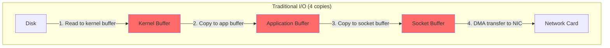
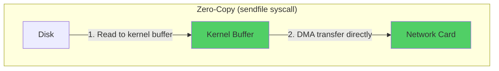
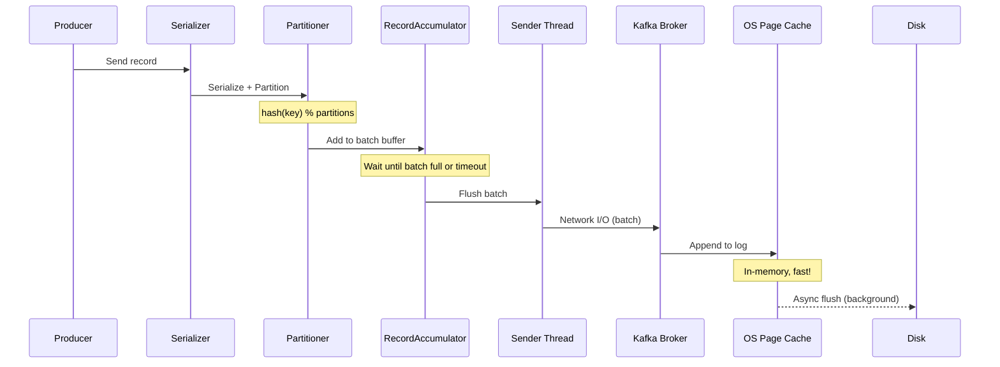
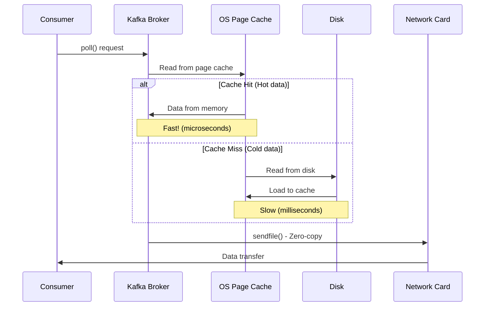

# Kafka Internals Content (To be merged into Phan7)

## Insertion Point
After line 160 in Phan7_High_Performance.md (after Kafka use case selection)

---

### 7.1.2.1. ⭐ Kafka Internals - Deep Dive

#### A. Zero-Copy Architecture

**Traditional Copy (4 copies - Slow):**


**Zero-Copy with sendfile() (2 copies - Fast):**


**Performance Impact:**
```
Traditional: 
- 4 context switches (user ↔ kernel)
- 4 data copies
- Throughput: ~100 MB/s

Zero-copy (sendfile):
- 2 context switches
- 2 data copies (no CPU involved in data transfer)
- Throughput: ~600 MB/s
→ 6x improvement!
```

**Code Example:**
```java
// Kafka broker sử dụng FileChannel.transferTo()
// → Kernel sử dụng sendfile() syscall

FileChannel channel = new RandomAccessFile(logFile, "r").getChannel();
long position = 0;
long count = channel.size();

// Zero-copy transfer: disk → network
channel.transferTo(position, count, socketChannel);
```

#### B. Page Cache Strategy

**Why Kafka doesn't use JVM heap?**

```java
// ❌ BAD: Store in JVM heap
byte[] messages = new byte[1_000_000_000];  // 1GB
// Problems:
// 1. GC overhead (Full GC pauses)
// 2. Lost on process restart
// 3. Inefficient for large data

// ✅ GOOD: Use OS page cache
// Write → OS page cache (kernel memory)
// → Async flush to disk (background)
// Benefits:
// 1. No GC overhead
// 2. Survives process restart
// 3. Shared across processes
// 4. Sequential I/O optimized
```

**Producer Write Path:**


**Consumer Read Path:**


**Key Insights:**
- **Sequential writes**: Kafka always appends → Disk writes ~600 MB/s (SSD ~1 GB/s)
- **Page cache warm-up**: Recent data stays in memory → Read from RAM, not disk
- **Batch processing**: Amortize network/disk overhead

#### C. ⭐ Production Problem: Consumer Lag

**Scenario:**
```
Topic: orders (10 partitions)
Producer rate: 10,000 msg/s
Consumer rate: 8,000 msg/s
→ Lag increases: 2,000 msg/s
→ After 1 hour: 7,200,000 messages lag!
```

**Root Causes:**

**1. Slow Consumer Processing**
```java
// ❌ BAD: Heavy processing in consumer thread
@KafkaListener(topics = "orders")
public void consume(ConsumerRecord<String, Order> record) {
    // Blocking operations!
    Order order = record.value();
    
    // Call external API (100ms)
    userService.getUserInfo(order.getUserId());
    
    // DB write (50ms)
    orderDao.insert(order);
    
    // Send email (200ms)
    emailService.send(order);
    
    // Total: 350ms per message
    // → Max throughput: ~3 msg/s per consumer!
}
```

**Solutions:**

**Solution 1: Async Processing**
```java
// ✅ GOOD: Offload to thread pool
private ExecutorService executor = Executors.newFixedThreadPool(20);

@KafkaListener(topics = "orders")
public void consume(ConsumerRecord<String, Order> record) {
    // Consumer thread only receives messages
    executor.submit(() -> {
        processOrder(record.value());
    });
    // Return immediately → Pull next message
}

private void processOrder(Order order) {
    // Heavy processing in worker thread
    userService.getUserInfo(order.getUserId());
    orderDao.insert(order);
    emailService.send(order);
}
```

**Solution 2: Batch Processing**
```java
// ✅ GOOD: Process in batches
@KafkaListener(topics = "orders", batch = "true")
public void consumeBatch(List<ConsumerRecord<String, Order>> records) {
    // Extract orders
    List<Order> orders = records.stream()
        .map(ConsumerRecord::value)
        .collect(Collectors.toList());
    
    // Batch insert (1 DB call instead of 100)
    orderDao.batchInsert(orders);
    
    // 100 messages in one DB transaction
    // → 100x faster!
}
```

**Solution 3: Increase Parallelism**
```yaml
# Before: 5 consumers cho 10 partitions
# → Mỗi consumer xử lý 2 partitions

# After: 10 consumers cho 10 partitions
# → Mỗi consumer xử lý 1 partition
# → Throughput tăng 2x!

spring:
  kafka:
    consumer:
      group-id: order-group
      concurrency: 10  # Number of consumer threads
```

**Solution 4: Partition Rebalancing**
```java
// Problem: Partition imbalance
// Partition 0: 1,000,000 messages (assigned to Consumer A)
// Partition 1: 10,000 messages (assigned to Consumer B)
// → Consumer A overloaded!

// Solution: Use key-based partitioning
ProducerRecord<String, Order> record = new ProducerRecord<>(
    "orders",
    order.getUserId().toString(),  // Key → Hash to partition
    order
);

// Result: Evenly distributed across partitions
```

**Monitoring Lag:**
```java
// Check lag with AdminClient
Map<TopicPartition, Long> endOffsets = consumer.endOffsets(partitions);
Map<TopicPartition, OffsetAndMetadata> committed = consumer.committed(partitions);

long totalLag = 0;
for (TopicPartition partition : partitions) {
    long endOffset = endOffsets.get(partition);
    long currentOffset = committed.get(partition).offset();
    long lag = endOffset - currentOffset;
    totalLag += lag;
}

// Alert if lag > threshold
if (totalLag > 1_000_000) {
    alert("Consumer lag critical: " + totalLag);
}
```

---

## Summary

This content should be inserted after the Kafka selection guide in Phan7_High_Performance.md to provide:
- Production-level understanding of Kafka architecture
- Performance optimization insights
- Real-world problem + solutions
- Complete code examples ready to use
