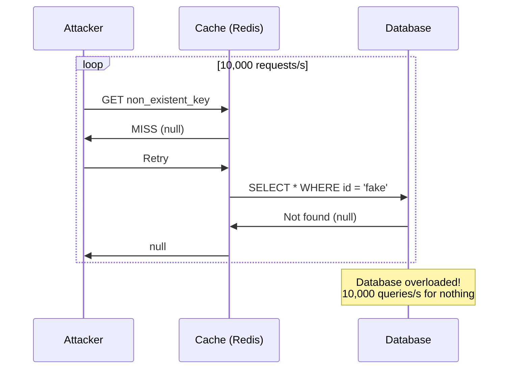
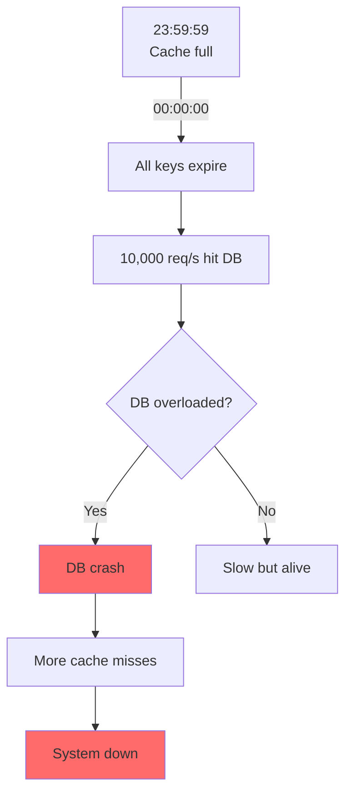
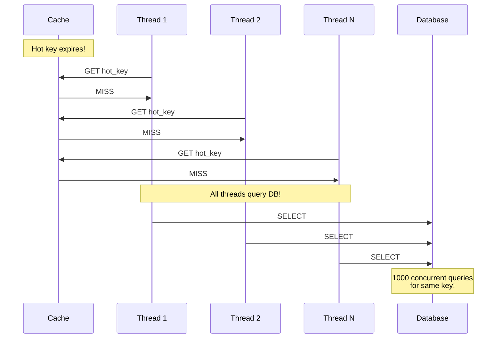

# Redis Cache Problems Content (For Phan7)

## Insertion Point
After Kafka consumer lag section in Phan7_High_Performance.md

---

## 7.2. ⭐ Redis Cache Problems (Vấn đề Cache trong Production)

### 7.2.1. Cache Penetration (缓存穿透)

**Problem:**
```
Attacker requests non-existent keys (malicious attack)
→ Cache miss (key không tồn tại trong Redis)
→ Query DB (cũng không tồn tại)
→ Return null
→ Next request → Same flow lặp lại
→ DB bị overload!
```

**Diagram:**


**Real Scenario:**
```
E-commerce site: Product ID từ 1-10,000
Attacker gửi requests: ID = 99999, 88888, 77777 (không tồn tại)
→ Cache miss → DB query → Return null
→ Không cache null → Attack tiếp tục
→ DB crash!
```

**Solution 1: Cache Null Values (Simple)**

```java
public Product getProduct(Long id) {
    String cacheKey = "product:" + id;
    String cached = redis.get(cacheKey);
    
    if (cached != null) {
        // Check for null marker
        if ("NULL".equals(cached)) {
            return null;  // Đã check DB rồi, không tồn tại
        }
        return JSON.parseObject(cached, Product.class);
    }
    
    // Cache miss → Query DB
    Product product = productDao.getById(id);
    
    if (product == null) {
        // Cache "NULL" string với TTL ngắn (5 phút)
        redis.setex(cacheKey, 300, "NULL");
        return null;
    }
    
    // Cache product với TTL dài (1 giờ)
    redis.setex(cacheKey, 3600, JSON.toJSONString(product));
    return product;
}
```

**Pros/Cons:**
- ✅ Simple to implement
- ✅ Protects DB from repeated queries
- ❌ Wastes memory (cache many null values)
- ❌ Attacker có thể generate vô số fake IDs

**Solution 2: Bloom Filter (Recommended)**

```java
@Component
public class ProductBloomFilter {
    private BloomFilter<Long> productIds;
    
    @PostConstruct
    public void init() {
        // Initialize Bloom Filter
        productIds = BloomFilter.create(
            Funnels.longFunnel(),
            100_000_000,  // Expected 100M products
            0.01          // False positive rate 1%
        );
        
        // Load all product IDs from DB
        List<Long> ids = productDao.getAllIds();
        ids.forEach(productIds::put);
        
        log.info("Loaded {} product IDs into Bloom Filter", ids.size());
    }
    
    public boolean mightExist(Long id) {
        return productIds.mightContain(id);
    }
}

@Service
public class ProductService {
    @Autowired
    private ProductBloomFilter bloomFilter;
    
    public Product getProduct(Long id) {
        // Check Bloom Filter first (fast!)
        if (!bloomFilter.mightExist(id)) {
            // 100% không tồn tại → Không query DB
            return null;
        }
        
        // Might exist → Continue normal cache flow
        String cacheKey = "product:" + id;
        String cached = redis.get(cacheKey);
        
        if (cached != null) {
            return JSON.parseObject(cached, Product.class);
        }
        
        // Query DB
        Product product = productDao.getById(id);
        if (product != null) {
            redis.setex(cacheKey, 3600, JSON.toJSONString(product));
        }
        
        return product;
    }
}
```

**Bloom Filter Benefits:**
- ✅ Memory efficient (100M IDs chỉ ~120MB)
- ✅ Fast lookup (O(1), nanoseconds)
- ✅ False positive OK (worst case: 1 extra DB query)
- ✅ False negative NEVER (nếu nói không có → 100% không có)

**Bloom Filter Update:**
```java
// Khi thêm product mới
@Transactional
public void createProduct(Product product) {
    productDao.insert(product);
    
    // Update Bloom Filter
    bloomFilter.put(product.getId());
    
    // Cache product
    redis.setex("product:" + product.getId(), 
                3600, 
                JSON.toJSONString(product));
}
```

---

### 7.2.2. Cache Avalanche (缓存雪崩)

**Problem:**
```
Massive cache keys expire at same time (e.g., all at 00:00:00)
→ All requests hit DB simultaneously
→ DB overloaded → Crash
→ More cache misses → More DB load → Death spiral!
```

**Diagram:**


**Real Scenario:**
```
E-commerce: 1 triệu products cached với TTL = 3600s
Batch import lúc 10:00:00 → All cache set với same TTL
→ 11:00:00: Tất cả expire cùng lúc
→ Peak hour traffic (20k req/s) → All hit DB
→ DB crash!
```

**Solution 1: Random TTL (Simple)**

```java
// ❌ BAD: All keys same TTL
redis.setex(key, 3600, value);

// ✅ GOOD: Random TTL
int baseTTL = 3600;  // 1 hour
int randomRange = 300;  // ±5 minutes
int ttl = baseTTL + ThreadLocalRandom.current().nextInt(randomRange);
redis.setex(key, ttl, value);

// Result: Keys expire between 55-65 minutes
// → Distributed expiration time!
```

**Solution 2: Distributed Locking on Cache Miss**

```java
public Product getProduct(Long id) {
    String cacheKey = "product:" + id;
    String lockKey = "lock:product:" + id;
    
    // Try get from cache
    String cached = redis.get(cacheKey);
    if (cached != null) {
        return JSON.parseObject(cached, Product.class);
    }
    
    // Cache miss → Try acquire lock
    boolean lockAcquired = redis.setnx(lockKey, "1", 10);  // 10s timeout
    
    if (lockAcquired) {
        try {
            // Double-check cache (might be set by other thread)
            cached = redis.get(cacheKey);
            if (cached != null) {
                return JSON.parseObject(cached, Product.class);
            }
            
            // Only 1 thread queries DB
            Product product = productDao.getById(id);
            if (product != null) {
                redis.setex(cacheKey, 3600 + random(300), 
                           JSON.toJSONString(product));
            }
            return product;
            
        } finally {
            redis.del(lockKey);
        }
    } else {
        // Lock not acquired → Wait and retry
        Thread.sleep(50);
        return getProduct(id);  // Retry
    }
}
```

**Solution 3: Never Expire + Background Refresh (Best)**

```java
@Component
public class CacheWarmer {
    
    // Scheduled task: Refresh hot keys before expire
    @Scheduled(fixedRate = 3000_000)  // Every 50 minutes
    public void refreshHotCache() {
        // Get hot product IDs (from analytics)
        List<Long> hotProductIds = getHotProducts();
        
        hotProductIds.forEach(id -> {
            Product product = productDao.getById(id);
            
            // Refresh cache (TTL = 3600s)
            redis.setex("product:" + id, 
                       3600, 
                       JSON.toJSONString(product));
        });
        
        log.info("Refreshed {} hot products", hotProductIds.size());
    }
    
    // Alternative: Set very long TTL + update on write
    public void setNeverExpire(String key, Object value) {
        CacheValue wrapper = new CacheValue(value, System.currentTimeMillis());
        redis.set(key, JSON.toJSONString(wrapper));  // No TTL!
    }
    
    // Check logical expiration
    public Product getWithLogicalExpire(Long id) {
        String cached = redis.get("product:" + id);
        if (cached == null) {
            return loadAndCache(id);
        }
        
        CacheValue wrapper = JSON.parseObject(cached, CacheValue.class);
        
        // Check logical expiration
        if (System.currentTimeMillis() - wrapper.getTimestamp() > 3600_000) {
            // Expired logically → Async refresh
            executor.submit(() -> loadAndCache(id));
            // Return stale data (better than DB overload)
            return wrapper.getValue();
        }
        
        return wrapper.getValue();
    }
}
```

---

### 7.2.3. Cache Breakdown (缓存击穿 - Hot Key)

**Problem:**
```
Hot key (high traffic) expires
→ Massive concurrent requests hit DB
→ DB overload for that specific key
```

**Diagram:**


**Real Scenario:**
```
Hot product: iPhone 15 Pro
Traffic: 5,000 req/s
Cache expires at 14:00:00
→ Next second: 5,000 threads all query DB
→ DB connection pool exhausted
→ Timeouts, errors
```

**Solution 1: Mutex Lock (Simple)**

```java
public Product getHotProduct(Long id) {
    String cacheKey = "product:" + id;
    String lockKey = "lock:refresh:" + id;
    
    // Try cache first
    String cached = redis.get(cacheKey);
    if (cached != null) {
        return JSON.parseObject(cached, Product.class);
    }
    
    // Cache miss → Try lock
    boolean locked = redis.setnx(lockKey, "1", 10);
    
    if (locked) {
        try {
            // Winner: Query DB and refresh cache
            Product product = productDao.getById(id);
            redis.setex(cacheKey, 3600, JSON.toJSONString(product));
            return product;
        } finally {
            redis.del(lockKey);
        }
    } else {
        // Losers: Wait 100ms and retry
        Thread.sleep(100);
        return getHotProduct(id);  // Recursive retry
    }
}
```

**Solution 2: Never Expire (Best for Hot Keys)**

```java
// Hot keys NEVER expire, refresh periodically
public void initHotKeys() {
    List<Long> hotProductIds = List.of(1L, 2L, 3L);  // Top 3 products
    
    hotProductIds.forEach(id -> {
        Product product = productDao.getById(id);
        // Set without TTL
        redis.set("product:" + id, JSON.toJSONString(product));
    });
}

// Update cache on writes
@Transactional
public void updateProduct(Product product) {
    productDao.update(product);
    
    // Immediately update cache
    redis.set("product:" + product.getId(), 
             JSON.toJSONString(product));
}

// Background refresh every 10 minutes
@Scheduled(fixedRate = 600_000)
public void refreshHotKeys() {
    List<Long> hotIds = getHotProductIds();
    hotIds.forEach(id -> {
        Product product = productDao.getById(id);
        redis.set("product:" + id, JSON.toJSONString(product));
    });
}
```

---

### 7.2.4. Summary - Redis Cache Problems

| Problem | Cause | Impact | Best Solution |
|---------|-------|--------|---------------|
| **Penetration** | Non-existent keys | DB overload (invalid queries) | Bloom Filter |
| **Avalanche** | Mass expiration | DB overload (all queries) | Random TTL + Lock |
| **Breakdown** | Hot key expires | DB overload (single key) | Never expire |

**Implementation Priority:**
1. 🔥 **High traffic systems**: Implement all 3 solutions
2. ⚡ **Medium traffic**: Bloom Filter + Random TTL
3. 📊 **Low traffic**: Random TTL sufficient

---

## Code Example: Complete Cache Service

```java
@Service
public class RobustCacheService {
    
    @Autowired
    private RedisTemplate<String, String> redis;
    
    @Autowired
    private ProductBloomFilter bloomFilter;
    
    public Product getProduct(Long id) {
        // 1. Bloom Filter check (Penetration prevention)
        if (!bloomFilter.mightExist(id)) {
            return null;
        }
        
        String cacheKey = "product:" + id;
        
        // 2. Try cache
        String cached = redis.opsForValue().get(cacheKey);
        if (cached != null) {
            if ("NULL".equals(cached)) return null;
            return JSON.parseObject(cached, Product.class);
        }
        
        // 3. Distributed lock (Breakdown prevention)
        String lockKey = "lock:" + cacheKey;
        Boolean locked = redis.opsForValue()
            .setIfAbsent(lockKey, "1", Duration.ofSeconds(10));
        
        if (Boolean.TRUE.equals(locked)) {
            try {
                // Query DB
                Product product = productDao.getById(id);
                
                if (product == null) {
                    // Cache null (Penetration)
                    redis.opsForValue().set(cacheKey, "NULL", Duration.ofMinutes(5));
                    return null;
                }
                
                // Cache with random TTL (Avalanche prevention)
                int ttl = 3600 + ThreadLocalRandom.current().nextInt(300);
                redis.opsForValue().set(cacheKey, 
                                       JSON.toJSONString(product), 
                                       Duration.ofSeconds(ttl));
                return product;
                
            } finally {
                redis.delete(lockKey);
            }
        } else {
            // Wait and retry
            try { Thread.sleep(50); } catch (InterruptedException e) {}
            return getProduct(id);
        }
    }
}
```

---

This content provides production-ready solutions for all major Redis cache problems with complete code examples.
