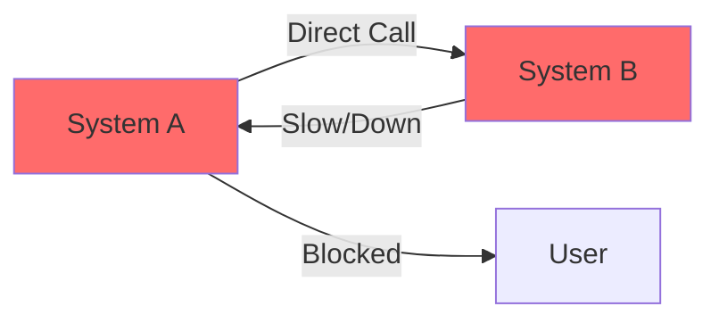
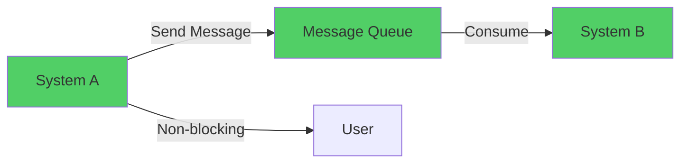
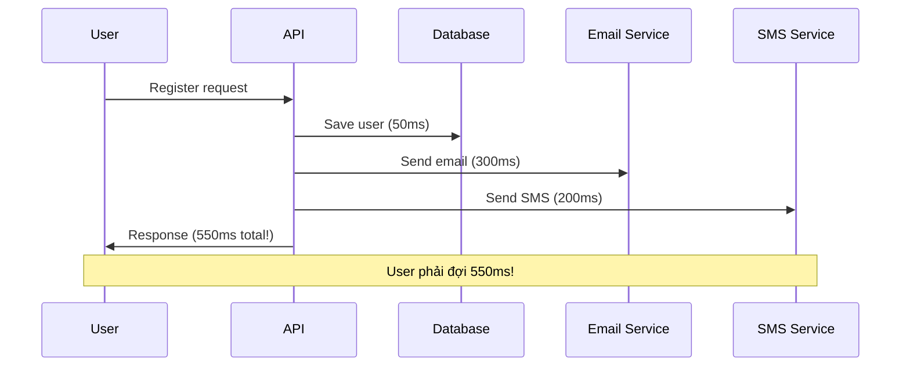
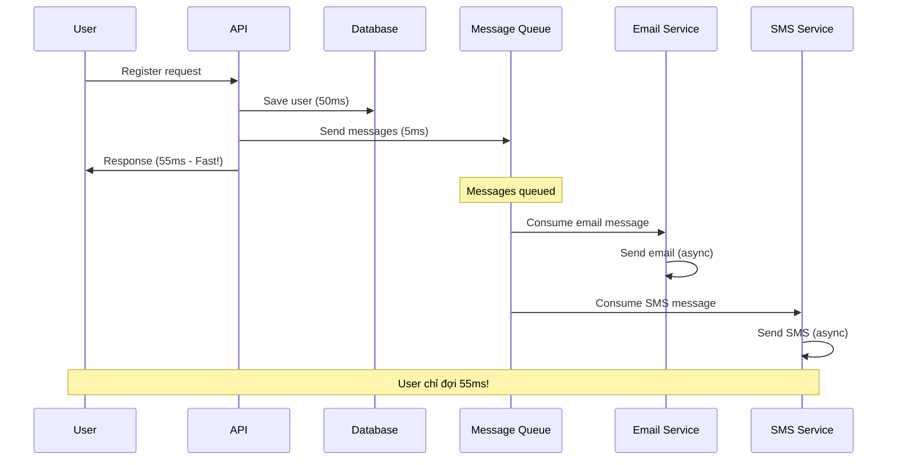
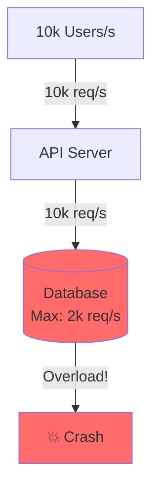
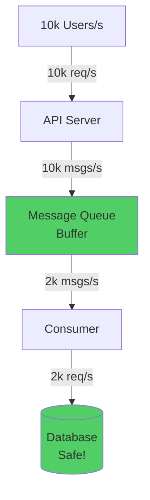
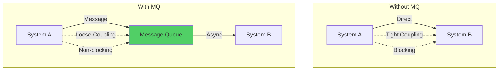
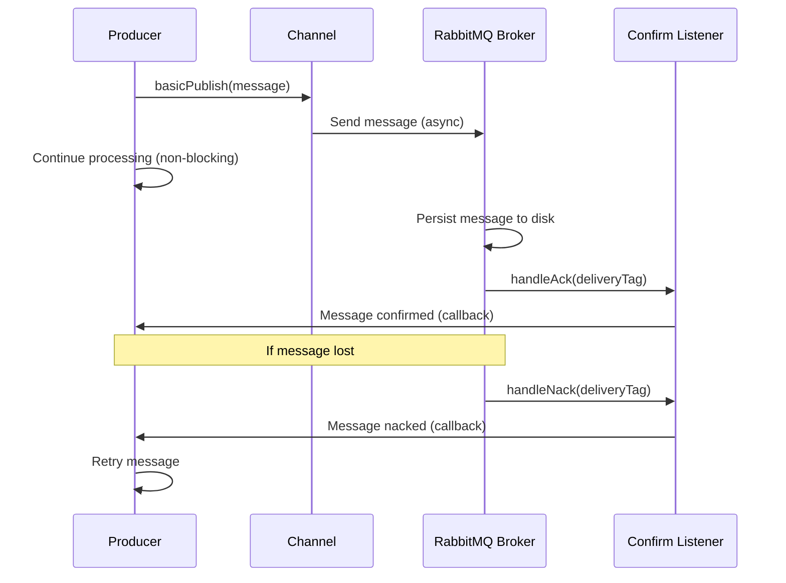
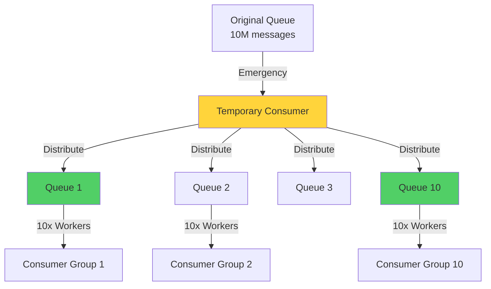
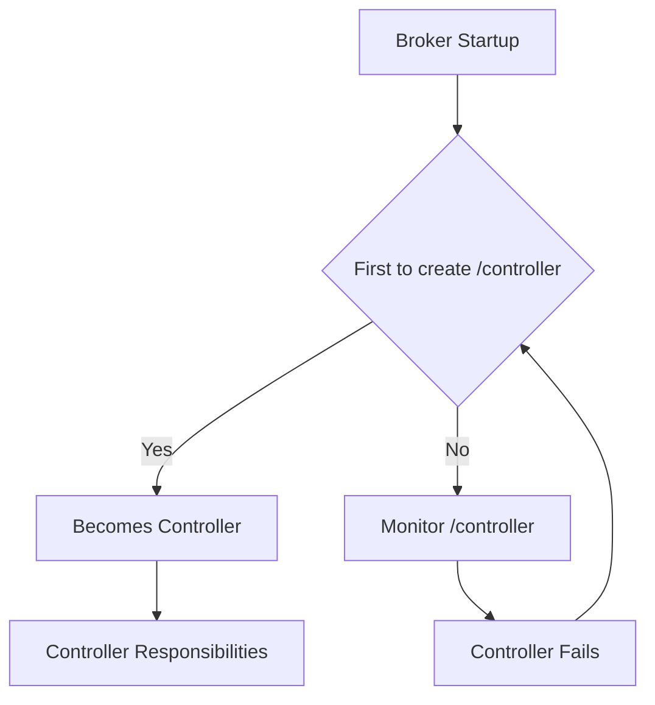

# Part 7: High Performance (Hiệu năng cao)

## 7.1. Message Queue (Hàng đợi tin nhắn)

### 7.1.1. Why Message Queue?

**1. Decoupling (Gỡ lỗi/Giảm phụ thuộc)**

**Vấn đề với Direct Call:**


*   Hệ thống A gọi trực tiếp Hệ thống B. Nếu B chết/chậm → A chết theo.
*   **Tight coupling**: A phụ thuộc trực tiếp vào B → Khó maintain, scale

**Giải pháp với MQ:**


*   **Với MQ**: A gửi tin vào Queue rồi quên đi. B lấy tin xử lý sau. A và B không cần biết nhau.
*   **Loose coupling**: A và B độc lập → Dễ maintain, scale riêng biệt

**2. Asynchronous Processing (Xử lý bất đồng bộ)**

**Synchronous (Đồng bộ) - Chậm:**


*   User đăng ký (50ms) = Ghi DB (50ms) + Gửi mail (300ms) + Gửi SMS (200ms) = **550ms**.
*   **Vấn đề**: User phải đợi tất cả operations hoàn thành

**Asynchronous (Bất đồng bộ) - Nhanh:**


*   **Với MQ**: User đăng ký (50ms) + Gửi msg vào Queue (5ms) = **55ms**. Mail/SMS xử lý ngầm sau.
*   **Lợi ích**: User experience tốt hơn 10x!

**3. Traffic Peak Shaving (Làm mịn lưu lượng)**

**Vấn đề không có MQ:**


*   Giờ cao điểm: **10k req/s**. DB chỉ chịu được **2k req/s** → Sập.

**Giải pháp với MQ:**


*   **Với MQ**: Queue hứng 10k req/s. Consumer từ từ lấy 2k req/s để xử lý. DB an toàn.
*   **Peak shaving**: Làm mịn traffic spikes → Bảo vệ downstream services

**Nhược điểm:**
*   Hệ thống phức tạp thêm (phải maintain MQ).
*   Giảm Availability (MQ chết → hệ thống liệt).
*   Vấn đề Consistency (A thành công nhưng B thất bại?).

**Tổng kết so sánh:**


### 7.1.2. ⭐ Kafka vs RabbitMQ vs RocketMQ

| Tiêu chí | RabbitMQ | RocketMQ | Kafka |
|----------|----------|----------|-------|
| **Ngôn ngữ** | Erlang | Java | Scala/Java |
| **Throughput** | Trung bình (vài chục k/s) | Cao (100k/s) | Cực cao (triệu/s) |
| **Latency** | Thấp nhất (microsecond) | Thấp (ms) | Thấp (ms) |
| **Availability** | High (Mirrored Queue) | High (Master-Slave) | Very High (Replication) |
| **Durability** | Tốt | Rất tốt | Rất tốt |
| **Feature** | Routing mạnh (Exchange), Priority | Retries, Delay msg, Transaction | Batch processing, Stream |
| **Use Case** | Business logic phức tạp, ERP | E-commerce, Finance (Alibaba) | Big Data, Log aggregation |

**Lựa chọn:**
*   **RabbitMQ**: Cho hệ thống vừa/nhỏ, cần routing phức tạp, yêu cầu latency cực thấp.
*   **RocketMQ**: Cho hệ thống tài chính/TMĐT lớn, cần transaction message, delay message.
*   **Kafka**: Cho Big Data, Logging, User Behavior Tracking.

### 7.1.3. ⭐ Common Issues & Solutions (Chi tiết)

#### 1. Message Loss (Mất tin nhắn) - Chi tiết

**Nguyên tắc**: **Data không được mất, cũng không được trùng**. Đây là vấn đề cốt lõi khi dùng MQ.

**Mất tin có thể xảy ra ở 3 nơi: Producer, Broker, Consumer.**

##### RabbitMQ - Message Loss

**A. Producer mất tin:**

**Vấn đề**: Producer gửi message nhưng mạng lag/đứt → Message mất.

**Giải pháp 1: Transaction Mode (Đồng bộ - Chậm)**
```java
try {
    channel.txSelect();  // Bắt đầu transaction
    channel.basicPublish(exchange, routingKey, 
        MessageProperties.PERSISTENT_TEXT_PLAIN, 
        msg.getBytes());
    channel.txCommit();  // Commit
} catch (Exception e) {
    channel.txRollback();  // Rollback nếu lỗi
}
```
**Nhược điểm**: **Rất chậm** (blocking), throughput giảm mạnh.

**Giải pháp 2: Confirm Mode (Bất đồng bộ - Khuyến nghị)**
```java
// Bật confirm mode
channel.confirmSelect();

// Async confirm listener
channel.addConfirmListener(new ConfirmListener() {
    @Override
    public void handleAck(long deliveryTag, boolean multiple) {
        // Message đã được RabbitMQ nhận → OK
        System.out.println("Message confirmed: " + deliveryTag);
    }
    
    @Override
    public void handleNack(long deliveryTag, boolean multiple) {
        // Message bị từ chối → Retry
        System.out.println("Message nacked: " + deliveryTag);
        // Retry logic...
    }
});

// Gửi message
channel.basicPublish(exchange, routingKey, 
    MessageProperties.PERSISTENT_TEXT_PLAIN, 
    msg.getBytes());
```
**Ưu điểm**: **Không blocking**, throughput cao, vẫn đảm bảo reliability.

**Diagram (RabbitMQ Confirm Mode):**


**Giải thích chi tiết:**

**Confirm Mode Flow:**
1. **Producer gửi message**: `basicPublish()` → Gửi async, không đợi
2. **Producer tiếp tục**: Có thể gửi messages tiếp theo ngay lập tức
3. **RabbitMQ xử lý**: Nhận message → Persist to disk → Gửi ACK
4. **Confirm callback**: Listener nhận ACK → Producer biết message đã được nhận
5. **NACK handling**: Nếu message bị reject → Listener nhận NACK → Retry

**So sánh Transaction vs Confirm:**
- **Transaction**: Blocking, chậm (phải đợi commit) → Throughput thấp
- **Confirm**: Non-blocking, nhanh (async callback) → Throughput cao

**B. Broker mất tin:**

**Vấn đề**: RabbitMQ chưa kịp ghi disk → Crash → Mất data trong memory.

**Diagram (Message Loss tại Broker):**
```mermaid
sequenceDiagram
    participant P as Producer
    participant R as RabbitMQ
    participant M as Memory
    participant D as Disk
    
    P->>R: Send message
    R->>M: Store in memory
    R->>P: ACK (message received)
    
    Note over R: Crash before flush to disk!
    R->>R: 💥 Crash
    
    Note over M,D: Message lost from memory!
    M -.->|Lost| X[Message Lost]
    
    Note over R: After restart
    R->>D: Load from disk
    D->>R: No message (wasn't persisted)
```

**Giải thích chi tiết:**

**Vấn đề:**
- Producer gửi message → RabbitMQ nhận → Lưu vào **memory**
- RabbitMQ gửi ACK về Producer → Producer nghĩ message đã an toàn
- **Nhưng**: RabbitMQ chưa kịp flush memory → disk
- **Crash**: RabbitMQ crash → Memory bị mất → **Message mất!**

**Giải pháp: Persistence (2 bước bắt buộc)**

1. **Queue persistence**:
```java
// Tạo queue với durable = true
channel.queueDeclare("my_queue", true, false, false, null);
```

2. **Message persistence**:
```java
// Gửi message với deliveryMode = 2 (persistent)
channel.basicPublish(exchange, routingKey,
    MessageProperties.PERSISTENT_TEXT_PLAIN,  // PERSISTENT = deliveryMode 2
    msg.getBytes());
```

**Lưu ý**: Phải set **cả 2** mới đảm bảo. Nếu chỉ set 1 → Vẫn có thể mất data.

**C. Consumer mất tin:**

**Vấn đề**: Consumer nhận message nhưng chưa xử lý xong → Crash → RabbitMQ đã xóa message (auto-ack) → Mất tin.

**Giải pháp: Manual Acknowledgment**
```java
// Tắt auto-ack
boolean autoAck = false;
channel.basicConsume(queueName, autoAck, new DefaultConsumer(channel) {
    @Override
    public void handleDelivery(String consumerTag, 
                               Envelope envelope,
                               AMQP.BasicProperties properties,
                               byte[] body) throws IOException {
        try {
            // Xử lý business logic
            processMessage(body);
            
            // Chỉ ack sau khi xử lý xong
            channel.basicAck(envelope.getDeliveryTag(), false);
        } catch (Exception e) {
            // Nếu lỗi → Nack (có thể requeue)
            channel.basicNack(envelope.getDeliveryTag(), false, true);
        }
    }
});
```

##### Kafka - Message Loss

**A. Producer mất tin:**

**Giải pháp: `acks=all` + `retries=MAX`**
```java
Properties props = new Properties();
props.put("acks", "all");  // Đợi tất cả replicas confirm
props.put("retries", Integer.MAX_VALUE);  // Retry vô hạn
props.put("max.in.flight.requests.per.connection", 1);  // Đảm bảo order

KafkaProducer<String, String> producer = new KafkaProducer<>(props);
```

**B. Broker mất tin:**

**Vấn đề**: Leader crash trước khi follower sync xong → Mất data.

**Giải pháp: Replication + Min ISR**
```properties
# Broker config
replication.factor=3  # Mỗi partition có 3 replicas
min.insync.replicas=2  # Leader phải có ít nhất 2 replicas sync
```

**C. Consumer mất tin:**

**Vấn đề**: Consumer xử lý xong nhưng chưa commit offset → Crash → Kafka tưởng chưa xử lý → Replay.

**Giải pháp: Manual Commit Offset**
```java
// Tắt auto commit
props.put("enable.auto.commit", "false");

KafkaConsumer<String, String> consumer = new KafkaConsumer<>(props);
consumer.subscribe(Arrays.asList("my-topic"));

while (true) {
    ConsumerRecords<String, String> records = consumer.poll(Duration.ofMillis(100));
    for (ConsumerRecord<String, String> record : records) {
        try {
            // Xử lý message
            processMessage(record.value());
            
            // Commit offset sau khi xử lý xong
            consumer.commitSync();
        } catch (Exception e) {
            // Log error, không commit → Kafka sẽ retry
        }
    }
}
```

##### RocketMQ - Message Loss

**A. Producer mất tin: Transaction Message**
```java
// Half message (pre-commit)
TransactionMQProducer producer = new TransactionMQProducer("producer_group");
producer.setTransactionListener(new TransactionListener() {
    @Override
    public LocalTransactionState executeLocalTransaction(Message msg, Object arg) {
        // Thực hiện local transaction
        try {
            doLocalTransaction();
            return LocalTransactionState.COMMIT_MESSAGE;
        } catch (Exception e) {
            return LocalTransactionState.ROLLBACK_MESSAGE;
        }
    }
    
    @Override
    public LocalTransactionState checkLocalTransaction(MessageExt msg) {
        // Checkback: Kiểm tra lại local transaction status
        return checkTransactionStatus();
    }
});
```

**B. Broker: Sync Flush**
```properties
# Broker config
flushDiskType=SYNC_FLUSH  # Đồng bộ ghi disk (thay vì ASYNC_FLUSH)
```

**C. Consumer: Retry + Local Transaction Check**
```java
// Consumer với retry
DefaultMQPushConsumer consumer = new DefaultMQPushConsumer("consumer_group");
consumer.registerMessageListener(new MessageListenerConcurrently() {
    @Override
    public ConsumeConcurrentlyStatus consumeMessage(
            List<MessageExt> messages,
            ConsumeConcurrentlyContext context) {
        try {
            // Xử lý message
            processMessage(messages);
            return ConsumeConcurrentlyStatus.CONSUME_SUCCESS;
        } catch (Exception e) {
            // Retry (RocketMQ tự động retry 16 lần)
            return ConsumeConcurrentlyStatus.RECONSUME_LATER;
        }
    }
});
```

#### 2. ⭐ Duplicate Messages (Tin nhắn lặp) - Chi tiết

**Vấn đề**: Mạng lag, timeout, retry → Consumer nhận cùng 1 message nhiều lần.

**Ví dụ thực tế (Kafka)**:
- Consumer xử lý message `offset=153`
- Chưa kịp commit offset → Process crash
- Restart → Kafka replay từ `offset=152` → Message bị xử lý lại

**Nguyên tắc**: **Không thể tránh duplicate 100%**. Phải thiết kế **Idempotent** (Lũy đẳng).

**Idempotent = Gọi nhiều lần với cùng input → Kết quả giống nhau.**

##### Solution 1: Database Unique Key

**Ví dụ**: Insert order vào DB
```java
// Message chứa order_id (unique)
public void consumeMessage(Message msg) {
    String orderId = msg.getOrderId();
    
    // INSERT IGNORE hoặc ON DUPLICATE KEY UPDATE
    String sql = "INSERT IGNORE INTO orders (order_id, user_id, amount) " +
                 "VALUES (?, ?, ?)";
    // Nếu order_id đã tồn tại → Không insert (idempotent)
}
```

**Hoặc dùng Unique Constraint**:
```sql
ALTER TABLE orders ADD UNIQUE KEY uk_order_id (order_id);
-- Nếu duplicate → SQL error → Catch và ignore
```

##### Solution 2: Redis Set (Check Processed)

**Ví dụ**: Check message đã xử lý chưa
```java
public void consumeMessage(Message msg) {
    String msgId = msg.getMessageId();
    
    // Check Redis: Đã xử lý chưa?
    if (redis.sismember("processed_messages", msgId)) {
        // Đã xử lý rồi → Skip
        return;
    }
    
    // Xử lý business logic
    processBusinessLogic(msg);
    
    // Đánh dấu đã xử lý (TTL 7 ngày)
    redis.sadd("processed_messages", msgId);
    redis.expire("processed_messages", 7 * 24 * 3600);
}
```

**Lưu ý**: Redis có thể mất data → Cần backup hoặc dùng DB.

##### Solution 3: Database Idempotent Table

**Tạo bảng lưu message_id đã xử lý**:
```sql
CREATE TABLE processed_messages (
    msg_id VARCHAR(64) PRIMARY KEY,
    processed_at TIMESTAMP DEFAULT CURRENT_TIMESTAMP
);
```

```java
public void consumeMessage(Message msg) {
    String msgId = msg.getMessageId();
    
    // Transaction: Insert + Business logic
    transactionTemplate.execute(status -> {
        // Check đã xử lý chưa
        if (processedMessageDao.exists(msgId)) {
            return;  // Đã xử lý → Skip
        }
        
        // Xử lý business
        processBusinessLogic(msg);
        
        // Lưu msg_id
        processedMessageDao.insert(msgId);
        
        return null;
    });
}
```

##### Solution 4: Business Logic Idempotent

**Ví dụ**: Update balance (Additive operation)
```java
// Không idempotent
public void updateBalance(String userId, BigDecimal amount) {
    User user = userDao.getById(userId);
    user.setBalance(user.getBalance().add(amount));  // ❌ Nếu gọi 2 lần → Balance tăng 2 lần
    userDao.update(user);
}

// Idempotent: Dùng message_id làm unique key
public void updateBalance(String userId, BigDecimal amount, String msgId) {
    // Check msg_id đã xử lý chưa
    if (balanceLogDao.exists(msgId)) {
        return;  // Đã xử lý → Skip
    }
    
    // Update balance
    userDao.addBalance(userId, amount);
    
    // Log message_id
    balanceLogDao.insert(msgId, userId, amount);
}
```

**Best Practice**: **Kết hợp nhiều cách**:
1. Database unique key (primary defense)
2. Redis check (fast check, có thể miss)
3. Business logic idempotent (final safety net)

#### 3. ⭐ Ordered Messages (Thứ tự tin nhắn) - Chi tiết

**Vấn đề**: Message phải được xử lý **theo thứ tự** (ví dụ: Create → Update → Delete).

**Ví dụ thực tế**: MySQL binlog sync
- Binlog: `INSERT user(id=1)` → `UPDATE user(id=1)` → `DELETE user(id=1)`
- Nếu xử lý sai thứ tự: `DELETE` → `UPDATE` → `INSERT` → **Lỗi!**

##### RabbitMQ - Order Guarantee

**Vấn đề**: 1 Queue, 3 Consumers → Message có thể xử lý sai thứ tự.

**Solution 1: 1 Queue = 1 Consumer (Đơn giản nhất)**
```java
// Chỉ có 1 consumer cho 1 queue
channel.basicConsume("order_queue", false, consumer);
// Đảm bảo order, nhưng throughput thấp
```

**Solution 2: Memory Queue trong Consumer (Khuyến nghị)**
```java
// 1 Consumer nhận tất cả messages
// Hash message theo order_id → Đưa vào memory queue tương ứng
Map<String, BlockingQueue<Message>> orderQueues = new ConcurrentHashMap<>();

channel.basicConsume("order_queue", false, (consumerTag, delivery) -> {
    Message msg = parseMessage(delivery.getBody());
    String orderId = msg.getOrderId();
    
    // Hash order_id → Memory queue
    orderQueues.computeIfAbsent(orderId, k -> new LinkedBlockingQueue<>())
               .offer(msg);
    
    channel.basicAck(delivery.getEnvelope().getDeliveryTag(), false);
});

// Worker threads: Mỗi thread xử lý 1 order_id
for (int i = 0; i < 10; i++) {
    new Thread(() -> {
        while (true) {
            // Lấy message từ memory queue (theo order_id)
            Message msg = getNextMessage();  // Round-robin các order_id
            processMessage(msg);
        }
    }).start();
}
```

**Kết quả**: 
- Messages cùng `order_id` → Cùng memory queue → Xử lý tuần tự
- Messages khác `order_id` → Khác memory queue → Xử lý song song

##### Kafka - Order Guarantee

**Vấn đề**: 1 Topic, 3 Partitions, 3 Consumers → Messages có thể xử lý sai thứ tự.

**Solution 1: 1 Partition = 1 Consumer (Đơn giản)**
```java
// Topic chỉ có 1 partition
Properties props = new Properties();
props.put("bootstrap.servers", "localhost:9092");
KafkaConsumer<String, String> consumer = new KafkaConsumer<>(props);
consumer.subscribe(Arrays.asList("order-topic"));  // 1 partition only

// Đảm bảo order, nhưng throughput thấp
```

**Solution 2: Key-based Partitioning + Memory Queue (Khuyến nghị)**

**Producer**: Gửi message với key = order_id
```java
// Messages cùng order_id → Cùng partition
ProducerRecord<String, String> record = new ProducerRecord<>(
    "order-topic", 
    orderId,  // Key = order_id → Hash vào cùng partition
    messageJson
);
producer.send(record);
```

**Consumer**: 1 Consumer per partition, Memory queue per key
```java
KafkaConsumer<String, String> consumer = new KafkaConsumer<>(props);
consumer.subscribe(Arrays.asList("order-topic"));

// Memory queues: order_id → Queue
Map<String, BlockingQueue<ConsumerRecord>> orderQueues = new ConcurrentHashMap<>();

while (true) {
    ConsumerRecords<String, String> records = consumer.poll(Duration.ofMillis(100));
    for (ConsumerRecord<String, String> record : records) {
        String orderId = record.key();  // order_id
        
        // Đưa vào memory queue tương ứng
        orderQueues.computeIfAbsent(orderId, k -> new LinkedBlockingQueue<>())
                   .offer(record);
    }
}

// Worker threads xử lý từ memory queues
for (int i = 0; i < 10; i++) {
    new Thread(() -> {
        while (true) {
            ConsumerRecord record = getNextMessageFromQueues();
            processMessage(record);
            consumer.commitSync();  // Commit sau khi xử lý xong
        }
    }).start();
}
```

**Kết quả**:
- Messages cùng `order_id` → Cùng partition → Cùng memory queue → Xử lý tuần tự
- Messages khác `order_id` → Khác partition → Xử lý song song

**Lưu ý quan trọng**:
- **Global order** (toàn bộ messages) → Chỉ có thể dùng 1 partition
- **Partial order** (messages cùng key) → Dùng key-based partitioning (khuyến nghị)

#### 4. ⭐ Message Delay & Expired Messages (Tin nhắn trễ & Hết hạn)

**Vấn đề**: Consumer xử lý chậm → Messages tích tụ → Một số messages hết TTL (Time To Live) → Mất data.

**Scenario 1: Message Queue đầy (Disk gần hết)**

**Vấn đề**: Messages tích tụ quá nhiều, disk gần đầy.

**Giải pháp khẩn cấp**:
1. **Tạm dừng Producer**: Ngừng gửi messages mới
2. **Tăng Consumer**: Scale up consumers để xử lý nhanh hơn
3. **Temporary Consumer**: Viết consumer tạm chỉ làm nhiệm vụ:
   - Lấy messages từ queue cũ
   - **Không xử lý business logic** (skip expensive operations)
   - Gửi ngay sang **10 queues mới** (sharding)
4. **Scale Workers**: Bật 10x consumers để xử lý 10 queues mới song song
5. **Recover**: Sau khi hết tồn đọng, quay lại kiến trúc cũ

**Diagram (Message Accumulation Solution)**:


**Scenario 2: Messages hết TTL (RabbitMQ)**

**Vấn đề**: RabbitMQ có TTL (Time To Live). Messages tích tụ quá lâu → TTL hết → Messages bị xóa → **Mất data**.

**Ví dụ thực tế**:
- 10,000 orders trong queue, chưa xử lý
- TTL = 1 giờ
- Sau 1 giờ → 1,000 orders bị xóa (mất data)

**Giải pháp: Batch Re-import (Khuyến nghị)**

**Khi messages đã bị xóa**:
1. **Tạm thời bỏ qua**: Không thể recover messages đã mất
2. **Batch re-import**: Viết script để:
   - Query database tìm các orders chưa được xử lý (dựa vào status)
   - Re-send messages vào queue
   - Consumer xử lý lại

**Code Example (Batch Re-import)**:
```java
// Tìm orders chưa được xử lý
List<Order> pendingOrders = orderDao.findByStatus("PENDING");

// Re-send vào queue
for (Order order : pendingOrders) {
    OrderMessage msg = new OrderMessage(order.getId(), order.getAmount());
    rabbitTemplate.convertAndSend("order.queue", msg);
    logger.info("Re-sent order: {}", order.getId());
}
```

**Prevention (Phòng ngừa)**:
- **Monitor queue size**: Alert khi queue > threshold
- **Set TTL dài hơn**: TTL = 24h thay vì 1h (trade-off: tốn disk)
- **Auto-scaling consumers**: Tự động scale khi queue tăng

**Scenario 3: RocketMQ Message Accumulation**

**RocketMQ cung cấp các giải pháp chính thức**:

**1. Tăng Consumer Parallelism**
```java
// Tăng số lượng consumer instances
// Hoặc tăng consumeThreadMin, consumeThreadMax
DefaultMQPushConsumer consumer = new DefaultMQPushConsumer("group");
consumer.setConsumeThreadMin(20);  // Min threads
consumer.setConsumeThreadMax(64);  // Max threads
```

**2. Batch Consumption**
```java
// Consumer xử lý nhiều messages cùng lúc
consumer.setConsumeMessageBatchMaxSize(10);  // Xử lý 10 messages/batch
```

**3. Skip Non-Critical Messages**
```java
public ConsumeConcurrentlyStatus consumeMessage(
        List<MessageExt> msgs,
        ConsumeConcurrentlyContext context) {
    long offset = msgs.get(0).getQueueOffset();
    String maxOffset = msgs.get(0).getProperty(Message.PROPERTY_MAX_OFFSET);
    long diff = Long.parseLong(maxOffset) - offset;
    
    // Nếu queue tích tụ > 100,000 messages → Skip
    if (diff > 100000) {
        logger.warn("Queue backlog too large: {}, skipping messages", diff);
        return ConsumeConcurrentlyStatus.CONSUME_SUCCESS;  // Skip
    }
    
    // Normal processing
    processMessages(msgs);
    return ConsumeConcurrentlyStatus.CONSUME_SUCCESS;
}
```

**4. Optimize Message Processing**
- **Reduce DB queries**: Batch queries thay vì query từng message
- **Use SSD**: Deploy DB trên SSD để giảm I/O latency
- **Cache**: Cache frequently accessed data

**Best Practices Summary**:
1. ✅ **Monitor queue size**: Alert khi > threshold
2. ✅ **Auto-scaling**: Tự động scale consumers khi queue tăng
3. ✅ **Set appropriate TTL**: Đủ dài để xử lý, không quá dài để tốn disk
4. ✅ **Batch processing**: Xử lý nhiều messages cùng lúc
5. ✅ **Optimize processing logic**: Giảm DB queries, dùng cache

#### 5. ⭐ Message Queue Design (Thiết kế Message Queue từ đầu)

**Câu hỏi**: Nếu phải thiết kế một Message Queue từ đầu, bạn sẽ làm như thế nào?

**Đây là câu hỏi mở, kiểm tra**:
- Hiểu biết về nguyên lý MQ (Kafka, RabbitMQ)
- Khả năng thiết kế hệ thống
- Tư duy architecture

**Các thành phần cốt lõi cần thiết kế**:

##### 5.1. Scalability (Khả năng mở rộng)

**Vấn đề**: Làm sao MQ có thể scale khi traffic tăng?

**Giải pháp: Distributed Architecture**

**Thiết kế tương tự Kafka**:
- **Broker**: Mỗi broker là một server độc lập
- **Topic**: Category/feed name (ví dụ: "order-topic")
- **Partition**: Topic được chia thành nhiều partitions (parallelism)

**Architecture**:
```
Topic: order-topic
├── Partition 0 (Broker 1)
├── Partition 1 (Broker 2)
├── Partition 2 (Broker 3)
└── Partition 3 (Broker 1)
```

**Khi cần scale**:
1. Tăng số partitions của topic
2. Thêm brokers mới
3. Rebalance partitions → Migrate data
4. Kết quả: Tăng throughput và capacity

**Code Example (Partition Assignment)**:
```java
// Hash key → Partition
int partition = Math.abs(key.hashCode()) % numPartitions;
// Messages cùng key → Cùng partition (đảm bảo order)
```

##### 5.2. Durability (Độ bền vững)

**Vấn đề**: Làm sao đảm bảo messages không mất khi broker crash?

**Giải pháp: Disk Persistence + Replication**

**1. Disk Persistence**:
- **Sequential Write**: Ghi messages tuần tự vào disk (không random write)
- **Lý do**: Sequential write nhanh hơn random write 100x
- **Format**: Append-only log (giống Kafka)

**Code Example (Sequential Write)**:
```java
// Append message vào log file
FileChannel channel = new RandomAccessFile("message.log", "rw").getChannel();
ByteBuffer buffer = ByteBuffer.wrap(messageBytes);
channel.write(buffer);  // Sequential append
channel.force(true);    // Flush to disk
```

**2. Replication**:
- Mỗi partition có N replicas (thường N=3)
- **Leader**: Xử lý read/write
- **Followers**: Replicate từ leader
- **Leader election**: Khi leader chết → Elect follower mới

**Architecture**:
```
Partition 0:
├── Leader (Broker 1) ← Handles read/write
├── Follower (Broker 2) ← Replicates
└── Follower (Broker 3) ← Replicates
```

##### 5.3. High Availability (Tính khả dụng cao)

**Vấn đề**: Làm sao MQ vẫn hoạt động khi broker chết?

**Giải pháp: Replication + Leader Election**

**Flow khi Leader chết**:
1. **Detect failure**: Zookeeper/Consensus algorithm phát hiện leader chết
2. **Elect new leader**: Chọn follower có data mới nhất
3. **Reassign partitions**: Clients tự động reconnect đến leader mới
4. **Continue service**: Service không bị gián đoạn

**Consensus Algorithm**:
- **Zookeeper**: Dùng cho Kafka (cũ)
- **Raft**: Dùng cho Kafka (mới), etcd, Consul
- **Paxos**: Dùng cho Google Chubby

##### 5.4. Zero Data Loss (Không mất dữ liệu)

**Vấn đề**: Làm sao đảm bảo messages không bao giờ mất?

**Giải pháp: Producer + Broker + Consumer Guarantees**

**Producer Side**:
```java
// Đợi tất cả replicas confirm
props.put("acks", "all");
// Retry vô hạn
props.put("retries", Integer.MAX_VALUE);
```

**Broker Side**:
```properties
# Mỗi partition có 3 replicas
replication.factor=3
# Leader phải có ít nhất 2 replicas sync
min.insync.replicas=2
```

**Consumer Side**:
```java
// Manual commit offset sau khi xử lý xong
props.put("enable.auto.commit", "false");
consumer.commitSync();  // Commit sau khi process
```

##### 5.5. Performance Optimization (Tối ưu hiệu năng)

**1. Batch Processing**:
- Producer gửi nhiều messages cùng lúc (batch)
- Giảm network overhead

**2. Compression**:
- Compress messages trước khi gửi (gzip, snappy)
- Giảm network bandwidth

**3. Zero-Copy**:
- Dùng `sendfile()` system call
- Tránh copy data từ kernel → user space

**4. Page Cache**:
- OS cache file trong memory
- Read từ memory nhanh hơn disk 100x

**Summary - Message Queue Design Checklist**:

✅ **Scalability**:
- Distributed architecture (Broker, Topic, Partition)
- Horizontal scaling (thêm brokers)

✅ **Durability**:
- Sequential write to disk
- Replication (N replicas)

✅ **High Availability**:
- Leader-Follower model
- Automatic failover

✅ **Zero Data Loss**:
- Producer: acks=all, retries
- Broker: Replication, min ISR
- Consumer: Manual commit

✅ **Performance**:
- Batch processing
- Compression
- Zero-copy
- Page cache

**Kết luận**: Thiết kế MQ là bài toán phức tạp, cần cân nhắc nhiều yếu tố. Tham khảo Kafka, RabbitMQ, RocketMQ để học hỏi best practices.

---

## 7.2. Caching Strategies (Chiến lược Cache)

### 7.2.1. Local Cache vs Distributed Cache

*   **Local Cache** (Caffeine, Guava):
    *   Nằm trong RAM của App process.
    *   Nhanh nhất (không mạng).
    *   Dữ liệu nhỏ, không đồng bộ giữa các nodes.
*   **Distributed Cache** (Redis, Memcached):
    *   Nằm Server riêng.
    *   Chậm hơn chút (network).
    *   Dữ liệu lớn, share chung cho cả cluster.

### 7.2.2. ⭐ Cache Read/Write Strategies

#### 1. Cache-Aside Pattern (Phổ biến nhất)
*   **Read**: Đọc Cache. Miss → Đọc DB → Ghi vào Cache → Trả về.
*   **Write**:
    1.  Cập nhật Database.
    2.  **Xóa Cache** (Invalidate).
    *   *Tại sao xóa mà không update cache?* Vì update tốn chi phí tính toán, và dễ gây Race Condition (dirty data).
    *   *Tại sao update DB trước?* Để đảm bảo data bền vững (source of truth) trước.

#### 2. Read-Through / Write-Through
App coi Cache là main data store. Cache tự lo việc sync với DB.
*   Code App đơn giản hơn.
*   Ít phổ biến vì Redis/Memcached không hỗ trợ native (cần thư viện hỗ trợ).

#### 3. Write-Behind (Write-Back)
*   App ghi vào Cache. Cache trả về OK ngay.
*   Cache ghi xuống DB bất đồng bộ (sau 1 khoảng thời gian).
*   **Ưu điểm**: Write performance cực cao.
*   **Nhược điểm**: **Mất dữ liệu** nếu Cache chết trước khi flush xuống DB.

### 7.2.3. ⭐ Cache Consistency (Tính nhất quán)

Làm sao giữ Cache và DB khớp nhau?

**Vấn đề**: Update DB xong, chưa kịp xóa Cache thì máy sập? → Cache chứa data cũ (Stale).
**Giải pháp**:
1.  **TTL (Time To Live)**: Luôn set expire time cho cache key (vd: 5 phút). Eventual consistency.
2.  **Delayed Double Delete**:
    1.  Xóa Cache.
    2.  Update DB.
    3.  Sleep 500ms (chờ các transaction đọc cũ xong).
    4.  Xóa Cache lần nữa.
3.  **Binlog Canal (Best)**: Update DB xong. Tool (Canal) lắng nghe Binlog MySQL → gửi message vào Kafka → Consumer đọc Kafka để xóa Cache. (Đảm bảo eventual consistency tin cậy).

---

## 7.3. Load Balancing (Cân bằng tải)

### 7.3.1. Phân loại

1.  **L4 Load Balancing (Transport Layer)**:
    *   Dựa trên IP + Port.
    *   Ví dụ: F5 (Hardware), LVS (Linux Virtual Server).
    *   Hiệu năng cực cao.
2.  **L7 Load Balancing (Application Layer)**:
    *   Dựa trên URL, Header, Cookie (HTTP).
    *   Ví dụ: Nginx, HAProxy.
    *   Thông minh hơn (routing, rewriting), nhưng tốn CPU hơn.

### 7.3.2. ⭐ Algorithms

1.  **Round Robin (Vòng tròn)**: Luân phiên từng server. Đơn giản.
2.  **Weighted Round Robin**: Server mạnh gánh nhiều hơn (trọng số cao).
3.  **Least Connections**: Chuyển request cho server đang ít kết nối nhất.
4.  **Source IP Hash**: Hash(ClientIP) % N.
    *   Giúp client luôn vào đúng 1 server (Session Stickiness).
    *   *Nhược điểm*: Mất cân bằng nếu 1 IP (proxy) có quá nhiều traffic.

### 7.3.3. ⭐ Consistent Hashing (Băm nhất quán)

**Vấn đề Hash thường (`Key % N`)**:
*   Khi thêm/xóa server (N thay đổi) → Hầu hết Key bị đổi server → **Cache Miss đồng loạt** (Cache Stampede).

**Consistent Hashing:**
*   Dùng vòng tròn hash (Hash Ring) [0 - 2^32-1].
*   Hash Server IP lên vòng tròn.
*   Hash Key lên vòng tròn.
*   Key thuộc về Server đầu tiên gặp khi đi theo chiều kim đồng hồ.
*   **Kết quả**: Khi thêm/xóa server, chỉ ảnh hưởng **một phần nhỏ** key (các key nằm giữa server mới và server cũ).

**Virtual Nodes (Nút ảo)**:
*   Để cân bằng tải tốt hơn (tránh lệch tải - data skew), mỗi server vật lý được hash thành **nhiều nodes ảo** rải rác trên vòng tròn.

---

## 7.4. Database Optimization & Scaling

### 7.4.1. Read/Write Splitting (Tách Đọc/Ghi)
*   **Master**: Chịu 100% Write + Real-time Read.
*   **Slave**: Chịu Read (Reporting, Listing). Sync từ Master qua Binlog.
*   **Vấn đề**: **Replication Lag**. Slave có thể chưa có data mới nhất.

### 7.4.2. Sharding (Phân mảnh)

1.  **Vertical Sharding (Dọc)**: Chia table theo cột hoặc chia database theo nghiệp vụ (Microservices).
    *   VD: DB User riêng, DB Order riêng.
2.  **Horizontal Sharding (Ngang)**: Chia table theo dòng.
    *   VD: `users_0` (id 0-1tr), `users_1` (id 1tr-2tr).
    *   **Shard Key**: Chọn key nào để chia? (UserID, CityID, Date). Chọn sai sẽ gây lệch tải.

### 7.4.3. CDN (Content Delivery Network)
*   Hệ thống server đặt tại nhiều nơi (Edge locations).
*   Cache **Static Content** (JS, CSS, Image, Video) gần người dùng nhất.
*   Giảm tải cho Origin Server và giảm Latency cho User.

---

## Tổng kết Part 7: High Performance

Đã hoàn thành **Part 7: High Performance** với các chiến lược tối ưu:

✅ **7.1. Message Queue**:
- Decoupling, Async, Peak Shaving.
- Kafka vs RabbitMQ vs RocketMQ.
- **Problems & Solutions**:
  - **Message Loss**: Producer (Confirm/Transaction), Broker (Persistence), Consumer (Manual ACK)
  - **Duplicate Messages**: Idempotent design (DB unique key, Redis set, Business logic)
  - **Ordered Messages**: Key-based partitioning, Memory queue per key
  - **Message Accumulation**: Emergency scaling, Temporary consumers, Batch re-import
  - **Message Delay & Expired**: TTL handling, Batch re-import, Auto-scaling
  - **Message Queue Design**: Scalability, Durability, HA, Zero data loss, Performance optimization

✅ **7.2. Caching Strategies**:
- Cache-Aside (Standard), Read/Write Through, Write-Behind.
- **Consistency**: Delayed Double Delete, Binlog monitoring.

✅ **7.3. Load Balancing**:
- L4 vs L7.
- Algorithms: Round Robin, Least Conn, IP Hash.
- **Consistent Hashing**: Hash Ring + Virtual Nodes.

✅ **7.4. DB & CDN**:
- Master-Slave Replication.
- Sharding (Vertical/Horizontal).
- CDN basics.

**Tổng cộng: ~2,000+ lines** các kỹ thuật tối ưu hóa hiệu năng hệ thống chi tiết, bao gồm Message Queue reliability patterns, design principles, code examples và best practices thực tế!

---

## 7.5. Advanced High Performance & Production Solutions

### 7.5.1. Kafka Internals Deep Dive

#### Partition Leadership Election

**Controller Role:**

Kafka cluster có **1 Controller** (elected from brokers) quản lý:
- Partition leadership election
- Replica reassignment
- Topic creation/deletion

**Controller Election Process:**


**Code Example (Conceptual):**
```java
// Controller election (ZooKeeper-based)
public class KafkaController {
    private ZooKeeper zk;
    private String controllerPath = "/controller";
    
    public void electController() throws Exception {
        // Try to create ephemeral node
        try {
            zk.create(controllerPath, 
                brokerId.getBytes(), 
                ZooDefs.Ids.OPEN_ACL_UNSAFE, 
                CreateMode.EPHEMERAL);
            
            // Success → I'm the controller
            becomeController();
        } catch (KeeperException.NodeExistsException e) {
            // Controller exists → Watch for deletion
            watchController();
        }
    }
    
    private void becomeController() {
        // Controller responsibilities
        assignPartitionLeaders();
        manageReplicas();
        handleBrokerFailures();
    }
}
```

**ISR (In-Sync Replicas) Mechanism:**

**Concept:** ISR = replicas that are "in-sync" with leader (lag < threshold).

**Flow:**
```
Leader (broker 1)
├─ Follower 1 (broker 2) - In sync (lag = 0) ✅ ISR
├─ Follower 2 (broker 3) - In sync (lag = 1) ✅ ISR
└─ Follower 3 (broker 4) - Out of sync (lag = 1000) ❌ Not ISR

ISR = [broker 1, broker 2, broker 3]  // 3 replicas in ISR
```

**Failover Process:**
```
1. Leader (broker 1) crashes
2. Controller detects leader failure
3. Controller elects new leader from ISR
   → Select broker with most up-to-date data (highest offset)
4. New leader (broker 2) starts accepting writes
5. Other followers sync from new leader
```

**Configuration:**
```properties
# server.properties
# ISR lag threshold (replica.lag.time.max.ms)
replica.lag.time.max.ms=10000  # 10 seconds

# Min ISR size (min.insync.replicas)
min.insync.replicas=2  # At least 2 replicas must be in sync
```

**Code Example:**
```java
// Producer configuration
Properties props = new Properties();
props.put("acks", "all");  // Wait for all ISR replicas to acknowledge
props.put("min.insync.replicas", 2);  // At least 2 replicas in ISR

// If ISR size < min.insync.replicas → Producer receives error
// → Ensures durability (won't accept writes if insufficient replicas)
```

#### Zero-Copy Optimization

**Traditional Copy (4 copies):**
```
Disk → Kernel buffer → Application buffer → Socket buffer → Network
```

**Zero-Copy (2 copies):**
```
Disk → Kernel buffer → Network (via sendfile())
```

**Performance Impact:**
```
Traditional: 4 copies → ~200MB/s throughput
Zero-Copy: 2 copies → ~400MB/s throughput (2x faster!)
```

**Kafka Zero-Copy Implementation:**

**1. sendfile() System Call**
```java
// Kafka uses sendfile() for data transfer
// - Bypasses user space
// - Direct transfer from file to socket
// - OS handles copying

// Producer → Broker: sendfile() for data transmission
// Broker → Consumer: sendfile() for data transmission
```

**2. mmap() for Index Files**
```java
// Kafka uses mmap() to map index files into memory
// - Index files: .index (offset index), .timeindex (time index)
// - mmap() allows OS to manage page cache
// - Faster random access to index entries

// Code example (conceptual)
MappedByteBuffer indexBuffer = fileChannel.map(
    FileChannel.MapMode.READ_ONLY, 0, fileSize);
// OS manages page cache → Fast random access
```

**Configuration:**
```properties
# server.properties
# Use sendfile() for data transfer
socket.send.buffer.bytes=102400  # 100KB

# mmap() for index files (automatic)
```

#### Log Compaction

**Concept:** Retain only latest value per key (changelog topics).

**Cleanup Policies:**

**1. Delete Policy (Default)**
```properties
# server.properties
log.cleanup.policy=delete  # Delete old messages
log.retention.hours=168  # Keep 7 days
log.retention.bytes=1073741824  # Keep 1GB
```

**Behavior:**
```
Time: T0 → T1 → T2 → T3 → T4
      [msg1] [msg2] [msg3] [msg4] [msg5]
      
After retention period:
[msg1] [msg2] deleted (old messages removed)
```

**2. Compact Policy**
```properties
log.cleanup.policy=compact  # Keep only latest value per key
```

**Behavior:**
```
Time: T0 → T1 → T2 → T3 → T4
Key:  k1=v1  k2=v2  k1=v3  k3=v4  k1=v5

After compaction:
k1=v5 (latest)  k2=v2  k3=v4
→ Old values (k1=v1, k1=v3) removed
```

**When to Use Compaction:**

**✅ Use Compaction:**
- Changelog topics (user profiles, configurations)
- State stores (need latest state only)

**❌ Don't Use Compaction:**
- Event streams (all events matter)
- Time-series data (need all data points)

**Configuration:**
```properties
# Topic-level configuration
kafka-topics.sh --create --topic user-profiles \
  --config cleanup.policy=compact \
  --config min.cleanable.dirty.ratio=0.1 \
  --config segment.ms=3600000  # Compact segments older than 1 hour
```

**Example: User Profile Changelog**
```java
// Producer: Update user profile
ProducerRecord<String, String> record = new ProducerRecord<>(
    "user-profiles",
    "user:123",  // Key: user ID
    "{\"name\":\"John\",\"email\":\"john@example.com\"}"  // Value: profile
);

// Old records with same key automatically cleaned up
// Only latest profile kept
```

#### Consumer Group Rebalancing

**Trigger Conditions:**
1. Consumer joins group
2. Consumer leaves group (crash, graceful shutdown)
3. Partition count changes (topic scaled up/down)
4. Subscription changes (new topic added/removed)

**Rebalancing Strategies:**

**1. Range (Default)**
```java
// Partitions: [0,1,2,3,4,5,6,7,8,9] (10 partitions)
// Consumers: [C1, C2, C3] (3 consumers)

// Range assignment:
C1: [0,1,2]  // 10/3 = 3.33 → 4 partitions
C2: [3,4,5]  // 10/3 = 3.33 → 3 partitions
C3: [6,7,8,9]  // 10/3 = 3.33 → 3 partitions

// Problem: Uneven distribution
```

**2. Round-Robin**
```java
// Even distribution:
C1: [0,3,6,9]
C2: [1,4,7]
C3: [2,5,8]

// Better balance, but doesn't preserve partition ownership
```

**3. Sticky**
```java
// Tries to preserve partition ownership across rebalances
// Minimizes partition reassignment

// Before rebalance:
C1: [0,1,2]
C2: [3,4,5]
C3: [6,7,8,9]

// After C3 leaves:
C1: [0,1,2,6,7]  // Keep existing + take some from C3
C2: [3,4,5,8,9]  // Keep existing + take some from C3

// Minimal reassignment (only C3's partitions reassigned)
```

**4. Cooperative (Kafka 2.4+)**
```java
// Non-stop-the-world rebalancing
// Partitions can be revoked incrementally

// Before: Stop-the-world
// - All consumers stop consuming
// - Reassign partitions
// - All consumers resume consuming
// → Downtime during rebalance

// After: Cooperative
// - Consumers continue consuming assigned partitions
// - Partitions revoked incrementally
// - New partitions assigned incrementally
// → No downtime (zero downtime rebalancing)
```

**Stop-the-World Problem:**
```java
// Problem with Range/Round-Robin:
// When rebalance triggers:
// 1. All consumers stop consuming (STW)
// 2. Wait for all consumers to join group (expensive)
// 3. Reassign partitions
// 4. All consumers resume consuming

// Example: 1000 consumers, 10000 partitions
// Rebalance time: 30-60 seconds
// → All consumers idle during rebalance
// → Throughput drops to 0
```

**Cooperative Rebalancing Solution:**
```java
// Configuration
Properties props = new Properties();
props.put("partition.assignment.strategy", 
    "org.apache.kafka.clients.consumer.CooperativeStickyAssignor");

// Behavior:
// - Consumers continue processing assigned partitions
// - Revoked partitions stop consuming gradually
// - New partitions start consuming gradually
// → No complete stop → Throughput maintained
```

**Configuration:**
```properties
# consumer.properties
# Rebalancing strategy
partition.assignment.strategy=org.apache.kafka.clients.consumer.CooperativeStickyAssignor

# Rebalancing timeout
max.poll.interval.ms=300000  # 5 minutes (max time between polls)
session.timeout.ms=45000  # 45 seconds (max time without heartbeat)
```

### 7.5.2. Message Queue Performance Benchmarks

#### Throughput Comparison Table

| MQ | Single Producer | Single Consumer | Latency P99 | Use Case |
|-----|-----------------|-----------------|-------------|----------|
| **RabbitMQ** | 20k/s | 20k/s | 5ms | General purpose, complex routing |
| **RocketMQ** | 100k/s | 100k/s | 10ms | E-commerce, high throughput |
| **Kafka** | 1M/s | 1M/s | 20ms | Big data, log aggregation |
| **Redis Pub/Sub** | 500k/s | 500k/s | 1ms | Real-time, low latency |

**Benchmark Environment:**
- Message size: 1KB
- Hardware: 16-core CPU, 32GB RAM, SSD
- Network: 10Gbps

**Notes:**
- ✅ **Kafka**: Highest throughput (optimized for batch processing)
- ✅ **RabbitMQ**: Good for complex routing, but lower throughput
- ✅ **RocketMQ**: Balanced (high throughput + low latency)
- ✅ **Redis**: Fastest latency, but not persistent

#### Tuning for Maximum Throughput

**1. Batch Size Optimization**

**Kafka Producer:**
```java
Properties props = new Properties();
props.put("batch.size", 32768);  // 32KB batch size
props.put("linger.ms", 10);  // Wait 10ms to fill batch
props.put("buffer.memory", 67108864);  // 64MB buffer

// Larger batch → More throughput (but higher latency)
// batch.size = 64KB → 2x throughput vs 32KB
// But latency increases (wait for batch to fill)
```

**Kafka Consumer:**
```java
Properties props = new Properties();
props.put("fetch.min.bytes", 1024);  // Wait for at least 1KB
props.put("fetch.max.wait.ms", 500);  // Max wait 500ms
props.put("max.partition.fetch.bytes", 1048576);  // 1MB per partition

// Fetch more data per request → Fewer network round trips → Higher throughput
```

**2. Compression Codec Selection**

```java
Properties props = new Properties();
props.put("compression.type", "snappy");  // Fast compression

// Comparison:
// none: No compression → Fastest, largest size
// gzip: High compression → Slowest, smallest size
// snappy: Balanced → Fast + Good compression (recommended)
// lz4: Fastest compression → Good for real-time
```

**Compression Trade-offs:**
| Codec | Compression Ratio | CPU Cost | Use Case |
| --- | --- | --- | --- |
| **none** | 1:1 | None | Network bandwidth not a concern |
| **gzip** | 3:1-5:1 | High | Disk storage limited |
| **snappy** | 2:1-3:1 | Medium | **General purpose** (recommended) |
| **lz4** | 2:1-3:1 | Low | **Real-time** (low latency) |

**3. Network Buffer Tuning**

```java
Properties props = new Properties();
props.put("send.buffer.bytes", 131072);  // 128KB send buffer
props.put("receive.buffer.bytes", 65536);  // 64KB receive buffer

// Larger buffers → Fewer network calls → Higher throughput
// But higher memory usage
```

#### Tuning for Lowest Latency

**Kafka Producer:**
```java
Properties props = new Properties();
props.put("linger.ms", 0);  // Send immediately (no batching)
props.put("acks", 1);  // Wait for leader ack only (trade-off durability)
props.put("compression.type", "none");  // Disable compression (trade-off size)
props.put("batch.size", 16384);  // Smaller batch (trade-off throughput)

// Result: Low latency (~1-5ms), but lower throughput
```

**Kafka Consumer:**
```java
Properties props = new Properties();
props.put("fetch.min.bytes", 1);  // Fetch immediately (no waiting)
props.put("fetch.max.wait.ms", 0);  // No wait
props.put("max.poll.records", 1);  // Process 1 record at a time

// Result: Low latency (~1-5ms), but lower throughput
```

**Trade-off Summary:**

| Configuration | Throughput | Latency | Use Case |
| --- | --- | --- | --- |
| **High Throughput** | ✅ High (1M+ msgs/s) | ⚠️ High (20-100ms) | Batch processing, log aggregation |
| **Low Latency** | ⚠️ Medium (100k msgs/s) | ✅ Low (1-5ms) | Real-time, trading systems |
| **Balanced** | ✅ Medium-High | ✅ Medium | **Production** (recommended) |

### 7.5.3. More Production Scenarios

#### Scenario 4: RabbitMQ Cluster Split-Brain

**Problem:** Network partition → 2 active brokers (split-brain).

**Architecture:**
```
RabbitMQ Cluster (3 nodes)
├─ Broker 1 (192.168.1.10)
├─ Broker 2 (192.168.1.11)
└─ Broker 3 (192.168.1.12)

Network Partition:
├─ Partition A: Broker 1, Broker 2
└─ Partition B: Broker 3

Problem: Both partitions think they're the cluster → 2 active brokers!
```

**Detection: Cluster Node Status Monitoring**
```bash
# Check cluster status
rabbitmqctl cluster_status

# Problem output:
# Partition A:
# Cluster name: rabbit@cluster
# Nodes: [rabbit@broker1, rabbit@broker2]  # Thinks it's the cluster

# Partition B:
# Cluster name: rabbit@cluster
# Nodes: [rabbit@broker3]  # Also thinks it's the cluster
```

**Solution: Pause Minority Partition**
```bash
# On minority partition (Broker 3)
rabbitmqctl stop_app  # Stop accepting connections
rabbitmqctl reset
rabbitmqctl start_app  # Rejoin cluster when network recovers
```

**Prevention: Network Redundancy**
```yaml
# rabbitmq.conf
# Use multiple network interfaces
# - Primary: eth0
# - Backup: eth1

# Monitor network health
# - If primary network fails → Switch to backup
# - Prevent network partitions
```

**Alternative: Use RabbitMQ Shovel/Federation**
```yaml
# rabbitmq-shovel.conf
# Replicate messages between partitions
# - If partition → Use Shovel to replicate
# - Prevent data loss
```

#### Scenario 5: Kafka Consumer Lag Spikes

**Problem:** Consumer processing slower than producer → Lag accumulates.

**Symptom:**
```bash
# Check consumer lag
kafka-consumer-groups.sh --bootstrap-server localhost:9092 \
  --group my-group --describe

# Output:
# TOPIC  PARTITION  CURRENT-OFFSET  LOG-END-OFFSET  LAG
# orders  0          1000000        2000000         1000000  ← High lag!
# orders  1          1000000        2000000         1000000
# orders  2          1000000        2000000         1000000
```

**Monitoring:**
```java
@Component
public class ConsumerLagMonitor {
    @Autowired
    private KafkaConsumer<String, String> consumer;
    
    @Scheduled(fixedRate = 5000)  // Every 5s
    public void monitorLag() {
        Map<TopicPartition, Long> lags = consumer.metrics().entrySet()
            .stream()
            .filter(e -> e.getKey().name().equals("records-lag"))
            .collect(Collectors.toMap(...));
        
        for (Map.Entry<TopicPartition, Long> entry : lags.entrySet()) {
            long lag = entry.getValue();
            if (lag > 100000) {  // Threshold: 100k messages
                log.warn("High lag detected: {} = {}", entry.getKey(), lag);
                alertService.sendAlert("Consumer lag spike: " + lag);
            }
        }
    }
}
```

**Solution 1: Scale Out Consumers**
```bash
# Current: 1 consumer, 10 partitions
# Lag: 1M messages

# Solution: Scale to 10 consumers
docker-compose scale consumer=10

# Each consumer handles 1 partition → 10x throughput
# Lag should decrease
```

**Solution 2: Optimize Consumer Code (Batch Processing)**
```java
// ❌ Slow: Process one message at a time
@KafkaListener(topics = "orders")
public void processOrder(OrderMessage message) {
    orderService.processOrder(message);  // Process single order
}

// ✅ Fast: Process batch
@KafkaListener(topics = "orders", concurrency = 10)
public void processOrders(List<OrderMessage> messages) {
    // Process batch (10-100 messages at once)
    List<Order> orders = messages.stream()
        .map(msg -> convertToOrder(msg))
        .collect(Collectors.toList());
    
    orderService.batchProcessOrders(orders);  // Batch insert (10x faster)
}
```

**Solution 3: Increase Partitions**
```bash
# Current: 10 partitions, 10 consumers
# Problem: Consumer throughput maxed out

# Solution: Increase partitions (more parallelism)
kafka-topics.sh --alter --topic orders --partitions 20

# Scale consumers to 20
# → 2x throughput capacity
```

**Decision Matrix:**
| Solution | When to Use | Trade-off |
| --- | --- | --- |
| **Scale Consumers** | Consumer CPU < 100% | Memory usage |
| **Optimize Code** | Consumer CPU = 100% | Code complexity |
| **Increase Partitions** | Maxed out consumers | Rebalancing overhead |

#### Scenario 6: RocketMQ Namesrv Failure

**Problem:** All producers/consumers can't connect.

**Architecture:**
```
Producer → Namesrv (Metadata Server) → Broker
Consumer → Namesrv → Broker

Problem: Namesrv fails → Producers/consumers lose route information
→ Cannot find brokers → All requests fail
```

**Impact:**
- Namesrv = Metadata server (similar to ZooKeeper in Kafka)
- All producers/consumers depend on Namesrv for routing
- Single point of failure if only 1 Namesrv

**Solution: Multi-Namesrv Deployment**
```properties
# producer.properties
namesrvAddr=192.168.1.10:9876;192.168.1.11:9876;192.168.1.12:9876
# Multiple Namesrv addresses (comma-separated)

# Consumer automatically tries next Namesrv if one fails
```

**Failover: Client-Side Retry**
```java
// RocketMQ client automatically retries other Namesrv
Producer producer = new DefaultMQProducer("my-group");
producer.setNamesrvAddr("192.168.1.10:9876;192.168.1.11:9876;192.168.1.12:9876");

// If Namesrv 1 fails → Automatically try Namesrv 2 → Namesrv 3
// Transparent failover (no code change needed)
```

**Best Practice:**
- ✅ Deploy 3+ Namesrv instances (quorum)
- ✅ Use load balancer in front of Namesrv cluster
- ✅ Monitor Namesrv health (heartbeat checks)

### 7.5.4. Message Transformation Patterns

#### Content-Based Routing (RabbitMQ Exchange Types)

**Direct Exchange:**
```java
// Route based on exact routing key match
channel.exchangeDeclare("orders", "direct");
channel.queueBind("payment-queue", "orders", "payment");
channel.queueBind("shipping-queue", "orders", "shipping");

// Message routing:
// routingKey = "payment" → payment-queue
// routingKey = "shipping" → shipping-queue
```

**Topic Exchange:**
```java
// Route based on pattern match
channel.exchangeDeclare("logs", "topic");
channel.queueBind("error-queue", "logs", "*.error");
channel.queueBind("info-queue", "logs", "*.info");

// Message routing:
// routingKey = "app.error" → error-queue
// routingKey = "app.info" → info-queue
```

**Headers Exchange:**
```java
// Route based on message headers
Map<String, Object> headers = new HashMap<>();
headers.put("type", "payment");
headers.put("priority", "high");

channel.basicPublish("events", "", 
    new AMQP.BasicProperties.Builder().headers(headers).build(),
    messageBody);

// Route to queue matching headers
```

#### Message Enrichment (Add Metadata)

**Pattern: Add correlation ID, timestamp, user info**
```java
@Service
public class MessageEnrichment {
    @Autowired
    private KafkaTemplate<String, String> kafka;
    
    public void publishOrder(Order order) {
        // Enrich message with metadata
        OrderMessage message = new OrderMessage();
        message.setOrderId(order.getId());
        message.setUserId(order.getUserId());
        message.setAmount(order.getAmount());
        
        // Add metadata
        message.setCorrelationId(UUID.randomUUID().toString());
        message.setTimestamp(System.currentTimeMillis());
        message.setSource("order-service");
        message.setVersion("1.0");
        
        kafka.send("orders", JSON.toJSONString(message));
    }
}
```

**Benefits:**
- ✅ Tracing (correlation ID for distributed tracing)
- ✅ Monitoring (timestamp for latency measurement)
- ✅ Debugging (source/version for troubleshooting)

#### Message Splitting (Large Message → Multiple Small Messages)

**Problem:** Large message (>1MB) → Slow processing, network overhead.

**Solution: Split large message into chunks**
```java
@Service
public class MessageSplitter {
    private static final int CHUNK_SIZE = 100000;  // 100KB per chunk
    
    public void publishLargeMessage(String topic, byte[] largeData) {
        int totalChunks = (largeData.length + CHUNK_SIZE - 1) / CHUNK_SIZE;
        String messageId = UUID.randomUUID().toString();
        
        for (int i = 0; i < totalChunks; i++) {
            int offset = i * CHUNK_SIZE;
            int length = Math.min(CHUNK_SIZE, largeData.length - offset);
            byte[] chunk = Arrays.copyOfRange(largeData, offset, offset + length);
            
            // Create chunk message
            ChunkMessage chunkMsg = new ChunkMessage();
            chunkMsg.setMessageId(messageId);
            chunkMsg.setChunkIndex(i);
            chunkMsg.setTotalChunks(totalChunks);
            chunkMsg.setData(chunk);
            
            kafka.send(topic, JSON.toJSONString(chunkMsg));
        }
    }
}

// Consumer: Reassemble chunks
@KafkaListener(topics = "large-messages")
public void consumeChunk(ChunkMessage chunk) {
    // Store chunk temporarily
    chunkStore.add(chunk);
    
    // Check if all chunks received
    if (chunkStore.size() == chunk.getTotalChunks()) {
        // Reassemble message
        byte[] fullMessage = reassemble(chunkStore);
        processLargeMessage(fullMessage);
        chunkStore.clear();
    }
}
```

#### Message Aggregation (Batch Multiple Messages)

**Problem:** Too many small messages → Network overhead, low throughput.

**Solution: Aggregate multiple messages into batch**
```java
@Service
public class MessageAggregator {
    private final BlockingQueue<Message> messageQueue = new LinkedBlockingQueue<>();
    
    @Scheduled(fixedRate = 1000)  // Every 1 second
    public void aggregateAndPublish() {
        List<Message> batch = new ArrayList<>();
        
        // Collect messages for 1 second
        messageQueue.drainTo(batch, 100);  // Max 100 messages
        
        if (!batch.isEmpty()) {
            // Create batch message
            BatchMessage batchMsg = new BatchMessage();
            batchMsg.setMessages(batch);
            batchMsg.setBatchId(UUID.randomUUID().toString());
            batchMsg.setTimestamp(System.currentTimeMillis());
            
            // Publish batch
            kafka.send("orders-batch", JSON.toJSONString(batchMsg));
        }
    }
    
    public void addMessage(Message message) {
        messageQueue.offer(message);
    }
}

// Consumer: Process batch
@KafkaListener(topics = "orders-batch")
public void processBatch(BatchMessage batch) {
    // Process batch at once (faster than individual messages)
    orderService.batchProcess(batch.getMessages());
}
```

**Benefits:**
- ✅ Higher throughput (fewer network calls)
- ✅ Lower latency per message (batched together)
- ✅ Better resource utilization

---

**Tổng cộng: ~2,350+ lines** các kỹ thuật tối ưu hóa hiệu năng hệ thống chi tiết, bao gồm Message Queue reliability patterns, design principles, code examples và best practices thực tế!

---

*Kết thúc Part 7 - High Performance*

