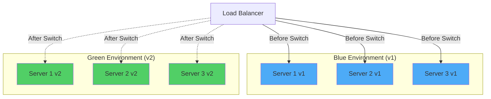
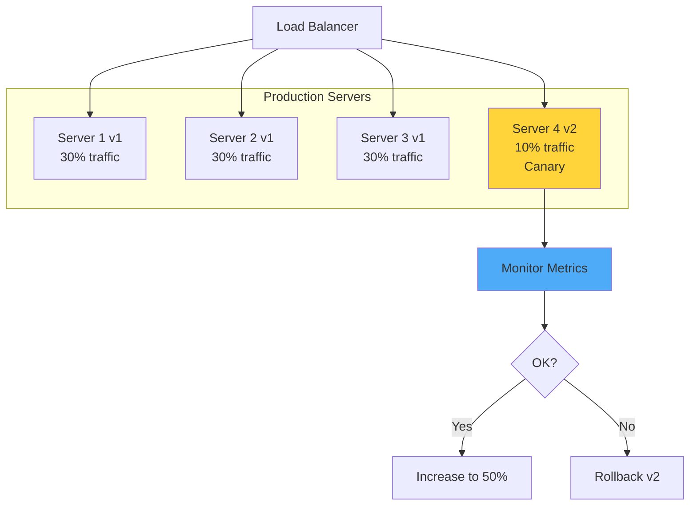
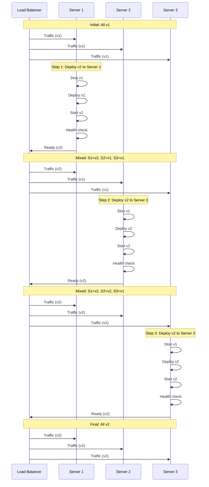
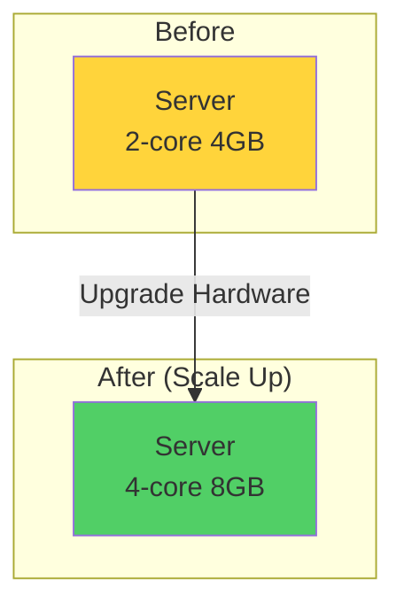
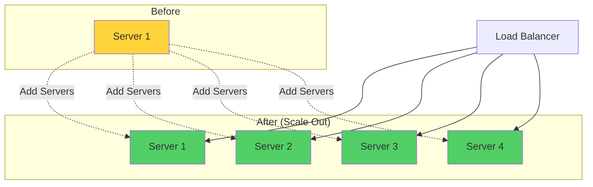
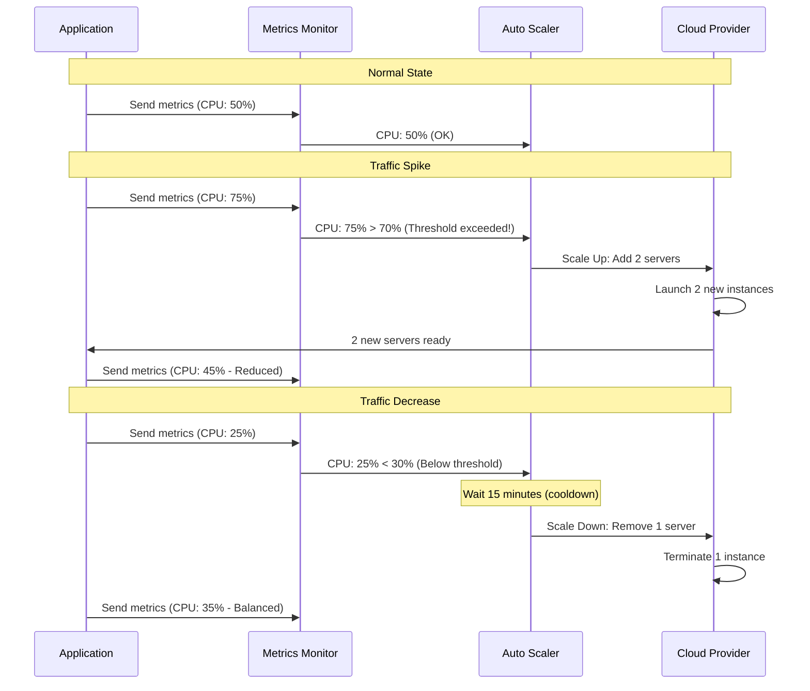
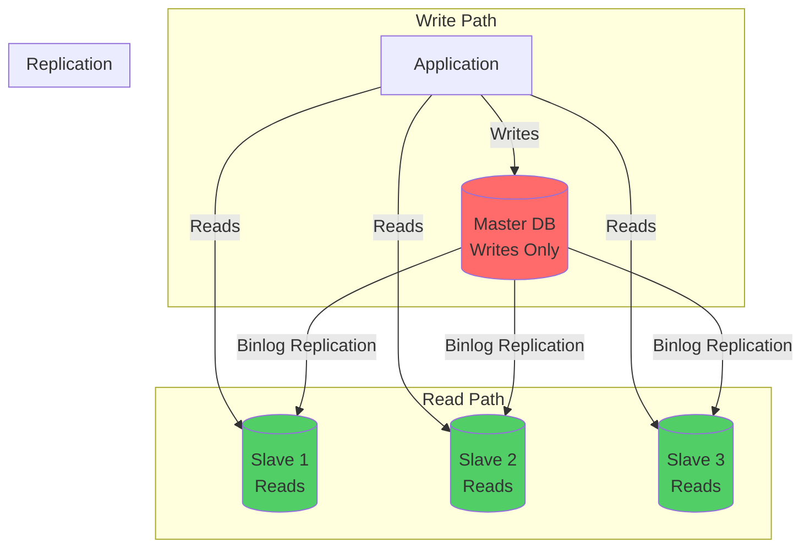

# Phần 8: High Availability (Kiến trúc cao khả dụng)

Tài liệu này bổ sung các kiến thức về thiết kế hệ thống có độ sẵn sàng cao, khả năng chịu lỗi và phục hồi nhanh.

---

## 8.1. High Availability Fundamentals (Cơ bản về Cao khả dụng)

### 8.1.1. High Availability là gì?

**High Availability (HA)** là khả năng hệ thống tiếp tục hoạt động ngay cả khi một hoặc nhiều thành phần bị lỗi, đảm bảo **uptime** cao (thường là 99.9% trở lên).

**Các chỉ số quan trọng:**

| Availability | Downtime/Year | Downtime/Month | Use Case |
|-------------|---------------|----------------|----------|
| **99%** (2 nines) | 87.6 hours | 7.2 hours | Internal tools |
| **99.9%** (3 nines) | 8.76 hours | 43.2 minutes | Business apps |
| **99.99%** (4 nines) | 52.56 minutes | 4.32 minutes | Critical systems |
| **99.999%** (5 nines) | 5.26 minutes | 25.9 seconds | Financial, Telecom |

**Ví dụ**: 99.99% = Hệ thống chỉ được down tối đa **52 phút/năm**!

### 8.1.2. ⭐ Single Point of Failure (SPOF)

**SPOF** là thành phần duy nhất trong hệ thống, nếu nó lỗi → toàn bộ hệ thống sập.

**Ví dụ SPOF:**
- ❌ **1 Database server** (không có replica)
- ❌ **1 Application server** (không có load balancer)
- ❌ **1 Network switch** (không có backup)
- ❌ **1 Power supply** (không có UPS)

**Giải pháp**: **Redundancy (Dự phòng)** - Luôn có ít nhất 2 instances cho mỗi component quan trọng.

---

## 8.2. ⭐ Rate Limiting (Giới hạn tần suất)

### 8.2.1. Tại sao cần Rate Limiting?

**Mục đích:**
1. **Bảo vệ hệ thống**: Ngăn chặn DDoS, brute force attacks
2. **Fair usage**: Đảm bảo tài nguyên công bằng cho mọi user
3. **Cost control**: Giới hạn chi phí API calls (cloud billing)

### 8.2.2. ⭐ Rate Limiting Algorithms

#### 1. Fixed Window (Cửa sổ cố định)

**Cơ chế:**
- Chia thời gian thành các cửa sổ cố định (ví dụ: 1 phút)
- Mỗi cửa sổ cho phép N requests
- Reset counter khi cửa sổ mới bắt đầu

**Ví dụ**: 100 requests/phút
```
[0:00 - 1:00] → 100 requests allowed
[1:00 - 2:00] → Reset, 100 requests allowed again
```

**Vấn đề:**
- **Thundering Herd**: Nếu reset lúc 1:00:00, có thể có 200 requests trong 1 giây (100 cuối cửa sổ cũ + 100 đầu cửa sổ mới)

**Implementation (Redis):**
```java
public boolean isAllowed(String key, int limit, int windowSeconds) {
    String redisKey = "rate_limit:" + key;
    long current = System.currentTimeMillis() / 1000;
    long window = current / windowSeconds;
    
    String windowKey = redisKey + ":" + window;
    long count = redis.incr(windowKey);
    redis.expire(windowKey, windowSeconds);
    
    return count <= limit;
}
```

#### 2. ⭐ Sliding Window Log (Cửa sổ trượt - Log)

**Cơ chế:**
- Lưu timestamp của mỗi request
- Đếm số requests trong cửa sổ trượt (ví dụ: 60 giây gần nhất)
- Nếu < limit → cho phép, ngược lại → từ chối

**Ưu điểm:**
- Chính xác hơn Fixed Window
- Không có thundering herd

**Nhược điểm:**
- Tốn memory (lưu tất cả timestamps)
- Không scale tốt với high traffic

**Implementation:**
```java
public boolean isAllowed(String key, int limit, int windowSeconds) {
    String redisKey = "rate_limit:" + key;
    long now = System.currentTimeMillis();
    long windowStart = now - windowSeconds * 1000;
    
    // Remove old entries
    redis.zremrangeByScore(redisKey, 0, windowStart);
    
    // Count current requests
    long count = redis.zcard(redisKey);
    
    if (count < limit) {
        redis.zadd(redisKey, now, UUID.randomUUID().toString());
        redis.expire(redisKey, windowSeconds);
        return true;
    }
    return false;
}
```

#### 3. ⭐ Token Bucket (Thùng Token)

**Cơ chế:**
- Có một "thùng" chứa tokens
- Tokens được thêm vào thùng với tốc độ cố định (refill rate)
- Mỗi request tiêu tốn 1 token
- Nếu hết token → từ chối

**Ví dụ:**
- Bucket size: 100 tokens
- Refill rate: 10 tokens/second
- Request đến → Lấy 1 token → Còn 99
- Sau 1 giây → Thêm 10 tokens → Có thể lên 100 (không vượt quá bucket size)

**Ưu điểm:**
- Cho phép **burst traffic** (nếu bucket đầy, có thể xử lý nhiều requests cùng lúc)
- Smooth rate limiting

**Implementation:**
```java
public class TokenBucket {
    private final int capacity;        // Bucket size
    private final double refillRate;   // Tokens per second
    private double tokens;             // Current tokens
    private long lastRefill;           // Last refill timestamp
    
    public synchronized boolean tryConsume(int tokensNeeded) {
        refill();
        if (tokens >= tokensNeeded) {
            tokens -= tokensNeeded;
            return true;
        }
        return false;
    }
    
    private void refill() {
        long now = System.currentTimeMillis();
        double elapsed = (now - lastRefill) / 1000.0;
        tokens = Math.min(capacity, tokens + elapsed * refillRate);
        lastRefill = now;
    }
}
```

#### 4. ⭐ Leaky Bucket (Thùng rò rỉ)

**Cơ chế:**
- Requests được thêm vào queue (bucket)
- Requests được xử lý với tốc độ cố định (leak rate)
- Nếu queue đầy → từ chối

**Khác với Token Bucket:**
- **Token Bucket**: Cho phép burst (nếu có tokens)
- **Leaky Bucket**: Làm mịn traffic (không cho burst)

**Use case**: Bảo vệ downstream service khỏi traffic spike

### 8.2.3. Rate Limiting Implementation

**1. In-Memory (Local)**
- Dùng `Guava RateLimiter` hoặc tự implement
- **Nhược điểm**: Không share giữa nhiều servers

**2. Redis (Distributed)**
- Dùng Redis để share rate limit state
- **Ưu điểm**: Hoạt động với cluster
- **Framework**: `Bucket4j`, `Redis Rate Limiter`

**3. API Gateway**
- Nginx, Kong, Spring Cloud Gateway đều có rate limiting built-in
- **Ưu điểm**: Centralized, không cần code

---

## 8.3. ⭐ Circuit Breaker (Ngắt mạch)

### 8.3.1. Circuit Breaker Pattern

**Mục đích**: Ngăn chặn **cascade failure** (lỗi dây chuyền) khi downstream service bị lỗi.

**3 trạng thái:**

1. **CLOSED (Đóng - Bình thường)**
   - Requests đi qua bình thường
   - Đếm số lỗi
   - Nếu lỗi > threshold → Chuyển sang OPEN

2. **OPEN (Mở - Ngắt)**
   - **Từ chối tất cả requests** ngay lập tức (không gọi downstream)
   - Trả về fallback response (cached data, default value)
   - Sau một thời gian (timeout) → Chuyển sang HALF_OPEN

3. **HALF_OPEN (Nửa mở - Thử nghiệm)**
   - Cho phép một số requests đi qua để test
   - Nếu thành công → CLOSED
   - Nếu vẫn lỗi → OPEN lại

**Diagram:**
```
CLOSED → (errors > threshold) → OPEN → (timeout) → HALF_OPEN
  ↑                                                      ↓
  └────────────────────────────────────────────────────┘
              (success in HALF_OPEN)
```

### 8.3.2. ⭐ Hystrix vs Resilience4j vs Sentinel

| Framework | Status | Features | Use Case |
|-----------|--------|----------|----------|
| **Hystrix** | **Deprecated** (Netflix) | Circuit Breaker, Fallback, Thread Pool Isolation | Legacy systems |
| **Resilience4j** | **Active** | Circuit Breaker, Rate Limiter, Retry, Bulkhead | Modern Java apps |
| **Sentinel** (Alibaba) | **Active** | Flow Control, Circuit Breaker, System Protection | High concurrency |

**Resilience4j Example:**
```java
CircuitBreaker circuitBreaker = CircuitBreaker.ofDefaults("backendService");

Supplier<String> decorated = CircuitBreaker.decorateSupplier(
    circuitBreaker,
    () -> backendService.call()
);

String result = Try.ofSupplier(decorated)
    .recover(throwable -> "Fallback response")
    .get();
```

### 8.3.3. Circuit Breaker Configuration

**Key parameters:**
- **Failure Rate Threshold**: % lỗi để mở circuit (ví dụ: 50%)
- **Wait Duration**: Thời gian chờ trước khi chuyển OPEN → HALF_OPEN (ví dụ: 60s)
- **Ring Buffer Size**: Số requests để tính failure rate (ví dụ: 100)
- **Half-Open Max Calls**: Số requests cho phép trong HALF_OPEN (ví dụ: 10)

---

## 8.4. ⭐ Degradation & Fallback (Giảm cấp & Dự phòng)

### 8.4.1. Service Degradation

**Degradation** là giảm chức năng khi hệ thống quá tải, đảm bảo **core features** vẫn hoạt động.

**Ví dụ:**
- **Bình thường**: Hiển thị đầy đủ thông tin sản phẩm (giá, mô tả, đánh giá, khuyến mãi)
- **Degraded**: Chỉ hiển thị tên, giá, hình ảnh (bỏ đánh giá, khuyến mãi)

**Strategies:**
1. **Turn off non-essential features**: Tắt tính năng phụ
2. **Return cached data**: Trả về data cũ (stale but available)
3. **Return default values**: Trả về giá trị mặc định
4. **Queue requests**: Đưa requests vào queue, xử lý sau

### 8.4.2. Fallback Mechanisms

**Fallback** là phương án dự phòng khi service chính thất bại.

**Types:**
1. **Static Fallback**: Trả về giá trị cố định
   ```java
   @HystrixCommand(fallbackMethod = "getDefaultProduct")
   public Product getProduct(Long id) {
       return productService.getById(id);
   }
   
   public Product getDefaultProduct(Long id) {
       return new Product(id, "Product Unavailable", 0.0);
   }
   ```

2. **Cache Fallback**: Trả về data từ cache
   ```java
   public Product getProduct(Long id) {
       try {
           return productService.getById(id);
       } catch (Exception e) {
           return cache.get("product:" + id);  // Stale data
       }
   }
   ```

3. **Alternative Service Fallback**: Gọi service dự phòng
   ```java
   public Product getProduct(Long id) {
       try {
           return primaryService.getById(id);
       } catch (Exception e) {
           return backupService.getById(id);  // Backup DB
       }
   }
   ```

---

## 8.5. Timeout & Retry (Hết thời gian & Thử lại)

### 8.5.1. ⭐ Timeout Strategy

**Tại sao cần Timeout?**
- Tránh **hanging requests** (request treo mãi)
- Giải phóng resources nhanh chóng
- Cải thiện user experience

**Timeout Levels:**
1. **Connection Timeout**: Thời gian chờ kết nối (ví dụ: 5s)
2. **Read Timeout**: Thời gian chờ đọc data (ví dụ: 10s)
3. **Total Timeout**: Tổng thời gian cho phép (ví dụ: 30s)

**Best Practices:**
- **Short timeout** cho critical paths (user-facing)
- **Longer timeout** cho background jobs
- **Exponential backoff** khi retry

### 8.5.2. ⭐ Retry Strategy

**Khi nào nên Retry?**
- ✅ **Transient errors**: Network timeout, temporary DB lock
- ❌ **Permanent errors**: 404 Not Found, 401 Unauthorized, Validation errors

**Retry Patterns:**

**1. Simple Retry (Fixed Interval)**
```java
int maxRetries = 3;
int retryCount = 0;
while (retryCount < maxRetries) {
    try {
        return callService();
    } catch (Exception e) {
        retryCount++;
        Thread.sleep(1000);  // Wait 1s
    }
}
```

**2. ⭐ Exponential Backoff (Khuyến nghị)**
```java
int maxRetries = 5;
long baseDelay = 100;  // 100ms
for (int i = 0; i < maxRetries; i++) {
    try {
        return callService();
    } catch (Exception e) {
        if (i == maxRetries - 1) throw e;
        long delay = baseDelay * (1L << i);  // 100ms, 200ms, 400ms, 800ms, 1600ms
        Thread.sleep(delay);
    }
}
```

**3. Jitter (Ngẫu nhiên hóa)**
- Thêm random vào delay để tránh **thundering herd**
- Ví dụ: `delay = baseDelay * (1L << i) + random(0, 100)`

**Resilience4j Retry:**
```java
Retry retry = Retry.of("backendService", RetryConfig.custom()
    .maxAttempts(3)
    .waitDuration(Duration.ofMillis(1000))
    .retryOnException(e -> e instanceof TimeoutException)
    .build());

Supplier<String> decorated = Retry.decorateSupplier(retry, () -> callService());
```

---

## 8.6. Redundancy & Disaster Recovery (Dự phòng & Phục hồi thảm họa)

### 8.6.1. Redundancy Types

**1. Active-Active (Hoạt động-Hoạt động)**
- Tất cả instances đều xử lý traffic
- **Ưu điểm**: Tận dụng tối đa resources
- **Nhược điểm**: Cần đồng bộ data real-time

**2. Active-Passive (Hoạt động-Dự phòng)**
- 1 instance active, 1+ instances standby
- **Ưu điểm**: Đơn giản, data consistency dễ đảm bảo
- **Nhược điểm**: Lãng phí resources (standby không làm gì)

**3. N+1 Redundancy**
- N instances cần thiết + 1 instance dự phòng
- Ví dụ: Cần 3 servers → Deploy 4 servers

### 8.6.2. Disaster Recovery (DR)

**RTO (Recovery Time Objective)**: Thời gian tối đa cho phép hệ thống down
- **RTO = 1 hour**: Hệ thống phải phục hồi trong 1 giờ

**RPO (Recovery Point Objective)**: Lượng data tối đa có thể mất
- **RPO = 15 minutes**: Chỉ mất tối đa 15 phút data (backup mỗi 15 phút)

**DR Strategies:**

**1. Backup & Restore**
- Backup định kỳ → Lưu offsite
- Khi disaster → Restore từ backup
- **RTO**: Vài giờ đến vài ngày
- **RPO**: Tùy backup frequency

**2. Pilot Light**
- Giữ infrastructure tối thiểu chạy (database, network)
- Khi disaster → Scale up nhanh
- **RTO**: Vài phút đến vài giờ

**3. Warm Standby**
- Duplicate environment chạy ở chế độ reduced capacity
- Khi disaster → Scale up và switch traffic
- **RTO**: Vài phút

**4. Multi-Site Active-Active**
- 2+ data centers đều active
- **RTO**: Gần như 0 (chỉ cần route traffic)
- **Chi phí**: Cao nhất

---

## 8.7. Health Checks & Monitoring (Kiểm tra sức khỏe & Giám sát)

### 8.7.1. Health Check Endpoints

**Spring Boot Actuator:**
```yaml
management:
  endpoints:
    web:
      exposure:
        include: health,info,metrics
  endpoint:
    health:
      show-details: always
```

**Health Check Types:**
- **Liveness**: Service có đang chạy không?
- **Readiness**: Service sẵn sàng nhận traffic chưa? (DB connected, dependencies OK)

**Custom Health Indicator:**
```java
@Component
public class DatabaseHealthIndicator implements HealthIndicator {
    @Override
    public Health health() {
        if (checkDatabase()) {
            return Health.up()
                .withDetail("database", "Available")
                .build();
        }
        return Health.down()
            .withDetail("database", "Unavailable")
            .build();
    }
}
```

### 8.7.2. Monitoring & Alerting

**Key Metrics:**
1. **System Metrics**: CPU, Memory, Disk, Network
2. **Application Metrics**: Request rate, Error rate, Latency (P50, P95, P99)
3. **Business Metrics**: Orders/min, Revenue, Active users

**Tools:**
- **Prometheus + Grafana**: Metrics collection & visualization
- **ELK Stack**: Log aggregation (Elasticsearch, Logstash, Kibana)
- **APM**: Application Performance Monitoring (New Relic, Datadog, SkyWalking)

**Alerting Rules:**
- Error rate > 5% → Alert
- Latency P99 > 1s → Alert
- CPU > 80% for 5 minutes → Alert

---

## 8.8. ⭐ Deployment Strategies (Chiến lược Triển khai)

### 8.8.1. Deployment là gì?

**Deployment** là quá trình đưa code mới lên production environment.

**Vấn đề:**
- Làm sao deploy mà **không downtime**?
- Làm sao **rollback** nhanh nếu có lỗi?
- Làm sao **test** code mới trên production traffic?

### 8.8.2. ⭐ Deployment Strategies

#### 1. ⭐ Blue-Green Deployment (Khuyến nghị)

**Cơ chế:**
- **Blue**: Production environment hiện tại (đang chạy)
- **Green**: Environment mới với code mới
- Deploy code mới lên Green → Test → Switch traffic từ Blue → Green

**Flow:**
```
1. Deploy v2 lên Green environment
2. Test Green environment
3. Switch load balancer: Blue → Green
4. Monitor Green
5. Nếu OK → Shutdown Blue
6. Nếu lỗi → Switch back: Green → Blue (rollback)
```

**Ưu điểm:**
- ✅ **Zero downtime**: Switch traffic ngay lập tức
- ✅ **Fast rollback**: Switch back trong vài giây
- ✅ **Safe**: Test trước khi switch

**Nhược điểm:**
- ❌ **Cost**: Cần 2x resources (Blue + Green)
- ❌ **Database migration**: Phải backward compatible

**Use case**: Production-critical applications

**Diagram (Blue-Green Deployment):**


**Giải thích chi tiết:**

**Phase 1: Deploy Green**
- Deploy code mới (v2) lên Green environment
- Green environment chạy song song với Blue (nhưng chưa nhận traffic)
- Test Green environment để đảm bảo hoạt động đúng

**Phase 2: Switch Traffic**
- Load Balancer chuyển 100% traffic từ Blue → Green
- **Instant switch**: Chỉ cần thay đổi config → Zero downtime
- Blue environment vẫn chạy (standby)

**Phase 3: Monitor & Decision**
- Monitor Green environment (error rate, latency, CPU)
- **Nếu OK**: Shutdown Blue environment → Tiết kiệm resources
- **Nếu lỗi**: Switch back Blue → Rollback trong vài giây

**Ưu điểm chi tiết:**
- **Zero downtime**: Switch traffic ngay lập tức, không có gap
- **Fast rollback**: Chỉ cần switch lại config → < 10 giây
- **Safe testing**: Test Green trước khi switch → Giảm risk
- **No version mixing**: Chỉ có 1 version active tại một thời điểm

#### 2. ⭐ Canary Deployment

**Cơ chế:**
- Deploy code mới lên **một phần nhỏ** servers (ví dụ: 10%)
- Monitor metrics (error rate, latency)
- Nếu OK → Gradually tăng traffic (10% → 50% → 100%)
- Nếu lỗi → Rollback ngay

**Flow:**
```
1. Deploy v2 lên 1 server (10% traffic)
2. Monitor: Error rate, Latency, CPU
3. Nếu OK → Tăng lên 50% servers
4. Nếu OK → Tăng lên 100% servers
5. Nếu lỗi → Rollback (shutdown v2 servers)
```

**Ưu điểm:**
- ✅ **Risk mitigation**: Chỉ ảnh hưởng 10% users
- ✅ **Gradual rollout**: Tăng dần, an toàn
- ✅ **Cost-effective**: Không cần 2x resources

**Nhược điểm:**
- ❌ **Complex**: Cần load balancer hỗ trợ traffic splitting
- ❌ **Slower**: Mất thời gian để rollout 100%

**Use case**: Large-scale applications, A/B testing

**Diagram (Canary Deployment):**


**Giải thích chi tiết:**

**Phase 1: Deploy Canary (10%)**
- Deploy v2 lên **1 server** (10% traffic)
- **Traffic splitting**: Load balancer route 10% requests đến v2, 90% đến v1
- **Monitor metrics**: Error rate, Latency (P95, P99), CPU, Memory

**Phase 2: Evaluate (5-15 phút)**
- **Success criteria**: 
  - Error rate < 0.1%
  - Latency P95 < 500ms
  - CPU < 70%
- **Nếu OK**: Tiến đến Phase 3
- **Nếu lỗi**: Rollback ngay (shutdown v2 server)

**Phase 3: Gradual Rollout**
- **10% → 50%**: Deploy v2 lên thêm 2 servers (50% traffic)
- **Monitor 10 phút** → Nếu OK
- **50% → 100%**: Deploy v2 lên tất cả servers
- **Monitor 10 phút** → Nếu OK → Hoàn thành

**Ưu điểm chi tiết:**
- **Risk mitigation**: Chỉ 10% users bị ảnh hưởng nếu có lỗi
- **Early detection**: Phát hiện lỗi sớm trước khi rollout 100%
- **Cost-effective**: Không cần duplicate environment
- **Data-driven**: Quyết định dựa trên metrics thực tế

#### 3. Rolling Deployment

**Cơ chế:**
- Deploy code mới lên **từng server một** (hoặc từng batch)
- Mỗi server: Stop → Deploy → Start → Health check → Next server

**Flow:**
```
1. Deploy v2 lên Server 1 → Health check → OK
2. Deploy v2 lên Server 2 → Health check → OK
3. Deploy v2 lên Server 3 → Health check → OK
4. ... (tiếp tục cho đến hết)
```

**Diagram (Rolling Deployment):**


**Giải thích chi tiết:**

**Rolling Update Process:**
1. **Server 1**: Stop v1 → Deploy v2 → Start v2 → Health check → Nhận traffic
2. **Server 2**: Tương tự (trong khi Server 1 đang chạy v2)
3. **Server 3**: Tương tự (trong khi Server 1,2 đang chạy v2)

**Version Mixing Period:**
- Trong quá trình deploy, có thể có cả v1 và v2 cùng chạy
- **Yêu cầu**: API phải **backward compatible** (v2 phải đọc được data từ v1)
- **Database migration**: Phải backward compatible (add columns nullable, không xóa columns)

**Health Check:**
- Sau khi deploy, server phải pass health check trước khi nhận traffic
- **Liveness probe**: Service có đang chạy không?
- **Readiness probe**: Service sẵn sàng nhận traffic chưa? (DB connected, dependencies OK)

**Ưu điểm:**
- ✅ **No downtime**: Luôn có servers đang chạy
- ✅ **Resource efficient**: Chỉ cần 1 environment
- ✅ **Simple**: Dễ implement

**Nhược điểm:**
- ❌ **Slow**: Mất thời gian deploy từng server
- ❌ **Version mixing**: Có thể có cả v1 và v2 cùng chạy (cần backward compatible)
- ❌ **Rollback phức tạp**: Phải rollback từng server

**Use case**: Stateless services, Kubernetes deployments

#### 4. Recreate Deployment

**Cơ chế:**
- **Stop tất cả** servers → Deploy code mới → **Start lại**

**Flow:**
```
1. Stop all servers (downtime!)
2. Deploy v2
3. Start all servers
```

**Ưu điểm:**
- ✅ **Simple**: Đơn giản nhất
- ✅ **No version mixing**: Chỉ có 1 version

**Nhược điểm:**
- ❌ **Downtime**: Service down trong lúc deploy
- ❌ **No rollback**: Khó rollback nhanh

**Use case**: Development, Staging (không dùng production!)

#### 5. A/B Testing Deployment

**Cơ chế:**
- Deploy 2 versions (A và B) cùng lúc
- Route traffic theo **user attributes** (user_id, location, etc.)
- Compare metrics → Chọn version tốt hơn

**Flow:**
```
Load Balancer
    ↓
[Version A] (50% users) ← Compare metrics → [Version B] (50% users)
    ↓
Choose better version → Full rollout
```

**Use case**: Feature testing, UI changes

### 8.8.3. ⭐ Deployment Strategy Comparison

| Strategy | Downtime | Rollback Speed | Cost | Complexity | Use Case |
|----------|----------|----------------|------|------------|----------|
| **Blue-Green** | ❌ Zero | ⚡ Very Fast | 💰💰 High | Medium | Production-critical |
| **Canary** | ❌ Zero | ⚡ Fast | 💰 Medium | High | Large-scale apps |
| **Rolling** | ❌ Zero | 🐌 Slow | 💰 Low | Low | Stateless services |
| **Recreate** | ✅ Yes | 🐌 Slow | 💰 Low | Very Low | Dev/Staging only |
| **A/B Testing** | ❌ Zero | ⚡ Fast | 💰💰 High | Very High | Feature testing |

### 8.8.4. ⭐ Best Practices

**1. Database Migration Strategy**
- **Backward compatible**: Code mới phải đọc được schema cũ
- **Two-phase migration**:
  - Phase 1: Add new columns (nullable) → Deploy code mới
  - Phase 2: Migrate data → Remove old columns

**2. Feature Flags**
```java
// Toggle feature on/off without deployment
if (featureFlag.isEnabled("new-payment-flow")) {
    // New code
} else {
    // Old code
}
```

**3. Health Checks**
- **Liveness**: Service có đang chạy?
- **Readiness**: Service sẵn sàng nhận traffic? (DB connected, dependencies OK)
- Load balancer chỉ route traffic đến healthy instances

**4. Monitoring During Deployment**
- **Key metrics**: Error rate, Latency, CPU, Memory
- **Alerting**: Auto-rollback nếu metrics vượt threshold

**5. Gradual Rollout**
- Start với 1% traffic → 5% → 10% → 50% → 100%
- Monitor mỗi bước → Chỉ tăng nếu OK

---

## 8.9. ⭐ Auto Scaling (Tự động Mở rộng)

### 8.9.1. Scaling là gì?

**Scaling** = Tăng/giảm resources để đáp ứng traffic.

**2 loại Scaling:**

**1. Vertical Scaling (Scale Up/Down)**
- Tăng **specs** của server hiện tại (CPU, RAM)
- **Ví dụ**: 2-core 4GB → 4-core 8GB

**2. Horizontal Scaling (Scale Out/In)**
- Tăng **số lượng** servers
- **Ví dụ**: 2 servers → 4 servers

### 8.9.2. ⭐ Vertical vs Horizontal Scaling

**Vertical Scaling (Scale Up) - Mở rộng dọc:**


**Horizontal Scaling (Scale Out) - Mở rộng ngang:**


| Tiêu chí | Vertical Scaling | Horizontal Scaling |
|----------|------------------|-------------------|
| **Cách làm** | Upgrade server specs | Thêm/bớt servers |
| **Downtime** | ✅ Có (phải restart) | ❌ Không |
| **Cost** | 💰💰 Expensive (bigger servers) | 💰 Cheaper (more small servers) |
| **Limit** | ❌ Có giới hạn (max CPU/RAM) | ✅ Không giới hạn |
| **Complexity** | ✅ Đơn giản | ❌ Phức tạp (load balancing, state) |
| **Use case** | Small apps, Monolith | Large apps, Microservices |

**Giải thích chi tiết:**

**Vertical Scaling:**
- **Cách làm**: Nâng cấp phần cứng server (CPU, RAM, Disk)
- **Ví dụ**: 2-core 4GB → 4-core 8GB → 8-core 16GB
- **Downtime**: Phải restart server để apply changes → Service down
- **Cost**: Server lớn hơn đắt hơn nhiều (không linear)
- **Limit**: Có giới hạn vật lý (max CPU/RAM của server)
- **Use case**: Ứng dụng nhỏ, Monolith, không thể scale ngang

**Horizontal Scaling:**
- **Cách làm**: Thêm nhiều servers nhỏ hơn
- **Ví dụ**: 1 server → 2 servers → 4 servers → 8 servers
- **Downtime**: Không có (thêm server mới → Route traffic)
- **Cost**: Rẻ hơn (nhiều servers nhỏ < 1 server lớn)
- **Limit**: Không giới hạn (có thể thêm hàng nghìn servers)
- **Complexity**: Cần load balancer, state management (stateless design)
- **Use case**: Ứng dụng lớn, Microservices, Cloud-native

**Kết luận**: **Horizontal Scaling** là best practice cho production.

### 8.9.3. ⭐ Auto Scaling Strategies

#### 1. Manual Scaling

**Cơ chế**: Admin manually tăng/giảm servers.

**Vấn đề:**
- ❌ Phản ứng chậm (traffic spike → phải manual scale)
- ❌ Over-provisioning (lãng phí resources)
- ❌ Under-provisioning (service down)

#### 2. ⭐ Scheduled Scaling

**Cơ chế**: Scale theo **lịch trình** (schedule).

**Ví dụ:**
```yaml
# Scale up vào giờ cao điểm
Schedule: 9:00 AM - 6:00 PM (Business hours)
  → Scale to 10 servers

# Scale down vào ban đêm
Schedule: 6:00 PM - 9:00 AM
  → Scale to 2 servers
```

**Use case**: Traffic có pattern cố định (e-commerce: cao điểm cuối tuần)

#### 3. ⭐ Reactive Scaling (Metric-based)

**Cơ chế**: Scale dựa trên **metrics** (CPU, Memory, Request rate).

**Flow:**
```
1. Monitor metrics (CPU > 70%)
2. Trigger scale-up policy
3. Add new servers
4. Monitor metrics (CPU < 30%)
5. Trigger scale-down policy
6. Remove servers
```

**Diagram (Reactive Scaling Flow):**


**Giải thích chi tiết:**

**Scale-Up Trigger:**
- **Condition**: CPU > 70% trong 5 phút liên tục
- **Action**: Thêm 2 servers mới
- **Cooldown**: Đợi 5 phút trước khi scale tiếp (tránh oscillation)
- **Result**: CPU giảm xuống ~45% (traffic được phân tán)

**Scale-Down Trigger:**
- **Condition**: CPU < 30% trong 15 phút liên tục
- **Action**: Xóa 1 server (conservative - xóa từng cái một)
- **Cooldown**: 15 phút (lâu hơn scale-up để tránh scale down quá nhanh)
- **Result**: CPU tăng lên ~35% (balanced)

**Metrics thường dùng:**
- **CPU Utilization**: > 70% → Scale up, < 30% → Scale down
- **Memory Utilization**: > 80% → Scale up
- **Request Rate**: > 1000 req/s → Scale up
- **Queue Depth**: > 1000 messages → Scale up consumers
- **Error Rate**: > 5% → Scale up (có thể do overload)

**Metrics thường dùng:**
- **CPU Utilization**: > 70% → Scale up, < 30% → Scale down
- **Memory Utilization**: > 80% → Scale up
- **Request Rate**: > 1000 req/s → Scale up
- **Queue Depth**: > 1000 messages → Scale up

**Example (Kubernetes HPA):**
```yaml
apiVersion: autoscaling/v2
kind: HorizontalPodAutoscaler
metadata:
  name: user-service-hpa
spec:
  scaleTargetRef:
    apiVersion: apps/v1
    kind: Deployment
    name: user-service
  minReplicas: 2
  maxReplicas: 10
  metrics:
  - type: Resource
    resource:
      name: cpu
      target:
        type: Utilization
        averageUtilization: 70
```

#### 4. ⭐ Predictive Scaling (ML-based)

**Cơ chế**: Dùng **Machine Learning** để dự đoán traffic → Scale trước.

**Flow:**
```
1. Analyze historical traffic patterns
2. ML model predicts: "Traffic sẽ tăng 50% trong 10 phút"
3. Auto scale-up trước khi traffic tăng
4. Prevent overload
```

**Ưu điểm:**
- ✅ **Proactive**: Scale trước khi traffic tăng
- ✅ **Smooth**: Không có sudden spikes

**Nhược điểm:**
- ❌ **Complex**: Cần ML infrastructure
- ❌ **Cost**: Có thể over-provision

**Use case**: Large-scale systems (AWS Auto Scaling, Google Cloud)

### 8.9.4. ⭐ Auto Scaling Policies

#### Scale-Up Policy

**When to scale up:**
- CPU > 70% for 5 minutes
- Memory > 80% for 5 minutes
- Request rate > threshold
- Error rate tăng (có thể do overload)

**How to scale:**
- **Add instances**: +2 servers mỗi lần
- **Cooldown period**: Đợi 5 phút trước khi scale tiếp (tránh oscillation)

#### Scale-Down Policy

**When to scale down:**
- CPU < 30% for 15 minutes
- Memory < 50% for 15 minutes
- Request rate < threshold

**How to scale:**
- **Remove instances**: -1 server mỗi lần (conservative)
- **Cooldown period**: Đợi 15 phút (lâu hơn scale-up để tránh scale down quá nhanh)

#### Scale Limits

**Min Replicas**: Luôn giữ tối thiểu N servers (ví dụ: 2)
- **Lý do**: High availability, handle sudden traffic

**Max Replicas**: Giới hạn tối đa N servers (ví dụ: 20)
- **Lý do**: Control cost, prevent runaway scaling

### 8.9.5. ⭐ Auto Scaling Best Practices

**1. Health Checks**
- Chỉ scale khi instances **healthy**
- Không scale nếu instances đang unhealthy

**2. Gradual Scaling**
- Scale **từng bước** (ví dụ: +2 servers mỗi lần)
- Tránh scale quá nhanh → Waste resources

**3. Cooldown Periods**
- **Scale-up cooldown**: 5 phút (ngắn, phản ứng nhanh)
- **Scale-down cooldown**: 15 phút (dài, tránh scale down quá nhanh)

**4. Multiple Metrics**
- Không chỉ dựa vào 1 metric (ví dụ: CPU)
- Combine: CPU + Memory + Request rate

**5. Predictive Alerts**
- Alert trước khi scale (ví dụ: "CPU đang tăng, sẽ scale trong 2 phút")
- Admin có thể can thiệp nếu cần

**6. Cost Optimization**
- **Schedule-based**: Scale down vào ban đêm
- **Spot instances**: Dùng spot instances cho non-critical workloads

### 8.9.6. ⭐ Auto Scaling Implementation

#### Kubernetes HPA (Horizontal Pod Autoscaler)

```yaml
apiVersion: autoscaling/v2
kind: HorizontalPodAutoscaler
metadata:
  name: api-hpa
spec:
  scaleTargetRef:
    apiVersion: apps/v1
    kind: Deployment
    name: api-service
  minReplicas: 2
  maxReplicas: 10
  metrics:
  - type: Resource
    resource:
      name: cpu
      target:
        type: Utilization
        averageUtilization: 70
  - type: Resource
    resource:
      name: memory
      target:
        type: Utilization
        averageUtilization: 80
  behavior:
    scaleUp:
      stabilizationWindowSeconds: 0
      policies:
      - type: Percent
        value: 100
        periodSeconds: 15
      - type: Pods
        value: 2
        periodSeconds: 15
      selectPolicy: Max
    scaleDown:
      stabilizationWindowSeconds: 300
      policies:
      - type: Percent
        value: 50
        periodSeconds: 60
      selectPolicy: Min
```

#### AWS Auto Scaling Group

```json
{
  "AutoScalingGroupName": "web-servers",
  "MinSize": 2,
  "MaxSize": 10,
  "DesiredCapacity": 4,
  "TargetTrackingScalingPolicies": [
    {
      "PolicyName": "cpu-target-70",
      "TargetValue": 70.0,
      "PredefinedMetricSpecification": {
        "PredefinedMetricType": "ASGAverageCPUUtilization"
      }
    }
  ]
}
```

---

## 8.10. ⭐ Component-Specific Scaling (Scaling theo từng Component)

### 8.10.1. ⭐ Message Queue Scaling

#### Kafka Scaling

**Horizontal Scaling (Scale Out):**

**1. Partition Scaling**
```
Topic: orders
Partitions: 3 → 6 → 12 (tăng partitions)
```

**Cơ chế:**
- Mỗi partition = 1 consumer thread
- Thêm partitions → Thêm consumers → Tăng throughput
- **Lưu ý**: Không thể giảm partitions (data loss risk)

**2. Broker Scaling**
```
Brokers: 3 → 6 → 12 (thêm broker nodes)
```

**Cơ chế:**
- Thêm broker → Rebalance partitions
- Mỗi broker handle một phần partitions
- **Throughput**: Linear scaling (2x brokers ≈ 2x throughput)

**3. Consumer Group Scaling**
```
Consumer Group: 3 consumers → 6 consumers → 12 consumers
```

**Cơ chế:**
- Mỗi partition chỉ được consume bởi 1 consumer trong group
- Thêm consumers → Chia partitions tốt hơn
- **Max consumers**: ≤ số partitions (nếu nhiều hơn → idle consumers)

**Kafka Scaling Example:**
```bash
# Tăng partitions của topic
kafka-topics.sh --alter --topic orders --partitions 12 --bootstrap-server localhost:9092

# Thêm brokers vào cluster
# 1. Start new broker với config
# 2. Kafka tự động rebalance partitions

# Scale consumer group
# Chỉ cần start thêm consumer instances
# Kafka tự động assign partitions
```

**Vertical Scaling (Scale Up):**
- Tăng CPU/RAM của broker
- Tăng disk I/O (SSD, NVMe)
- **Limit**: Single broker có giới hạn

#### RabbitMQ Scaling

**Horizontal Scaling:**

**1. Cluster Scaling**
```
Nodes: 1 → 3 → 5 (thêm RabbitMQ nodes)
```

**Cơ chế:**
- **Queue Mirroring**: Replicate queues across nodes
- **Load Distribution**: Connections distributed across nodes
- **High Availability**: Node down → Other nodes continue

**2. Queue Scaling**
```
Queues: 10 → 20 → 50 (tăng số queues)
Consumers: 10 → 20 → 50 (tăng consumers)
```

**Cơ chế:**
- Mỗi queue có thể có nhiều consumers (round-robin)
- Thêm queues → Parallel processing

**RabbitMQ Cluster Setup:**
```bash
# Node 1 (Master)
rabbitmq-server

# Node 2 (Join cluster)
rabbitmqctl stop_app
rabbitmqctl join_cluster rabbit@node1
rabbitmqctl start_app

# Enable queue mirroring
rabbitmqctl set_policy ha-all "^" '{"ha-mode":"all"}'
```

**Vertical Scaling:**
- Tăng memory (RabbitMQ memory-based)
- Tăng disk I/O
- **Limit**: Single node có giới hạn

#### Message Queue Scaling Comparison

| MQ | Horizontal Scaling | Vertical Scaling | Best Practice |
|----|-------------------|------------------|--------------|
| **Kafka** | ✅ Excellent (Partitions + Brokers) | ⚠️ Limited | Scale horizontally |
| **RabbitMQ** | ✅ Good (Cluster) | ⚠️ Limited | Cluster + Queue mirroring |
| **RocketMQ** | ✅ Excellent (Brokers + Queues) | ⚠️ Limited | Scale horizontally |

### 8.10.2. ⭐ Database Scaling

#### Vertical Scaling (Scale Up)

**Cơ chế:**
- Upgrade server specs: CPU, RAM, Disk
- **Ví dụ**: 4-core 16GB → 8-core 32GB → 16-core 64GB

**Ưu điểm:**
- ✅ Đơn giản (không cần thay đổi code)
- ✅ Không cần sharding logic

**Nhược điểm:**
- ❌ **Cost**: Expensive (bigger servers cost nhiều hơn)
- ❌ **Limit**: Có giới hạn (max CPU/RAM của server)
- ❌ **Downtime**: Phải restart để upgrade

**Use case**: Small-medium applications, Monolith

#### Horizontal Scaling (Scale Out)

**1. Read Replicas (Read Scaling)**
```
Master: 1 (writes)
Slaves: 2 → 4 → 8 (reads)
```

**Cơ chế:**
- Master handle writes
- Slaves replicate từ Master (binlog)
- App route reads → Slaves, writes → Master

**Diagram (Read Replicas Architecture):**


**Scaling:**
- Thêm slaves → Tăng read capacity
- **Linear scaling**: 2x slaves ≈ 2x read throughput

**Giải thích chi tiết:**

**Write Path:**
- Tất cả writes (INSERT, UPDATE, DELETE) → Master
- Master ghi vào binlog (transaction log)
- Master commit transaction → Return success

**Replication:**
- Slaves connect đến Master
- Master stream binlog events đến Slaves
- Slaves apply events → Replicate data
- **Replication lag**: Slaves có thể chậm hơn Master vài giây

**Read Path:**
- Application route reads → Slaves (round-robin hoặc least connections)
- **Read scaling**: Thêm Slaves → Tăng read throughput
- **Load distribution**: Read traffic được phân tán

**Vấn đề:**
- **Replication lag**: Read từ Slave có thể thấy data cũ (eventual consistency)
- **Solution**: Read critical data từ Master, read non-critical từ Slaves

**2. Sharding (Write Scaling)**
```
Shards: 1 → 4 → 16 → 64
```

**Cơ chế:**
- Chia database/table thành nhiều shards
- Mỗi shard trên server riêng
- App route queries dựa trên shard key

**Sharding Strategies:**

**a. Range-based Sharding**
```
Shard 1: user_id 0-1M
Shard 2: user_id 1M-2M
Shard 3: user_id 2M-3M
```

**b. Hash-based Sharding**
```
Shard = hash(user_id) % N
```

**c. Directory-based Sharding**
```
Lookup table: user_id → shard_id
```

**Database Sharding Example:**
```java
// Shard routing logic
public class ShardRouter {
    private static final int SHARD_COUNT = 16;
    
    public String getShard(Long userId) {
        int shardId = (int) (userId % SHARD_COUNT);
        return "db_shard_" + shardId;
    }
    
    public void insertUser(User user) {
        String shard = getShard(user.getId());
        // Insert into shard
        shardDatasource.get(shard).insert(user);
    }
}
```

**3. Database Scaling Best Practices**

**Initial Design:**
- **Start big**: 32 shards × 32 tables = 1024 tables (đủ cho nhiều năm)
- **Route rule**: `shard = id % 32`, `table = (id / 32) % 32`

**Expansion:**
- **Double shards**: 32 → 64 → 128 (multiply by 2)
- **Data migration**: DBA migrate data, app chỉ cần update config
- **No code change**: Route rule không đổi

**Challenges:**
- ❌ **Cross-shard queries**: Khó join giữa shards
- ❌ **Transactions**: Distributed transaction phức tạp
- ❌ **Rebalancing**: Data migration tốn thời gian

### 8.10.3. ⭐ Compute/Application Scaling

#### Stateless Application Scaling

**Horizontal Scaling (Recommended):**

**Cơ chế:**
- Application **stateless** (không lưu session state)
- Thêm application servers → Load balancer distribute traffic

**Flow:**
```
Load Balancer
    ↓
[App Server 1] [App Server 2] [App Server 3] ... [App Server N]
    ↓
Shared: Database, Cache, Message Queue
```

**Scaling:**
```
Servers: 2 → 4 → 8 → 16
Throughput: 2x → 4x → 8x → 16x (linear scaling)
```

**Best Practices:**
- ✅ **Stateless design**: Không lưu state trong memory
- ✅ **Session externalization**: Lưu session trong Redis/DB
- ✅ **Health checks**: Load balancer chỉ route đến healthy instances

#### Stateful Application Scaling

**Vấn đề:**
- Application có state (session, cache trong memory)
- Không thể scale ngang dễ dàng

**Solutions:**

**1. Session Affinity (Sticky Sessions)**
```
Load Balancer → Route same user → Same server
```

**Nhược điểm:**
- ❌ Không load balance tốt (một số servers quá tải)
- ❌ Server down → User mất session

**2. Session Externalization**
```
Session → Redis/Database (shared)
Any server → Read session from Redis
```

**Ưu điểm:**
- ✅ True horizontal scaling
- ✅ Server down → Session vẫn còn

**3. State Sharding**
```
State sharded by user_id
User 1-1M → Server 1
User 1M-2M → Server 2
```

### 8.10.4. ⭐ Cache Scaling

#### Redis Scaling

**1. Vertical Scaling (Scale Up)**
```
Memory: 8GB → 16GB → 32GB → 64GB
```

**Limit:**
- ❌ Single instance có giới hạn (max ~500GB practical)
- ❌ Expensive

**2. Horizontal Scaling (Scale Out)**

**a. Redis Cluster (Sharding)**
```
Nodes: 3 → 6 → 12 (thêm nodes)
Shards: 16384 hash slots distributed across nodes
```

**Cơ chế:**
- Data sharded across nodes (hash slots)
- Mỗi node handle một phần keys
- **Automatic failover**: Node down → Replica promote

**b. Redis Sentinel (High Availability)**
```
Master: 1
Replicas: 2 → 4 (thêm replicas for read scaling)
```

**Cơ chế:**
- Master handle writes
- Replicas handle reads
- Sentinel monitor và failover

**Redis Scaling Example:**
```bash
# Redis Cluster: Add node
redis-cli --cluster add-node new-node:6379 existing-node:6379

# Redis Sentinel: Add replica
# 1. Start Redis replica
# 2. Configure replica to replicate from master
# 3. Sentinel auto-discover
```

### 8.10.5. ⭐ Storage Scaling

#### Object Storage Scaling (S3, OSS)

**Horizontal Scaling (Automatic):**
- Object storage **tự động scale**
- Thêm objects → Không cần config
- **Unlimited**: Scale đến petabytes

**Cơ chế:**
- Objects distributed across multiple servers
- **Sharding**: Hash(object_key) → Storage node

#### File System Scaling

**1. Network File System (NFS)**
- **Vertical**: Upgrade NFS server
- **Horizontal**: Distributed file systems (GlusterFS, Ceph)

**2. Block Storage**
- **Vertical**: Larger disks
- **Horizontal**: Distributed block storage (Ceph, HDFS)

### 8.10.6. ⭐ Scaling Strategy Summary

| Component | Vertical Scaling | Horizontal Scaling | Best Practice |
|-----------|-----------------|-------------------|---------------|
| **Application** | ⚠️ Limited | ✅ Excellent | Horizontal (stateless) |
| **Database** | ⚠️ Limited | ✅ Excellent | Horizontal (sharding + replicas) |
| **Message Queue** | ⚠️ Limited | ✅ Excellent | Horizontal (partitions/brokers) |
| **Cache (Redis)** | ⚠️ Limited | ✅ Excellent | Horizontal (cluster) |
| **Storage** | ⚠️ Limited | ✅ Excellent | Horizontal (distributed) |
| **Load Balancer** | ✅ Good | ✅ Excellent | Both (depends on type) |

**General Rule:**
- ✅ **Horizontal Scaling** là best practice (unlimited, cost-effective)
- ⚠️ **Vertical Scaling** chỉ dùng khi không thể scale ngang (legacy systems)

### 8.10.7. ⭐ Scaling Metrics & Monitoring

**Key Metrics to Monitor:**

**1. Application Metrics**
- **Request Rate**: Requests/second
- **Response Time**: P50, P95, P99 latency
- **Error Rate**: Errors/second
- **CPU/Memory**: Utilization percentage

**2. Database Metrics**
- **QPS**: Queries per second
- **Connection Pool**: Active connections
- **Replication Lag**: Slave delay (seconds)
- **Disk I/O**: Read/Write operations

**3. Message Queue Metrics**
- **Message Rate**: Messages/second (produce/consume)
- **Queue Depth**: Messages waiting
- **Consumer Lag**: Delay between produce and consume
- **Partition Distribution**: Balance across partitions

**4. Cache Metrics**
- **Hit Rate**: Cache hits / total requests
- **Memory Usage**: Used / Total memory
- **Eviction Rate**: Keys evicted per second

**Scaling Triggers:**
```
CPU > 70% for 5 minutes → Scale up
Memory > 80% for 5 minutes → Scale up
Request rate > threshold → Scale up
Error rate > 5% → Scale up (may indicate overload)
Queue depth > 1000 → Scale consumers
Replication lag > 10s → Add read replicas
```

---

## Tổng kết Phần 8: High Availability

Đã hoàn thành **Phần 8: High Availability** với các kiến thức thiết yếu:

✅ **8.1. Fundamentals**: Availability levels, SPOF, Redundancy
✅ **8.2. Rate Limiting**: Fixed Window, Sliding Window, Token Bucket, Leaky Bucket
✅ **8.3. Circuit Breaker**: Hystrix, Resilience4j, Sentinel, 3 states
✅ **8.4. Degradation & Fallback**: Service degradation strategies, fallback types
✅ **8.5. Timeout & Retry**: Timeout levels, Exponential backoff, Jitter
✅ **8.6. Disaster Recovery**: RTO/RPO, DR strategies (Backup, Pilot Light, Warm Standby, Multi-Site)
✅ **8.7. Monitoring**: Health checks, Metrics, Alerting
✅ **8.8. Deployment Strategies**: Blue-Green, Canary, Rolling, Recreate, A/B Testing với comparison và best practices
✅ **8.9. Auto Scaling**: Vertical vs Horizontal, Scheduled/Reactive/Predictive scaling, Auto Scaling policies, Implementation (K8s HPA, AWS)
✅ **8.10. Component-Specific Scaling**:
  - **Message Queue Scaling**: Kafka (Partitions, Brokers, Consumers), RabbitMQ (Cluster, Queue Mirroring)
  - **Database Scaling**: Vertical vs Horizontal, Read Replicas, Sharding strategies (Range, Hash, Directory)
  - **Compute Scaling**: Stateless vs Stateful applications, Session management
  - **Cache Scaling**: Redis Cluster vs Sentinel, Vertical vs Horizontal
  - **Storage Scaling**: Object storage, File systems
  - **Scaling Metrics**: Key metrics to monitor, Scaling triggers

**Tổng cộng: ~2,000+ lines** kiến thức High Availability toàn diện với Deployment Strategies, Auto Scaling và Component-Specific Scaling chi tiết cho production systems!

---

*Kết thúc Phần 8 - High Availability*
