# System Design Solutions - NAVER Interview Preparation

## 1. Design a Scalable Messaging System (LINE Messenger)

### Requirements
- 200 triệu users
- Chat 1-1, group chat (up to 500 members)
- Media sharing, push notifications
- 1 tỷ messages/ngày peak load
- Low latency (<1s delivery)
- High availability (99.99%)

### High-Level Architecture

```
[Mobile/Web Clients]
         ↓
[API Gateway + Load Balancer]
         ↓
[WebSocket Servers] ←→ [Session Service (Redis)]
         ↓
[Message Queue (Kafka)]
         ↓
    ┌────┴────┐
    ↓         ↓
[Chat Service] [Notification Service]
    ↓         ↓
[Message DB]  [FCM/APNs]
(Cassandra)
    ↓
[Media Storage (S3/CDN)]
```

### Architecture Diagram (Mermaid)

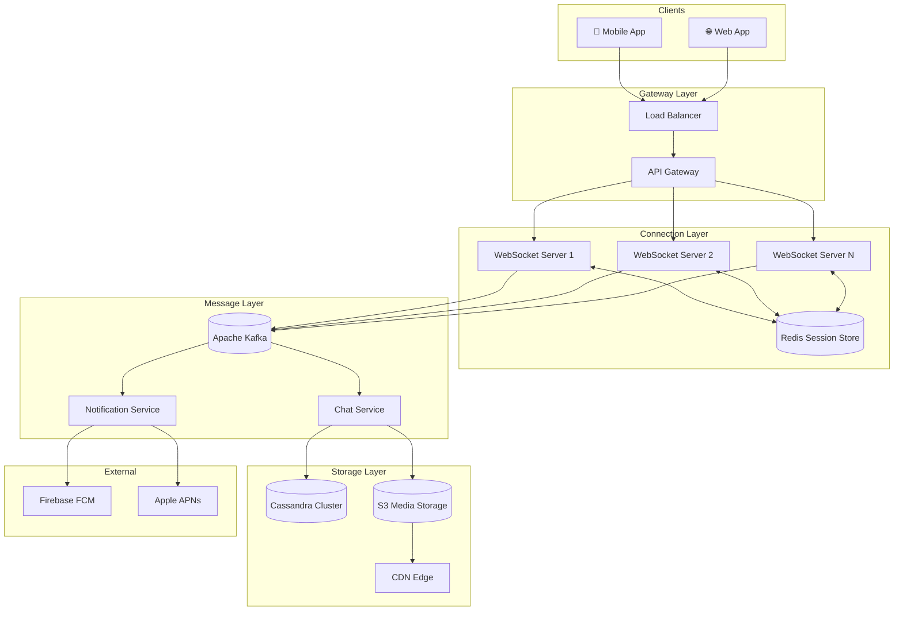
```mermaid
graph TB
    subgraph Clients
        Mobile[📱 Mobile App]
        Web[🌐 Web App]
    end
    
    subgraph Gateway Layer
        LB[Load Balancer]
        API[API Gateway]
    end
    
    subgraph Connection Layer
        WS1[WebSocket Server 1]
        WS2[WebSocket Server 2]
        WSN[WebSocket Server N]
        Session[(Redis Session Store)]
    end
    
    subgraph Message Layer
        Kafka[(Apache Kafka)]
        ChatSvc[Chat Service]
        NotifSvc[Notification Service]
    end
    
    subgraph Storage Layer
        Cassandra[(Cassandra Cluster)]
        S3[(S3 Media Storage)]
        CDN[CDN Edge]
    end
    
    subgraph External
        FCM[Firebase FCM]
        APNs[Apple APNs]
    end
    
    Mobile --> LB
    Web --> LB
    LB --> API
    API --> WS1 & WS2 & WSN
    WS1 & WS2 & WSN <--> Session
    WS1 & WS2 & WSN --> Kafka
    Kafka --> ChatSvc
    Kafka --> NotifSvc
    ChatSvc --> Cassandra
    ChatSvc --> S3
    S3 --> CDN
    NotifSvc --> FCM
    NotifSvc --> APNs
```

### Message Flow - Sequence Diagram

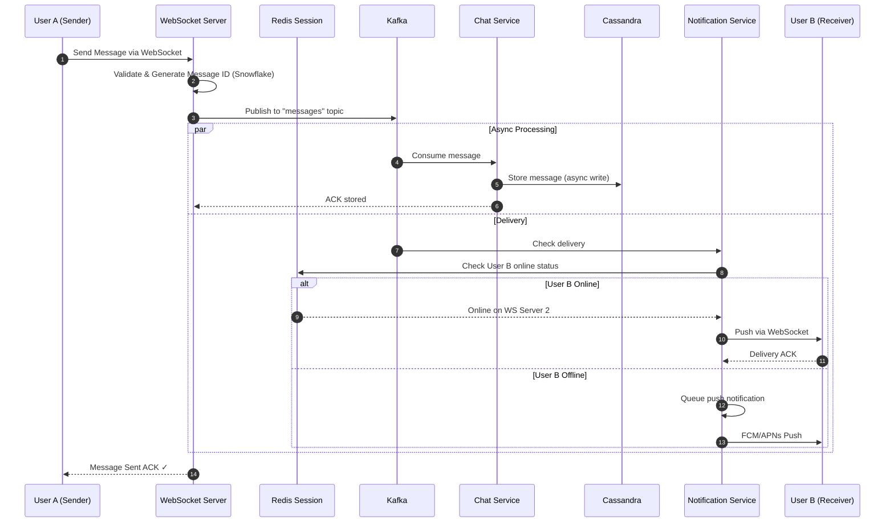
```mermaid
sequenceDiagram
    autonumber
    participant A as User A (Sender)
    participant WS as WebSocket Server
    participant Redis as Redis Session
    participant Kafka as Kafka
    participant Chat as Chat Service
    participant DB as Cassandra
    participant Notif as Notification Service
    participant B as User B (Receiver)
    
    A->>WS: Send Message via WebSocket
    WS->>WS: Validate & Generate Message ID (Snowflake)
    WS->>Kafka: Publish to "messages" topic
    
    par Async Processing
        Kafka->>Chat: Consume message
        Chat->>DB: Store message (async write)
        Chat-->>WS: ACK stored
    and Delivery
        Kafka->>Notif: Check delivery
        Notif->>Redis: Check User B online status
        alt User B Online
            Redis-->>Notif: Online on WS Server 2
            Notif->>B: Push via WebSocket
            B-->>Notif: Delivery ACK
        else User B Offline
            Notif->>Notif: Queue push notification
            Notif->>B: FCM/APNs Push
        end
    end
    
    WS-->>A: Message Sent ACK ✓
```

### Group Chat Fan-out Strategy

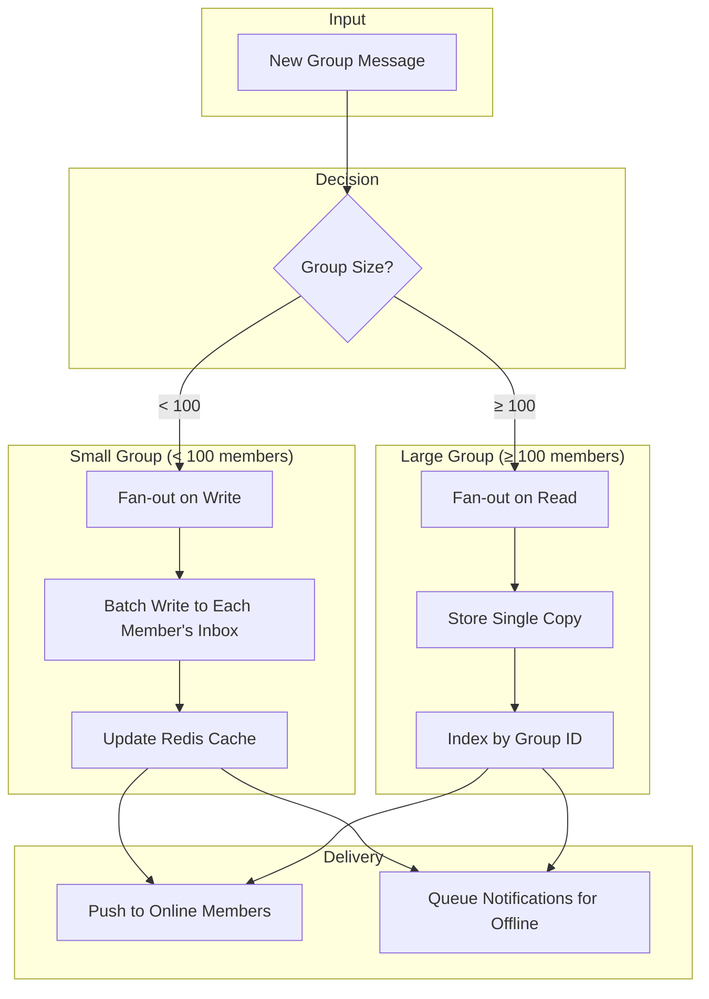
```mermaid
flowchart TB
    subgraph Input
        MSG[New Group Message]
    end
    
    subgraph Decision
        CHECK{Group Size?}
    end
    
    subgraph SmallGroup["Small Group (< 100 members)"]
        FANOUT_WRITE[Fan-out on Write]
        BATCH[Batch Write to Each Member's Inbox]
        CACHE[Update Redis Cache]
    end
    
    subgraph LargeGroup["Large Group (≥ 100 members)"]
        FANOUT_READ[Fan-out on Read]
        STORE[Store Single Copy]
        INDEX[Index by Group ID]
    end
    
    subgraph Delivery
        ONLINE[Push to Online Members]
        OFFLINE[Queue Notifications for Offline]
    end
    
    MSG --> CHECK
    CHECK -->|< 100| FANOUT_WRITE
    CHECK -->|≥ 100| FANOUT_READ
    
    FANOUT_WRITE --> BATCH --> CACHE
    FANOUT_READ --> STORE --> INDEX
    
    CACHE --> ONLINE
    CACHE --> OFFLINE
    INDEX --> ONLINE
    INDEX --> OFFLINE
```

### Capacity Estimation

| Metric | Calculation | Value |
|--------|-------------|-------|
| **Daily Messages** | Given | 1 billion/day |
| **Messages/Second** | 1B / 86400 | ~11,574 msg/s |
| **Peak Messages/Second** | 3x average | ~35,000 msg/s |
| **Storage/Message** | avg 500 bytes | 500 bytes |
| **Daily Storage** | 1B × 500B | ~500 GB/day |
| **Monthly Storage** | 30 × 500GB | ~15 TB/month |
| **WebSocket Connections** | 200M × 10% online | 20M concurrent |
| **WS Servers Needed** | 20M / 50K per server | ~400 servers |
| **Kafka Partitions** | 35K/s / 1K per partition | ~35 partitions |

### Trade-offs & Design Decisions

| Decision | Choice | Trade-off |
|----------|--------|-----------|
| **Message Ordering** | Eventual Consistency | ✅ High throughput, ⚠️ May see out-of-order briefly |
| **Database** | Cassandra | ✅ Write-optimized, ⚠️ No complex queries |
| **Delivery Guarantee** | At-least-once | ✅ No message loss, ⚠️ Client handles duplicates |
| **Group Fan-out** | Hybrid (Write/Read) | ✅ Optimal for all sizes, ⚠️ Added complexity |
| **Media Storage** | S3 + CDN | ✅ Scalable, cost-effective, ⚠️ External dependency |

### Core Components

**1. Connection Layer**
- WebSocket servers để maintain persistent connections
- Sticky sessions với consistent hashing
- Heartbeat mechanism (ping/pong) để detect disconnections
- Fallback sang HTTP long-polling nếu WebSocket fail

**2. Message Service**
- Message ID generation: Snowflake algorithm (timestamp + machine ID + sequence)
- Message format: JSON với metadata (sender, receiver, timestamp, type)
- Idempotency: Use message ID để prevent duplicates

**3. Database Design (Cassandra)**
```
// Messages Table
Partition Key: conversation_id
Clustering Key: message_id (timestamp-based)
Columns: sender_id, content, media_url, status, created_at

// User Inbox Table
Partition Key: user_id
Clustering Key: conversation_id, last_message_timestamp
Columns: unread_count, last_message_preview
```

**4. Message Flow**

*Send Message (1-1 Chat):*
1. Client gửi message qua WebSocket → Chat Service
2. Chat Service validates và generate message_id
3. Store vào Cassandra (async)
4. Publish vào Kafka topic "messages"
5. Message Consumer đọc từ Kafka
6. Check receiver online status (Redis)
7. Nếu online: Push qua WebSocket
8. Nếu offline: Queue notification (Kafka → Notification Service)

*Group Chat:*
- Fan-out on write: Tạo N copies cho N members
- Optimization: Batch writes to Cassandra
- Lazy loading: Chỉ fetch recent messages, load older on demand

**5. Scaling Strategies**

- **Horizontal Scaling**: 
  - WebSocket servers: Auto-scale based on connection count
  - Chat service: Stateless microservices
  
- **Database Sharding**:
  - Shard by conversation_id
  - Hot partition handling: Replicate popular groups
  
- **Caching**:
  - Redis: Online users, unread counts, recent messages
  - CDN: Media files (images, videos)

**6. Media Handling**
```
Upload Flow:
Client → Upload Service → S3 → CDN
         ↓
    Generate thumbnail (Lambda)
         ↓
    Return media_url → Chat Service
```

**7. Push Notifications**
- Notification Service subscribe Kafka topic
- Batch notifications per device
- Priority queue: High priority cho mentions, replies
- Rate limiting: Max 10 notifications/minute per user

**8. Reliability & Consistency**

- **At-least-once delivery**: Retry mechanism với exponential backoff
- **Eventual consistency**: Messages có thể arrive out-of-order, client sort by timestamp
- **Conflict resolution**: Last-write-wins (LWW)
- **Offline support**: Local DB (SQLite) trên client, sync khi online

**9. Monitoring**
- Metrics: Message delivery latency, WebSocket connection count, error rates
- Alerts: High latency (>1s), connection drops, Kafka lag
- Distributed tracing: Track message journey across services

### Technical Improvements / Interview Hardening

- **Per-conversation ordering**: Partition Kafka by `conversation_id` để giữ ordering trong 1 conversation; Cassandra clustering key theo `message_id` (time-ordered).
- **Idempotency & dedup**: Deduplicate server-side bằng `message_id` (idempotency store + TTL) để giảm phụ thuộc client; làm rõ retry + ACK semantics.
- **Backpressure & overload**: Khi Kafka lag/DB throttling: shed-load theo user, rate limit theo conversation, circuit breaker, retry + jitter để tránh retry storm.
- **Presence correctness**: Session TTL + heartbeat; xử lý WS server crash bằng lease/ownership trong Redis và rebind connection.
- **Media security**: Signed upload URL, virus/malware scan, quota per user; CDN tokenization để hạn chế hotlink.

---

## 2. Design a Content Recommendation System (WEBTOON)

### Requirements
- 150 triệu users
- 10 triệu content items
- 500M+ recommendations/ngày
- Real-time updates on user interaction
- Minimize cold-start problem

### High-Level Architecture

```
[User Interaction Events]
         ↓
[Event Streaming (Kafka)]
         ↓
    ┌────┴────────────┐
    ↓                 ↓
[Real-time        [Batch Processing]
 Processing]       (Spark)
(Flink/Storm)          ↓
    ↓            [Feature Store]
    ↓                 ↓
[ML Models] ←────────┘
(TensorFlow Serving)
    ↓
[Recommendation API]
    ↓
[Cache (Redis)] → [Clients]
```

### ML Pipeline Architecture (Mermaid)

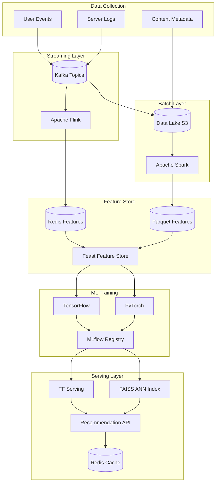
```mermaid
graph TB
    subgraph Data Collection
        Events[User Events]
        Logs[Server Logs]
        Meta[Content Metadata]
    end
    
    subgraph Streaming Layer
        Kafka[(Kafka Topics)]
        Flink[Apache Flink]
    end
    
    subgraph Batch Layer
        S3[(Data Lake S3)]
        Spark[Apache Spark]
    end
    
    subgraph Feature Store
        Online[(Redis Features)]
        Offline[(Parquet Features)]
        Feast[Feast Feature Store]
    end
    
    subgraph ML Training
        TF[TensorFlow]
        Torch[PyTorch]
        MLflow[MLflow Registry]
    end
    
    subgraph Serving Layer
        TFServing[TF Serving]
        FAISS[FAISS ANN Index]
        API[Recommendation API]
        Cache[(Redis Cache)]
    end
    
    Events --> Kafka
    Logs --> Kafka
    Meta --> S3
    
    Kafka --> Flink --> Online
    Kafka --> S3
    S3 --> Spark --> Offline
    
    Online --> Feast
    Offline --> Feast
    
    Feast --> TF --> MLflow
    Feast --> Torch --> MLflow
    
    MLflow --> TFServing
    MLflow --> FAISS
    TFServing --> API
    FAISS --> API
    API --> Cache
```

### Recommendation Flow - Sequence Diagram

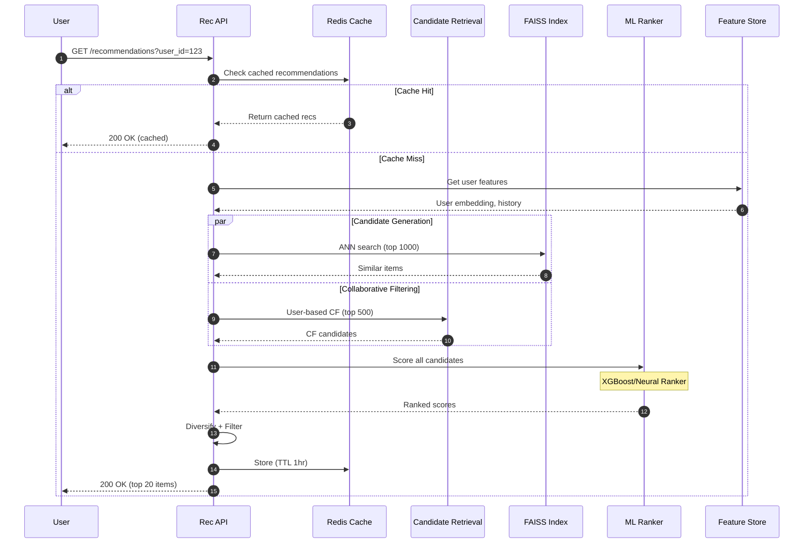
```mermaid
sequenceDiagram
    autonumber
    participant User
    participant API as Rec API
    participant Cache as Redis Cache
    participant Retrieval as Candidate Retrieval
    participant FAISS as FAISS Index
    participant Ranker as ML Ranker
    participant Feature as Feature Store
    
    User->>API: GET /recommendations?user_id=123
    API->>Cache: Check cached recommendations
    
    alt Cache Hit
        Cache-->>API: Return cached recs
        API-->>User: 200 OK (cached)
    else Cache Miss
        API->>Feature: Get user features
        Feature-->>API: User embedding, history
        
        par Candidate Generation
            API->>FAISS: ANN search (top 1000)
            FAISS-->>API: Similar items
        and Collaborative Filtering
            API->>Retrieval: User-based CF (top 500)
            Retrieval-->>API: CF candidates
        end
        
        API->>Ranker: Score all candidates
        Note over Ranker: XGBoost/Neural Ranker
        Ranker-->>API: Ranked scores
        
        API->>API: Diversify + Filter
        API->>Cache: Store (TTL 1hr)
        API-->>User: 200 OK (top 20 items)
    end
```

### Two-Tower Model Architecture

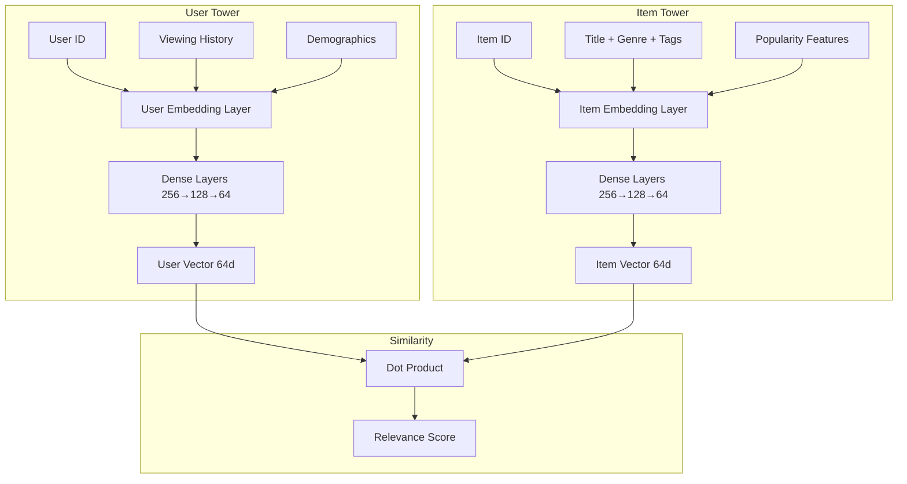
```mermaid
graph TB
    subgraph "User Tower"
        UID[User ID]
        UEMB[User Embedding Layer]
        UHIST[Viewing History]
        UDEMO[Demographics]
        UDENSE[Dense Layers 256→128→64]
        UVEC[User Vector 64d]
    end
    
    subgraph "Item Tower"
        IID[Item ID]
        IEMB[Item Embedding Layer]
        IMETA[Title + Genre + Tags]
        IPOP[Popularity Features]
        IDENSE[Dense Layers 256→128→64]
        IVEC[Item Vector 64d]
    end
    
    subgraph "Similarity"
        DOT[Dot Product]
        SCORE[Relevance Score]
    end
    
    UID --> UEMB
    UHIST --> UEMB
    UDEMO --> UEMB
    UEMB --> UDENSE --> UVEC
    
    IID --> IEMB
    IMETA --> IEMB
    IPOP --> IEMB
    IEMB --> IDENSE --> IVEC
    
    UVEC --> DOT
    IVEC --> DOT
    DOT --> SCORE
```

### Cold Start Strategy

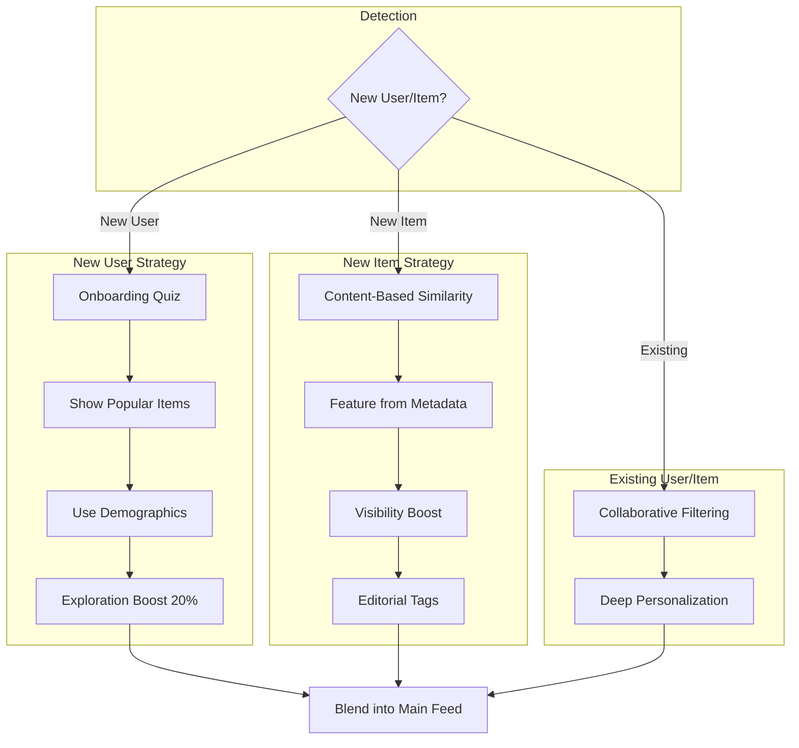
```mermaid
flowchart TB
    subgraph Detection
        NEW{New User/Item?}
    end
    
    subgraph "New User Strategy"
        QUIZ[Onboarding Quiz]
        POPULAR[Show Popular Items]
        DEMO[Use Demographics]
        EXPLORE[Exploration Boost 20%]
    end
    
    subgraph "New Item Strategy"
        CONTENT[Content-Based Similarity]
        FEATURE[Feature from Metadata]
        BOOST[Visibility Boost]
        EDIT[Editorial Tags]
    end
    
    subgraph "Existing User/Item"
        CF[Collaborative Filtering]
        PERSON[Deep Personalization]
    end
    
    NEW -->|New User| QUIZ
    NEW -->|New Item| CONTENT
    NEW -->|Existing| CF
    
    QUIZ --> POPULAR --> DEMO --> EXPLORE
    CONTENT --> FEATURE --> BOOST --> EDIT
    CF --> PERSON
    
    EXPLORE --> BLEND[Blend into Main Feed]
    EDIT --> BLEND
    PERSON --> BLEND
```

### Capacity Estimation

| Metric | Calculation | Value |
|--------|-------------|-------|
| **Daily Recommendations** | Given | 500M/day |
| **Requests/Second** | 500M / 86400 | ~5,787 req/s |
| **Peak Requests/Second** | 3x average | ~17,000 req/s |
| **User Embeddings** | 150M users × 64d × 4B | ~38 GB |
| **Item Embeddings** | 10M items × 64d × 4B | ~2.5 GB |
| **FAISS Index Size** | 10M × 64d | ~2.5 GB RAM |
| **Feature Store (Redis)** | Hot features | ~50 GB |
| **Model Inference Latency** | Target | < 50ms |
| **API Servers Needed** | 17K/s / 500 per server | ~35 servers |

### Trade-offs & Design Decisions

| Decision | Choice | Trade-off |
|----------|--------|-----------|
| **Model Architecture** | Two-Tower | ✅ Fast inference, ⚠️ Limited interaction modeling |
| **Candidate Retrieval** | ANN (FAISS) | ✅ Sub-ms lookup, ⚠️ Approximate results |
| **Feature Storage** | Redis + Feast | ✅ Low latency, ⚠️ Memory cost |
| **Update Frequency** | Near real-time (5min) | ✅ Fresh recommendations, ⚠️ Compute cost |
| **Ranking Model** | XGBoost + Neural | ✅ Explainable + Accurate, ⚠️ Complexity |

### Components Detail

**1. Data Collection**
```javascript
// Event Schema
{
  user_id: "u123",
  item_id: "webtoon456",
  action: "view|like|comment|complete",
  timestamp: 1234567890,
  context: {
    device: "mobile",
    location: "VN",
    session_duration: 300
  }
}
```

- Collect qua API Gateway
- Buffer trong Kafka (partitioned by user_id)
- Retention: 7 days for hot data

**2. Feature Engineering**

*User Features:*
- Demographics: age, gender, location
- Behavior: reading history, genres preferred, time of day patterns
- Engagement: completion rate, avg session time

*Item Features:*
- Content metadata: genre, tags, author, release date
- Popularity: view count, like count, trending score
- Quality signals: completion rate, rating

*Contextual Features:*
- Time: hour, day of week, season
- Device: mobile, web, tablet
- Location: country, city

**3. ML Models**

**Collaborative Filtering (Matrix Factorization)**
```python
# User-Item Matrix
# Use ALS (Alternating Least Squares)
from pyspark.ml.recommendation import ALS

model = ALS(
    rank=100,  # latent factors
    maxIter=10,
    regParam=0.01,
    userCol="user_id",
    itemCol="item_id",
    ratingCol="implicit_rating"  # view=1, like=2, complete=3
)
```

**Deep Learning Model (Two-Tower Architecture)**
```
User Tower:                Item Tower:
[User ID]                  [Item ID]
[User Features]            [Item Features]
    ↓                          ↓
[Embedding Layer]          [Embedding Layer]
    ↓                          ↓
[Dense Layers]             [Dense Layers]
    ↓                          ↓
[User Vector (128d)]       [Item Vector (128d)]
         ↓                 ↓
         └─────→ [Dot Product] → Score
```

**4. Recommendation Strategies**

**Main Feed (Personalized):**
- Retrieve: Candidate generation (1000 items)
  - Collaborative filtering: 400 items
  - Content-based: 300 items
  - Trending: 200 items
  - Diversification: 100 items
  
- Rank: ML model scoring
  - Features: 500+ features
  - Model: Gradient Boosted Trees (XGBoost)
  - Real-time features injection

**Cold Start Solutions:**

*New Users:*
- Onboarding quiz: Chọn favorite genres/authors
- Popular items trong demographics tương tự
- Explore/exploit: 80% personalized, 20% diverse

*New Items:*
- Content-based filtering: Similar to popular items
- Boost visibility: Featured section
- Use editorial tags/metadata

**5. Real-time Processing (Apache Flink)**
```java
// Update user profile real-time
DataStream<Event> events = env.addSource(kafkaConsumer);

events
    .keyBy(Event::getUserId)
    .timeWindow(Time.minutes(5))
    .aggregate(new UserProfileAggregator())
    .addSink(new RedisSink());  // Update user features
```

**6. Serving Layer**

**API Endpoint:**
```
GET /api/recommendations?user_id=123&count=20&context={...}

Response:
{
  "items": [
    {
      "item_id": "webtoon789",
      "score": 0.95,
      "reason": "Because you liked 'Tower of God'"
    }
  ],
  "request_id": "req_xyz",  // for tracking
  "cache": false
}
```

**Caching Strategy:**
- Pre-compute recommendations cho active users (batch job every hour)
- Cache trong Redis: TTL 1 hour
- Key: `recs:user:{user_id}:feed`
- Invalidate on major user actions (completed series, changed preferences)

**7. A/B Testing Framework**

```python
# Experiment configuration
experiments = {
    "rec_model_v2": {
        "traffic": 0.1,  # 10% users
        "variants": ["control", "treatment"],
        "metrics": ["ctr", "completion_rate", "session_time"]
    }
}
```

- Hash user_id để assign variant (consistent)
- Track metrics per variant
- Statistical significance test (t-test)

**8. Offline Evaluation**
- Split data: Train (80%), Validation (10%), Test (10%)
- Metrics:
  - Precision@K, Recall@K
  - NDCG (Normalized Discounted Cumulative Gain)
  - Coverage: % items được recommend
  - Diversity: Genre/author distribution

**9. Model Training Pipeline**

```
[Raw Logs] 
    ↓ 
[ETL (Spark)] → [Feature Store (Feast)]
    ↓
[Train ML Models (daily batch)]
    ↓
[Model Registry (MLflow)]
    ↓
[Validation] 
    ↓
[Deploy to TensorFlow Serving]
```

**10. Scaling Considerations**
- Model serving: TensorFlow Serving with GPU instances
- Feature store: Precompute và cache features
- Approximate Nearest Neighbors (ANN): FAISS for similarity search
- Distributed training: Horovod for multi-GPU

### Technical Improvements / Interview Hardening

- **Online/Offline feature skew**: Dùng cùng feature definitions (Feast) + validation; đảm bảo training-serving parity và backfill strategy.
- **Model ops**: Canary/rollback theo model version; theo dõi drift (CTR/embedding) + latency budget (p99) cho inference.
- **Exploration vs exploitation**: Bandit (epsilon-greedy/UCB/Thompson) cho discovery; guardrail metrics để tránh giảm chất lượng.
- **ANN index refresh**: Quy trình rebuild/incremental update FAISS + warmup; fallback sang CF/trending khi index stale/unavailable.
- **Privacy**: Pseudonymize `user_id`, retention theo loại event; xử lý opt-out (không thu thập/không dùng cho personalization) rõ ràng.

---

## 3. Design a High-Traffic Search Engine (NAVER Search)

### Requirements
- 300 triệu users
- 1 tỷ queries/ngày
- Index billions of web pages
- Sub-second response time
- Handle spam/abuse

### High-Level Architecture

```
[Web Crawlers]
      ↓
[URL Frontier & Politeness]
      ↓
[Content Fetcher]
      ↓
[Content Processor]
(Extract, Clean, Deduplicate)
      ↓
[Indexer (Elasticsearch/Solr)]
      ↓
[Index Shards (distributed)]

[User Query] 
      ↓
[Query Service] → [Cache (Redis)]
      ↓
[Query Rewriter]
      ↓
[Retrieval (Elasticsearch)]
      ↓
[Ranker (ML-based)]
      ↓
[Results] → [User]
```

### System Architecture (Mermaid)

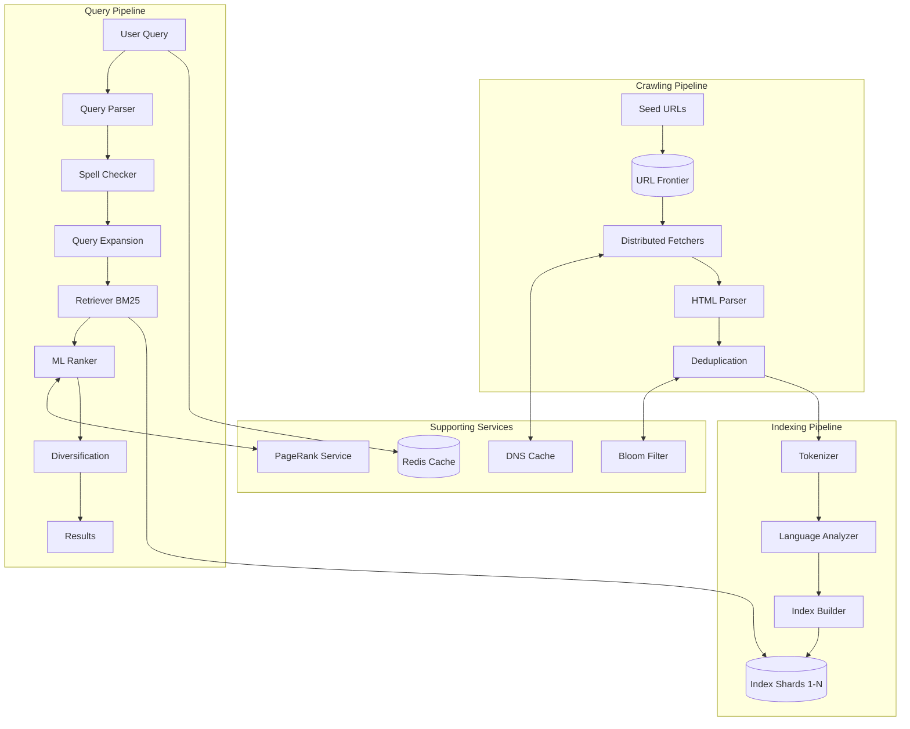
```mermaid
graph TB
    subgraph "Crawling Pipeline"
        Seed[Seed URLs]
        Frontier[(URL Frontier)]
        Fetcher[Distributed Fetchers]
        Parser[HTML Parser]
        Dedup[Deduplication]
    end
    
    subgraph "Indexing Pipeline"
        Tokenizer[Tokenizer]
        Analyzer[Language Analyzer]
        Indexer[Index Builder]
        Shards[(Index Shards 1-N)]
    end
    
    subgraph "Query Pipeline"
        Query[User Query]
        QP[Query Parser]
        Spell[Spell Checker]
        Expand[Query Expansion]
        Retriever[Retriever BM25]
        Ranker[ML Ranker]
        Diverse[Diversification]
        Results[Results]
    end
    
    subgraph "Supporting Services"
        Cache[(Redis Cache)]
        DNS[DNS Cache]
        Bloom[Bloom Filter]
        PageRank[PageRank Service]
    end
    
    Seed --> Frontier
    Frontier --> Fetcher --> Parser --> Dedup
    Dedup --> Tokenizer --> Analyzer --> Indexer --> Shards
    Fetcher <--> DNS
    Dedup <--> Bloom
    
    Query --> Cache
    Query --> QP --> Spell --> Expand --> Retriever
    Retriever --> Shards
    Retriever --> Ranker --> Diverse --> Results
    Ranker <--> PageRank
```

### Web Crawling Pipeline

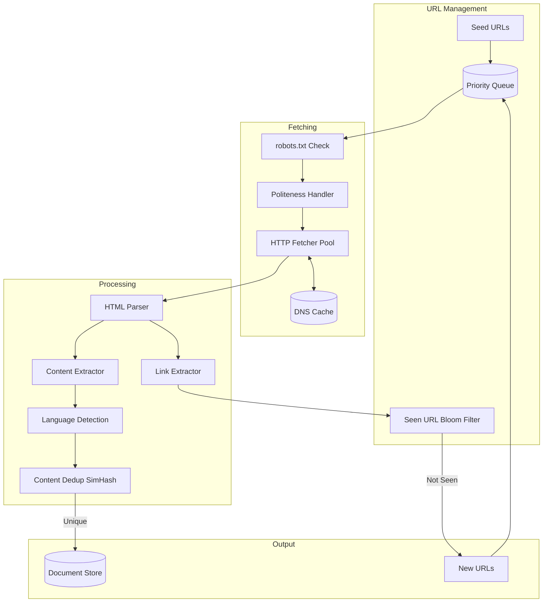
```mermaid
flowchart TB
    subgraph "URL Management"
        SEED[Seed URLs]
        FRONTIER[(Priority Queue)]
        SEEN[Seen URL Bloom Filter]
    end
    
    subgraph "Fetching"
        ROBOTS[robots.txt Check]
        POLITE[Politeness Handler]
        FETCH[HTTP Fetcher Pool]
        DNS[(DNS Cache)]
    end
    
    subgraph "Processing"
        PARSE[HTML Parser]
        EXTRACT[Content Extractor]
        LINKS[Link Extractor]
        LANG[Language Detection]
        DEDUP[Content Dedup SimHash]
    end
    
    subgraph "Output"
        STORE[(Document Store)]
        NEWURLS[New URLs]
    end
    
    SEED --> FRONTIER
    FRONTIER --> ROBOTS --> POLITE
    POLITE --> FETCH
    FETCH <--> DNS
    FETCH --> PARSE --> EXTRACT --> LANG --> DEDUP
    PARSE --> LINKS --> SEEN
    SEEN -->|Not Seen| NEWURLS --> FRONTIER
    DEDUP -->|Unique| STORE
```

### Query Processing Flow

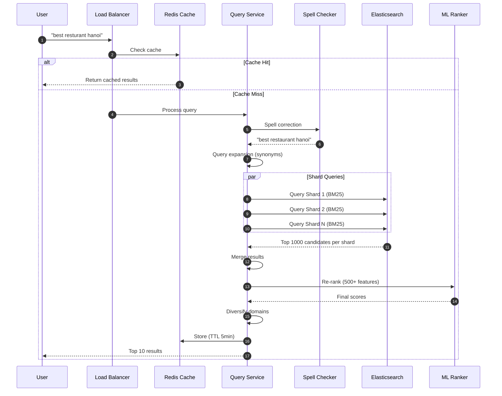
```mermaid
sequenceDiagram
    autonumber
    participant User
    participant LB as Load Balancer
    participant Cache as Redis Cache
    participant QS as Query Service
    participant Spell as Spell Checker
    participant ES as Elasticsearch
    participant Ranker as ML Ranker
    
    User->>LB: "best resturant hanoi" 
    LB->>Cache: Check cache
    
    alt Cache Hit
        Cache-->>User: Return cached results
    else Cache Miss
        LB->>QS: Process query
        QS->>Spell: Spell correction
        Spell-->>QS: "best restaurant hanoi"
        QS->>QS: Query expansion (synonyms)
        
        par Shard Queries
            QS->>ES: Query Shard 1 (BM25)
            QS->>ES: Query Shard 2 (BM25)
            QS->>ES: Query Shard N (BM25)
        end
        
        ES-->>QS: Top 1000 candidates per shard
        QS->>QS: Merge results
        QS->>Ranker: Re-rank (500+ features)
        Ranker-->>QS: Final scores
        QS->>QS: Diversify domains
        QS->>Cache: Store (TTL 5min)
        QS-->>User: Top 10 results
    end
```

### Multi-Stage Ranking Architecture

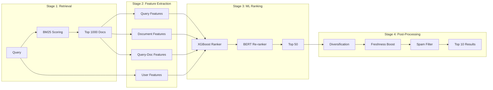
```mermaid
graph LR
    subgraph "Stage 1: Retrieval"
        Q[Query]
        BM25[BM25 Scoring]
        TOP1K[Top 1000 Docs]
    end
    
    subgraph "Stage 2: Feature Extraction"
        QF[Query Features]
        DF[Document Features]
        QDF[Query-Doc Features]
        UF[User Features]
    end
    
    subgraph "Stage 3: ML Ranking"
        XGBR[XGBoost Ranker]
        BERT[BERT Re-ranker]
        TOP50[Top 50]
    end
    
    subgraph "Stage 4: Post-Processing"
        DIV[Diversification]
        FRESH[Freshness Boost]
        FILTER[Spam Filter]
        TOP10[Top 10 Results]
    end
    
    Q --> BM25 --> TOP1K
    TOP1K --> QF & DF & QDF
    Q --> UF
    QF & DF & QDF & UF --> XGBR --> BERT --> TOP50
    TOP50 --> DIV --> FRESH --> FILTER --> TOP10
```

### Capacity Estimation

| Metric | Calculation | Value |
|--------|-------------|-------|
| **Daily Queries** | Given | 1 billion/day |
| **QPS (average)** | 1B / 86400 | ~11,574 QPS |
| **Peak QPS** | 3x average | ~35,000 QPS |
| **Index Size** | 10B pages × 10KB | ~100 TB |
| **Inverted Index** | ~20% of raw | ~20 TB |
| **Index Shards** | 20TB / 500GB per shard | ~40 shards |
| **Replicas per Shard** | HA + Read scaling | 3 replicas |
| **Total Index Storage** | 40 × 3 × 500GB | ~60 TB |
| **Crawler Rate** | 1M pages/hour | ~280 pages/s |
| **Response Time Target** | P99 | < 500ms |

### Trade-offs & Design Decisions

| Decision | Choice | Trade-off |
|----------|--------|-----------|
| **Index Partitioning** | Document-based | ✅ Simple, ⚠️ All shards queried |
| **Retrieval Model** | BM25 | ✅ Fast & proven, ⚠️ Not semantic |
| **Re-ranking** | XGBoost + BERT | ✅ Accurate, ⚠️ Latency cost |
| **Cache Strategy** | Query result cache | ✅ High hit rate, ⚠️ Stale for rare queries |
| **Freshness** | Incremental indexing | ✅ Near real-time, ⚠️ Complexity |

### Core Components

**1. Web Crawling System**

**URL Frontier (Priority Queue):**
```python
# URL Priority Scoring
priority = (
    page_rank * 0.4 +
    freshness_score * 0.3 +
    domain_authority * 0.2 +
    user_engagement * 0.1
)
```

**Politeness & Crawl Rate:**
- robots.txt compliance
- Rate limit: 1 request/second per domain
- Distributed crawlers: 1000+ machines
- DNS caching để reduce latency

**Content Extraction:**
- HTML parsing (BeautifulSoup/Scrapy)
- Extract: Title, headings, body text, meta tags, links
- Remove: Ads, navigation, boilerplate
- Language detection (fastText)

**2. Indexing System**

**Inverted Index Structure:**
```
Term: "vietnam"
Document List: [
  {doc_id: 123, positions: [5, 42], tf: 2, ...},
  {doc_id: 456, positions: [10], tf: 1, ...},
  ...
]
```

**Index Sharding Strategy:**
- Document sharding: Chia documents into shards
- Shard by hash(doc_id) % num_shards
- Each shard: Independent Elasticsearch cluster
- Replicas: 2-3 copies cho high availability

**Index Building:**
```
1. Tokenization: "Hello World" → ["hello", "world"]
2. Normalization: lowercase, stemming
3. Stop words removal: remove "the", "a", "is"
4. Build inverted index
5. Calculate TF-IDF scores
```

**3. Query Processing**

**Query Flow:**
```
Raw Query: "best restaurants hanoi"
    ↓
[Spell Correction]: "best restaurants hanoi"
    ↓
[Query Expansion]: Add synonyms ["top", "good"]
    ↓
[Query Rewrite]: "best OR top restaurants hanoi"
    ↓
[Retrieval]: Fetch top 1000 documents
    ↓
[Ranking]: ML model scores
    ↓
[Top 10 Results]
```

**Spell Correction:**
- Edit distance (Levenshtein)
- Popular queries dictionary
- Use Elasticsearch suggester API

**Query Understanding:**
- Intent classification: Informational, navigational, transactional
- Entity recognition: Location, person, organization
- Query segmentation: "iphone 15 pro" → ["iphone", "15 pro"]

**4. Ranking System**

**Stage 1: Retrieval (Candidate Generation)**
- BM25 scoring trên inverted index
- Retrieve top 1000 documents (fast)

**Stage 2: ML-based Ranking**

*Features (500+):*
- Query features: Length, entity types, intent
- Document features: PageRank, domain authority, freshness, length
- Query-document features: BM25 score, exact match, semantic similarity
- User features: Location, search history, click history

*Model: LambdaMART (Learning to Rank)*
```python
# Training data
(query, doc, label) tuples
label: 0 (not relevant), 1 (relevant), 2 (highly relevant)

# Model
from xgboost import XGBRanker
model = XGBRanker(
    objective='rank:pairwise',
    max_depth=6,
    learning_rate=0.1,
    n_estimators=100
)
```

**Stage 3: Re-ranking & Diversification**
- Diversify results: Different domains, different aspects
- Freshness boost: News articles get temporary boost
- Personalization: Adjust based on user preferences

**5. Spam Detection**

**Content-based Spam Detection:**
- Keyword stuffing detection
- Hidden text detection
- Cloaking detection (show different content to bots)
- Low-quality content (thin content, duplicate)

**Link-based Spam Detection:**
- Link farm detection
- Unnatural link patterns
- PageRank manipulation

**Machine Learning Classifier:**
```python
# Features
features = [
    'keyword_density',
    'outbound_link_count',
    'domain_age',
    'content_quality_score',
    'user_engagement_metrics'
]

# Binary classifier
spam_score = model.predict(features)
if spam_score > 0.8:
    mark_as_spam()
```

**6. Caching Strategy**

**Multi-level Cache:**

*L1 Cache (In-Memory):*
- Most popular queries (top 1%)
- TTL: 5 minutes
- Size: ~10GB per query server

*L2 Cache (Redis):*
- Popular queries (top 10%)
- TTL: 1 hour
- Distributed cache cluster

*L3 Cache (CDN):*
- Static content (images, CSS)
- Long TTL: 24 hours

**Cache Invalidation:**
- Time-based: TTL expiry
- Event-based: Index update trigger invalidation
- Partial invalidation: Only affected queries

**7. Distributed Query Execution**

```
[Query Service]
       ↓
[Query Broker] → Broadcast to all shards
       ↓
   ┌───┴────┬────┬────┐
   ↓        ↓    ↓    ↓
[Shard 1][S2][S3][S4] → Each returns top K
       ↓
[Merge & Re-rank] → Global top K
       ↓
[Results]
```

**8. Personalization**

- User profile: Search history, click behavior, demographics
- Real-time signals: Current location, time, device
- Privacy: Anonymize data, GDPR compliance
- Opt-out option: Allow users to disable personalization

**9. Monitoring & Metrics**

**Query Performance:**
- QPS (Queries Per Second)
- Latency: p50, p95, p99
- Error rate

**Relevance Metrics:**
- CTR (Click-Through Rate)
- Time to first click
- Long clicks (>30s on result page)
- Bounce rate

**System Health:**
- Index freshness
- Crawler success rate
- Cache hit rate

**10. Scaling Strategies**

- **Geo-distribution**: Deploy in multiple regions (US, EU, Asia)
- **Auto-scaling**: Scale query servers based on QPS
- **Index partitioning**: Separate indices for different content types (news, images, videos)
- **Cost optimization**: Use tiered storage (SSD for hot data, HDD for cold)

### Technical Improvements / Interview Hardening

- **Freshness & cache invalidation**: Incremental indexing + index versioning; invalidate query cache theo index generation/version để giảm stale cho hot queries.
- **Shard query optimization**: Query broker hỗ trợ early-terminate, topK merge (heap) + timeout budget per shard.
- **Hybrid lexical + semantic**: BM25 candidates + vector re-rank (RRF/weighted fusion); fallback khi vector index unavailable.
- **Anti-abuse hardening**: Rate limit theo IP/AS, bot detection, spam classifier pipeline + human review loop cho false positives.
- **Crawler safety**: Politeness per domain, adaptive crawl budget, quarantine đối với domains lỗi/timeout.

---

## 4. Design a URL Shortener Service (bit.ly)

### Requirements
- 100 triệu users
- Generate short links
- Redirect <100ms latency
- Analytics (click counts, geo-stats)
- Billions redirects/tháng

### High-Level Architecture

```
[Client Request]
       ↓
[API Gateway + Rate Limiter]
       ↓
    ┌──┴──┐
    ↓     ↓
[Shorten] [Redirect]
Service    Service
    ↓         ↓
[Write]   [Read Cache (Redis)]
    ↓         ↓
[DB Write] [DB Read if cache miss]
(MySQL)    (Replicas)
    ↓
[Analytics Queue (Kafka)]
    ↓
[Analytics Service]
    ↓
[Analytics DB (Cassandra)]
```

### System Architecture (Mermaid)

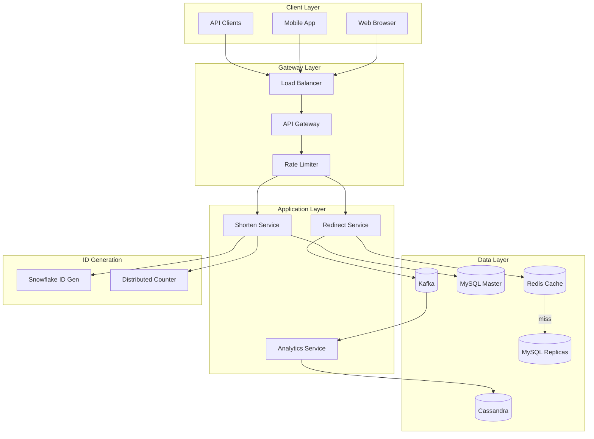
```mermaid
graph TB
    subgraph "Client Layer"
        Web[Web Browser]
        Mobile[Mobile App]
        API[API Clients]
    end
    
    subgraph "Gateway Layer"
        LB[Load Balancer]
        Gateway[API Gateway]
        RateLimit[Rate Limiter]
    end
    
    subgraph "Application Layer"
        Shorten[Shorten Service]
        Redirect[Redirect Service]
        Analytics[Analytics Service]
    end
    
    subgraph "Data Layer"
        Redis[(Redis Cache)]
        MySQL[(MySQL Master)]
        MySQLR[(MySQL Replicas)]
        Kafka[(Kafka)]
        Cassandra[(Cassandra)]
    end
    
    subgraph "ID Generation"
        Snowflake[Snowflake ID Gen]
        Counter[Distributed Counter]
    end
    
    Web & Mobile & API --> LB --> Gateway --> RateLimit
    RateLimit --> Shorten & Redirect
    
    Shorten --> Snowflake & Counter
    Shorten --> MySQL
    Redirect --> Redis
    Redis -->|miss| MySQLR
    
    Redirect --> Kafka
    Kafka --> Analytics --> Cassandra
```

### URL Redirect Flow (Sequence Diagram)

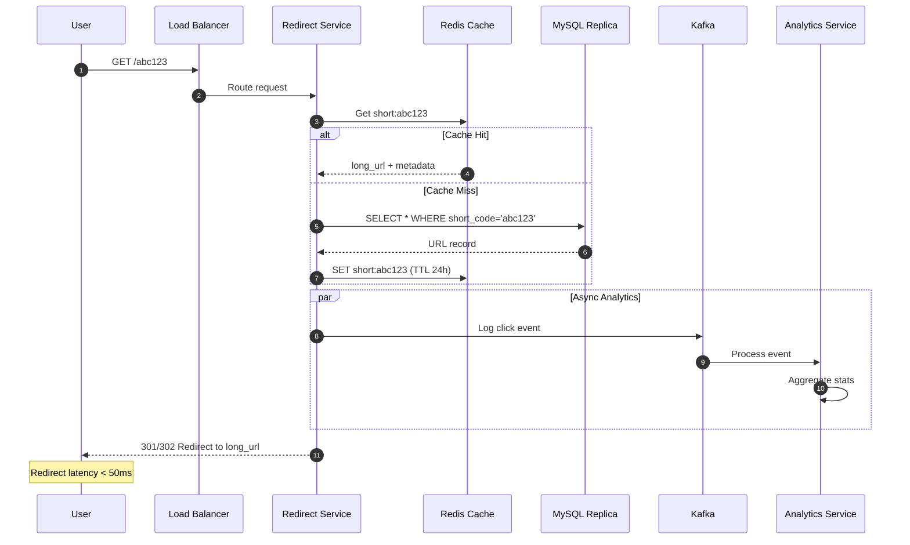
```mermaid
sequenceDiagram
    autonumber
    participant User
    participant LB as Load Balancer
    participant Redirect as Redirect Service
    participant Cache as Redis Cache
    participant DB as MySQL Replica
    participant Kafka as Kafka
    participant Analytics as Analytics Service
    
    User->>LB: GET /abc123
    LB->>Redirect: Route request
    Redirect->>Cache: Get short:abc123
    
    alt Cache Hit
        Cache-->>Redirect: long_url + metadata
    else Cache Miss
        Redirect->>DB: SELECT * WHERE short_code='abc123'
        DB-->>Redirect: URL record
        Redirect->>Cache: SET short:abc123 (TTL 24h)
    end
    
    par Async Analytics
        Redirect->>Kafka: Log click event
        Kafka->>Analytics: Process event
        Analytics->>Analytics: Aggregate stats
    end
    
    Redirect-->>User: 301/302 Redirect to long_url
    
    Note over User: Redirect latency < 50ms
```

### URL Shorten Flow

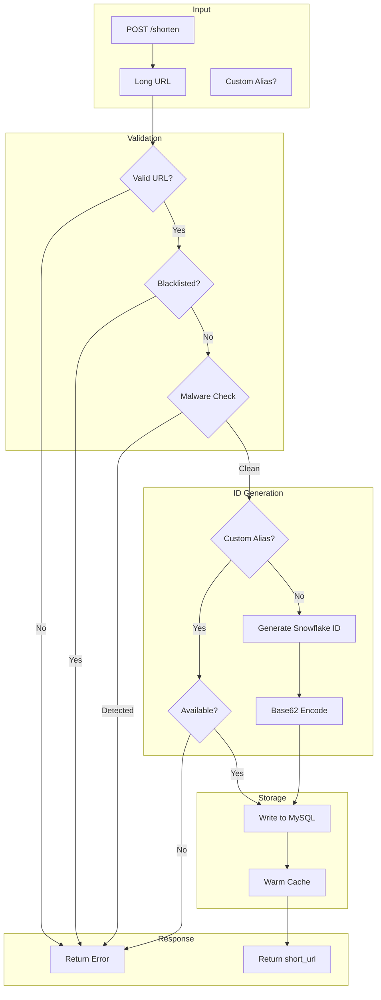
```mermaid
flowchart TB
    subgraph Input
        REQ[POST /shorten]
        URL[Long URL]
        CUSTOM[Custom Alias?]
    end
    
    subgraph Validation
        VALID{Valid URL?}
        BLACKLIST{Blacklisted?}
        MALWARE{Malware Check}
    end
    
    subgraph ID Generation
        CUSTOM_CHECK{Custom Alias?}
        CHECK_AVAIL{Available?}
        SNOWFLAKE[Generate Snowflake ID]
        BASE62[Base62 Encode]
    end
    
    subgraph Storage
        WRITE[Write to MySQL]
        CACHE[Warm Cache]
    end
    
    subgraph Response
        SUCCESS[Return short_url]
        ERROR[Return Error]
    end
    
    REQ --> URL --> VALID
    VALID -->|No| ERROR
    VALID -->|Yes| BLACKLIST
    BLACKLIST -->|Yes| ERROR
    BLACKLIST -->|No| MALWARE
    MALWARE -->|Detected| ERROR
    MALWARE -->|Clean| CUSTOM_CHECK
    
    CUSTOM_CHECK -->|Yes| CHECK_AVAIL
    CUSTOM_CHECK -->|No| SNOWFLAKE
    CHECK_AVAIL -->|No| ERROR
    CHECK_AVAIL -->|Yes| WRITE
    SNOWFLAKE --> BASE62 --> WRITE
    WRITE --> CACHE --> SUCCESS
```

### Capacity Estimation

| Metric | Calculation | Value |
|--------|-------------|-------|
| **Daily Redirects** | Given | ~1B/month ÷ 30 = 33M/day |
| **Redirects/Second** | 33M / 86400 | ~380 req/s |
| **Peak Redirects/Second** | 10x average | ~3,800 req/s |
| **Daily URL Creations** | 1% of redirects | ~330K/day |
| **Storage per URL** | ~200 bytes | 200 bytes |
| **Yearly Storage** | 330K × 365 × 200B | ~24 GB/year |
| **Cache Size (Hot URLs)** | Top 20% × 200B | ~5 GB RAM |
| **Read:Write Ratio** | Redirects : Creates | 100:1 |
| **Redirect Latency Target** | P99 | < 100ms |

### Trade-offs & Design Decisions

| Decision | Choice | Trade-off |
|----------|--------|-----------|
| **ID Generation** | Snowflake + Base62 | ✅ Distributed, no collision, ⚠️ Non-sequential |
| **Database** | MySQL + Replicas | ✅ ACID, proven, ⚠️ Limited write scale |
| **Cache Strategy** | Write-through | ✅ Always warm, ⚠️ Write latency |
| **Redirect Type** | 301 for SEO, 302 for tracking | ✅ Flexible, ⚠️ Client confusion |
| **Analytics** | Async via Kafka | ✅ Non-blocking, ⚠️ Eventually consistent |

### Core Components

**1. URL Shortening Algorithm**

**Base62 Encoding:**
```python
# Characters: [a-z, A-Z, 0-9] = 62 chars
BASE62 = "0123456789abcdefghijklmnopqrstuvwxyzABCDEFGHIJKLMNOPQRSTUVWXYZ"

def encode_base62(num):
    if num == 0:
        return BASE62[0]
    result = []
    while num > 0:
        result.append(BASE62[num % 62])
        num //= 62
    return ''.join(reversed(result))

# Example: 1234567890 → "1ly7vk"
# 7 chars = 62^7 = 3.5 trillion URLs
```

**Short URL Generation Methods:**

*Method 1: Auto-increment ID + Base62*
```
1. Generate unique ID (MySQL auto-increment or distributed ID)
2. Encode ID to Base62
3. Short URL: https://short.url/{base62_id}

Pros: Simple, predictable length
Cons: Sequential (security concern)
```

*Method 2: Hash + Collision Handling*
```python
import hashlib

def generate_short_url(long_url, salt=""):
    hash_input = long_url + salt
    hash_digest = hashlib.md5(hash_input.encode()).hexdigest()
    # Take first 7 chars
    short_code = hash_digest[:7]
    return short_code

# Collision handling
if exists(short_code):
    salt = str(random.randint(1, 1000000))
    short_code = generate_short_url(long_url, salt)
```

*Method 3: Distributed ID Generator (Snowflake)*
```
64-bit ID:
[1 bit unused][41 bits timestamp][10 bits machine ID][12 bits sequence]

Pros: Distributed, no coordination needed
Cons: Longer IDs
```

**2. Database Schema**

**URLs Table (MySQL - Write Master):**
```sql
CREATE TABLE urls (
    id BIGINT PRIMARY KEY AUTO_INCREMENT,
    short_code VARCHAR(10) UNIQUE NOT NULL,
    long_url TEXT NOT NULL,
    user_id BIGINT,
    created_at TIMESTAMP DEFAULT CURRENT_TIMESTAMP,
    expires_at TIMESTAMP NULL,
    INDEX idx_short_code (short_code),
    INDEX idx_user_id (user_id)
) ENGINE=InnoDB;
```

**Sharding Strategy:**
- Shard by hash(short_code) % num_shards
- Each shard: Master-slave replication
- Read from slaves, write to master

**3. Caching Layer (Redis)**

**Cache Strategy:**
```python
# Cache key: short:{short_code}
# Cache value: {long_url, metadata}

def get_long_url(short_code):
    # Try cache first
    cached = redis.get(f"short:{short_code}")
    if cached:
        return cached
    
    # Cache miss, query DB
    result = db.query("SELECT long_url FROM urls WHERE short_code = ?", short_code)
    
    # Populate cache
    redis.setex(f"short:{short_code}", 86400, result)  # TTL 24h
    return result
```

**Cache Warming:**
- Preload popular short URLs at startup
- LRU eviction policy
- Cache size: 10GB per instance

**4. API Design**

**Create Short URL:**
```
POST /api/shorten
{
    "long_url": "https://example.com/very/long/url",
    "custom_alias": "my-link",  // optional
    "expire_at": "2024-12-31"    // optional
}

Response:
{
    "short_url": "https://short.url/abc123",
    "short_code": "abc123",
    "created_at": "2024-01-01T00:00:00Z"
}
```

**Redirect:**
```
GET /abc123

Response:
HTTP 301 Moved Permanently (for SEO, cacheable)
OR
HTTP 302 Found (for tracking, not cacheable)
Location: https://example.com/very/long/url
```

**5. Analytics System**

**Event Logging:**
```python
# On every redirect
event = {
    "short_code": "abc123",
    "timestamp": 1234567890,
    "ip": "1.2.3.4",
    "user_agent": "Mozilla/5.0...",
    "referrer": "https://google.com",
    "country": "VN",
    "city": "Hanoi"
}

# Async publish to Kafka
kafka_producer.send("click_events", event)
```

**Analytics Processing (Spark Streaming):**
```python
# Real-time aggregation
clicks_stream
    .window(minutes=5)
    .groupBy("short_code")
    .count()
    .writeTo(cassandra, "click_stats")

# Geo aggregation
clicks_stream
    .groupBy("short_code", "country")
    .count()
    .writeTo(cassandra, "geo_stats")
```

**Analytics DB (Cassandra):**
```cql
-- Click stats table
CREATE TABLE click_stats (
    short_code TEXT,
    date DATE,
    hour INT,
    click_count COUNTER,
    PRIMARY KEY ((short_code, date), hour)
);

-- Geo stats table
CREATE TABLE geo_stats (
    short_code TEXT,
    country TEXT,
    click_count COUNTER,
    PRIMARY KEY (short_code, country)
);
```

**Analytics API:**
```
GET /api/analytics/abc123

Response:
{
    "short_code": "abc123",
    "total_clicks": 150000,
    "clicks_by_date": [...],
    "top_countries": [
        {"country": "US", "clicks": 50000},
        {"country": "VN", "clicks": 30000}
    ],
    "top_referrers": [...]
}
```

**6. Rate Limiting**

**Token Bucket Algorithm:**
```python
# Redis-based rate limiter
def check_rate_limit(user_id, limit=100, window=3600):
    key = f"rate_limit:{user_id}"
    current = redis.incr(key)
    
    if current == 1:
        redis.expire(key, window)
    
    if current > limit:
        raise RateLimitExceeded("Too many requests")
    
    return True
```

**Rate Limit Tiers:**
- Free users: 100 requests/hour
- Premium users: 1000 requests/hour
- API keys: Custom limits

**7. Security Considerations**

**Prevent Abuse:**
- Blacklist malicious domains
- Scan for phishing/malware
- CAPTCHA for suspicious activity

**Link Validation:**
```python
def validate_url(url):
    # Check format
    parsed = urlparse(url)
    if parsed.scheme not in ['http', 'https']:
        raise InvalidURL()
    
    # Check against blacklist
    if is_blacklisted(parsed.netloc):
        raise BlacklistedDomain()
    
    # Check for malware (integrate with Google Safe Browsing API)
    if is_malware(url):
        raise MalwareDetected()
```

**8. Custom Aliases**

```python
def create_custom_alias(alias, long_url, user_id):
    # Validate alias
    if not is_valid_alias(alias):
        raise InvalidAlias()
    
    # Check availability
    if alias_exists(alias):
        raise AliasNotAvailable()
    
    # Create mapping
    db.execute(
        "INSERT INTO urls (short_code, long_url, user_id) VALUES (?, ?, ?)",
        alias, long_url, user_id
    )
```

**9. Expiring Links**

**TTL Management:**
```python
# Cron job runs every hour
def cleanup_expired_links():
    expired = db.query(
        "SELECT short_code FROM urls WHERE expires_at < NOW()"
    )
    
    for short_code in expired:
        # Delete from DB
        db.execute("DELETE FROM urls WHERE short_code = ?", short_code)
        
        # Invalidate cache
        redis.delete(f"short:{short_code}")
```

**10. Scaling Strategies**

**Read-Heavy Optimization:**
- Master-slave replication (1 write, 10 read replicas)
- Redis cluster for caching
- CDN for static content

**Write Optimization:**
- Batch writes if possible
- Async processing for analytics
- Queue for non-critical operations

**Global Distribution:**
- Deploy in multiple regions
- Route based on geography
- Eventual consistency acceptable

### Technical Improvements / Interview Hardening

- **Hot key & stampede**: Request coalescing, negative caching cho 404, async refresh + jitter TTL để tránh thundering herd.
- **Redirect correctness**: 301 vs 302 theo use-case; set cache headers phù hợp; protect open redirect bằng allowlist/sanitization.
- **Abuse controls**: Domain reputation/blacklist sync, phishing/malware scan async; CAPTCHA cho bursty clients.
- **Data model & sharding**: Nếu shard MySQL theo `short_code`, nêu rõ reshard strategy và unique constraint per shard.
- **Analytics quality**: Bot filtering (UA/referrer), sampling cho high-volume, privacy (IP anonymization).

---

## 5. Design a Notification System

### Requirements
- 200 triệu users
- 500M notifications/ngày
- Personalization
- Throttling
- Multi-channel (push, email, SMS, in-app)

### High-Level Architecture

```
[Event Sources]
(App servers, Cron jobs, User actions)
       ↓
[Event Gateway]
       ↓
[Message Queue (Kafka)]
       ↓
    ┌──┴──────┬────────┬────────┐
    ↓         ↓        ↓        ↓
[Push]    [Email]   [SMS]   [In-App]
Service   Service   Service  Service
    ↓         ↓        ↓        ↓
[FCM/APNs][SMTP]  [Twilio] [WebSocket]
    ↓
[User Preferences Service]
    ↓
[Analytics & Logging]
```

### Multi-Channel Architecture (Mermaid)

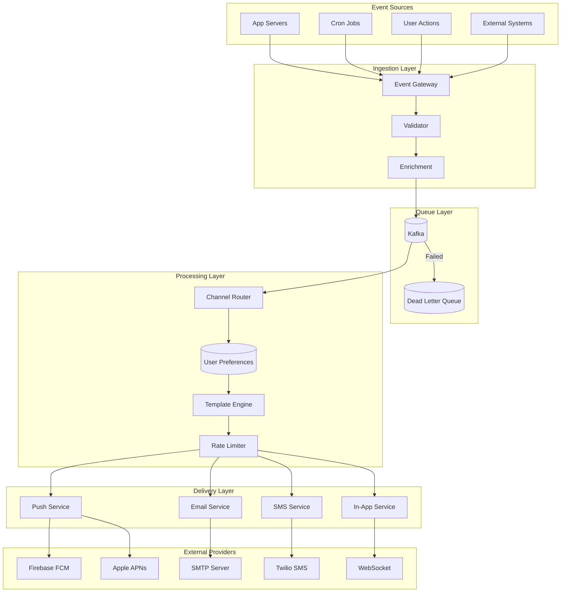
```mermaid
graph TB
    subgraph "Event Sources"
        App[App Servers]
        Cron[Cron Jobs]
        User[User Actions]
        External[External Systems]
    end
    
    subgraph "Ingestion Layer"
        Gateway[Event Gateway]
        Validate[Validator]
        Enrich[Enrichment]
    end
    
    subgraph "Queue Layer"
        Kafka[(Kafka)]
        DLQ[(Dead Letter Queue)]
    end
    
    subgraph "Processing Layer"
        Router[Channel Router]
        Prefs[(User Preferences)]
        Template[Template Engine]
        Throttle[Rate Limiter]
    end
    
    subgraph "Delivery Layer"
        Push[Push Service]
        Email[Email Service]
        SMS[SMS Service]
        InApp[In-App Service]
    end
    
    subgraph "External Providers"
        FCM[Firebase FCM]
        APNs[Apple APNs]
        SMTP[SMTP Server]
        Twilio[Twilio SMS]
        WS[WebSocket]
    end
    
    App & Cron & User & External --> Gateway
    Gateway --> Validate --> Enrich --> Kafka
    
    Kafka --> Router
    Router --> Prefs
    Prefs --> Template --> Throttle
    
    Throttle --> Push & Email & SMS & InApp
    Push --> FCM & APNs
    Email --> SMTP
    SMS --> Twilio
    InApp --> WS
    
    Kafka -->|Failed| DLQ
```

### Notification Processing Flow

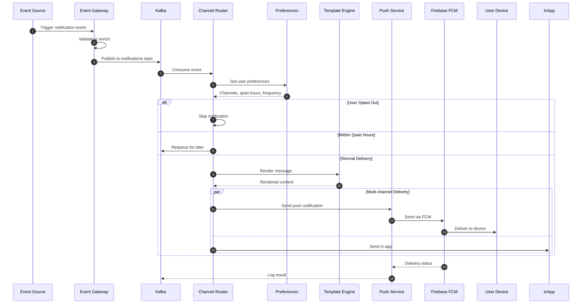
```mermaid
sequenceDiagram
    autonumber
    participant Source as Event Source
    participant Gateway as Event Gateway
    participant Kafka as Kafka
    participant Router as Channel Router
    participant Prefs as Preferences
    participant Template as Template Engine
    participant Push as Push Service
    participant FCM as Firebase FCM
    participant User as User Device
    
    Source->>Gateway: Trigger notification event
    Gateway->>Gateway: Validate & enrich
    Gateway->>Kafka: Publish to notifications topic
    
    Kafka->>Router: Consume event
    Router->>Prefs: Get user preferences
    Prefs-->>Router: Channels, quiet hours, frequency
    
    alt User Opted Out
        Router->>Router: Skip notification
    else Within Quiet Hours
        Router->>Kafka: Requeue for later
    else Normal Delivery
        Router->>Template: Render message
        Template-->>Router: Rendered content
        
        par Multi-channel Delivery
            Router->>Push: Send push notification
            Push->>FCM: Send via FCM
            FCM->>User: Deliver to device
        and
            Router->>InApp: Send in-app
        end
    end
    
    FCM-->>Push: Delivery status
    Push-->>Kafka: Log result
```

### Fan-out Pattern for Group Notifications

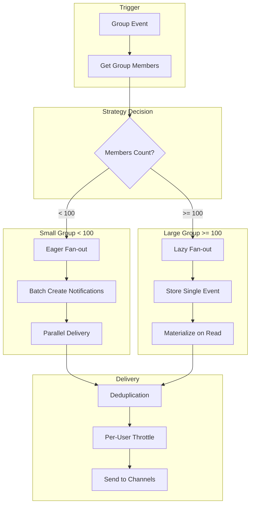
```mermaid
flowchart TB
    subgraph Trigger
        EVENT[Group Event]
        MEMBERS[Get Group Members]
    end
    
    subgraph Strategy Decision
        SIZE{Members Count?}
    end
    
    subgraph "Small Group < 100"
        EAGER[Eager Fan-out]
        BATCH_CREATE[Batch Create Notifications]
        PARALLEL[Parallel Delivery]
    end
    
    subgraph "Large Group >= 100"
        LAZY[Lazy Fan-out]
        SINGLE[Store Single Event]
        ON_READ[Materialize on Read]
    end
    
    subgraph Delivery
        DEDUP[Deduplication]
        THROTTLE[Per-User Throttle]
        SEND[Send to Channels]
    end
    
    EVENT --> MEMBERS --> SIZE
    SIZE -->|< 100| EAGER --> BATCH_CREATE --> PARALLEL
    SIZE -->|>= 100| LAZY --> SINGLE --> ON_READ
    
    PARALLEL --> DEDUP --> THROTTLE --> SEND
    ON_READ --> DEDUP
```

### Capacity Estimation

| Metric | Calculation | Value |
|--------|-------------|-------|
| **Daily Notifications** | Given | 500M/day |
| **Notifications/Second** | 500M / 86400 | ~5,787/s |
| **Peak Notifications/Second** | 5x average | ~29,000/s |
| **Push Notifications** | 60% of total | 300M/day |
| **Email Notifications** | 30% of total | 150M/day |
| **SMS Notifications** | 5% of total | 25M/day |
| **In-App Notifications** | 5% of total | 25M/day |
| **Kafka Partitions** | 29K/s / 1K per | ~30 partitions |
| **Delivery Latency Target** | P99 | < 5s |

### Trade-offs & Design Decisions

| Decision | Choice | Trade-off |
|----------|--------|-----------|
| **Queue System** | Kafka | ✅ High throughput, ⚠️ Latency for urgent |
| **Fan-out** | Hybrid (eager/lazy) | ✅ Efficient for all group sizes, ⚠️ Complex |
| **Delivery** | At-least-once | ✅ No message loss, ⚠️ Potential duplicates |
| **Rate Limiting** | Per-user + global | ✅ Prevents spam, ⚠️ May delay important |
| **Templating** | Server-side | ✅ Consistent, ⚠️ Less personalization |

### Core Components

**1. Notification Types**

```python
class NotificationType(Enum):
    TRANSACTIONAL = "transactional"  # Order confirmation, password reset
    PROMOTIONAL = "promotional"       # Marketing, new features
    SOCIAL = "social"                 # Comments, likes, mentions
    SYSTEM = "system"                 # Maintenance, security alerts
```

**2. Event Schema**

```json
{
    "notification_id": "notif_123",
    "user_id": "user_456",
    "type": "social",
    "priority": "high",
    "channels": ["push", "in_app"],
    "template_id": "comment_received",
    "data": {
        "commenter_name": "John",
        "post_title": "My post",
        "comment_preview": "Great post!"
    },
    "scheduled_at": null,  // null = send immediately
    "metadata": {
        "campaign_id": "campaign_789",
        "experiment_id": "exp_abc"
    }
}
```

**3. User Preferences Management**

**Preferences Schema:**
```json
{
    "user_id": "user_456",
    "channels": {
        "push": {
            "enabled": true,
            "quiet_hours": {
                "start": "22:00",
                "end": "08:00",
                "timezone": "Asia/Ho_Chi_Minh"
            }
        },
        "email": {
            "enabled": true,
            "frequency": "daily_digest"
        },
        "sms": {
            "enabled": false
        }
    },
    "categories": {
        "social": true,
        "promotional": false,
        "transactional": true,
        "system": true
    },
    "devices": [
        {
            "device_id": "device_123",
            "platform": "ios",
            "token": "fcm_token_xyz",
            "active": true
        }
    ]
}
```

**4. Notification Processing Flow**

```python
def process_notification(event):
    # 1. Validate event
    validate_event(event)
    
    # 2. Check user preferences
    user_prefs = get_user_preferences(event.user_id)
    if not should_send(event, user_prefs):
        log_skipped(event, "user_preferences")
        return
    
    # 3. Rate limiting check
    if is_rate_limited(event.user_id, event.type):
        log_skipped(event, "rate_limited")
        return
    
    # 4. Template rendering
    message = render_template(event.template_id, event.data)
    
    # 5. Channel selection
    channels = select_channels(event, user_prefs)
    
    # 6. Send to channels
    for channel in channels:
        send_to_channel(channel, event.user_id, message)
    
    # 7. Log & track
    log_sent(event)
```

**5. Fan-out Strategies**

**Fan-out on Write (Eager):**
```python
# Use case: Group notifications
def notify_group_members(group_id, event):
    members = get_group_members(group_id)
    
    # Create individual notifications
    for member in members:
        notification = create_notification(member, event)
        kafka_producer.send("notifications", notification)
```

**Fan-out on Read (Lazy):**
```python
# Use case: Follower notifications
def get_notifications(user_id, limit=20):
    # Query notifications from followed users
    followed_users = get_followed_users(user_id)
    notifications = db.query("""
        SELECT * FROM notifications 
        WHERE sender_id IN (?) 
        ORDER BY created_at DESC 
        LIMIT ?
    """, followed_users, limit)
    
    return notifications
```

**Hybrid Approach:**
- Fan-out on write for small groups (<100 members)
- Fan-out on read for large groups (>100 members)

**6. Rate Limiting & Throttling**

**Per-User Rate Limiting:**
```python
class RateLimiter:
    def __init__(self, redis_client):
        self.redis = redis_client
    
    def check_rate_limit(self, user_id, notification_type):
        # Sliding window counter
        now = int(time.time())
        window_key = f"rate_limit:{user_id}:{notification_type}:{now // 3600}"
        
        count = self.redis.incr(window_key)
        self.redis.expire(window_key, 7200)  # 2 hours
        
        limits = {
            "social": 50,      # 50 per hour
            "promotional": 5,  # 5 per hour
            "transactional": 100
        }
        
        return count <= limits.get(notification_type, 10)
```

**Global Throttling:**
```python
# Prevent thundering herd
def throttle_notifications(notifications, max_per_second=10000):
    batch_size = max_per_second
    for i in range(0, len(notifications), batch_size):
        batch = notifications[i:i + batch_size]
        send_batch(batch)
        time.sleep(1)  # Wait 1 second between batches
```

**7. Push Notification Service**

**FCM (Firebase Cloud Messaging) Integration:**
```python
import firebase_admin
from firebase_admin import messaging

def send_push_notification(user_id, notification_data):
    # Get device tokens
    devices = get_user_devices(user_id, platform=['android', 'ios'])
    
    for device in devices:
        message = messaging.Message(
            notification=messaging.Notification(
                title=notification_data['title'],
                body=notification_data['body'],
                image=notification_data.get('image')
            ),
            data=notification_data.get('data', {}),
            token=device['token'],
            android=messaging.AndroidConfig(
                priority='high',
                ttl=86400  # 24 hours
            ),
            apns=messaging.APNSConfig(
                payload=messaging.APNSPayload(
                    aps=messaging.Aps(
                        sound='default',
                        badge=get_unread_count(user_id)
                    )
                )
            )
        )
        
        try:
            response = messaging.send(message)
            log_success(user_id, device['device_id'], response)
        except Exception as e:
            handle_push_error(e, device)
```

**Retry Mechanism:**
```python
def send_with_retry(notification, max_retries=3):
    for attempt in range(max_retries):
        try:
            send_notification(notification)
            return True
        except TemporaryError as e:
            if attempt < max_retries - 1:
                backoff = 2 ** attempt  # Exponential backoff
                time.sleep(backoff)
            else:
                log_failed(notification, e)
                return False
```

**8. Email Service**

**Email Templates:**
```html
<!-- Transactional Email Template -->
<!DOCTYPE html>
<html>
<body>
    <h1>{{title}}</h1>
    <p>Hi {{user_name}},</p>
    <p>{{message}}</p>
    <a href="{{action_url}}">{{action_text}}</a>
</body>
</html>
```

**Batch Email Processing:**
```python
# Digest emails (daily summary)
def send_daily_digest():
    users = get_users_with_digest_preference()
    
    for user in users:
        # Aggregate notifications from last 24 hours
        notifications = get_user_notifications(
            user.id,
            since=datetime.now() - timedelta(days=1)
        )
        
        if notifications:
            email_body = render_digest_template(notifications)
            send_email(
                to=user.email,
                subject="Your daily update",
                body=email_body
            )
```

**9. In-App Notifications**

**WebSocket Implementation:**
```python
# Server-side
class NotificationHandler(tornado.websocket.WebSocketHandler):
    connections = {}
    
    def open(self, user_id):
        self.user_id = user_id
        NotificationHandler.connections[user_id] = self
        
        # Send unread notifications
        unread = get_unread_notifications(user_id)
        self.write_message(json.dumps(unread))
    
    def on_close(self):
        del NotificationHandler.connections[self.user_id]
    
    @classmethod
    def send_to_user(cls, user_id, notification):
        if user_id in cls.connections:
            cls.connections[user_id].write_message(
                json.dumps(notification)
            )
```

**Unread Count Management:**
```python
# Redis sorted set for unread notifications
def add_notification(user_id, notification_id, timestamp):
    redis.zadd(
        f"unread:{user_id}",
        {notification_id: timestamp}
    )
    
    # Update unread count
    redis.incr(f"unread_count:{user_id}")

def mark_as_read(user_id, notification_id):
    redis.zrem(f"unread:{user_id}", notification_id)
    redis.decr(f"unread_count:{user_id}")
```

**10. Analytics & Monitoring**

**Metrics to Track:**
```python
metrics = {
    "sent_count": Counter("notifications sent"),
    "delivered_count": Counter("notifications delivered"),
    "opened_count": Counter("notifications opened"),
    "clicked_count": Counter("notifications clicked"),
    "failed_count": Counter("notifications failed"),
    "latency": Histogram("notification delivery latency")
}
```

**A/B Testing:**
```python
def send_with_experiment(notification):
    experiment = get_experiment(notification.campaign_id)
    
    if experiment:
        variant = assign_variant(notification.user_id, experiment)
        notification.template_id = variant.template_id
    
    send_notification(notification)
    log_experiment_event(experiment, variant, "sent")
```

### Technical Improvements / Interview Hardening

- **Priority lanes**: Tách topic/queue cho transactional vs promotional để OTP/password reset không bị nghẽn bởi marketing.
- **Idempotency end-to-end**: `notification_id`/idempotency key từ gateway → consumer → provider; retry không gửi trùng.
- **Provider feedback loop**: Cleanup device tokens invalid/unregistered; backoff + jitter; quota theo provider.
- **Scheduling/quiet hours**: Dùng `scheduled_at` + delayed queue (hoặc requeue có kiểm soát) để tránh polling và đảm bảo timezone.
- **DLQ & replay**: DLQ có reason code; replay rate-limited và có dedup để tránh “bùng nổ” gửi lại.

---

## 6. Design a Live Streaming System (V LIVE)

### Requirements
- 100 triệu users
- 10 triệu concurrent viewers peak
- Low latency (<5s globally)
- Real-time chat
- Gifts/donations
- VOD storage (billions hours)

### High-Level Architecture

```
[Broadcaster]
      ↓
[Ingest Servers (RTMP/WebRTC)]
      ↓
[Transcoding Service]
(Multiple bitrates)
      ↓
[Origin Servers]
      ↓
[CDN Edge Servers]
(Akamai/CloudFront)
      ↓
[Viewers]

[Chat System]
WebSocket Servers ←→ Pub/Sub (Redis)
      ↓
[Chat Service]

[Recording Service] → [VOD Storage (S3)]
```

### Video Pipeline Architecture (Mermaid)

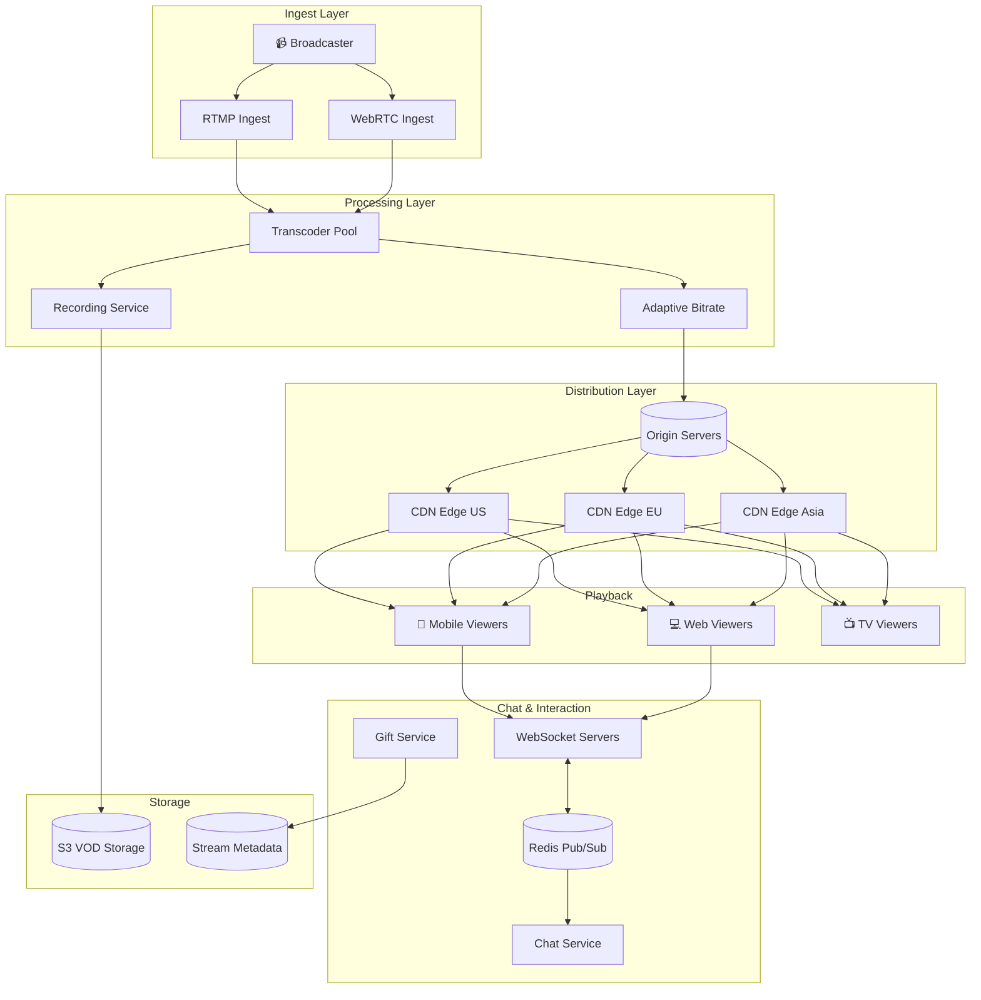
```mermaid
graph TB
    subgraph "Ingest Layer"
        Broadcaster[📹 Broadcaster]
        RTMP[RTMP Ingest]
        WebRTC[WebRTC Ingest]
    end
    
    subgraph "Processing Layer"
        Transcode[Transcoder Pool]
        ABR[Adaptive Bitrate]
        Recorder[Recording Service]
    end
    
    subgraph "Distribution Layer"
        Origin[(Origin Servers)]
        CDN1[CDN Edge US]
        CDN2[CDN Edge EU]
        CDN3[CDN Edge Asia]
    end
    
    subgraph "Playback"
        Viewer1[📱 Mobile Viewers]
        Viewer2[💻 Web Viewers]
        Viewer3[📺 TV Viewers]
    end
    
    subgraph "Chat & Interaction"
        WS[WebSocket Servers]
        PubSub[(Redis Pub/Sub)]
        Chat[Chat Service]
        Gift[Gift Service]
    end
    
    subgraph "Storage"
        S3[(S3 VOD Storage)]
        DB[(Stream Metadata)]
    end
    
    Broadcaster --> RTMP & WebRTC
    RTMP & WebRTC --> Transcode
    Transcode --> ABR --> Origin
    Transcode --> Recorder --> S3
    
    Origin --> CDN1 & CDN2 & CDN3
    CDN1 & CDN2 & CDN3 --> Viewer1 & Viewer2 & Viewer3
    
    Viewer1 & Viewer2 --> WS <--> PubSub
    PubSub --> Chat
    Gift --> DB
```

### Live Stream Flow (Sequence Diagram)

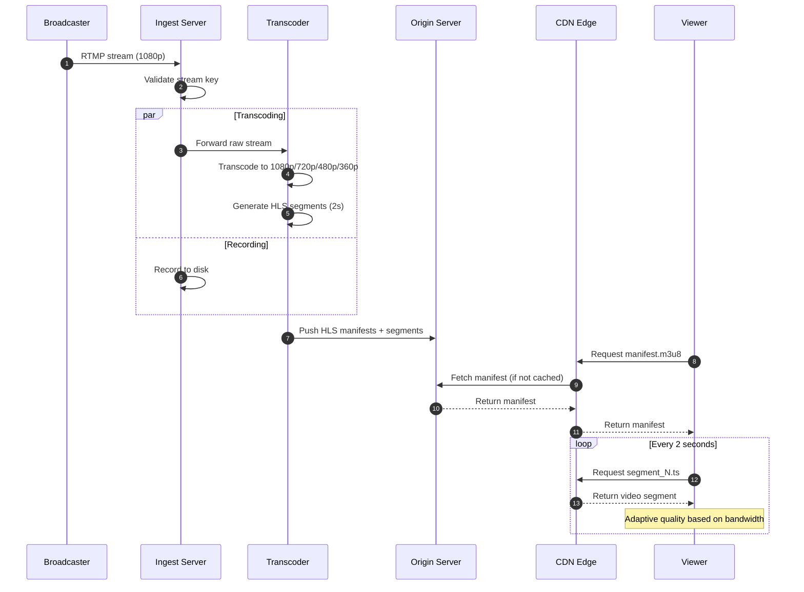
```mermaid
sequenceDiagram
    autonumber
    participant B as Broadcaster
    participant Ingest as Ingest Server
    participant Trans as Transcoder
    participant Origin as Origin Server
    participant CDN as CDN Edge
    participant Viewer as Viewer
    
    B->>Ingest: RTMP stream (1080p)
    Ingest->>Ingest: Validate stream key
    
    par Transcoding
        Ingest->>Trans: Forward raw stream
        Trans->>Trans: Transcode to 1080p/720p/480p/360p
        Trans->>Trans: Generate HLS segments (2s)
    and Recording
        Ingest->>Ingest: Record to disk
    end
    
    Trans->>Origin: Push HLS manifests + segments
    
    Viewer->>CDN: Request manifest.m3u8
    CDN->>Origin: Fetch manifest (if not cached)
    Origin-->>CDN: Return manifest
    CDN-->>Viewer: Return manifest
    
    loop Every 2 seconds
        Viewer->>CDN: Request segment_N.ts
        CDN-->>Viewer: Return video segment
        Note over Viewer: Adaptive quality based on bandwidth
    end
```

### Real-time Chat Architecture

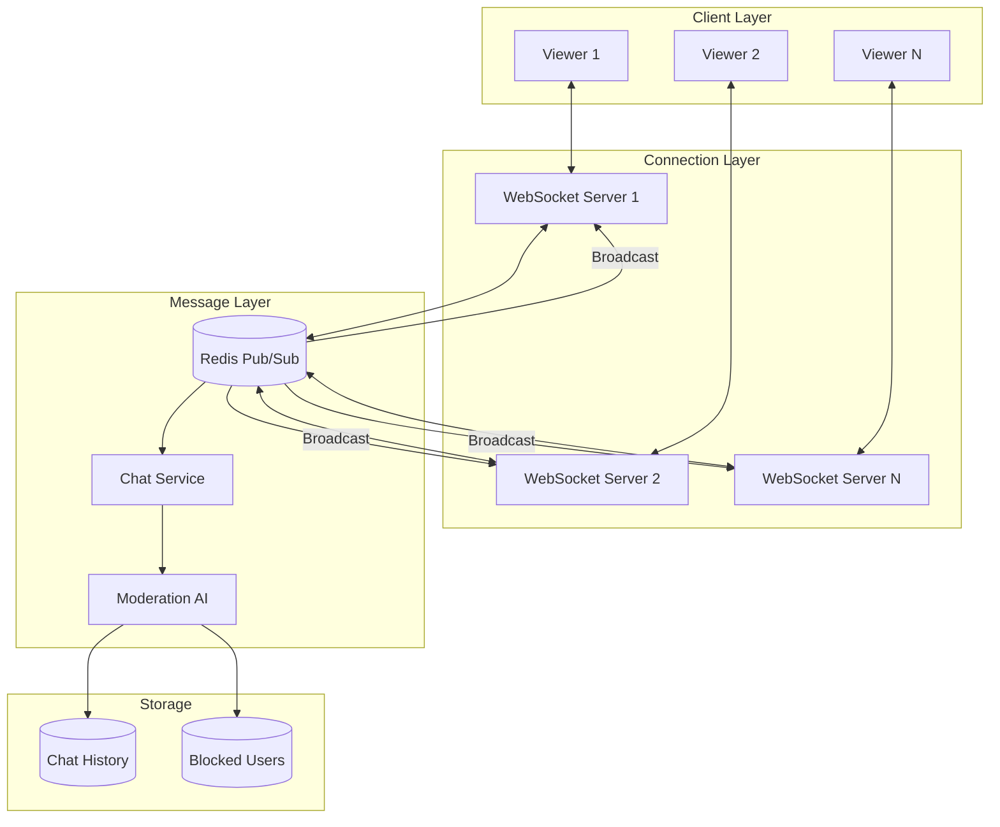
```mermaid
graph TB
    subgraph "Client Layer"
        V1[Viewer 1]
        V2[Viewer 2]
        VN[Viewer N]
    end
    
    subgraph "Connection Layer"
        WS1[WebSocket Server 1]
        WS2[WebSocket Server 2]
        WSN[WebSocket Server N]
    end
    
    subgraph "Message Layer"
        PubSub[(Redis Pub/Sub)]
        ChatSvc[Chat Service]
        Moderate[Moderation AI]
    end
    
    subgraph "Storage"
        ChatDB[(Chat History)]
        Block[(Blocked Users)]
    end
    
    V1 <--> WS1
    V2 <--> WS2
    VN <--> WSN
    
    WS1 & WS2 & WSN <--> PubSub
    PubSub --> ChatSvc
    ChatSvc --> Moderate --> ChatDB
    Moderate --> Block
    
    PubSub -->|Broadcast| WS1 & WS2 & WSN
```

### Capacity Estimation

| Metric | Calculation | Value |
|--------|-------------|-------|
| **Peak Concurrent Viewers** | Given | 10M viewers |
| **Active Live Streams** | Estimated | ~10K streams |
| **Avg Viewers per Stream** | 10M / 10K | 1,000 viewers |
| **Bitrate (1080p)** | Per viewer | 5 Mbps |
| **Peak CDN Bandwidth** | 10M × 5 Mbps | 50 Tbps |
| **Chat Messages/Second** | 10M × 0.1 msg/min | ~17K msg/s |
| **Storage per Hour (1080p)** | 5 Mbps × 3600 | ~2.25 GB/hr |
| **Monthly VOD Storage** | 100K hrs × 2.25GB | ~225 TB |
| **Latency Target** | Glass-to-glass | < 5 seconds |

### Trade-offs & Design Decisions

| Decision | Choice | Trade-off |
|----------|--------|-----------|
| **Ingest Protocol** | RTMP + WebRTC | ✅ Universal + Low latency, ⚠️ Complexity |
| **Streaming Protocol** | HLS (2s segments) | ✅ CDN-friendly, ⚠️ 4-10s latency |
| **CDN Strategy** | Multi-CDN | ✅ Reliability, ⚠️ Cost & complexity |
| **Chat Delivery** | WebSocket + Pub/Sub | ✅ Real-time, ⚠️ Connection management |
| **VOD Storage** | S3 + Glacier | ✅ Cost-effective, ⚠️ Glacier retrieval time |

### Core Components

**1. Video Ingest**

**RTMP (Real-Time Messaging Protocol):**
```python
# Broadcaster setup
rtmp_url = "rtmp://ingest.domain.com/live"
stream_key = generate_stream_key(user_id)
full_url = f"{rtmp_url}/{stream_key}"

# Ingest server (Nginx-RTMP)
# nginx.conf
rtmp {
    server {
        listen 1935;
        
        application live {
            live on;
            
            # Forward to transcoding
            exec ffmpeg -i rtmp://localhost/$app/$name
                -c:v libx264 -preset veryfast
                -c:a aac
                -f flv rtmp://transcoder/$name;
            
            # Record stream
            record all;
            record_path /recordings;
        }
    }
}
```

**WebRTC (for ultra-low latency):**
```javascript
// Broadcaster (browser)
navigator.mediaDevices.getUserMedia({video: true, audio: true})
    .then(stream => {
        const pc = new RTCPeerConnection(config);
        stream.getTracks().forEach(track => pc.addTrack(track, stream));
        
        // Create offer
        pc.createOffer().then(offer => {
            pc.setLocalDescription(offer);
            // Send offer to signaling server
            sendToServer({type: 'offer', offer: offer});
        });
    });
```

**2. Transcoding Service**

**Adaptive Bitrate Streaming (ABR):**
```python
# FFmpeg transcoding ladder
profiles = [
    {"name": "1080p", "width": 1920, "height": 1080, "bitrate": "5000k"},
    {"name": "720p",  "width": 1280, "height": 720,  "bitrate": "2800k"},
    {"name": "480p",  "width": 854,  "height": 480,  "bitrate": "1400k"},
    {"name": "360p",  "width": 640,  "height": 360,  "bitrate": "800k"},
    {"name": "240p",  "width": 426,  "height": 240,  "bitrate": "400k"}
]

def transcode_stream(input_stream):
    outputs = []
    for profile in profiles:
        output = ffmpeg.input(input_stream) \
            .video.filter('scale', profile['width'], profile['height']) \
            .output(
                f"output_{profile['name']}.m3u8",
                vcodec='libx264',
                video_bitrate=profile['bitrate'],
                acodec='aac',
                audio_bitrate='128k',
                format='hls',
                hls_time=2,  # 2-second segments
                hls_list_size=5
            )
        outputs.append(output)
    
    # Run all transcoding in parallel
    ffmpeg.run_all(*outputs)
```

**HLS (HTTP Live Streaming) Manifest:**
```m3u8
#EXTM3U
#EXT-X-VERSION:3
#EXT-X-STREAM-INF:BANDWIDTH=5000000,RESOLUTION=1920x1080
1080p/index.m3u8
#EXT-X-STREAM-INF:BANDWIDTH=2800000,RESOLUTION=1280x720
720p/index.m3u8
#EXT-X-STREAM-INF:BANDWIDTH=1400000,RESOLUTION=854x480
480p/index.m3u8
```

**3. CDN Distribution**

**Origin-Edge Architecture:**
```
[Origin Servers]
    ↓
[Regional Edge Servers]
    ↓
[Local Edge Caches]
    ↓
[Viewers]
```

**CDN Configuration:**
```python
cdn_config = {
    "cache_key": "stream_id + quality",
    "cache_ttl": 5,  # seconds
    "origin_shield": True,  # Reduce origin load
    "geo_routing": True,
    "failover": {
        "primary": "cloudfront.aws.com",
        "backup": "akamai.net"
    }
}
```

**4. Player Implementation**

**HLS.js Player (Web):**
```javascript
const video = document.getElementById('video');
const hls = new Hls({
    enableWorker: true,
    lowLatencyMode: true,
    backBufferLength: 90
});

hls.loadSource('https://cdn.domain.com/live/stream123/index.m3u8');
hls.attachMedia(video);

hls.on(Hls.Events.MANIFEST_PARSED, function() {
    video.play();
});

// Quality selection
hls.on(Hls.Events.LEVEL_LOADED, function(event, data) {
    console.log('Quality:', hls.levels[data.level].height + 'p');
});
```

**Adaptive Bitrate Logic:**
```javascript
// Auto-adjust quality based on bandwidth
hls.on(Hls.Events.ERROR, function(event, data) {
    if (data.details === Hls.ErrorDetails.BUFFER_STALLED_ERROR) {
        // Lower quality
        hls.currentLevel = Math.max(0, hls.currentLevel - 1);
    }
});
```

**5. Real-time Chat System**

**Chat Architecture:**
```
[Client] ←WebSocket→ [Chat Servers] ←Pub/Sub→ [Redis Cluster]
                           ↓
                    [Chat Service]
                           ↓
                    [Message DB (Cassandra)]
```

**Chat Message Flow:**
```python
# Client sends message
{
    "type": "chat_message",
    "stream_id": "stream123",
    "user_id": "user456",
    "message": "Great show!",
    "timestamp": 1234567890
}

# Server processing
async def handle_chat_message(websocket, message):
    # Validate & sanitize
    message = sanitize_message(message)
    
    # Rate limiting
    if not check_rate_limit(message['user_id']):
        return
    
    # Publish to Redis Pub/Sub
    await redis.publish(
        f"stream:{message['stream_id']}",
        json.dumps(message)
    )
    
    # Store in DB (async)
    asyncio.create_task(store_message(message))

# Broadcast to all viewers
async def broadcast_to_viewers(stream_id, message):
    channel = f"stream:{stream_id}"
    subscribers = websocket_connections[stream_id]
    
    for ws in subscribers:
        await ws.send(json.dumps(message))
```

**Chat Moderation:**
```python
# Bad word filter
BAD_WORDS = load_bad_words_list()

def moderate_message(message):
    # Profanity filter
    for word in BAD_WORDS:
        message = message.replace(word, "***")
    
    # Spam detection
    if is_spam(message):
        return None
    
    # Length limit
    if len(message) > 500:
        message = message[:500]
    
    return message
```

**6. Gifts & Donations System**

**Virtual Gift Flow:**
```python
# Gift catalog
gifts = {
    "heart": {"price": 10, "animation": "heart.json"},
    "flower": {"price": 50, "animation": "flower.json"},
    "diamond": {"price": 1000, "animation": "diamond.json"}
}

def send_gift(user_id, stream_id, gift_type):
    # 1. Deduct user balance
    if not deduct_balance(user_id, gifts[gift_type]['price']):
        raise InsufficientBalance()
    
    # 2. Credit broadcaster
    credit_broadcaster(stream_id, gifts[gift_type]['price'] * 0.7)  # 70% revenue share
    
    # 3. Broadcast gift animation to viewers
    gift_event = {
        "type": "gift",
        "user": get_user_name(user_id),
        "gift": gift_type,
        "animation": gifts[gift_type]['animation']
    }
    broadcast_to_stream(stream_id, gift_event)
    
    # 4. Log transaction
    log_transaction(user_id, stream_id, gift_type, gifts[gift_type]['price'])
```

**7. VOD (Video on Demand)**

**Recording Process:**
```python
# Continuous recording during live stream
def record_stream(stream_id):
    output_path = f"/recordings/{stream_id}/{datetime.now().isoformat()}.mp4"
    
    ffmpeg.input(f"rtmp://localhost/live/{stream_id}") \
        .output(
            output_path,
            vcodec='copy',  # Don't re-encode
            acodec='copy',
            format='mp4'
        ) \
        .run_async()
    
    # Upload to S3 when stream ends
    on_stream_end(lambda: upload_to_s3(output_path, stream_id))
```

**VOD Processing:**
```python
# Post-processing after stream ends
def process_vod(stream_id, recording_path):
    # 1. Generate thumbnail
    thumbnail = extract_thumbnail(recording_path, timestamp="00:00:05")
    upload_to_s3(thumbnail, f"thumbnails/{stream_id}.jpg")
    
    # 2. Generate preview clip (first 30 seconds)
    preview = ffmpeg.input(recording_path, ss=0, t=30) \
        .output(f"preview_{stream_id}.mp4") \
        .run()
    upload_to_s3(preview, f"previews/{stream_id}.mp4")
    
    # 3. Transcode for VOD (if not already done)
    if not already_transcoded:
        transcode_for_vod(recording_path, stream_id)
    
    # 4. Update metadata
    update_vod_metadata(stream_id, {
        "duration": get_duration(recording_path),
        "thumbnail_url": f"https://cdn.domain.com/thumbnails/{stream_id}.jpg",
        "video_url": f"https://cdn.domain.com/vod/{stream_id}/index.m3u8"
    })
```

**8. Analytics & Monitoring**

**Real-time Metrics:**
```python
metrics = {
    "concurrent_viewers": gauge,
    "peak_viewers": gauge,
    "total_views": counter,
    "average_watch_time": histogram,
    "buffering_ratio": gauge,
    "bitrate_distribution": histogram
}

# Collect metrics
def track_viewer_metrics(stream_id, user_id):
    # Increment concurrent viewers
    redis.incr(f"viewers:{stream_id}")
    
    # Update peak
    current = redis.get(f"viewers:{stream_id}")
    peak = redis.get(f"peak_viewers:{stream_id}")
    if int(current) > int(peak or 0):
        redis.set(f"peak_viewers:{stream_id}", current)
    
    # Track watch time
    redis.zadd(
        f"watch_times:{stream_id}",
        {user_id: time.time()}
    )
```

**Quality of Experience (QoE) Monitoring:**
```python
def track_qoe_metrics(event):
    metrics = {
        "buffering_events": event.get('buffering_count', 0),
        "startup_time": event.get('startup_time_ms'),
        "bitrate_switches": event.get('quality_changes'),
        "errors": event.get('errors', [])
    }
    
    # Alert if QoE degrades
    if metrics['buffering_events'] > 5:
        alert_team("High buffering rate", stream_id)
```

**9. Scaling Strategies**

**Ingest Server Scaling:**
- Deploy ingest servers in multiple regions
- Use GeoDNS to route broadcasters to nearest server
- Auto-scale based on active streams

**Transcoding Scaling:**
- Kubernetes pods with GPU instances
- Dynamic scaling based on queue depth
- Preemptible instances for cost optimization

**CDN Optimization:**
- Multi-CDN strategy (primary + backup)
- Cache warming for popular streams
- Bandwidth cost optimization (intelligent routing)

**10. Cost Optimization**

```python
# Storage tiering
storage_tiers = {
    "hot": {
        "age": "0-7 days",
        "storage": "S3 Standard",
        "cost": "$0.023/GB"
    },
    "warm": {
        "age": "8-30 days",
        "storage": "S3 IA",
        "cost": "$0.0125/GB"
    },
    "cold": {
        "age": ">30 days",
        "storage": "S3 Glacier",
        "cost": "$0.004/GB"
    }
}

# Auto-tier based on view count
def optimize_storage(vod):
    if vod.views < 100 and vod.age > 30:
        move_to_glacier(vod)
    elif vod.views < 1000 and vod.age > 7:
        move_to_ia(vod)
```

### Technical Improvements / Interview Hardening

- **Latency tiers**: Nêu rõ: HLS thường ~4–10s (tuỳ segment/player/CDN); LL-HLS ~2–4s; WebRTC ~0.5–1s và tiêu chí chọn theo interactivity/audience.
- **Origin protection**: Origin shield + request collapsing; warm cache cho streams hot để giảm cache miss storm.
- **Chat at scale**: Redis Pub/Sub cho realtime broadcast; history/replay nên tách (Kafka/DB) để hỗ trợ multi-region + late join.
- **DRM/anti-piracy**: Signed playback URL, token rotation, watermarking; rate limit segment download.
- **Backpressure**: Autoscale transcoding theo queue depth; degrade bitrate ladder khi thiếu GPU/overload.

---

## 7. Design an E-commerce Search & Recommendation System (NAVER Shopping)

### Requirements
- 150 triệu users
- 500M+ searches/ngày
- Real-time inventory updates
- Personalized recommendations
- Fraud detection

### High-Level Architecture

```
[User Query]
      ↓
[API Gateway]
      ↓
   ┌──┴──┐
   ↓     ↓
[Search] [Recommendation]
Service   Service
   ↓         ↓
[Elasticsearch] [ML Models]
   ↓         ↓
[Product DB (MySQL/Cassandra)]
       ↓
[Inventory Service (Redis)]
```

### E-commerce Architecture (Mermaid)

```mermaid
graph TB
    subgraph "Client Layer"
        Web[Web App]
        Mobile[Mobile App]
    end
    
    subgraph "API Layer"
        Gateway[API Gateway]
        Auth[Auth Service]
    end
    
    subgraph "Search & Discovery"
        Search[Search Service]
        Rec[Recommendation Service]
        ES[(Elasticsearch)]
        ML[ML Models]
    end
    
    subgraph "Transaction Layer"
        Cart[Cart Service]
        Order[Order Service]
        Payment[Payment Service]
        Fraud[Fraud Detection]
    end
    
    subgraph "Inventory & Catalog"
        Catalog[Catalog Service]
        Inventory[Inventory Service]
        ProductDB[(MySQL)]
        Redis[(Redis Cache)]
    end
    
    subgraph "External"
        PayGW[Payment Gateway]
        Ship[Shipping Provider]
    end
    
    Web & Mobile --> Gateway --> Auth
    Gateway --> Search --> ES
    Gateway --> Rec --> ML
    Gateway --> Cart --> Redis
    Gateway --> Order --> ProductDB
    Order --> Payment --> PayGW
    Payment --> Fraud
    Order --> Inventory --> Redis
    Catalog --> ProductDB
```

### Checkout Flow (Sequence Diagram)

```mermaid
sequenceDiagram
    autonumber
    participant User
    participant Cart as Cart Service
    participant Inventory as Inventory Service
    participant Fraud as Fraud Detection
    participant Payment as Payment Service
    participant Order as Order Service
    participant Notif as Notification
    
    User->>Cart: Proceed to checkout
    Cart->>Cart: Calculate totals
    
    loop For each item
        Cart->>Inventory: Reserve stock (optimistic lock)
        alt Stock Available
            Inventory-->>Cart: Reserved ✓
        else Out of Stock
            Inventory-->>Cart: Failed ✗
            Cart-->>User: Item unavailable
        end
    end
    
    User->>Payment: Submit payment
    Payment->>Fraud: Check fraud score
    
    alt Fraud Score > 0.8
        Fraud-->>Payment: Block
        Payment->>Inventory: Release reserved stock
        Payment-->>User: Payment declined
    else Fraud Score OK
        Payment->>Payment: Process payment
        alt Payment Success
            Payment->>Order: Create order
            Order->>Inventory: Confirm reservation
            Order->>Notif: Send confirmation
            Notif-->>User: Order confirmed ✉️
        else Payment Failed
            Payment->>Inventory: Release stock
            Payment-->>User: Payment failed
        end
    end
```

### Inventory Management Flow

```mermaid
flowchart TB
    subgraph "Stock Operations"
        CHECK[Check Stock]
        RESERVE[Reserve Stock]
        CONFIRM[Confirm Order]
        RELEASE[Release Stock]
    end
    
    subgraph "Consistency"
        REDIS[(Redis - Real-time)]
        MYSQL[(MySQL - Source of Truth)]
        SYNC[Sync Service]
    end
    
    subgraph "Alerts"
        LOW[Low Stock Alert]
        OUT[Out of Stock]
        RESTOCK[Restock Trigger]
    end
    
    CHECK --> REDIS
    RESERVE --> REDIS -->|Optimistic Lock| MYSQL
    CONFIRM --> MYSQL --> SYNC --> REDIS
    RELEASE --> REDIS
    
    MYSQL --> LOW -->|< threshold| RESTOCK
    REDIS -->|= 0| OUT
```

### Capacity Estimation

| Metric | Calculation | Value |
|--------|-------------|-------|
| **Daily Searches** | Given | 500M/day |
| **Searches/Second** | 500M / 86400 | ~5,787 QPS |
| **Peak Searches/Second** | 5x average | ~29,000 QPS |
| **Product Catalog Size** | Estimated | 50M products |
| **Elasticsearch Index** | 50M × 5KB | ~250 GB |
| **Daily Orders** | 1% conversion | 5M/day |
| **Peak Orders/Second** | 5M / 86400 × 10x | ~580/s |
| **Inventory Updates/Sec** | Orders × items | ~2,000/s |
| **Search Latency Target** | P99 | < 200ms |

### Trade-offs & Design Decisions

| Decision | Choice | Trade-off |
|----------|--------|-----------|
| **Search Engine** | Elasticsearch | ✅ Fast full-text, ⚠️ Not ACID |
| **Inventory** | Redis + MySQL | ✅ Real-time + consistent, ⚠️ Sync complexity |
| **Fraud** | ML + Rules | ✅ Accurate, ⚠️ Latency on checkout |
| **Stock Reserve** | Optimistic lock | ✅ High throughput, ⚠️ Retries needed |
| **Recommendations** | Real-time + batch | ✅ Fresh + personalized, ⚠️ Compute cost |

### Core Components

**1. Product Catalog Schema**

```sql
-- Products table
CREATE TABLE products (
    product_id BIGINT PRIMARY KEY,
    seller_id BIGINT,
    name VARCHAR(500),
    description TEXT,
    category_id INT,
    brand VARCHAR(100),
    price DECIMAL(10, 2),
    original_price DECIMAL(10, 2),
    stock_quantity INT,
    is_active BOOLEAN,
    created_at TIMESTAMP,
    updated_at TIMESTAMP,
    
    INDEX idx_category (category_id),
    INDEX idx_seller (seller_id),
    INDEX idx_price (price)
);

-- Product attributes (for filters)
CREATE TABLE product_attributes (
    product_id BIGINT,
    attribute_name VARCHAR(100),
    attribute_value VARCHAR(500),
    PRIMARY KEY (product_id, attribute_name)
);
```

**2. Search Implementation (Elasticsearch)**

**Index Structure:**
```json
{
  "mappings": {
    "properties": {
      "product_id": {"type": "long"},
      "name": {
        "type": "text",
        "analyzer": "vietnamese_analyzer",
        "fields": {
          "keyword": {"type": "keyword"}
        }
      },
      "description": {"type": "text"},
      "category": {"type": "keyword"},
      "brand": {"type": "keyword"},
      "price": {"type": "float"},
      "rating": {"type": "float"},
      "review_count": {"type": "integer"},
      "sales_count": {"type": "integer"},
      "tags": {"type": "keyword"},
      "is_in_stock": {"type": "boolean"},
      "created_at": {"type": "date"}
    }
  }
}
```

**Search Query:**
```python
def search_products(query, filters=None, page=1, size=20):
    # Multi-field search
    search_query = {
        "bool": {
            "must": [
                {
                    "multi_match": {
                        "query": query,
                        "fields": [
                            "name^3",  # Boost name field
                            "description",
                            "brand^2",
                            "tags^2"
                        ],
                        "type": "best_fields",
                        "fuzziness": "AUTO"
                    }
                }
            ],
            "filter": []
        }
    }
    
    # Apply filters
    if filters:
        if filters.get('category'):
            search_query['bool']['filter'].append(
                {"term": {"category": filters['category']}}
            )
        
        if filters.get('price_range'):
            search_query['bool']['filter'].append({
                "range": {
                    "price": {
                        "gte": filters['price_range']['min'],
                        "lte": filters['price_range']['max']
                    }
                }
            })
        
        if filters.get('in_stock_only'):
            search_query['bool']['filter'].append(
                {"term": {"is_in_stock": True}}
            )
    
    # Execute search
    results = es.search(
        index="products",
        body={
            "query": search_query,
            "from": (page - 1) * size,
            "size": size,
            "sort": [
                {"_score": {"order": "desc"}},
                {"sales_count": {"order": "desc"}}
            ]
        }
    )
    
    return results
```

**Auto-complete:**
```python
def autocomplete(prefix):
    suggestions = es.search(
        index="products",
        body={
            "suggest": {
                "product-suggest": {
                    "prefix": prefix,
                    "completion": {
                        "field": "name.suggest",
                        "size": 10,
                        "fuzzy": {
                            "fuzziness": 2
                        }
                    }
                }
            }
        }
    )
    
    return [s['text'] for s in suggestions['suggest']['product-suggest'][0]['options']]
```

**3. Recommendation Engine**

**Recommendation Types:**

*Personalized Recommendations:*
```python
# Collaborative Filtering
def get_personalized_recs(user_id, limit=20):
    # 1. Get user's purchase/view history
    user_items = get_user_history(user_id)
    
    # 2. Find similar users (cosine similarity)
    similar_users = find_similar_users(user_id, limit=100)
    
    # 3. Get items liked by similar users
    candidate_items = []
    for similar_user in similar_users:
        items = get_user_history(similar_user['user_id'])
        candidate_items.extend(items)
    
    # 4. Filter out already purchased
    candidate_items = [i for i in candidate_items if i not in user_items]
    
    # 5. Rank by popularity among similar users
    ranked_items = rank_by_frequency(candidate_items)
    
    return ranked_items[:limit]
```

*Similar Products:*
```python
# Content-based filtering using embeddings
def get_similar_products(product_id, limit=10):
    # Get product embedding
    product_vector = get_product_embedding(product_id)
    
    # Find nearest neighbors (FAISS)
    similar_ids, distances = faiss_index.search(
        product_vector.reshape(1, -1),
        k=limit+1  # +1 because first result is itself
    )
    
    # Remove self and return
    return similar_ids[0][1:]
```

*Frequently Bought Together:*
```python
def get_frequently_bought_together(product_id):
    # Query from association rules (Apriori algorithm)
    rules = db.query("""
        SELECT associated_product_id, confidence
        FROM product_associations
        WHERE product_id = ?
        ORDER BY confidence DESC
        LIMIT 5
    """, product_id)
    
    return rules
```

**4. Real-time Inventory Management**

**Inventory Service (Redis):**
```python
class InventoryService:
    def __init__(self, redis_client):
        self.redis = redis_client
    
    def check_stock(self, product_id):
        stock = self.redis.get(f"stock:{product_id}")
        return int(stock) if stock else 0
    
    def reserve_stock(self, product_id, quantity):
        # Use Redis transaction for atomicity
        pipe = self.redis.pipeline()
        
        while True:
            try:
                # Watch key for changes
                pipe.watch(f"stock:{product_id}")
                
                current_stock = self.check_stock(product_id)
                
                if current_stock < quantity:
                    return False  # Out of stock
                
                # Execute atomic decrement
                pipe.multi()
                pipe.decrby(f"stock:{product_id}", quantity)
                pipe.execute()
                
                return True
            except redis.WatchError:
                # Retry if concurrent modification
                continue
    
    def release_stock(self, product_id, quantity):
        self.redis.incrby(f"stock:{product_id}", quantity)
```

**Inventory Sync:**
```python
# Sync from DB to Redis
def sync_inventory():
    products = db.query("SELECT product_id, stock_quantity FROM products")
    
    pipe = redis.pipeline()
    for product in products:
        pipe.set(f"stock:{product['product_id']}", product['stock_quantity'])
    pipe.execute()

# Update on purchase
def on_purchase_complete(order):
    for item in order['items']:
        # Update DB
        db.execute(
            "UPDATE products SET stock_quantity = stock_quantity - ? WHERE product_id = ?",
            item['quantity'], item['product_id']
        )
        
        # Update Redis
        inventory_service.reserve_stock(item['product_id'], item['quantity'])
        
        # Trigger reindex if out of stock
        if inventory_service.check_stock(item['product_id']) == 0:
            es.update(
                index="products",
                id=item['product_id'],
                body={"doc": {"is_in_stock": False}}
            )
```

**5. Shopping Cart Service**

**Cart Schema (Redis):**
```python
# Key: cart:{user_id}
# Value: Hash of {product_id: quantity}

def add_to_cart(user_id, product_id, quantity):
    # Check stock availability
    if not inventory_service.check_stock(product_id) >= quantity:
        raise OutOfStock()
    
    # Add to cart
    redis.hset(f"cart:{user_id}", product_id, quantity)
    redis.expire(f"cart:{user_id}", 86400 * 7)  # 7 days TTL

def get_cart(user_id):
    cart_items = redis.hgetall(f"cart:{user_id}")
    
    # Enrich with product details
    products = []
    for product_id, quantity in cart_items.items():
        product = get_product(product_id)
        product['quantity'] = int(quantity)
        products.append(product)
    
    return products
```

**6. Fraud Detection**

**Rule-based Detection:**
```python
def detect_fraud(order):
    risk_score = 0
    
    # Rule 1: High value order from new account
    if order['user_account_age'] < 7 and order['total_amount'] > 10000000:
        risk_score += 30
    
    # Rule 2: Multiple orders in short time
    recent_orders = get_user_orders(order['user_id'], last_hours=1)
    if len(recent_orders) > 3:
        risk_score += 20
    
    # Rule 3: Shipping address mismatch
    if order['shipping_country'] != order['billing_country']:
        risk_score += 15
    
    # Rule 4: High quantity of same item
    for item in order['items']:
        if item['quantity'] > 10:
            risk_score += 10
    
    # Rule 5: Unusual payment method
    if order['payment_method'] == 'cash_on_delivery' and order['total_amount'] > 50000000:
        risk_score += 25
    
    return {
        "risk_score": risk_score,
        "risk_level": "high" if risk_score > 50 else "medium" if risk_score > 30 else "low"
    }
```

**ML-based Fraud Detection:**
```python
# Features for fraud model
features = [
    'user_account_age',
    'order_amount',
    'num_items',
    'avg_item_price',
    'shipping_distance',
    'hour_of_day',
    'device_type',
    'previous_orders_count',
    'payment_method',
    'shipping_speed',
    'is_first_purchase'
]

# Train model
from xgboost import XGBClassifier

model = XGBClassifier()
model.fit(X_train, y_train)  # y: 0=legitimate, 1=fraud

# Predict
def predict_fraud(order):
    features = extract_features(order)
    fraud_probability = model.predict_proba(features)[0][1]
    
    if fraud_probability > 0.8:
        return "block"
    elif fraud_probability > 0.5:
        return "review"
    else:
        return "approve"
```

**7. Checkout Flow**

```python
def checkout(user_id, payment_info):
    # 1. Get cart
    cart = get_cart(user_id)
    
    # 2. Validate & reserve inventory
    for item in cart:
        if not inventory_service.reserve_stock(item['product_id'], item['quantity']):
            raise OutOfStock(item['product_id'])
    
    # 3. Calculate total
    total = sum(item['price'] * item['quantity'] for item in cart)
    
    # 4. Fraud check
    order = {
        'user_id': user_id,
        'items': cart,
        'total_amount': total,
        'payment_info': payment_info
    }
    fraud_result = detect_fraud(order)
    
    if fraud_result['risk_level'] == 'high':
        # Release reserved stock
        for item in cart:
            inventory_service.release_stock(item['product_id'], item['quantity'])
        raise FraudDetected()
    
    # 5. Process payment
    payment_result = process_payment(payment_info, total)
    
    if not payment_result['success']:
        # Release reserved stock
        for item in cart:
            inventory_service.release_stock(item['product_id'], item['quantity'])
        raise PaymentFailed()
    
    # 6. Create order
    order_id = create_order(user_id, cart, total)
    
    # 7. Clear cart
    redis.delete(f"cart:{user_id}")
    
    # 8. Send confirmation
    send_order_confirmation(user_id, order_id)
    
    return order_id
```

**8. Performance Optimization**

**Caching Strategy:**
```python
# Cache popular products
def get_product(product_id):
    # Try cache first
    cached = redis.get(f"product:{product_id}")
    if cached:
        return json.loads(cached)
    
    # Cache miss, query DB
    product = db.query("SELECT * FROM products WHERE product_id = ?", product_id)
    
    # Cache with TTL
    redis.setex(f"product:{product_id}", 3600, json.dumps(product))
    
    return product

# Cache search results
def search_with_cache(query, filters):
    cache_key = f"search:{hash(query + str(filters))}"
    
    cached = redis.get(cache_key)
    if cached:
        return json.loads(cached)
    
    results = search_products(query, filters)
    redis.setex(cache_key, 300, json.dumps(results))  # 5 min TTL
    
    return results
```

### Technical Improvements / Interview Hardening

- **Inventory reservation TTL**: Reserve stock phải có lease/TTL + idempotency theo `order_id` để tránh “kẹt stock”.
- **Saga/Outbox**: Order/Payment/Inventory dùng outbox pattern + saga để chịu được retry/failure nhất quán.
- **Flash sale**: Pre-decrement Redis Lua + queue; per-user limit; async payment; chống oversell.
- **Search/index freshness**: Stock/price change phát event để update Elasticsearch near real-time + invalidate cache.
- **Fraud latency budget**: Rules trước (fast), ML sau (async/manual review) cho borderline để giữ checkout p99.

---

## 8. Design a Social Feed System (LINE Timeline)

### Requirements
- 200 triệu users
- 1 tỷ feed requests/ngày
- Real-time updates
- Text/media posts
- Likes, comments
- Algorithmic ranking

### High-Level Architecture

```
[User Posts]
      ↓
[Post Service]
      ↓
[Fanout Service]
      ↓
   ┌──┴───┐
   ↓      ↓
[Push]  [Pull]
(Write) (Read)
   ↓      ↓
[Redis Cache] ← [Feed Service]
   ↓
[Post DB (Cassandra)]
```

### Social Feed Architecture (Mermaid)

```mermaid
graph TB
    subgraph "Content Creation"
        Post[Create Post]
        Media[Media Upload]
        PostSvc[Post Service]
    end
    
    subgraph "Fanout Layer"
        Fanout[Fanout Service]
        Kafka[(Kafka)]
        Push[Push Workers]
        Pull[Pull on Read]
    end
    
    subgraph "Feed Layer"
        FeedSvc[Feed Service]
        FeedCache[(Redis Feed Cache)]
        Ranker[Feed Ranker ML]
    end
    
    subgraph "Storage"
        PostDB[(Cassandra Posts)]
        FeedDB[(Cassandra Feeds)]
        Graph[(Social Graph)]
        S3[(S3 Media)]
    end
    
    subgraph "Interaction"
        Like[Like Service]
        Comment[Comment Service]
        Share[Share Service]
    end
    
    Post --> PostSvc --> PostDB
    Media --> S3
    PostSvc --> Kafka --> Fanout
    Fanout --> Push --> FeedDB
    
    FeedSvc --> FeedCache
    FeedCache -->|miss| FeedDB
    FeedSvc --> Ranker
    Fanout --> Pull --> Graph
    
    Like & Comment & Share --> PostDB
```

### Fan-out Strategy Decision Flow

```mermaid
flowchart TB
    subgraph "Post Creation"
        NEW[New Post Created]
        AUTHOR[Get Author Info]
    end
    
    subgraph "Strategy Selection"
        COUNT{Follower Count?}
    end
    
    subgraph "Fan-out on Write - Regular Users"
        FOW[Fan-out on Write]
        GET_F[Get All Followers]
        BATCH[Batch Insert to Feeds]
        CACHE_W[Update Feed Caches]
    end
    
    subgraph "Fan-out on Read - Celebrities"
        FOR[Fan-out on Read]
        STORE[Store Post Only]
        INDEX[Index by Author]
        MERGE[Merge at Read Time]
    end
    
    subgraph "Delivery"
        REALTIME[Real-time Push via WebSocket]
        NOTIF[Send Notifications]
    end
    
    NEW --> AUTHOR --> COUNT
    COUNT -->|< 10K followers| FOW
    COUNT -->|>= 10K followers| FOR
    
    FOW --> GET_F --> BATCH --> CACHE_W --> REALTIME
    FOR --> STORE --> INDEX
    
    CACHE_W --> NOTIF
    MERGE --> REALTIME
```

### Feed Generation Sequence

```mermaid
sequenceDiagram
    autonumber
    participant User
    participant API as Feed API
    participant Cache as Redis Cache
    participant Feed as Feed Service
    participant DB as Cassandra
    participant Graph as Social Graph
    participant Ranker as ML Ranker
    
    User->>API: GET /feed?page=1
    API->>Cache: Get feed:user123:page1
    
    alt Cache Hit
        Cache-->>API: Return cached feed
    else Cache Miss
        API->>Feed: Generate feed
        
        par Get Push Feed
            Feed->>DB: Get user's feed table
            DB-->>Feed: Recent posts from regulars
        and Get Pull Feed (celebrities)
            Feed->>Graph: Get celebrity follows
            Graph-->>Feed: Celebrity IDs
            Feed->>DB: Get celebrity posts
            DB-->>Feed: Celebrity posts
        end
        
        Feed->>Feed: Merge + Deduplicate
        Feed->>Ranker: Rank posts
        Note over Ranker: Recency + Engagement + Affinity
        Ranker-->>Feed: Ranked posts
        
        Feed->>Cache: Store (TTL 5min)
        Feed-->>API: Return feed
    end
    
    API-->>User: Feed response
```

### Capacity Estimation

| Metric | Calculation | Value |
|--------|-------------|-------|
| **Daily Feed Requests** | Given | 1B/day |
| **Feed Requests/Second** | 1B / 86400 | ~11,574 req/s |
| **Peak Requests/Second** | 5x average | ~58,000 req/s |
| **Daily Posts Created** | 200M × 0.1% | 200K/day |
| **Avg Followers per User** | Estimated | 500 |
| **Fan-out Operations/Day** | 200K × 500 | 100M/day |
| **Post Size** | avg 2KB | 2 KB |
| **Feed Cache Size** | Top 10% users | ~100 GB |
| **Feed Latency Target** | P99 | < 200ms |

### Trade-offs & Design Decisions

| Decision | Choice | Trade-off |
|----------|--------|-----------|
| **Fan-out Strategy** | Hybrid (Push + Pull) | ✅ Optimal for all users, ⚠️ Complexity |
| **Feed Storage** | Pre-computed + Cached | ✅ Fast reads, ⚠️ Storage cost |
| **Ranking** | ML-based | ✅ Personalized, ⚠️ Explainability |
| **Real-time Updates** | WebSocket push | ✅ Instant, ⚠️ Connection overhead |
| **Consistency** | Eventual | ✅ High availability, ⚠️ Stale data briefly |

### Core Components

**1. Data Model**

**Posts Table:**
```sql
-- Cassandra schema
CREATE TABLE posts (
    post_id UUID PRIMARY KEY,
    user_id BIGINT,
    content TEXT,
    media_urls LIST<TEXT>,
    post_type TEXT,  -- text, image, video
    created_at TIMESTAMP,
    visibility TEXT  -- public, friends, private
);

-- Secondary index for user posts
CREATE INDEX ON posts (user_id);
```

**Feed Table (Fan-out on Write):**
```sql
CREATE TABLE user_feed (
    user_id BIGINT,
    post_id UUID,
    author_id BIGINT,
    created_at TIMESTAMP,
    score FLOAT,  -- ranking score
    PRIMARY KEY (user_id, created_at, post_id)
) WITH CLUSTERING ORDER BY (created_at DESC);
```

**2. Post Creation Flow**

```python
def create_post(user_id, content, media_urls):
    # 1. Create post
    post_id = uuid.uuid4()
    post = {
        'post_id': post_id,
        'user_id': user_id,
        'content': content,
        'media_urls': media_urls,
        'created_at': datetime.now()
    }
    
    # 2. Store in DB
    db.insert('posts', post)
    
    # 3. Fanout to followers
    followers = get_followers(user_id)
    fanout_post(post, followers)
    
    # 4. Invalidate caches
    invalidate_user_cache(user_id)
    
    return post_id

def fanout_post(post, followers):
    # Use Kafka for async fanout
    for follower_id in followers:
        kafka.produce('feed_fanout', {
            'follower_id': follower_id,
            'post': post
        })
```

**3. Fanout Strategies**

**Fan-out on Write (Push Model):**
```python
# For users with < 1M followers
def fanout_on_write(post, followers):
    batch_size = 1000
    
    for i in range(0, len(followers), batch_size):
        batch = followers[i:i + batch_size]
        
        # Batch write to DB
        feed_items = [
            {
                'user_id': follower_id,
                'post_id': post['post_id'],
                'author_id': post['user_id'],
                'created_at': post['created_at'],
                'score': calculate_score(post, follower_id)
            }
            for follower_id in batch
        ]
        
        db.batch_insert('user_feed', feed_items)
        
        # Update cache
        for follower_id in batch:
            redis.zadd(
                f"feed:{follower_id}",
                {post['post_id']: post['created_at'].timestamp()}
            )
```

**Fan-out on Read (Pull Model):**
```python
# For celebrity users with >1M followers
def fanout_on_read(user_id, limit=20):
    # Get users that the user follows
    following = get_following(user_id)
    
    # Query recent posts from followed users
    posts = db.query("""
        SELECT * FROM posts
        WHERE user_id IN (?)
        AND created_at > ?
        ORDER BY created_at DESC
        LIMIT ?
    """, following, datetime.now() - timedelta(days=7), limit * 10)
    
    # Rank posts
    ranked_posts = rank_posts(posts, user_id)
    
    return ranked_posts[:limit]
```

**Hybrid Approach:**
```python
def get_feed(user_id, page=1, size=20):
    # Check if user follows celebrities
    celebrity_follows = get_celebrity_follows(user_id)
    
    if celebrity_follows:
        # Hybrid: Merge push + pull
        
        # 1. Get pushed feed (from regular users)
        pushed_feed = get_pushed_feed(user_id, size * 2)
        
        # 2. Get celebrity posts (pull)
        celebrity_posts = get_celebrity_posts(celebrity_follows, size)
        
        # 3. Merge and rank
        combined = pushed_feed + celebrity_posts
        ranked = rank_posts(combined, user_id)
        
        return ranked[:size]
    else:
        # Only push model
        return get_pushed_feed(user_id, size)
```

**4. Ranking Algorithm**

**Scoring Function:**
```python
def calculate_post_score(post, user_id):
    # Factors
    recency = time_decay(post['created_at'])  # Exponential decay
    engagement = log(post['likes'] + post['comments'] * 2 + post['shares'] * 3)
    author_affinity = get_affinity(user_id, post['author_id'])
    content_relevance = predict_relevance(post, user_id)
    
    # Weighted sum
    score = (
        recency * 0.3 +
        engagement * 0.3 +
        author_affinity * 0.2 +
        content_relevance * 0.2
    )
    
    return score

def time_decay(created_at):
    hours_ago = (datetime.now() - created_at).total_seconds() / 3600
    return math.exp(-0.1 * hours_ago)  # Decay with half-life ~7 hours

def get_affinity(user_id, author_id):
    # Based on interaction history
    interactions = redis.hget(f"affinity:{user_id}", author_id) or 0
    return min(float(interactions) / 100, 1.0)  # Cap at 1.0
```

**ML-based Ranking:**
```python
# Features
features = [
    'post_age_hours',
    'author_follower_count',
    'post_like_count',
    'post_comment_count',
    'post_share_count',
    'user_author_interaction_count',
    'user_similar_content_engagement',
    'post_media_type',
    'post_length'
]

# Train model (XGBoost Ranker)
model = XGBRanker(objective='rank:pairwise')
model.fit(X_train, y_train)

# Predict engagement probability
def predict_relevance(post, user_id):
    features = extract_features(post, user_id)
    return model.predict(features)[0]
```

**5. Real-time Updates**

**WebSocket for Live Updates:**
```python
# Client subscribes to feed updates
class FeedWebSocket(WebSocketHandler):
    def open(self, user_id):
        self.user_id = user_id
        
        # Subscribe to Redis Pub/Sub
        self.pubsub = redis.pubsub()
        self.pubsub.subscribe(f"feed_updates:{user_id}")
        
        # Start listening in background
        asyncio.create_task(self.listen_updates())
    
    async def listen_updates(self):
        for message in self.pubsub.listen():
            if message['type'] == 'message':
                # New post from followed user
                post = json.loads(message['data'])
                await self.write_message(post)
```

**6. Like & Comment System**

**Like Service:**
```python
def like_post(user_id, post_id):
    # Store like
    db.insert('post_likes', {
        'post_id': post_id,
        'user_id': user_id,
        'created_at': datetime.now()
    })
    
    # Increment like count
    redis.incr(f"post:{post_id}:likes")
    
    # Update post score (real-time)
    update_post_score(post_id)
    
    # Notify author
    post_author = get_post_author(post_id)
    send_notification(post_author, {
        'type': 'like',
        'post_id': post_id,
        'liker_id': user_id
    })
```

**Comment Service:**
```python
def add_comment(user_id, post_id, comment_text):
    # Create comment
    comment_id = uuid.uuid4()
    comment = {
        'comment_id': comment_id,
        'post_id': post_id,
        'user_id': user_id,
        'text': comment_text,
        'created_at': datetime.now()
    }
    
    # Store in DB
    db.insert('comments', comment)
    
    # Increment comment count
    redis.incr(f"post:{post_id}:comments")
    
    # Update post score
    update_post_score(post_id)
    
    # Notify post author and mentioned users
    notify_on_comment(comment)
    
    return comment_id
```

**7. Media Handling**

**Media Upload Flow:**
```python
def upload_media(user_id, file):
    # 1. Validate file
    if not is_valid_media(file):
        raise InvalidMedia()
    
    # 2. Generate unique filename
    filename = f"{uuid.uuid4()}_{file.filename}"
    
    # 3. Upload to S3
    s3_url = s3.upload(file, f"media/{user_id}/{filename}")
    
    # 4. Generate thumbnail (for images)
    if is_image(file):
        thumbnail = generate_thumbnail(file)
        thumb_url = s3.upload(thumbnail, f"thumbnails/{user_id}/{filename}")
    
    # 5. If video, trigger transcoding
    if is_video(file):
        trigger_video_processing(s3_url)
    
    return {
        'url': s3_url,
        'thumbnail_url': thumb_url if is_image(file) else None
    }
```

**8. Caching Strategy**

**Feed Cache (Redis):**
```python
def get_feed_cached(user_id, page=1, size=20):
    cache_key = f"feed:{user_id}:page:{page}"
    
    # Try cache
    cached = redis.get(cache_key)
    if cached:
        return json.loads(cached)
    
    # Generate feed
    feed = generate_feed(user_id, page, size)
    
    # Cache for 5 minutes
    redis.setex(cache_key, 300, json.dumps(feed))
    
    return feed

# Invalidate on new post
def invalidate_feed_cache(user_id):
    # Invalidate user's own cache
    pattern = f"feed:{user_id}:page:*"
    for key in redis.scan_iter(match=pattern):
        redis.delete(key)
    
    # Invalidate followers' caches (async)
    followers = get_followers(user_id)
    for follower_id in followers:
        redis.delete(f"feed:{follower_id}:page:1")  # Only first page
```

**9. Handling Viral Posts**

**Viral Detection:**
```python
def detect_viral_post(post_id):
    # Get engagement velocity
    likes_per_hour = redis.get(f"post:{post_id}:likes_velocity")
    
    if float(likes_per_hour or 0) > 1000:
        # Mark as viral
        redis.setex(f"viral:{post_id}", 3600, "1")
        
        # Switch to cache-heavy serving
        cache_post_data(post_id)
        
        # Alert monitoring
        alert("Viral post detected", post_id)
```

**Serving Viral Content:**
```python
def get_viral_post(post_id):
    # Serve from dedicated cache
    cached = redis.get(f"viral_post:{post_id}")
    if cached:
        return json.loads(cached)
    
    # Fallback to DB
    post = db.get_post(post_id)
    
    # Cache for longer
    redis.setex(f"viral_post:{post_id}", 3600, json.dumps(post))
    
    return post
```

**10. Scaling Strategies**

- **Sharding**: Shard by user_id (hash-based)
- **Read Replicas**: 10:1 read:write ratio
- **Cache Warming**: Precompute feeds for active users
- **Rate Limiting**: Limit post creation to prevent spam
- **CDN**: Serve media from CDN

### Technical Improvements / Interview Hardening

- **Data modeling (Cassandra)**: Hạn chế secondary index ở quy mô lớn; thiết kế table theo access pattern (partition by `user_id`, clustering by time).
- **Privacy/visibility**: Enforce audience (friends/private) trong feed generation; cache key include visibility/version.
- **Delete/undo propagation**: Tombstone + cache invalidation + fanout compensation (remove feed items) theo event.
- **Graph store**: Nêu rõ social graph store (DB + cache) và SLA; batch fetch follows để giảm N+1.
- **Moderation**: Pipeline kiểm duyệt (text/image) + quarantine; bảo vệ ranking khỏi spam/abuse.

---

## 9. Design a Global Auth System

### Requirements
- 300 triệu users
- Multi-app ecosystem (SSO)
- OAuth2, 2FA
- <500ms login latency
- 100M+ logins/ngày

### High-Level Architecture

```
[Client Apps]
      ↓
[API Gateway]
      ↓
[Auth Service (Microservices)]
      ↓
   ┌──┴────┬────────┐
   ↓       ↓        ↓
[Login] [Token]  [Session]
Service  Service  Service
   ↓       ↓        ↓
[User DB]  [Redis]
(Sharded MySQL)
```

### Auth System Architecture (Mermaid)

```mermaid
graph TB
    subgraph "Client Apps"
        LINE[LINE App]
        WEBTOON[WEBTOON App]
        Web[Web Portal]
    end
    
    subgraph "Gateway Layer"
        Gateway[API Gateway]
        WAF[Web Application Firewall]
        RateLimit[Rate Limiter]
    end
    
    subgraph "Auth Services"
        Login[Login Service]
        Token[Token Service]
        Session[Session Service]
        OAuth[OAuth2 Server]
        MFA[2FA Service]
    end
    
    subgraph "Identity Store"
        UserDB[(MySQL Sharded)]
        SecDB[(Security DB)]
        Redis[(Redis Sessions)]
    end
    
    subgraph "External"
        Google[Google OAuth]
        Apple[Apple Sign-in]
        SMS[SMS Provider]
        Email[Email Service]
    end
    
    LINE & WEBTOON & Web --> WAF --> Gateway --> RateLimit
    RateLimit --> Login & OAuth
    Login --> UserDB & SecDB
    Login --> MFA --> SMS
    Login --> Token --> Redis
    OAuth --> Google & Apple
    Token --> Session --> Redis
```

### Login Flow with 2FA (Sequence Diagram)

```mermaid
sequenceDiagram
    autonumber
    participant User
    participant Client as Client App
    participant Auth as Auth Service
    participant DB as User DB
    participant Redis as Redis
    participant MFA as 2FA Service
    participant Phone as User Phone
    
    User->>Client: Enter credentials
    Client->>Auth: POST /login (email, password)
    Auth->>Auth: Rate limit check
    Auth->>DB: Get user by email
    DB-->>Auth: User record
    Auth->>Auth: Verify password hash
    
    alt Invalid Password
        Auth->>DB: Increment failed attempts
        Auth-->>Client: 401 Invalid credentials
    else Valid Password
        Auth->>DB: Check 2FA enabled
        
        alt 2FA Enabled
            Auth->>MFA: Generate TOTP session
            Auth-->>Client: 200 2FA Required
            User->>Client: Enter TOTP code
            Client->>Auth: POST /verify-2fa (code)
            Auth->>MFA: Verify TOTP
            alt Invalid Code
                MFA-->>Auth: Invalid
                Auth-->>Client: 401 Invalid 2FA
            else Valid Code
                MFA-->>Auth: Valid ✓
            end
        end
        
        Auth->>Auth: Generate JWT tokens
        Auth->>Redis: Store refresh token
        Auth->>DB: Update last_login
        Auth-->>Client: 200 OK + tokens
    end
```

### OAuth2 Authorization Flow

```mermaid
sequenceDiagram
    autonumber
    participant User
    participant Client as Third-Party App
    participant Auth as Auth Server
    participant Resource as Resource Server
    
    User->>Client: Click "Login with LINE"
    Client->>Auth: Redirect to /oauth/authorize
    Note over Auth: client_id, redirect_uri, scope, state
    
    Auth->>User: Show login page
    User->>Auth: Enter credentials
    Auth->>Auth: Authenticate user
    Auth->>User: Show consent screen
    User->>Auth: Grant permissions
    
    Auth->>Client: Redirect with auth code
    Client->>Auth: POST /oauth/token
    Note over Client: code, client_secret
    Auth->>Auth: Validate code & client
    Auth-->>Client: access_token + refresh_token
    
    Client->>Resource: API request + Bearer token
    Resource->>Auth: Validate token
    Auth-->>Resource: Token valid + claims
    Resource-->>Client: Protected data
```

### Token Lifecycle

```mermaid
flowchart TB
    subgraph "Token Generation"
        LOGIN[Login Success]
        GEN_ACCESS[Generate Access Token - 1hr]
        GEN_REFRESH[Generate Refresh Token - 30d]
        STORE[Store in Redis]
    end
    
    subgraph "Token Usage"
        REQUEST[API Request]
        VERIFY{Verify Token}
        DECODE[Decode JWT]
        CHECK_EXP{Expired?}
    end
    
    subgraph "Token Refresh"
        REFRESH_REQ[Refresh Request]
        VALIDATE[Validate Refresh Token]
        ROTATE[Rotate Tokens]
        REVOKE_OLD[Revoke Old Tokens]
    end
    
    subgraph "Token Revocation"
        LOGOUT[Logout]
        PWD_CHANGE[Password Change]
        REVOKE_ALL[Revoke All Sessions]
    end
    
    LOGIN --> GEN_ACCESS --> STORE
    LOGIN --> GEN_REFRESH --> STORE
    
    REQUEST --> VERIFY --> DECODE --> CHECK_EXP
    CHECK_EXP -->|No| REQUEST
    CHECK_EXP -->|Yes| REFRESH_REQ
    
    REFRESH_REQ --> VALIDATE --> ROTATE --> REVOKE_OLD
    
    LOGOUT --> REVOKE_ALL
    PWD_CHANGE --> REVOKE_ALL
```

### Capacity Estimation

| Metric | Calculation | Value |
|--------|-------------|-------|
| **Daily Logins** | Given | 100M/day |
| **Logins/Second** | 100M / 86400 | ~1,157/s |
| **Peak Logins/Second** | 10x average | ~11,570/s |
| **Active Sessions** | 300M users × 2 devices | 600M sessions |
| **Session Storage** | 600M × 500 bytes | ~300 GB |
| **Token Validations/Sec** | 10x logins | ~115,000/s |
| **User DB Size** | 300M × 1KB | ~300 GB |
| **Login Latency Target** | P99 | < 500ms |
| **Token Validation** | P99 | < 10ms |

### Trade-offs & Design Decisions

| Decision | Choice | Trade-off |
|----------|--------|-----------|
| **Token Type** | JWT (stateless) | ✅ Scalable, ⚠️ Can't revoke instantly |
| **Session Storage** | Redis cluster | ✅ Fast lookup, ⚠️ Memory cost |
| **Password Hashing** | PBKDF2 (100K iterations) | ✅ Secure, ⚠️ CPU intensive |
| **2FA** | TOTP + Backup codes | ✅ Secure + Recoverable, ⚠️ UX friction |
| **OAuth2** | Authorization Code + PKCE | ✅ Secure for mobile, ⚠️ Complexity |

### Core Components

**1. User Schema**

```sql
CREATE TABLE users (
    user_id BIGINT PRIMARY KEY AUTO_INCREMENT,
    email VARCHAR(255) UNIQUE,
    phone VARCHAR(20) UNIQUE,
    password_hash VARCHAR(255),
    salt VARCHAR(64),
    created_at TIMESTAMP,
    last_login TIMESTAMP,
    is_active BOOLEAN DEFAULT TRUE,
    is_verified BOOLEAN DEFAULT FALSE,
    
    INDEX idx_email (email),
    INDEX idx_phone (phone)
);

CREATE TABLE user_security (
    user_id BIGINT PRIMARY KEY,
    two_factor_enabled BOOLEAN DEFAULT FALSE,
    two_factor_secret VARCHAR(64),
    backup_codes TEXT,
    password_changed_at TIMESTAMP,
    failed_login_attempts INT DEFAULT 0,
    locked_until TIMESTAMP NULL,
    
    FOREIGN KEY (user_id) REFERENCES users(user_id)
);
```

**2. Registration Flow**

```python
def register_user(email, password, phone=None):
    # 1. Validate input
    validate_email(email)
    validate_password_strength(password)
    
    # 2. Check if email/phone already exists
    if user_exists(email, phone):
        raise UserAlreadyExists()
    
    # 3. Hash password
    salt = generate_salt()
    password_hash = hash_password(password, salt)
    
    # 4. Create user
    user_id = db.insert('users', {
        'email': email,
        'phone': phone,
        'password_hash': password_hash,
        'salt': salt,
        'created_at': datetime.now()
    })
    
    # 5. Send verification email
    verification_token = generate_token(user_id)
    send_verification_email(email, verification_token)
    
    return user_id

def hash_password(password, salt):
    return hashlib.pbkdf2_hmac(
        'sha256',
        password.encode('utf-8'),
        salt.encode('utf-8'),
        iterations=100000
    ).hex()
```

**3. Login Flow**

```python
def login(email, password, device_info):
    # 1. Get user
    user = db.query("SELECT * FROM users WHERE email = ?", email)
    
    if not user:
        raise InvalidCredentials()
    
    # 2. Check if account is locked
    security = db.query("SELECT * FROM user_security WHERE user_id = ?", user['user_id'])
    
    if security['locked_until'] and security['locked_until'] > datetime.now():
        raise AccountLocked()
    
    # 3. Verify password
    password_hash = hash_password(password, user['salt'])
    
    if password_hash != user['password_hash']:
        # Increment failed attempts
        increment_failed_attempts(user['user_id'])
        raise InvalidCredentials()
    
    # 4. Check 2FA
    if security['two_factor_enabled']:
        # Return session ID for 2FA step
        session_id = create_2fa_session(user['user_id'])
        return {
            'status': '2fa_required',
            'session_id': session_id
        }
    
    # 5. Create session & tokens
    session = create_session(user['user_id'], device_info)
    access_token = generate_access_token(user['user_id'])
    refresh_token = generate_refresh_token(user['user_id'])
    
    # 6. Reset failed attempts
    reset_failed_attempts(user['user_id'])
    
    # 7. Update last login
    db.execute("UPDATE users SET last_login = ? WHERE user_id = ?",
               datetime.now(), user['user_id'])
    
    return {
        'access_token': access_token,
        'refresh_token': refresh_token,
        'expires_in': 3600  # 1 hour
    }
```

**4. JWT Implementation**

```python
import jwt
from datetime import datetime, timedelta

JWT_SECRET = os.environ['JWT_SECRET']
JWT_ALGORITHM = 'HS256'

def generate_access_token(user_id):
    payload = {
        'user_id': user_id,
        'type': 'access',
        'exp': datetime.utcnow() + timedelta(hours=1),
        'iat': datetime.utcnow()
    }
    
    token = jwt.encode(payload, JWT_SECRET, algorithm=JWT_ALGORITHM)
    
    return token

def generate_refresh_token(user_id):
    payload = {
        'user_id': user_id,
        'type': 'refresh',
        'exp': datetime.utcnow() + timedelta(days=30),
        'iat': datetime.utcnow()
    }
    
    token = jwt.encode(payload, JWT_SECRET, algorithm=JWT_ALGORITHM)
    
    # Store refresh token in DB
    db.insert('refresh_tokens', {
        'user_id': user_id,
        'token': token,
        'created_at': datetime.now(),
        'expires_at': datetime.now() + timedelta(days=30)
    })
    
    return token

def verify_token(token):
    try:
        payload = jwt.decode(token, JWT_SECRET, algorithms=[JWT_ALGORITHM])
        return payload
    except jwt.ExpiredSignatureError:
        raise TokenExpired()
    except jwt.InvalidTokenError:
        raise InvalidToken()
```

**5. OAuth2 Implementation**

**Authorization Flow:**
```python
def oauth_authorize(client_id, redirect_uri, scope, state):
    # 1. Validate client
    client = validate_oauth_client(client_id, redirect_uri)
    
    # 2. Check if user is logged in
    user_id = get_current_user()
    if not user_id:
        return redirect('/login?next=/oauth/authorize?...')
    
    # 3. Check existing authorization
    existing_auth = db.query("""
        SELECT * FROM oauth_authorizations
        WHERE user_id = ? AND client_id = ?
    """, user_id, client_id)
    
    if existing_auth and set(scope).issubset(set(existing_auth['scope'])):
        # Auto-approve if already authorized
        code = generate_authorization_code(user_id, client_id, scope)
        return redirect(f"{redirect_uri}?code={code}&state={state}")
    
    # 4. Show authorization screen
    return render_template('oauth_consent.html', client=client, scope=scope)

def oauth_token(grant_type, code=None, refresh_token=None):
    if grant_type == 'authorization_code':
        # Exchange code for tokens
        auth = validate_authorization_code(code)
        
        access_token = generate_access_token(auth['user_id'])
        refresh_token = generate_refresh_token(auth['user_id'])
        
        # Revoke code
        db.execute("DELETE FROM authorization_codes WHERE code = ?", code)
        
        return {
            'access_token': access_token,
            'refresh_token': refresh_token,
            'token_type': 'Bearer',
            'expires_in': 3600
        }
    
    elif grant_type == 'refresh_token':
        # Refresh access token
        payload = verify_refresh_token(refresh_token)
        
        new_access_token = generate_access_token(payload['user_id'])
        
        return {
            'access_token': new_access_token,
            'token_type': 'Bearer',
            'expires_in': 3600
        }
```

**6. Two-Factor Authentication (2FA)**

```python
import pyotp

def enable_2fa(user_id):
    # Generate secret
    secret = pyotp.random_base32()
    
    # Generate QR code URI
    totp = pyotp.TOTP(secret)
    provisioning_uri = totp.provisioning_uri(
        name=get_user_email(user_id),
        issuer_name="MyApp"
    )
    
    # Generate backup codes
    backup_codes = [generate_random_code() for _ in range(10)]
    
    # Store in DB (encrypted)
    db.update('user_security', {
        'user_id': user_id,
        'two_factor_secret': encrypt(secret),
        'backup_codes': encrypt(json.dumps(backup_codes))
    })
    
    return {
        'secret': secret,
        'qr_code_uri': provisioning_uri,
        'backup_codes': backup_codes
    }

def verify_2fa(user_id, code):
    # Get secret
    security = db.query("SELECT * FROM user_security WHERE user_id = ?", user_id)
    secret = decrypt(security['two_factor_secret'])
    
    # Verify TOTP
    totp = pyotp.TOTP(secret)
    if totp.verify(code, valid_window=1):  # Allow 1 step before/after
        return True
    
    # Check backup codes
    backup_codes = json.loads(decrypt(security['backup_codes']))
    if code in backup_codes:
        # Remove used backup code
        backup_codes.remove(code)
        db.update('user_security', {
            'user_id': user_id,
            'backup_codes': encrypt(json.dumps(backup_codes))
        })
        return True
    
    return False
```

**7. Session Management**

**Session Storage (Redis):**
```python
def create_session(user_id, device_info):
    session_id = str(uuid.uuid4())
    
    session_data = {
        'user_id': user_id,
        'device_info': device_info,
        'created_at': datetime.now().isoformat(),
        'last_activity': datetime.now().isoformat()
    }
    
    # Store in Redis with TTL
    redis.setex(
        f"session:{session_id}",
        86400 * 7,  # 7 days
        json.dumps(session_data)
    )
    
    # Add to user's active sessions
    redis.sadd(f"user_sessions:{user_id}", session_id)
    
    return session_id

def get_session(session_id):
    session_data = redis.get(f"session:{session_id}")
    
    if not session_data:
        return None
    
    return json.loads(session_data)

def logout(session_id):
    session = get_session(session_id)
    
    if session:
        # Remove session
        redis.delete(f"session:{session_id}")
        
        # Remove from user's active sessions
        redis.srem(f"user_sessions:{session['user_id']}", session_id)

def logout_all_devices(user_id):
    # Get all active sessions
    session_ids = redis.smembers(f"user_sessions:{user_id}")
    
    # Delete all sessions
    for session_id in session_ids:
        redis.delete(f"session:{session_id}")
    
    # Clear session set
    redis.delete(f"user_sessions:{user_id}")
```

**8. Rate Limiting**

```python
def check_login_rate_limit(ip_address):
    key = f"login_attempts:{ip_address}"
    
    attempts = redis.incr(key)
    
    if attempts == 1:
        redis.expire(key, 3600)  # 1 hour window
    
    if attempts > 10:
        raise TooManyLoginAttempts()
    
    return True

def increment_failed_attempts(user_id):
    failed_attempts = redis.incr(f"failed_attempts:{user_id}")
    
    if failed_attempts == 1:
        redis.expire(f"failed_attempts:{user_id}", 3600)
    
    # Lock account after 5 failed attempts
    if failed_attempts >= 5:
        lock_until = datetime.now() + timedelta(minutes=30)
        db.update('user_security', {
            'user_id': user_id,
            'locked_until': lock_until
        })
```

**9. Password Reset**

```python
def request_password_reset(email):
    user = get_user_by_email(email)
    
    if not user:
        # Don't reveal if email exists
        return {"status": "email_sent"}
    
    # Generate reset token
    reset_token = generate_secure_token()
    
    # Store token
    redis.setex(
        f"password_reset:{reset_token}",
        3600,  # 1 hour
        user['user_id']
    )
    
    # Send email
    reset_link = f"https://myapp.com/reset-password?token={reset_token}"
    send_email(email, "Password Reset", f"Click here: {reset_link}")
    
    return {"status": "email_sent"}

def reset_password(reset_token, new_password):
    # Get user_id from token
    user_id = redis.get(f"password_reset:{reset_token}")
    
    if not user_id:
        raise InvalidOrExpiredToken()
    
    # Validate new password
    validate_password_strength(new_password)
    
    # Update password
    salt = generate_salt()
    password_hash = hash_password(new_password, salt)
    
    db.update('users', {
        'user_id': user_id,
        'password_hash': password_hash,
        'salt': salt
    })
    
    # Invalidate token
    redis.delete(f"password_reset:{reset_token}")
    
    # Logout all devices
    logout_all_devices(user_id)
    
    return {"status": "password_reset_successful"}
```

**10. GDPR Compliance**

```python
def export_user_data(user_id):
    # Collect all user data
    data = {
        'user_info': db.query("SELECT * FROM users WHERE user_id = ?", user_id),
        'login_history': db.query("SELECT * FROM login_history WHERE user_id = ? LIMIT 1000", user_id),
        'oauth_authorizations': db.query("SELECT * FROM oauth_authorizations WHERE user_id = ?", user_id)
    }
    
    # Anonymize sensitive fields
    data['user_info'].pop('password_hash')
    data['user_info'].pop('salt')
    
    # Generate downloadable file
    json_data = json.dumps(data, indent=2)
    
    return json_data

def delete_user_account(user_id):
    # Soft delete (mark as deleted)
    db.update('users', {
        'user_id': user_id,
        'is_active': False,
        'deleted_at': datetime.now()
    })
    
    # Anonymize personal data
    db.update('users', {
        'user_id': user_id,
        'email': f"deleted_{user_id}@deleted.com",
        'phone': None
    })
    
    # Revoke all tokens
    logout_all_devices(user_id)
    db.execute("DELETE FROM refresh_tokens WHERE user_id = ?", user_id)
    
    # Schedule data deletion after 30 days
    schedule_task('hard_delete_user', user_id, delay_days=30)
```

### Technical Improvements / Interview Hardening

- **Password hashing hardening**: Ưu tiên Argon2id/scrypt (kèm pepper) hơn PBKDF2 (tuỳ chuẩn nội bộ); rate limit + adaptive friction theo risk.
- **Token revocation strategy**: Access token short-lived + refresh rotation; denylist cho high-risk; session-bound refresh token.
- **Risk-based auth**: Device fingerprint + impossible travel + TOR/VPN signals; step-up 2FA cho login rủi ro.
- **Web security**: Nếu dùng cookie/session: CSRF protection; chống session fixation; secure cookie flags.
- **Abuse & account takeover**: Credential stuffing defense (IP reputation, bot detection), breached-password checks, audit trail.

---

## 10. Design a Data Analytics Pipeline

### Requirements
- 200 triệu users
- Collect logs/events
- Real-time + daily reports
- A/B testing
- Anomaly detection
- Petabytes data/tháng

### High-Level Architecture

```
[Event Sources]
(Web, Mobile, Servers)
      ↓
[Event Collectors (Fluentd/Logstash)]
      ↓
[Stream (Kafka)]
      ↓
   ┌──┴────────┬────────┐
   ↓           ↓        ↓
[Real-time] [Batch]  [Storage]
Processing  Processing
(Flink)     (Spark)   (HDFS/S3)
   ↓           ↓        ↓
[OLAP DB]  [Data Warehouse]
(ClickHouse) (BigQuery)
      ↓
[BI Tools (Grafana, Tableau)]
```

### Lambda Architecture (Mermaid)

```mermaid
graph TB
    subgraph "Data Sources"
        Web[Web Events]
        Mobile[Mobile Events]
        Server[Server Logs]
        Third[Third-party Data]
    end
    
    subgraph "Ingestion Layer"
        Collector[Fluentd/Logstash]
        Kafka[(Apache Kafka)]
    end
    
    subgraph "Speed Layer - Real-time"
        Flink[Apache Flink]
        ClickHouse[(ClickHouse)]
        RT_Metrics[Real-time Metrics]
    end
    
    subgraph "Batch Layer"
        S3[(S3 Data Lake)]
        Spark[Apache Spark]
        DW[(Data Warehouse)]
    end
    
    subgraph "Serving Layer"
        Grafana[Grafana Dashboards]
        Tableau[Tableau Reports]
        API[Analytics API]
        Jupyter[Jupyter Notebooks]
    end
    
    subgraph "ML & Analysis"
        ABTest[A/B Testing]
        Anomaly[Anomaly Detection]
        Forecast[Forecasting]
    end
    
    Web & Mobile & Server & Third --> Collector --> Kafka
    
    Kafka --> Flink --> ClickHouse --> RT_Metrics
    Kafka --> S3 --> Spark --> DW
    
    RT_Metrics --> Grafana
    DW --> Tableau & API & Jupyter
    DW --> ABTest & Anomaly & Forecast
```

### ETL Pipeline Flow

```mermaid
sequenceDiagram
    autonumber
    participant Source as Event Sources
    participant Kafka as Kafka
    participant Flink as Flink (Real-time)
    participant S3 as Data Lake
    participant Spark as Spark (Batch)
    participant DW as Data Warehouse
    participant BI as BI Tools
    
    par Real-time Path
        Source->>Kafka: Stream events
        Kafka->>Flink: Consume (5s window)
        Flink->>Flink: Aggregate & Transform
        Flink->>ClickHouse: Write metrics
        Note over ClickHouse: Latency: ~10s
    and Batch Path
        Kafka->>S3: Archive raw events
        Note over S3: Partitioned by date/hour
    end
    
    loop Daily at 2AM
        S3->>Spark: Read daily partition
        Spark->>Spark: Clean & Transform
        Spark->>Spark: Aggregate metrics
        Spark->>DW: Load to warehouse
        DW->>BI: Refresh dashboards
    end
```

### A/B Testing Architecture

```mermaid
flowchart TB
    subgraph "Experiment Setup"
        CONFIG[Experiment Config]
        TRAFFIC[Traffic Allocation]
        METRICS[Define Metrics]
    end
    
    subgraph "Assignment"
        REQUEST[User Request]
        HASH[Hash User ID]
        BUCKET[Assign Bucket]
        CACHE[Cache Assignment]
    end
    
    subgraph "Exposure"
        FEATURE[Apply Feature Flag]
        LOG[Log Exposure Event]
    end
    
    subgraph "Analysis"
        COLLECT[Collect Metrics]
        STAT[Statistical Analysis]
        POWER[Power Analysis]
        RESULT{Significant?}
    end
    
    subgraph "Decision"
        ROLLOUT[Full Rollout]
        ITERATE[Iterate]
        ABANDON[Abandon]
    end
    
    CONFIG --> TRAFFIC --> METRICS
    REQUEST --> HASH --> BUCKET --> CACHE
    CACHE --> FEATURE --> LOG
    
    LOG --> COLLECT --> STAT --> POWER --> RESULT
    RESULT -->|Yes, Positive| ROLLOUT
    RESULT -->|Yes, Negative| ABANDON
    RESULT -->|No| ITERATE
```

### Anomaly Detection Pipeline

```mermaid
graph TB
    subgraph "Data Input"
        Metrics[Real-time Metrics]
        History[Historical Baseline]
    end
    
    subgraph "Detection Models"
        Stats[Statistical - Z-Score]
        ML[ML - Isolation Forest]
        Prophet[Time Series - Prophet]
    end
    
    subgraph "Alerting"
        Score[Anomaly Score]
        Threshold{Score > Threshold?}
        Alert[Generate Alert]
        Suppress[Suppress if Duplicate]
    end
    
    subgraph "Action"
        Slack[Slack Notification]
        PagerDuty[PagerDuty]
        Auto[Auto-remediation]
    end
    
    Metrics --> Stats & ML
    History --> Prophet
    Stats & ML & Prophet --> Score
    Score --> Threshold
    Threshold -->|Yes| Alert --> Suppress
    Threshold -->|No| Continue[Continue Monitoring]
    
    Suppress --> Slack & PagerDuty & Auto
```

### Capacity Estimation

| Metric | Calculation | Value |
|--------|-------------|-------|
| **Daily Events** | 200M users × 50 events/day | 10B events/day |
| **Events/Second** | 10B / 86400 | ~115,740/s |
| **Peak Events/Second** | 3x average | ~350,000/s |
| **Event Size** | avg 500 bytes | 500 bytes |
| **Daily Data Volume** | 10B × 500B | ~5 TB/day |
| **Monthly Storage** | 5TB × 30 days | 150 TB/month |
| **Kafka Partitions** | 350K/s / 10K per partition | ~35 partitions |
| **Flink Parallelism** | Events / processing capacity | ~100 slots |
| **Query Latency (Real-time)** | Target | < 1 second |

### Trade-offs & Design Decisions

| Decision | Choice | Trade-off |
|----------|--------|-----------|
| **Architecture** | Lambda (Speed + Batch) | ✅ Best of both, ⚠️ Code duplication |
| **Real-time DB** | ClickHouse | ✅ Fast OLAP, ⚠️ Not ACID |
| **Batch Processing** | Spark | ✅ Mature, scalable, ⚠️ Setup complexity |
| **Data Format** | Parquet (columnar) | ✅ 10x compression, ⚠️ Write overhead |
| **Retention** | Tiered (Hot/Warm/Cold) | ✅ Cost-effective, ⚠️ Query latency varies |

### Core Components

**1. Event Schema**

```json
{
  "event_id": "evt_123",
  "event_type": "page_view",
  "timestamp": 1234567890000,
  "user_id": "user_456",
  "session_id": "sess_789",
  "properties": {
    "page_url": "/product/123",
    "referrer": "https://google.com",
    "device": "mobile",
    "os": "iOS",
    "app_version": "1.2.3"
  },
  "context": {
    "ip": "1.2.3.4",
    "user_agent": "Mozilla/5.0...",
    "location": {
      "country": "VN",
      "city": "Hanoi"
    }
  }
}
```

**2. Event Collection**

**Client-side SDK:**
```javascript
// JavaScript SDK
class Analytics {
    constructor(apiKey) {
        this.apiKey = apiKey;
        this.buffer = [];
        this.flushInterval = 5000; // 5 seconds
        
        setInterval(() => this.flush(), this.flushInterval);
    }
    
    track(eventType, properties = {}) {
        const event = {
            event_id: this.generateId(),
            event_type: eventType,
            timestamp: Date.now(),
            user_id: this.getUserId(),
            session_id: this.getSessionId(),
            properties: properties,
            context: this.getContext()
        };
        
        this.buffer.push(event);
        
        // Flush if buffer is full
        if (this.buffer.length >= 100) {
            this.flush();
        }
    }
    
    async flush() {
        if (this.buffer.length === 0) return;
        
        const events = this.buffer.splice(0, this.buffer.length);
        
        await fetch('https://analytics.api.com/events', {
            method: 'POST',
            headers: {
                'Authorization': `Bearer ${this.apiKey}`,
                'Content-Type': 'application/json'
            },
            body: JSON.stringify({ events })
        });
    }
}

// Usage
const analytics = new Analytics('your-api-key');
analytics.track('button_click', { button_id: 'signup' });
```

**Server-side Collection (Fluentd):**
```ruby
# fluentd.conf
<source>
  @type http
  port 8888
  bind 0.0.0.0
  body_size_limit 10m
  keepalive_timeout 10s
</source>

<match events.**>
  @type kafka2
  
  # Kafka brokers
  brokers kafka1:9092,kafka2:9092,kafka3:9092
  
  # Topic
  default_topic events
  
  # Partitioning
  <format>
    @type json
  </format>
  
  # Buffering
  <buffer>
    @type file
    path /var/log/td-agent/buffer/kafka
    flush_interval 3s
    chunk_limit_size 10m
  </buffer>
</match>
```

**3. Stream Processing (Apache Flink)**

**Real-time Event Processing:**
```java
// Flink Job for real-time metrics
public class RealTimeMetricsJob {
    public static void main(String[] args) throws Exception {
        StreamExecutionEnvironment env = StreamExecutionEnvironment.getExecutionEnvironment();
        
        // Kafka source
        KafkaSource<Event> source = KafkaSource.<Event>builder()
            .setBootstrapServers("kafka:9092")
            .setTopics("events")
            .setGroupId("flink-analytics")
            .setValueOnlyDeserializer(new EventDeserializer())
            .build();
        
        DataStream<Event> events = env.fromSource(source, WatermarkStrategy.forBoundedOutOfOrderness(Duration.ofSeconds(5)), "Kafka Source");
        
        // Process events
        events
            .filter(event -> event.getType().equals("page_view"))
            .keyBy(Event::getUserId)
            .window(TumblingEventTimeWindows.of(Time.minutes(5)))
            .aggregate(new PageViewAggregator())
            .addSink(new ClickHouseSink());
        
        env.execute("Real-time Metrics");
    }
}
```

**Session Detection:**
```java
// Sessionize user events
DataStream<Session> sessions = events
    .keyBy(Event::getUserId)
    .window(EventTimeSessionWindows.withGap(Time.minutes(30)))
    .process(new SessionProcessor());

class SessionProcessor extends ProcessWindowFunction<Event, Session, String, TimeWindow> {
    @Override
    public void process(String userId, Context context, Iterable<Event> events, Collector<Session> out) {
        List<Event> eventList = new ArrayList<>();
        events.forEach(eventList::add);
        
        Session session = new Session(
            userId,
            context.window().getStart(),
            context.window().getEnd(),
            eventList.size(),
            calculateEngagementScore(eventList)
        );
        
        out.collect(session);
    }
}
```

**4. Batch Processing (Apache Spark)**

**Daily Aggregation Job:**
```python
from pyspark.sql import SparkSession
from pyspark.sql.functions import *

spark = SparkSession.builder.appName("DailyAnalytics").getOrCreate()

# Read from data lake
events = spark.read.parquet("s3://data-lake/events/dt=2024-01-01")

# Daily Active Users (DAU)
dau = events \
    .filter(col("event_type") == "page_view") \
    .select("user_id") \
    .distinct() \
    .count()

# User Engagement Metrics
engagement = events \
    .groupBy("user_id") \
    .agg(
        count("*").alias("event_count"),
        countDistinct("session_id").alias("session_count"),
        sum(when(col("event_type") == "purchase", 1).otherwise(0)).alias("purchases"),
        avg("properties.time_on_page").alias("avg_time_on_page")
    )

# Top Pages
top_pages = events \
    .filter(col("event_type") == "page_view") \
    .groupBy("properties.page_url") \
    .count() \
    .orderBy(desc("count")) \
    .limit(100)

# Write results
engagement.write.parquet("s3://analytics/daily/engagement/dt=2024-01-01")
top_pages.write.parquet("s3://analytics/daily/top_pages/dt=2024-01-01")
```

**Cohort Analysis:**
```python
# Retention analysis
def calculate_retention(spark, cohort_date, lookback_days=30):
    # Get users who signed up on cohort_date
    cohort_users = spark.read.parquet(f"s3://data-lake/users/signup_date={cohort_date}") \
        .select("user_id")
    
    retention_data = []
    
    for day in range(1, lookback_days + 1):
        check_date = cohort_date + timedelta(days=day)
        
        # Active users on check_date
        active_users = spark.read.parquet(f"s3://data-lake/events/dt={check_date}") \
            .select("user_id").distinct()
        
        # Retained users
        retained = cohort_users.join(active_users, "user_id", "inner").count()
        total_cohort = cohort_users.count()
        
        retention_rate = retained / total_cohort if total_cohort > 0 else 0
        
        retention_data.append({
            "cohort_date": cohort_date,
            "day": day,
            "retention_rate": retention_rate
        })
    
    return spark.createDataFrame(retention_data)
```

**5. Data Storage & Warehousing**

**Data Lake Architecture (S3/HDFS):**
```
s3://data-lake/
├── raw/
│   ├── events/dt=2024-01-01/
│   │   ├── hour=00/
│   │   │   ├── events_00001.parquet
│   │   │   └── events_00002.parquet
│   │   └── hour=01/
│   └── users/
├── processed/
│   ├── sessions/
│   ├── user_profiles/
│   └── aggregations/
└── curated/
    ├── metrics/
    └── reports/
```

**Data Warehouse Schema (BigQuery/Snowflake):**
```sql
-- Fact table: Events
CREATE TABLE facts.events (
    event_id STRING,
    event_type STRING,
    user_id STRING,
    session_id STRING,
    timestamp TIMESTAMP,
    properties JSON,
    date DATE PARTITIONED BY (date)
);

-- Dimension table: Users
CREATE TABLE dims.users (
    user_id STRING PRIMARY KEY,
    email STRING,
    created_at TIMESTAMP,
    country STRING,
    acquisition_source STRING,
    user_tier STRING  -- free, premium, enterprise
);

-- Aggregated Metrics
CREATE TABLE metrics.daily_kpis (
    date DATE PRIMARY KEY,
    dau INT64,
    wau INT64,
    mau INT64,
    new_users INT64,
    revenue FLOAT64,
    avg_session_duration FLOAT64,
    bounce_rate FLOAT64
);
```

**6. A/B Testing Framework**

**Experiment Configuration:**
```python
# Experiment Schema
experiments = {
    "exp_new_checkout_flow": {
        "id": "exp_123",
        "name": "New Checkout Flow",
        "status": "running",
        "start_date": "2024-01-01",
        "end_date": "2024-01-14",
        "traffic_percentage": 0.1,  # 10% of users
        "variants": [
            {"id": "control", "weight": 0.5, "config": {}},
            {"id": "treatment", "weight": 0.5, "config": {"new_checkout": True}}
        ],
        "metrics": [
            {"name": "conversion_rate", "type": "primary"},
            {"name": "revenue_per_user", "type": "secondary"},
            {"name": "cart_abandonment", "type": "guardrail"}
        ]
    }
}
```

**User Assignment:**
```python
import hashlib

def assign_variant(user_id, experiment):
    # Deterministic hashing for consistent assignment
    hash_input = f"{user_id}:{experiment['id']}"
    hash_value = int(hashlib.md5(hash_input.encode()).hexdigest(), 16)
    
    # Normalize to [0, 1)
    normalized = (hash_value % 10000) / 10000.0
    
    # Check if user is in experiment
    if normalized >= experiment['traffic_percentage']:
        return None  # Not in experiment
    
    # Assign to variant
    cumulative_weight = 0
    for variant in experiment['variants']:
        cumulative_weight += variant['weight']
        if (normalized / experiment['traffic_percentage']) < cumulative_weight:
            return variant['id']
    
    return experiment['variants'][-1]['id']
```

**Statistical Analysis:**
```python
from scipy import stats
import numpy as np

def analyze_experiment(control_data, treatment_data, metric_name):
    control_values = control_data[metric_name]
    treatment_values = treatment_data[metric_name]
    
    # Calculate statistics
    control_mean = np.mean(control_values)
    treatment_mean = np.mean(treatment_values)
    
    # Effect size
    lift = (treatment_mean - control_mean) / control_mean * 100
    
    # Statistical significance (t-test)
    t_stat, p_value = stats.ttest_ind(control_values, treatment_values)
    
    # Confidence interval (95%)
    pooled_std = np.sqrt(
        (np.std(control_values)**2 / len(control_values)) +
        (np.std(treatment_values)**2 / len(treatment_values))
    )
    ci_95 = 1.96 * pooled_std
    
    return {
        "control_mean": control_mean,
        "treatment_mean": treatment_mean,
        "lift_percent": lift,
        "p_value": p_value,
        "is_significant": p_value < 0.05,
        "confidence_interval": (treatment_mean - ci_95, treatment_mean + ci_95)
    }
```

**7. Anomaly Detection**

**Real-time Anomaly Detection (Flink):**
```java
// Detect anomalies in real-time
DataStream<AnomalyAlert> anomalies = metrics
    .keyBy(Metric::getName)
    .process(new AnomalyDetector());

class AnomalyDetector extends KeyedProcessFunction<String, Metric, AnomalyAlert> {
    private MapState<Long, Double> recentValues;
    
    @Override
    public void processElement(Metric metric, Context ctx, Collector<AnomalyAlert> out) {
        // Get recent values
        List<Double> values = getRecentValues(recentValues);
        
        // Calculate statistics
        double mean = calculateMean(values);
        double stdDev = calculateStdDev(values);
        
        // Z-score anomaly detection
        double zScore = (metric.getValue() - mean) / stdDev;
        
        if (Math.abs(zScore) > 3.0) {  // 3 sigma rule
            out.collect(new AnomalyAlert(
                metric.getName(),
                metric.getValue(),
                mean,
                zScore,
                "SPIKE detected"
            ));
        }
        
        // Update recent values
        recentValues.put(System.currentTimeMillis(), metric.getValue());
    }
}
```

**ML-based Anomaly Detection:**
```python
from sklearn.ensemble import IsolationForest
from sklearn.preprocessing import StandardScaler

class AnomalyDetector:
    def __init__(self):
        self.model = IsolationForest(contamination=0.01, random_state=42)
        self.scaler = StandardScaler()
    
    def train(self, historical_data):
        # Features: traffic, latency, error_rate, etc.
        features = historical_data[['traffic', 'latency', 'error_rate', 'cpu_usage']]
        
        # Scale features
        scaled_features = self.scaler.fit_transform(features)
        
        # Train model
        self.model.fit(scaled_features)
    
    def detect(self, current_metrics):
        scaled = self.scaler.transform([current_metrics])
        prediction = self.model.predict(scaled)
        score = self.model.score_samples(scaled)
        
        return {
            "is_anomaly": prediction[0] == -1,
            "anomaly_score": score[0]
        }
```

**Alert Configuration:**
```python
alert_rules = [
    {
        "name": "High Error Rate",
        "metric": "error_rate",
        "condition": "value > 0.05",  # 5% error rate
        "severity": "critical",
        "channels": ["slack", "pagerduty"]
    },
    {
        "name": "Traffic Drop",
        "metric": "requests_per_second",
        "condition": "value < 0.5 * rolling_avg_1h",
        "severity": "warning",
        "channels": ["slack"]
    },
    {
        "name": "Latency Spike",
        "metric": "p99_latency_ms",
        "condition": "value > 1000",  # 1 second
        "severity": "high",
        "channels": ["slack", "email"]
    }
]
```

**8. Data Privacy & Compliance**

**Data Anonymization:**
```python
import hashlib

def anonymize_event(event):
    # Hash PII fields
    if 'user_id' in event:
        event['anonymous_id'] = hashlib.sha256(
            event['user_id'].encode()
        ).hexdigest()
        del event['user_id']
    
    # Remove IP address (or hash it)
    if 'context' in event and 'ip' in event['context']:
        ip = event['context']['ip']
        # Keep only first 2 octets
        event['context']['ip'] = '.'.join(ip.split('.')[:2]) + '.0.0'
    
    # Remove other PII
    pii_fields = ['email', 'phone', 'name', 'address']
    for field in pii_fields:
        if field in event.get('properties', {}):
            del event['properties'][field]
    
    return event
```

**Data Retention Policy:**
```python
retention_policies = {
    "raw_events": {
        "hot_storage": "30 days",
        "cold_storage": "1 year",
        "archive": "7 years"
    },
    "aggregated_metrics": {
        "daily": "2 years",
        "monthly": "5 years",
        "yearly": "indefinite"
    },
    "user_pii": {
        "active_users": "until deletion request",
        "deleted_users": "30 days",
        "anonymized": "indefinite"
    }
}

def apply_retention(storage_path, policy):
    # Move data to appropriate storage tier
    cutoff_hot = datetime.now() - timedelta(days=30)
    cutoff_cold = datetime.now() - timedelta(days=365)
    
    # Hot to Cold
    move_to_cold_storage(storage_path, cutoff_hot)
    
    # Cold to Archive
    move_to_archive(storage_path, cutoff_cold)
```

**9. Real-time Dashboards (Grafana)**

**Dashboard Configuration:**
```json
{
  "dashboard": {
    "title": "Real-time Analytics",
    "panels": [
      {
        "title": "Active Users (5min)",
        "type": "stat",
        "query": "SELECT COUNT(DISTINCT user_id) FROM events WHERE timestamp > now() - interval 5 minute"
      },
      {
        "title": "Events Per Second",
        "type": "graph",
        "query": "SELECT count(*) / 60 FROM events WHERE $__timeFilter(timestamp) GROUP BY time(1m)"
      },
      {
        "title": "Top Events",
        "type": "table",
        "query": "SELECT event_type, count(*) FROM events WHERE timestamp > now() - interval 1 hour GROUP BY event_type ORDER BY count DESC LIMIT 10"
      },
      {
        "title": "Error Rate",
        "type": "gauge",
        "query": "SELECT sum(if(status >= 400, 1, 0)) / count(*) * 100 FROM requests WHERE timestamp > now() - interval 5 minute"
      }
    ]
  }
}
```

**ClickHouse Queries:**
```sql
-- Real-time active users
SELECT uniqExact(user_id) as active_users
FROM events
WHERE timestamp > now() - interval 5 minute;

-- Events per minute (time series)
SELECT 
    toStartOfMinute(timestamp) as minute,
    count(*) as events
FROM events
WHERE timestamp > now() - interval 1 hour
GROUP BY minute
ORDER BY minute;

-- Funnel analysis
SELECT 
    countIf(event_type = 'page_view') as step_1_views,
    countIf(event_type = 'add_to_cart') as step_2_cart,
    countIf(event_type = 'checkout') as step_3_checkout,
    countIf(event_type = 'purchase') as step_4_purchase,
    step_2_cart / step_1_views * 100 as cart_rate,
    step_4_purchase / step_1_views * 100 as conversion_rate
FROM events
WHERE timestamp > now() - interval 24 hour;
```

**10. Scaling Strategies**

**Data Ingestion Scaling:**
- Kafka partitioning: Partition by user_id for parallelism
- Auto-scaling: Scale Kafka consumers based on lag
- Backpressure: Rate limit clients when queue backs up

**Processing Scaling:**
- Flink: Dynamic scaling with Kubernetes
- Spark: Auto-scaling clusters with spot instances
- DAG optimization: Minimize data shuffling

**Storage Scaling:**
```python
storage_config = {
    "data_lake": {
        "type": "S3",
        "storage_class": "STANDARD_IA",  # Infrequent access
        "lifecycle": {
            "transition_glacier": 90,  # days
            "delete_after": 2555  # 7 years
        }
    },
    "olap_db": {
        "type": "ClickHouse",
        "sharding": "by hash(user_id)",
        "replication_factor": 3,
        "ttl": "toDate(timestamp) + interval 1 year"
    }
}
```

**Cost Optimization:**
- Columnar storage: Parquet/ORC for 10x compression
- Tiered storage: Hot/warm/cold based on access patterns
- Precomputed aggregations: Reduce query costs
- Spot instances: 70% cost reduction for batch jobs

### Technical Improvements / Interview Hardening

- **Processing guarantees**: Semantics phụ thuộc connector/sink; dùng `event_id` dedup + idempotent sink để giảm double-count.
- **Late events & watermarking**: Chính sách xử lý late-arriving (allowed lateness/retractions) + backfill strategy cho báo cáo.
- **Schema evolution**: Schema Registry + versioning; contract tests để tránh breaking change trên pipeline.
- **Data quality**: Checks (null/dup/freshness) + alerting; quarantine topic cho event lỗi; sampling để debug.
- **Governance & privacy**: PII tagging, access control theo role, retention theo lớp dữ liệu (raw/curated) + audit.

---

## Mermaid Diagrams Summary

### 1. Messaging System Flow

```mermaid
sequenceDiagram
    participant C as Client
    participant WS as WebSocket Server
    participant K as Kafka
    participant CS as Chat Service
    participant DB as Cassandra
    participant N as Notification Service
    
    C->>WS: Connect WebSocket
    WS->>WS: Session registration
    C->>WS: Send message
    WS->>CS: Validate & store
    CS->>DB: Write message
    CS->>K: Publish event
    K->>N: Consume for offline users
    N-->>C: Push notification (FCM/APNs)
    WS-->>C: Deliver to online recipient
```

### 2. Recommendation System Architecture

```mermaid
graph TB
    subgraph Collection
        E[Events] --> K[Kafka]
    end
    
    subgraph Processing
        K --> F[Flink Real-time]
        K --> S[Spark Batch]
        F --> FS[Feature Store]
        S --> FS
    end
    
    subgraph ML
        FS --> CF[Collaborative Filtering]
        FS --> CB[Content-Based]
        FS --> DL[Deep Learning]
        CF --> R[Ranker]
        CB --> R
        DL --> R
    end
    
    subgraph Serving
        R --> API[Recommendation API]
        API --> Cache[Redis Cache]
        Cache --> Client
    end
```

### 3. Search Engine Pipeline

```mermaid
graph LR
    subgraph Crawling
        URL[URL Frontier] --> Fetch[Fetcher]
        Fetch --> Parse[Parser]
        Parse --> Clean[Cleaner]
    end
    
    subgraph Indexing
        Clean --> Token[Tokenizer]
        Token --> Inv[Inverted Index]
        Inv --> Shard[Index Shards]
    end
    
    subgraph Query
        Q[Query] --> QP[Query Parser]
        QP --> Ret[Retrieval BM25]
        Ret --> Rank[ML Ranker]
        Rank --> Div[Diversification]
        Div --> Res[Results]
    end
```

### 4. Authentication Flow

```mermaid
sequenceDiagram
    participant U as User
    participant C as Client
    participant A as Auth Service
    participant DB as User DB
    participant R as Redis
    
    U->>C: Login (email, password)
    C->>A: POST /login
    A->>DB: Verify credentials
    DB-->>A: User data
    alt 2FA Enabled
        A-->>C: 2FA required
        U->>C: Enter OTP
        C->>A: Verify OTP
    end
    A->>A: Generate JWT (access + refresh)
    A->>R: Store session
    A-->>C: Return tokens
    C->>C: Store tokens
```

### 5. Data Analytics Pipeline

```mermaid
graph TB
    subgraph Collection
        Web[Web SDK] --> Coll[Collectors]
        Mobile[Mobile SDK] --> Coll
        Server[Server Logs] --> Coll
        Coll --> Kafka
    end
    
    subgraph Stream Processing
        Kafka --> Flink[Apache Flink]
        Flink --> RT[Real-time Metrics]
        Flink --> Alerts[Anomaly Alerts]
    end
    
    subgraph Batch Processing
        Kafka --> S3[Data Lake S3]
        S3 --> Spark[Apache Spark]
        Spark --> DW[Data Warehouse]
    end
    
    subgraph Visualization
        RT --> Grafana
        DW --> Tableau
        DW --> Looker
    end
```

---

## 📋 Solution Review & Enhancements

### Overall Assessment

> ✅ **All 10 solutions are architecturally correct** and follow industry best practices.

| Aspect | Status | Notes |
|--------|--------|-------|
| **Technology Choices** | ✅ Correct | Kafka, Redis, Cassandra, Elasticsearch - all appropriate |
| **Architectural Patterns** | ✅ Good | Microservices, event-driven, CQRS patterns applied |
| **Scalability** | ✅ Addressed | Horizontal scaling, sharding, caching covered |
| **Trade-offs** | ✅ Documented | Each section includes trade-off tables |
| **Mermaid Diagrams** | ✅ Complete | Architecture + Flow diagrams for all sections |

---

### Cross-Cutting Enhancements Needed

#### 1. High Availability & Disaster Recovery

```mermaid
flowchart TB
    subgraph "HA Strategy"
        MULTI[Multi-Region Deployment]
        ACTIVE[Active-Active / Active-Passive]
        FAILOVER[Automatic Failover]
    end
    
    subgraph "DR Metrics"
        RTO["RTO: Recovery Time Objective"]
        RPO["RPO: Recovery Point Objective"]
        MTTR["MTTR: Mean Time To Recovery"]
    end
    
    subgraph "Implementation"
        DNS[GeoDNS / Global LB]
        REPLICATE[Cross-region Replication]
        BACKUP[Automated Backups]
        CHAOS[Chaos Engineering]
    end
    
    MULTI --> ACTIVE --> FAILOVER
    RTO --> DNS
    RPO --> REPLICATE
    MTTR --> BACKUP --> CHAOS
```

| Metric | Typical Target | Notes |
|--------|---------------|-------|
| **RTO** | < 1 minute (critical), < 1 hour (standard) | Time to recover service |
| **RPO** | < 1 second (sync), < 1 minute (async) | Data loss tolerance |
| **Availability** | 99.99% = 52 min/year downtime | Four 9s standard |

#### 2. Security Considerations

```mermaid
graph TB
    subgraph "Defense Layers"
        WAF[Web Application Firewall]
        DDOS[DDoS Protection]
        API[API Gateway Rate Limiting]
        AUTH[Authentication/Authorization]
    end
    
    subgraph "Data Protection"
        TRANSIT[TLS 1.3 In Transit]
        REST[AES-256 At Rest]
        PII[PII Encryption/Masking]
        VAULT[Secrets Management]
    end
    
    subgraph "Compliance"
        GDPR[GDPR]
        CCPA[CCPA]
        SOC2[SOC 2]
        AUDIT[Audit Logging]
    end
    
    WAF --> DDOS --> API --> AUTH
    TRANSIT --> REST --> PII --> VAULT
    GDPR --> AUDIT
```

#### 3. Observability Stack

```mermaid
graph LR
    subgraph "Three Pillars"
        LOGS[Logs - ELK Stack]
        METRICS[Metrics - Prometheus]
        TRACES[Traces - Jaeger]
    end
    
    subgraph "Alerting"
        ALERT[Alert Manager]
        PAGER[PagerDuty/OpsGenie]
        RUNBOOK[Runbooks]
    end
    
    subgraph "Dashboards"
        GRAFANA[Grafana]
        DATADOG[Datadog]
    end
    
    LOGS --> GRAFANA
    METRICS --> GRAFANA --> ALERT --> PAGER
    TRACES --> DATADOG
```

| SLI (Indicator) | SLO (Objective) | Example |
|-----------------|-----------------|---------|
| Latency | P99 < 200ms | API response time |
| Availability | 99.9% success rate | Request success |
| Throughput | > 10K RPS | Requests per second |
| Error Rate | < 0.1% | 5xx responses |

#### 4. Cost Optimization

| Strategy | Savings | Implementation |
|----------|---------|----------------|
| **Reserved Instances** | 30-70% | Commit 1-3 years for stable workloads |
| **Spot/Preemptible** | 60-90% | Batch jobs, fault-tolerant workloads |
| **Auto-scaling** | Variable | Scale down during off-peak |
| **Data Tiering** | 50-80% | Hot→Warm→Cold storage lifecycle |
| **Caching** | 30-50% | Reduce DB/compute load |

---

### Solution-Specific Enhancements

#### 1. Messaging System - Additional Features

```python
# Missing: Message Read Receipts
class MessageStatus(Enum):
    SENT = "sent"           # Server received
    DELIVERED = "delivered"  # Recipient device received
    READ = "read"           # Recipient opened

def update_message_status(message_id, status, user_id):
    # Update in DB
    db.update("messages", {
        "message_id": message_id,
        f"{status}_at": datetime.now(),
        f"{status}_by": user_id
    })
    # Notify sender via WebSocket
    notify_user(message.sender_id, {
        "type": "message_status",
        "message_id": message_id,
        "status": status
    })

# Missing: End-to-End Encryption (E2EE)
# - Use Signal Protocol (Double Ratchet)
# - Key exchange: X3DH (Extended Triple Diffie-Hellman)
# - Client-side encryption, server never sees plaintext
```

#### 2. Recommendation System - Enhancements

```python
# Missing: Diversity vs Relevance Trade-off
def diversify_recommendations(recs, user_id, diversity_weight=0.3):
    """
    MMR (Maximal Marginal Relevance) for diversity
    """
    selected = []
    candidates = recs.copy()
    
    while len(selected) < 20 and candidates:
        scores = []
        for item in candidates:
            relevance = item['score']
            redundancy = max_similarity(item, selected)
            mmr = (1 - diversity_weight) * relevance - diversity_weight * redundancy
            scores.append((item, mmr))
        
        best = max(scores, key=lambda x: x[1])
        selected.append(best[0])
        candidates.remove(best[0])
    
    return selected

# Missing: Exploration vs Exploitation (Bandit)
# - Epsilon-greedy: 10% random exploration
# - Thompson Sampling for uncertainty
# - UCB (Upper Confidence Bound)
```

#### 3. Search Engine - Semantic Search

```python
# Missing: Semantic Search with Embeddings
from sentence_transformers import SentenceTransformer

class SemanticSearch:
    def __init__(self):
        self.model = SentenceTransformer('all-MiniLM-L6-v2')
        self.faiss_index = faiss.IndexFlatIP(384)  # Dimension
    
    def index_document(self, doc_id, text):
        embedding = self.model.encode(text)
        self.faiss_index.add(embedding.reshape(1, -1))
        self.doc_map[self.faiss_index.ntotal - 1] = doc_id
    
    def search(self, query, k=100):
        query_emb = self.model.encode(query)
        scores, indices = self.faiss_index.search(query_emb.reshape(1, -1), k)
        return [(self.doc_map[i], s) for i, s in zip(indices[0], scores[0])]

# Hybrid Search: BM25 + Semantic
def hybrid_search(query):
    bm25_results = bm25_search(query, k=100)
    semantic_results = semantic_search(query, k=100)
    return reciprocal_rank_fusion(bm25_results, semantic_results)
```

#### 4. URL Shortener - Link Expiration

```python
# Missing: Link Expiration & TTL
class URLShortener:
    def create_short_url(self, long_url, user_id, expires_in_days=None):
        short_code = self.generate_short_code()
        
        record = {
            "short_code": short_code,
            "long_url": long_url,
            "user_id": user_id,
            "created_at": datetime.now(),
            "expires_at": datetime.now() + timedelta(days=expires_in_days) if expires_in_days else None,
            "is_active": True
        }
        
        db.insert("urls", record)
        return f"https://short.url/{short_code}"
    
    def redirect(self, short_code):
        url = cache.get(f"url:{short_code}") or db.get(short_code)
        
        if not url or not url['is_active']:
            raise NotFound()
        
        if url['expires_at'] and datetime.now() > url['expires_at']:
            raise LinkExpired()
        
        return url['long_url']
```

#### 5. Notification System - Digest & Batching

```python
# Missing: Notification Digest
class NotificationDigest:
    def schedule_digest(self, user_id):
        """Aggregate notifications into daily/weekly digest"""
        notifications = db.query("""
            SELECT * FROM notifications 
            WHERE user_id = ? 
            AND sent_at > NOW() - INTERVAL 1 DAY
            AND NOT digested
        """, user_id)
        
        if len(notifications) > 10:
            # Group by type
            grouped = group_by(notifications, 'type')
            
            digest = {
                "summary": f"You have {len(notifications)} updates",
                "groups": [
                    {"type": t, "count": len(n), "preview": n[0]}
                    for t, n in grouped.items()
                ]
            }
            
            send_digest_email(user_id, digest)
            mark_as_digested(notifications)
```

#### 6. Live Streaming - Ultra-Low Latency

```python
# Missing: WebRTC for Ultra-Low Latency (<1s)
"""
Standard HLS: 4-10s latency
Low-Latency HLS: 2-4s latency
WebRTC: 0.5-1s latency

Use WebRTC for:
- Interactive streams (gaming, auctions)
- Small audience (<1000)

Fall back to HLS for:
- Large audiences
- VOD playback
"""

class AdaptiveStreaming:
    def get_stream_protocol(self, viewer_count, interaction_level):
        if interaction_level == "high" and viewer_count < 1000:
            return "webrtc"  # Ultra-low latency
        elif viewer_count < 10000:
            return "ll-hls"  # Low-latency HLS
        else:
            return "hls"  # Standard HLS for scale
```

#### 7. E-commerce - Flash Sale Handling

```python
# Missing: Flash Sale / High Concurrency
class FlashSale:
    def __init__(self, product_id, limit):
        self.product_id = product_id
        self.limit = limit
        # Pre-warm Redis with available slots
        redis.set(f"flash:{product_id}:available", limit)
    
    def attempt_purchase(self, user_id):
        # Lua script for atomic check-and-decrement
        lua_script = """
        local available = redis.call('GET', KEYS[1])
        if tonumber(available) > 0 then
            redis.call('DECR', KEYS[1])
            redis.call('SADD', KEYS[2], ARGV[1])
            return 1
        end
        return 0
        """
        
        result = redis.eval(
            lua_script,
            2,
            f"flash:{self.product_id}:available",
            f"flash:{self.product_id}:winners",
            user_id
        )
        
        if result == 1:
            # Async: Create order, process payment
            queue.publish("flash_sale_order", {
                "user_id": user_id,
                "product_id": self.product_id
            })
            return {"status": "success"}
        return {"status": "sold_out"}
```

#### 8. Social Feed - Content Moderation

```python
# Missing: Content Moderation Pipeline
class ContentModeration:
    def moderate_post(self, post):
        # 1. Automated checks
        text_score = self.check_text(post['content'])
        image_score = self.check_images(post['media']) if post['media'] else 0
        
        combined_score = max(text_score, image_score)
        
        if combined_score > 0.9:
            # Auto-reject
            return {"action": "reject", "reason": "policy_violation"}
        elif combined_score > 0.5:
            # Queue for human review
            queue.publish("moderation_queue", post)
            return {"action": "pending_review"}
        else:
            return {"action": "approve"}
    
    def check_text(self, text):
        # ML model for toxic content
        # Keyword filtering
        # Spam detection
        pass
    
    def check_images(self, media_urls):
        # NSFW detection
        # Violence detection
        # Copyright check (perceptual hashing)
        pass
```

#### 9. Auth System - Device Trust

```python
# Missing: Device Trust & Risk-based Auth
class DeviceTrust:
    def evaluate_login_risk(self, user_id, device_info, location):
        known_device = self.is_known_device(user_id, device_info['fingerprint'])
        known_location = self.is_known_location(user_id, location)
        
        risk_score = 0
        
        if not known_device:
            risk_score += 40
        if not known_location:
            risk_score += 30
        if self.is_impossible_travel(user_id, location):
            risk_score += 50
        if self.is_tor_or_vpn(location['ip']):
            risk_score += 20
        
        return min(risk_score, 100)
    
    def get_auth_requirement(self, risk_score):
        if risk_score < 20:
            return "password_only"
        elif risk_score < 50:
            return "password_plus_2fa"
        elif risk_score < 80:
            return "password_plus_2fa_plus_email"
        else:
            return "block_and_alert"
```

#### 10. Analytics Pipeline - Data Quality

```python
# Missing: Data Quality Monitoring
class DataQuality:
    def validate_event(self, event):
        checks = [
            self.check_schema(event),
            self.check_completeness(event),
            self.check_freshness(event),
            self.check_uniqueness(event),
            self.check_consistency(event)
        ]
        
        return all(checks)
    
    def monitor_pipeline(self):
        metrics = {
            "null_rate": self.calculate_null_rate(),
            "duplicate_rate": self.calculate_duplicate_rate(),
            "late_arriving_rate": self.calculate_late_rate(),
            "schema_violation_rate": self.calculate_violation_rate()
        }
        
        for metric, value in metrics.items():
            if value > self.thresholds[metric]:
                alert(f"Data quality issue: {metric} = {value}")
        
        return metrics

# Great Expectations integration
from great_expectations import DataContext
context = DataContext()
suite = context.create_expectation_suite("events")
suite.expect_column_values_to_not_be_null("user_id")
suite.expect_column_values_to_be_in_set("event_type", ["view", "click", "purchase"])
```

---

### Common Interview Follow-up Questions

### Extended Practice (11–20)

If you want more drills in the same style, see: [naver-sample-extended-11-20.md](naver-sample-extended-11-20.md).

| System | Likely Follow-up Questions |
|--------|---------------------------|
| **Messaging** | "How do you handle message ordering?", "What about E2EE?" |
| **Recommendation** | "How do you handle cold start?", "Explain two-tower model" |
| **Search** | "How does PageRank work?", "Incremental vs full index rebuild?" |
| **URL Shortener** | "How to prevent collisions?", "What about custom aliases?" |
| **Notification** | "How to prevent notification fatigue?", "Exactly-once delivery?" |
| **Live Streaming** | "Why HLS over DASH?", "How to reduce latency?" |
| **E-commerce** | "How to handle flash sales?", "Inventory consistency?" |
| **Social Feed** | "Fan-out on write vs read?", "How to rank posts?" |
| **Auth** | "JWT vs opaque token?", "Token refresh strategy?" |
| **Analytics** | "Lambda vs Kappa architecture?", "Exactly-once processing?" |

---

### Key Metrics to Remember

| System | Key Metrics |
|--------|-------------|
| **All Systems** | QPS, P99 latency, error rate, availability % |
| **Messaging** | Delivery latency, concurrent connections |
| **Recommendation** | CTR, precision@K, coverage |
| **Search** | MRR, NDCG, query latency |
| **URL Shortener** | Redirect latency, cache hit rate |
| **Notification** | Delivery rate, open rate |
| **Streaming** | Glass-to-glass latency, buffering ratio |
| **E-commerce** | Conversion rate, cart abandonment |
| **Social Feed** | Engagement rate, feed freshness |
| **Auth** | Login success rate, fraud detection rate |
| **Analytics** | Event latency, data completeness |

---

### Final Checklist Before Interview

- [ ] Clarify requirements (users, scale, latency, availability)
- [ ] Start with high-level diagram
- [ ] Discuss database choices with reasoning
- [ ] Address caching strategy
- [ ] Explain scaling approach (horizontal vs vertical)
- [ ] Mention monitoring & alerting
- [ ] Discuss trade-offs explicitly
- [ ] Calculate capacity estimates
- [ ] Address failure scenarios
- [ ] Be ready for deep-dive on any component